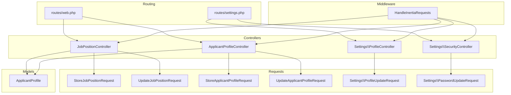
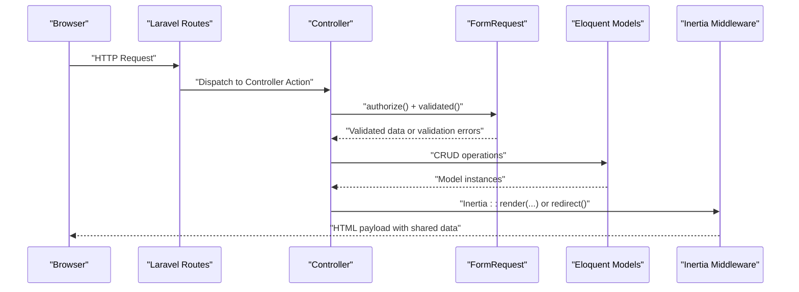
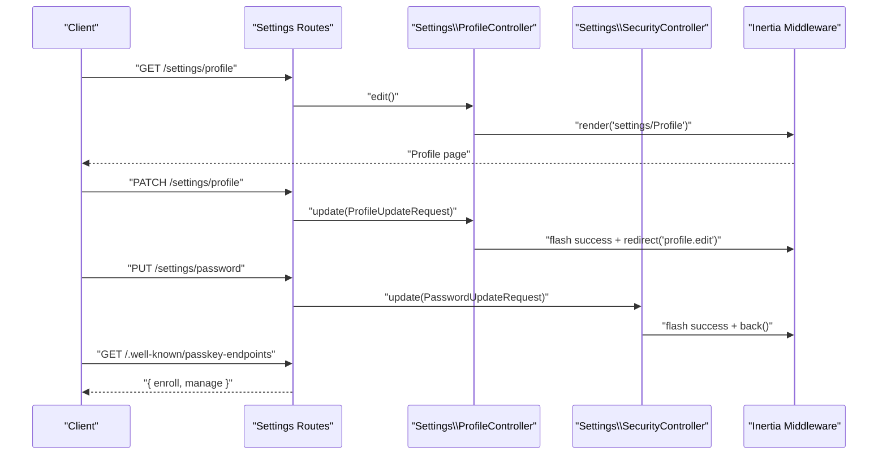
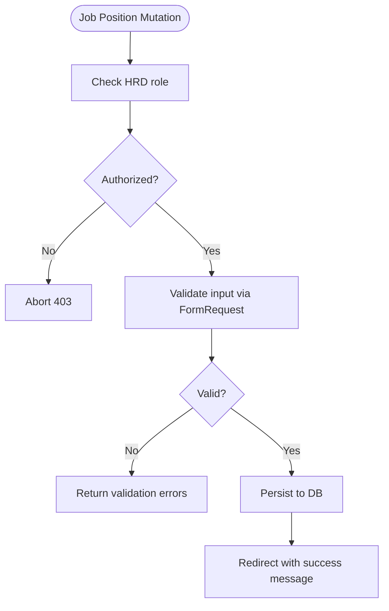
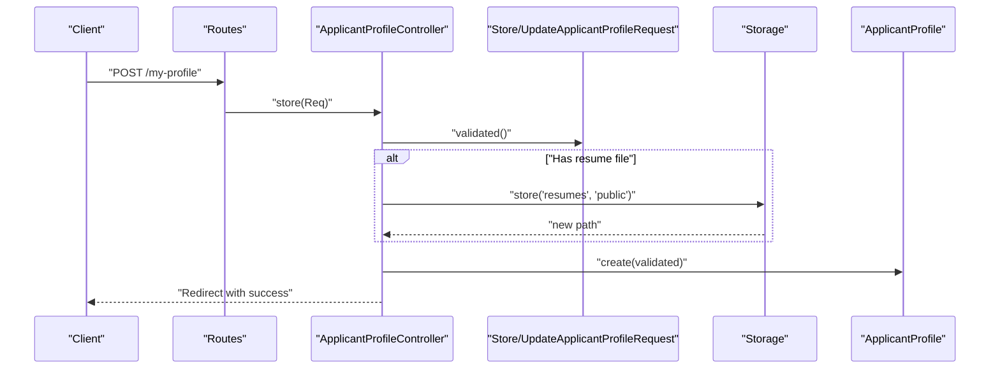
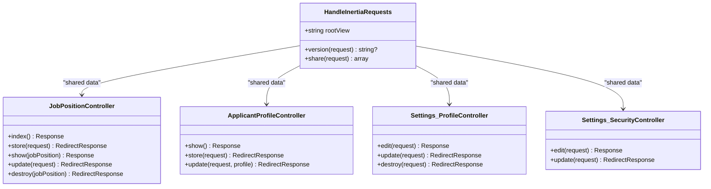
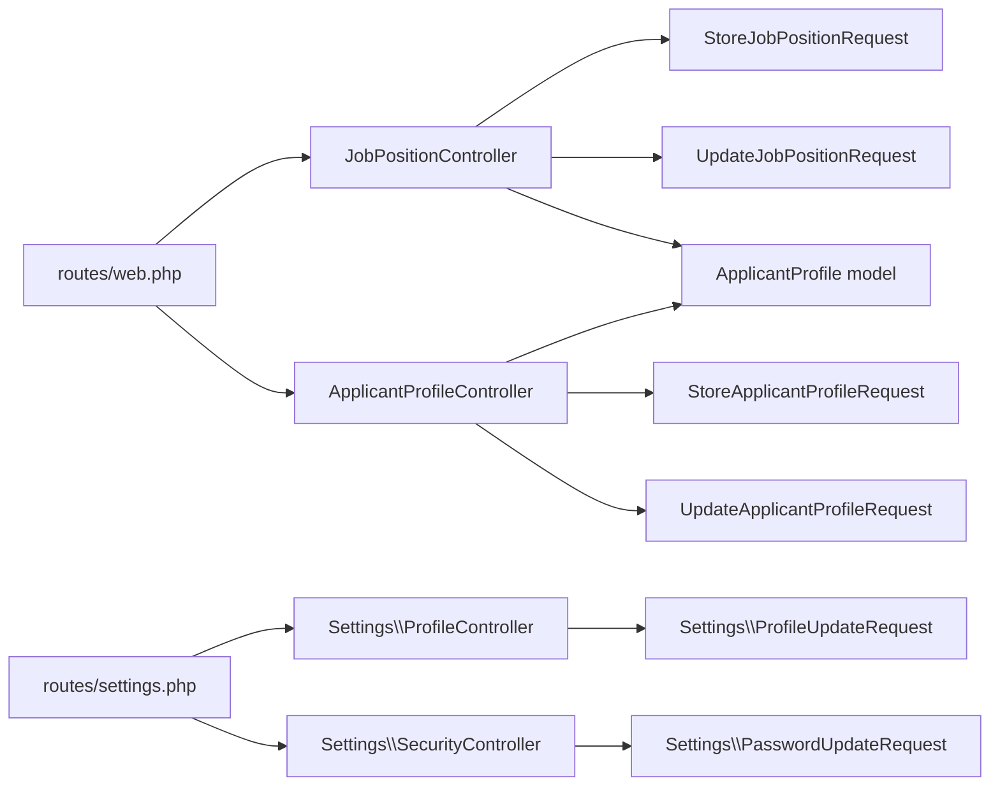

# API Reference

<cite>
**Referenced Files in This Document**
- [routes/web.php](file://routes/web.php)
- [routes/settings.php](file://routes/settings.php)
- [app/Http/Controllers/JobPositionController.php](file://app/Http/Controllers/JobPositionController.php)
- [app/Http/Controllers/ApplicantProfileController.php](file://app/Http/Controllers/ApplicantProfileController.php)
- [app/Http/Controllers/Settings/ProfileController.php](file://app/Http/Controllers/Settings/ProfileController.php)
- [app/Http/Controllers/Settings/SecurityController.php](file://app/Http/Controllers/Settings/SecurityController.php)
- [app/Http/Middleware/HandleInertiaRequests.php](file://app/Http/Middleware/HandleInertiaRequests.php)
- [app/Http/Requests/StoreJobPositionRequest.php](file://app/Http/Requests/StoreJobPositionRequest.php)
- [app/Http/Requests/UpdateJobPositionRequest.php](file://app/Http/Requests/UpdateJobPositionRequest.php)
- [app/Http/Requests/StoreApplicantProfileRequest.php](file://app/Http/Requests/StoreApplicantProfileRequest.php)
- [app/Http/Requests/UpdateApplicantProfileRequest.php](file://app/Http/Requests/UpdateApplicantProfileRequest.php)
- [app/Http/Requests/Settings/ProfileUpdateRequest.php](file://app/Http/Requests/Settings/ProfileUpdateRequest.php)
- [app/Http/Requests/Settings/PasswordUpdateRequest.php](file://app/Http/Requests/Settings/PasswordUpdateRequest.php)
- [app/Models/ApplicantProfile.php](file://app/Models/ApplicantProfile.php)
</cite>

## Table of Contents
1. [Introduction](#introduction)
2. [Project Structure](#project-structure)
3. [Core Components](#core-components)
4. [Architecture Overview](#architecture-overview)
5. [Detailed Component Analysis](#detailed-component-analysis)
6. [Dependency Analysis](#dependency-analysis)
7. [Performance Considerations](#performance-considerations)
8. [Troubleshooting Guide](#troubleshooting-guide)
9. [Conclusion](#conclusion)
10. [Appendices](#appendices)

## Introduction
This document describes the SmartRecruit ATS RESTful and SPA-like integration surface exposed via Laravel controllers and Inertia.js. It focuses on:
- Public and authenticated endpoints for job management, applicant profiles, authentication-related settings, and passkey discovery
- Request validation patterns and authorization rules
- Response formats and error handling strategies
- Frontend integration patterns using Inertia.js and Vue.js components
- Rate limiting, security headers, CORS, and API versioning considerations
- Practical examples of consuming the backend from the frontend

Note: The application primarily uses server-rendered pages with Inertia.js for seamless SPA-like navigation. True JSON REST APIs are not implemented; instead, controllers return Inertia responses and redirects. Where applicable, we document the underlying request shapes and validation rules that would inform a future REST API.

## Project Structure
Key areas relevant to the API surface:
- Routes define entry points and grouping by authentication and scope
- Controllers implement resource actions and handle uploads and permissions
- Requests encapsulate validation and authorization gates
- Middleware shares authenticated user data and manages asset versioning
- Models define persisted structures for job positions and applicant profiles

**Diagram sources**
- [routes/web.php:1-32](file://routes/web.php#L1-L32)
- [routes/settings.php:1-35](file://routes/settings.php#L1-L35)
- [app/Http/Controllers/JobPositionController.php:1-55](file://app/Http/Controllers/JobPositionController.php#L1-L55)
- [app/Http/Controllers/ApplicantProfileController.php:1-59](file://app/Http/Controllers/ApplicantProfileController.php#L1-L59)
- [app/Http/Controllers/Settings/ProfileController.php:1-63](file://app/Http/Controllers/Settings/ProfileController.php#L1-L63)
- [app/Http/Controllers/Settings/SecurityController.php:1-67](file://app/Http/Controllers/Settings/SecurityController.php#L1-L67)
- [app/Http/Middleware/HandleInertiaRequests.php:1-48](file://app/Http/Middleware/HandleInertiaRequests.php#L1-L48)
- [app/Http/Requests/StoreJobPositionRequest.php:1-34](file://app/Http/Requests/StoreJobPositionRequest.php#L1-L34)
- [app/Http/Requests/UpdateJobPositionRequest.php:1-34](file://app/Http/Requests/UpdateJobPositionRequest.php#L1-L34)
- [app/Http/Requests/StoreApplicantProfileRequest.php:1-34](file://app/Http/Requests/StoreApplicantProfileRequest.php#L1-L34)
- [app/Http/Requests/UpdateApplicantProfileRequest.php:1-34](file://app/Http/Requests/UpdateApplicantProfileRequest.php#L1-L34)
- [app/Http/Requests/Settings/ProfileUpdateRequest.php:1-23](file://app/Http/Requests/Settings/ProfileUpdateRequest.php#L1-L23)
- [app/Http/Requests/Settings/PasswordUpdateRequest.php:1-26](file://app/Http/Requests/Settings/PasswordUpdateRequest.php#L1-L26)
- [app/Models/ApplicantProfile.php:1-41](file://app/Models/ApplicantProfile.php#L1-L41)

**Section sources**
- [routes/web.php:1-32](file://routes/web.php#L1-L32)
- [routes/settings.php:1-35](file://routes/settings.php#L1-L35)
- [app/Http/Middleware/HandleInertiaRequests.php:1-48](file://app/Http/Middleware/HandleInertiaRequests.php#L1-L48)

## Core Components
- Authentication and Authorization
  - Authenticated routes require a verified session
  - HRD role required for job creation/update/delete
  - Applicant profile updates restricted to the profile owner
- Request Validation
  - Dedicated FormRequest classes enforce field presence, types, and constraints
  - Upload validation for resumes with allowed MIME types and max size
- Response Patterns
  - Controllers return Inertia::render for HTML pages or RedirectResponse for mutations
  - Settings controllers also flash toast notifications via Inertia

**Section sources**
- [routes/web.php:18-29](file://routes/web.php#L18-L29)
- [app/Http/Controllers/JobPositionController.php:44-48](file://app/Http/Controllers/JobPositionController.php#L44-L48)
- [app/Http/Controllers/ApplicantProfileController.php:40-42](file://app/Http/Controllers/ApplicantProfileController.php#L40-L42)
- [app/Http/Requests/StoreJobPositionRequest.php:13-16](file://app/Http/Requests/StoreJobPositionRequest.php#L13-L16)
- [app/Http/Requests/UpdateJobPositionRequest.php:13-16](file://app/Http/Requests/UpdateJobPositionRequest.php#L13-L16)
- [app/Http/Requests/StoreApplicantProfileRequest.php:23-32](file://app/Http/Requests/StoreApplicantProfileRequest.php#L23-L32)
- [app/Http/Requests/UpdateApplicantProfileRequest.php:23-32](file://app/Http/Requests/UpdateApplicantProfileRequest.php#L23-L32)

## Architecture Overview
SmartRecruit uses Inertia.js to render Vue.js pages on the server while controllers remain stateless and focused on data retrieval, mutation, and validation. The middleware shares authenticated context and app metadata to the frontend.

**Diagram sources**
- [routes/web.php:18-29](file://routes/web.php#L18-L29)
- [app/Http/Controllers/JobPositionController.php:14-27](file://app/Http/Controllers/JobPositionController.php#L14-L27)
- [app/Http/Controllers/ApplicantProfileController.php:24-36](file://app/Http/Controllers/ApplicantProfileController.php#L24-L36)
- [app/Http/Middleware/HandleInertiaRequests.php:36-46](file://app/Http/Middleware/HandleInertiaRequests.php#L36-L46)

## Detailed Component Analysis

### Authentication and Settings APIs
- Settings: Profile
  - GET /settings/profile → Inertia page with editable fields
  - PATCH /settings/profile → Update profile; flashes success toast
  - DELETE /settings/profile → Delete account; logs out and redirects
- Settings: Security
  - GET /settings/security → Inertia page with two-factor and passkey state
  - PUT /settings/password → Update password; throttled to 6 per 1 minute
  - GET /.well-known/passkey-endpoints → JSON discovery for passkeys

Authorization and validation:
- Profile update requires authenticated user; validation rules delegated to dedicated request class
- Password update validates current password and new password strength; throttled
- Passkey endpoints expose enrollment/manage URLs for WebAuthn passkeys

**Diagram sources**
- [routes/settings.php:8-27](file://routes/settings.php#L8-L27)
- [app/Http/Controllers/Settings/ProfileController.php:20-44](file://app/Http/Controllers/Settings/ProfileController.php#L20-L44)
- [app/Http/Controllers/Settings/SecurityController.php:19-65](file://app/Http/Controllers/Settings/SecurityController.php#L19-L65)
- [app/Http/Requests/Settings/ProfileUpdateRequest.php:18-21](file://app/Http/Requests/Settings/ProfileUpdateRequest.php#L18-L21)
- [app/Http/Requests/Settings/PasswordUpdateRequest.php:18-24](file://app/Http/Requests/Settings/PasswordUpdateRequest.php#L18-L24)

**Section sources**
- [routes/settings.php:8-27](file://routes/settings.php#L8-L27)
- [app/Http/Controllers/Settings/ProfileController.php:20-61](file://app/Http/Controllers/Settings/ProfileController.php#L20-L61)
- [app/Http/Controllers/Settings/SecurityController.php:19-65](file://app/Http/Controllers/Settings/SecurityController.php#L19-L65)
- [app/Http/Requests/Settings/ProfileUpdateRequest.php:18-21](file://app/Http/Requests/Settings/ProfileUpdateRequest.php#L18-L21)
- [app/Http/Requests/Settings/PasswordUpdateRequest.php:18-24](file://app/Http/Requests/Settings/PasswordUpdateRequest.php#L18-L24)

### Job Management API
- Resource routes for job positions under authenticated, verified users
- HRD role required for create/update/delete
- Index lists latest positions with creator eager-loaded
- Show loads creator relationship
- Store/Update use validated attributes from dedicated requests

Endpoints:
- GET /dashboard → Inertia dashboard (not a REST endpoint)
- GET /job-positions → List all job positions
- POST /job-positions → Create a new job position (HRD only)
- GET /job-positions/{jobPosition} → Show a single job position
- PUT/PATCH /job-positions/{jobPosition} → Update a job position (HRD only)
- DELETE /job-positions/{jobPosition} → Remove a job position (HRD only)

Validation rules:
- Required title and description
- Status must be one of open, closed, draft
- Requirements and benefits arrays optional

**Diagram sources**
- [routes/web.php:23](file://routes/web.php#L23)
- [app/Http/Controllers/JobPositionController.php:22-42](file://app/Http/Controllers/JobPositionController.php#L22-L42)
- [app/Http/Requests/StoreJobPositionRequest.php:23-32](file://app/Http/Requests/StoreJobPositionRequest.php#L23-L32)
- [app/Http/Requests/UpdateJobPositionRequest.php:23-32](file://app/Http/Requests/UpdateJobPositionRequest.php#L23-L32)

**Section sources**
- [routes/web.php:23](file://routes/web.php#L23)
- [app/Http/Controllers/JobPositionController.php:14-53](file://app/Http/Controllers/JobPositionController.php#L14-L53)
- [app/Http/Requests/StoreJobPositionRequest.php:23-32](file://app/Http/Requests/StoreJobPositionRequest.php#L23-L32)
- [app/Http/Requests/UpdateJobPositionRequest.php:23-32](file://app/Http/Requests/UpdateJobPositionRequest.php#L23-L32)

### Applicant Profiles API
- Routes for viewing and editing the authenticated user’s profile
- Supports resume upload with validation and replaces previous file if present
- Owner-only update enforcement via controller guard

Endpoints:
- GET /my-profile → View current profile
- POST /my-profile → Create profile (upload resume if provided)
- PUT /my-profile/{applicantProfile} → Update profile; optional resume replacement

Validation rules:
- Resume file optional, up to 2MB, allowed MIME types pdf, doc, docx
- Skills, experience, education, portfolio_urls arrays optional

**Diagram sources**
- [routes/web.php:26-28](file://routes/web.php#L26-L28)
- [app/Http/Controllers/ApplicantProfileController.php:24-36](file://app/Http/Controllers/ApplicantProfileController.php#L24-L36)
- [app/Http/Requests/StoreApplicantProfileRequest.php:23-32](file://app/Http/Requests/StoreApplicantProfileRequest.php#L23-L32)
- [app/Http/Requests/UpdateApplicantProfileRequest.php:23-32](file://app/Http/Requests/UpdateApplicantProfileRequest.php#L23-L32)

**Section sources**
- [routes/web.php:26-28](file://routes/web.php#L26-L28)
- [app/Http/Controllers/ApplicantProfileController.php:15-57](file://app/Http/Controllers/ApplicantProfileController.php#L15-L57)
- [app/Http/Requests/StoreApplicantProfileRequest.php:23-32](file://app/Http/Requests/StoreApplicantProfileRequest.php#L23-L32)
- [app/Http/Requests/UpdateApplicantProfileRequest.php:23-32](file://app/Http/Requests/UpdateApplicantProfileRequest.php#L23-L32)

### Frontend Integration with Inertia.js and Vue.js
- Root template and shared data
  - Root view configured for initial page load
  - Shared data includes app name, authenticated user, and sidebar state cookie
- Page rendering
  - Controllers return Inertia::render with page-specific props
  - Frontend Vue components consume props and trigger form submissions
- Flash messages
  - Controllers flash toast notifications for successful updates
  - Frontend composable utilities can display flash messages

**Diagram sources**
- [app/Http/Middleware/HandleInertiaRequests.php:8-46](file://app/Http/Middleware/HandleInertiaRequests.php#L8-L46)
- [app/Http/Controllers/JobPositionController.php:12-54](file://app/Http/Controllers/JobPositionController.php#L12-L54)
- [app/Http/Controllers/ApplicantProfileController.php:13-58](file://app/Http/Controllers/ApplicantProfileController.php#L13-L58)
- [app/Http/Controllers/Settings/ProfileController.php:15-62](file://app/Http/Controllers/Settings/ProfileController.php#L15-L62)
- [app/Http/Controllers/Settings/SecurityController.php:14-66](file://app/Http/Controllers/Settings/SecurityController.php#L14-L66)

**Section sources**
- [app/Http/Middleware/HandleInertiaRequests.php:36-46](file://app/Http/Middleware/HandleInertiaRequests.php#L36-L46)
- [app/Http/Controllers/JobPositionController.php:14-35](file://app/Http/Controllers/JobPositionController.php#L14-L35)
- [app/Http/Controllers/ApplicantProfileController.php:17-21](file://app/Http/Controllers/ApplicantProfileController.php#L17-L21)
- [app/Http/Controllers/Settings/ProfileController.php:20-43](file://app/Http/Controllers/Settings/ProfileController.php#L20-L43)

## Dependency Analysis
- Controllers depend on:
  - FormRequest classes for validation and authorization
  - Eloquent models for persistence
  - Inertia for page rendering and shared data
- Routes group endpoints by authentication and scope
- Settings routes include throttling and passkey discovery

**Diagram sources**
- [routes/web.php:18-29](file://routes/web.php#L18-L29)
- [routes/settings.php:8-27](file://routes/settings.php#L8-L27)
- [app/Http/Controllers/JobPositionController.php:5-10](file://app/Http/Controllers/JobPositionController.php#L5-L10)
- [app/Http/Controllers/ApplicantProfileController.php:5-11](file://app/Http/Controllers/ApplicantProfileController.php#L5-L11)
- [app/Http/Controllers/Settings/ProfileController.php:6-13](file://app/Http/Controllers/Settings/ProfileController.php#L6-L13)
- [app/Http/Controllers/Settings/SecurityController.php:6-12](file://app/Http/Controllers/Settings/SecurityController.php#L6-L12)
- [app/Models/ApplicantProfile.php:10-40](file://app/Models/ApplicantProfile.php#L10-L40)

**Section sources**
- [routes/web.php:18-29](file://routes/web.php#L18-L29)
- [routes/settings.php:8-27](file://routes/settings.php#L8-L27)
- [app/Http/Controllers/JobPositionController.php:5-10](file://app/Http/Controllers/JobPositionController.php#L5-L10)
- [app/Http/Controllers/ApplicantProfileController.php:5-11](file://app/Http/Controllers/ApplicantProfileController.php#L5-L11)
- [app/Http/Controllers/Settings/ProfileController.php:6-13](file://app/Http/Controllers/Settings/ProfileController.php#L6-L13)
- [app/Http/Controllers/Settings/SecurityController.php:6-12](file://app/Http/Controllers/Settings/SecurityController.php#L6-L12)
- [app/Models/ApplicantProfile.php:10-40](file://app/Models/ApplicantProfile.php#L10-L40)

## Performance Considerations
- Eager loading
  - Job listing and show load creator relationship to avoid N+1 queries
- File uploads
  - Resume uploads stored on public disk; ensure appropriate storage limits and cleanup policies
- Redirect after mutation
  - Controllers return redirects after create/update to prevent duplicate submissions and reduce payload sizes

**Section sources**
- [app/Http/Controllers/JobPositionController.php:16-31](file://app/Http/Controllers/JobPositionController.php#L16-L31)
- [app/Http/Controllers/ApplicantProfileController.php:28-33](file://app/Http/Controllers/ApplicantProfileController.php#L28-L33)

## Troubleshooting Guide
Common issues and resolutions:
- Unauthorized Access
  - HRD role required for job management mutations; otherwise 403
  - Profile updates restricted to owner; otherwise 403
- Validation Failures
  - Resume must match allowed MIME types and size; adjust client uploads accordingly
  - Job position status must be one of open, closed, draft
- Rate Limiting
  - Password updates throttled to 6 per 1 minute; retry after window closes
- Redirect Loops
  - After successful mutations, controllers redirect back or to named routes; ensure frontend respects redirects

**Section sources**
- [app/Http/Controllers/JobPositionController.php:44-48](file://app/Http/Controllers/JobPositionController.php#L44-L48)
- [app/Http/Controllers/ApplicantProfileController.php:40-42](file://app/Http/Controllers/ApplicantProfileController.php#L40-L42)
- [routes/settings.php:22-24](file://routes/settings.php#L22-L24)
- [app/Http/Requests/StoreApplicantProfileRequest.php:25-26](file://app/Http/Requests/StoreApplicantProfileRequest.php#L25-L26)
- [app/Http/Requests/StoreJobPositionRequest.php:25-28](file://app/Http/Requests/StoreJobPositionRequest.php#L25-L28)

## Conclusion
SmartRecruit ATS exposes a cohesive set of authenticated endpoints integrated with Inertia.js and Vue.js. While not a traditional JSON REST API, the controllers and requests define clear contracts for data shape, validation, and authorization. The frontend consumes server-rendered pages with shared context, enabling SPA-like navigation and robust user experiences.

## Appendices

### Endpoint Reference Summary
- Authentication and Settings
  - GET /settings/profile → Edit profile page
  - PATCH /settings/profile → Update profile
  - DELETE /settings/profile → Delete profile
  - GET /settings/security → Security settings page
  - PUT /settings/password → Update password (throttled)
  - GET /.well-known/passkey-endpoints → Passkey discovery
- Job Management
  - GET /job-positions → List positions
  - POST /job-positions → Create position (HRD)
  - GET /job-positions/{id} → Show position
  - PUT/PATCH /job-positions/{id} → Update position (HRD)
  - DELETE /job-positions/{id} → Delete position (HRD)
- Applicant Profiles
  - GET /my-profile → View profile
  - POST /my-profile → Create profile
  - PUT /my-profile/{id} → Update profile (owner)

### Request Validation and Authorization Rules
- Job Positions
  - Create: HRD role required; title, description, status required
  - Update: HRD role required; status often required; others optional
- Applicant Profiles
  - Resume optional; allowed types and size enforced
  - Arrays for skills, experience, education, portfolio_urls optional
- Settings
  - Profile update: delegated to dedicated request rules
  - Password update: validates current and new password strength

**Section sources**
- [app/Http/Requests/StoreJobPositionRequest.php:13-32](file://app/Http/Requests/StoreJobPositionRequest.php#L13-L32)
- [app/Http/Requests/UpdateJobPositionRequest.php:13-32](file://app/Http/Requests/UpdateJobPositionRequest.php#L13-L32)
- [app/Http/Requests/StoreApplicantProfileRequest.php:23-32](file://app/Http/Requests/StoreApplicantProfileRequest.php#L23-L32)
- [app/Http/Requests/UpdateApplicantProfileRequest.php:23-32](file://app/Http/Requests/UpdateApplicantProfileRequest.php#L23-L32)
- [app/Http/Requests/Settings/ProfileUpdateRequest.php:18-21](file://app/Http/Requests/Settings/ProfileUpdateRequest.php#L18-L21)
- [app/Http/Requests/Settings/PasswordUpdateRequest.php:18-24](file://app/Http/Requests/Settings/PasswordUpdateRequest.php#L18-L24)

### Response Formatting and Error Handling
- Successful mutations return redirects with success messages
- Validation failures are handled by FormRequest classes; errors are surfaced to the frontend
- Throttling applies to sensitive operations (e.g., password updates)

**Section sources**
- [app/Http/Controllers/Settings/SecurityController.php:56-65](file://app/Http/Controllers/Settings/SecurityController.php#L56-L65)
- [routes/settings.php:22-24](file://routes/settings.php#L22-L24)

### Rate Limiting, Security Headers, and CORS
- Rate limiting
  - Password updates: 6 attempts per 1 minute
- Security headers
  - Configure in web server or framework middleware as needed
- CORS
  - Configure in web server or framework middleware as needed

**Section sources**
- [routes/settings.php:22-24](file://routes/settings.php#L22-L24)

### API Versioning, Backward Compatibility, and Deprecation
- Current implementation does not expose versioned endpoints
- Recommendations:
  - Prefix routes with version segments (e.g., /api/v1/)
  - Maintain backward-compatible endpoints during transitions
  - Announce deprecations with timelines and migration guides

[No sources needed since this section provides general guidance]

### Client-Side Integration Patterns, State Management, and Real-Time Updates
- Integration patterns
  - Use Inertia forms and submit handlers to call server endpoints
  - Consume shared data from middleware for consistent UX
- State management
  - Leverage Inertia shared props and flash messages for transient state
- Real-time updates
  - Not implemented in current codebase; consider WebSocket or polling for live features

**Section sources**
- [app/Http/Middleware/HandleInertiaRequests.php:36-46](file://app/Http/Middleware/HandleInertiaRequests.php#L36-L46)