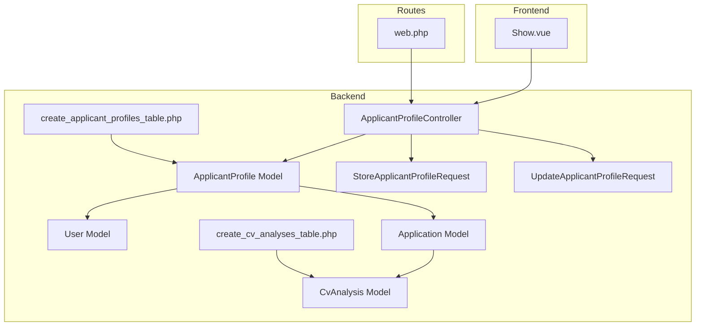
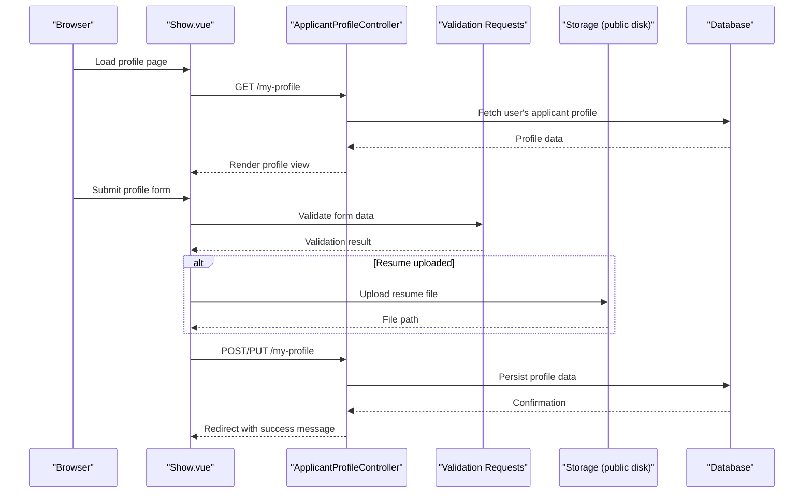
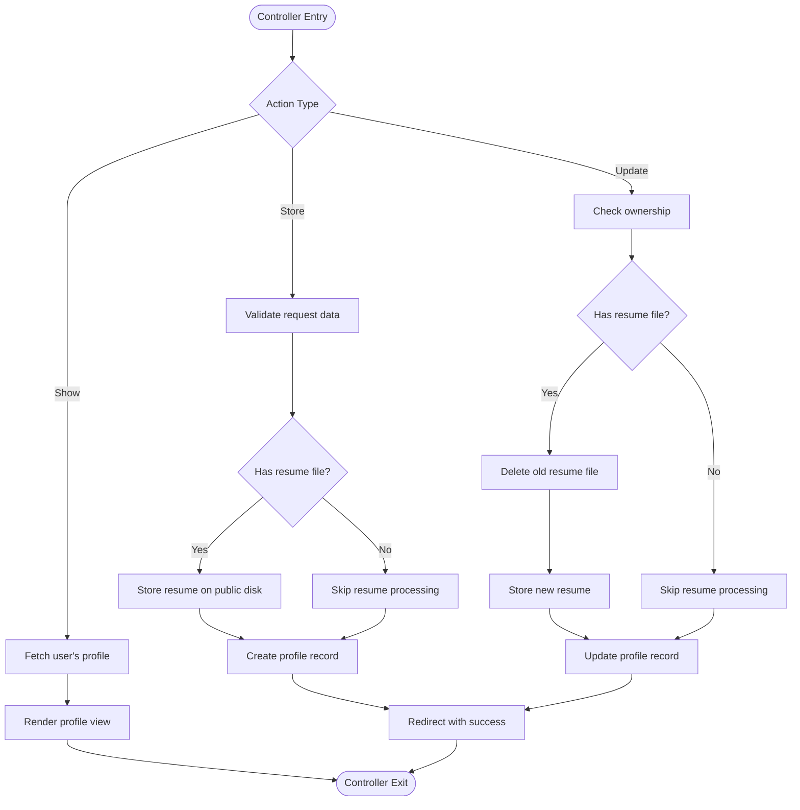
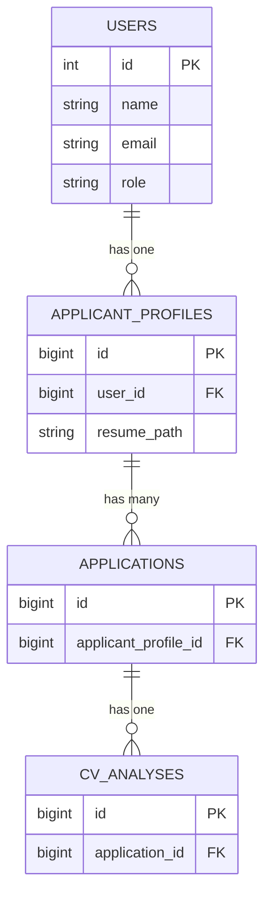
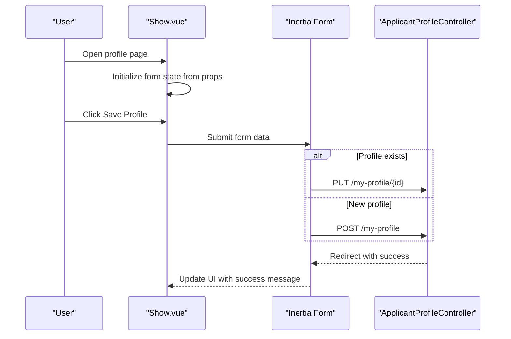
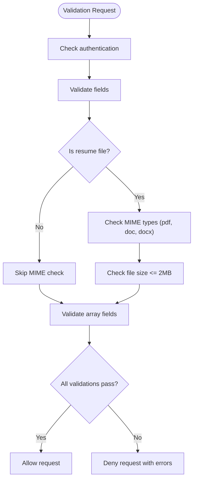
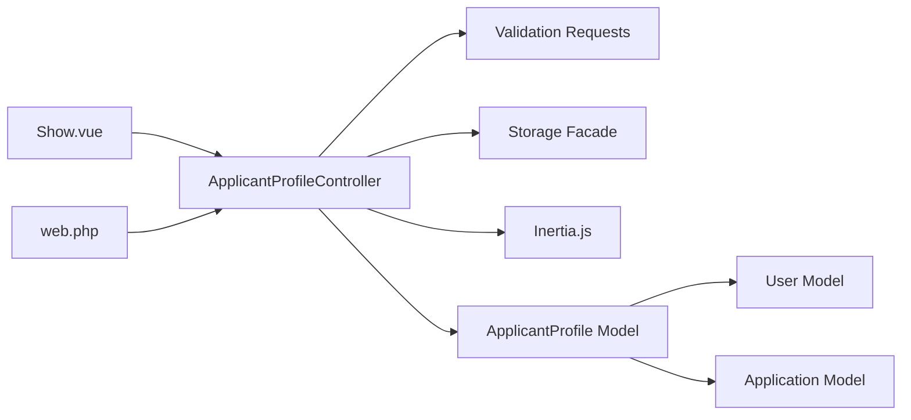

# Applicant Profile Management

<cite>
**Referenced Files in This Document**
- [ApplicantProfileController.php](file://app/Http/Controllers/ApplicantProfileController.php)
- [ApplicantProfile.php](file://app/Models/ApplicantProfile.php)
- [User.php](file://app/Models/User.php)
- [Application.php](file://app/Models/Application.php)
- [CvAnalysis.php](file://app/Models/CvAnalysis.php)
- [create_applicant_profiles_table.php](file://database/migrations/2026_06_24_164755_create_applicant_profiles_table.php)
- [create_cv_analyses_table.php](file://database/migrations/2026_06_24_164756_create_cv_analyses_table.php)
- [StoreApplicantProfileRequest.php](file://app/Http/Requests/StoreApplicantProfileRequest.php)
- [UpdateApplicantProfileRequest.php](file://app/Http/Requests/UpdateApplicantProfileRequest.php)
- [web.php](file://routes/web.php)
- [Show.vue](file://resources/js/pages/ApplicantProfiles/Show.vue)
- [ApplicantProfileTest.php](file://tests/Feature/ApplicantProfileTest.php)
</cite>

## Table of Contents
1. [Introduction](#introduction)
2. [Project Structure](#project-structure)
3. [Core Components](#core-components)
4. [Architecture Overview](#architecture-overview)
5. [Detailed Component Analysis](#detailed-component-analysis)
6. [Dependency Analysis](#dependency-analysis)
7. [Performance Considerations](#performance-considerations)
8. [Security and Privacy Considerations](#security-and-privacy-considerations)
9. [Troubleshooting Guide](#troubleshooting-guide)
10. [Conclusion](#conclusion)

## Introduction
This document provides comprehensive documentation for the applicant profile management functionality in the SmartRecruit ATS system. It covers the complete lifecycle of candidate profile creation, updates, and persistence, including resume upload handling, file storage integration, and security considerations. The document explains the skills tracking system using JSONB data structures for flexible skill categorization and proficiency levels, details the relationship between User accounts and ApplicantProfile records, and outlines practical examples of profile completion workflows, skill matching algorithms, and candidate data enrichment processes. Additionally, it documents the frontend Vue.js components for profile management, form validation, and user interface patterns, along with data privacy considerations and candidate consent management.

## Project Structure
The applicant profile management feature spans backend controllers and models, frontend Vue components, database migrations, and validation requests. The key components are organized as follows:

- Backend Controllers: ApplicantProfileController handles profile creation, updates, and retrieval via Inertia.js responses.
- Models: ApplicantProfile defines the profile schema with JSONB fields for skills, experience, education, and portfolio URLs, and maintains relationships with User and Application.
- Database Migrations: Define the applicant_profiles and cv_analyses tables with JSONB columns for flexible data structures.
- Validation Requests: StoreApplicantProfileRequest and UpdateApplicantProfileRequest enforce file upload constraints and field validation.
- Frontend: Show.vue provides the user interface for profile management with form submission handling.
- Routes: web.php registers the profile management endpoints under the authenticated and verified middleware group.

**Diagram sources**
- [ApplicantProfileController.php:1-59](file://app/Http/Controllers/ApplicantProfileController.php#L1-L59)
- [ApplicantProfile.php:1-41](file://app/Models/ApplicantProfile.php#L1-L41)
- [User.php:1-62](file://app/Models/User.php#L1-L62)
- [Application.php:1-42](file://app/Models/Application.php#L1-L42)
- [CvAnalysis.php:1-38](file://app/Models/CvAnalysis.php#L1-L38)
- [create_applicant_profiles_table.php:1-34](file://database/migrations/2026_06_24_164755_create_applicant_profiles_table.php#L1-L34)
- [create_cv_analyses_table.php:1-35](file://database/migrations/2026_06_24_164756_create_cv_analyses_table.php#L1-L35)
- [StoreApplicantProfileRequest.php:1-34](file://app/Http/Requests/StoreApplicantProfileRequest.php#L1-L34)
- [UpdateApplicantProfileRequest.php:1-34](file://app/Http/Requests/UpdateApplicantProfileRequest.php#L1-L34)
- [web.php:1-32](file://routes/web.php#L1-L32)
- [Show.vue:1-117](file://resources/js/pages/ApplicantProfiles/Show.vue#L1-L117)

**Section sources**
- [ApplicantProfileController.php:1-59](file://app/Http/Controllers/ApplicantProfileController.php#L1-L59)
- [ApplicantProfile.php:1-41](file://app/Models/ApplicantProfile.php#L1-L41)
- [User.php:1-62](file://app/Models/User.php#L1-L62)
- [Application.php:1-42](file://app/Models/Application.php#L1-L42)
- [CvAnalysis.php:1-38](file://app/Models/CvAnalysis.php#L1-L38)
- [create_applicant_profiles_table.php:1-34](file://database/migrations/2026_06_24_164755_create_applicant_profiles_table.php#L1-L34)
- [create_cv_analyses_table.php:1-35](file://database/migrations/2026_06_24_164756_create_cv_analyses_table.php#L1-L35)
- [StoreApplicantProfileRequest.php:1-34](file://app/Http/Requests/StoreApplicantProfileRequest.php#L1-L34)
- [UpdateApplicantProfileRequest.php:1-34](file://app/Http/Requests/UpdateApplicantProfileRequest.php#L1-L34)
- [web.php:1-32](file://routes/web.php#L1-L32)
- [Show.vue:1-117](file://resources/js/pages/ApplicantProfiles/Show.vue#L1-L117)

## Core Components
This section details the core components involved in applicant profile management:

- ApplicantProfileController: Handles GET/POST/PUT requests for profile management, validates input, manages file uploads, and persists data to the database.
- ApplicantProfile Model: Defines fillable attributes, JSON casting for skills, experience, education, and portfolio URLs, and establishes relationships with User and Application.
- User Model: Provides the hasOne relationship to ApplicantProfile and supports role-based access.
- Application and CvAnalysis Models: Support the broader ATS ecosystem by linking applications to CV analyses.
- Validation Requests: Enforce file type and size constraints for resumes and validate array fields for skills, experience, education, and portfolio URLs.
- Frontend Vue Component: Show.vue renders the profile form, binds form data, and submits to backend endpoints.

Key implementation highlights:
- File upload handling uses Laravel Storage with public disk for resume storage.
- JSONB casting enables flexible, schema-less data structures for skills and related arrays.
- Inertia.js integration provides seamless server-rendered responses for Vue components.

**Section sources**
- [ApplicantProfileController.php:1-59](file://app/Http/Controllers/ApplicantProfileController.php#L1-L59)
- [ApplicantProfile.php:1-41](file://app/Models/ApplicantProfile.php#L1-L41)
- [User.php:1-62](file://app/Models/User.php#L1-L62)
- [Application.php:1-42](file://app/Models/Application.php#L1-L42)
- [CvAnalysis.php:1-38](file://app/Models/CvAnalysis.php#L1-L38)
- [StoreApplicantProfileRequest.php:1-34](file://app/Http/Requests/StoreApplicantProfileRequest.php#L1-L34)
- [UpdateApplicantProfileRequest.php:1-34](file://app/Http/Requests/UpdateApplicantProfileRequest.php#L1-L34)
- [Show.vue:1-117](file://resources/js/pages/ApplicantProfiles/Show.vue#L1-L117)

## Architecture Overview
The applicant profile management architecture integrates frontend Vue components with backend Laravel controllers and models, utilizing Inertia.js for server-side rendering and seamless state management. The system employs JSONB columns for flexible data structures and secure file storage for resumes.

**Diagram sources**
- [web.php:25-28](file://routes/web.php#L25-L28)
- [ApplicantProfileController.php:15-57](file://app/Http/Controllers/ApplicantProfileController.php#L15-L57)
- [StoreApplicantProfileRequest.php:1-34](file://app/Http/Requests/StoreApplicantProfileRequest.php#L1-L34)
- [UpdateApplicantProfileRequest.php:1-34](file://app/Http/Requests/UpdateApplicantProfileRequest.php#L1-L34)
- [Show.vue:23-33](file://resources/js/pages/ApplicantProfiles/Show.vue#L23-L33)

## Detailed Component Analysis

### ApplicantProfileController Implementation
The controller orchestrates profile operations with robust validation and file handling:

- show(): Retrieves the authenticated user's profile and renders the frontend view.
- store(): Validates incoming data, processes optional resume uploads, creates a new profile record, and redirects with a success message.
- update(): Ensures ownership, deletes previous resume if present, stores new resume, updates profile fields, and redirects with a success message.

Security and validation enforcement:
- Ownership check prevents unauthorized profile updates.
- File upload validation restricts resume types to PDF, DOC, and DOCX with a maximum size of 2MB.
- Array validation ensures skills, experience, education, and portfolio URLs are properly formatted.

Data persistence strategies:
- Uses Eloquent create() for initial profile creation.
- Updates existing records atomically with validated data.
- Stores resume paths in the database for later retrieval.

**Diagram sources**
- [ApplicantProfileController.php:15-57](file://app/Http/Controllers/ApplicantProfileController.php#L15-L57)

**Section sources**
- [ApplicantProfileController.php:1-59](file://app/Http/Controllers/ApplicantProfileController.php#L1-L59)

### ApplicantProfile Model and Database Schema
The ApplicantProfile model defines the data structure and relationships:

- Fillable attributes include user_id, resume_path, skills, experience, education, and portfolio_urls.
- JSON casting converts skills, experience, education, and portfolio_urls to arrays for convenient manipulation.
- Relationships:
  - belongsTo(User): Links profiles to users.
  - hasMany(Application): Supports application tracking.

Database schema (JSONB columns):
- applicant_profiles table includes foreign key user_id, nullable resume_path, and JSONB columns for skills, experience, education, and portfolio_urls.
- cv_analyses table includes JSONB columns for skill_match, experience_match, education_match, and raw_ai_response, supporting AI-driven candidate evaluation.

**Diagram sources**
- [create_applicant_profiles_table.php:14-22](file://database/migrations/2026_06_24_164755_create_applicant_profiles_table.php#L14-L22)
- [create_cv_analyses_table.php:14-23](file://database/migrations/2026_06_24_164756_create_cv_analyses_table.php#L14-L23)
- [ApplicantProfile.php:31-39](file://app/Models/ApplicantProfile.php#L31-L39)
- [Application.php:27-39](file://app/Models/Application.php#L27-L39)
- [CvAnalysis.php:33-35](file://app/Models/CvAnalysis.php#L33-L35)

**Section sources**
- [ApplicantProfile.php:1-41](file://app/Models/ApplicantProfile.php#L1-L41)
- [create_applicant_profiles_table.php:1-34](file://database/migrations/2026_06_24_164755_create_applicant_profiles_table.php#L1-L34)
- [create_cv_analyses_table.php:1-35](file://database/migrations/2026_06_24_164756_create_cv_analyses_table.php#L1-L35)

### Frontend Vue Component: Show.vue
The frontend component provides a user-friendly interface for managing candidate profiles:

- Props: Receives profile data including id, resume_path, skills, experience, education, and portfolio_urls.
- Form state: Uses Inertia's useForm to manage form data and submission.
- Submission logic: Determines whether to POST for new profiles or PUT for updates based on profile existence.
- UI patterns: Displays file upload controls, textarea inputs for skills and experience, and a submit button with processing state feedback.

Form validation and submission:
- Integrates with backend validation requests to ensure data integrity.
- Submits via Inertia's form helpers, preserving scroll position and handling processing states.

**Diagram sources**
- [Show.vue:23-33](file://resources/js/pages/ApplicantProfiles/Show.vue#L23-L33)
- [web.php:25-28](file://routes/web.php#L25-L28)
- [ApplicantProfileController.php:24-57](file://app/Http/Controllers/ApplicantProfileController.php#L24-L57)

**Section sources**
- [Show.vue:1-117](file://resources/js/pages/ApplicantProfiles/Show.vue#L1-L117)

### Validation Requests: StoreApplicantProfileRequest and UpdateApplicantProfileRequest
These validation classes enforce data integrity:

- Authorization: Requires authenticated users for both store and update operations.
- File validation: Restricts resume uploads to PDF, DOC, and DOCX with a maximum size of 2MB.
- Array validation: Ensures skills, experience, education, and portfolio_urls are arrays when provided.

**Diagram sources**
- [StoreApplicantProfileRequest.php:13-31](file://app/Http/Requests/StoreApplicantProfileRequest.php#L13-L31)
- [UpdateApplicantProfileRequest.php:13-31](file://app/Http/Requests/UpdateApplicantProfileRequest.php#L13-L31)

**Section sources**
- [StoreApplicantProfileRequest.php:1-34](file://app/Http/Requests/StoreApplicantProfileRequest.php#L1-L34)
- [UpdateApplicantProfileRequest.php:1-34](file://app/Http/Requests/UpdateApplicantProfileRequest.php#L1-L34)

### Practical Examples: Profile Completion Workflows
Common workflows for profile completion and updates:

- Initial profile creation:
  - User accesses /my-profile and fills skills, experience, and education.
  - Optional resume upload is processed and stored.
  - POST /my-profile persists the profile and redirects with success.

- Updating existing profiles:
  - User modifies skills or experience and optionally replaces the resume.
  - PUT /my-profile/{id} updates the profile, replacing the old resume if provided.
  - Redirects with success message.

- Data synchronization:
  - Profile updates cascade to related Application and CvAnalysis records through established relationships.

**Section sources**
- [web.php:25-28](file://routes/web.php#L25-L28)
- [ApplicantProfileController.php:24-57](file://app/Http/Controllers/ApplicantProfileController.php#L24-L57)
- [ApplicantProfileTest.php:6-32](file://tests/Feature/ApplicantProfileTest.php#L6-L32)

### Skills Tracking System: JSONB Data Structures
Skills tracking utilizes JSONB columns for flexibility:

- Skills array: Stores skill entries with optional proficiency metadata.
- Experience and Education arrays: Capture timeline-based information.
- Portfolio URLs: Maintains external links for work samples.

Benefits:
- Schema-less design accommodates diverse skill categories and structures.
- Efficient querying and filtering supported by JSONB capabilities.
- Easy expansion without altering database schema.

**Section sources**
- [ApplicantProfile.php:21-29](file://app/Models/ApplicantProfile.php#L21-L29)
- [create_applicant_profiles_table.php:18-21](file://database/migrations/2026_06_24_164755_create_applicant_profiles_table.php#L18-L21)

### Relationship Between User Accounts and ApplicantProfile Records
User and profile relationships:

- One-to-one relationship: Each User has one ApplicantProfile.
- Foreign key constraint: applicant_profiles.user_id references users.id with cascade delete.
- Access patterns: Profiles are accessed via auth()->user()->applicantProfile.

Data synchronization:
- Profile updates reflect immediately in related Application and CvAnalysis records.
- Role-based access ensures candidates can manage their own profiles.

**Section sources**
- [User.php:52-55](file://app/Models/User.php#L52-L55)
- [ApplicantProfile.php:31-34](file://app/Models/ApplicantProfile.php#L31-L34)
- [create_applicant_profiles_table.php:16-17](file://database/migrations/2026_06_24_164755_create_applicant_profiles_table.php#L16-L17)

### Candidate Data Enrichment Processes
Data enrichment leverages AI analysis:

- CvAnalysis model captures AI-generated insights including overall_score, skill_match, experience_match, education_match, recommendation, reasoning, and raw_ai_response.
- JSONB columns support structured AI outputs for downstream processing and reporting.
- Applications link to CvAnalysis for comprehensive candidate evaluation.

**Section sources**
- [CvAnalysis.php:11-30](file://app/Models/CvAnalysis.php#L11-L30)
- [create_cv_analyses_table.php:14-23](file://database/migrations/2026_06_24_164756_create_cv_analyses_table.php#L14-L23)
- [Application.php:37-40](file://app/Models/Application.php#L37-L40)

## Dependency Analysis
The system exhibits clear separation of concerns with minimal coupling:

- Controller depends on:
  - Validation requests for input sanitization.
  - Storage facade for file handling.
  - Inertia for rendering.
- Model depends on:
  - Eloquent relationships for data association.
  - JSON casting for flexible data structures.
- Frontend depends on:
  - Inertia form helpers for seamless state management.
  - Route definitions for endpoint binding.

Potential circular dependencies:
- None observed between controllers, models, and views.

External dependencies:
- Laravel Storage (Flysystem) for file system abstraction.
- Inertia.js for frontend-backend integration.

**Diagram sources**
- [ApplicantProfileController.php:1-59](file://app/Http/Controllers/ApplicantProfileController.php#L1-L59)
- [StoreApplicantProfileRequest.php:1-34](file://app/Http/Requests/StoreApplicantProfileRequest.php#L1-L34)
- [UpdateApplicantProfileRequest.php:1-34](file://app/Http/Requests/UpdateApplicantProfileRequest.php#L1-L34)
- [Show.vue:1-117](file://resources/js/pages/ApplicantProfiles/Show.vue#L1-L117)
- [web.php:25-28](file://routes/web.php#L25-L28)

**Section sources**
- [ApplicantProfileController.php:1-59](file://app/Http/Controllers/ApplicantProfileController.php#L1-L59)
- [ApplicantProfile.php:1-41](file://app/Models/ApplicantProfile.php#L1-L41)
- [User.php:1-62](file://app/Models/User.php#L1-L62)
- [Application.php:1-42](file://app/Models/Application.php#L1-L42)
- [Show.vue:1-117](file://resources/js/pages/ApplicantProfiles/Show.vue#L1-L117)
- [web.php:1-32](file://routes/web.php#L1-L32)

## Performance Considerations
- File storage: Using public disk with hashed filenames improves scalability and avoids path traversal risks.
- JSONB queries: Leverage appropriate indexing strategies for frequently queried JSONB fields.
- Frontend efficiency: Minimize re-renders by using reactive form state and avoiding unnecessary computed properties.
- Backend efficiency: Use eager loading for related models when fetching profiles to prevent N+1 queries.

## Security and Privacy Considerations
- File upload security:
  - Validate MIME types and enforce size limits.
  - Store files on public disk with hashed names to prevent predictable paths.
  - Do not trust original filenames; sanitize and rename uploaded files.
  - Ensure secure access control so only authorized users can view resumes.
- Data privacy:
  - Implement role-based access control to restrict profile modifications.
  - Consider candidate consent mechanisms for data processing and AI analysis.
  - Audit logs for profile changes and CV analysis access.
- Consent management:
  - Provide clear consent forms for AI-powered evaluations and data sharing.
  - Allow candidates to withdraw consent and delete personal data per applicable regulations.

## Troubleshooting Guide
Common issues and resolutions:

- Profile creation fails:
  - Verify authentication middleware is active and user is verified.
  - Check validation rules for resume file types and sizes.
  - Confirm database connectivity and migration status.

- Resume upload errors:
  - Ensure public disk is configured and writable.
  - Validate file permissions and storage path accessibility.
  - Review storage driver configuration for production environments.

- Ownership validation failures:
  - Confirm user_id matches the authenticated user for updates.
  - Check route model binding for ApplicantProfile resource.

- Frontend submission issues:
  - Verify Inertia form helpers are properly initialized.
  - Ensure route names match backend endpoints.

**Section sources**
- [ApplicantProfileController.php:40-42](file://app/Http/Controllers/ApplicantProfileController.php#L40-L42)
- [StoreApplicantProfileRequest.php:25-31](file://app/Http/Requests/StoreApplicantProfileRequest.php#L25-L31)
- [UpdateApplicantProfileRequest.php:25-31](file://app/Http/Requests/UpdateApplicantProfileRequest.php#L25-L31)
- [web.php:25-28](file://routes/web.php#L25-L28)

## Conclusion
The applicant profile management feature provides a robust foundation for candidate data handling within the SmartRecruit ATS system. It combines secure file storage, flexible JSONB data structures, and a clean frontend/backend integration via Inertia.js. The implementation emphasizes data integrity through validation, clear ownership checks, and scalable storage strategies. Future enhancements could include advanced skill matching algorithms, automated data enrichment, and expanded consent management features to further strengthen privacy and user experience.