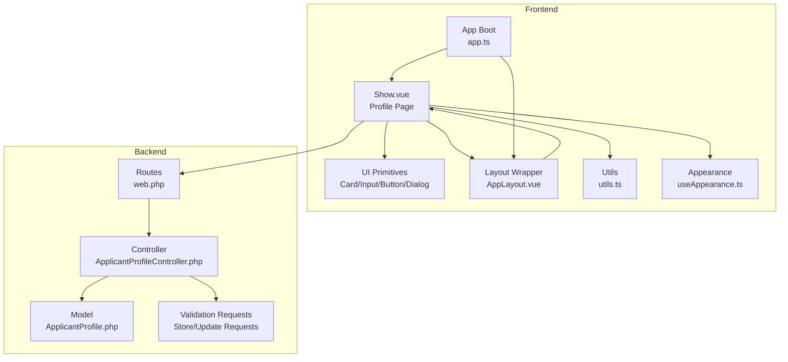
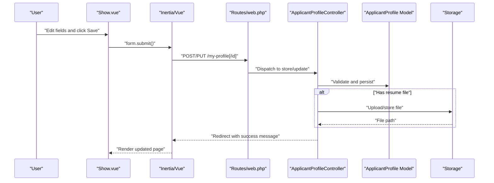
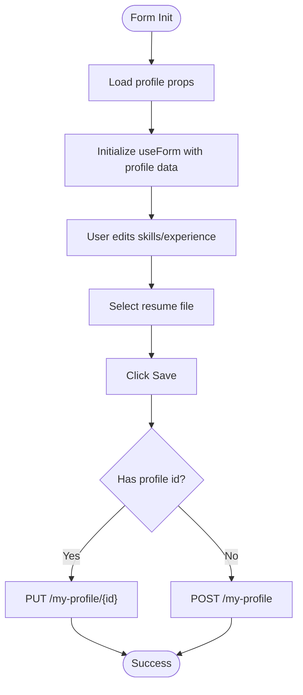
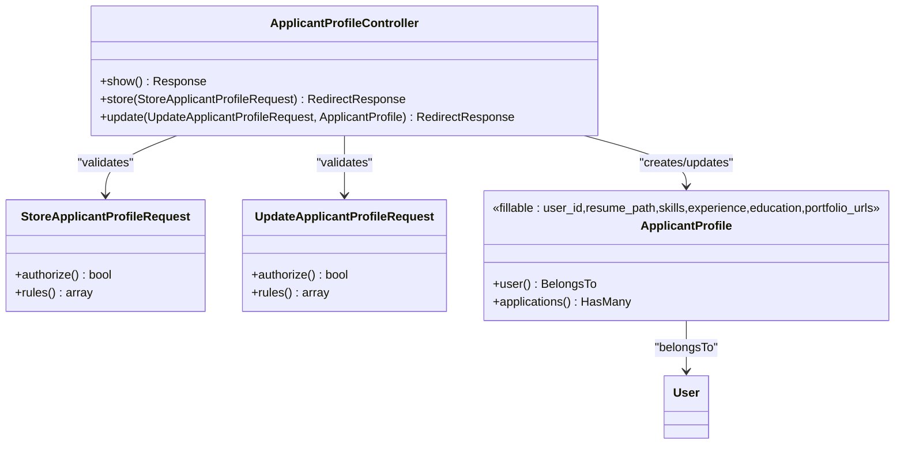
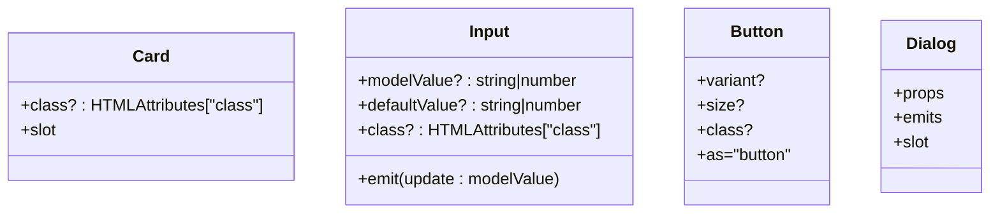
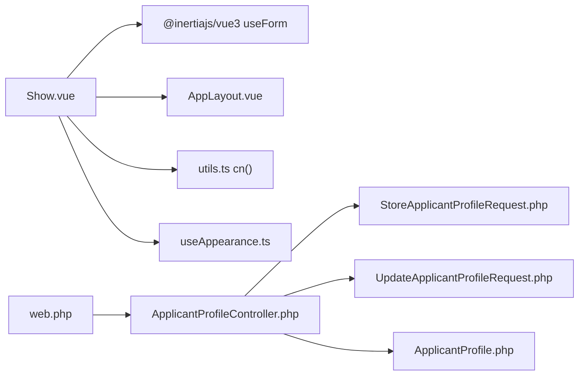
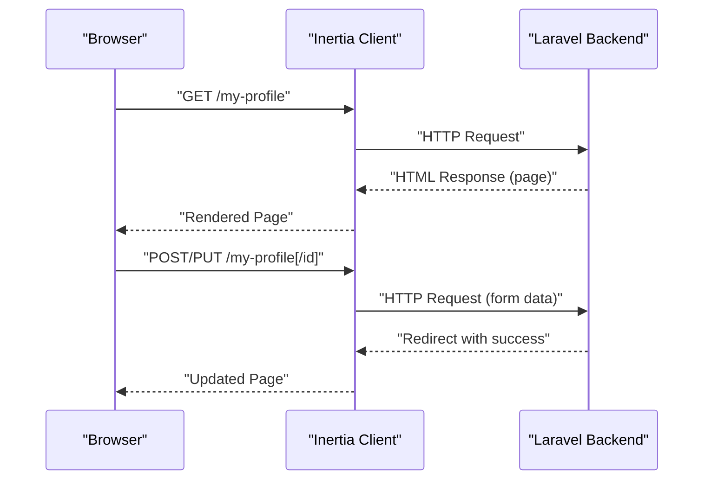

# Frontend Profile Components & UI

<cite>
**Referenced Files in This Document**
- [Show.vue](file://resources/js/pages/ApplicantProfiles/Show.vue)
- [ApplicantProfileController.php](file://app/Http/Controllers/ApplicantProfileController.php)
- [ApplicantProfile.php](file://app/Models/ApplicantProfile.php)
- [StoreApplicantProfileRequest.php](file://app/Http/Requests/StoreApplicantProfileRequest.php)
- [UpdateApplicantProfileRequest.php](file://app/Http/Requests/UpdateApplicantProfileRequest.php)
- [web.php](file://routes/web.php)
- [Card.vue](file://resources/js/components/ui/card/Card.vue)
- [Input.vue](file://resources/js/components/ui/input/Input.vue)
- [Button.vue](file://resources/js/components/ui/button/Button.vue)
- [Dialog.vue](file://resources/js/components/ui/dialog/Dialog.vue)
- [app.ts](file://resources/js/app.ts)
- [AppLayout.vue](file://resources/js/layouts/AppLayout.vue)
- [utils.ts](file://resources/js/lib/utils.ts)
- [useAppearance.ts](file://resources/js/composables/useAppearance.ts)
</cite>

## Table of Contents
1. [Introduction](#introduction)
2. [Project Structure](#project-structure)
3. [Core Components](#core-components)
4. [Architecture Overview](#architecture-overview)
5. [Detailed Component Analysis](#detailed-component-analysis)
6. [Dependency Analysis](#dependency-analysis)
7. [Performance Considerations](#performance-considerations)
8. [Accessibility & Responsive Design](#accessibility--responsive-design)
9. [Integration & API Workflow](#integration--api-workflow)
10. [Troubleshooting Guide](#troubleshooting-guide)
11. [Conclusion](#conclusion)

## Introduction
This document provides comprehensive documentation for the frontend components and user interface elements focused on applicant profile management. It covers the Vue.js component architecture, form composition patterns, interactive elements, responsive design, accessibility features, cross-browser compatibility, state management via Inertia/Vue, validation feedback, and end-to-end integration with the backend API. The primary goal is to enable developers to understand, customize, and extend the profile editing workflow effectively.

## Project Structure
The profile management feature spans three layers:
- Frontend (Vue 3 + TypeScript, Inertia.js)
- Shared UI primitives (Reusable components)
- Backend (Laravel controllers, requests, models)

Key areas:
- Page-level component: resources/js/pages/ApplicantProfiles/Show.vue
- Shared UI components: resources/js/components/ui/*
- Application bootstrapping: resources/js/app.ts
- Layout wrapper: resources/js/layouts/AppLayout.vue
- Utility helpers: resources/js/lib/utils.ts
- Appearance composable: resources/js/composables/useAppearance.ts
- Backend controller and models: app/Http/Controllers/ApplicantProfileController.php, app/Models/ApplicantProfile.php
- Validation requests: app/Http/Requests/*
- Routing: routes/web.php

**Diagram sources**
- [Show.vue:1-117](file://resources/js/pages/ApplicantProfiles/Show.vue#L1-L117)
- [Card.vue:1-23](file://resources/js/components/ui/card/Card.vue#L1-L23)
- [Input.vue:1-34](file://resources/js/components/ui/input/Input.vue#L1-L34)
- [Button.vue:1-32](file://resources/js/components/ui/button/Button.vue#L1-L32)
- [Dialog.vue:1-20](file://resources/js/components/ui/dialog/Dialog.vue#L1-L20)
- [app.ts:1-34](file://resources/js/app.ts#L1-L34)
- [AppLayout.vue:1-15](file://resources/js/layouts/AppLayout.vue#L1-L15)
- [utils.ts:1-13](file://resources/js/lib/utils.ts#L1-L13)
- [useAppearance.ts:1-125](file://resources/js/composables/useAppearance.ts#L1-L125)
- [web.php:18-29](file://routes/web.php#L18-L29)
- [ApplicantProfileController.php:1-59](file://app/Http/Controllers/ApplicantProfileController.php#L1-L59)
- [ApplicantProfile.php:1-41](file://app/Models/ApplicantProfile.php#L1-L41)
- [StoreApplicantProfileRequest.php:1-34](file://app/Http/Requests/StoreApplicantProfileRequest.php#L1-L34)
- [UpdateApplicantProfileRequest.php:1-34](file://app/Http/Requests/UpdateApplicantProfileRequest.php#L1-L34)

**Section sources**
- [Show.vue:1-117](file://resources/js/pages/ApplicantProfiles/Show.vue#L1-L117)
- [web.php:18-29](file://routes/web.php#L18-L29)

## Core Components
This section focuses on the main profile page component and reusable UI primitives used within it.

- Profile Page Component (Show.vue)
  - Purpose: Render and edit the authenticated user's applicant profile, including skills, experience, education, portfolio URLs, and resume upload.
  - Props: Accepts a profile object with optional fields (id, resume_path, skills[], experience[], education[], portfolio_urls[]).
  - State: Uses Inertia's useForm to manage form state, including file handling for resume uploads.
  - Behavior: Submits to either POST /my-profile (create) or PUT /my-profile/{id} (update) depending on presence of profile id.
  - Layout: Defines breadcrumbs for "My Profile".

- Reusable UI Components
  - Card: Provides a flexible container with consistent spacing and shadow.
  - Input: A V-model enabled input primitive with accessibility attributes and validation styling hooks.
  - Button: Variant and size variants with consistent styling and slot support.
  - Dialog: A thin wrapper around reka-ui's DialogRoot for modal interactions.

- Utilities and Appearance
  - cn: Tailwind class merging utility.
  - useAppearance: Handles theme switching (light/dark/system) with persistence and SSR cookie support.

**Section sources**
- [Show.vue:1-117](file://resources/js/pages/ApplicantProfiles/Show.vue#L1-L117)
- [Card.vue:1-23](file://resources/js/components/ui/card/Card.vue#L1-L23)
- [Input.vue:1-34](file://resources/js/components/ui/input/Input.vue#L1-L34)
- [Button.vue:1-32](file://resources/js/components/ui/button/Button.vue#L1-L32)
- [Dialog.vue:1-20](file://resources/js/components/ui/dialog/Dialog.vue#L1-L20)
- [utils.ts:1-13](file://resources/js/lib/utils.ts#L1-L13)
- [useAppearance.ts:1-125](file://resources/js/composables/useAppearance.ts#L1-L125)

## Architecture Overview
The profile management architecture follows a unidirectional data flow:
- The page component initializes form state from props.
- Users interact with form controls (textarea, file input, button).
- On submit, the component dispatches an HTTP request via Inertia.
- The backend validates and persists data, returning a response that updates the UI.

**Diagram sources**
- [Show.vue:23-33](file://resources/js/pages/ApplicantProfiles/Show.vue#L23-L33)
- [web.php:25-28](file://routes/web.php#L25-L28)
- [ApplicantProfileController.php:24-57](file://app/Http/Controllers/ApplicantProfileController.php#L24-L57)
- [ApplicantProfile.php:12-29](file://app/Models/ApplicantProfile.php#L12-L29)

## Detailed Component Analysis

### Profile Page Component (Show.vue)
- Composition
  - Uses script setup with TypeScript props and Inertia's useForm.
  - Initializes form state from incoming props (skills, experience, education, portfolio_urls).
  - Supports file uploads via native input binding to form.resume.
- Template Structure
  - Uses a Card-like container for content area.
  - Includes labeled textarea inputs for skills and experience.
  - File input with visual indicator when resume exists.
  - Single submit button with processing state handling.
- Event Handling
  - @submit.prevent triggers form submission.
  - @input binds selected file to form state.
  - Conditional submission route based on profile id.
- Styling
  - Utilizes Tailwind utility classes for responsive typography, spacing, and shadows.
  - Focus and disabled states handled via utility classes.

**Diagram sources**
- [Show.vue:15-33](file://resources/js/pages/ApplicantProfiles/Show.vue#L15-L33)

**Section sources**
- [Show.vue:1-117](file://resources/js/pages/ApplicantProfiles/Show.vue#L1-L117)

### Backend Controller and Model
- Controller Responsibilities
  - show: Renders the profile page with current user's profile.
  - store: Validates request, optionally stores resume file, creates profile record.
  - update: Validates request, replaces existing resume if provided, updates profile.
- Model Casts
  - skills, experience, education, portfolio_urls are cast to arrays for seamless handling.
- Validation Requests
  - Both store and update requests enforce nullable file mime types and size limits, plus array fields.

**Diagram sources**
- [ApplicantProfileController.php:1-59](file://app/Http/Controllers/ApplicantProfileController.php#L1-L59)
- [StoreApplicantProfileRequest.php:1-34](file://app/Http/Requests/StoreApplicantProfileRequest.php#L1-L34)
- [UpdateApplicantProfileRequest.php:1-34](file://app/Http/Requests/UpdateApplicantProfileRequest.php#L1-L34)
- [ApplicantProfile.php:1-41](file://app/Models/ApplicantProfile.php#L1-L41)

**Section sources**
- [ApplicantProfileController.php:1-59](file://app/Http/Controllers/ApplicantProfileController.php#L1-L59)
- [ApplicantProfile.php:1-41](file://app/Models/ApplicantProfile.php#L1-L41)
- [StoreApplicantProfileRequest.php:1-34](file://app/Http/Requests/StoreApplicantProfileRequest.php#L1-L34)
- [UpdateApplicantProfileRequest.php:1-34](file://app/Http/Requests/UpdateApplicantProfileRequest.php#L1-L34)

### UI Primitive Components
- Card.vue
  - Provides a semantic container with consistent padding, border, and shadow.
  - Accepts a class prop for customization.
- Input.vue
  - Exposes v-model via useVModel for two-way binding.
  - Includes accessibility attributes and validation styling hooks via aria-invalid.
- Button.vue
  - Variant and size props with buttonVariants for consistent styling.
  - Supports custom element via Primitive.
- Dialog.vue
  - Thin wrapper around reka-ui DialogRoot forwarding props and emits.

**Diagram sources**
- [Card.vue:1-23](file://resources/js/components/ui/card/Card.vue#L1-L23)
- [Input.vue:1-34](file://resources/js/components/ui/input/Input.vue#L1-L34)
- [Button.vue:1-32](file://resources/js/components/ui/button/Button.vue#L1-L32)
- [Dialog.vue:1-20](file://resources/js/components/ui/dialog/Dialog.vue#L1-L20)

**Section sources**
- [Card.vue:1-23](file://resources/js/components/ui/card/Card.vue#L1-L23)
- [Input.vue:1-34](file://resources/js/components/ui/input/Input.vue#L1-L34)
- [Button.vue:1-32](file://resources/js/components/ui/button/Button.vue#L1-L32)
- [Dialog.vue:1-20](file://resources/js/components/ui/dialog/Dialog.vue#L1-L20)

## Dependency Analysis
- Frontend Dependencies
  - Show.vue depends on Inertia for form submission and layout configuration.
  - UI primitives depend on shared utility functions and Tailwind classes.
  - App bootstrapping configures layout resolution and theme initialization.
- Backend Dependencies
  - Controller depends on validation requests and model casting.
  - Routes define the HTTP endpoints for profile CRUD operations.

**Diagram sources**
- [Show.vue:1-4](file://resources/js/pages/ApplicantProfiles/Show.vue#L1-L4)
- [AppLayout.vue:1-15](file://resources/js/layouts/AppLayout.vue#L1-L15)
- [utils.ts:6-8](file://resources/js/lib/utils.ts#L6-L8)
- [useAppearance.ts:73-84](file://resources/js/composables/useAppearance.ts#L73-L84)
- [ApplicantProfileController.php:1-59](file://app/Http/Controllers/ApplicantProfileController.php#L1-L59)
- [StoreApplicantProfileRequest.php:1-34](file://app/Http/Requests/StoreApplicantProfileRequest.php#L1-L34)
- [UpdateApplicantProfileRequest.php:1-34](file://app/Http/Requests/UpdateApplicantProfileRequest.php#L1-L34)
- [ApplicantProfile.php:1-41](file://app/Models/ApplicantProfile.php#L1-L41)
- [web.php:25-28](file://routes/web.php#L25-L28)

**Section sources**
- [Show.vue:1-4](file://resources/js/pages/ApplicantProfiles/Show.vue#L1-L4)
- [ApplicantProfileController.php:1-59](file://app/Http/Controllers/ApplicantProfileController.php#L1-L59)
- [web.php:25-28](file://routes/web.php#L25-L28)

## Performance Considerations
- Minimize re-renders by using shallow reactive structures for form state and avoiding unnecessary prop drilling.
- Lazy-load heavy assets (e.g., resume preview) only when needed.
- Debounce or throttle rapid user input for large text areas if required.
- Use browser caching for static assets and leverage Inertia's progressive enhancement for smooth transitions.

## Accessibility & Responsive Design
- Accessibility
  - Use semantic labels and aria attributes for form controls.
  - Ensure focus management and keyboard navigation for interactive elements.
  - Provide visible focus indicators and sufficient color contrast.
  - Announce validation errors and success messages to assistive technologies.
- Responsive Design
  - Utilize Tailwind responsive modifiers (e.g., md:, lg:) for typography and spacing.
  - Ensure touch-friendly targets and readable font sizes across devices.
  - Test layouts on various screen sizes and orientations.
- Cross-Browser Compatibility
  - Validate behavior across modern browsers; polyfill where necessary.
  - Test file input handling and FormData serialization consistently.
  - Verify Inertia navigation and form submission across browsers.

## Integration & API Workflow
- Endpoint Mapping
  - GET /my-profile → Controller@show renders the profile page.
  - POST /my-profile → Controller@store creates a new profile.
  - PUT /my-profile/{applicantProfile} → Controller@update modifies an existing profile.
- Request Payloads
  - Resume: optional file (PDF, DOC, DOCX, ≤2MB).
  - Arrays: skills, experience, education, portfolio_urls (nullable).
- Response Handling
  - Backend returns a redirect with a success flash message.
  - Frontend receives updated page state via Inertia.

**Diagram sources**
- [web.php:25-28](file://routes/web.php#L25-L28)
- [ApplicantProfileController.php:15-57](file://app/Http/Controllers/ApplicantProfileController.php#L15-L57)

**Section sources**
- [web.php:25-28](file://routes/web.php#L25-L28)
- [ApplicantProfileController.php:15-57](file://app/Http/Controllers/ApplicantProfileController.php#L15-L57)
- [StoreApplicantProfileRequest.php:25-31](file://app/Http/Requests/StoreApplicantProfileRequest.php#L25-L31)
- [UpdateApplicantProfileRequest.php:25-31](file://app/Http/Requests/UpdateApplicantProfileRequest.php#L25-L31)

## Troubleshooting Guide
- Form Not Submitting
  - Verify useForm is properly initialized and submit handler is bound to form submission.
  - Check that the form is not disabled during processing.
- File Upload Issues
  - Ensure the input type is file and the change handler assigns the selected file to form.resume.
  - Confirm backend validation allows PDF/DOC/DOCX and respects max size.
- Validation Errors
  - Review validation rules in StoreApplicantProfileRequest and UpdateApplicantProfileRequest.
  - Ensure arrays are passed as arrays and resume is optional.
- Theme and Layout Problems
  - Confirm useAppearance initialization runs on app startup.
  - Verify layout resolution in app.ts matches the page component's expectations.

**Section sources**
- [Show.vue:23-33](file://resources/js/pages/ApplicantProfiles/Show.vue#L23-L33)
- [StoreApplicantProfileRequest.php:25-31](file://app/Http/Requests/StoreApplicantProfileRequest.php#L25-L31)
- [UpdateApplicantProfileRequest.php:25-31](file://app/Http/Requests/UpdateApplicantProfileRequest.php#L25-L31)
- [useAppearance.ts:73-84](file://resources/js/composables/useAppearance.ts#L73-L84)
- [app.ts:10-27](file://resources/js/app.ts#L10-L27)

## Conclusion
The applicant profile management feature combines a focused page component with reusable UI primitives and a robust backend pipeline. The architecture emphasizes clarity, maintainability, and user experience through Inertia-driven interactions, consistent UI primitives, and strong validation. By following the patterns documented here, teams can confidently extend functionality, improve accessibility, and scale the solution across diverse environments.