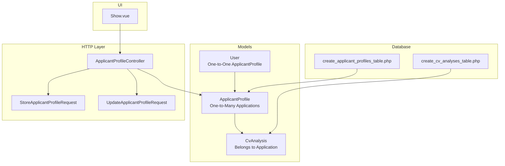
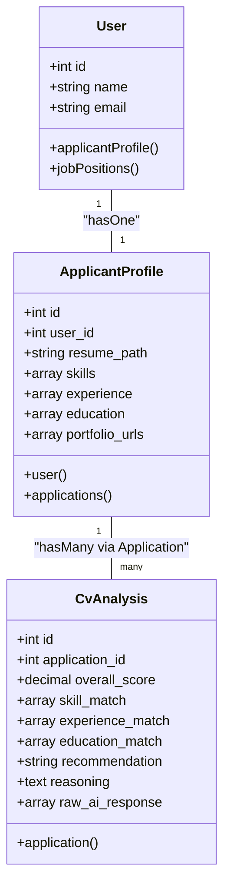
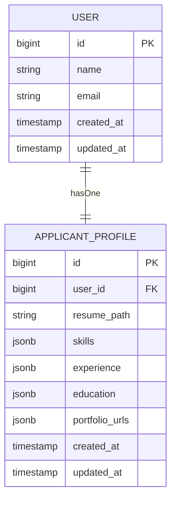
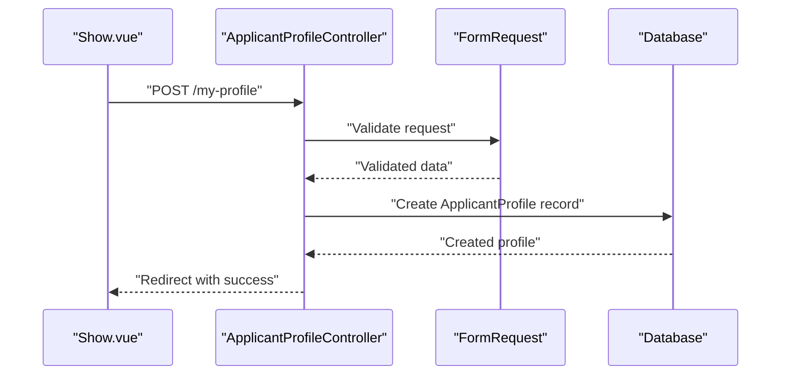
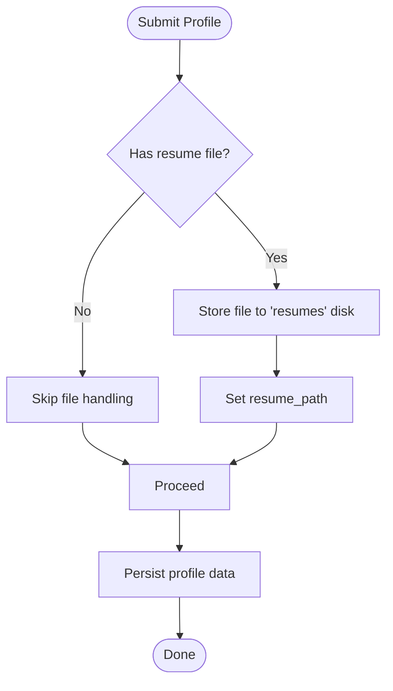
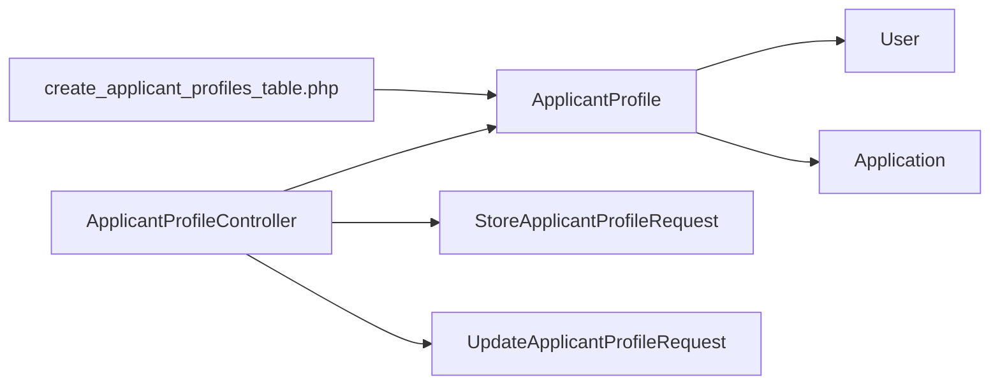

# Profile Data Model & Structure

<cite>
**Referenced Files in This Document**
- [ApplicantProfile.php](file://app/Models/ApplicantProfile.php)
- [User.php](file://app/Models/User.php)
- [2026_06_24_164755_create_applicant_profiles_table.php](file://database/migrations/2026_06_24_164755_create_applicant_profiles_table.php)
- [ApplicantProfileController.php](file://app/Http/Controllers/ApplicantProfileController.php)
- [StoreApplicantProfileRequest.php](file://app/Http/Requests/StoreApplicantProfileRequest.php)
- [UpdateApplicantProfileRequest.php](file://app/Http/Requests/UpdateApplicantProfileRequest.php)
- [Show.vue](file://resources/js/pages/ApplicantProfiles/Show.vue)
- [ApplicantProfileTest.php](file://tests/Feature/ApplicantProfileTest.php)
- [CvAnalysis.php](file://app/Models/CvAnalysis.php)
- [2026_06_24_164756_create_cv_analyses_table.php](file://database/migrations/2026_06_24_164756_create_cv_analyses_table.php)
- [ProfileValidationRules.php](file://app/Concerns/ProfileValidationRules.php)
- [AGENTS.md](file://AGENTS.md)
- [db-performance.md](file://.agents/skills/laravel-best-practices/rules/db-performance.md)
</cite>

## Table of Contents
1. [Introduction](#introduction)
2. [Project Structure](#project-structure)
3. [Core Components](#core-components)
4. [Architecture Overview](#architecture-overview)
5. [Detailed Component Analysis](#detailed-component-analysis)
6. [Dependency Analysis](#dependency-analysis)
7. [Performance Considerations](#performance-considerations)
8. [Troubleshooting Guide](#troubleshooting-guide)
9. [Conclusion](#conclusion)
10. [Appendices](#appendices)

## Introduction
This document provides comprehensive data model documentation for the ApplicantProfile entity. It covers the database schema, JSONB data structures for skills, experience, education, and portfolio URLs, relationships with the User model, validation rules, and practical guidance for indexing and schema evolution. It also outlines how the profile data is handled in the controller and validated via form requests, and highlights considerations for resume uploads and AI-driven analysis.

## Project Structure
The ApplicantProfile model is part of the core application models and integrates with the User model. The migration defines the database table with JSONB columns for flexible data structures. Controllers and form requests handle creation and updates, while frontend components render and submit profile data.

**Diagram sources**
- [ApplicantProfile.php:10-40](file://app/Models/ApplicantProfile.php#L10-L40)
- [User.php:52-55](file://app/Models/User.php#L52-L55)
- [2026_06_24_164755_create_applicant_profiles_table.php:14-23](file://database/migrations/2026_06_24_164755_create_applicant_profiles_table.php#L14-L23)
- [ApplicantProfileController.php:13-58](file://app/Http/Controllers/ApplicantProfileController.php#L13-L58)
- [StoreApplicantProfileRequest.php:8-33](file://app/Http/Requests/StoreApplicantProfileRequest.php#L8-L33)
- [UpdateApplicantProfileRequest.php:8-33](file://app/Http/Requests/UpdateApplicantProfileRequest.php#L8-L33)
- [Show.vue:1-45](file://resources/js/pages/ApplicantProfiles/Show.vue#L1-L45)
- [CvAnalysis.php:9-37](file://app/Models/CvAnalysis.php#L9-L37)
- [2026_06_24_164756_create_cv_analyses_table.php:14-25](file://database/migrations/2026_06_24_164756_create_cv_analyses_table.php#L14-L25)

**Section sources**
- [ApplicantProfile.php:10-40](file://app/Models/ApplicantProfile.php#L10-L40)
- [User.php:52-55](file://app/Models/User.php#L52-L55)
- [2026_06_24_164755_create_applicant_profiles_table.php:14-23](file://database/migrations/2026_06_24_164755_create_applicant_profiles_table.php#L14-L23)
- [ApplicantProfileController.php:13-58](file://app/Http/Controllers/ApplicantProfileController.php#L13-L58)
- [StoreApplicantProfileRequest.php:8-33](file://app/Http/Requests/StoreApplicantProfileRequest.php#L8-L33)
- [UpdateApplicantProfileRequest.php:8-33](file://app/Http/Requests/UpdateApplicantProfileRequest.php#L8-L33)
- [Show.vue:1-45](file://resources/js/pages/ApplicantProfiles/Show.vue#L1-L45)
- [CvAnalysis.php:9-37](file://app/Models/CvAnalysis.php#L9-L37)
- [2026_06_24_164756_create_cv_analyses_table.php:14-25](file://database/migrations/2026_06_24_164756_create_cv_analyses_table.php#L14-L25)

## Core Components
- ApplicantProfile model: Defines fillable attributes, JSON casting for skills, experience, education, and portfolio URLs, and relationships to User and Application.
- User model: Defines the inverse relationship to ApplicantProfile and other application features.
- Migration: Creates the applicant_profiles table with JSONB columns and foreign key to users.
- Controller: Handles profile creation and updates, including resume file upload management.
- Form Requests: Enforce validation rules for profile data and file uploads.
- Frontend: Renders profile fields and submits data to the controller.
- CvAnalysis model and migration: Support AI-driven analysis of profiles and applications.

**Section sources**
- [ApplicantProfile.php:12-29](file://app/Models/ApplicantProfile.php#L12-L29)
- [User.php:52-55](file://app/Models/User.php#L52-L55)
- [2026_06_24_164755_create_applicant_profiles_table.php:14-23](file://database/migrations/2026_06_24_164755_create_applicant_profiles_table.php#L14-L23)
- [ApplicantProfileController.php:24-57](file://app/Http/Controllers/ApplicantProfileController.php#L24-L57)
- [StoreApplicantProfileRequest.php:23-31](file://app/Http/Requests/StoreApplicantProfileRequest.php#L23-L31)
- [UpdateApplicantProfileRequest.php:23-31](file://app/Http/Requests/UpdateApplicantProfileRequest.php#L23-L31)
- [Show.vue:15-21](file://resources/js/pages/ApplicantProfiles/Show.vue#L15-L21)
- [CvAnalysis.php:11-30](file://app/Models/CvAnalysis.php#L11-L30)
- [2026_06_24_164756_create_cv_analyses_table.php:14-25](file://database/migrations/2026_06_24_164756_create_cv_analyses_table.php#L14-L25)

## Architecture Overview
The ApplicantProfile entity is designed around a flexible JSONB schema to support evolving profile structures without frequent migrations. The model is tightly coupled with the User model via a one-to-one relationship and integrates with the application lifecycle through the controller and form requests. AI analysis is supported by a separate CvAnalysis model that references applications.

**Diagram sources**
- [User.php:52-55](file://app/Models/User.php#L52-L55)
- [ApplicantProfile.php:31-39](file://app/Models/ApplicantProfile.php#L31-L39)
- [CvAnalysis.php:33-36](file://app/Models/CvAnalysis.php#L33-L36)

## Detailed Component Analysis

### Database Schema: applicant_profiles
- Columns and types:
  - id: auto-incrementing primary key
  - user_id: foreign key to users table with cascade delete
  - resume_path: string, nullable
  - skills: JSONB, nullable
  - experience: JSONB, nullable
  - education: JSONB, nullable
  - portfolio_urls: JSONB, nullable
  - timestamps: created_at and updated_at

Constraints and relationships:
- Foreign key constraint on user_id referencing users(id) with cascade delete
- All JSONB columns are nullable, allowing partial profile completion

Data typing and casting:
- Eloquent casts arrays for skills, experience, education, and portfolio_urls
- JSONB storage enables flexible nested structures

**Section sources**
- [2026_06_24_164755_create_applicant_profiles_table.php:14-23](file://database/migrations/2026_06_24_164755_create_applicant_profiles_table.php#L14-L23)
- [ApplicantProfile.php:21-29](file://app/Models/ApplicantProfile.php#L21-L29)

### JSONB Data Structures: Skills, Experience, Education, Portfolio URLs
- skills: array of strings or structured entries (as rendered in the frontend)
- experience: array of strings or structured entries
- education: array of strings or structured entries
- portfolio_urls: array of strings

Frontend rendering indicates arrays of strings for each category, but the database schema supports JSONB for richer structures. The casting ensures arrays are returned from the model.

**Diagram sources**
- [2026_06_24_164755_create_applicant_profiles_table.php:14-23](file://database/migrations/2026_06_24_164755_create_applicant_profiles_table.php#L14-L23)
- [User.php:52-55](file://app/Models/User.php#L52-L55)
- [ApplicantProfile.php:31-34](file://app/Models/ApplicantProfile.php#L31-L34)

**Section sources**
- [Show.vue:8-11](file://resources/js/pages/ApplicantProfiles/Show.vue#L8-L11)
- [ApplicantProfile.php:21-29](file://app/Models/ApplicantProfile.php#L21-L29)

### Relationships with User and Applications
- One-to-one relationship with User via applicantProfile()
- One-to-many relationship with Application via applications()
- CvAnalysis references applications, enabling AI analysis workflows

**Diagram sources**
- [Show.vue:23-33](file://resources/js/pages/ApplicantProfiles/Show.vue#L23-L33)
- [ApplicantProfileController.php:24-36](file://app/Http/Controllers/ApplicantProfileController.php#L24-L36)
- [StoreApplicantProfileRequest.php:23-31](file://app/Http/Requests/StoreApplicantProfileRequest.php#L23-L31)

**Section sources**
- [ApplicantProfile.php:31-39](file://app/Models/ApplicantProfile.php#L31-L39)
- [User.php:52-55](file://app/Models/User.php#L52-L55)
- [ApplicantProfileController.php:15-36](file://app/Http/Controllers/ApplicantProfileController.php#L15-L36)

### Data Validation Rules
- File upload validation:
  - resume: optional file, mime types pdf, doc, docx, max size 2MB
- Array validation:
  - skills, experience, education, portfolio_urls: optional arrays

Authorization:
- Store and update requests require an authenticated user

**Section sources**
- [StoreApplicantProfileRequest.php:23-31](file://app/Http/Requests/StoreApplicantProfileRequest.php#L23-L31)
- [UpdateApplicantProfileRequest.php:23-31](file://app/Http/Requests/UpdateApplicantProfileRequest.php#L23-L31)
- [ApplicantProfileController.php:13-16](file://app/Http/Controllers/ApplicantProfileController.php#L13-L16)

### Resume Metadata and File Handling
- resume_path stores the uploaded file's disk path
- Controller handles file deletion on update and creates new storage paths
- Frontend exposes a file input for resume uploads

**Diagram sources**
- [ApplicantProfileController.php:28-54](file://app/Http/Controllers/ApplicantProfileController.php#L28-L54)
- [Show.vue:88-100](file://resources/js/pages/ApplicantProfiles/Show.vue#L88-L100)

**Section sources**
- [ApplicantProfileController.php:28-54](file://app/Http/Controllers/ApplicantProfileController.php#L28-L54)
- [Show.vue:88-100](file://resources/js/pages/ApplicantProfiles/Show.vue#L88-L100)

### Profile Completeness Scoring Algorithm
- No explicit scoring algorithm is defined in the current codebase
- Recommendation: Implement a scoring mechanism that evaluates presence and structure of skills, experience, education, and portfolio URLs
- Consider weights for each section and enforce minimum required fields for higher scores

[No sources needed since this section provides general guidance]

### Field Definitions and Descriptions
- user_id: Foreign key linking to User
- resume_path: Path to stored resume file
- skills: JSONB array representing skills
- experience: JSONB array representing work experience
- education: JSONB array representing educational background
- portfolio_urls: JSONB array of portfolio links

**Section sources**
- [2026_06_24_164755_create_applicant_profiles_table.php:16-21](file://database/migrations/2026_06_24_164755_create_applicant_profiles_table.php#L16-L21)
- [ApplicantProfile.php:12-19](file://app/Models/ApplicantProfile.php#L12-L19)

## Dependency Analysis
The ApplicantProfile model depends on the User model for identity and on the Application model for job-related associations. The controller orchestrates validation and persistence, while migrations define the schema. The frontend binds to the controller endpoints.

**Diagram sources**
- [ApplicantProfile.php:31-39](file://app/Models/ApplicantProfile.php#L31-L39)
- [User.php:52-55](file://app/Models/User.php#L52-L55)
- [ApplicantProfileController.php:24-57](file://app/Http/Controllers/ApplicantProfileController.php#L24-L57)
- [2026_06_24_164755_create_applicant_profiles_table.php:14-23](file://database/migrations/2026_06_24_164755_create_applicant_profiles_table.php#L14-L23)

**Section sources**
- [ApplicantProfile.php:31-39](file://app/Models/ApplicantProfile.php#L31-L39)
- [User.php:52-55](file://app/Models/User.php#L52-L55)
- [ApplicantProfileController.php:24-57](file://app/Http/Controllers/ApplicantProfileController.php#L24-L57)
- [2026_06_24_164755_create_applicant_profiles_table.php:14-23](file://database/migrations/2026_06_24_164755_create_applicant_profiles_table.php#L14-L23)

## Performance Considerations
- Indexing strategy:
  - user_id: add an index to improve join performance
  - JSONB columns: consider GIN indexes for frequent filtering or containment queries
- Query patterns:
  - Use chunking for large datasets
  - Prefer whereIn with subqueries over correlated whereHas for better index usage
  - Use compound indexes matching orderBy column order for multi-column sorts
- N+1 prevention:
  - Eager load relations when fetching profiles alongside related data
  - Use setRelation to prevent circular N+1 queries

**Section sources**
- [db-performance.md:94-117](file://.agents/skills/laravel-best-practices/rules/db-performance.md#L94-L117)
- [db-performance.md:119-150](file://.agents/skills/laravel-best-practices/rules/db-performance.md#L119-L150)
- [AGENTS.md:1371-1378](file://AGENTS.md#L1371-L1378)

## Troubleshooting Guide
Common issues and resolutions:
- Mass assignment exceptions: Ensure only fillable attributes are used; the model restricts fillable fields to prevent unauthorized updates
- JSONB parsing errors: Validate JSON structure before persisting; the model casts arrays automatically
- File upload failures: Confirm mime types and size limits; the controller deletes previous files when updating
- Authorization errors: Update requests check ownership against the authenticated user ID

**Section sources**
- [ApplicantProfile.php:12-19](file://app/Models/ApplicantProfile.php#L12-L19)
- [ApplicantProfileController.php:40-42](file://app/Http/Controllers/ApplicantProfileController.php#L40-L42)
- [StoreApplicantProfileRequest.php:26-26](file://app/Http/Requests/StoreApplicantProfileRequest.php#L26-L26)
- [UpdateApplicantProfileRequest.php:26-26](file://app/Http/Requests/UpdateApplicantProfileRequest.php#L26-L26)

## Conclusion
The ApplicantProfile model provides a flexible, JSONB-backed structure for capturing candidate information with strong relationships to the User model and extensibility for AI analysis. Validation rules and controller logic ensure secure and consistent data handling. For production deployments, implement indexing strategies and consider a scoring algorithm to quantify profile completeness.

[No sources needed since this section summarizes without analyzing specific files]

## Appendices

### Appendix A: Migration and Schema Evolution
- Current migration defines JSONB columns for skills, experience, education, and portfolio URLs
- Evolving schema considerations:
  - Add GIN indexes for JSONB columns if filtering is required
  - Introduce enumerated status fields for profile completeness if needed
  - Normalize frequently queried JSONB structures into separate tables for complex analytics

**Section sources**
- [2026_06_24_164755_create_applicant_profiles_table.php:18-21](file://database/migrations/2026_06_24_164755_create_applicant_profiles_table.php#L18-L21)
- [AGENTS.md:1317-1327](file://AGENTS.md#L1317-L1327)

### Appendix B: Related Models and Migrations
- CvAnalysis model and migration support AI-driven analysis with JSONB fields for match results and reasoning
- These models integrate with the application lifecycle to enable automated candidate evaluation

**Section sources**
- [CvAnalysis.php:11-30](file://app/Models/CvAnalysis.php#L11-L30)
- [2026_06_24_164756_create_cv_analyses_table.php:14-25](file://database/migrations/2026_06_24_164756_create_cv_analyses_table.php#L14-L25)