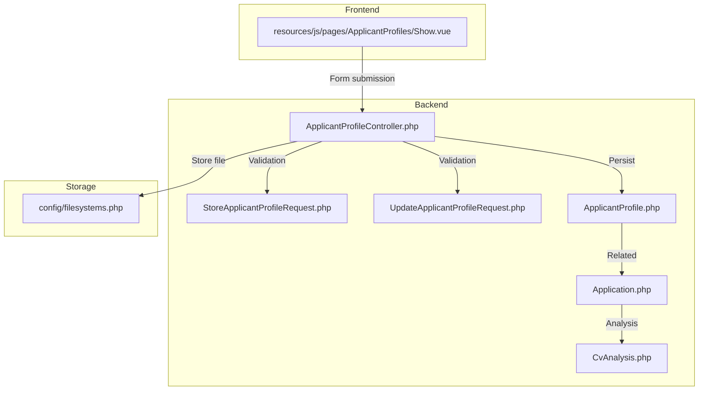
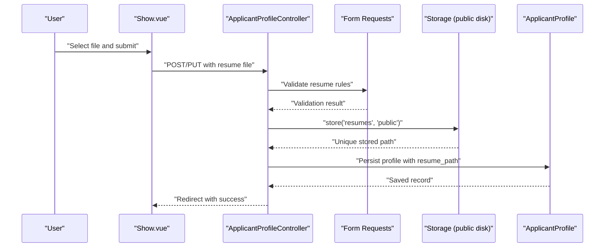
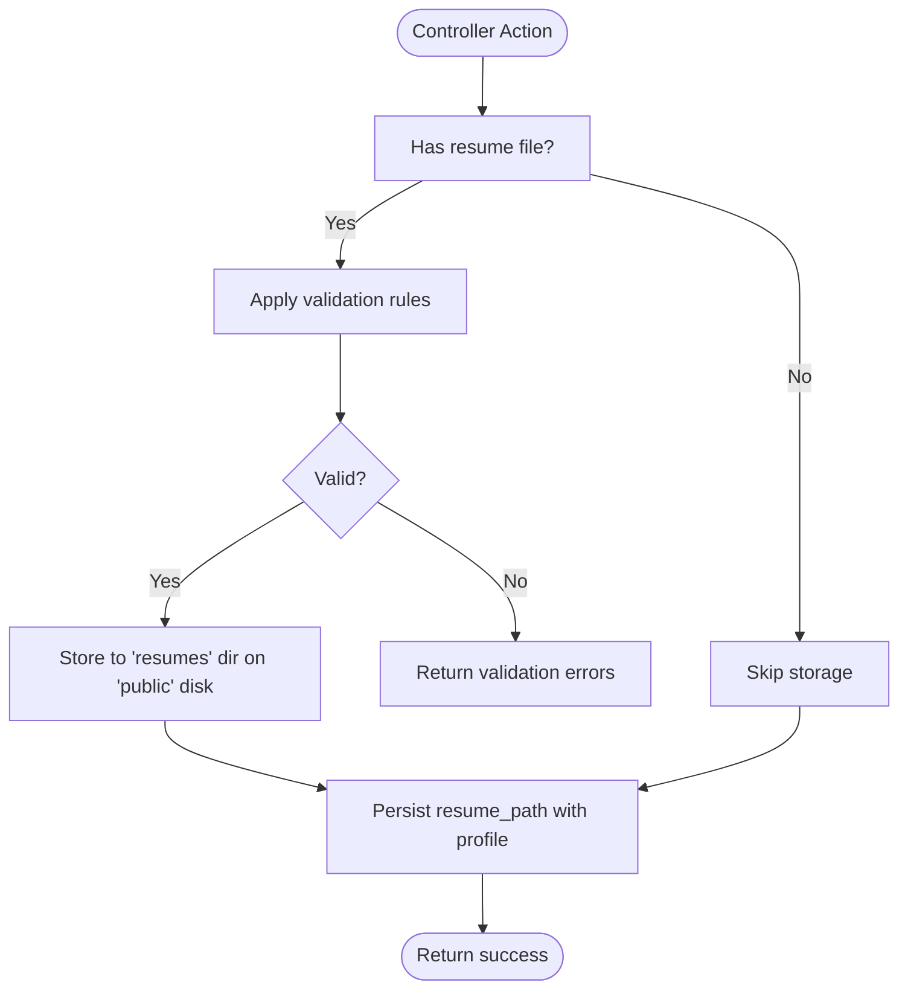
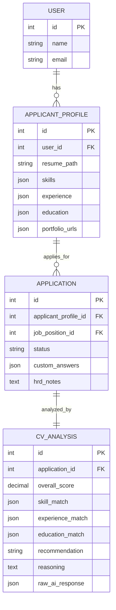
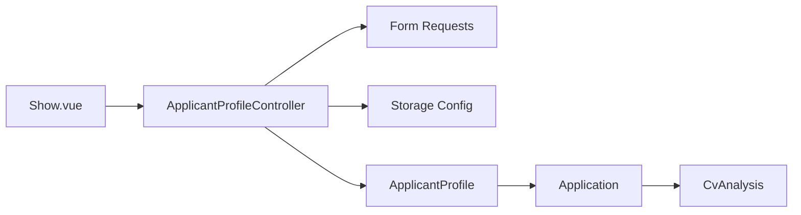

# Resume Upload & Processing

<cite>
**Referenced Files in This Document**
- [ApplicantProfileController.php](file://app/Http/Controllers/ApplicantProfileController.php)
- [StoreApplicantProfileRequest.php](file://app/Http/Requests/StoreApplicantProfileRequest.php)
- [UpdateApplicantProfileRequest.php](file://app/Http/Requests/UpdateApplicantProfileRequest.php)
- [ApplicantProfile.php](file://app/Models/ApplicantProfile.php)
- [Application.php](file://app/Models/Application.php)
- [CvAnalysis.php](file://app/Models/CvAnalysis.php)
- [filesystems.php](file://config/filesystems.php)
- [2026_06_24_164756_create_cv_analyses_table.php](file://database/migrations/2026_06_24_164756_create_cv_analyses_table.php)
- [Show.vue](file://resources/js/pages/ApplicantProfiles/Show.vue)
- [AGENTS.md](file://AGENTS.md)
</cite>

## Table of Contents
1. [Introduction](#introduction)
2. [Project Structure](#project-structure)
3. [Core Components](#core-components)
4. [Architecture Overview](#architecture-overview)
5. [Detailed Component Analysis](#detailed-component-analysis)
6. [Dependency Analysis](#dependency-analysis)
7. [Performance Considerations](#performance-considerations)
8. [Troubleshooting Guide](#troubleshooting-guide)
9. [Conclusion](#conclusion)

## Introduction
This document explains the resume upload and processing functionality implemented in the project. It covers the end-to-end workflow from file upload through storage and validation, to the planned resume parsing and AI-powered analysis pipeline. It also documents the current state of the upload implementation, the storage configuration, and the frontend upload component. Areas that are not yet implemented (such as parsing and AI analysis) are clearly indicated so teams can plan accordingly.

## Project Structure
The resume upload feature spans backend controllers and requests, models, configuration, and frontend components. The following diagram shows how these pieces fit together.

**Diagram sources**
- [ApplicantProfileController.php:1-59](file://app/Http/Controllers/ApplicantProfileController.php#L1-L59)
- [StoreApplicantProfileRequest.php:1-34](file://app/Http/Requests/StoreApplicantProfileRequest.php#L1-L34)
- [UpdateApplicantProfileRequest.php:1-34](file://app/Http/Requests/UpdateApplicantProfileRequest.php#L1-L34)
- [ApplicantProfile.php:1-41](file://app/Models/ApplicantProfile.php#L1-L41)
- [Application.php:1-42](file://app/Models/Application.php#L1-L42)
- [CvAnalysis.php:1-38](file://app/Models/CvAnalysis.php#L1-L38)
- [filesystems.php:1-81](file://config/filesystems.php#L1-L81)
- [Show.vue:1-117](file://resources/js/pages/ApplicantProfiles/Show.vue#L1-L117)

**Section sources**
- [ApplicantProfileController.php:1-59](file://app/Http/Controllers/ApplicantProfileController.php#L1-L59)
- [filesystems.php:1-81](file://config/filesystems.php#L1-L81)
- [Show.vue:1-117](file://resources/js/pages/ApplicantProfiles/Show.vue#L1-L117)

## Core Components
- Backend controller orchestrating upload, validation, and persistence.
- Form requests enforcing file validation rules.
- Models representing the profile, application, and AI analysis results.
- Filesystem configuration supporting local and cloud storage.
- Frontend upload component capturing the file and submitting via Inertia.

Key implementation references:
- Controller upload logic and storage integration: [ApplicantProfileController.php:24-57](file://app/Http/Controllers/ApplicantProfileController.php#L24-L57)
- Validation rules for resume uploads: [StoreApplicantProfileRequest.php:25-26](file://app/Http/Requests/StoreApplicantProfileRequest.php#L25-L26), [UpdateApplicantProfileRequest.php:25-26](file://app/Http/Requests/UpdateApplicantProfileRequest.php#L25-L26)
- Storage configuration for local and S3: [filesystems.php:31-63](file://config/filesystems.php#L31-L63)
- Frontend upload component: [Show.vue:86-100](file://resources/js/pages/ApplicantProfiles/Show.vue#L86-L100)

**Section sources**
- [ApplicantProfileController.php:24-57](file://app/Http/Controllers/ApplicantProfileController.php#L24-L57)
- [StoreApplicantProfileRequest.php:25-26](file://app/Http/Requests/StoreApplicantProfileRequest.php#L25-L26)
- [UpdateApplicantProfileRequest.php:25-26](file://app/Http/Requests/UpdateApplicantProfileRequest.php#L25-L26)
- [filesystems.php:31-63](file://config/filesystems.php#L31-L63)
- [Show.vue:86-100](file://resources/js/pages/ApplicantProfiles/Show.vue#L86-L100)

## Architecture Overview
The upload flow validates the incoming file, stores it via Laravel’s filesystem abstraction, and persists the resulting path with the user’s profile. The application model links profiles to job applications, and the CV analysis model captures AI-generated insights.

**Diagram sources**
- [Show.vue:23-33](file://resources/js/pages/ApplicantProfiles/Show.vue#L23-L33)
- [ApplicantProfileController.php:24-57](file://app/Http/Controllers/ApplicantProfileController.php#L24-L57)
- [StoreApplicantProfileRequest.php:25-26](file://app/Http/Requests/StoreApplicantProfileRequest.php#L25-L26)
- [UpdateApplicantProfileRequest.php:25-26](file://app/Http/Requests/UpdateApplicantProfileRequest.php#L25-L26)
- [filesystems.php:41-48](file://config/filesystems.php#L41-L48)

## Detailed Component Analysis

### Backend Controller: Upload and Storage
- Validates the presence of a file and applies mime and size constraints.
- Stores the file under a designated directory on the configured public disk.
- Persists the generated path alongside other profile attributes.
- Handles replacement by deleting the old file before storing the new one.

**Diagram sources**
- [ApplicantProfileController.php:24-57](file://app/Http/Controllers/ApplicantProfileController.php#L24-L57)
- [StoreApplicantProfileRequest.php:25-26](file://app/Http/Requests/StoreApplicantProfileRequest.php#L25-L26)
- [UpdateApplicantProfileRequest.php:25-26](file://app/Http/Requests/UpdateApplicantProfileRequest.php#L25-L26)

**Section sources**
- [ApplicantProfileController.php:24-57](file://app/Http/Controllers/ApplicantProfileController.php#L24-L57)

### Validation Rules: Supported Formats and Size Limits
- Supported file types: PDF, DOC, DOCX.
- Maximum file size: 2048 KB.
- Fields validated include the resume file and optional arrays for skills, experience, education, and portfolio URLs.

References:
- [StoreApplicantProfileRequest.php:25-31](file://app/Http/Requests/StoreApplicantProfileRequest.php#L25-L31)
- [UpdateApplicantProfileRequest.php:25-31](file://app/Http/Requests/UpdateApplicantProfileRequest.php#L25-L31)

**Section sources**
- [StoreApplicantProfileRequest.php:25-31](file://app/Http/Requests/StoreApplicantProfileRequest.php#L25-L31)
- [UpdateApplicantProfileRequest.php:25-31](file://app/Http/Requests/UpdateApplicantProfileRequest.php#L25-L31)

### Storage Integration: Local and Cloud Options
- Default disk is configurable via environment variable.
- Public disk serves files via a predictable URL and supports symlink creation.
- S3 disk is configured for cloud storage with credentials and endpoint settings.
- Private disk is configured for sensitive files.

References:
- [filesystems.php:16](file://config/filesystems.php#L16)
- [filesystems.php:41-48](file://config/filesystems.php#L41-L48)
- [filesystems.php:50-61](file://config/filesystems.php#L50-L61)
- [filesystems.php:33-39](file://config/filesystems.php#L33-L39)

**Section sources**
- [filesystems.php:16](file://config/filesystems.php#L16)
- [filesystems.php:41-61](file://config/filesystems.php#L41-L61)
- [filesystems.php:33-39](file://config/filesystems.php#L33-L39)

### Frontend Upload Component
- Provides a file input bound to the form state.
- Displays a success indicator when a resume is present.
- Submits via Inertia to either create or update the profile.

References:
- [Show.vue:15-21](file://resources/js/pages/ApplicantProfiles/Show.vue#L15-L21)
- [Show.vue:23-33](file://resources/js/pages/ApplicantProfiles/Show.vue#L23-L33)
- [Show.vue:86-100](file://resources/js/pages/ApplicantProfiles/Show.vue#L86-L100)

**Section sources**
- [Show.vue:15-33](file://resources/js/pages/ApplicantProfiles/Show.vue#L15-L33)
- [Show.vue:86-100](file://resources/js/pages/ApplicantProfiles/Show.vue#L86-L100)

### Data Models: Relationships and Persistence
- ApplicantProfile stores the resume path and related arrays.
- Application links profiles to job positions and holds custom answers and HR notes.
- CvAnalysis captures AI analysis results with scores and reasoning.

**Diagram sources**
- [ApplicantProfile.php:12-19](file://app/Models/ApplicantProfile.php#L12-L19)
- [Application.php:12-18](file://app/Models/Application.php#L12-L18)
- [CvAnalysis.php:11-20](file://app/Models/CvAnalysis.php#L11-L20)
- [2026_06_24_164756_create_cv_analyses_table.php:14-24](file://database/migrations/2026_06_24_164756_create_cv_analyses_table.php#L14-L24)

**Section sources**
- [ApplicantProfile.php:12-39](file://app/Models/ApplicantProfile.php#L12-L39)
- [Application.php:12-40](file://app/Models/Application.php#L12-L40)
- [CvAnalysis.php:11-36](file://app/Models/CvAnalysis.php#L11-L36)
- [2026_06_24_164756_create_cv_analyses_table.php:14-24](file://database/migrations/2026_06_24_164756_create_cv_analyses_table.php#L14-L24)

### Planned Resume Parsing and Automated Content Analysis
- The project defines recommended backend structure for resume parsing and AI analysis, including dedicated controllers and services.
- CV analysis results are modeled with fields for scores, match data, recommendation, reasoning, and raw AI response.

References:
- [AGENTS.md:1285-1316](file://AGENTS.md#L1285-L1316)
- [CvAnalysis.php:11-20](file://app/Models/CvAnalysis.php#L11-L20)
- [2026_06_24_164756_create_cv_analyses_table.php:14-24](file://database/migrations/2026_06_24_164756_create_cv_analyses_table.php#L14-L24)

**Section sources**
- [AGENTS.md:1285-1316](file://AGENTS.md#L1285-L1316)
- [CvAnalysis.php:11-20](file://app/Models/CvAnalysis.php#L11-L20)
- [2026_06_24_164756_create_cv_analyses_table.php:14-24](file://database/migrations/2026_06_24_164756_create_cv_analyses_table.php#L14-L24)

## Dependency Analysis
The upload feature depends on:
- Form requests for validation.
- Storage configuration for the chosen disk.
- Models for persistence and relationships.
- Frontend component for user interaction.

**Diagram sources**
- [Show.vue:23-33](file://resources/js/pages/ApplicantProfiles/Show.vue#L23-L33)
- [ApplicantProfileController.php:24-57](file://app/Http/Controllers/ApplicantProfileController.php#L24-L57)
- [StoreApplicantProfileRequest.php:25-26](file://app/Http/Requests/StoreApplicantProfileRequest.php#L25-L26)
- [filesystems.php:41-48](file://config/filesystems.php#L41-L48)
- [ApplicantProfile.php:12-19](file://app/Models/ApplicantProfile.php#L12-L19)
- [Application.php:12-18](file://app/Models/Application.php#L12-L18)
- [CvAnalysis.php:11-20](file://app/Models/CvAnalysis.php#L11-L20)

**Section sources**
- [ApplicantProfileController.php:24-57](file://app/Http/Controllers/ApplicantProfileController.php#L24-L57)
- [filesystems.php:41-48](file://config/filesystems.php#L41-L48)
- [Show.vue:23-33](file://resources/js/pages/ApplicantProfiles/Show.vue#L23-L33)

## Performance Considerations
- Prefer queuing long-running resume parsing and AI analysis tasks to avoid blocking requests.
- Use pagination and indexing for candidate and application listings.
- Keep frontend rendering lightweight; avoid unnecessary re-computations.

[No sources needed since this section provides general guidance]

## Troubleshooting Guide
Common issues and remedies:
- Validation failures due to unsupported formats or size limits:
  - Ensure the file MIME type matches allowed values and size stays within the limit.
  - References: [StoreApplicantProfileRequest.php:25-26](file://app/Http/Requests/StoreApplicantProfileRequest.php#L25-L26), [UpdateApplicantProfileRequest.php:25-26](file://app/Http/Requests/UpdateApplicantProfileRequest.php#L25-L26)
- Storage path visibility or accessibility:
  - Verify the public disk URL and symlink configuration.
  - References: [filesystems.php:41-48](file://config/filesystems.php#L41-L48), [filesystems.php:76-78](file://config/filesystems.php#L76-L78)
- Duplicate or stale files:
  - The controller deletes the previous file when replacing a resume; confirm this behavior is triggered.
  - Reference: [ApplicantProfileController.php:46-50](file://app/Http/Controllers/ApplicantProfileController.php#L46-L50)
- CORS or cloud storage connectivity:
  - Validate S3 credentials and endpoint settings.
  - Reference: [filesystems.php:50-61](file://config/filesystems.php#L50-L61)

**Section sources**
- [StoreApplicantProfileRequest.php:25-26](file://app/Http/Requests/StoreApplicantProfileRequest.php#L25-L26)
- [UpdateApplicantProfileRequest.php:25-26](file://app/Http/Requests/UpdateApplicantProfileRequest.php#L25-L26)
- [filesystems.php:41-48](file://config/filesystems.php#L41-L48)
- [filesystems.php:76-78](file://config/filesystems.php#L76-L78)
- [ApplicantProfileController.php:46-50](file://app/Http/Controllers/ApplicantProfileController.php#L46-L50)
- [filesystems.php:50-61](file://config/filesystems.php#L50-L61)

## Conclusion
The resume upload feature currently provides robust client-side upload, server-side validation, and secure storage via Laravel’s filesystem abstraction. The models and database schema are ready to support AI-driven analysis and scoring. Future work should focus on implementing the resume parser and AI analysis services, integrating them with the existing models, and adding progress indicators and error feedback in the frontend.