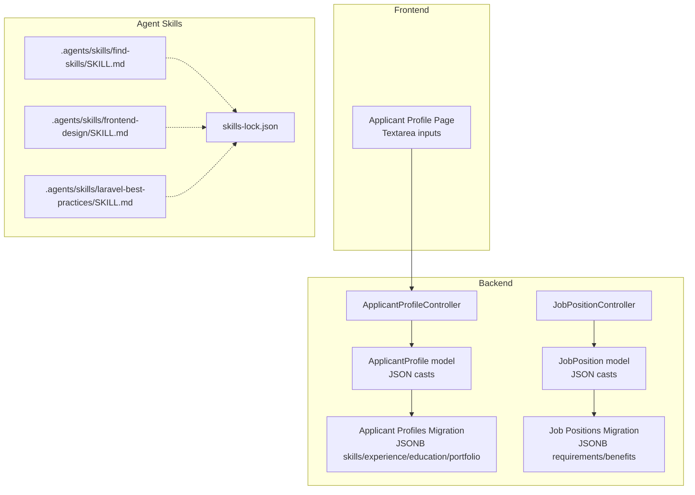
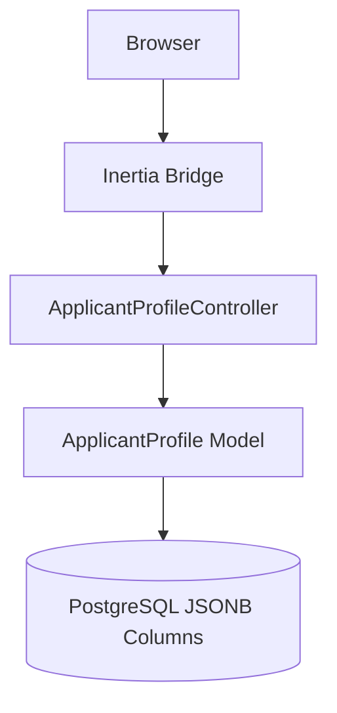
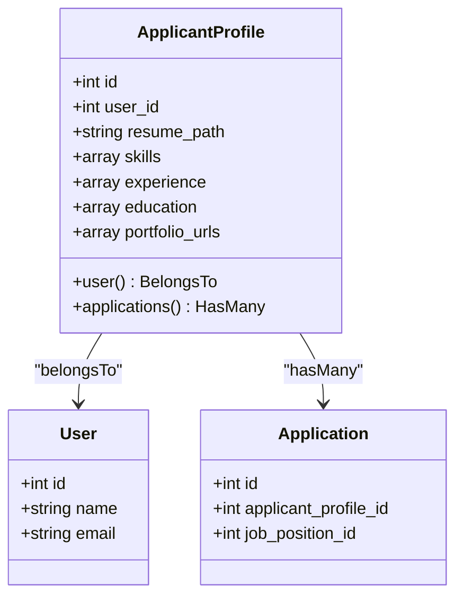
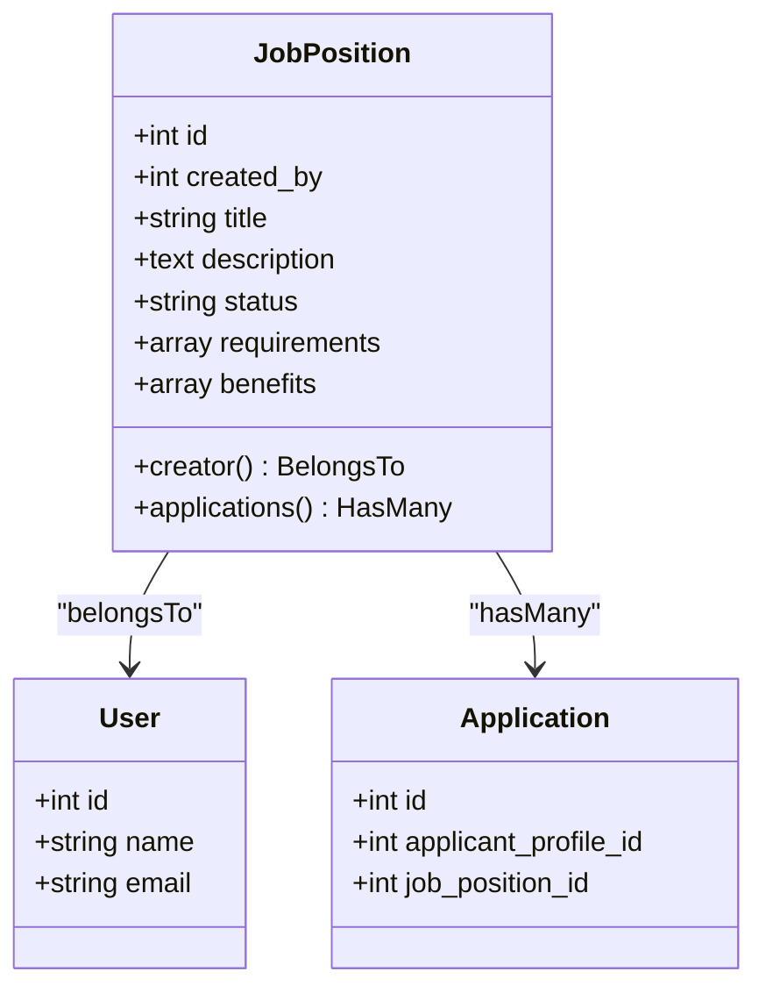
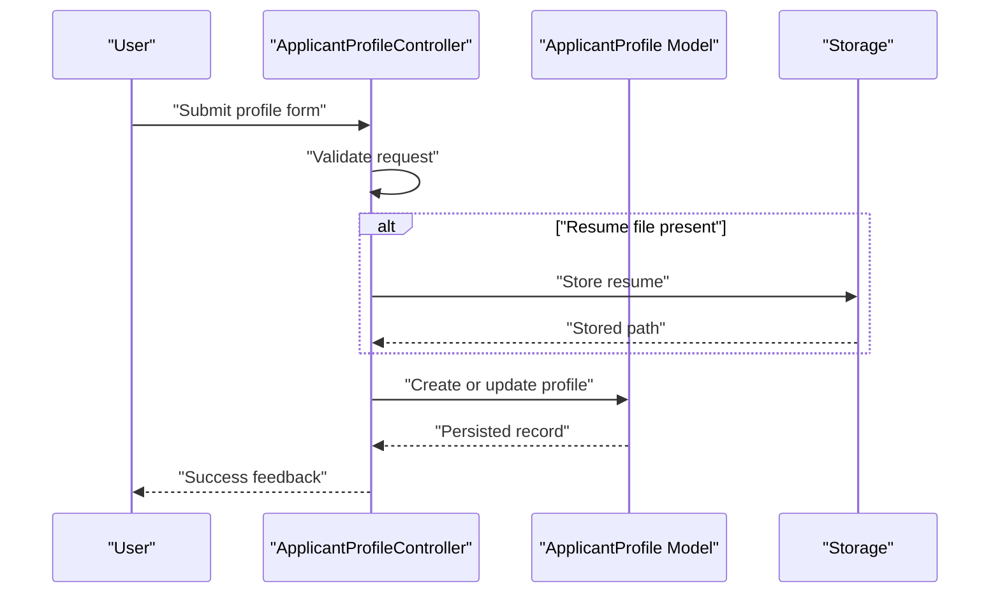
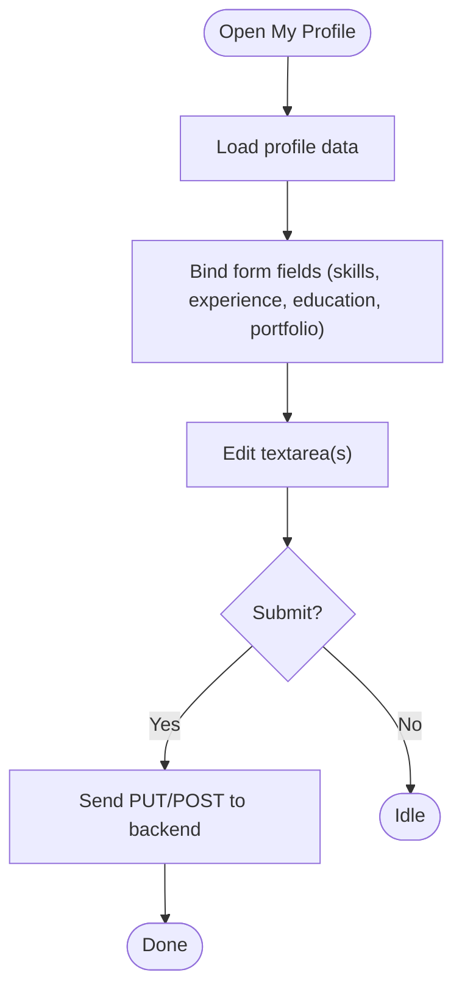
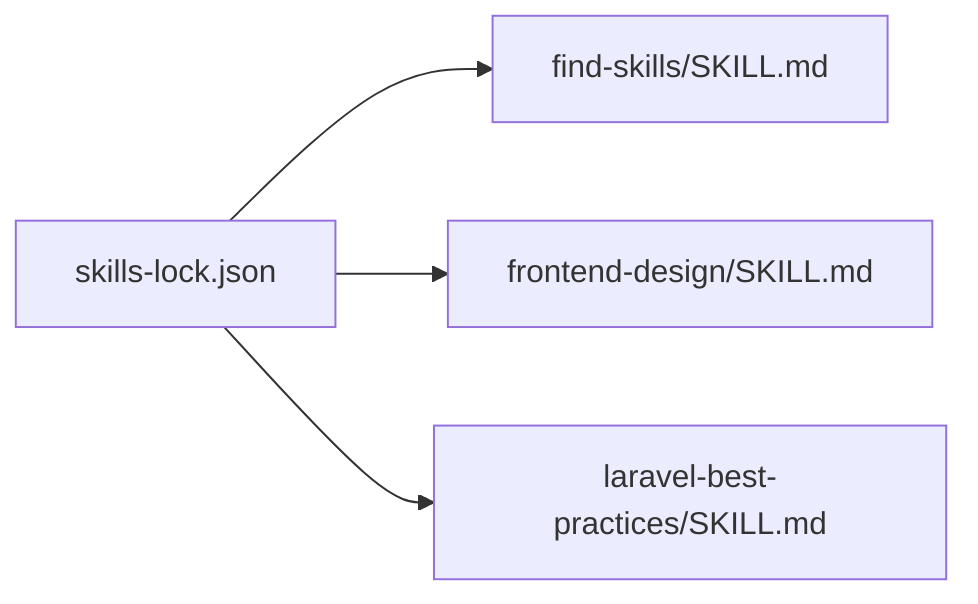
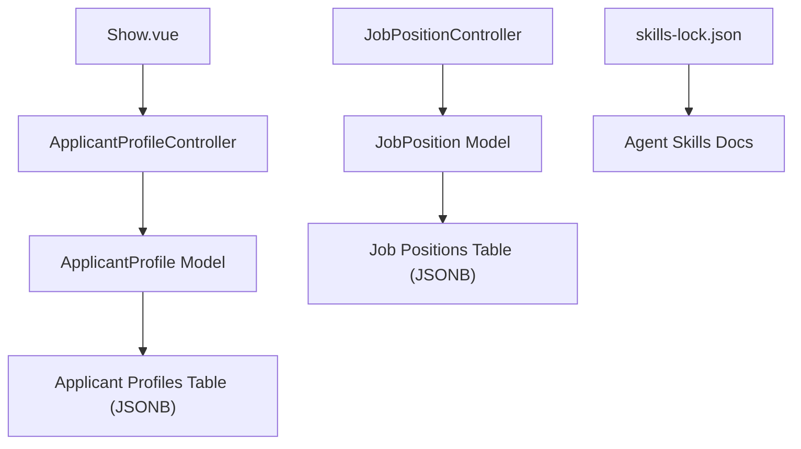

# Skills Tracking & Management

<cite>
**Referenced Files in This Document**
- [ApplicantProfile.php](file://app/Models/ApplicantProfile.php)
- [JobPosition.php](file://app/Models/JobPosition.php)
- [2026_06_24_164755_create_applicant_profiles_table.php](file://database/migrations/2026_06_24_164755_create_applicant_profiles_table.php)
- [2026_06_24_164755_create_job_positions_table.php](file://database/migrations/2026_06_24_164755_create_job_positions_table.php)
- [ApplicantProfileController.php](file://app/Http/Controllers/ApplicantProfileController.php)
- [JobPositionController.php](file://app/Http/Controllers/JobPositionController.php)
- [Show.vue](file://resources/js/pages/ApplicantProfiles/Show.vue)
- [SKILL.md (find-skills)](.agents/skills/find-skills/SKILL.md)
- [SKILL.md (frontend-design)](.agents/skills/frontend-design/SKILL.md)
- [SKILL.md (laravel-best-practices)](.agents/skills/laravel-best-practices/SKILL.md)
- [skills-lock.json](file://skills-lock.json)
</cite>

## Table of Contents
1. [Introduction](#introduction)
2. [Project Structure](#project-structure)
3. [Core Components](#core-components)
4. [Architecture Overview](#architecture-overview)
5. [Detailed Component Analysis](#detailed-component-analysis)
6. [Dependency Analysis](#dependency-analysis)
7. [Performance Considerations](#performance-considerations)
8. [Troubleshooting Guide](#troubleshooting-guide)
9. [Conclusion](#conclusion)
10. [Appendices](#appendices)

## Introduction
This document describes the skills tracking and management system implemented in the project. It explains how skills are modeled using PostgreSQL JSONB fields, how candidate profiles and job positions relate to skills, and how frontend components enable managing skills. It also documents the skills taxonomy and agent skill ecosystem referenced in the repository, and outlines practical guidance for validation, deduplication, normalization, matching, and visualization.

## Project Structure
The skills system spans backend models and migrations, controllers, frontend pages, and an agent skill ecosystem directory. The following diagram maps the primary files involved in skills data handling and presentation.

**Diagram sources**
- [ApplicantProfile.php:10-40](file://app/Models/ApplicantProfile.php#L10-L40)
- [JobPosition.php:10-38](file://app/Models/JobPosition.php#L10-L38)
- [2026_06_24_164755_create_applicant_profiles_table.php:14-22](file://database/migrations/2026_06_24_164755_create_applicant_profiles_table.php#L14-L22)
- [2026_06_24_164755_create_job_positions_table.php:14-21](file://database/migrations/2026_06_24_164755_create_job_positions_table.php#L14-L21)
- [ApplicantProfileController.php:13-58](file://app/Http/Controllers/ApplicantProfileController.php#L13-L58)
- [JobPositionController.php:12-54](file://app/Http/Controllers/JobPositionController.php#L12-L54)
- [Show.vue:15-33](file://resources/js/pages/ApplicantProfiles/Show.vue#L15-L33)
- [SKILL.md (find-skills):1-143](file://.agents/skills/find-skills/SKILL.md#L1-L143)
- [SKILL.md (frontend-design):1-56](file://.agents/skills/frontend-design/SKILL.md#L1-L56)
- [SKILL.md (laravel-best-practices):1-191](file://.agents/skills/laravel-best-practices/SKILL.md#L1-L191)
- [skills-lock.json:1-18](file://skills-lock.json#L1-L18)

**Section sources**
- [ApplicantProfile.php:10-40](file://app/Models/ApplicantProfile.php#L10-L40)
- [JobPosition.php:10-38](file://app/Models/JobPosition.php#L10-L38)
- [2026_06_24_164755_create_applicant_profiles_table.php:14-22](file://database/migrations/2026_06_24_164755_create_applicant_profiles_table.php#L14-L22)
- [2026_06_24_164755_create_job_positions_table.php:14-21](file://database/migrations/2026_06_24_164755_create_job_positions_table.php#L14-L21)
- [ApplicantProfileController.php:13-58](file://app/Http/Controllers/ApplicantProfileController.php#L13-L58)
- [JobPositionController.php:12-54](file://app/Http/Controllers/JobPositionController.php#L12-L54)
- [Show.vue:15-33](file://resources/js/pages/ApplicantProfiles/Show.vue#L15-L33)
- [SKILL.md (find-skills):1-143](file://.agents/skills/find-skills/SKILL.md#L1-L143)
- [SKILL.md (frontend-design):1-56](file://.agents/skills/frontend-design/SKILL.md#L1-L56)
- [SKILL.md (laravel-best-practices):1-191](file://.agents/skills/laravel-best-practices/SKILL.md#L1-L191)
- [skills-lock.json:1-18](file://skills-lock.json#L1-L18)

## Core Components
- JSONB-backed models for flexible, schema-less storage of skills, experience, education, and portfolio URLs for candidates; and requirements/benefits for job positions.
- Controllers that handle profile creation/update and job position CRUD.
- Frontend page enabling candidate to manage skills via textarea inputs.
- Agent skill ecosystem documentation and lock file for discoverability and reproducibility.

Key implementation highlights:
- ApplicantProfile model defines fillable attributes and JSON casts for skills and related arrays.
- JobPosition model defines fillable attributes and JSON casts for requirements and benefits.
- Migrations create JSONB columns for skills/experience/education/portfolio and requirements/benefits.
- Controller actions validate and persist profile data, including optional resume upload.
- Frontend page binds form data to a JSON-like textarea for skills input.

**Section sources**
- [ApplicantProfile.php:12-29](file://app/Models/ApplicantProfile.php#L12-L29)
- [JobPosition.php:12-27](file://app/Models/JobPosition.php#L12-L27)
- [2026_06_24_164755_create_applicant_profiles_table.php:18-21](file://database/migrations/2026_06_24_164755_create_applicant_profiles_table.php#L18-L21)
- [2026_06_24_164755_create_job_positions_table.php:20-21](file://database/migrations/2026_06_24_164755_create_job_positions_table.php#L20-L21)
- [ApplicantProfileController.php:24-54](file://app/Http/Controllers/ApplicantProfileController.php#L24-L54)
- [Show.vue:15-33](file://resources/js/pages/ApplicantProfiles/Show.vue#L15-L33)

## Architecture Overview
The skills system follows a layered architecture:
- Data layer: Eloquent models with JSON casts backed by PostgreSQL JSONB columns.
- Service/controller layer: HTTP controllers orchestrate validation, persistence, and file handling.
- Presentation layer: Inertia-driven Vue page renders a form for skills and related data.

**Diagram sources**
- [ApplicantProfileController.php:13-58](file://app/Http/Controllers/ApplicantProfileController.php#L13-L58)
- [ApplicantProfile.php:10-40](file://app/Models/ApplicantProfile.php#L10-L40)
- [2026_06_24_164755_create_applicant_profiles_table.php:18-21](file://database/migrations/2026_06_24_164755_create_applicant_profiles_table.php#L18-L21)

## Detailed Component Analysis

### Data Model: ApplicantProfile
The candidate profile model exposes a skills field (and related arrays) as JSON-cast arrays. This enables storing flexible, unstructured skill entries while still leveraging ORM features.

**Diagram sources**
- [ApplicantProfile.php:10-40](file://app/Models/ApplicantProfile.php#L10-L40)

**Section sources**
- [ApplicantProfile.php:12-29](file://app/Models/ApplicantProfile.php#L12-L29)
- [2026_06_24_164755_create_applicant_profiles_table.php:18-21](file://database/migrations/2026_06_24_164755_create_applicant_profiles_table.php#L18-L21)

### Data Model: JobPosition
The job position model exposes requirements and benefits as JSON-cast arrays, enabling flexible requirement definition aligned with skills.

**Diagram sources**
- [JobPosition.php:10-38](file://app/Models/JobPosition.php#L10-L38)

**Section sources**
- [JobPosition.php:12-27](file://app/Models/JobPosition.php#L12-L27)
- [2026_06_24_164755_create_job_positions_table.php:20-21](file://database/migrations/2026_06_24_164755_create_job_positions_table.php#L20-L21)

### Controller Workflow: ApplicantProfileController
The controller handles profile creation and updates, including optional resume upload and persistence.

**Diagram sources**
- [ApplicantProfileController.php:24-54](file://app/Http/Controllers/ApplicantProfileController.php#L24-L54)

**Section sources**
- [ApplicantProfileController.php:15-57](file://app/Http/Controllers/ApplicantProfileController.php#L15-L57)

### Frontend Component: Applicant Profile Page
The Vue page provides a form for skills and related fields. Currently, skills are represented as a textarea bound to a form array.

**Diagram sources**
- [Show.vue:15-33](file://resources/js/pages/ApplicantProfiles/Show.vue#L15-L33)

**Section sources**
- [Show.vue:15-33](file://resources/js/pages/ApplicantProfiles/Show.vue#L15-L33)

### Agent Skills Ecosystem
The repository includes agent skill documentation and a lock file that tracks installed skills. This supports discoverability and reproducibility of skills.

**Diagram sources**
- [skills-lock.json:1-18](file://skills-lock.json#L1-L18)
- [SKILL.md (find-skills):1-143](file://.agents/skills/find-skills/SKILL.md#L1-L143)
- [SKILL.md (frontend-design):1-56](file://.agents/skills/frontend-design/SKILL.md#L1-L56)
- [SKILL.md (laravel-best-practices):1-191](file://.agents/skills/laravel-best-practices/SKILL.md#L1-L191)

**Section sources**
- [skills-lock.json:1-18](file://skills-lock.json#L1-L18)
- [SKILL.md (find-skills):1-143](file://.agents/skills/find-skills/SKILL.md#L1-L143)
- [SKILL.md (frontend-design):1-56](file://.agents/skills/frontend-design/SKILL.md#L1-L56)
- [SKILL.md (laravel-best-practices):1-191](file://.agents/skills/laravel-best-practices/SKILL.md#L1-L191)

## Dependency Analysis
- Models depend on JSON casts to interpret stored arrays.
- Controllers depend on validated request objects and storage for resumes.
- Frontend depends on Inertia for server-rendered props and form submission.
- Agent skill ecosystem is decoupled and referenced via a lock file.

**Diagram sources**
- [Show.vue:15-33](file://resources/js/pages/ApplicantProfiles/Show.vue#L15-L33)
- [ApplicantProfileController.php:24-54](file://app/Http/Controllers/ApplicantProfileController.php#L24-L54)
- [ApplicantProfile.php:10-40](file://app/Models/ApplicantProfile.php#L10-L40)
- [2026_06_24_164755_create_applicant_profiles_table.php:18-21](file://database/migrations/2026_06_24_164755_create_applicant_profiles_table.php#L18-L21)
- [JobPositionController.php:22-42](file://app/Http/Controllers/JobPositionController.php#L22-L42)
- [JobPosition.php:10-38](file://app/Models/JobPosition.php#L10-L38)
- [2026_06_24_164755_create_job_positions_table.php:20-21](file://database/migrations/2026_06_24_164755_create_job_positions_table.php#L20-L21)
- [skills-lock.json:1-18](file://skills-lock.json#L1-L18)

**Section sources**
- [ApplicantProfile.php:10-40](file://app/Models/ApplicantProfile.php#L10-L40)
- [JobPosition.php:10-38](file://app/Models/JobPosition.php#L10-L38)
- [ApplicantProfileController.php:24-54](file://app/Http/Controllers/ApplicantProfileController.php#L24-L54)
- [JobPositionController.php:22-42](file://app/Http/Controllers/JobPositionController.php#L22-L42)
- [Show.vue:15-33](file://resources/js/pages/ApplicantProfiles/Show.vue#L15-L33)
- [skills-lock.json:1-18](file://skills-lock.json#L1-L18)

## Performance Considerations
- JSONB indexing: Consider adding GIN indexes on frequently queried JSONB fields if filters or lookups are introduced later.
- Casting overhead: JSON casts are lightweight but avoid unnecessary serialization/deserialization loops in tight loops.
- Frontend rendering: Keep skill lists manageable; virtualize long lists if needed.
- Resume storage: Offload large files to cloud storage and avoid storing binary blobs in the database.

## Troubleshooting Guide
- Validation errors: Ensure form submissions use validated request objects and that the frontend sends the expected payload shape.
- Resume upload failures: Verify storage disk permissions and that the resume path is properly persisted.
- Skills not appearing: Confirm the skills field is populated as an array and that the frontend binds the correct form key.
- Agent skill discrepancies: Check the skills-lock.json for installed skill metadata and resolve conflicts by re-syncing.

**Section sources**
- [ApplicantProfileController.php:24-54](file://app/Http/Controllers/ApplicantProfileController.php#L24-L54)
- [Show.vue:15-33](file://resources/js/pages/ApplicantProfiles/Show.vue#L15-L33)
- [skills-lock.json:1-18](file://skills-lock.json#L1-L18)

## Conclusion
The skills tracking system leverages PostgreSQL JSONB and Eloquent JSON casts to support flexible, evolving skill data for candidates and job positions. Controllers and frontend components provide a straightforward path to capture and persist skills, while the agent skill ecosystem enhances discoverability and reproducibility. Future enhancements can include structured skill entities, normalized taxonomy, autocomplete, and matching algorithms.

## Appendices

### Data Formats and Examples
- Skills array: A JSON array of strings representing skills.
- Experience array: A JSON array of strings describing professional experience.
- Education array: A JSON array of strings describing educational background.
- Portfolio URLs array: A JSON array of strings containing portfolio links.
- Requirements array: A JSON array of strings describing job requirements.
- Benefits array: A JSON array of strings describing job benefits.

These fields are defined as JSON casts on the respective models and stored as JSONB columns in the database.

**Section sources**
- [ApplicantProfile.php:21-29](file://app/Models/ApplicantProfile.php#L21-L29)
- [JobPosition.php:21-27](file://app/Models/JobPosition.php#L21-L27)
- [2026_06_24_164755_create_applicant_profiles_table.php:18-21](file://database/migrations/2026_06_24_164755_create_applicant_profiles_table.php#L18-L21)
- [2026_06_24_164755_create_job_positions_table.php:20-21](file://database/migrations/2026_06_24_164755_create_job_positions_table.php#L20-L21)

### Skills Taxonomy and Auto-completion
- Current state: Skills are stored as free-form arrays. There is no explicit taxonomy or auto-completion logic in the provided code.
- Recommended approach: Introduce a normalized skill vocabulary and a controlled taxonomy. Implement frontend autocomplete using a local or remote dataset, and enforce normalization during ingestion.

[No sources needed since this section provides general guidance]

### Matching Algorithms and Candidate Scoring
- Current state: No explicit matching or scoring logic is present in the provided code.
- Recommended approach: Compare job requirements against candidate skills using weighted scoring (e.g., exact match, partial match, category match). Normalize and tokenize both sides before comparison.

[No sources needed since this section provides general guidance]

### Bulk Import/Export and Visualization
- Bulk import/export: Implement CSV/JSON handlers to parse and validate skill sets, then persist via the models’ fillable attributes.
- Visualization: Render skills as tags or chips in the frontend, and consider charts for proficiency distributions if proficiency levels are added.

[No sources needed since this section provides general guidance]

### Validation, Deduplication, and Normalization
- Validation: Enforce non-empty arrays and sanitize entries (trim, lowercase where appropriate).
- Deduplication: Remove duplicates before persisting; maintain a canonical skill list.
- Normalization: Standardize casing, strip whitespace, and map synonyms to canonical terms.

[No sources needed since this section provides general guidance]

### Frontend Components for Skills Management
- Tagging: Render skills as selectable tags with add/remove actions.
- Autocomplete: Provide suggestions based on a curated skill list.
- Proficiency indicators: Display proficiency levels with icons or progress bars.

[No sources needed since this section provides general guidance]