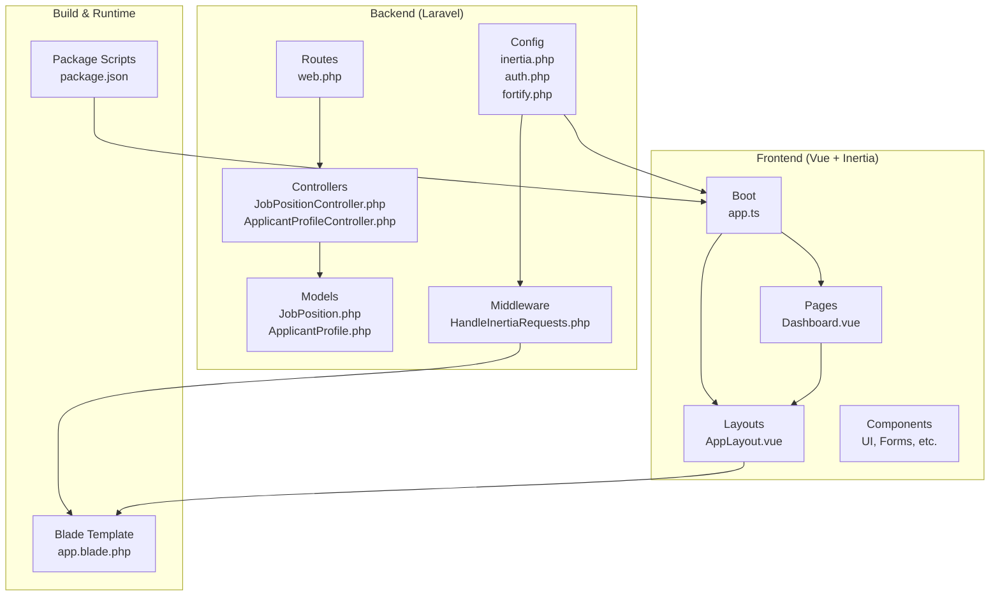
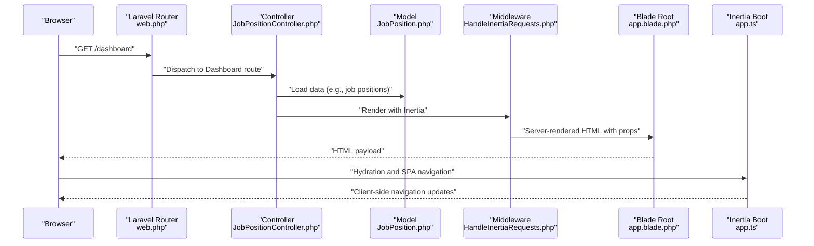
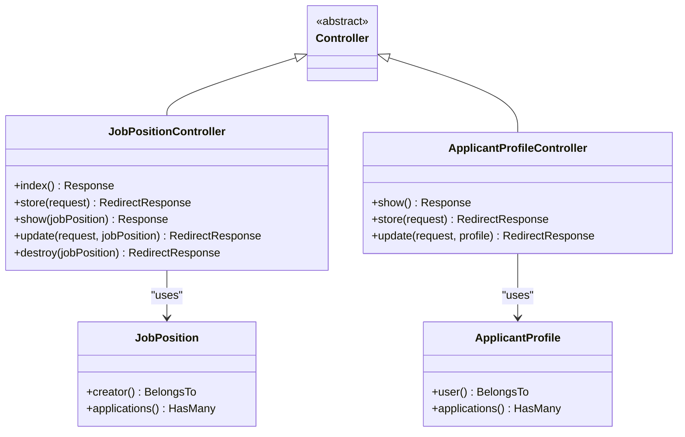
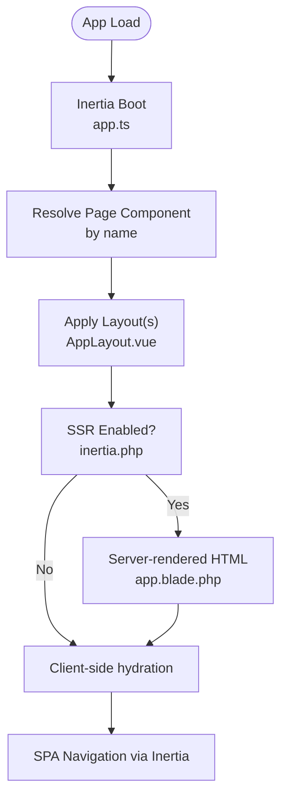
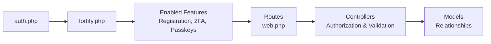
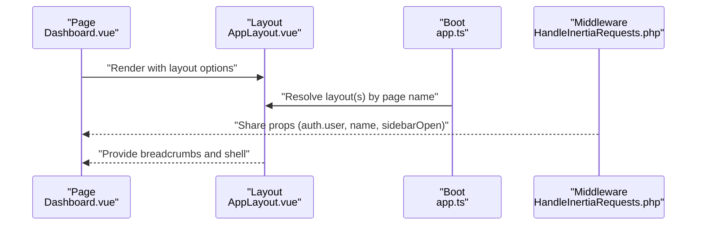
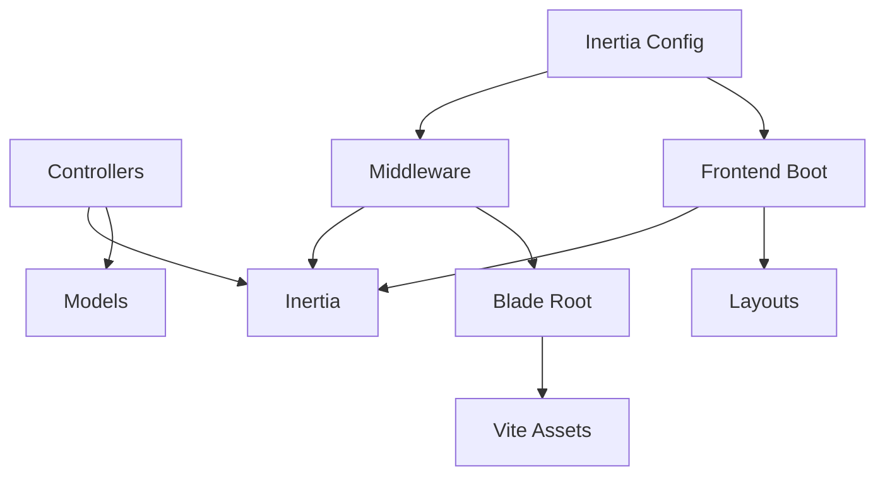

# Application Architecture

<cite>
**Referenced Files in This Document**
- [HandleInertiaRequests.php](file://app/Http/Middleware/HandleInertiaRequests.php)
- [app.ts](file://resources/js/app.ts)
- [inertia.php](file://config/inertia.php)
- [web.php](file://routes/web.php)
- [Controller.php](file://app/Http/Controllers/Controller.php)
- [JobPositionController.php](file://app/Http/Controllers/JobPositionController.php)
- [ApplicantProfileController.php](file://app/Http/Controllers/ApplicantProfileController.php)
- [JobPosition.php](file://app/Models/JobPosition.php)
- [ApplicantProfile.php](file://app/Models/ApplicantProfile.php)
- [app.blade.php](file://resources/views/app.blade.php)
- [AppLayout.vue](file://resources/js/layouts/AppLayout.vue)
- [Dashboard.vue](file://resources/js/pages/Dashboard.vue)
- [auth.php](file://config/auth.php)
- [fortify.php](file://config/fortify.php)
- [package.json](file://package.json)
</cite>

## Table of Contents
1. [Introduction](#introduction)
2. [Project Structure](#project-structure)
3. [Core Components](#core-components)
4. [Architecture Overview](#architecture-overview)
5. [Detailed Component Analysis](#detailed-component-analysis)
6. [Dependency Analysis](#dependency-analysis)
7. [Performance Considerations](#performance-considerations)
8. [Troubleshooting Guide](#troubleshooting-guide)
9. [Conclusion](#conclusion)
10. [Appendices](#appendices)

## Introduction
This document describes the SmartRecruit ATS system architecture, focusing on the high-level Model-View-Controller (MVC) design implemented with a Laravel backend and a Vue.js frontend powered by Inertia.js. It explains how server-side rendering and SPA-like navigation coexist, outlines the directory structure and component interactions, documents system boundaries, and covers cross-cutting concerns such as authentication, authorization, and validation.

## Project Structure
The project follows a conventional Laravel application layout with dedicated areas for backend logic and frontend assets:
- Backend MVC: app/ (controllers, models, middleware, requests, providers)
- Frontend SPA: resources/js/ (Vue components, pages, layouts, composables)
- Views and SSR: resources/views/ (Blade root template and server-side rendering)
- Routing: routes/ (web routes and settings)
- Configuration: config/ (Inertia, auth, Fortify, etc.)
- Tests: tests/ (Feature and Unit test suites)
- Build and dependencies: package.json, vite.config.ts, and related tooling

**Diagram sources**
- [web.php:1-32](file://routes/web.php#L1-L32)
- [JobPositionController.php:1-55](file://app/Http/Controllers/JobPositionController.php#L1-L55)
- [ApplicantProfileController.php:1-59](file://app/Http/Controllers/ApplicantProfileController.php#L1-L59)
- [JobPosition.php:1-39](file://app/Models/JobPosition.php#L1-L39)
- [ApplicantProfile.php:1-41](file://app/Models/ApplicantProfile.php#L1-L41)
- [HandleInertiaRequests.php:1-48](file://app/Http/Middleware/HandleInertiaRequests.php#L1-L48)
- [inertia.php:1-71](file://config/inertia.php#L1-L71)
- [auth.php:1-118](file://config/auth.php#L1-L118)
- [fortify.php:1-178](file://config/fortify.php#L1-L178)
- [app.ts:1-34](file://resources/js/app.ts#L1-L34)
- [AppLayout.vue:1-15](file://resources/js/layouts/AppLayout.vue#L1-L15)
- [Dashboard.vue:1-48](file://resources/js/pages/Dashboard.vue#L1-L48)
- [app.blade.php:1-48](file://resources/views/app.blade.php#L1-L48)
- [package.json:1-62](file://package.json#L1-L62)

**Section sources**
- [web.php:1-32](file://routes/web.php#L1-L32)
- [inertia.php:1-71](file://config/inertia.php#L1-L71)
- [app.ts:1-34](file://resources/js/app.ts#L1-L34)
- [app.blade.php:1-48](file://resources/views/app.blade.php#L1-L48)
- [package.json:1-62](file://package.json#L1-L62)

## Core Components
- Controllers orchestrate HTTP requests and render Inertia responses. Examples:
  - JobPositionController: handles listing, creation, viewing, updating, and deletion of job positions with role-based authorization.
  - ApplicantProfileController: manages applicant profiles, including resume uploads and ownership checks.
- Models encapsulate business entities and relationships:
  - JobPosition: belongs to a creator (User) and has many applications.
  - ApplicantProfile: belongs to a user and has many applications.
- Middleware integrates Inertia’s server-side rendering and shares global data (e.g., authenticated user, app name, sidebar state).
- Frontend:
  - app.ts bootstraps Inertia with layout resolution and progress indicators.
  - Pages (e.g., Dashboard.vue) declare layouts and metadata.
  - Layouts (e.g., AppLayout.vue) wrap page content and breadcrumbs.

**Section sources**
- [JobPositionController.php:1-55](file://app/Http/Controllers/JobPositionController.php#L1-L55)
- [ApplicantProfileController.php:1-59](file://app/Http/Controllers/ApplicantProfileController.php#L1-L59)
- [JobPosition.php:1-39](file://app/Models/JobPosition.php#L1-L39)
- [ApplicantProfile.php:1-41](file://app/Models/ApplicantProfile.php#L1-L41)
- [HandleInertiaRequests.php:1-48](file://app/Http/Middleware/HandleInertiaRequests.php#L1-L48)
- [app.ts:1-34](file://resources/js/app.ts#L1-L34)
- [AppLayout.vue:1-15](file://resources/js/layouts/AppLayout.vue#L1-L15)
- [Dashboard.vue:1-48](file://resources/js/pages/Dashboard.vue#L1-L48)

## Architecture Overview
SmartRecruit ATS uses a hybrid architecture:
- Laravel serves as the backend MVC engine, handling routing, controllers, models, middleware, and Blade templates for SSR.
- Vue.js powers the frontend with Inertia.js enabling seamless client-side navigation while preserving server-rendered initial pages.
- Shared state is passed from Laravel to Vue via Inertia props, ensuring hydration and consistent UI state.

**Diagram sources**
- [web.php:18-21](file://routes/web.php#L18-L21)
- [JobPositionController.php:14-20](file://app/Http/Controllers/JobPositionController.php#L14-L20)
- [JobPosition.php:29-37](file://app/Models/JobPosition.php#L29-L37)
- [HandleInertiaRequests.php:36-46](file://app/Http/Middleware/HandleInertiaRequests.php#L36-L46)
- [app.blade.php:39-45](file://resources/views/app.blade.php#L39-L45)
- [app.ts:10-27](file://resources/js/app.ts#L10-L27)

## Detailed Component Analysis

### MVC Layer Interactions
- Controllers depend on Request validators and Models to enforce business rules and data integrity.
- Middleware enriches each request with shared props for the frontend.
- Blade template renders the root shell and injects Vite bundles for styles and scripts.

**Diagram sources**
- [Controller.php:1-9](file://app/Http/Controllers/Controller.php#L1-L9)
- [JobPositionController.php:12-55](file://app/Http/Controllers/JobPositionController.php#L12-L55)
- [ApplicantProfileController.php:13-59](file://app/Http/Controllers/ApplicantProfileController.php#L13-L59)
- [JobPosition.php:10-38](file://app/Models/JobPosition.php#L10-L38)
- [ApplicantProfile.php:10-40](file://app/Models/ApplicantProfile.php#L10-L40)

**Section sources**
- [JobPositionController.php:1-55](file://app/Http/Controllers/JobPositionController.php#L1-L55)
- [ApplicantProfileController.php:1-59](file://app/Http/Controllers/ApplicantProfileController.php#L1-L59)
- [JobPosition.php:1-39](file://app/Models/JobPosition.php#L1-L39)
- [ApplicantProfile.php:1-41](file://app/Models/ApplicantProfile.php#L1-L41)

### Inertia.js Integration and SPA Behavior
- Inertia bootstrapping resolves page components and applies layouts dynamically.
- Server-side rendering is enabled and configured, with a dedicated SSR URL.
- The root Blade template loads Vite assets and renders the Inertia app shell.

**Diagram sources**
- [app.ts:10-27](file://resources/js/app.ts#L10-L27)
- [inertia.php:18-23](file://config/inertia.php#L18-L23)
- [app.blade.php:39-45](file://resources/views/app.blade.php#L39-L45)

**Section sources**
- [app.ts:1-34](file://resources/js/app.ts#L1-L34)
- [inertia.php:1-71](file://config/inertia.php#L1-L71)
- [app.blade.php:1-48](file://resources/views/app.blade.php#L1-L48)

### Authentication, Authorization, and Validation
- Authentication and session guard are configured in auth.php.
- Fortify provides registration, password reset, email verification, two-factor authentication, and passkeys features.
- Controllers enforce authorization policies (e.g., role checks) and rely on Form Request classes for validation.

**Diagram sources**
- [auth.php:1-118](file://config/auth.php#L1-L118)
- [fortify.php:1-178](file://config/fortify.php#L1-L178)
- [web.php:18-29](file://routes/web.php#L18-L29)
- [JobPositionController.php:46-48](file://app/Http/Controllers/JobPositionController.php#L46-L48)
- [ApplicantProfileController.php:40-42](file://app/Http/Controllers/ApplicantProfileController.php#L40-L42)

**Section sources**
- [auth.php:1-118](file://config/auth.php#L1-L118)
- [fortify.php:1-178](file://config/fortify.php#L1-L178)
- [JobPositionController.php:46-48](file://app/Http/Controllers/JobPositionController.php#L46-L48)
- [ApplicantProfileController.php:40-42](file://app/Http/Controllers/ApplicantProfileController.php#L40-L42)

### Frontend Component Interaction
- Pages declare metadata and layout preferences.
- Layouts wrap content and manage breadcrumbs and navigation.
- Global props (e.g., authenticated user, app name) are shared via middleware.

**Diagram sources**
- [Dashboard.vue:6-15](file://resources/js/pages/Dashboard.vue#L6-L15)
- [AppLayout.vue:1-15](file://resources/js/layouts/AppLayout.vue#L1-L15)
- [app.ts:12-23](file://resources/js/app.ts#L12-L23)
- [HandleInertiaRequests.php:36-46](file://app/Http/Middleware/HandleInertiaRequests.php#L36-L46)

**Section sources**
- [Dashboard.vue:1-48](file://resources/js/pages/Dashboard.vue#L1-L48)
- [AppLayout.vue:1-15](file://resources/js/layouts/AppLayout.vue#L1-L15)
- [app.ts:1-34](file://resources/js/app.ts#L1-L34)
- [HandleInertiaRequests.php:1-48](file://app/Http/Middleware/HandleInertiaRequests.php#L1-L48)

## Dependency Analysis
- Controllers depend on:
  - Request validators (not shown here but referenced by controllers)
  - Models for persistence and relationships
  - Inertia for rendering responses
- Middleware depends on:
  - Inertia core for SSR and shared data
  - Config for SSR URL and page discovery
- Frontend boot depends on:
  - Inertia/Vue integration
  - Layout resolution and progress indicators
- Blade template depends on:
  - Vite for asset bundling
  - Inertia directives for SSR

**Diagram sources**
- [JobPositionController.php:5-10](file://app/Http/Controllers/JobPositionController.php#L5-L10)
- [ApplicantProfileController.php:5-11](file://app/Http/Controllers/ApplicantProfileController.php#L5-L11)
- [HandleInertiaRequests.php:6-27](file://app/Http/Middleware/HandleInertiaRequests.php#L6-L27)
- [inertia.php:18-51](file://config/inertia.php#L18-L51)
- [app.ts:1-7](file://resources/js/app.ts#L1-L7)
- [app.blade.php:39-45](file://resources/views/app.blade.php#L39-L45)

**Section sources**
- [JobPositionController.php:1-55](file://app/Http/Controllers/JobPositionController.php#L1-L55)
- [ApplicantProfileController.php:1-59](file://app/Http/Controllers/ApplicantProfileController.php#L1-L59)
- [HandleInertiaRequests.php:1-48](file://app/Http/Middleware/HandleInertiaRequests.php#L1-L48)
- [inertia.php:1-71](file://config/inertia.php#L1-L71)
- [app.ts:1-34](file://resources/js/app.ts#L1-L34)
- [app.blade.php:1-48](file://resources/views/app.blade.php#L1-L48)

## Performance Considerations
- SSR can improve initial page load performance and SEO; ensure the SSR service is reachable at the configured URL.
- Prefer eager loading of relationships in controllers (already demonstrated with with() and load()) to reduce N+1 queries.
- Minimize heavy computations in Blade templates; delegate to controllers or Vue composables where appropriate.
- Keep shared props minimal to reduce payload size during hydration.

## Troubleshooting Guide
- If SSR fails, verify the SSR URL in Inertia configuration and ensure the SSR process is running.
- If layouts do not apply, check the page name resolution and layout switch logic in the frontend boot.
- If authentication redirects occur unexpectedly, review guard and middleware stack in routes and ensure proper session state.
- For asset loading issues, confirm Vite dev/build scripts and the Blade template inclusion of assets.

**Section sources**
- [inertia.php:18-23](file://config/inertia.php#L18-L23)
- [app.ts:12-23](file://resources/js/app.ts#L12-L23)
- [web.php:18-29](file://routes/web.php#L18-L29)
- [app.blade.php:39-45](file://resources/views/app.blade.php#L39-L45)

## Conclusion
SmartRecruit ATS combines Laravel’s robust MVC architecture with Vue.js and Inertia.js to deliver a modern, responsive application. The system leverages server-side rendering for optimal first-load performance while enabling SPA-like navigation. Clear separation of concerns across controllers, models, middleware, and Vue components ensures maintainability and scalability.

## Appendices
- Build pipeline: Vite compiles frontend assets; scripts are defined in package.json for development, production, and SSR builds.
- Deployment topology: The Laravel application serves the Blade root and handles API-like interactions via Inertia, while the frontend assets are managed by Vite.

**Section sources**
- [package.json:5-14](file://package.json#L5-L14)
- [app.blade.php:39-45](file://resources/views/app.blade.php#L39-L45)