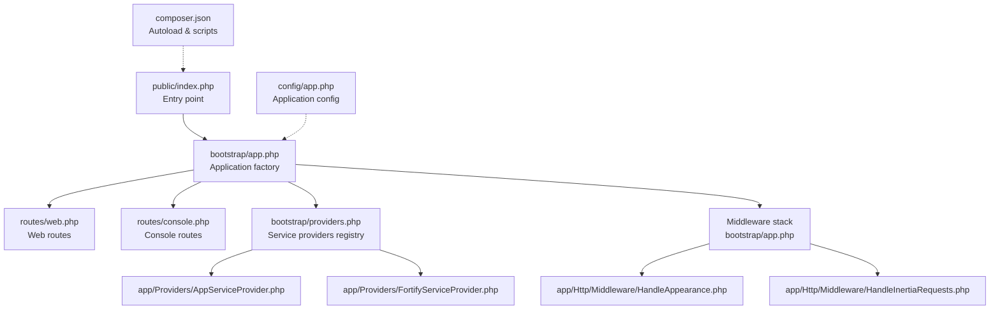
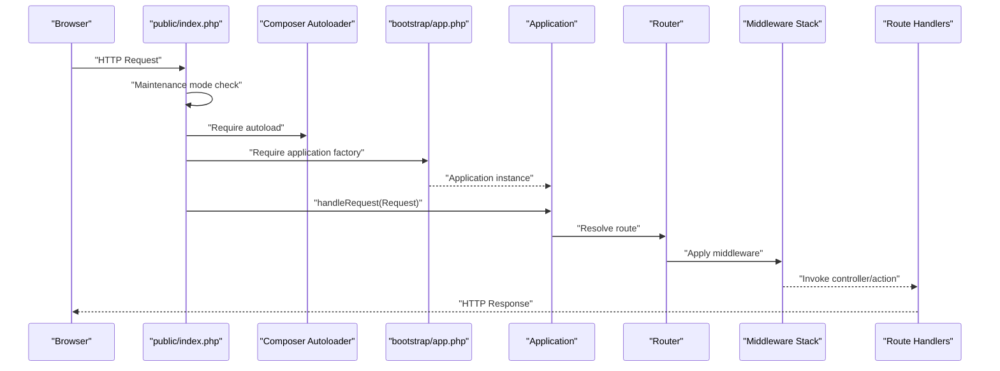
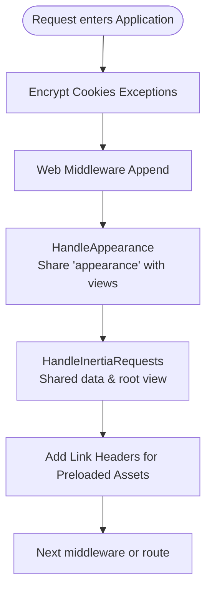
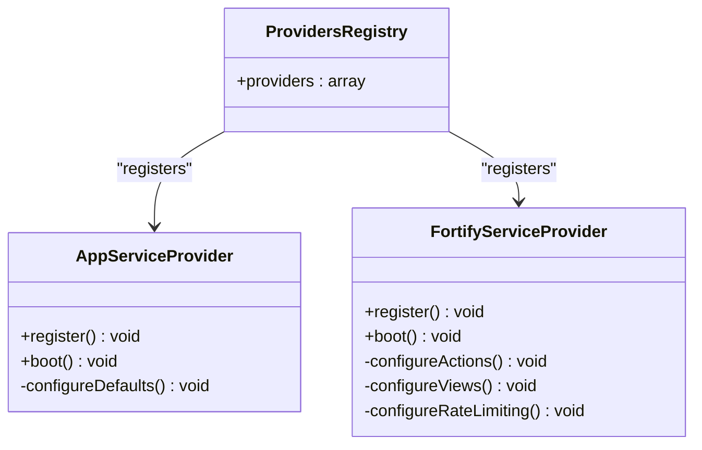
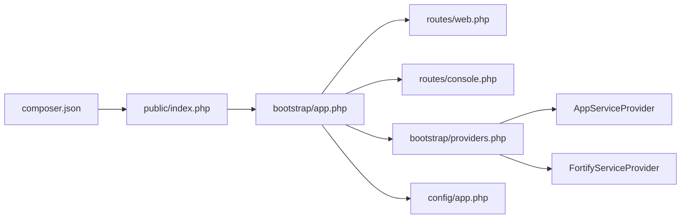

# Application Bootstrapping

<cite>
**Referenced Files in This Document**
- [bootstrap/app.php](file://bootstrap/app.php)
- [bootstrap/providers.php](file://bootstrap/providers.php)
- [config/app.php](file://config/app.php)
- [public/index.php](file://public/index.php)
- [app/Providers/AppServiceProvider.php](file://app/Providers/AppServiceProvider.php)
- [app/Providers/FortifyServiceProvider.php](file://app/Providers/FortifyServiceProvider.php)
- [app/Http/Middleware/HandleAppearance.php](file://app/Http/Middleware/HandleAppearance.php)
- [app/Http/Middleware/HandleInertiaRequests.php](file://app/Http/Middleware/HandleInertiaRequests.php)
- [routes/web.php](file://routes/web.php)
- [routes/console.php](file://routes/console.php)
- [composer.json](file://composer.json)
- [boost.json](file://boost.json)
</cite>

## Table of Contents
1. [Introduction](#introduction)
2. [Project Structure](#project-structure)
3. [Core Components](#core-components)
4. [Architecture Overview](#architecture-overview)
5. [Detailed Component Analysis](#detailed-component-analysis)
6. [Dependency Analysis](#dependency-analysis)
7. [Performance Considerations](#performance-considerations)
8. [Troubleshooting Guide](#troubleshooting-guide)
9. [Conclusion](#conclusion)
10. [Appendices](#appendices)

## Introduction
This document explains how SmartRecruit ATS boots and initializes the Laravel application. It focuses on the bootstrapping pipeline defined in bootstrap/app.php, including routing, middleware, exception handling, service provider registration, environment detection, and configuration caching strategies. It also covers autoload configuration, class loading optimization, and optional performance enhancements via Laravel Boost. Practical examples demonstrate environment-specific bootstrapping, custom initialization patterns, and production deployment considerations.

## Project Structure
The bootstrapping lifecycle begins at the front controller (public/index.php), which loads Composer’s autoloader, requires the application factory (bootstrap/app.php), and delegates request handling to the Application instance. Routing and middleware are configured in bootstrap/app.php, while service providers are registered via bootstrap/providers.php. Application-wide configuration resides in config/app.php, and autoload behavior is defined in composer.json.

**Diagram sources**
- [public/index.php:1-21](file://public/index.php#L1-L21)
- [bootstrap/app.php:11-31](file://bootstrap/app.php#L11-L31)
- [bootstrap/providers.php:1-10](file://bootstrap/providers.php#L1-L10)
- [routes/web.php:1-32](file://routes/web.php#L1-L32)
- [routes/console.php:1-9](file://routes/console.php#L1-L9)
- [app/Providers/AppServiceProvider.php:1-51](file://app/Providers/AppServiceProvider.php#L1-L51)
- [app/Providers/FortifyServiceProvider.php:1-101](file://app/Providers/FortifyServiceProvider.php#L1-L101)
- [app/Http/Middleware/HandleAppearance.php:1-24](file://app/Http/Middleware/HandleAppearance.php#L1-L24)
- [app/Http/Middleware/HandleInertiaRequests.php:1-48](file://app/Http/Middleware/HandleInertiaRequests.php#L1-L48)
- [config/app.php:1-127](file://config/app.php#L1-L127)
- [composer.json:1-119](file://composer.json#L1-L119)

**Section sources**
- [public/index.php:1-21](file://public/index.php#L1-L21)
- [bootstrap/app.php:11-31](file://bootstrap/app.php#L11-L31)
- [bootstrap/providers.php:1-10](file://bootstrap/providers.php#L1-L10)
- [routes/web.php:1-32](file://routes/web.php#L1-L32)
- [routes/console.php:1-9](file://routes/console.php#L1-L9)
- [config/app.php:1-127](file://config/app.php#L1-L127)
- [composer.json:1-119](file://composer.json#L1-L119)

## Core Components
- Application factory: Defines routing, middleware, and exception handling configuration and produces the Application instance.
- Front controller: Loads maintenance mode guard, Composer autoloader, and the application factory, then handles the request.
- Service providers: Registered centrally and bootstrapped after container creation to configure application defaults and integrations.
- Middleware stack: Web middleware includes appearance handling, Inertia requests, and preloading header support.
- Configuration: Centralized in config/app.php with environment-driven values and maintenance mode settings.
- Autoload and scripts: PSR-4 namespaces and Composer scripts optimize class loading and package discovery.

**Section sources**
- [bootstrap/app.php:11-31](file://bootstrap/app.php#L11-L31)
- [public/index.php:1-21](file://public/index.php#L1-L21)
- [bootstrap/providers.php:1-10](file://bootstrap/providers.php#L1-L10)
- [app/Providers/AppServiceProvider.php:24-49](file://app/Providers/AppServiceProvider.php#L24-L49)
- [app/Providers/FortifyServiceProvider.php:30-35](file://app/Providers/FortifyServiceProvider.php#L30-L35)
- [app/Http/Middleware/HandleAppearance.php:17-22](file://app/Http/Middleware/HandleAppearance.php#L17-L22)
- [app/Http/Middleware/HandleInertiaRequests.php:36-46](file://app/Http/Middleware/HandleInertiaRequests.php#L36-L46)
- [config/app.php:29-124](file://config/app.php#L29-L124)
- [composer.json:33-44](file://composer.json#L33-L44)

## Architecture Overview
The boot process follows a predictable sequence: front controller initialization, maintenance mode evaluation, autoloading, application factory invocation, and request dispatch. Routing and middleware are configured early to ensure all requests traverse the intended pipeline.

**Diagram sources**
- [public/index.php:8-21](file://public/index.php#L8-L21)
- [bootstrap/app.php:11-31](file://bootstrap/app.php#L11-L31)

## Detailed Component Analysis

### Application Factory and Routing Configuration
- Routing is configured to load web and console route files and expose a health endpoint.
- The factory method sets up the application base path and returns a configured Application instance ready to handle requests.

**Section sources**
- [bootstrap/app.php:12-16](file://bootstrap/app.php#L12-L16)

### Middleware Setup
- Cookie encryption exemptions are declared to avoid encrypting appearance-related cookies.
- Web middleware stack includes:
  - Appearance handling to share UI preferences with views.
  - Inertia requests to provide shared data and root template behavior.
  - Preload header support for improved asset delivery.

**Diagram sources**
- [bootstrap/app.php:17-25](file://bootstrap/app.php#L17-L25)
- [app/Http/Middleware/HandleAppearance.php:17-22](file://app/Http/Middleware/HandleAppearance.php#L17-L22)
- [app/Http/Middleware/HandleInertiaRequests.php:36-46](file://app/Http/Middleware/HandleInertiaRequests.php#L36-L46)

**Section sources**
- [bootstrap/app.php:17-25](file://bootstrap/app.php#L17-L25)
- [app/Http/Middleware/HandleAppearance.php:17-22](file://app/Http/Middleware/HandleAppearance.php#L17-L22)
- [app/Http/Middleware/HandleInertiaRequests.php:36-46](file://app/Http/Middleware/HandleInertiaRequests.php#L36-L46)

### Exception Handling
- JSON rendering is enabled for API routes automatically, ensuring structured responses for AJAX and SPA clients.

**Section sources**
- [bootstrap/app.php:26-30](file://bootstrap/app.php#L26-L30)

### Service Provider Registration Mechanism
- The providers registry lists AppServiceProvider and FortifyServiceProvider.
- AppServiceProvider configures production-ready defaults:
  - Immutable dates via CarbonImmutable.
  - Destructive command prohibition in production.
  - Password policy defaults tailored to production.
- FortifyServiceProvider configures authentication actions, views, and rate limiters.

**Diagram sources**
- [bootstrap/providers.php:6-9](file://bootstrap/providers.php#L6-L9)
- [app/Providers/AppServiceProvider.php:16-49](file://app/Providers/AppServiceProvider.php#L16-L49)
- [app/Providers/FortifyServiceProvider.php:22-99](file://app/Providers/FortifyServiceProvider.php#L22-L99)

**Section sources**
- [bootstrap/providers.php:1-10](file://bootstrap/providers.php#L1-L10)
- [app/Providers/AppServiceProvider.php:24-49](file://app/Providers/AppServiceProvider.php#L24-L49)
- [app/Providers/FortifyServiceProvider.php:30-99](file://app/Providers/FortifyServiceProvider.php#L30-L99)

### Application Environment Detection and Configuration Caching
- Environment is determined by APP_ENV with fallback to production.
- Debug mode is controlled by APP_DEBUG.
- URL and timezone are environment-driven.
- Maintenance mode driver and store are configurable via APP_MAINTENANCE_DRIVER and APP_MAINTENANCE_STORE.
- Configuration caching strategies are commonly used in production to reduce bootstrap overhead; while not explicitly configured here, the environment variables enable centralized control.

**Section sources**
- [config/app.php:29](file://config/app.php#L29)
- [config/app.php:42](file://config/app.php#L42)
- [config/app.php:55](file://config/app.php#L55)
- [config/app.php:68](file://config/app.php#L68)
- [config/app.php:121-124](file://config/app.php#L121-L124)

### Autoload Configuration and Class Loading Optimization
- PSR-4 namespaces define class-to-path mappings for app/, database/factories/, database/seeders/, and tests/.
- Composer scripts automate installation, key generation, migration, and package discovery.
- Optimizations include enabling optimize-autoloader and preferring dist installs.

**Section sources**
- [composer.json:33-44](file://composer.json#L33-L44)
- [composer.json:80-87](file://composer.json#L80-L87)
- [composer.json:108-116](file://composer.json#L108-L116)

### Preloading Mechanisms
- The middleware stack includes a dedicated middleware to add link headers for preloaded assets, supporting improved asset delivery performance.

**Section sources**
- [bootstrap/app.php:23](file://bootstrap/app.php#L23)

### Environment-Specific Bootstrapping Examples
- Production readiness:
  - Immutable dates and stricter destructive command policies.
  - Stronger password defaults.
  - Maintenance mode driver selection via environment variables.
- Development ergonomics:
  - Debug mode enabled via APP_DEBUG.
  - Scripts orchestrate local setup and watch tasks.

**Section sources**
- [app/Providers/AppServiceProvider.php:32-49](file://app/Providers/AppServiceProvider.php#L32-L49)
- [config/app.php:42](file://config/app.php#L42)
- [composer.json:54-57](file://composer.json#L54-L57)

### Custom Bootstrapping Logic Patterns
- Centralized provider boot logic ensures consistent initialization across environments.
- Middleware composition allows cross-cutting concerns (appearance, inertia, preload headers) to be applied uniformly.

**Section sources**
- [app/Providers/AppServiceProvider.php:24-49](file://app/Providers/AppServiceProvider.php#L24-L49)
- [app/Http/Middleware/HandleAppearance.php:17-22](file://app/Http/Middleware/HandleAppearance.php#L17-L22)
- [app/Http/Middleware/HandleInertiaRequests.php:36-46](file://app/Http/Middleware/HandleInertiaRequests.php#L36-L46)

### Application Initialization Patterns
- Front controller pattern: Maintenance guard, autoloader, and application factory invocation.
- Declarative routing and middleware configuration in the application factory.
- Provider-driven initialization for third-party integrations and application defaults.

**Section sources**
- [public/index.php:8-21](file://public/index.php#L8-L21)
- [bootstrap/app.php:12-30](file://bootstrap/app.php#L12-L30)
- [bootstrap/providers.php:6-9](file://bootstrap/providers.php#L6-L9)

## Dependency Analysis
The boot process exhibits clear separation of concerns:
- public/index.php depends on Composer autoloader and bootstrap/app.php.
- bootstrap/app.php defines routing, middleware, and exception handling and depends on configuration files.
- bootstrap/providers.php enumerates service providers that are booted by the framework.
- app/Providers/* implement application-specific initialization logic.
- composer.json governs autoload resolution and script execution.

**Diagram sources**
- [public/index.php:13-18](file://public/index.php#L13-L18)
- [bootstrap/app.php:11-31](file://bootstrap/app.php#L11-L31)
- [bootstrap/providers.php:6-9](file://bootstrap/providers.php#L6-L9)
- [routes/web.php:1-32](file://routes/web.php#L1-L32)
- [routes/console.php:1-9](file://routes/console.php#L1-L9)
- [config/app.php:1-127](file://config/app.php#L1-L127)
- [composer.json:1-119](file://composer.json#L1-L119)

**Section sources**
- [public/index.php:13-18](file://public/index.php#L13-L18)
- [bootstrap/app.php:11-31](file://bootstrap/app.php#L11-L31)
- [bootstrap/providers.php:6-9](file://bootstrap/providers.php#L6-L9)
- [routes/web.php:1-32](file://routes/web.php#L1-L32)
- [routes/console.php:1-9](file://routes/console.php#L1-L9)
- [config/app.php:1-127](file://config/app.php#L1-L127)
- [composer.json:1-119](file://composer.json#L1-L119)

## Performance Considerations
- Enable configuration caching in production to minimize file reads during boot.
- Keep autoload optimization enabled and prefer dist packages for faster installs.
- Use preloading headers middleware to improve asset delivery performance.
- Leverage Laravel Boost for development-time performance improvements and tooling assistance.

**Section sources**
- [composer.json:108-116](file://composer.json#L108-L116)
- [bootstrap/app.php:23](file://bootstrap/app.php#L23)
- [boost.json:1-19](file://boost.json#L1-L19)

## Troubleshooting Guide
- Maintenance mode: If the application appears down, check the maintenance file in storage/framework and remove it to restore normal operation.
- Autoload issues: Run Composer dump-autoload or install to regenerate autoload files.
- Environment variables: Verify APP_ENV, APP_DEBUG, APP_URL, and maintenance driver/store settings.
- Middleware order: Confirm custom middleware ordering does not inadvertently bypass critical checks.
- Provider registration: Ensure providers are listed in bootstrap/providers.php and boot methods execute as expected.

**Section sources**
- [public/index.php:8-11](file://public/index.php#L8-L11)
- [composer.json:80-87](file://composer.json#L80-L87)
- [config/app.php:29](file://config/app.php#L29)
- [config/app.php:42](file://config/app.php#L42)
- [config/app.php:121-124](file://config/app.php#L121-L124)
- [bootstrap/providers.php:6-9](file://bootstrap/providers.php#L6-L9)

## Conclusion
SmartRecruit ATS bootstraps efficiently through a concise application factory, centralized routing and middleware configuration, and provider-driven initialization. Environment variables and configuration files enable flexible behavior across development and production. Composer scripts and autoload settings streamline installation and class resolution. Optional performance enhancements, such as configuration caching and Laravel Boost, further optimize the boot process for production deployments.

## Appendices
- Example route groups and resource controllers are defined in routes/web.php.
- Console command registration is defined in routes/console.php.
- Laravel Boost configuration is defined in boost.json.

**Section sources**
- [routes/web.php:18-32](file://routes/web.php#L18-L32)
- [routes/console.php:6-9](file://routes/console.php#L6-L9)
- [boost.json:1-19](file://boost.json#L1-L19)