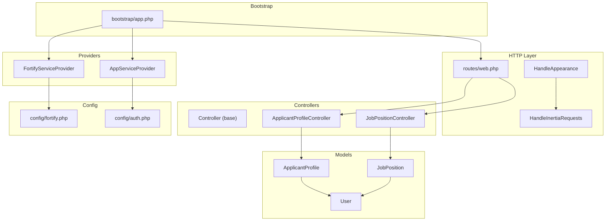
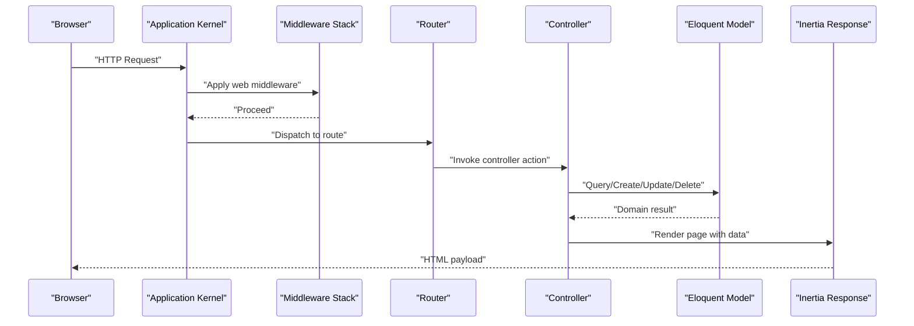
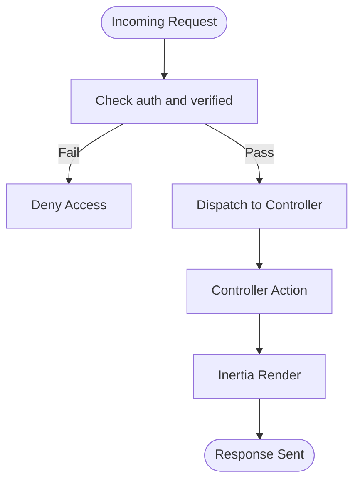
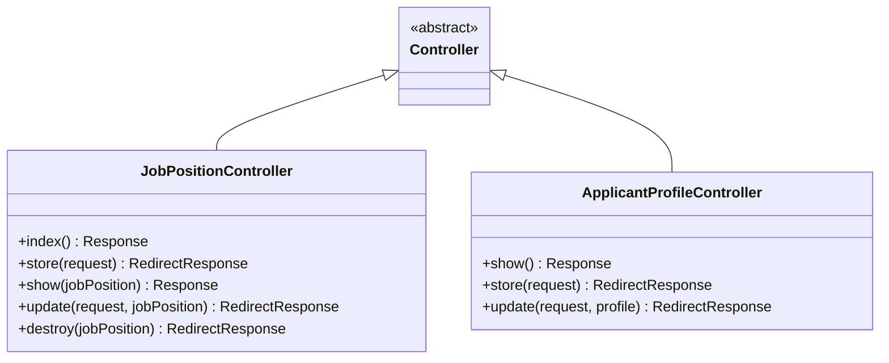
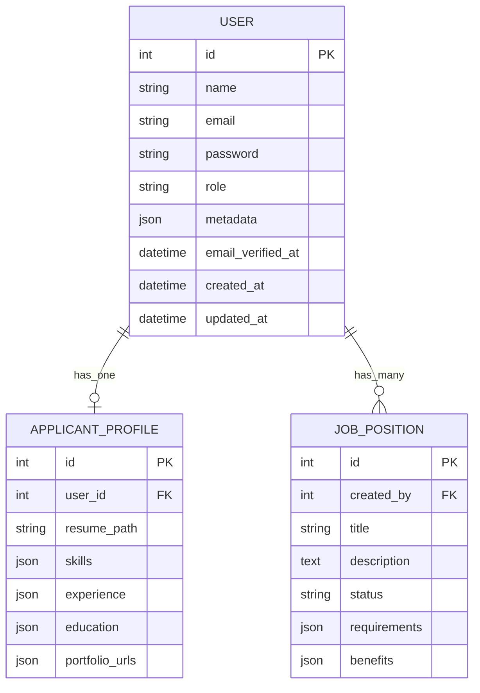
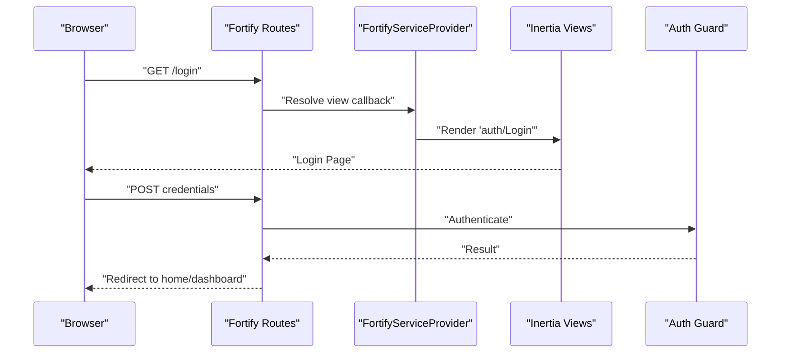
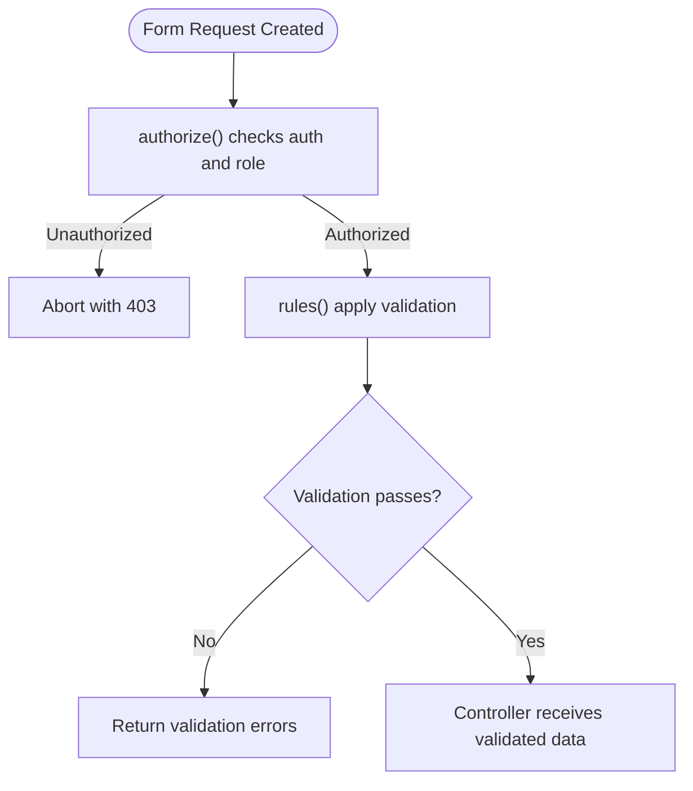
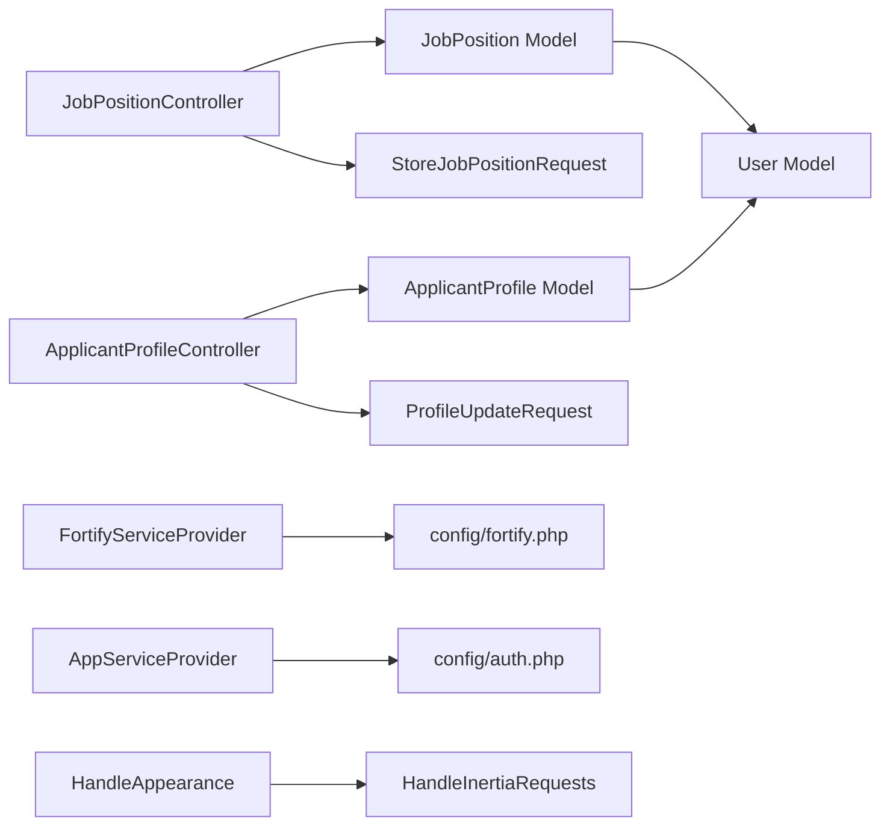

# Backend Architecture

<cite>
**Referenced Files in This Document**
- [bootstrap/app.php](file://bootstrap/app.php)
- [app/Providers/AppServiceProvider.php](file://app/Providers/AppServiceProvider.php)
- [app/Providers/FortifyServiceProvider.php](file://app/Providers/FortifyServiceProvider.php)
- [config/fortify.php](file://config/fortify.php)
- [config/auth.php](file://config/auth.php)
- [routes/web.php](file://routes/web.php)
- [app/Http/Middleware/HandleAppearance.php](file://app/Http/Middleware/HandleAppearance.php)
- [app/Http/Middleware/HandleInertiaRequests.php](file://app/Http/Middleware/HandleInertiaRequests.php)
- [app/Http/Controllers/Controller.php](file://app/Http/Controllers/Controller.php)
- [app/Http/Controllers/JobPositionController.php](file://app/Http/Controllers/JobPositionController.php)
- [app/Http/Controllers/ApplicantProfileController.php](file://app/Http/Controllers/ApplicantProfileController.php)
- [app/Models/User.php](file://app/Models/User.php)
- [app/Models/ApplicantProfile.php](file://app/Models/ApplicantProfile.php)
- [app/Models/JobPosition.php](file://app/Models/JobPosition.php)
- [app/Http/Requests/StoreJobPositionRequest.php](file://app/Http/Requests/StoreJobPositionRequest.php)
- [app/Http/Requests/Settings/ProfileUpdateRequest.php](file://app/Http/Requests/Settings/ProfileUpdateRequest.php)
- [app/Concerns/PasswordValidationRules.php](file://app/Concerns/PasswordValidationRules.php)
- [app/Concerns/ProfileValidationRules.php](file://app/Concerns/ProfileValidationRules.php)
</cite>

## Table of Contents
1. [Introduction](#introduction)
2. [Project Structure](#project-structure)
3. [Core Components](#core-components)
4. [Architecture Overview](#architecture-overview)
5. [Detailed Component Analysis](#detailed-component-analysis)
6. [Dependency Analysis](#dependency-analysis)
7. [Performance Considerations](#performance-considerations)
8. [Troubleshooting Guide](#troubleshooting-guide)
9. [Conclusion](#conclusion)

## Introduction
This document describes the backend architecture of the SmartRecruit ATS system built with Laravel. It focuses on the MVC implementation, routing architecture, middleware integration, bootstrapping and service provider configuration, and the integration with Laravel Fortify for authentication. It also explains the request lifecycle, controller-layer organization, model relationships, and exception handling strategies.

## Project Structure
The backend follows Laravel’s conventional structure with a focus on modular organization:
- Controllers under app/Http/Controllers
- Middleware under app/Http/Middleware
- Models under app/Models
- Request validation classes under app/Http/Requests
- Service providers under app/Providers
- Configuration under config/*
- Routing under routes/*

**Diagram sources**
- [bootstrap/app.php:11-30](file://bootstrap/app.php#L11-L30)
- [routes/web.php:18-29](file://routes/web.php#L18-L29)
- [app/Http/Controllers/Controller.php:5-8](file://app/Http/Controllers/Controller.php#L5-L8)
- [app/Http/Controllers/JobPositionController.php:12-54](file://app/Http/Controllers/JobPositionController.php#L12-L54)
- [app/Http/Controllers/ApplicantProfileController.php:13-58](file://app/Http/Controllers/ApplicantProfileController.php#L13-L58)
- [app/Models/User.php:32-61](file://app/Models/User.php#L32-L61)
- [app/Models/ApplicantProfile.php:10-40](file://app/Models/ApplicantProfile.php#L10-L40)
- [app/Models/JobPosition.php:10-38](file://app/Models/JobPosition.php#L10-L38)
- [app/Providers/AppServiceProvider.php:11-49](file://app/Providers/AppServiceProvider.php#L11-L49)
- [app/Providers/FortifyServiceProvider.php:17-99](file://app/Providers/FortifyServiceProvider.php#L17-L99)
- [config/fortify.php:5-177](file://config/fortify.php#L5-L177)
- [config/auth.php:5-117](file://config/auth.php#L5-L117)

**Section sources**
- [bootstrap/app.php:11-30](file://bootstrap/app.php#L11-L30)
- [routes/web.php:1-32](file://routes/web.php#L1-L32)

## Core Components
- Bootstrapping and Container Setup: The application is configured via bootstrap/app.php, which wires routing, middleware, and exception handling.
- Service Providers:
  - AppServiceProvider sets production defaults for date handling, destructive DB command protection, and password policy.
  - FortifyServiceProvider configures authentication actions, views, and rate limiting for Fortify features.
- Routing: Web routes define resourceful controllers and Inertia-rendered pages, gated by auth and email verification.
- Middleware Stack: Custom middleware integrates appearance preferences and Inertia shared data; additional web middleware are appended centrally.
- MVC:
  - Controllers: JobPositionController and ApplicantProfileController orchestrate domain actions and render Inertia pages.
  - Models: Eloquent models encapsulate relationships and casting for Users, ApplicantProfiles, and JobPositions.
  - Requests: FormRequest classes centralize authorization and validation logic.

**Section sources**
- [bootstrap/app.php:11-30](file://bootstrap/app.php#L11-L30)
- [app/Providers/AppServiceProvider.php:11-49](file://app/Providers/AppServiceProvider.php#L11-L49)
- [app/Providers/FortifyServiceProvider.php:17-99](file://app/Providers/FortifyServiceProvider.php#L17-L99)
- [routes/web.php:18-29](file://routes/web.php#L18-L29)
- [app/Http/Controllers/JobPositionController.php:12-54](file://app/Http/Controllers/JobPositionController.php#L12-L54)
- [app/Http/Controllers/ApplicantProfileController.php:13-58](file://app/Http/Controllers/ApplicantProfileController.php#L13-L58)
- [app/Models/User.php:32-61](file://app/Models/User.php#L32-L61)
- [app/Models/ApplicantProfile.php:10-40](file://app/Models/ApplicantProfile.php#L10-L40)
- [app/Models/JobPosition.php:10-38](file://app/Models/JobPosition.php#L10-L38)

## Architecture Overview
The backend uses a layered architecture:
- Bootstrap layer initializes routing, middleware, and exception handling.
- HTTP layer handles requests through middleware, routes to controllers, and renders Inertia responses.
- Domain layer consists of controllers, models, and request validators.
- Authentication layer integrates Laravel Fortify with Inertia views and rate limiting.

**Diagram sources**
- [bootstrap/app.php:17-25](file://bootstrap/app.php#L17-L25)
- [routes/web.php:18-29](file://routes/web.php#L18-L29)
- [app/Http/Controllers/JobPositionController.php:14-20](file://app/Http/Controllers/JobPositionController.php#L14-L20)
- [app/Http/Controllers/ApplicantProfileController.php:15-22](file://app/Http/Controllers/ApplicantProfileController.php#L15-L22)

## Detailed Component Analysis

### Bootstrapping and Exception Handling
- Routing is configured with web and console routes and a health endpoint.
- Middleware configuration:
  - Cookie encryption exclusions for appearance and sidebar cookies.
  - Web middleware stack includes custom appearance handler, Inertia requests handler, and asset preloading header middleware.
- Exception handling:
  - JSON rendering is enabled for API routes automatically.

**Section sources**
- [bootstrap/app.php:11-30](file://bootstrap/app.php#L11-L30)

### Service Provider Configuration
- AppServiceProvider:
  - Sets immutable date class globally.
  - Prohibits destructive DB commands in production.
  - Configures password policy defaults for production.
- FortifyServiceProvider:
  - Registers custom actions for user creation and password resets.
  - Provides Inertia-based views for login, registration, password reset, email verification, two-factor challenge, and password confirmation.
  - Defines rate limiters for two-factor, login, and passkeys.

**Section sources**
- [app/Providers/AppServiceProvider.php:11-49](file://app/Providers/AppServiceProvider.php#L11-L49)
- [app/Providers/FortifyServiceProvider.php:17-99](file://app/Providers/FortifyServiceProvider.php#L17-L99)

### Routing Architecture and Middleware Integration
- Web routes:
  - Home and dashboard routes with Inertia rendering.
  - Resource routes for job positions.
  - Applicant profile routes for show/store/update.
  - Auth and email verification required for protected routes.
- Middleware integration:
  - Custom middleware injects appearance preference and shared Inertia data.
  - Additional web middleware appended centrally in bootstrap.

**Diagram sources**
- [routes/web.php:18-29](file://routes/web.php#L18-L29)
- [app/Http/Middleware/HandleAppearance.php:17-22](file://app/Http/Middleware/HandleAppearance.php#L17-L22)
- [app/Http/Middleware/HandleInertiaRequests.php:36-46](file://app/Http/Middleware/HandleInertiaRequests.php#L36-L46)

**Section sources**
- [routes/web.php:1-32](file://routes/web.php#L1-L32)
- [app/Http/Middleware/HandleAppearance.php:10-23](file://app/Http/Middleware/HandleAppearance.php#L10-L23)
- [app/Http/Middleware/HandleInertiaRequests.php:8-47](file://app/Http/Middleware/HandleInertiaRequests.php#L8-L47)

### Controller-Layer Organization
- Base Controller:
  - Minimal base class for shared controller behavior.
- JobPositionController:
  - Index lists job positions with creator eager-loaded.
  - Store creates a new job position via the authenticated user’s relationship.
  - Show loads creator data and renders the job detail page.
  - Update validates and updates the position.
  - Destroy enforces HRD role and deletes the position.
- ApplicantProfileController:
  - Show retrieves the authenticated user’s profile.
  - Store validates, optionally stores resume, and creates profile.
  - Update validates, conditionally replaces resume, and updates profile with ownership check.

**Diagram sources**
- [app/Http/Controllers/Controller.php:5-8](file://app/Http/Controllers/Controller.php#L5-L8)
- [app/Http/Controllers/JobPositionController.php:12-54](file://app/Http/Controllers/JobPositionController.php#L12-L54)
- [app/Http/Controllers/ApplicantProfileController.php:13-58](file://app/Http/Controllers/ApplicantProfileController.php#L13-L58)

**Section sources**
- [app/Http/Controllers/Controller.php:5-8](file://app/Http/Controllers/Controller.php#L5-L8)
- [app/Http/Controllers/JobPositionController.php:12-54](file://app/Http/Controllers/JobPositionController.php#L12-L54)
- [app/Http/Controllers/ApplicantProfileController.php:13-58](file://app/Http/Controllers/ApplicantProfileController.php#L13-L58)

### Model Relationships and Data Modeling
- User:
  - Has one ApplicantProfile.
  - Has many JobPositions via created_by foreign key.
  - Implements passkeys and two-factor authentication traits.
- ApplicantProfile:
  - Belongs to User.
  - Has many Applications.
  - Casts arrays for skills, experience, education, and portfolio URLs.
- JobPosition:
  - Belongs to User as creator.
  - Has many Applications.
  - Casts arrays for requirements and benefits.

**Diagram sources**
- [app/Models/User.php:32-61](file://app/Models/User.php#L32-L61)
- [app/Models/ApplicantProfile.php:10-40](file://app/Models/ApplicantProfile.php#L10-L40)
- [app/Models/JobPosition.php:10-38](file://app/Models/JobPosition.php#L10-L38)

**Section sources**
- [app/Models/User.php:32-61](file://app/Models/User.php#L32-L61)
- [app/Models/ApplicantProfile.php:10-40](file://app/Models/ApplicantProfile.php#L10-L40)
- [app/Models/JobPosition.php:10-38](file://app/Models/JobPosition.php#L10-L38)

### Authentication Integration with Laravel Fortify
- Fortify configuration:
  - Guard and password broker set to web and users.
  - Username/email fields and lowercase normalization.
  - Home path after authentication.
  - Middleware group for routes.
  - Rate limiters for login, two-factor, and passkeys.
  - Enabled features include registration, password reset, email verification, two-factor, and passkeys.
- FortifyServiceProvider:
  - Uses custom actions for user creation and password reset.
  - Renders Inertia views for all authentication screens.
  - Configures rate limiters keyed by session ID, IP, and credential identifiers.

**Diagram sources**
- [config/fortify.php:18-76](file://config/fortify.php#L18-L76)
- [config/fortify.php:117-121](file://config/fortify.php#L117-L121)
- [config/fortify.php:163-175](file://config/fortify.php#L163-L175)
- [app/Providers/FortifyServiceProvider.php:49-77](file://app/Providers/FortifyServiceProvider.php#L49-L77)
- [app/Providers/FortifyServiceProvider.php:82-99](file://app/Providers/FortifyServiceProvider.php#L82-L99)

**Section sources**
- [config/fortify.php:5-177](file://config/fortify.php#L5-L177)
- [app/Providers/FortifyServiceProvider.php:17-99](file://app/Providers/FortifyServiceProvider.php#L17-L99)

### Request Lifecycle Management and Validation
- Authorization and Validation:
  - StoreJobPositionRequest authorizes only HRD users and validates fields.
  - ProfileUpdateRequest composes profile rules via a trait.
  - PasswordValidationRules provides reusable password and current password rules.
- Shared Validation Rules:
  - ProfileValidationRules centralizes name and email uniqueness rules, with optional ignore for existing user IDs.

**Diagram sources**
- [app/Http/Requests/StoreJobPositionRequest.php:13-16](file://app/Http/Requests/StoreJobPositionRequest.php#L13-L16)
- [app/Http/Requests/StoreJobPositionRequest.php:23-32](file://app/Http/Requests/StoreJobPositionRequest.php#L23-L32)
- [app/Http/Requests/Settings/ProfileUpdateRequest.php:18-21](file://app/Http/Requests/Settings/ProfileUpdateRequest.php#L18-L21)
- [app/Concerns/ProfileValidationRules.php:16-22](file://app/Concerns/ProfileValidationRules.php#L16-L22)
- [app/Concerns/PasswordValidationRules.php:15-18](file://app/Concerns/PasswordValidationRules.php#L15-L18)

**Section sources**
- [app/Http/Requests/StoreJobPositionRequest.php:8-33](file://app/Http/Requests/StoreJobPositionRequest.php#L8-L33)
- [app/Http/Requests/Settings/ProfileUpdateRequest.php:9-22](file://app/Http/Requests/Settings/ProfileUpdateRequest.php#L9-L22)
- [app/Concerns/PasswordValidationRules.php:8-29](file://app/Concerns/PasswordValidationRules.php#L8-L29)
- [app/Concerns/ProfileValidationRules.php:9-51](file://app/Concerns/ProfileValidationRules.php#L9-L51)

## Dependency Analysis
- Controllers depend on:
  - Models for persistence and relationships.
  - FormRequest classes for authorization and validation.
  - Inertia for rendering.
- Models depend on:
  - Eloquent relationships and casting.
  - Factory pattern via HasFactory.
- Service providers depend on:
  - Framework configuration and third-party integrations (Fortify, Inertia).
- Middleware depends on:
  - Request object and shared view data.

**Diagram sources**
- [app/Http/Controllers/JobPositionController.php:12-54](file://app/Http/Controllers/JobPositionController.php#L12-L54)
- [app/Http/Controllers/ApplicantProfileController.php:13-58](file://app/Http/Controllers/ApplicantProfileController.php#L13-L58)
- [app/Models/User.php:32-61](file://app/Models/User.php#L32-L61)
- [app/Models/ApplicantProfile.php:10-40](file://app/Models/ApplicantProfile.php#L10-L40)
- [app/Models/JobPosition.php:10-38](file://app/Models/JobPosition.php#L10-L38)
- [app/Http/Requests/StoreJobPositionRequest.php:8-33](file://app/Http/Requests/StoreJobPositionRequest.php#L8-L33)
- [app/Http/Requests/Settings/ProfileUpdateRequest.php:9-22](file://app/Http/Requests/Settings/ProfileUpdateRequest.php#L9-L22)
- [app/Providers/FortifyServiceProvider.php:17-99](file://app/Providers/FortifyServiceProvider.php#L17-L99)
- [app/Providers/AppServiceProvider.php:11-49](file://app/Providers/AppServiceProvider.php#L11-L49)
- [app/Http/Middleware/HandleAppearance.php:10-23](file://app/Http/Middleware/HandleAppearance.php#L10-L23)
- [app/Http/Middleware/HandleInertiaRequests.php:8-47](file://app/Http/Middleware/HandleInertiaRequests.php#L8-L47)

**Section sources**
- [app/Http/Controllers/JobPositionController.php:12-54](file://app/Http/Controllers/JobPositionController.php#L12-L54)
- [app/Http/Controllers/ApplicantProfileController.php:13-58](file://app/Http/Controllers/ApplicantProfileController.php#L13-L58)
- [app/Models/User.php:32-61](file://app/Models/User.php#L32-L61)
- [app/Models/ApplicantProfile.php:10-40](file://app/Models/ApplicantProfile.php#L10-L40)
- [app/Models/JobPosition.php:10-38](file://app/Models/JobPosition.php#L10-L38)
- [app/Providers/FortifyServiceProvider.php:17-99](file://app/Providers/FortifyServiceProvider.php#L17-L99)
- [app/Providers/AppServiceProvider.php:11-49](file://app/Providers/AppServiceProvider.php#L11-L49)
- [app/Http/Middleware/HandleAppearance.php:10-23](file://app/Http/Middleware/HandleAppearance.php#L10-L23)
- [app/Http/Middleware/HandleInertiaRequests.php:8-47](file://app/Http/Middleware/HandleInertiaRequests.php#L8-L47)

## Performance Considerations
- Eager loading: Controllers load related data (creator) to reduce N+1 queries.
- Rate limiting: Fortify rate limiters protect login, two-factor, and passkeys endpoints.
- Immutable dates and production-grade password policies improve reliability and security.
- Middleware overhead: Keep custom middleware lightweight; avoid heavy computations in shared data.

## Troubleshooting Guide
- Authentication failures:
  - Verify guard and broker configuration in auth and fortify configs.
  - Ensure middleware groups include web and that Fortify routes use the correct middleware.
- Validation errors:
  - Confirm FormRequest authorize() and rules() align with controller expectations.
  - Check shared validation traits for correct rule composition.
- Middleware issues:
  - Appearance cookie handling and Inertia shared data should be present in the request pipeline.
- Exception handling:
  - API routes automatically render JSON; ensure proper status codes and messages.

**Section sources**
- [config/auth.php:18-21](file://config/auth.php#L18-L21)
- [config/fortify.php:104-104](file://config/fortify.php#L104-L104)
- [app/Http/Requests/StoreJobPositionRequest.php:13-16](file://app/Http/Requests/StoreJobPositionRequest.php#L13-L16)
- [app/Http/Middleware/HandleAppearance.php:17-22](file://app/Http/Middleware/HandleAppearance.php#L17-L22)
- [app/Http/Middleware/HandleInertiaRequests.php:36-46](file://app/Http/Middleware/HandleInertiaRequests.php#L36-L46)

## Conclusion
SmartRecruit ATS leverages Laravel’s structured MVC, robust service provider configuration, and integrated Fortify authentication to deliver a secure and maintainable backend. The routing and middleware layers ensure consistent request handling, while controllers and models enforce domain logic and relationships. The configuration emphasizes production readiness, rate limiting, and shared UI data for seamless Inertia-driven experiences.