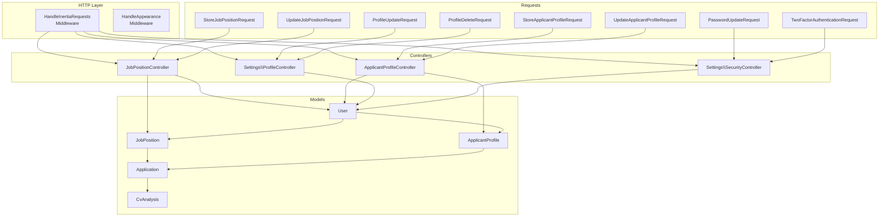
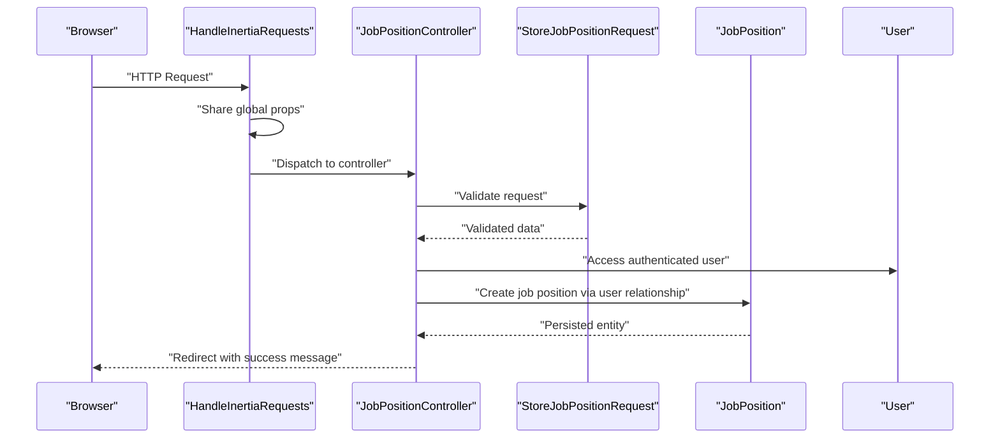
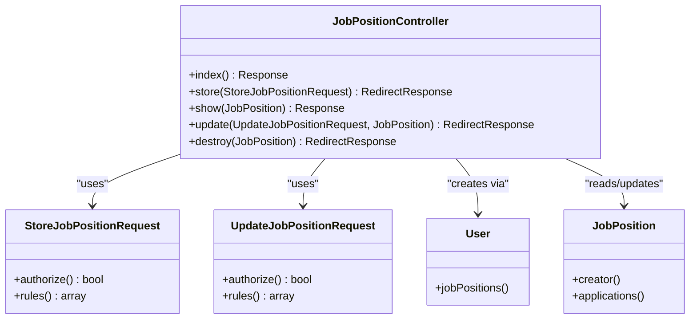
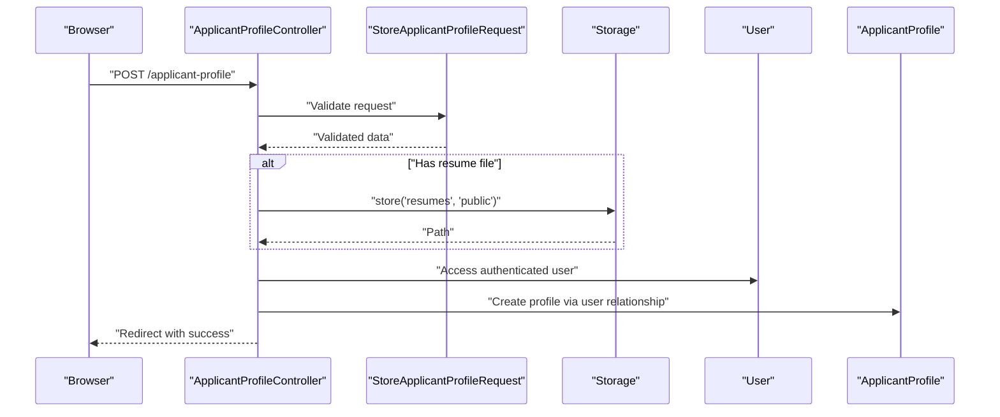
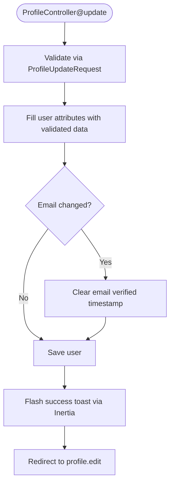
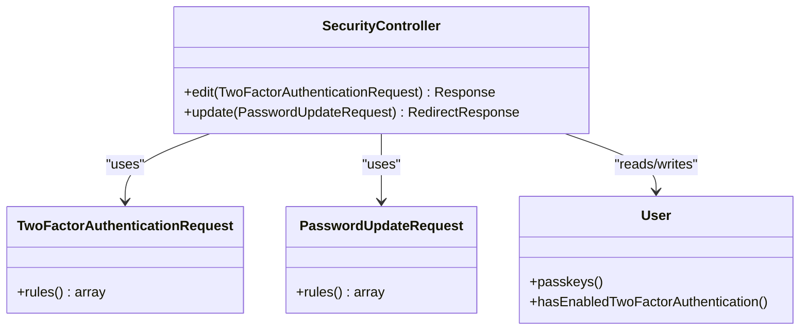
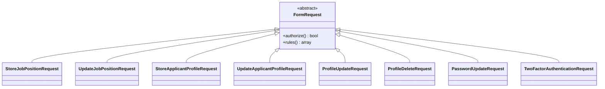
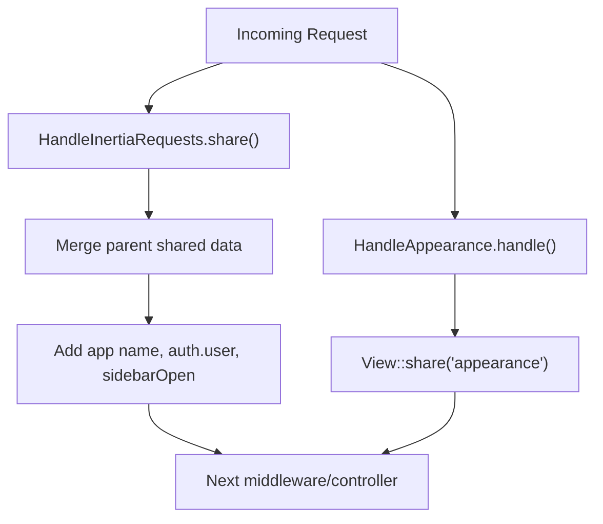
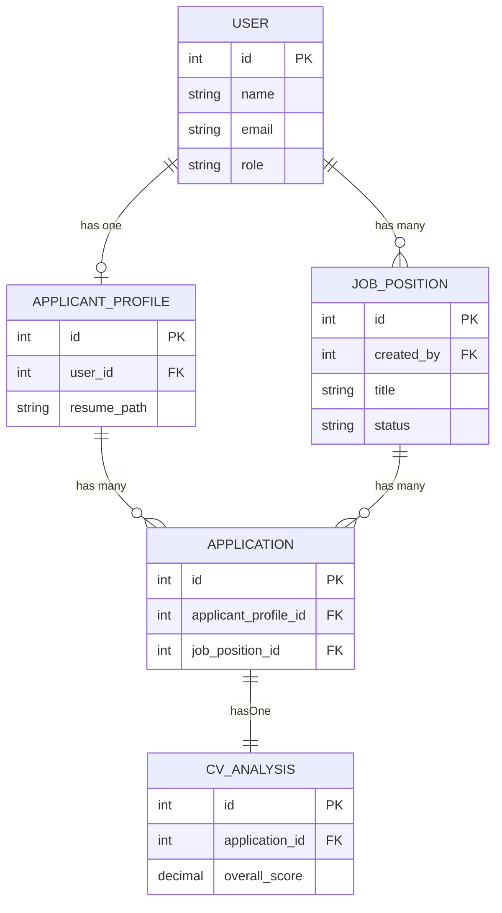
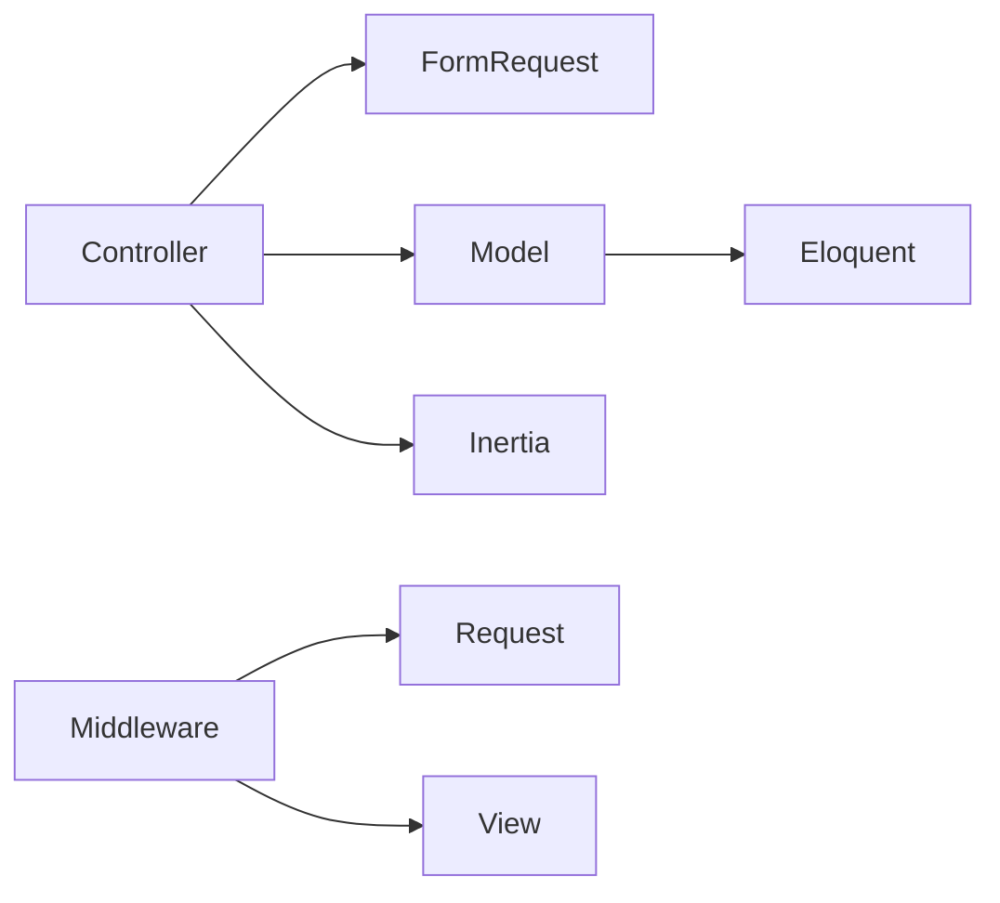

# MVC Pattern Implementation

<cite>
**Referenced Files in This Document**
- [Controller.php](file://app/Http/Controllers/Controller.php)
- [JobPositionController.php](file://app/Http/Controllers/JobPositionController.php)
- [ApplicantProfileController.php](file://app/Http/Controllers/ApplicantProfileController.php)
- [ProfileController.php](file://app/Http/Controllers/Settings/ProfileController.php)
- [SecurityController.php](file://app/Http/Controllers/Settings/SecurityController.php)
- [HandleAppearance.php](file://app/Http/Middleware/HandleAppearance.php)
- [HandleInertiaRequests.php](file://app/Http/Middleware/HandleInertiaRequests.php)
- [StoreJobPositionRequest.php](file://app/Http/Requests/StoreJobPositionRequest.php)
- [UpdateJobPositionRequest.php](file://app/Http/Requests/UpdateJobPositionRequest.php)
- [StoreApplicantProfileRequest.php](file://app/Http/Requests/StoreApplicantProfileRequest.php)
- [UpdateApplicantProfileRequest.php](file://app/Http/Requests/UpdateApplicantProfileRequest.php)
- [ProfileUpdateRequest.php](file://app/Http/Requests/Settings/ProfileUpdateRequest.php)
- [ProfileDeleteRequest.php](file://app/Http/Requests/Settings/ProfileDeleteRequest.php)
- [PasswordUpdateRequest.php](file://app/Http/Requests/Settings/PasswordUpdateRequest.php)
- [TwoFactorAuthenticationRequest.php](file://app/Http/Requests/Settings/TwoFactorAuthenticationRequest.php)
- [User.php](file://app/Models/User.php)
- [ApplicantProfile.php](file://app/Models/ApplicantProfile.php)
- [JobPosition.php](file://app/Models/JobPosition.php)
- [Application.php](file://app/Models/Application.php)
- [CvAnalysis.php](file://app/Models/CvAnalysis.php)
</cite>

## Table of Contents
1. [Introduction](#introduction)
2. [Project Structure](#project-structure)
3. [Core Components](#core-components)
4. [Architecture Overview](#architecture-overview)
5. [Detailed Component Analysis](#detailed-component-analysis)
6. [Dependency Analysis](#dependency-analysis)
7. [Performance Considerations](#performance-considerations)
8. [Troubleshooting Guide](#troubleshooting-guide)
9. [Conclusion](#conclusion)

## Introduction
This document explains the Laravel MVC pattern implementation in SmartRecruit ATS, focusing on the controller-layer organization, model relationships, request validation via Form Request classes, middleware architecture, and separation of concerns. It covers the controllers for job positions and applicant profiles, settings controllers, and the underlying Eloquent models that represent domain entities such as User, ApplicantProfile, JobPosition, Application, and CvAnalysis.

## Project Structure
SmartRecruit ATS follows a layered MVC architecture:
- Controllers: app/Http/Controllers (including nested Settings controllers)
- Models: app/Models
- Requests: app/Http/Requests (including nested Settings requests)
- Middleware: app/Http/Middleware
- Views and assets: resources/views and resources/js (Inertia-driven SPA rendering)

**Diagram sources**
- [HandleInertiaRequests.php:1-48](file://app/Http/Middleware/HandleInertiaRequests.php#L1-L48)
- [HandleAppearance.php:1-24](file://app/Http/Middleware/HandleAppearance.php#L1-L24)
- [JobPositionController.php:1-55](file://app/Http/Controllers/JobPositionController.php#L1-L55)
- [ApplicantProfileController.php:1-59](file://app/Http/Controllers/ApplicantProfileController.php#L1-L59)
- [ProfileController.php:1-63](file://app/Http/Controllers/Settings/ProfileController.php#L1-L63)
- [SecurityController.php:1-67](file://app/Http/Controllers/Settings/SecurityController.php#L1-L67)
- [StoreJobPositionRequest.php:1-34](file://app/Http/Requests/StoreJobPositionRequest.php#L1-L34)
- [UpdateJobPositionRequest.php:1-34](file://app/Http/Requests/UpdateJobPositionRequest.php#L1-L34)
- [StoreApplicantProfileRequest.php:1-34](file://app/Http/Requests/StoreApplicantProfileRequest.php#L1-L34)
- [UpdateApplicantProfileRequest.php:1-34](file://app/Http/Requests/UpdateApplicantProfileRequest.php#L1-L34)
- [ProfileUpdateRequest.php:1-23](file://app/Http/Requests/Settings/ProfileUpdateRequest.php#L1-L23)
- [ProfileDeleteRequest.php:1-25](file://app/Http/Requests/Settings/ProfileDeleteRequest.php#L1-L25)
- [PasswordUpdateRequest.php:1-26](file://app/Http/Requests/Settings/PasswordUpdateRequest.php#L1-L26)
- [TwoFactorAuthenticationRequest.php:1-23](file://app/Http/Requests/Settings/TwoFactorAuthenticationRequest.php#L1-L23)
- [User.php:1-62](file://app/Models/User.php#L1-L62)
- [ApplicantProfile.php:1-41](file://app/Models/ApplicantProfile.php#L1-L41)
- [JobPosition.php:1-39](file://app/Models/JobPosition.php#L1-L39)
- [Application.php:1-42](file://app/Models/Application.php#L1-L42)
- [CvAnalysis.php:1-38](file://app/Models/CvAnalysis.php#L1-L38)

**Section sources**
- [Controller.php:1-9](file://app/Http/Controllers/Controller.php#L1-L9)
- [JobPositionController.php:1-55](file://app/Http/Controllers/JobPositionController.php#L1-L55)
- [ApplicantProfileController.php:1-59](file://app/Http/Controllers/ApplicantProfileController.php#L1-L59)
- [ProfileController.php:1-63](file://app/Http/Controllers/Settings/ProfileController.php#L1-L63)
- [SecurityController.php:1-67](file://app/Http/Controllers/Settings/SecurityController.php#L1-L67)

## Core Components
This section outlines the primary MVC components and their responsibilities:

- Base Controller: Provides a common foundation for all controllers.
- Domain Controllers:
  - JobPositionController: Manages job position CRUD operations with role-based authorization.
  - ApplicantProfileController: Handles applicant profile creation/update with resume upload and storage.
  - Settings Controllers: ProfileController and SecurityController manage user profile and security settings.
- Request Validation: Form Request classes encapsulate authorization and validation rules for each operation.
- Middleware: HandleInertiaRequests integrates Inertia.js for SSR-like SPA behavior; HandleAppearance shares appearance preferences globally.
- Models: Eloquent models define domain entities and relationships.

Practical examples:
- Controller action: JobPositionController@index loads job positions with creator eager loading and renders via Inertia.
- Controller action: ApplicantProfileController@store validates input, optionally stores a resume file, and creates a profile linked to the authenticated user.
- Request handling: StoreJobPositionRequest.authorize ensures only HRD users can create job positions; rules enforce field constraints.

**Section sources**
- [Controller.php:1-9](file://app/Http/Controllers/Controller.php#L1-L9)
- [JobPositionController.php:14-27](file://app/Http/Controllers/JobPositionController.php#L14-L27)
- [ApplicantProfileController.php:24-36](file://app/Http/Controllers/ApplicantProfileController.php#L24-L36)
- [StoreJobPositionRequest.php:13-32](file://app/Http/Requests/StoreJobPositionRequest.php#L13-L32)
- [HandleInertiaRequests.php:36-46](file://app/Http/Middleware/HandleInertiaRequests.php#L36-L46)
- [HandleAppearance.php:17-22](file://app/Http/Middleware/HandleAppearance.php#L17-L22)

## Architecture Overview
The application employs a clean MVC architecture with explicit separation of concerns:
- Controllers orchestrate HTTP requests, delegate validation to Form Requests, and render responses using Inertia.
- Models encapsulate business data and relationships, leveraging Eloquent relationships.
- Requests centralize authorization and validation logic, keeping controllers thin.
- Middleware handles cross-cutting concerns like shared data and appearance preferences.

**Diagram sources**
- [HandleInertiaRequests.php:17-27](file://app/Http/Middleware/HandleInertiaRequests.php#L17-L27)
- [JobPositionController.php:22-27](file://app/Http/Controllers/JobPositionController.php#L22-L27)
- [StoreJobPositionRequest.php:13-32](file://app/Http/Requests/StoreJobPositionRequest.php#L13-L32)
- [User.php:57-60](file://app/Models/User.php#L57-L60)
- [JobPosition.php:10-39](file://app/Models/JobPosition.php#L10-L39)

## Detailed Component Analysis

### Controllers

#### JobPositionController
Responsibilities:
- List job positions with creator eager loading.
- Create new job positions after validating with StoreJobPositionRequest.
- Show individual job positions with creator data.
- Update existing positions validated by UpdateJobPositionRequest.
- Delete positions with HRD role enforcement.

Key patterns:
- Dependency injection of validated data from Form Requests.
- Relationship-based creation via authenticated user.
- Role-based authorization for destructive actions.

**Diagram sources**
- [JobPositionController.php:12-55](file://app/Http/Controllers/JobPositionController.php#L12-L55)
- [StoreJobPositionRequest.php:8-34](file://app/Http/Requests/StoreJobPositionRequest.php#L8-L34)
- [UpdateJobPositionRequest.php:8-34](file://app/Http/Requests/UpdateJobPositionRequest.php#L8-L34)
- [User.php:57-60](file://app/Models/User.php#L57-L60)
- [JobPosition.php:29-37](file://app/Models/JobPosition.php#L29-L37)

**Section sources**
- [JobPositionController.php:14-53](file://app/Http/Controllers/JobPositionController.php#L14-L53)
- [StoreJobPositionRequest.php:13-32](file://app/Http/Requests/StoreJobPositionRequest.php#L13-L32)
- [UpdateJobPositionRequest.php:13-32](file://app/Http/Requests/UpdateJobPositionRequest.php#L13-L32)

#### ApplicantProfileController
Responsibilities:
- Render authenticated user's profile page.
- Create a profile with optional resume upload and storage.
- Update a profile with validation and conditional resume replacement.

Key patterns:
- File handling via Storage facade for resume uploads.
- Ownership checks to prevent unauthorized updates.
- Validation via dedicated Form Requests.

**Diagram sources**
- [ApplicantProfileController.php:24-36](file://app/Http/Controllers/ApplicantProfileController.php#L24-L36)
- [StoreApplicantProfileRequest.php:13-32](file://app/Http/Requests/StoreApplicantProfileRequest.php#L13-L32)
- [User.php:52-55](file://app/Models/User.php#L52-L55)
- [ApplicantProfile.php:10-41](file://app/Models/ApplicantProfile.php#L10-L41)

**Section sources**
- [ApplicantProfileController.php:15-57](file://app/Http/Controllers/ApplicantProfileController.php#L15-L57)
- [StoreApplicantProfileRequest.php:13-32](file://app/Http/Requests/StoreApplicantProfileRequest.php#L13-L32)

#### Settings Controllers

##### ProfileController
Responsibilities:
- Edit profile settings page with email verification status and session status.
- Update profile information with validation.
- Delete user account with logout and session cleanup.

Key patterns:
- Uses specialized Form Requests for update and delete operations.
- Integrates with Inertia flash messaging for user feedback.

**Diagram sources**
- [ProfileController.php:31-44](file://app/Http/Controllers/Settings/ProfileController.php#L31-L44)
- [ProfileUpdateRequest.php:18-21](file://app/Http/Requests/Settings/ProfileUpdateRequest.php#L18-L21)

**Section sources**
- [ProfileController.php:20-61](file://app/Http/Controllers/Settings/ProfileController.php#L20-L61)
- [ProfileUpdateRequest.php:18-21](file://app/Http/Requests/Settings/ProfileUpdateRequest.php#L18-L21)
- [ProfileDeleteRequest.php:18-23](file://app/Http/Requests/Settings/ProfileDeleteRequest.php#L18-L23)

##### SecurityController
Responsibilities:
- Render security settings page with two-factor and passkey capabilities.
- Update passwords using validated requests.
- Integrate with Laravel Fortify features for two-factor state management.

Key patterns:
- Feature detection via Laravel Fortify to conditionally expose controls.
- Shared props composition for Inertia rendering.

**Diagram sources**
- [SecurityController.php:19-66](file://app/Http/Controllers/Settings/SecurityController.php#L19-L66)
- [TwoFactorAuthenticationRequest.php:18-21](file://app/Http/Requests/Settings/TwoFactorAuthenticationRequest.php#L18-L21)
- [PasswordUpdateRequest.php:18-24](file://app/Http/Requests/Settings/PasswordUpdateRequest.php#L18-L24)
- [User.php:32-61](file://app/Models/User.php#L32-L61)

**Section sources**
- [SecurityController.php:19-66](file://app/Http/Controllers/Settings/SecurityController.php#L19-L66)
- [PasswordUpdateRequest.php:18-24](file://app/Http/Requests/Settings/PasswordUpdateRequest.php#L18-L24)

### Request Validation Layer

Form Request classes encapsulate:
- Authorization logic (who can perform the action)
- Validation rules (what data is acceptable)
- Centralized error handling and response formatting

Examples:
- StoreJobPositionRequest: HRD-only creation with strict field validation.
- UpdateJobPositionRequest: Partial updates with "sometimes" rules.
- StoreApplicantProfileRequest: Resume file constraints and structured arrays.
- ProfileUpdateRequest: Reuses shared validation rules via traits.
- PasswordUpdateRequest: Enforces current password and new password policies.

**Diagram sources**
- [StoreJobPositionRequest.php:8-34](file://app/Http/Requests/StoreJobPositionRequest.php#L8-L34)
- [UpdateJobPositionRequest.php:8-34](file://app/Http/Requests/UpdateJobPositionRequest.php#L8-L34)
- [StoreApplicantProfileRequest.php:8-34](file://app/Http/Requests/StoreApplicantProfileRequest.php#L8-L34)
- [UpdateApplicantProfileRequest.php:8-34](file://app/Http/Requests/UpdateApplicantProfileRequest.php#L8-L34)
- [ProfileUpdateRequest.php:9-23](file://app/Http/Requests/Settings/ProfileUpdateRequest.php#L9-L23)
- [ProfileDeleteRequest.php:9-25](file://app/Http/Requests/Settings/ProfileDeleteRequest.php#L9-L25)
- [PasswordUpdateRequest.php:9-26](file://app/Http/Requests/Settings/PasswordUpdateRequest.php#L9-L26)
- [TwoFactorAuthenticationRequest.php:9-23](file://app/Http/Requests/Settings/TwoFactorAuthenticationRequest.php#L9-L23)

**Section sources**
- [StoreJobPositionRequest.php:13-32](file://app/Http/Requests/StoreJobPositionRequest.php#L13-L32)
- [UpdateJobPositionRequest.php:13-32](file://app/Http/Requests/UpdateJobPositionRequest.php#L13-L32)
- [StoreApplicantProfileRequest.php:13-32](file://app/Http/Requests/StoreApplicantProfileRequest.php#L13-L32)
- [UpdateApplicantProfileRequest.php:13-32](file://app/Http/Requests/UpdateApplicantProfileRequest.php#L13-L32)
- [ProfileUpdateRequest.php:18-21](file://app/Http/Requests/Settings/ProfileUpdateRequest.php#L18-L21)
- [ProfileDeleteRequest.php:18-23](file://app/Http/Requests/Settings/ProfileDeleteRequest.php#L18-L23)
- [PasswordUpdateRequest.php:18-24](file://app/Http/Requests/Settings/PasswordUpdateRequest.php#L18-L24)
- [TwoFactorAuthenticationRequest.php:18-21](file://app/Http/Requests/Settings/TwoFactorAuthenticationRequest.php#L18-L21)

### Middleware Architecture

#### HandleInertiaRequests
- Sets the root Inertia template.
- Extends shared data with application name, authenticated user, and sidebar state.
- Inherits asset versioning from the base Inertia middleware.

#### HandleAppearance
- Shares the user's appearance preference globally via a view variable.
- Reads from a cookie and defaults to "system".

**Diagram sources**
- [HandleInertiaRequests.php:36-46](file://app/Http/Middleware/HandleInertiaRequests.php#L36-L46)
- [HandleAppearance.php:17-22](file://app/Http/Middleware/HandleAppearance.php#L17-L22)

**Section sources**
- [HandleInertiaRequests.php:17-46](file://app/Http/Middleware/HandleInertiaRequests.php#L17-L46)
- [HandleAppearance.php:17-22](file://app/Http/Middleware/HandleAppearance.php#L17-L22)

### Model Relationships

Domain entities and their relationships:
- User has one ApplicantProfile and many JobPositions.
- ApplicantProfile belongs to User and has many Applications.
- JobPosition belongs to User (creator) and has many Applications.
- Application belongs to ApplicantProfile and JobPosition, and has one CvAnalysis.
- CvAnalysis belongs to Application.

**Diagram sources**
- [User.php:52-60](file://app/Models/User.php#L52-L60)
- [ApplicantProfile.php:31-39](file://app/Models/ApplicantProfile.php#L31-L39)
- [JobPosition.php:29-37](file://app/Models/JobPosition.php#L29-L37)
- [Application.php:27-40](file://app/Models/Application.php#L27-L40)
- [CvAnalysis.php:33-36](file://app/Models/CvAnalysis.php#L33-L36)

**Section sources**
- [User.php:52-60](file://app/Models/User.php#L52-L60)
- [ApplicantProfile.php:31-39](file://app/Models/ApplicantProfile.php#L31-L39)
- [JobPosition.php:29-37](file://app/Models/JobPosition.php#L29-L37)
- [Application.php:27-40](file://app/Models/Application.php#L27-L40)
- [CvAnalysis.php:33-36](file://app/Models/CvAnalysis.php#L33-L36)

## Dependency Analysis
- Controllers depend on:
  - Form Request classes for validation and authorization.
  - Models for persistence and relationship access.
  - Inertia for rendering and flash messaging.
- Models depend on:
  - Eloquent relationships to express associations.
  - Casts for data normalization.
- Middleware depends on:
  - Request objects and view/data sharing mechanisms.

**Diagram sources**
- [JobPositionController.php:5-10](file://app/Http/Controllers/JobPositionController.php#L5-L10)
- [ApplicantProfileController.php:5-11](file://app/Http/Controllers/ApplicantProfileController.php#L5-L11)
- [HandleInertiaRequests.php:6-46](file://app/Http/Middleware/HandleInertiaRequests.php#L6-L46)
- [User.php:35-61](file://app/Models/User.php#L35-L61)

**Section sources**
- [JobPositionController.php:5-10](file://app/Http/Controllers/JobPositionController.php#L5-L10)
- [ApplicantProfileController.php:5-11](file://app/Http/Controllers/ApplicantProfileController.php#L5-L11)
- [HandleInertiaRequests.php:6-46](file://app/Http/Middleware/HandleInertiaRequests.php#L6-L46)
- [User.php:35-61](file://app/Models/User.php#L35-L61)

## Performance Considerations
- Eager load relationships (e.g., creator on job positions) to avoid N+1 queries.
- Use array casts for JSON fields to reduce manual serialization overhead.
- Minimize file operations; batch storage operations and leverage disk-specific optimizations.
- Keep Form Request rules concise and targeted to reduce validation overhead.
- Share minimal global data via middleware to reduce payload sizes.

## Troubleshooting Guide
Common issues and resolutions:
- Authorization failures:
  - Ensure Form Request authorize() conditions match user roles and ownership checks.
  - Verify HRD role enforcement in job position operations.
- Validation errors:
  - Confirm Form Request rules align with controller expectations.
  - Review array and file validation constraints for profiles and job positions.
- File upload problems:
  - Check storage disk permissions and path generation for resumes.
  - Ensure old files are removed before replacing with new ones.
- Inertia rendering issues:
  - Verify shared data keys and root template configuration.
  - Confirm flash messages are properly set before redirects.

**Section sources**
- [StoreJobPositionRequest.php:13-16](file://app/Http/Requests/StoreJobPositionRequest.php#L13-L16)
- [JobPositionController.php:46-48](file://app/Http/Controllers/JobPositionController.php#L46-L48)
- [StoreApplicantProfileRequest.php:26-31](file://app/Http/Requests/StoreApplicantProfileRequest.php#L26-L31)
- [ApplicantProfileController.php:46-52](file://app/Http/Controllers/ApplicantProfileController.php#L46-L52)
- [HandleInertiaRequests.php:17-27](file://app/Http/Middleware/HandleInertiaRequests.php#L17-L27)

## Conclusion
SmartRecruit ATS demonstrates a clean MVC implementation with strong separation of concerns:
- Controllers remain thin and focused on orchestrating requests and responses.
- Form Requests encapsulate authorization and validation, promoting reuse and clarity.
- Models clearly define domain relationships and data casting.
- Middleware handles cross-cutting concerns and shared state.
- Inertia enables efficient SPA-like interactions while preserving server-rendered benefits.

This structure supports maintainability, testability, and scalability across job management, applicant profiling, and user settings.