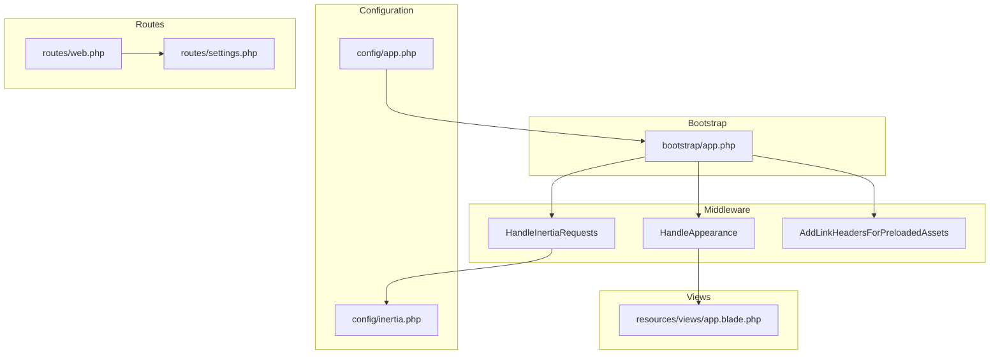
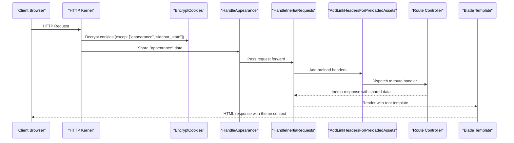
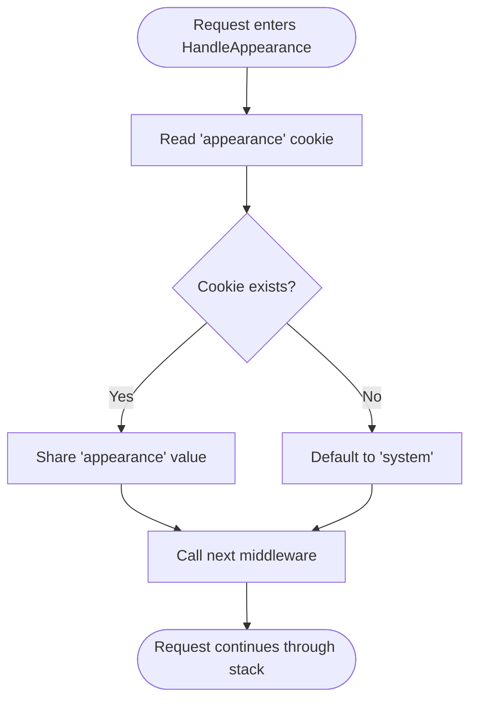
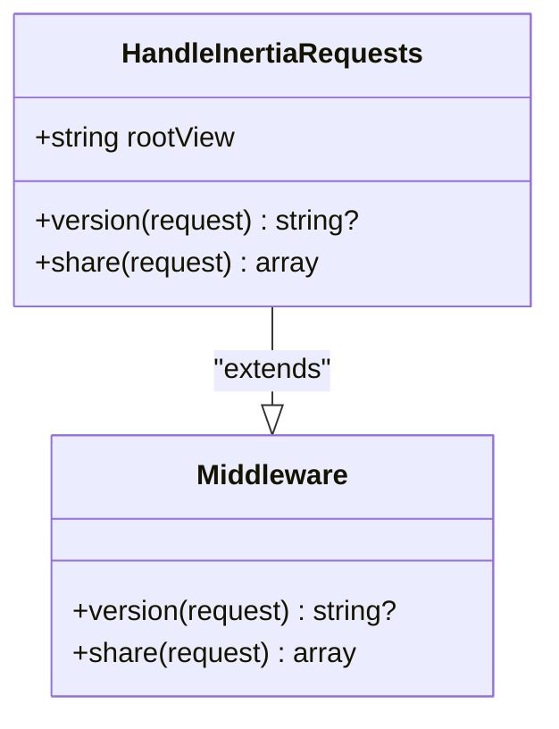
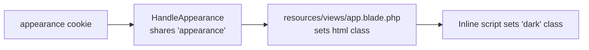
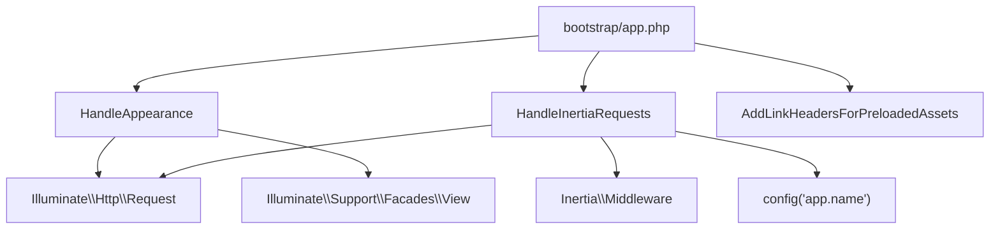

# Middleware Architecture

<cite>
**Referenced Files in This Document**
- [HandleAppearance.php](file://app/Http/Middleware/HandleAppearance.php)
- [HandleInertiaRequests.php](file://app/Http/Middleware/HandleInertiaRequests.php)
- [app.php](file://bootstrap/app.php)
- [app.php](file://config/app.php)
- [inertia.php](file://config/inertia.php)
- [app.blade.php](file://resources/views/app.blade.php)
- [web.php](file://routes/web.php)
- [settings.php](file://routes/settings.php)
- [.htaccess](file://public/.htaccess)
- [TestCase.php](file://tests/TestCase.php)
</cite>

## Table of Contents
1. [Introduction](#introduction)
2. [Project Structure](#project-structure)
3. [Core Components](#core-components)
4. [Architecture Overview](#architecture-overview)
5. [Detailed Component Analysis](#detailed-component-analysis)
6. [Dependency Analysis](#dependency-analysis)
7. [Performance Considerations](#performance-considerations)
8. [Security Considerations](#security-considerations)
9. [Debugging Guide](#debugging-guide)
10. [Testing Strategies](#testing-strategies)
11. [Conclusion](#conclusion)

## Introduction
This document provides comprehensive middleware architecture documentation for SmartRecruit ATS. It focuses on the custom middleware implementations for theme management and SPA integration, the middleware stack configuration, cookie encryption settings, and the web middleware group setup. It also covers middleware execution order, request/response interception patterns, parameter binding, development examples, conditional application, testing strategies, performance implications, security considerations, and debugging approaches.

## Project Structure
SmartRecruit ATS uses Laravel's modern middleware configuration via the application bootstrap file. The middleware stack is configured centrally and applied to the web group, ensuring consistent behavior across HTTP requests. Theme and SPA integration are handled by two dedicated middleware classes that prepare shared data for views and Inertia responses.

**Diagram sources**
- [app.php:17-25](file://bootstrap/app.php#L17-L25)
- [HandleAppearance.php:17-22](file://app/Http/Middleware/HandleAppearance.php#L17-L22)
- [HandleInertiaRequests.php:36-46](file://app/Http/Middleware/HandleInertiaRequests.php#L36-L46)
- [app.php:98-106](file://config/app.php#L98-L106)
- [inertia.php:18-23](file://config/inertia.php#L18-L23)
- [web.php:1-32](file://routes/web.php#L1-L32)
- [settings.php:1-35](file://routes/settings.php#L1-L35)
- [app.blade.php:1-48](file://resources/views/app.blade.php#L1-L48)

**Section sources**
- [app.php:11-31](file://bootstrap/app.php#L11-L31)
- [app.php:98-106](file://config/app.php#L98-L106)
- [inertia.php:18-23](file://config/inertia.php#L18-L23)
- [web.php:1-32](file://routes/web.php#L1-L32)
- [settings.php:1-35](file://routes/settings.php#L1-L35)
- [app.blade.php:1-48](file://resources/views/app.blade.php#L1-L48)

## Core Components
This section documents the two primary middleware components responsible for theme management and SPA integration.

### HandleAppearance Middleware
Purpose:
- Shares the user's appearance preference with Blade templates.
- Reads the appearance cookie and defaults to "system" if not present.

Key behaviors:
- Intercepts incoming requests in the web middleware stack.
- Uses the View facade to share a global "appearance" variable.
- Does not modify the request or response beyond sharing data.

Execution pattern:
- Applied early in the web middleware stack to ensure downstream components (Blade, Inertia) have access to the shared variable.

**Section sources**
- [HandleAppearance.php:10-23](file://app/Http/Middleware/HandleAppearance.php#L10-L23)

### HandleInertiaRequests Middleware
Purpose:
- Extends Inertia's base middleware to provide shared data and asset versioning for Single Page Application (SPA) integration.
- Sets the root template and shares application-wide data such as app name, authenticated user, and sidebar state.

Key behaviors:
- Defines the root template for Inertia responses.
- Overrides asset versioning to leverage Laravel's parent implementation.
- Shares computed data including application name, authentication context, and sidebar state derived from cookies.

Execution pattern:
- Applied after theme handling to ensure shared data is available to Inertia-rendered pages.

**Section sources**
- [HandleInertiaRequests.php:8-47](file://app/Http/Middleware/HandleInertiaRequests.php#L8-L47)

## Architecture Overview
The middleware stack is configured in the application bootstrap file and applied to the web group. Cookie encryption is selectively disabled for specific keys to enable client-controlled preferences without encryption overhead. The theme and SPA middleware collaborate to deliver a responsive UI with persistent user preferences.

**Diagram sources**
- [app.php:18-24](file://bootstrap/app.php#L18-L24)
- [HandleAppearance.php:17-22](file://app/Http/Middleware/HandleAppearance.php#L17-L22)
- [HandleInertiaRequests.php:36-46](file://app/Http/Middleware/HandleInertiaRequests.php#L36-L46)
- [app.blade.php:1-48](file://resources/views/app.blade.php#L1-L48)

**Section sources**
- [app.php:17-25](file://bootstrap/app.php#L17-L25)
- [app.php:98-106](file://config/app.php#L98-L106)

## Detailed Component Analysis

### HandleAppearance Implementation
Responsibilities:
- Read the "appearance" cookie value.
- Default to "system" when the cookie is absent.
- Share the resolved appearance value globally for Blade templates.

Processing logic:
- Accesses the request object to retrieve the cookie value.
- Uses the View facade to share the "appearance" variable.
- Returns the next middleware in the chain unchanged.

**Diagram sources**
- [HandleAppearance.php:17-22](file://app/Http/Middleware/HandleAppearance.php#L17-L22)

**Section sources**
- [HandleAppearance.php:10-23](file://app/Http/Middleware/HandleAppearance.php#L10-L23)

### HandleInertiaRequests Implementation
Responsibilities:
- Configure the root template for Inertia responses.
- Provide asset versioning through the parent implementation.
- Share application-wide data with Inertia pages.

Shared data composition:
- Application name from configuration.
- Authentication context (current user).
- Sidebar state derived from the "sidebar_state" cookie.

**Diagram sources**
- [HandleInertiaRequests.php:8-47](file://app/Http/Middleware/HandleInertiaRequests.php#L8-L47)

**Section sources**
- [HandleInertiaRequests.php:8-47](file://app/Http/Middleware/HandleInertiaRequests.php#L8-L47)

### Web Middleware Group Setup
The web middleware group is configured to include:
- HandleAppearance
- HandleInertiaRequests
- AddLinkHeadersForPreloadedAssets

Cookie encryption exceptions:
- The "appearance" and "sidebar_state" cookies are excluded from encryption to allow client-side control without decryption overhead.

**Section sources**
- [app.php:17-25](file://bootstrap/app.php#L17-L25)
- [app.php:98-106](file://config/app.php#L98-L106)

### Root Template and Theme Integration
The root Blade template integrates the shared "appearance" value to set the HTML class for theme handling. JavaScript logic detects system preference when the appearance is set to "system".

**Diagram sources**
- [HandleAppearance.php:17-22](file://app/Http/Middleware/HandleAppearance.php#L17-L22)
- [app.blade.php:1-48](file://resources/views/app.blade.php#L1-L48)

**Section sources**
- [app.blade.php:1-48](file://resources/views/app.blade.php#L1-L48)

## Dependency Analysis
The middleware stack exhibits low coupling and high cohesion:
- HandleAppearance depends on the request object and the View facade.
- HandleInertiaRequests depends on the Inertia base middleware and configuration.
- The bootstrap configuration orchestrates middleware registration and cookie encryption policy.

**Diagram sources**
- [HandleAppearance.php:5-8](file://app/Http/Middleware/HandleAppearance.php#L5-L8)
- [HandleInertiaRequests.php:5-6](file://app/Http/Middleware/HandleInertiaRequests.php#L5-L6)
- [app.php:17-24](file://bootstrap/app.php#L17-L24)

**Section sources**
- [HandleAppearance.php:5-8](file://app/Http/Middleware/HandleAppearance.php#L5-L8)
- [HandleInertiaRequests.php:5-6](file://app/Http/Middleware/HandleInertiaRequests.php#L5-L6)
- [app.php:17-25](file://bootstrap/app.php#L17-L25)

## Performance Considerations
- Cookie encryption exceptions: Excluding "appearance" and "sidebar_state" from encryption reduces CPU overhead for lightweight preference cookies.
- Preload headers: The AddLinkHeadersForPreloadedAssets middleware improves asset loading performance for SPA navigation.
- Shared data minimization: HandleInertiaRequests shares only essential data to reduce payload size.
- Blade rendering: Using shared variables avoids repeated computation in templates.

[No sources needed since this section provides general guidance]

## Security Considerations
- Cookie encryption exceptions: Preference cookies are intentionally unencrypted to enable client-side control. Ensure these cookies do not carry sensitive data.
- CSRF protection: Laravel's built-in CSRF mechanisms remain effective; ensure Inertia requests include proper tokens.
- Route protection: Authentication and verification middleware are applied to appropriate route groups to protect sensitive actions.
- XSS prevention: Blade templating and Inertia rendering follow Laravel's security practices.

**Section sources**
- [app.php:18-18](file://bootstrap/app.php#L18-L18)
- [web.php:18-29](file://routes/web.php#L18-L29)
- [settings.php:8-27](file://routes/settings.php#L8-L27)

## Debugging Guide
Common debugging approaches:
- Inspect shared variables: Verify that the "appearance" variable is correctly shared by checking the rendered Blade output.
- Trace middleware execution: Temporarily add logging in middleware handlers to confirm execution order.
- Validate cookie behavior: Confirm that "appearance" and "sidebar_state" cookies are readable/writable as expected.
- SSR configuration: Review Inertia SSR settings if server-side rendering is enabled.

Helpful references:
- Root template and theme integration in the Blade layout.
- Inertia configuration for SSR and page discovery.
- Route groups that apply authentication and verification middleware.

**Section sources**
- [app.blade.php:1-48](file://resources/views/app.blade.php#L1-L48)
- [inertia.php:18-23](file://config/inertia.php#L18-L23)
- [web.php:18-29](file://routes/web.php#L18-L29)
- [settings.php:8-27](file://routes/settings.php#L8-L27)

## Testing Strategies
Recommended testing approaches:
- Feature tests: Validate that theme preferences persist across requests and influence the rendered HTML class.
- Middleware tests: Use Laravel's testing helpers to assert middleware behavior and shared data availability.
- Route tests: Ensure that authenticated and verified routes receive the expected shared data from HandleInertiaRequests.
- Cookie tests: Verify that preference cookies are set/unset correctly and do not trigger encryption errors.

Reference materials:
- Base test case class for shared testing utilities.
- Route definitions that demonstrate middleware application patterns.

**Section sources**
- [TestCase.php:8-16](file://tests/TestCase.php#L8-L16)
- [web.php:1-32](file://routes/web.php#L1-L32)
- [settings.php:1-35](file://routes/settings.php#L1-L35)

## Conclusion
SmartRecruit ATS employs a focused middleware architecture that separates concerns between theme management and SPA integration. The centralized bootstrap configuration ensures consistent middleware application, while selective cookie encryption enables efficient client-controlled preferences. The collaboration between HandleAppearance and HandleInertiaRequests delivers a responsive UI with minimal overhead, supported by clear testing and debugging practices.