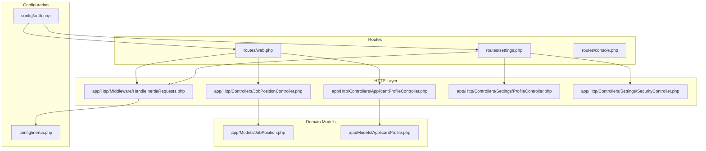
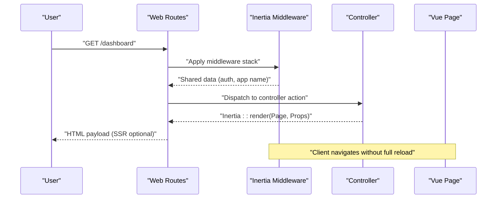
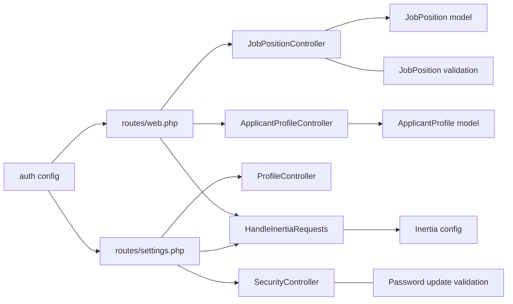

# Routing System

<cite>
**Referenced Files in This Document**
- [routes/web.php](file://routes/web.php)
- [routes/settings.php](file://routes/settings.php)
- [routes/console.php](file://routes/console.php)
- [app/Http/Middleware/HandleInertiaRequests.php](file://app/Http/Middleware/HandleInertiaRequests.php)
- [app/Http/Controllers/JobPositionController.php](file://app/Http/Controllers/JobPositionController.php)
- [app/Http/Controllers/ApplicantProfileController.php](file://app/Http/Controllers/ApplicantProfileController.php)
- [app/Http/Controllers/Settings/ProfileController.php](file://app/Http/Controllers/Settings/ProfileController.php)
- [app/Http/Controllers/Settings/SecurityController.php](file://app/Http/Controllers/Settings/SecurityController.php)
- [app/Http/Requests/StoreJobPositionRequest.php](file://app/Http/Requests/StoreJobPositionRequest.php)
- [app/Http/Requests/UpdateJobPositionRequest.php](file://app/Http/Requests/UpdateJobPositionRequest.php)
- [app/Models/JobPosition.php](file://app/Models/JobPosition.php)
- [app/Models/ApplicantProfile.php](file://app/Models/ApplicantProfile.php)
- [config/inertia.php](file://config/inertia.php)
- [config/auth.php](file://config/auth.php)
</cite>

## Table of Contents
1. [Introduction](#introduction)
2. [Project Structure](#project-structure)
3. [Core Components](#core-components)
4. [Architecture Overview](#architecture-overview)
5. [Detailed Component Analysis](#detailed-component-analysis)
6. [Dependency Analysis](#dependency-analysis)
7. [Performance Considerations](#performance-considerations)
8. [Troubleshooting Guide](#troubleshooting-guide)
9. [Conclusion](#conclusion)

## Introduction
This document explains the Laravel routing system in SmartRecruit ATS with a focus on web routes, route grouping, parameter binding, and Inertia.js integration for SPA navigation. It covers authentication routes, job position management routes, applicant profile routes, settings routes, console command routing, and scheduled task definitions. It also documents route caching, performance considerations, and debugging techniques for route-related issues.

## Project Structure
The routing system is organized around three primary route files:
- Web routes: define public and authenticated routes, including SPA entry points and resource endpoints.
- Settings routes: group user settings endpoints under authentication middleware.
- Console routes: register Artisan commands.

These routes integrate with controllers, form requests, and Eloquent models. Inertia.js middleware and configuration enable server-rendered single-page application behavior.

**Diagram sources**
- [routes/web.php:1-32](file://routes/web.php#L1-L32)
- [routes/settings.php:1-35](file://routes/settings.php#L1-L35)
- [routes/console.php:1-9](file://routes/console.php#L1-L9)
- [app/Http/Middleware/HandleInertiaRequests.php:1-48](file://app/Http/Middleware/HandleInertiaRequests.php#L1-L48)
- [app/Http/Controllers/JobPositionController.php:1-55](file://app/Http/Controllers/JobPositionController.php#L1-L55)
- [app/Http/Controllers/ApplicantProfileController.php:1-59](file://app/Http/Controllers/ApplicantProfileController.php#L1-L59)
- [app/Http/Controllers/Settings/ProfileController.php:1-63](file://app/Http/Controllers/Settings/ProfileController.php#L1-L63)
- [app/Http/Controllers/Settings/SecurityController.php:1-67](file://app/Http/Controllers/Settings/SecurityController.php#L1-L67)
- [app/Models/JobPosition.php:1-39](file://app/Models/JobPosition.php#L1-L39)
- [app/Models/ApplicantProfile.php:1-41](file://app/Models/ApplicantProfile.php#L1-L41)
- [config/inertia.php:1-71](file://config/inertia.php#L1-L71)
- [config/auth.php:1-118](file://config/auth.php#L1-L118)

**Section sources**
- [routes/web.php:1-32](file://routes/web.php#L1-L32)
- [routes/settings.php:1-35](file://routes/settings.php#L1-L35)
- [routes/console.php:1-9](file://routes/console.php#L1-L9)
- [config/inertia.php:1-71](file://config/inertia.php#L1-L71)
- [config/auth.php:1-118](file://config/auth.php#L1-L118)

## Core Components
- Web routes: Public home, authenticated dashboard, job positions resource, and applicant profile endpoints.
- Settings routes: Profile and security settings with layered middleware and a dedicated passkey endpoint.
- Console routes: Artisan command registration for development tasks.
- Inertia middleware: Root template, asset versioning, and shared data for SPA behavior.
- Controllers: Implement route actions, enforce authorization, and render Inertia pages.
- Request classes: Validate and authorize job position creation/update.
- Models: Define fillable attributes, casting, and relationships for route-bound parameters.

Key route groups and middleware:
- Authentication and email verification: Protects dashboard, job positions, and profile updates.
- RequirePassword: Secures sensitive settings operations.
- Throttling: Limits password update frequency.

**Section sources**
- [routes/web.php:18-29](file://routes/web.php#L18-L29)
- [routes/settings.php:8-27](file://routes/settings.php#L8-L27)
- [app/Http/Middleware/HandleInertiaRequests.php:17-46](file://app/Http/Middleware/HandleInertiaRequests.php#L17-L46)
- [app/Http/Controllers/JobPositionController.php:12-55](file://app/Http/Controllers/JobPositionController.php#L12-L55)
- [app/Http/Controllers/ApplicantProfileController.php:13-59](file://app/Http/Controllers/ApplicantProfileController.php#L13-L59)
- [app/Http/Controllers/Settings/ProfileController.php:15-63](file://app/Http/Controllers/Settings/ProfileController.php#L15-L63)
- [app/Http/Controllers/Settings/SecurityController.php:14-67](file://app/Http/Controllers/Settings/SecurityController.php#L14-L67)
- [app/Http/Requests/StoreJobPositionRequest.php:8-34](file://app/Http/Requests/StoreJobPositionRequest.php#L8-L34)
- [app/Http/Requests/UpdateJobPositionRequest.php:8-34](file://app/Http/Requests/UpdateJobPositionRequest.php#L8-L34)
- [app/Models/JobPosition.php:10-39](file://app/Models/JobPosition.php#L10-L39)
- [app/Models/ApplicantProfile.php:10-41](file://app/Models/ApplicantProfile.php#L10-L41)

## Architecture Overview
The routing architecture combines traditional Laravel web routes with Inertia.js for SPA-like navigation. Routes are grouped by authentication needs, and controllers render Vue pages with shared data from the Inertia middleware.

**Diagram sources**
- [routes/web.php:18-21](file://routes/web.php#L18-L21)
- [app/Http/Middleware/HandleInertiaRequests.php:36-46](file://app/Http/Middleware/HandleInertiaRequests.php#L36-L46)
- [app/Http/Controllers/JobPositionController.php:14-20](file://app/Http/Controllers/JobPositionController.php#L14-L20)

## Detailed Component Analysis

### Web Routes: Authentication and SPA Entrypoints
- Home route renders a welcome page with feature flags and versions.
- Dashboard route is protected by authentication and email verification; renders the dashboard page.
- Job positions resource exposes index/store/show/update/destroy actions (excluding create/edit).
- Applicant profile routes handle show/store/update for the authenticated user’s profile.

Route grouping strategy:
- Authenticated routes are wrapped in a middleware group requiring authentication and verified emails.
- Resource routes leverage controller actions for standard CRUD operations.

Route model binding:
- Job positions and applicant profiles use route model binding via typed controller method parameters. The framework resolves the model instance automatically when the route parameter matches the model’s primary key.

Examples of route parameters and query handling:
- Resource routes implicitly bind model identifiers from URI segments.
- Query strings are handled by controllers using the request object; no explicit query route bindings are defined in the route files.

Response formatting:
- Controllers return Inertia::render for page components and redirect responses for mutations.

**Section sources**
- [routes/web.php:9-16](file://routes/web.php#L9-L16)
- [routes/web.php:18-21](file://routes/web.php#L18-L21)
- [routes/web.php:23](file://routes/web.php#L23)
- [routes/web.php:26-28](file://routes/web.php#L26-L28)
- [app/Http/Controllers/JobPositionController.php:14-55](file://app/Http/Controllers/JobPositionController.php#L14-L55)
- [app/Http/Controllers/ApplicantProfileController.php:15-59](file://app/Http/Controllers/ApplicantProfileController.php#L15-L59)

### Settings Routes: Profile, Security, and Passkeys
- Settings redirects to the profile settings page.
- Profile settings expose edit and update endpoints; deletion requires verified email.
- Security settings expose edit and password update endpoints; password updates are rate-limited.
- Appearance settings are rendered via an Inertia helper.
- A well-known endpoint returns passkey enrollment/manage URLs.

Middleware strategy:
- Basic auth for general settings; verified email for destructive actions.
- RequirePassword middleware secures sensitive operations.
- Throttling middleware limits password update attempts.

Route model binding:
- Typed controller parameters bind the authenticated user context where applicable.

**Section sources**
- [routes/settings.php:8-27](file://routes/settings.php#L8-L27)
- [routes/settings.php:29-34](file://routes/settings.php#L29-L34)
- [app/Http/Controllers/Settings/ProfileController.php:20-63](file://app/Http/Controllers/Settings/ProfileController.php#L20-L63)
- [app/Http/Controllers/Settings/SecurityController.php:19-67](file://app/Http/Controllers/Settings/SecurityController.php#L19-L67)

### Console Command Routing and Scheduled Tasks
- Console routes register an Artisan command for inspirational quotes.
- No scheduled task definitions are present in the repository snapshot.

Usage example:
- Run the registered command via the Artisan CLI.

**Section sources**
- [routes/console.php:6-8](file://routes/console.php#L6-L8)

### Inertia.js Integration for SPA Navigation
- Root template is configured in the Inertia middleware.
- Asset versioning is inherited from the base middleware.
- Shared data includes application name, authenticated user, and UI state.
- SSR is enabled with a local SSR server URL.

Integration points:
- Controllers render Vue pages using Inertia::render with props.
- The middleware ensures consistent data availability across requests.

**Section sources**
- [app/Http/Middleware/HandleInertiaRequests.php:17-46](file://app/Http/Middleware/HandleInertiaRequests.php#L17-L46)
- [config/inertia.php:18-23](file://config/inertia.php#L18-L23)

### Route Model Binding and Parameter Binding
- Route model binding is leveraged in controllers for typed parameters.
- For job positions and applicant profiles, the framework resolves models from route keys.
- Authorization checks occur within controllers to ensure proper ownership and roles.

Validation and authorization:
- Store and update requests enforce role-based authorization and validation rules.

**Section sources**
- [app/Http/Controllers/JobPositionController.php:29-53](file://app/Http/Controllers/JobPositionController.php#L29-L53)
- [app/Http/Controllers/ApplicantProfileController.php:38-57](file://app/Http/Controllers/ApplicantProfileController.php#L38-L57)
- [app/Http/Requests/StoreJobPositionRequest.php:13-16](file://app/Http/Requests/StoreJobPositionRequest.php#L13-L16)
- [app/Http/Requests/UpdateJobPositionRequest.php:13-16](file://app/Http/Requests/UpdateJobPositionRequest.php#L13-L16)

### Data Models and Relationships
- JobPosition model defines fillable attributes, casting for arrays, creator relationship, and applications relationship.
- ApplicantProfile model defines fillable attributes, casting for arrays, user relationship, and applications relationship.

Implications:
- Route parameters bound to these models are ready for eager loading and relationship access within controllers.

**Section sources**
- [app/Models/JobPosition.php:12-38](file://app/Models/JobPosition.php#L12-L38)
- [app/Models/ApplicantProfile.php:12-40](file://app/Models/ApplicantProfile.php#L12-L40)

## Dependency Analysis
The routing system exhibits clear separation of concerns:
- Routes depend on controllers and middleware.
- Controllers depend on models and form requests.
- Middleware depends on Inertia configuration.
- Authentication configuration governs route protection.

**Diagram sources**
- [routes/web.php:4-6](file://routes/web.php#L4-L6)
- [routes/settings.php:3-6](file://routes/settings.php#L3-L6)
- [app/Http/Controllers/JobPositionController.php:7-10](file://app/Http/Controllers/JobPositionController.php#L7-L10)
- [app/Http/Controllers/ApplicantProfileController.php:7-11](file://app/Http/Controllers/ApplicantProfileController.php#L7-L11)
- [app/Models/JobPosition.php:10-19](file://app/Models/JobPosition.php#L10-L19)
- [app/Models/ApplicantProfile.php:10-19](file://app/Models/ApplicantProfile.php#L10-L19)
- [app/Http/Requests/StoreJobPositionRequest.php:8-34](file://app/Http/Requests/StoreJobPositionRequest.php#L8-L34)
- [app/Http/Requests/UpdateJobPositionRequest.php:8-34](file://app/Http/Requests/UpdateJobPositionRequest.php#L8-L34)
- [app/Http/Middleware/HandleInertiaRequests.php:17-46](file://app/Http/Middleware/HandleInertiaRequests.php#L17-L46)
- [config/inertia.php:18-23](file://config/inertia.php#L18-L23)
- [config/auth.php:40-44](file://config/auth.php#L40-L44)

**Section sources**
- [routes/web.php:4-6](file://routes/web.php#L4-L6)
- [routes/settings.php:3-6](file://routes/settings.php#L3-L6)
- [app/Http/Middleware/HandleInertiaRequests.php:17-46](file://app/Http/Middleware/HandleInertiaRequests.php#L17-L46)
- [config/auth.php:40-44](file://config/auth.php#L40-L44)

## Performance Considerations
- Route caching: Enable route caching to reduce boot overhead in production environments.
- Inertia SSR: SSR is enabled; ensure the SSR server is reachable and consider disabling SSR for low-latency environments if needed.
- Middleware overhead: Keep middleware stacks lean; combine responsibilities where appropriate.
- Eager loading: Controllers already load related data (e.g., creator) to avoid N+1 queries.
- Asset versioning: Inertia middleware handles versioning; ensure cache-busting strategies align with deployment cycles.

[No sources needed since this section provides general guidance]

## Troubleshooting Guide
Common route-related issues and resolutions:
- Route not found: Verify route names and parameter bindings; confirm middleware groups and route file inclusion.
- Authentication failures: Ensure auth and email verification middleware are applied to protected routes.
- Inertia page not rendering: Confirm the root template is set and pages exist in configured locations.
- Model binding errors: Ensure route parameter names match controller method parameters and model keys.
- Rate limiting: Password update throttling may block rapid successive attempts; adjust throttle settings if necessary.
- Debugging steps:
  - List registered routes and their middleware using the route:list Artisan command.
  - Temporarily disable SSR to isolate client-side issues.
  - Inspect shared data in the Inertia middleware for missing context.
  - Validate request authorization and rules in form request classes.

**Section sources**
- [routes/web.php:18-29](file://routes/web.php#L18-L29)
- [routes/settings.php:18-24](file://routes/settings.php#L18-L24)
- [app/Http/Middleware/HandleInertiaRequests.php:17-46](file://app/Http/Middleware/HandleInertiaRequests.php#L17-L46)
- [app/Http/Requests/StoreJobPositionRequest.php:13-16](file://app/Http/Requests/StoreJobPositionRequest.php#L13-L16)
- [app/Http/Requests/UpdateJobPositionRequest.php:13-16](file://app/Http/Requests/UpdateJobPositionRequest.php#L13-L16)

## Conclusion
SmartRecruit ATS employs a clean routing strategy with route groups, typed controller parameters, and robust Inertia.js integration. Authentication and verification middleware protect sensitive routes, while resource and custom endpoints support job position and applicant profile workflows. The system balances SPA navigation with server-rendered pages, supports throttling for security, and provides clear extension points for future enhancements.

[No sources needed since this section summarizes without analyzing specific files]