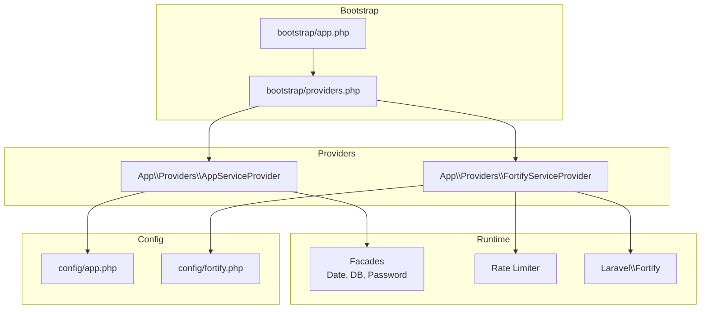
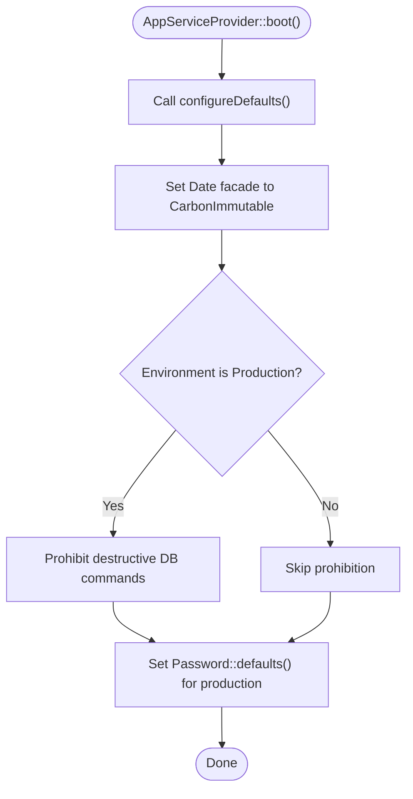
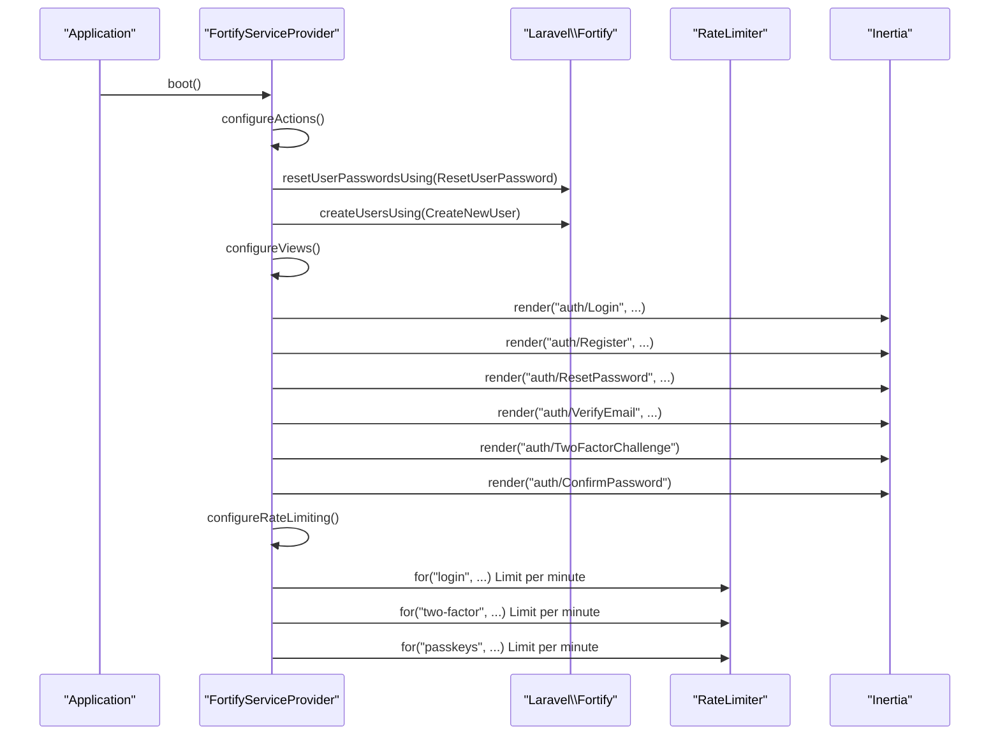
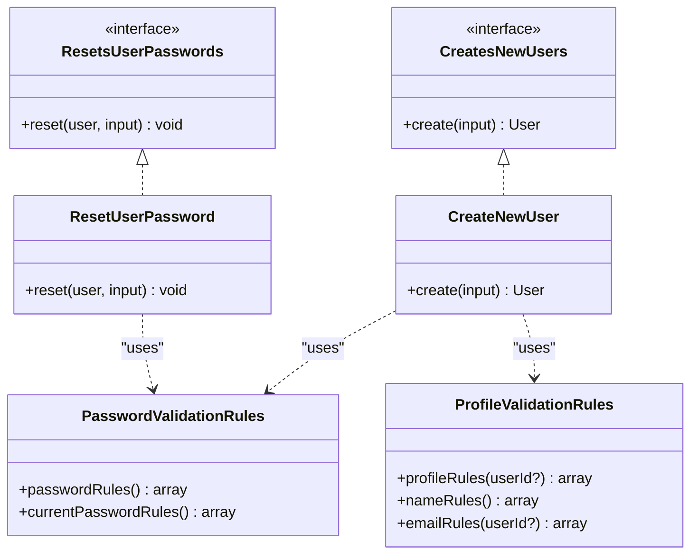
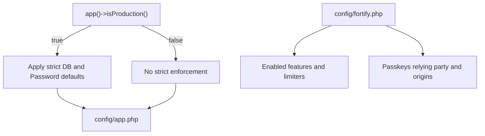
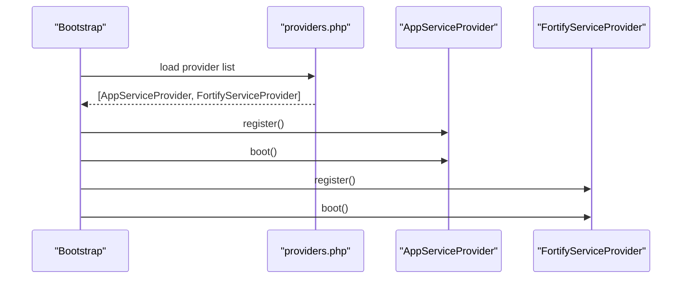
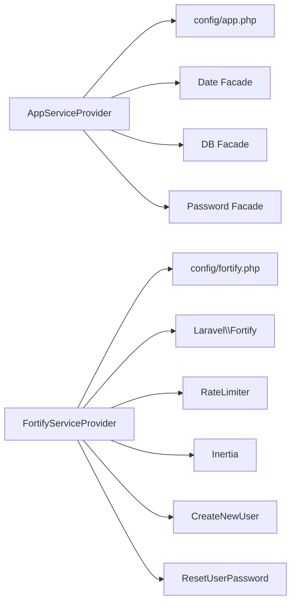

# Service Provider Configuration

<cite>
**Referenced Files in This Document**
- [AppServiceProvider.php](file://app/Providers/AppServiceProvider.php)
- [FortifyServiceProvider.php](file://app/Providers/FortifyServiceProvider.php)
- [app.php](file://bootstrap/app.php)
- [providers.php](file://bootstrap/providers.php)
- [app.php](file://config/app.php)
- [fortify.php](file://config/fortify.php)
- [CreateNewUser.php](file://app/Actions/Fortify/CreateNewUser.php)
- [ResetUserPassword.php](file://app/Actions/Fortify/ResetUserPassword.php)
- [PasswordValidationRules.php](file://app/Concerns/PasswordValidationRules.php)
- [ProfileValidationRules.php](file://app/Concerns/ProfileValidationRules.php)
- [composer.json](file://composer.json)
- [web.php](file://routes/web.php)
- [HandleAppearance.php](file://app/Http/Middleware/HandleAppearance.php)
- [HandleInertiaRequests.php](file://app/Http/Middleware/HandleInertiaRequests.php)
</cite>

## Table of Contents
1. [Introduction](#introduction)
2. [Project Structure](#project-structure)
3. [Core Components](#core-components)
4. [Architecture Overview](#architecture-overview)
5. [Detailed Component Analysis](#detailed-component-analysis)
6. [Dependency Analysis](#dependency-analysis)
7. [Performance Considerations](#performance-considerations)
8. [Troubleshooting Guide](#troubleshooting-guide)
9. [Conclusion](#conclusion)
10. [Appendices](#appendices)

## Introduction
This document explains the Laravel service provider configuration in SmartRecruit ATS, focusing on the AppServiceProvider and FortifyServiceProvider. It covers registration and bootstrapping lifecycle, dependency injection container setup, singleton bindings, facade usage, configuration loading, environment-specific settings, service provider ordering, and practical guidance for developing custom providers, integrating package providers, publishing configuration, testing, performance optimization, and troubleshooting registration issues.

## Project Structure
SmartRecruit ATS follows a standard Laravel application layout with service providers located under app/Providers and registered via bootstrap/providers.php. The application is bootstrapped using the modern Application::configure(...) pattern in bootstrap/app.php. Configuration is environment-driven and loaded from config/*.php files.

**Diagram sources**
- [app.php:11-31](file://bootstrap/app.php#L11-L31)
- [providers.php:1-10](file://bootstrap/providers.php#L1-L10)
- [AppServiceProvider.php:11-51](file://app/Providers/AppServiceProvider.php#L11-L51)
- [FortifyServiceProvider.php:17-101](file://app/Providers/FortifyServiceProvider.php#L17-L101)
- [app.php:1-127](file://config/app.php#L1-L127)
- [fortify.php:1-178](file://config/fortify.php#L1-L178)

**Section sources**
- [app.php:11-31](file://bootstrap/app.php#L11-L31)
- [providers.php:1-10](file://bootstrap/providers.php#L1-L10)

## Core Components
- AppServiceProvider
  - Purpose: Applies production-ready defaults for date handling, destructive command protection, and password validation rules.
  - Facades used: Illuminate\Support\Facades\Date, Illuminate\Support\Facades\DB, Illuminate\Validation\Rules\Password.
  - Environment sensitivity: Uses app()->isProduction() to conditionally enforce stricter rules.
- FortifyServiceProvider
  - Purpose: Integrates Laravel Fortify with Inertia views, binds custom actions for user creation and password reset, and configures rate limiters.
  - Integrations: Laravel\Fortify, Illuminate\Support\Facades\RateLimiter, Inertia\Inertia.
  - Views: Renders Inertia pages for login, registration, password reset, email verification, two-factor challenge, and password confirmation.

**Section sources**
- [AppServiceProvider.php:11-51](file://app/Providers/AppServiceProvider.php#L11-L51)
- [FortifyServiceProvider.php:17-101](file://app/Providers/FortifyServiceProvider.php#L17-L101)

## Architecture Overview
The service provider architecture centers on two providers:
- AppServiceProvider bootstraps application-wide defaults.
- FortifyServiceProvider configures authentication-related behavior and integrates with Inertia for SPA-like UX.

```mermaid
classDiagram
class ServiceProvider {
<<abstract>>
+register() void
+boot() void
}
class AppServiceProvider {
+register() void
+boot() void
-configureDefaults() void
}
class FortifyServiceProvider {
+register() void
+boot() void
-configureActions() void
-configureViews() void
-configureRateLimiting() void
}
class Application {
+configure(...)
}
class Config_app_php {
+name
+env
+debug
+timezone
+cipher
+key
}
class Config_fortify_php {
+guard
+passwords
+username
+home
+middleware
+limiters
+features
}
ServiceProvider <|-- AppServiceProvider
ServiceProvider <|-- FortifyServiceProvider
Application --> AppServiceProvider : "registers"
Application --> FortifyServiceProvider : "registers"
AppServiceProvider --> Config_app_php : "reads"
FortifyServiceProvider --> Config_fortify_php : "reads"
```

**Diagram sources**
- [AppServiceProvider.php:11-51](file://app/Providers/AppServiceProvider.php#L11-L51)
- [FortifyServiceProvider.php:17-101](file://app/Providers/FortifyServiceProvider.php#L17-L101)
- [app.php:11-31](file://bootstrap/app.php#L11-L31)
- [app.php:1-127](file://config/app.php#L1-L127)
- [fortify.php:1-178](file://config/fortify.php#L1-L178)

## Detailed Component Analysis

### AppServiceProvider
- Registration phase: No custom bindings are registered in register().
- Boot phase: Invokes configureDefaults() to apply:
  - Date facade to use CarbonImmutable globally.
  - DB facade to prohibit destructive commands in production.
  - Password validation defaults tailored to production environments.

**Diagram sources**
- [AppServiceProvider.php:24-49](file://app/Providers/AppServiceProvider.php#L24-L49)

**Section sources**
- [AppServiceProvider.php:16-49](file://app/Providers/AppServiceProvider.php#L16-L49)

### FortifyServiceProvider
- Registration phase: No custom bindings in register().
- Boot phase: Three responsibilities:
  - configureActions: Binds custom actions for user creation and password reset.
  - configureViews: Provides Inertia-rendered views for authentication screens.
  - configureRateLimiting: Defines rate limiters for login, two-factor, and passkeys.

**Diagram sources**
- [FortifyServiceProvider.php:30-99](file://app/Providers/FortifyServiceProvider.php#L30-L99)
- [CreateNewUser.php:11-34](file://app/Actions/Fortify/CreateNewUser.php#L11-L34)
- [ResetUserPassword.php:10-30](file://app/Actions/Fortify/ResetUserPassword.php#L10-L30)

**Section sources**
- [FortifyServiceProvider.php:22-99](file://app/Providers/FortifyServiceProvider.php#L22-L99)

### Action Classes and Validation Traits
- CreateNewUser implements Laravel\Fortify\Contracts\CreatesNewUsers and uses validation traits for profile and password rules.
- ResetUserPassword implements Laravel\Fortify\Contracts\ResetsUserPasswords and enforces password validation rules.
- Validation traits encapsulate reusable rule sets for password and profile fields.

**Diagram sources**
- [CreateNewUser.php:11-34](file://app/Actions/Fortify/CreateNewUser.php#L11-L34)
- [ResetUserPassword.php:10-30](file://app/Actions/Fortify/ResetUserPassword.php#L10-L30)
- [PasswordValidationRules.php:8-30](file://app/Concerns/PasswordValidationRules.php#L8-L30)
- [ProfileValidationRules.php:9-52](file://app/Concerns/ProfileValidationRules.php#L9-L52)

**Section sources**
- [CreateNewUser.php:11-34](file://app/Actions/Fortify/CreateNewUser.php#L11-L34)
- [ResetUserPassword.php:10-30](file://app/Actions/Fortify/ResetUserPassword.php#L10-L30)
- [PasswordValidationRules.php:8-30](file://app/Concerns/PasswordValidationRules.php#L8-L30)
- [ProfileValidationRules.php:9-52](file://app/Concerns/ProfileValidationRules.php#L9-L52)

### Configuration Loading and Environment-Specific Behavior
- Environment detection: app()->isProduction() influences DB prohibitions and password defaults.
- Configuration files:
  - config/app.php: application metadata, environment, debug, timezone, cipher/key, maintenance driver/store.
  - config/fortify.php: guard, password broker, username/email, home path, middleware, rate limiters, passkeys settings, and enabled features.

**Diagram sources**
- [AppServiceProvider.php:36-48](file://app/Providers/AppServiceProvider.php#L36-L48)
- [app.php:1-127](file://config/app.php#L1-L127)
- [fortify.php:1-178](file://config/fortify.php#L1-L178)

**Section sources**
- [AppServiceProvider.php:32-49](file://app/Providers/AppServiceProvider.php#L32-L49)
- [app.php:1-127](file://config/app.php#L1-L127)
- [fortify.php:1-178](file://config/fortify.php#L1-L178)

### Service Provider Ordering and Registration
- Order: AppServiceProvider is registered before FortifyServiceProvider as defined in bootstrap/providers.php.
- Impact: AppServiceProvider runs first, establishing global defaults before FortifyServiceProvider configures authentication behavior.

**Diagram sources**
- [providers.php:6-9](file://bootstrap/providers.php#L6-L9)
- [AppServiceProvider.php:16-27](file://app/Providers/AppServiceProvider.php#L16-L27)
- [FortifyServiceProvider.php:22-35](file://app/Providers/FortifyServiceProvider.php#L22-L35)

**Section sources**
- [providers.php:1-10](file://bootstrap/providers.php#L1-L10)

### Dependency Injection Container Setup
- Singleton bindings: Not explicitly declared in the analyzed providers. The providers rely on facades and framework defaults.
- Facades usage:
  - AppServiceProvider uses Date, DB, and Password facades to configure global behavior.
  - FortifyServiceProvider uses RateLimiter and Inertia facades to configure throttling and rendering.

**Section sources**
- [AppServiceProvider.php:34-48](file://app/Providers/AppServiceProvider.php#L34-L48)
- [FortifyServiceProvider.php:49-99](file://app/Providers/FortifyServiceProvider.php#L49-L99)

### Package Service Provider Integration
- Laravel Fortify is integrated via composer require and configured by FortifyServiceProvider.
- Composer scripts trigger package discovery and asset publishing, ensuring third-party providers are discovered and assets published.

**Section sources**
- [composer.json:11-18](file://composer.json#L11-L18)
- [composer.json:80-87](file://composer.json#L80-L87)

### Configuration Publishing
- The project includes a script to publish Laravel assets and update Boost configuration, indicating a publishing pipeline for framework assets and third-party packages.

**Section sources**
- [composer.json:84-87](file://composer.json#L84-L87)

### Examples of Custom Service Provider Development
- To add a new provider:
  - Create a new class extending Illuminate\Support\ServiceProvider in app/Providers.
  - Implement register() and boot() methods as needed.
  - Add the provider class to bootstrap/providers.php.
  - Bind services in the container if necessary; otherwise rely on facades or configuration files.

[No sources needed since this section provides general guidance]

### Testing Service Providers
- Unit/integration tests can assert:
  - Facade behavior after provider boot (e.g., Date facade set to CarbonImmutable).
  - Rate limiter keys and limits configured by FortifyServiceProvider.
  - Fortify view rendering delegates to Inertia.
- Use Laravel’s Application::configure(...) to bootstrap the application in tests and register providers under test.

[No sources needed since this section provides general guidance]

## Dependency Analysis
- Internal dependencies:
  - AppServiceProvider depends on config/app.php for environment and application metadata.
  - FortifyServiceProvider depends on config/fortify.php for guard, broker, features, and limiters.
- External dependencies:
  - Laravel\Fortify for authentication features.
  - Inertia for server-rendered SPA views.
  - Illuminate\Support\Facades for Date, DB, and Password.
  - Illuminate\Cache\RateLimiting for throttling.

**Diagram sources**
- [AppServiceProvider.php:34-48](file://app/Providers/AppServiceProvider.php#L34-L48)
- [FortifyServiceProvider.php:40-99](file://app/Providers/FortifyServiceProvider.php#L40-L99)
- [app.php:1-127](file://config/app.php#L1-L127)
- [fortify.php:1-178](file://config/fortify.php#L1-L178)
- [CreateNewUser.php:11-34](file://app/Actions/Fortify/CreateNewUser.php#L11-L34)
- [ResetUserPassword.php:10-30](file://app/Actions/Fortify/ResetUserPassword.php#L10-L30)

**Section sources**
- [AppServiceProvider.php:34-48](file://app/Providers/AppServiceProvider.php#L34-L48)
- [FortifyServiceProvider.php:40-99](file://app/Providers/FortifyServiceProvider.php#L40-L99)
- [app.php:1-127](file://config/app.php#L1-L127)
- [fortify.php:1-178](file://config/fortify.php#L1-L178)

## Performance Considerations
- Prefer facades for global configuration rather than heavy container bindings to minimize overhead.
- Keep provider boot logic minimal; defer expensive operations to lazy initialization or middleware.
- Use environment-aware checks (e.g., production-only protections) to avoid unnecessary work in development.
- Centralize rate-limiting configuration in FortifyServiceProvider to ensure consistent enforcement.

[No sources needed since this section provides general guidance]

## Troubleshooting Guide
- Service provider not registering:
  - Verify the provider class is included in bootstrap/providers.php.
  - Ensure the provider extends Illuminate\Support\ServiceProvider and implements register()/boot().
- Facade behavior not applied:
  - Confirm provider boot order and that configureDefaults() is invoked.
  - Check environment detection logic and APP_ENV settings.
- Fortify views not rendering:
  - Ensure Inertia is installed and configured.
  - Verify FortifyServiceProvider boot() is called and views are enabled in config/fortify.php.
- Rate limiting ineffective:
  - Confirm RateLimiter keys and limits are defined in FortifyServiceProvider.
  - Check that Fortify middleware is applied to routes.

**Section sources**
- [providers.php:6-9](file://bootstrap/providers.php#L6-L9)
- [AppServiceProvider.php:24-49](file://app/Providers/AppServiceProvider.php#L24-L49)
- [FortifyServiceProvider.php:30-99](file://app/Providers/FortifyServiceProvider.php#L30-L99)
- [fortify.php:117-135](file://config/fortify.php#L117-L135)

## Conclusion
SmartRecruit ATS leverages two focused service providers to establish production-ready defaults and integrate Laravel Fortify with Inertia. AppServiceProvider centralizes global configuration via facades, while FortifyServiceProvider coordinates authentication actions, views, and rate limiting. The configuration is environment-aware, and the provider order ensures proper initialization sequence. Following the guidance herein will help maintain, extend, and troubleshoot the service provider configuration effectively.

[No sources needed since this section summarizes without analyzing specific files]

## Appendices

### Appendix A: Middleware Integration Context
- HandleAppearance and HandleInertiaRequests middleware demonstrate runtime integration patterns complementary to service providers, sharing view data and configuring root templates.

**Section sources**
- [HandleAppearance.php:17-22](file://app/Http/Middleware/HandleAppearance.php#L17-L22)
- [HandleInertiaRequests.php:36-46](file://app/Http/Middleware/HandleInertiaRequests.php#L36-L46)
- [web.php:18-29](file://routes/web.php#L18-L29)