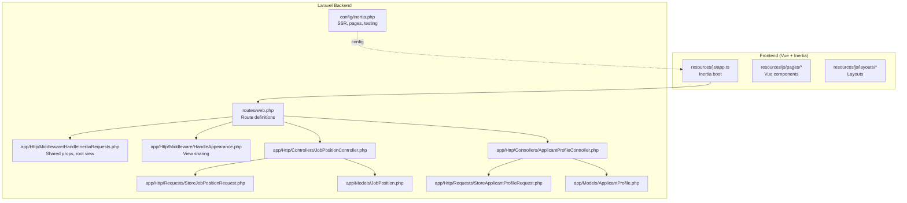
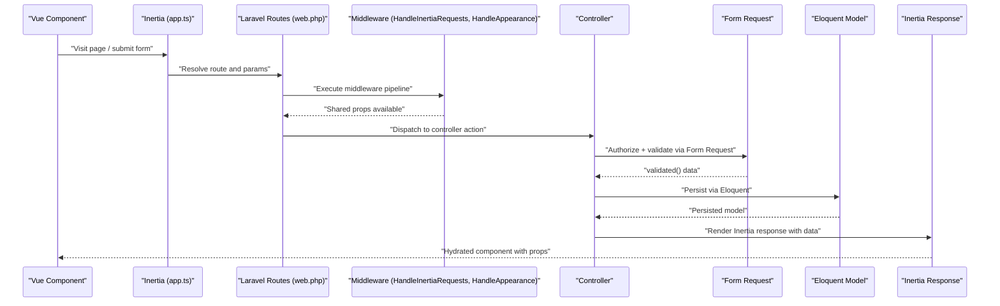
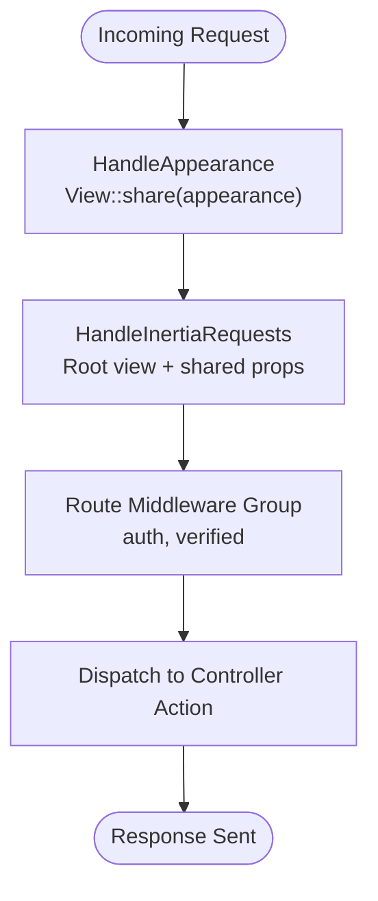
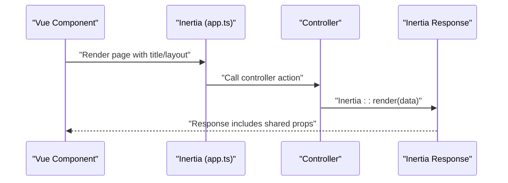
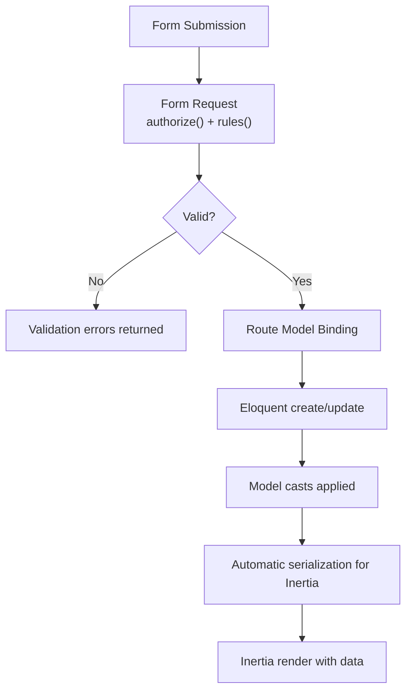
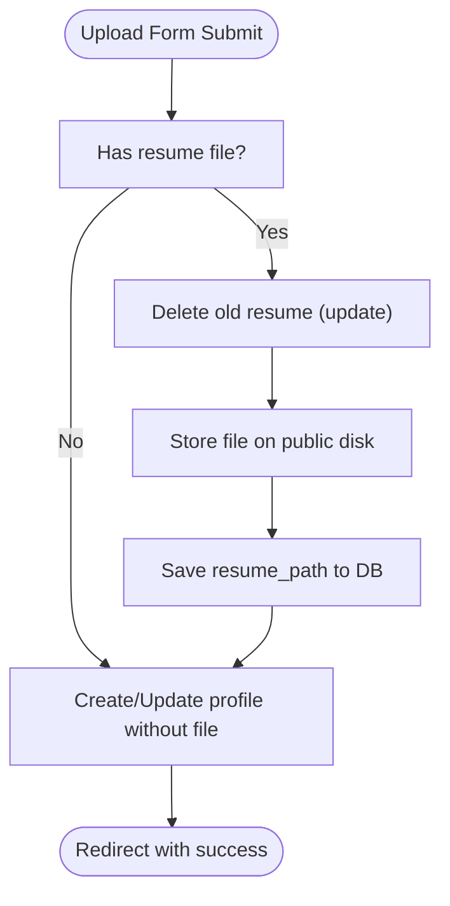
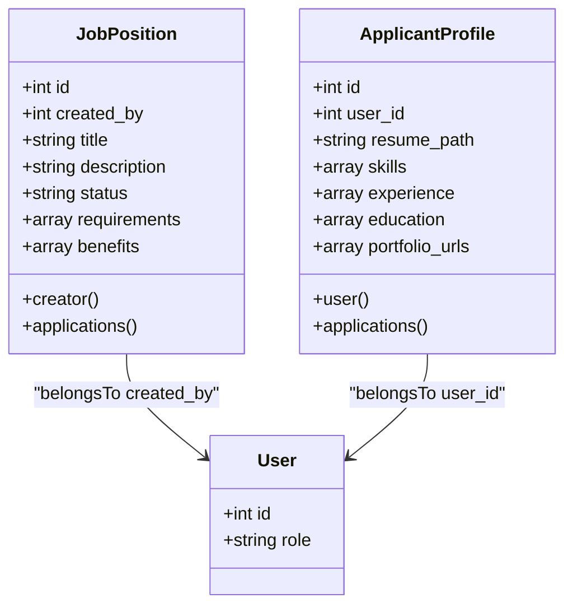
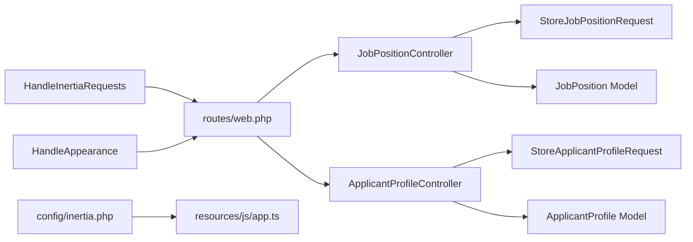

# Data Flow & Communication

<cite>
**Referenced Files in This Document**
- [HandleInertiaRequests.php](file://app/Http/Middleware/HandleInertiaRequests.php)
- [HandleAppearance.php](file://app/Http/Middleware/HandleAppearance.php)
- [app.ts](file://resources/js/app.ts)
- [web.php](file://routes/web.php)
- [inertia.php](file://config/inertia.php)
- [JobPositionController.php](file://app/Http/Controllers/JobPositionController.php)
- [ApplicantProfileController.php](file://app/Http/Controllers/ApplicantProfileController.php)
- [StoreJobPositionRequest.php](file://app/Http/Requests/StoreJobPositionRequest.php)
- [StoreApplicantProfileRequest.php](file://app/Http/Requests/StoreApplicantProfileRequest.php)
- [JobPosition.php](file://app/Models/JobPosition.php)
- [ApplicantProfile.php](file://app/Models/ApplicantProfile.php)
- [cache.php](file://config/cache.php)
</cite>

## Table of Contents
1. [Introduction](#introduction)
2. [Project Structure](#project-structure)
3. [Core Components](#core-components)
4. [Architecture Overview](#architecture-overview)
5. [Detailed Component Analysis](#detailed-component-analysis)
6. [Dependency Analysis](#dependency-analysis)
7. [Performance Considerations](#performance-considerations)
8. [Troubleshooting Guide](#troubleshooting-guide)
9. [Conclusion](#conclusion)

## Introduction
This document explains the end-to-end data flow in the SmartRecruit ATS system, focusing on the request-response cycle from Vue components through Inertia.js to Laravel controllers and back. It documents the middleware pipeline, request transformation, response formatting, validation via Form Request classes, model binding, automatic serialization, state management patterns, file upload and processing, API-style interactions, error propagation, caching strategies, persistence patterns, and performance optimizations.

## Project Structure
SmartRecruit uses Inertia.js to deliver a Vue-based Single Page Application served by Laravel. The frontend initializes Inertia, selects layouts per page, and handles progress indicators. Routes are defined in web.php and bound to controllers. Controllers orchestrate validation, persistence, uploads, and response generation. Shared data and SSR configuration are centralized in configuration files.

**Diagram sources**
- [app.ts:10-27](file://resources/js/app.ts#L10-L27)
- [web.php:18-29](file://routes/web.php#L18-L29)
- [HandleInertiaRequests.php:36-46](file://app/Http/Middleware/HandleInertiaRequests.php#L36-L46)
- [HandleAppearance.php:17-22](file://app/Http/Middleware/HandleAppearance.php#L17-L22)
- [JobPositionController.php:12-54](file://app/Http/Controllers/JobPositionController.php#L12-L54)
- [ApplicantProfileController.php:13-58](file://app/Http/Controllers/ApplicantProfileController.php#L13-L58)
- [StoreJobPositionRequest.php:8-33](file://app/Http/Requests/StoreJobPositionRequest.php#L8-L33)
- [StoreApplicantProfileRequest.php:8-33](file://app/Http/Requests/StoreApplicantProfileRequest.php#L8-L33)
- [JobPosition.php:10-38](file://app/Models/JobPosition.php#L10-L38)
- [ApplicantProfile.php:10-40](file://app/Models/ApplicantProfile.php#L10-L40)
- [inertia.php:18-23](file://config/inertia.php#L18-L23)

**Section sources**
- [app.ts:10-27](file://resources/js/app.ts#L10-L27)
- [web.php:18-29](file://routes/web.php#L18-L29)
- [HandleInertiaRequests.php:36-46](file://app/Http/Middleware/HandleInertiaRequests.php#L36-L46)
- [HandleAppearance.php:17-22](file://app/Http/Middleware/HandleAppearance.php#L17-L22)
- [inertia.php:18-23](file://config/inertia.php#L18-L23)

## Core Components
- Inertia Boot and Layout Selection: The frontend initializes Inertia, sets the page title, selects layouts based on the page name, and enables progress indication.
- Middleware Pipeline:
  - HandleInertiaRequests: Sets the root template and shares application-wide data (name, auth.user, sidebarOpen).
  - HandleAppearance: Shares appearance preference from cookie to views.
- Controllers:
  - JobPositionController: Handles listing, creation, viewing, updating, and deletion of job positions with authorization checks.
  - ApplicantProfileController: Manages applicant profile CRUD with file upload handling and resume storage.
- Form Requests: Centralize authorization and validation rules for controllers.
- Models: Define fillable attributes, casting, and relationships for persistence and serialization.
- Configuration: Inertia SSR settings and cache store configuration.

**Section sources**
- [app.ts:10-27](file://resources/js/app.ts#L10-L27)
- [HandleInertiaRequests.php:17-46](file://app/Http/Middleware/HandleInertiaRequests.php#L17-L46)
- [HandleAppearance.php:17-22](file://app/Http/Middleware/HandleAppearance.php#L17-L22)
- [JobPositionController.php:12-54](file://app/Http/Controllers/JobPositionController.php#L12-L54)
- [ApplicantProfileController.php:13-58](file://app/Http/Controllers/ApplicantProfileController.php#L13-L58)
- [StoreJobPositionRequest.php:8-33](file://app/Http/Requests/StoreJobPositionRequest.php#L8-L33)
- [StoreApplicantProfileRequest.php:8-33](file://app/Http/Requests/StoreApplicantProfileRequest.php#L8-L33)
- [JobPosition.php:12-38](file://app/Models/JobPosition.php#L12-L38)
- [ApplicantProfile.php:12-40](file://app/Models/ApplicantProfile.php#L12-L40)
- [inertia.php:18-23](file://config/inertia.php#L18-L23)

## Architecture Overview
The request-response lifecycle begins in the Vue frontend, navigates through Inertia to Laravel routes, executes middleware, applies Form Request validation, persists data via Eloquent, and returns an Inertia response with shared props. SSR can pre-render initial pages for improved performance.

**Diagram sources**
- [app.ts:10-27](file://resources/js/app.ts#L10-L27)
- [web.php:18-29](file://routes/web.php#L18-L29)
- [HandleInertiaRequests.php:36-46](file://app/Http/Middleware/HandleInertiaRequests.php#L36-L46)
- [HandleAppearance.php:17-22](file://app/Http/Middleware/HandleAppearance.php#L17-L22)
- [JobPositionController.php:22-42](file://app/Http/Controllers/JobPositionController.php#L22-L42)
- [ApplicantProfileController.php:24-56](file://app/Http/Controllers/ApplicantProfileController.php#L24-L56)
- [StoreJobPositionRequest.php:13-32](file://app/Http/Requests/StoreJobPositionRequest.php#L13-L32)
- [StoreApplicantProfileRequest.php:13-32](file://app/Http/Requests/StoreApplicantProfileRequest.php#L13-L32)
- [JobPosition.php:12-38](file://app/Models/JobPosition.php#L12-L38)
- [ApplicantProfile.php:12-40](file://app/Models/ApplicantProfile.php#L12-L40)

## Detailed Component Analysis

### Middleware Pipeline Execution Order
- HandleAppearance runs early to share appearance preferences with views.
- HandleInertiaRequests runs to set the root template and share global data (application name, auth.user, sidebarOpen state).
- Route middleware groups apply auth and verified guards around protected routes.

**Diagram sources**
- [HandleAppearance.php:17-22](file://app/Http/Middleware/HandleAppearance.php#L17-L22)
- [HandleInertiaRequests.php:17-46](file://app/Http/Middleware/HandleInertiaRequests.php#L17-L46)
- [web.php:18-29](file://routes/web.php#L18-L29)

**Section sources**
- [HandleAppearance.php:17-22](file://app/Http/Middleware/HandleAppearance.php#L17-L22)
- [HandleInertiaRequests.php:17-46](file://app/Http/Middleware/HandleInertiaRequests.php#L17-L46)
- [web.php:18-29](file://routes/web.php#L18-L29)

### Request Transformation and Response Formatting
- Frontend: Inertia boot selects layouts and progress bar; page titles are composed from the current title and app name.
- Backend: Controllers render Inertia responses carrying data arrays. Shared props from middleware are merged into the Inertia payload.

**Diagram sources**
- [app.ts:10-27](file://resources/js/app.ts#L10-L27)
- [JobPositionController.php:14-20](file://app/Http/Controllers/JobPositionController.php#L14-L20)
- [HandleInertiaRequests.php:36-46](file://app/Http/Middleware/HandleInertiaRequests.php#L36-L46)

**Section sources**
- [app.ts:10-27](file://resources/js/app.ts#L10-L27)
- [HandleInertiaRequests.php:36-46](file://app/Http/Middleware/HandleInertiaRequests.php#L36-L46)

### Data Validation Flow: Form Request Classes, Model Binding, Serialization
- Authorization and Validation:
  - StoreJobPositionRequest enforces HRD role and validates fields.
  - StoreApplicantProfileRequest validates resume file constraints and optional arrays.
- Model Binding:
  - Controllers accept route-model-bound Eloquent models; validated data is passed to create/update.
- Automatic Serialization:
  - Eloquent casts arrays to typed arrays; Inertia serializes arrays and relations for transport.

**Diagram sources**
- [StoreJobPositionRequest.php:13-32](file://app/Http/Requests/StoreJobPositionRequest.php#L13-L32)
- [StoreApplicantProfileRequest.php:13-32](file://app/Http/Requests/StoreApplicantProfileRequest.php#L13-L32)
- [JobPositionController.php:22-42](file://app/Http/Controllers/JobPositionController.php#L22-L42)
- [ApplicantProfileController.php:24-56](file://app/Http/Controllers/ApplicantProfileController.php#L24-L56)
- [JobPosition.php:21-27](file://app/Models/JobPosition.php#L21-L27)
- [ApplicantProfile.php:21-29](file://app/Models/ApplicantProfile.php#L21-L29)

**Section sources**
- [StoreJobPositionRequest.php:13-32](file://app/Http/Requests/StoreJobPositionRequest.php#L13-L32)
- [StoreApplicantProfileRequest.php:13-32](file://app/Http/Requests/StoreApplicantProfileRequest.php#L13-L32)
- [JobPositionController.php:22-42](file://app/Http/Controllers/JobPositionController.php#L22-L42)
- [ApplicantProfileController.php:24-56](file://app/Http/Controllers/ApplicantProfileController.php#L24-L56)
- [JobPosition.php:21-27](file://app/Models/JobPosition.php#L21-L27)
- [ApplicantProfile.php:21-29](file://app/Models/ApplicantProfile.php#L21-L29)

### State Management Patterns: Reactive Updates and Real-Time Communication
- Optimistic Updates: Apply UI changes immediately upon form submission; roll back on failure. This pattern improves perceived performance and user experience.
- Deferred Props: Use deferred loading for large datasets to keep initial render fast; components hydrate progressively.
- Flash Toasts: Server-side flash messages propagate to the client to notify outcomes (success/error).
- Layout Props: Inertia allows passing props to layouts; ensure layout components handle undefined states gracefully.

Note: The referenced skill documents highlight optimistic updates, deferred props, and flash toast initialization. These are client-side patterns that complement the backend’s shared props and Inertia rendering.

**Section sources**
- [app.ts:24-33](file://resources/js/app.ts#L24-L33)

### File Upload and Processing Pipeline
- Resume Upload:
  - On store/update, the controller checks for a resume file, stores it to the public disk under a dedicated folder, and persists only the path.
  - Existing files are deleted before replacing on update.
- Storage Path:
  - Files are stored on the public disk; ensure proper permissions and visibility for retrieval.

**Diagram sources**
- [ApplicantProfileController.php:24-56](file://app/Http/Controllers/ApplicantProfileController.php#L24-L56)

**Section sources**
- [ApplicantProfileController.php:24-56](file://app/Http/Controllers/ApplicantProfileController.php#L24-L56)

### API Endpoint Communication
- Non-Page Visits: For JSON-only endpoints that do not navigate, use HTTP hooks designed for standalone requests. This maintains a consistent developer experience without triggering a full page visit.
- Instant Visits: Navigate immediately to a new page while background data loads, reducing perceived latency.

These capabilities are supported by the Inertia client and are configured via the Inertia app boot.

**Section sources**
- [app.ts:10-27](file://resources/js/app.ts#L10-L27)

### Error Handling Propagation
- Validation Errors: Form Requests return structured validation failures; Inertia surfaces these to the frontend for immediate feedback.
- Authorization Errors: Controllers may abort with 403 for unauthorized actions (e.g., non-HRD deletion).
- Network and HTTP Exceptions: Inertia v3+ emits networkError and httpException events; ensure handlers are attached to present user-friendly messages.

**Section sources**
- [StoreJobPositionRequest.php:13-16](file://app/Http/Requests/StoreJobPositionRequest.php#L13-L16)
- [JobPositionController.php:46-48](file://app/Http/Controllers/JobPositionController.php#L46-L48)
- [app.ts:10-27](file://resources/js/app.ts#L10-L27)

### Data Persistence Patterns
- Eloquent Models:
  - Fillable arrays restrict mass assignment.
  - Casts ensure arrays are typed consistently.
  - Relationships define ownership and cascading behavior.
- Controller Persistence:
  - Creation uses validated data; updates mutate existing records.
  - Deletion guarded by role checks.

**Diagram sources**
- [JobPosition.php:12-38](file://app/Models/JobPosition.php#L12-L38)
- [ApplicantProfile.php:12-40](file://app/Models/ApplicantProfile.php#L12-L40)

**Section sources**
- [JobPosition.php:12-38](file://app/Models/JobPosition.php#L12-L38)
- [ApplicantProfile.php:12-40](file://app/Models/ApplicantProfile.php#L12-L40)
- [JobPositionController.php:14-53](file://app/Http/Controllers/JobPositionController.php#L14-L53)
- [ApplicantProfileController.php:15-57](file://app/Http/Controllers/ApplicantProfileController.php#L15-L57)

## Dependency Analysis
- Route to Controller: Resource routes and explicit bindings connect frontend actions to controllers.
- Controller to Request: Form Requests encapsulate authorization and validation.
- Controller to Model: Eloquent models persist and serialize data.
- Middleware to Views: Shared props and SSR configuration influence response shape.

**Diagram sources**
- [web.php:18-29](file://routes/web.php#L18-L29)
- [JobPositionController.php:5-11](file://app/Http/Controllers/JobPositionController.php#L5-L11)
- [ApplicantProfileController.php:5-11](file://app/Http/Controllers/ApplicantProfileController.php#L5-L11)
- [StoreJobPositionRequest.php:5-6](file://app/Http/Requests/StoreJobPositionRequest.php#L5-L6)
- [StoreApplicantProfileRequest.php:5-6](file://app/Http/Requests/StoreApplicantProfileRequest.php#L5-L6)
- [JobPosition.php:5-6](file://app/Models/JobPosition.php#L5-L6)
- [ApplicantProfile.php:5-6](file://app/Models/ApplicantProfile.php#L5-L6)
- [HandleInertiaRequests.php:8-9](file://app/Http/Middleware/HandleInertiaRequests.php#L8-L9)
- [HandleAppearance.php:5-6](file://app/Http/Middleware/HandleAppearance.php#L5-L6)
- [inertia.php:3-4](file://config/inertia.php#L3-L4)

**Section sources**
- [web.php:18-29](file://routes/web.php#L18-L29)
- [JobPositionController.php:5-11](file://app/Http/Controllers/JobPositionController.php#L5-L11)
- [ApplicantProfileController.php:5-11](file://app/Http/Controllers/ApplicantProfileController.php#L5-L11)
- [StoreJobPositionRequest.php:5-6](file://app/Http/Requests/StoreJobPositionRequest.php#L5-L6)
- [StoreApplicantProfileRequest.php:5-6](file://app/Http/Requests/StoreApplicantProfileRequest.php#L5-L6)
- [JobPosition.php:5-6](file://app/Models/JobPosition.php#L5-L6)
- [ApplicantProfile.php:5-6](file://app/Models/ApplicantProfile.php#L5-L6)
- [HandleInertiaRequests.php:8-9](file://app/Http/Middleware/HandleInertiaRequests.php#L8-L9)
- [HandleAppearance.php:5-6](file://app/Http/Middleware/HandleAppearance.php#L5-L6)
- [inertia.php:3-4](file://config/inertia.php#L3-L4)

## Performance Considerations
- Server-Side Rendering (SSR): Enable SSR to pre-render initial pages for faster time-to-content.
- Cache Stores: Choose appropriate cache drivers (database, redis, memcached) and configure failover for resilience.
- Stale-While-Revalidate: Use flexible caching to serve near-stale data while refreshing in the background.
- Per-Request Memoization: Use once() to avoid repeated computation within a single request lifecycle.
- Deferred Props: Defer heavy props to reduce initial payload and improve perceived performance.

**Section sources**
- [inertia.php:18-23](file://config/inertia.php#L18-L23)
- [cache.php:18](file://config/cache.php#L18)
- [.agents\skills\laravel-best-practices\rules\caching.md:21-62](file://.agents/skills/laravel-best-practices/rules/caching.md#L21-L62)

## Troubleshooting Guide
- Validation Failures: Ensure Form Requests are invoked by controllers; inspect validated data and error messages surfaced by Inertia.
- Authorization Denials: Verify role checks and middleware groups; confirm user is authenticated and verified.
- File Upload Issues: Confirm file presence, mime types, and max size constraints; ensure public disk write permissions.
- Layout Problems: Ensure Vue components have a single root element; verify layout selection logic matches page names.
- Network Errors: Subscribe to httpException and networkError events to display meaningful messages.

**Section sources**
- [StoreJobPositionRequest.php:13-32](file://app/Http/Requests/StoreJobPositionRequest.php#L13-L32)
- [StoreApplicantProfileRequest.php:13-32](file://app/Http/Requests/StoreApplicantProfileRequest.php#L13-L32)
- [JobPositionController.php:46-48](file://app/Http/Controllers/JobPositionController.php#L46-L48)
- [ApplicantProfileController.php:24-56](file://app/Http/Controllers/ApplicantProfileController.php#L24-L56)
- [.agents\skills\inertia-vue-development\SKILL.md:566-576](file://.agents/skills/inertia-vue-development/SKILL.md#L566-L576)

## Conclusion
SmartRecruit ATS leverages Inertia.js to unify frontend and backend concerns, enabling efficient request-response cycles with shared props, robust validation via Form Requests, and seamless persistence through Eloquent. The middleware pipeline enriches responses with global data, while SSR and caching strategies enhance performance. File uploads are handled securely with controlled storage and replacement semantics. Together, these patterns deliver a responsive, maintainable, and scalable data flow architecture.