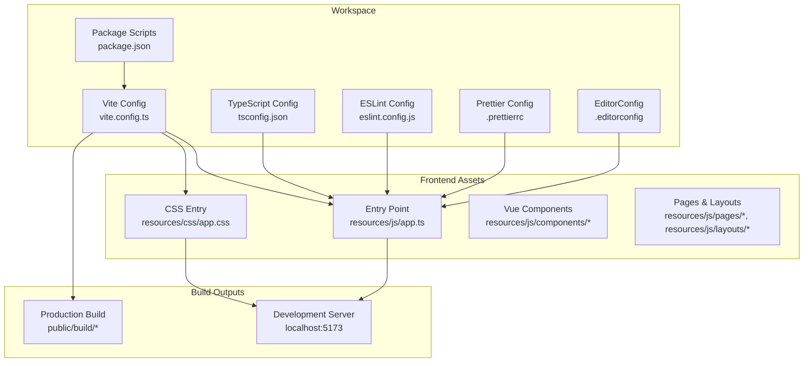
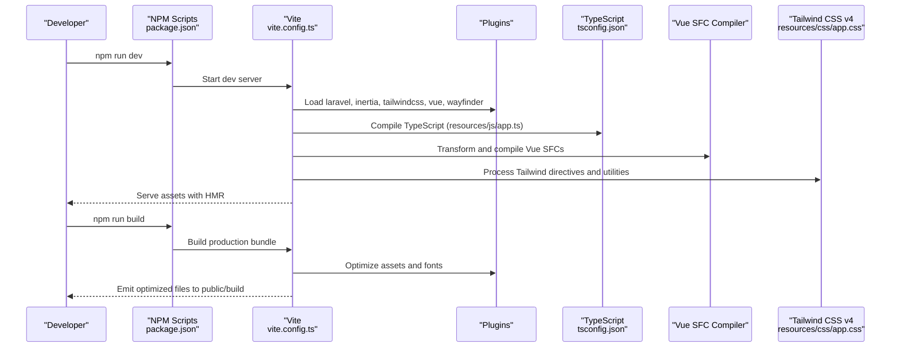
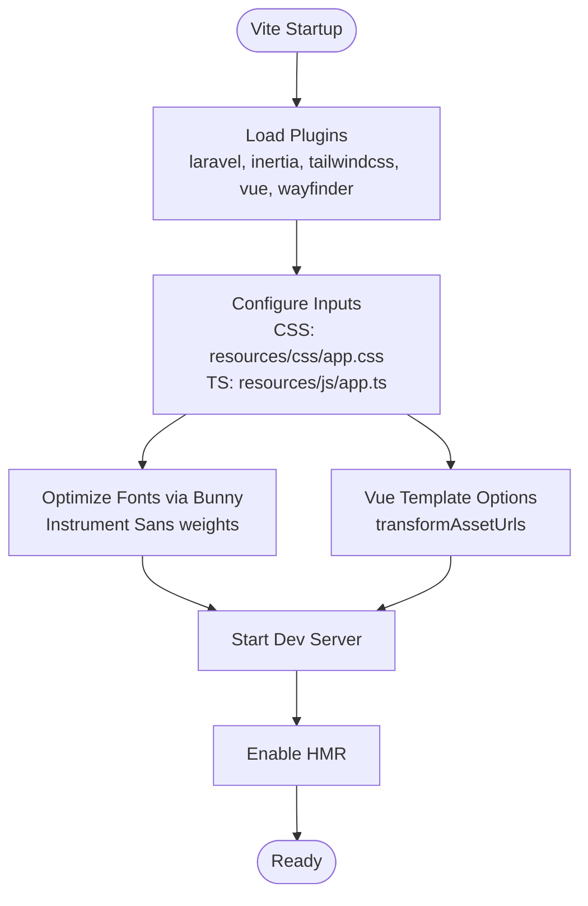
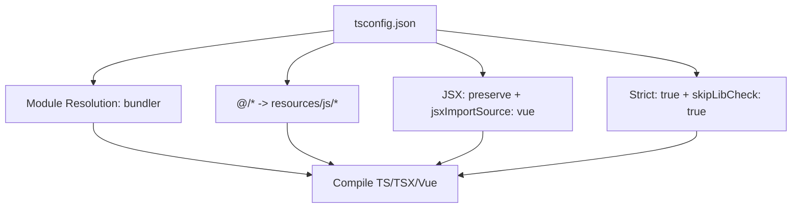
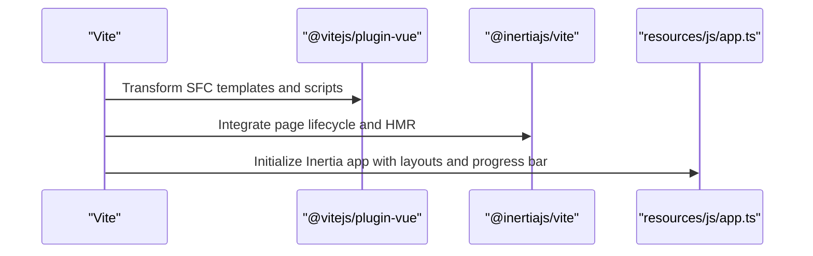
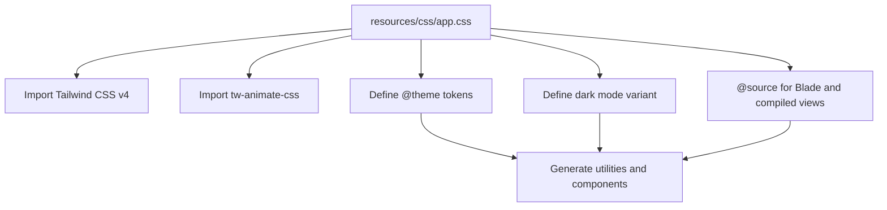
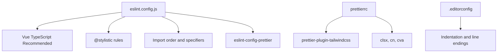
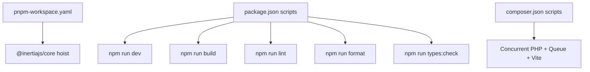
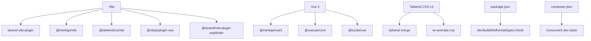

# Build Pipeline & Vite Configuration

<cite>
**Referenced Files in This Document**
- [vite.config.ts](file://vite.config.ts)
- [package.json](file://package.json)
- [tsconfig.json](file://tsconfig.json)
- [eslint.config.js](file://eslint.config.js)
- [.prettierrc](file://.prettierrc)
- [resources/js/app.ts](file://resources/js/app.ts)
- [resources/css/app.css](file://resources/css/app.css)
- [pnpm-workspace.yaml](file://pnpm-workspace.yaml)
- [components.json](file://components.json)
- [composer.json](file://composer.json)
- [.editorconfig](file://.editorconfig)
- [phpstan.neon](file://phpstan.neon)
</cite>

## Table of Contents
1. [Introduction](#introduction)
2. [Project Structure](#project-structure)
3. [Core Components](#core-components)
4. [Architecture Overview](#architecture-overview)
5. [Detailed Component Analysis](#detailed-component-analysis)
6. [Dependency Analysis](#dependency-analysis)
7. [Performance Considerations](#performance-considerations)
8. [Troubleshooting Guide](#troubleshooting-guide)
9. [Conclusion](#conclusion)
10. [Appendices](#appendices)

## Introduction
This document explains the complete frontend build pipeline and Vite configuration for SmartRecruit ATS. It covers the Vite build system setup, asset optimization, development server configuration, TypeScript compilation, Vue Single-File Component (SFC) processing, and CSS handling. It also documents ESLint and Prettier configuration for code quality and formatting, workspace configuration, dependency management, and build optimization strategies. Guidance is provided for hot module replacement, source maps, production builds, customizing the build pipeline, adding new plugins, and troubleshooting common build issues.

## Project Structure
SmartRecruit ATS integrates a modern frontend toolchain with Vite, Vue 3, TypeScript, and Tailwind CSS v4. The build pipeline is orchestrated via Vite plugins and scripts defined in package.json, while TypeScript and ESLint configurations enforce code quality and type safety. The frontend assets are organized under resources/js and resources/css, with Vue SFCs distributed across resources/js/components, layouts, and pages.

**Diagram sources**
- [vite.config.ts:1-35](file://vite.config.ts#L1-L35)
- [package.json:1-62](file://package.json#L1-L62)
- [tsconfig.json:1-126](file://tsconfig.json#L1-L126)
- [eslint.config.js:1-100](file://eslint.config.js#L1-L100)
- [.prettierrc:1-26](file://.prettierrc#L1-L26)
- [resources/js/app.ts:1-34](file://resources/js/app.ts#L1-L34)
- [resources/css/app.css:1-241](file://resources/css/app.css#L1-L241)

**Section sources**
- [vite.config.ts:1-35](file://vite.config.ts#L1-L35)
- [package.json:1-62](file://package.json#L1-L62)
- [tsconfig.json:1-126](file://tsconfig.json#L1-L126)
- [eslint.config.js:1-100](file://eslint.config.js#L1-L100)
- [.prettierrc:1-26](file://.prettierrc#L1-L26)
- [resources/js/app.ts:1-34](file://resources/js/app.ts#L1-L34)
- [resources/css/app.css:1-241](file://resources/css/app.css#L1-L241)

## Core Components
- Vite configuration defines plugins, input assets, and font optimization via laravel-vite-plugin and @laravel/vite-plugin-wayfinder.
- TypeScript configuration targets ESNext, enables bundler module resolution, and includes Vue and JSX support.
- ESLint configuration composes Vue TypeScript recommended rules, enforces import ordering, and integrates Prettier.
- Prettier configuration aligns formatting with Tailwind CSS and project conventions.
- Package scripts orchestrate development, production builds, type checking, linting, and formatting.
- Frontend entry points initialize Inertia.js, theme, and flash notifications.

Key implementation references:
- Vite plugins and inputs: [vite.config.ts:9-35](file://vite.config.ts#L9-L35)
- TypeScript compiler options: [tsconfig.json:2-118](file://tsconfig.json#L2-L118)
- ESLint composition and rules: [eslint.config.js:24-99](file://eslint.config.js#L24-L99)
- Prettier Tailwind integration: [.prettierrc:7-15](file://.prettierrc#L7-L15)
- Package scripts: [package.json:5-14](file://package.json#L5-L14)
- Inertia app initialization: [resources/js/app.ts:10-27](file://resources/js/app.ts#L10-L27)

**Section sources**
- [vite.config.ts:1-35](file://vite.config.ts#L1-L35)
- [tsconfig.json:1-126](file://tsconfig.json#L1-L126)
- [eslint.config.js:1-100](file://eslint.config.js#L1-L100)
- [.prettierrc:1-26](file://.prettierrc#L1-L26)
- [package.json:1-62](file://package.json#L1-L62)
- [resources/js/app.ts:1-34](file://resources/js/app.ts#L1-L34)

## Architecture Overview
The build pipeline combines Vite’s plugin ecosystem with Laravel’s Vite integration and Vue’s SFC compiler. The flow begins with Vite reading vite.config.ts, loading plugins, and compiling TypeScript and Vue SFCs. CSS is processed by Tailwind CSS v4 and tw-animate-css. Fonts are optimized via @laravel/vite-plugin-wayfinder and bunny. During development, Vite serves assets with HMR enabled. Production builds optimize assets and generate hashed filenames.

**Diagram sources**
- [package.json:5-14](file://package.json#L5-L14)
- [vite.config.ts:9-35](file://vite.config.ts#L9-L35)
- [tsconfig.json:2-118](file://tsconfig.json#L2-L118)
- [resources/js/app.ts:1-34](file://resources/js/app.ts#L1-L34)
- [resources/css/app.css:1-241](file://resources/css/app.css#L1-L241)

## Detailed Component Analysis

### Vite Configuration
The Vite configuration initializes essential plugins and sets input assets for CSS and TypeScript. It enables font optimization via bunny and form variants via @laravel/vite-plugin-wayfinder. The Vue plugin transforms asset URLs and preserves JSX factory behavior.

Key aspects:
- Plugin chain: laravel-vite-plugin, @inertiajs/vite, @tailwindcss/vite, @vitejs/plugin-vue, @laravel/vite-plugin-wayfinder.
- Inputs: resources/css/app.css and resources/js/app.ts.
- Font optimization: Bunny CDN integration for Instrument Sans with specific weights.
- Vue template options: transformAssetUrls configured for base and absolute paths.

Implementation references:
- Plugin registration and inputs: [vite.config.ts:10-19](file://vite.config.ts#L10-L19)
- Inertia plugin: [vite.config.ts:20](file://vite.config.ts#L20)
- Tailwind CSS plugin: [vite.config.ts:21](file://vite.config.ts#L21)
- Vue plugin with template options: [vite.config.ts:22-29](file://vite.config.ts#L22-L29)
- Wayfinder plugin with form variants: [vite.config.ts:30-32](file://vite.config.ts#L30-L32)

**Diagram sources**
- [vite.config.ts:9-35](file://vite.config.ts#L9-L35)

**Section sources**
- [vite.config.ts:1-35](file://vite.config.ts#L1-L35)

### TypeScript Compilation
TypeScript configuration targets ESNext, uses bundler module resolution, and includes Vue and JSX support. Path aliases map @/* to resources/js/*, enabling clean imports. Source maps are enabled for debugging, and noEmit prevents separate emission during type checks.

Key aspects:
- Target and lib: ESNext, DOM, DOM.Iterable.
- Module and resolution: ESNext, bundler.
- JSX preserve and jsxImportSource: Vue JSX factory.
- Paths: @/* -> ./resources/js/*.
- Types: vite/client included.
- Strictness: strict enabled; skipLibCheck to speed up type checking.

Implementation references:
- Compiler options: [tsconfig.json:14-118](file://tsconfig.json#L14-L118)
- Include patterns: [tsconfig.json:119-125](file://tsconfig.json#L119-L125)

**Diagram sources**
- [tsconfig.json:2-118](file://tsconfig.json#L2-L118)

**Section sources**
- [tsconfig.json:1-126](file://tsconfig.json#L1-L126)

### Vue SFC Processing
Vue Single-File Components are processed by @vitejs/plugin-vue. Asset URL transformations are configured to avoid incorrect base paths, and the plugin preserves JSX factory behavior for Vue 3. Inertia.js integration is handled by @inertiajs/vite, enabling seamless page navigation.

Key aspects:
- Vue plugin template options: transformAssetUrls with base and includeAbsolute toggles.
- Inertia integration: @inertiajs/vite handles page transitions and SSR hydration hints.
- JSX compatibility: jsx and jsxImportSource configured for Vue JSX factory.

Implementation references:
- Vue plugin configuration: [vite.config.ts:22-29](file://vite.config.ts#L22-L29)
- Inertia plugin: [vite.config.ts:20](file://vite.config.ts#L20)
- App entry using Inertia: [resources/js/app.ts:10-27](file://resources/js/app.ts#L10-L27)

**Diagram sources**
- [vite.config.ts:20-29](file://vite.config.ts#L20-L29)
- [resources/js/app.ts:10-27](file://resources/js/app.ts#L10-L27)

**Section sources**
- [vite.config.ts:1-35](file://vite.config.ts#L1-L35)
- [resources/js/app.ts:1-34](file://resources/js/app.ts#L1-L34)

### CSS Handling with Tailwind CSS v4
Tailwind CSS v4 processes @import directives and @theme tokens, generating utility classes and component styles. The CSS entry imports Tailwind, tw-animate-css, and defines dark mode variants and theme tokens. The @source directives include Blade and compiled view files to ensure purge-safe scanning.

Key aspects:
- @import 'tailwindcss' and @import 'tw-animate-css'.
- Dark mode variant definition and theme token overrides.
- @source directives for Blade and compiled views.
- Inline theme customization and color palette definitions.

Implementation references:
- CSS entry and imports: [resources/css/app.css:1-7](file://resources/css/app.css#L1-L7)
- Dark mode variant: [resources/css/app.css:8](file://resources/css/app.css#L8)
- Theme tokens: [resources/css/app.css:10-62](file://resources/css/app.css#L10-L62)
- Base and utilities layers: [resources/css/app.css:72-172](file://resources/css/app.css#L72-L172)
- Root and dark color schemes: [resources/css/app.css:92-163](file://resources/css/app.css#L92-L163)
- Additional theme tokens and typography: [resources/css/app.css:174-241](file://resources/css/app.css#L174-L241)

**Diagram sources**
- [resources/css/app.css:1-241](file://resources/css/app.css#L1-L241)

**Section sources**
- [resources/css/app.css:1-241](file://resources/css/app.css#L1-L241)

### ESLint and Prettier Configuration
ESLint configuration composes Vue TypeScript recommended rules, adds stylistic rules via @stylistic, enforces import order and type specifier styles, and integrates Prettier via eslint-config-prettier. Prettier is configured to work with Tailwind CSS classes and project conventions.

Key aspects:
- Composition: @vue/eslint-config-typescript recommended plus stylistic rules.
- Import rules: alphabetical grouping and top-level specifier preference.
- Stylistic rules: brace style, blank line enforcement around control statements.
- Prettier integration: eslint-config-prettier flat config.
- Ignored paths: vendor, node_modules, public, bootstrap/ssr, and UI component directories.

Implementation references:
- ESLint composition and rules: [eslint.config.js:24-99](file://eslint.config.js#L24-L99)
- Prettier plugin and Tailwind integration: [.prettierrc:7-15](file://.prettierrc#L7-L15)
- EditorConfig alignment: [.editorconfig:1-19](file://.editorconfig#L1-L19)

**Diagram sources**
- [eslint.config.js:1-100](file://eslint.config.js#L1-L100)
- [.prettierrc:1-26](file://.prettierrc#L1-L26)
- [.editorconfig:1-19](file://.editorconfig#L1-L19)

**Section sources**
- [eslint.config.js:1-100](file://eslint.config.js#L1-L100)
- [.prettierrc:1-26](file://.prettierrc#L1-L26)
- [.editorconfig:1-19](file://.editorconfig#L1-L19)

### Workspace Configuration and Dependency Management
pnpm workspace configuration declares the root package and hoists shared dependencies like @inertiajs/core. The package.json scripts define development, production, linting, formatting, and type checking tasks. Composer scripts coordinate PHP and frontend setup, including concurrent execution of PHP server, queue listener, and Vite dev server.

Key aspects:
- Workspace: single package with public hoist pattern for @inertiajs/core.
- Scripts: dev, build, lint, format, types:check, and build:ssr.
- Composer: dev script runs php artisan serve, queue:listen, and npm run dev concurrently.

Implementation references:
- Workspace config: [pnpm-workspace.yaml:1-6](file://pnpm-workspace.yaml#L1-L6)
- Scripts: [package.json:5-14](file://package.json#L5-L14)
- Composer dev command: [composer.json:54-57](file://composer.json#L54-L57)

**Diagram sources**
- [pnpm-workspace.yaml:1-6](file://pnpm-workspace.yaml#L1-L6)
- [package.json:5-14](file://package.json#L5-L14)
- [composer.json:54-57](file://composer.json#L54-L57)

**Section sources**
- [pnpm-workspace.yaml:1-6](file://pnpm-workspace.yaml#L1-L6)
- [package.json:1-62](file://package.json#L1-L62)
- [composer.json:1-119](file://composer.json#L1-L119)

### Build Optimization Strategies
- Asset optimization: laravel-vite-plugin optimizes CSS and JS, with @laravel/vite-plugin-wayfinder enabling form variants and font optimization via bunny.
- Tree shaking: ESNext target and bundler module resolution improve dead-code elimination.
- Source maps: enabled in tsconfig.json for debugging without emitting JavaScript.
- CSS purging: @source directives ensure Tailwind scans Blade and compiled views for safe purging.

Implementation references:
- Inputs and fonts: [vite.config.ts:11-19](file://vite.config.ts#L11-L19)
- Wayfinder form variants: [vite.config.ts:30-32](file://vite.config.ts#L30-L32)
- Source scanning: [resources/css/app.css:5-6](file://resources/css/app.css#L5-L6)
- Source maps: [tsconfig.json:65](file://tsconfig.json#L65)

**Section sources**
- [vite.config.ts:1-35](file://vite.config.ts#L1-L35)
- [resources/css/app.css:1-241](file://resources/css/app.css#L1-L241)
- [tsconfig.json:1-126](file://tsconfig.json#L1-L126)

### Hot Module Replacement and Development Server
HMR is enabled through Vite’s development server and plugins. The laravel-vite-plugin refresh option supports automatic reloads. Inertia integration ensures smooth page transitions during HMR updates. The dev script starts Vite with default port 5173.

Implementation references:
- Refresh option: [vite.config.ts:13](file://vite.config.ts#L13)
- Dev script: [package.json:8](file://package.json#L8)
- Inertia progress bar: [resources/js/app.ts:24-26](file://resources/js/app.ts#L24-L26)

**Section sources**
- [vite.config.ts:1-35](file://vite.config.ts#L1-L35)
- [package.json:1-62](file://package.json#L1-L62)
- [resources/js/app.ts:1-34](file://resources/js/app.ts#L1-L34)

### Production Build Configuration
Production builds are executed via npm run build, which invokes Vite’s build command. The laravel-vite-plugin emits optimized assets to public/build with hashed filenames. Optional SSR builds are supported via build:ssr script.

Implementation references:
- Build script: [package.json:6](file://package.json#L6)
- SSR build script: [package.json:7](file://package.json#L7)
- Inputs for production: [vite.config.ts:12](file://vite.config.ts#L12)

**Section sources**
- [package.json:1-62](file://package.json#L1-L62)
- [vite.config.ts:1-35](file://vite.config.ts#L1-L35)

### Customizing the Build Pipeline
To customize the build pipeline:
- Add new plugins: register them in vite.config.ts plugins array after existing ones.
- Modify inputs: update laravel plugin input array to include additional CSS/JS files.
- Adjust Vue options: extend template transformAssetUrls or add Vue compiler options.
- Configure Tailwind: modify resources/css/app.css directives and theme tokens.
- Extend ESLint: add rules in eslint.config.js and ensure Prettier ignores via .prettierrc.
- Add shadcn/vue components: configure components.json aliases and Tailwind CSS variables.

Implementation references:
- Plugin registration: [vite.config.ts:10-33](file://vite.config.ts#L10-L33)
- Inputs: [vite.config.ts:12](file://vite.config.ts#L12)
- Vue options: [vite.config.ts:22-29](file://vite.config.ts#L22-L29)
- Tailwind directives: [resources/css/app.css:1-7](file://resources/css/app.css#L1-L7)
- ESLint rules: [eslint.config.js:40-74](file://eslint.config.js#L40-L74)
- Prettier ignores: [eslint.config.js:76-88](file://eslint.config.js#L76-L88)
- Components config: [components.json:11-19](file://components.json#L11-L19)

**Section sources**
- [vite.config.ts:1-35](file://vite.config.ts#L1-L35)
- [resources/css/app.css:1-241](file://resources/css/app.css#L1-L241)
- [eslint.config.js:1-100](file://eslint.config.js#L1-L100)
- [components.json:1-20](file://components.json#L1-L20)

## Dependency Analysis
The frontend stack relies on Vite, Vue 3, TypeScript, Tailwind CSS v4, and Laravel’s Vite integration. Dependencies are managed via pnpm with hoisting for shared packages. The PHP side coordinates frontend builds via Composer scripts.

**Diagram sources**
- [vite.config.ts:1-35](file://vite.config.ts#L1-L35)
- [package.json:15-61](file://package.json#L15-L61)
- [composer.json:54-57](file://composer.json#L54-L57)

**Section sources**
- [vite.config.ts:1-35](file://vite.config.ts#L1-L35)
- [package.json:1-62](file://package.json#L1-L62)
- [composer.json:1-119](file://composer.json#L1-L119)

## Performance Considerations
- Use ESNext target and bundler module resolution for optimal tree shaking.
- Keep source maps enabled only for development; disable in production builds.
- Leverage Tailwind’s @source directives to prevent purging essential styles.
- Minimize plugin count and ensure only necessary transforms are applied.
- Use form variants and font optimization via @laravel/vite-plugin-wayfinder to reduce payload sizes.

## Troubleshooting Guide
Common issues and resolutions:
- TypeScript errors during dev: Run npm run types:check to validate types without emitting.
- ESLint errors: Use npm run lint or npm run lint:check to identify and fix issues.
- Formatting inconsistencies: Run npm run format or npm run format:check to apply Prettier rules.
- Missing CSS utilities: Ensure @source directives include relevant Blade and compiled view files.
- HMR not working: Verify refresh option in laravel plugin and plugin order in vite.config.ts.
- Inertia layout issues: Confirm layout selection logic in resources/js/app.ts and ensure layouts exist.

Implementation references:
- Type checking script: [package.json:13](file://package.json#L13)
- Lint scripts: [package.json:11-12](file://package.json#L11-L12)
- Format scripts: [package.json:9-10](file://package.json#L9-L10)
- Source directives: [resources/css/app.css:5-6](file://resources/css/app.css#L5-L6)
- Refresh option: [vite.config.ts:13](file://vite.config.ts#L13)
- Layout logic: [resources/js/app.ts:12-23](file://resources/js/app.ts#L12-L23)

**Section sources**
- [package.json:1-62](file://package.json#L1-L62)
- [resources/css/app.css:1-241](file://resources/css/app.css#L1-L241)
- [vite.config.ts:1-35](file://vite.config.ts#L1-L35)
- [resources/js/app.ts:1-34](file://resources/js/app.ts#L1-L34)

## Conclusion
SmartRecruit ATS employs a robust frontend build pipeline powered by Vite, Vue 3, TypeScript, and Tailwind CSS v4. The configuration emphasizes developer productivity with HMR, code quality with ESLint and Prettier, and performance through optimized asset handling and tree shaking. The provided scripts and configurations enable efficient development and reliable production builds, with clear pathways for customization and troubleshooting.

## Appendices
- Additional tooling: PHPStan configuration for static analysis and EditorConfig for consistent formatting across editors.
- Shadcn/vue integration: components.json defines aliases and Tailwind CSS variables for consistent component usage.

**Section sources**
- [phpstan.neon:1-14](file://phpstan.neon#L1-L14)
- [.editorconfig:1-19](file://.editorconfig#L1-L19)
- [components.json:1-20](file://components.json#L1-L20)