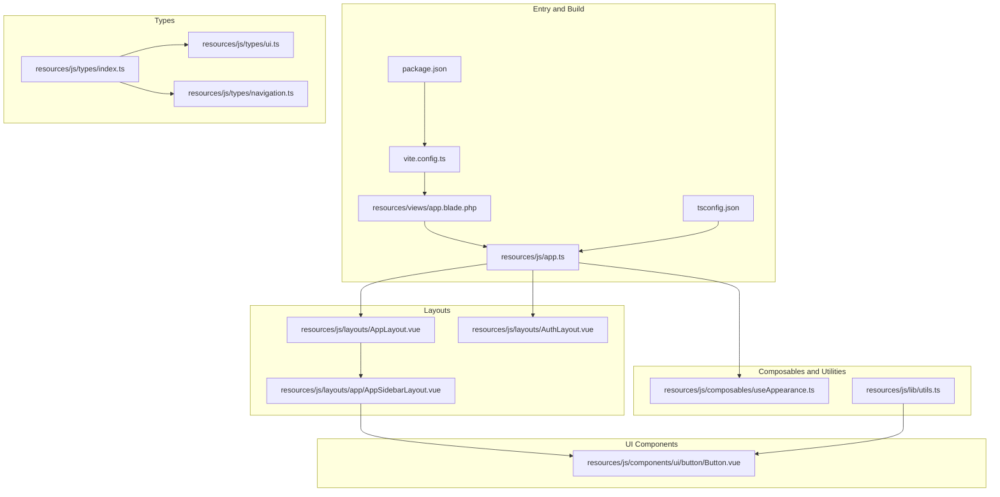
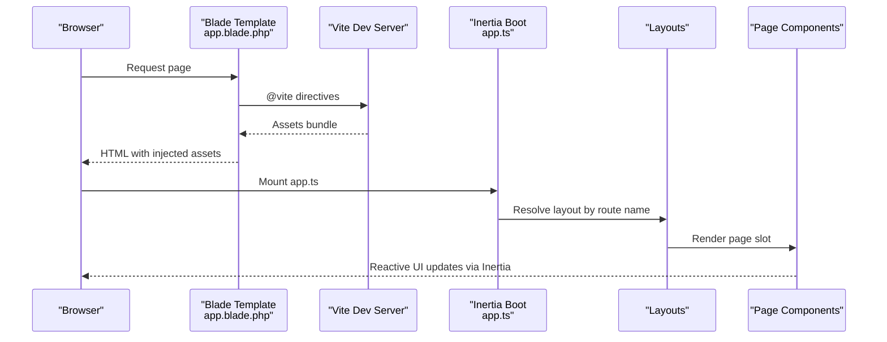
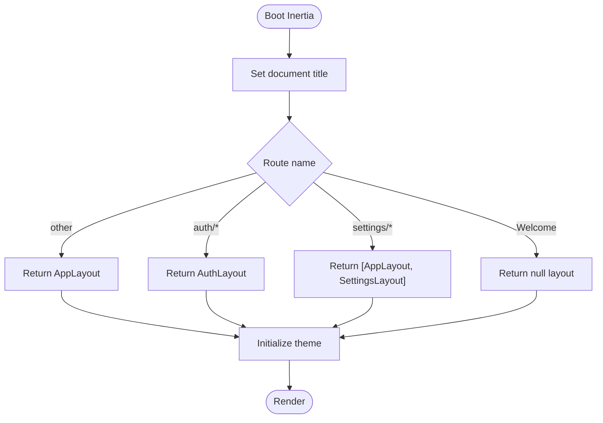
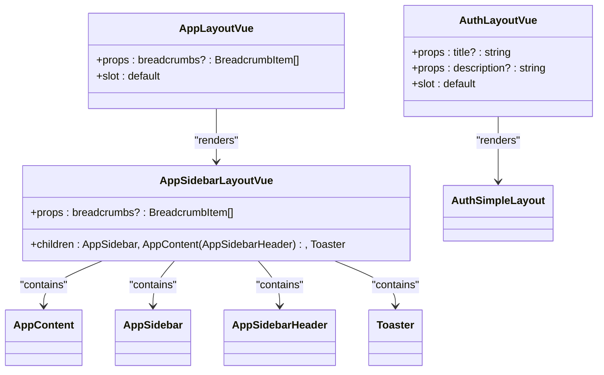
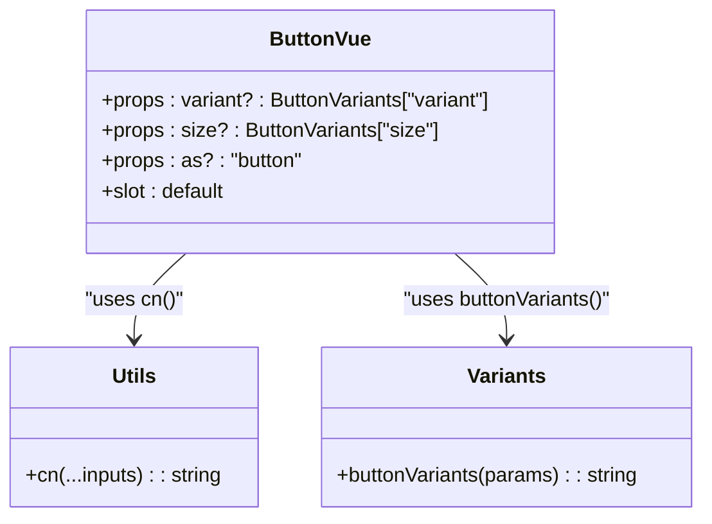
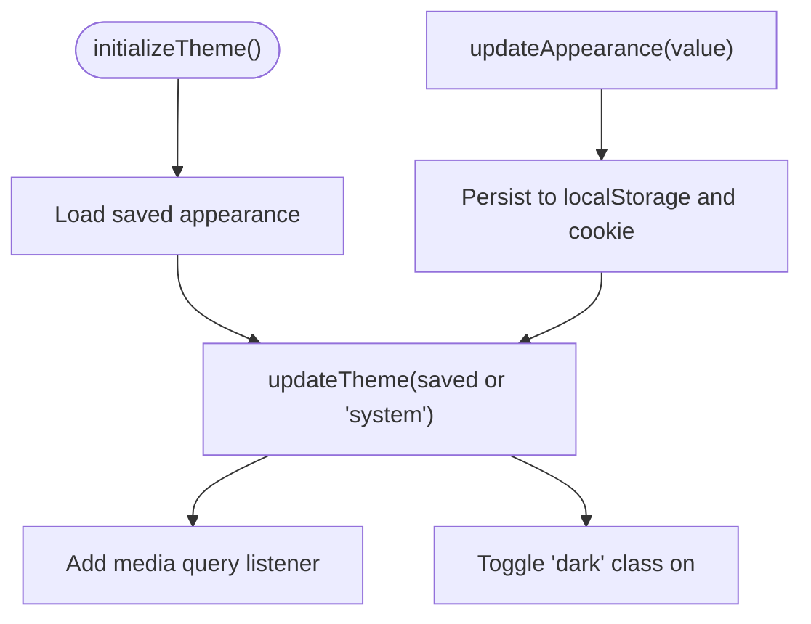
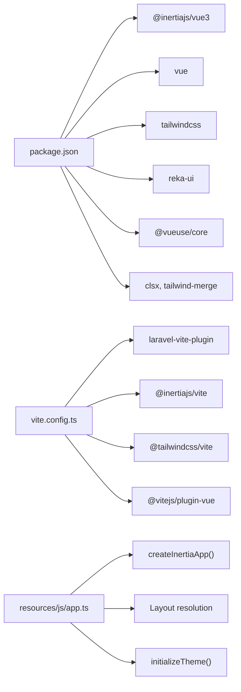

# Frontend Architecture

<cite>
**Referenced Files in This Document**
- [app.ts](file://resources/js/app.ts)
- [vite.config.ts](file://vite.config.ts)
- [package.json](file://package.json)
- [tsconfig.json](file://tsconfig.json)
- [app.blade.php](file://resources/views/app.blade.php)
- [AppLayout.vue](file://resources/js/layouts/AppLayout.vue)
- [AuthLayout.vue](file://resources/js/layouts/AuthLayout.vue)
- [AppSidebarLayout.vue](file://resources/js/layouts/app/AppSidebarLayout.vue)
- [Button.vue](file://resources/js/components/ui/button/Button.vue)
- [useAppearance.ts](file://resources/js/composables/useAppearance.ts)
- [utils.ts](file://resources/js/lib/utils.ts)
- [index.ts](file://resources/js/types/index.ts)
- [ui.ts](file://resources/js/types/ui.ts)
- [navigation.ts](file://resources/js/types/navigation.ts)
</cite>

## Table of Contents
1. [Introduction](#introduction)
2. [Project Structure](#project-structure)
3. [Core Components](#core-components)
4. [Architecture Overview](#architecture-overview)
5. [Detailed Component Analysis](#detailed-component-analysis)
6. [Dependency Analysis](#dependency-analysis)
7. [Performance Considerations](#performance-considerations)
8. [Troubleshooting Guide](#troubleshooting-guide)
9. [Conclusion](#conclusion)
10. [Appendices](#appendices)

## Introduction
This document describes the frontend architecture of the SmartRecruit ATS system. It focuses on the Vue.js 3 Composition API implementation with TypeScript integration, Inertia.js integration for seamless single-page application (SPA) behavior, Vite build system configuration, asset pipeline management, component architecture patterns, and state management via composable functions. It also documents the styling architecture using Tailwind CSS v4, the design system built on Reka UI primitives, and responsive design patterns.

## Project Structure
The frontend is organized around a layered structure:
- Entry point initializes Inertia.js and sets up theme and toast initialization.
- Vite orchestrates the build pipeline with Laravel Vite Plugin, Inertia plugin, Tailwind CSS integration, and Vue SFC support.
- Blade view renders the HTML shell and injects Vite assets.
- Layouts wrap page-level components and provide consistent navigation and content areas.
- UI components are modular, reusable, and typed.
- Composables encapsulate cross-cutting concerns like appearance and utilities.
- Types define the shared contracts for UI, navigation, and runtime behavior.

**Diagram sources**
- [app.blade.php:1-48](file://resources/views/app.blade.php#L1-L48)
- [app.ts:1-34](file://resources/js/app.ts#L1-L34)
- [vite.config.ts:1-35](file://vite.config.ts#L1-L35)
- [package.json:1-62](file://package.json#L1-L62)
- [tsconfig.json:1-126](file://tsconfig.json#L1-L126)
- [AppLayout.vue:1-15](file://resources/js/layouts/AppLayout.vue#L1-L15)
- [AuthLayout.vue:1-15](file://resources/js/layouts/AuthLayout.vue#L1-L15)
- [AppSidebarLayout.vue:1-28](file://resources/js/layouts/app/AppSidebarLayout.vue#L1-L28)
- [Button.vue:1-32](file://resources/js/components/ui/button/Button.vue#L1-L32)
- [useAppearance.ts:1-125](file://resources/js/composables/useAppearance.ts#L1-L125)
- [utils.ts:1-13](file://resources/js/lib/utils.ts#L1-L13)
- [index.ts:1-4](file://resources/js/types/index.ts#L1-L4)
- [ui.ts:1-10](file://resources/js/types/ui.ts#L1-L10)
- [navigation.ts:1-15](file://resources/js/types/navigation.ts#L1-L15)

**Section sources**
- [app.ts:1-34](file://resources/js/app.ts#L1-L34)
- [vite.config.ts:1-35](file://vite.config.ts#L1-L35)
- [package.json:1-62](file://package.json#L1-L62)
- [tsconfig.json:1-126](file://tsconfig.json#L1-L126)
- [app.blade.php:1-48](file://resources/views/app.blade.php#L1-L48)

## Core Components
- Inertia bootstrapper: Initializes Inertia with title transformation, layout resolution, and progress bar configuration. It also triggers theme and toast initialization on load.
- Layouts: Provide structural wrappers for authenticated, settings, and general application contexts.
- UI primitives: Reusable components built on Reka UI with variant-driven styling and class merging utilities.
- Composables: Encapsulate appearance management, URL transformations, and class merging helpers.
- Types: Define appearance, navigation, and UI contracts for type-safe development.

Key implementation references:
- Inertia initialization and layout selection: [app.ts:10-27](file://resources/js/app.ts#L10-L27)
- Theme initialization on load: [app.ts:29-33](file://resources/js/app.ts#L29-L33)
- Vite plugins and asset entry: [vite.config.ts:9-33](file://vite.config.ts#L9-L33)
- TypeScript path mapping and strictness: [tsconfig.json:36-43](file://tsconfig.json#L36-L43)
- Blade shell and Vite directive: [app.blade.php:39-42](file://resources/views/app.blade.php#L39-L42)
- Button primitive with variants: [Button.vue:1-32](file://resources/js/components/ui/button/Button.vue#L1-L32)
- Appearance composable: [useAppearance.ts:88-124](file://resources/js/composables/useAppearance.ts#L88-L124)
- Utility helpers: [utils.ts:6-12](file://resources/js/lib/utils.ts#L6-L12)
- Shared types: [index.ts:1-4](file://resources/js/types/index.ts#L1-L4), [ui.ts:1-10](file://resources/js/types/ui.ts#L1-L10), [navigation.ts:1-15](file://resources/js/types/navigation.ts#L1-L15)

**Section sources**
- [app.ts:1-34](file://resources/js/app.ts#L1-L34)
- [vite.config.ts:1-35](file://vite.config.ts#L1-L35)
- [tsconfig.json:1-126](file://tsconfig.json#L1-L126)
- [app.blade.php:1-48](file://resources/views/app.blade.php#L1-L48)
- [Button.vue:1-32](file://resources/js/components/ui/button/Button.vue#L1-L32)
- [useAppearance.ts:1-125](file://resources/js/composables/useAppearance.ts#L1-L125)
- [utils.ts:1-13](file://resources/js/lib/utils.ts#L1-L13)
- [index.ts:1-4](file://resources/js/types/index.ts#L1-L4)
- [ui.ts:1-10](file://resources/js/types/ui.ts#L1-L10)
- [navigation.ts:1-15](file://resources/js/types/navigation.ts#L1-L15)

## Architecture Overview
The frontend uses Inertia.js to bridge Laravel backend rendering with Vue SPA semantics. Vite manages the asset pipeline, integrates Tailwind CSS for styling, and compiles Vue Single File Components. Blade renders the HTML shell and injects Vite assets. Layouts wrap page components to provide consistent navigation and content areas. UI components are designed with variant-driven APIs and class merging utilities for maintainable styling.

**Diagram sources**
- [app.blade.php:39-42](file://resources/views/app.blade.php#L39-L42)
- [app.ts:10-27](file://resources/js/app.ts#L10-L27)
- [AppLayout.vue:1-15](file://resources/js/layouts/AppLayout.vue#L1-L15)
- [AuthLayout.vue:1-15](file://resources/js/layouts/AuthLayout.vue#L1-L15)
- [AppSidebarLayout.vue:18-27](file://resources/js/layouts/app/AppSidebarLayout.vue#L18-L27)

## Detailed Component Analysis

### Inertia Boot and Layout Resolution
The Inertia bootstrapper configures:
- Title transformation with application name.
- Layout resolution strategy:
  - No layout for Welcome.
  - AuthLayout for auth routes.
  - Dual AppLayout + SettingsLayout for settings routes.
  - AppLayout otherwise.
- Progress indicator color.
- Initial theme and toast initialization on load.

**Diagram sources**
- [app.ts:10-27](file://resources/js/app.ts#L10-L27)
- [app.ts:29-33](file://resources/js/app.ts#L29-L33)

**Section sources**
- [app.ts:1-34](file://resources/js/app.ts#L1-L34)

### Layout Architecture
- AppLayout: Thin wrapper delegating to AppSidebarLayout and passing breadcrumbs.
- AppSidebarLayout: Provides sidebar shell, content area, header breadcrumbs, and toast container.
- AuthLayout: Thin wrapper for authentication page cards with title/description props.

**Diagram sources**
- [AppLayout.vue:1-15](file://resources/js/layouts/AppLayout.vue#L1-L15)
- [AppSidebarLayout.vue:1-28](file://resources/js/layouts/app/AppSidebarLayout.vue#L1-L28)
- [AuthLayout.vue:1-15](file://resources/js/layouts/AuthLayout.vue#L1-L15)

**Section sources**
- [AppLayout.vue:1-15](file://resources/js/layouts/AppLayout.vue#L1-L15)
- [AppSidebarLayout.vue:1-28](file://resources/js/layouts/app/AppSidebarLayout.vue#L1-L28)
- [AuthLayout.vue:1-15](file://resources/js/layouts/AuthLayout.vue#L1-L15)

### UI Primitive: Button
The Button component:
- Accepts variant and size from its variants definition.
- Uses Reka UI Primitive for semantic rendering.
- Applies merged classes via cn utility.
- Supports custom element tag and child rendering.

**Diagram sources**
- [Button.vue:1-32](file://resources/js/components/ui/button/Button.vue#L1-L32)
- [utils.ts:6-8](file://resources/js/lib/utils.ts#L6-L8)

**Section sources**
- [Button.vue:1-32](file://resources/js/components/ui/button/Button.vue#L1-L32)
- [utils.ts:1-13](file://resources/js/lib/utils.ts#L1-L13)

### Appearance Management Composable
The appearance composable:
- Tracks user preference and resolved appearance (light/dark).
- Persists preferences to localStorage and cookies.
- Updates DOM class for Tailwind dark mode.
- Subscribes to system theme changes.

**Diagram sources**
- [useAppearance.ts:73-84](file://resources/js/composables/useAppearance.ts#L73-L84)
- [useAppearance.ts:107-117](file://resources/js/composables/useAppearance.ts#L107-L117)

**Section sources**
- [useAppearance.ts:1-125](file://resources/js/composables/useAppearance.ts#L1-L125)

### Utility Functions
- cn: Merges and deduplicates Tailwind classes using clsx and tailwind-merge.
- toUrl: Normalizes Inertia link href to string.

**Section sources**
- [utils.ts:1-13](file://resources/js/lib/utils.ts#L1-L13)

### Type System
Shared types define:
- Appearance and ResolvedAppearance for theme handling.
- AppVariant for layout variants.
- FlashToast for notification shape.
- BreadcrumbItem and NavItem for navigation structures.

**Section sources**
- [index.ts:1-4](file://resources/js/types/index.ts#L1-L4)
- [ui.ts:1-10](file://resources/js/types/ui.ts#L1-L10)
- [navigation.ts:1-15](file://resources/js/types/navigation.ts#L1-L15)

## Dependency Analysis
The frontend stack integrates several key dependencies:
- Inertia.js for Vue SPA behavior with Laravel backend.
- Vite with Laravel Vite Plugin, Inertia plugin, Tailwind CSS integration, and Vue SFC support.
- Tailwind CSS v4 for utility-first styling.
- Reka UI for primitive-based component variants.
- VueUse for common composables.
- TypeScript for type safety and Vue TSX support.

**Diagram sources**
- [package.json:36-51](file://package.json#L36-L51)
- [vite.config.ts:9-33](file://vite.config.ts#L9-L33)
- [app.ts:1-34](file://resources/js/app.ts#L1-L34)

**Section sources**
- [package.json:1-62](file://package.json#L1-L62)
- [vite.config.ts:1-35](file://vite.config.ts#L1-L35)
- [app.ts:1-34](file://resources/js/app.ts#L1-L34)

## Performance Considerations
- Asset pipeline: Vite with Laravel Vite Plugin optimizes dev/build performance and supports hot module replacement.
- CSS: Tailwind v4 with Vite plugin enables efficient purging and JIT processing.
- Component rendering: Reka UI primitives minimize DOM overhead while preserving accessibility and variants.
- Theme switching: Efficient DOM class toggling avoids unnecessary reflows; media query listeners are attached once during initialization.
- Type checking: TypeScript strict mode and noEmit in development reduce runtime overhead and improve DX.

## Troubleshooting Guide
Common issues and resolutions:
- Layout not applied: Verify route name prefixes and layout switch logic in the Inertia boot file.
- Theme not persisting: Ensure localStorage availability and cookie settings; confirm media query listener registration.
- Styles not updating: Check Tailwind plugin configuration and ensure CSS entry is included in Vite.
- Type errors: Run type checks and ensure tsconfig includes Vue and TS files.

**Section sources**
- [app.ts:10-27](file://resources/js/app.ts#L10-L27)
- [useAppearance.ts:73-84](file://resources/js/composables/useAppearance.ts#L73-L84)
- [vite.config.ts:9-33](file://vite.config.ts#L9-L33)
- [tsconfig.json:119-125](file://tsconfig.json#L119-L125)

## Conclusion
The SmartRecruit ATS frontend leverages a modern, type-safe Vue 3 + TypeScript stack integrated with Inertia.js and Vite. The architecture emphasizes reusable UI primitives, layout-driven composition, and composable state management for appearance and utilities. Tailwind CSS v4 and Reka UI provide a scalable design system with variant-driven styling. The build pipeline ensures fast iteration and production-ready assets.

## Appendices
- Development scripts: dev, build, lint, format, and type checks are configured in package.json.
- TypeScript configuration: strict mode, path aliases, and bundler module resolution enable robust type safety.

**Section sources**
- [package.json:5-14](file://package.json#L5-L14)
- [tsconfig.json:94-91](file://tsconfig.json#L94-L91)