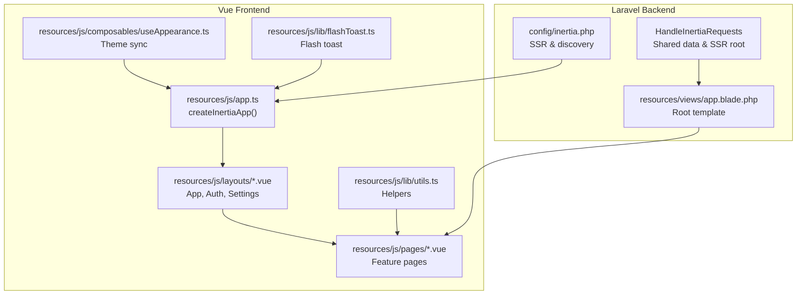
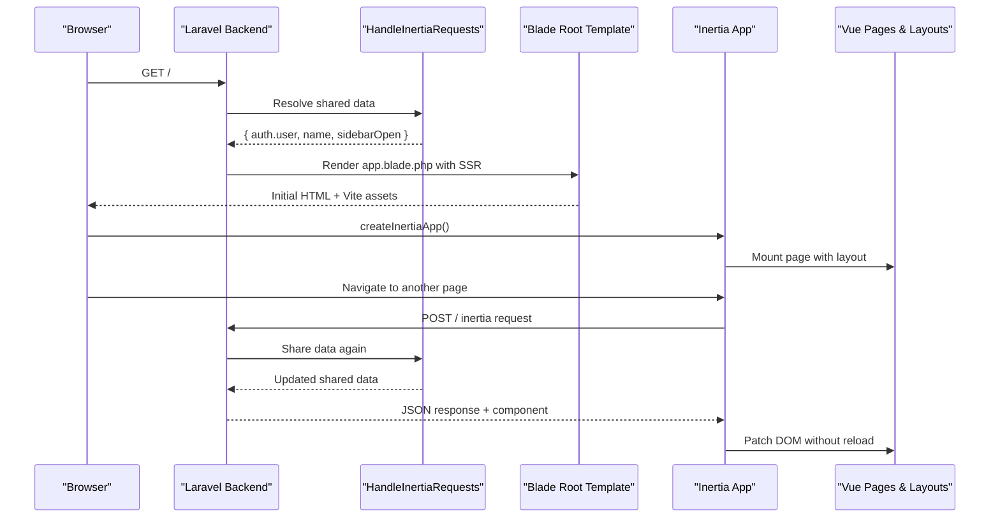
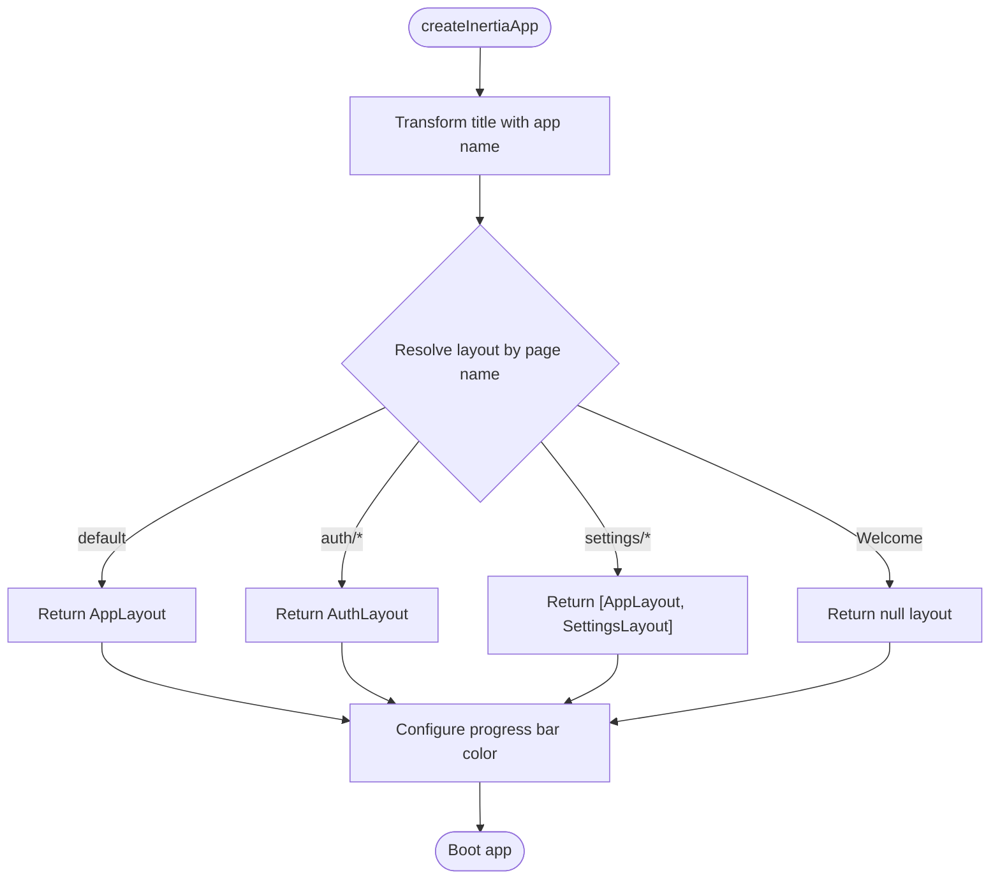
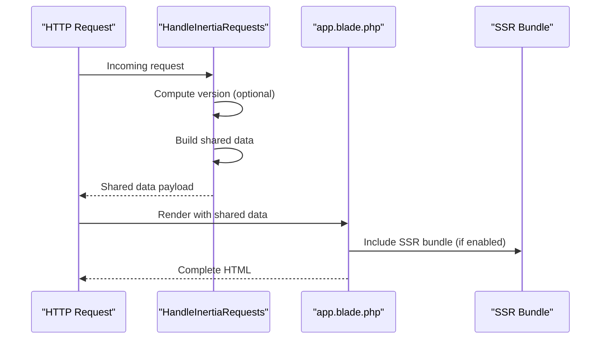
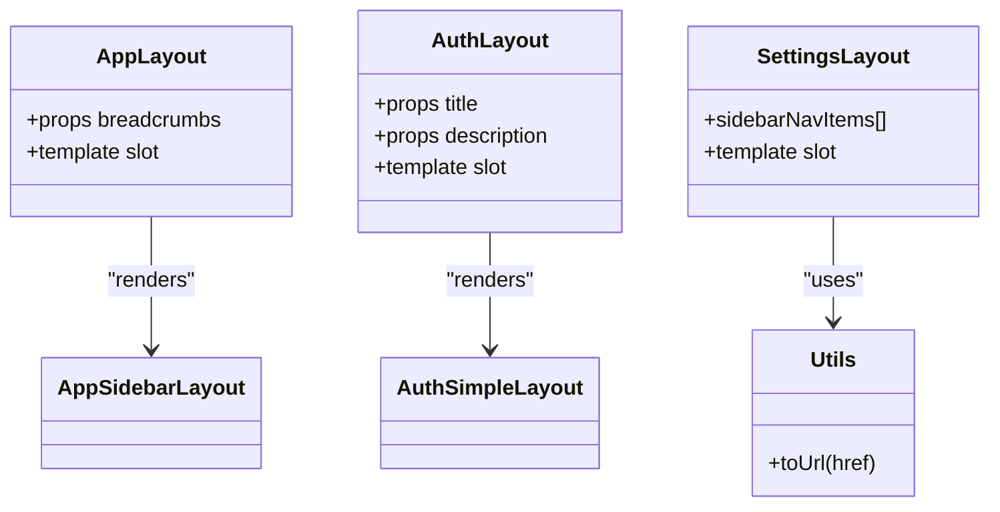
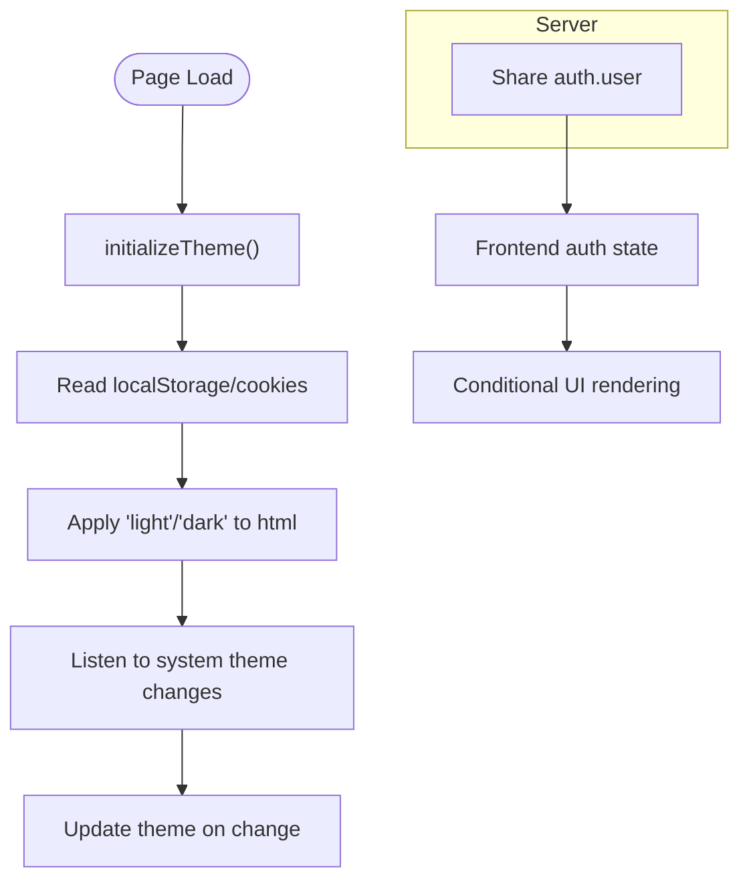
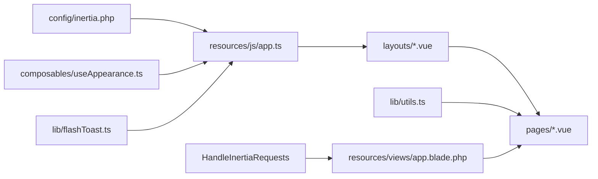

# Inertia.js Integration

<cite>
**Referenced Files in This Document**
- [config/inertia.php](file://config/inertia.php)
- [resources/js/app.ts](file://resources/js/app.ts)
- [app/Http/Middleware/HandleInertiaRequests.php](file://app/Http/Middleware/HandleInertiaRequests.php)
- [resources/views/app.blade.php](file://resources/views/app.blade.php)
- [resources/js/layouts/AppLayout.vue](file://resources/js/layouts/AppLayout.vue)
- [resources/js/layouts/AuthLayout.vue](file://resources/js/layouts/AuthLayout.vue)
- [resources/js/layouts/settings/Layout.vue](file://resources/js/layouts/settings/Layout.vue)
- [resources/js/lib/utils.ts](file://resources/js/lib/utils.ts)
- [resources/js/composables/useAppearance.ts](file://resources/js/composables/useAppearance.ts)
- [resources/js/pages/Dashboard.vue](file://resources/js/pages/Dashboard.vue)
- [resources/js/pages/auth/Login.vue](file://resources/js/pages/auth/Login.vue)
- [resources/js/components/AlertError.vue](file://resources/js/components/AlertError.vue)
- [resources/js/lib/flashToast.ts](file://resources/js/lib/flashToast.ts)
</cite>

## Table of Contents
1. [Introduction](#introduction)
2. [Project Structure](#project-structure)
3. [Core Components](#core-components)
4. [Architecture Overview](#architecture-overview)
5. [Detailed Component Analysis](#detailed-component-analysis)
6. [Dependency Analysis](#dependency-analysis)
7. [Performance Considerations](#performance-considerations)
8. [SEO Implications](#seo-implications)
9. [Debugging Techniques](#debugging-techniques)
10. [Troubleshooting Guide](#troubleshooting-guide)
11. [Conclusion](#conclusion)

## Introduction
This document explains how SmartRecruit integrates Inertia.js to deliver a seamless Single Page Application (SPA) experience while retaining server-side rendering benefits. It covers Inertia app initialization, layout switching logic, progress bar configuration, and the Laravel backend–Vue.js frontend integration for data passing, error handling, and authentication state synchronization. Practical examples illustrate inertia forms, modal dialogs, and progressive enhancement patterns. Performance, SEO, and debugging guidance are included to help maintain and scale the application effectively.

## Project Structure
SmartRecruit organizes Inertia.js assets around three pillars:
- Laravel middleware and Blade root template for server-side rendering and shared data
- Vue.js entrypoint for client-side bootstrapping, layout resolution, and progress indicators
- Frontend pages and layouts that render within Blade templates and communicate via Inertia

**Diagram sources**
- [config/inertia.php:1-71](file://config/inertia.php#L1-L71)
- [resources/js/app.ts:1-34](file://resources/js/app.ts#L1-L34)
- [app/Http/Middleware/HandleInertiaRequests.php:1-48](file://app/Http/Middleware/HandleInertiaRequests.php#L1-L48)
- [resources/views/app.blade.php:1-48](file://resources/views/app.blade.php#L1-L48)
- [resources/js/layouts/AppLayout.vue:1-15](file://resources/js/layouts/AppLayout.vue#L1-L15)
- [resources/js/layouts/AuthLayout.vue:1-15](file://resources/js/layouts/AuthLayout.vue#L1-L15)
- [resources/js/layouts/settings/Layout.vue:1-72](file://resources/js/layouts/settings/Layout.vue#L1-L72)
- [resources/js/lib/utils.ts:1-13](file://resources/js/lib/utils.ts#L1-L13)
- [resources/js/composables/useAppearance.ts:1-125](file://resources/js/composables/useAppearance.ts#L1-L125)
- [resources/js/lib/flashToast.ts:1-17](file://resources/js/lib/flashToast.ts#L1-L17)

**Section sources**
- [config/inertia.php:1-71](file://config/inertia.php#L1-L71)
- [resources/js/app.ts:1-34](file://resources/js/app.ts#L1-L34)
- [app/Http/Middleware/HandleInertiaRequests.php:1-48](file://app/Http/Middleware/HandleInertiaRequests.php#L1-L48)
- [resources/views/app.blade.php:1-48](file://resources/views/app.blade.php#L1-L48)

## Core Components
- Inertia configuration: Controls SSR enablement and page discovery paths.
- App initialization: Bootstraps Inertia with title transformation, dynamic layout selection, and progress bar.
- Shared data middleware: Provides application-wide data (e.g., auth.user, app name, sidebar state) to frontend.
- Root Blade template: Renders the Vite bundle and Inertia app shell.
- Layouts: AppLayout, AuthLayout, and Settings layout coordinate nested layouts and navigation.
- Utilities and composables: Helpers for URL conversion, appearance/theme synchronization, and flash toast notifications.

Key responsibilities:
- Seamless SPA navigation without full page reloads
- Server-side rendering for initial requests and SEO
- Consistent layout composition across feature areas
- Centralized state for authentication and UI preferences

**Section sources**
- [config/inertia.php:18-23](file://config/inertia.php#L18-L23)
- [config/inertia.php:36-51](file://config/inertia.php#L36-L51)
- [resources/js/app.ts:10-27](file://resources/js/app.ts#L10-L27)
- [app/Http/Middleware/HandleInertiaRequests.php:36-46](file://app/Http/Middleware/HandleInertiaRequests.php#L36-L46)
- [resources/views/app.blade.php:39-42](file://resources/views/app.blade.php#L39-L42)
- [resources/js/layouts/AppLayout.vue:1-15](file://resources/js/layouts/AppLayout.vue#L1-L15)
- [resources/js/layouts/AuthLayout.vue:1-15](file://resources/js/layouts/AuthLayout.vue#L1-L15)
- [resources/js/layouts/settings/Layout.vue:13-26](file://resources/js/layouts/settings/Layout.vue#L13-L26)
- [resources/js/lib/utils.ts:10-12](file://resources/js/lib/utils.ts#L10-L12)
- [resources/js/composables/useAppearance.ts:73-84](file://resources/js/composables/useAppearance.ts#L73-L84)
- [resources/js/lib/flashToast.ts:5-16](file://resources/js/lib/flashToast.ts#L5-L16)

## Architecture Overview
The system combines Laravel’s server-side rendering with Vue.js client-side navigation. On first request, the Blade root template renders the SSR HTML. Subsequent navigations are handled client-side by Inertia, preserving shared data and layout composition.

**Diagram sources**
- [app/Http/Middleware/HandleInertiaRequests.php:36-46](file://app/Http/Middleware/HandleInertiaRequests.php#L36-L46)
- [resources/views/app.blade.php:39-42](file://resources/views/app.blade.php#L39-L42)
- [resources/js/app.ts:10-27](file://resources/js/app.ts#L10-L27)
- [resources/js/layouts/AppLayout.vue:10-14](file://resources/js/layouts/AppLayout.vue#L10-L14)
- [resources/js/layouts/AuthLayout.vue:10-14](file://resources/js/layouts/AuthLayout.vue#L10-L14)
- [resources/js/layouts/settings/Layout.vue:31-71](file://resources/js/layouts/settings/Layout.vue#L31-L71)

## Detailed Component Analysis

### Inertia App Initialization and Layout Switching
- Dynamic layout selection resolves the appropriate layout based on the page name:
  - Welcome pages use no layout
  - Authentication pages use AuthLayout
  - Settings pages compose AppLayout with Settings layout
  - Default pages use AppLayout
- Progress bar is configured with a neutral gray color for visual feedback during navigation.
- Title transformation appends the application name to each page title.

**Diagram sources**
- [resources/js/app.ts:10-27](file://resources/js/app.ts#L10-L27)

**Section sources**
- [resources/js/app.ts:10-27](file://resources/js/app.ts#L10-L27)

### Server-Side Rendering and Shared Data
- The middleware defines the root template and shares:
  - Application name
  - Authenticated user object
  - Sidebar open state derived from a cookie
- The Blade root template loads Vite assets and injects Inertia head/app tags.

**Diagram sources**
- [app/Http/Middleware/HandleInertiaRequests.php:17](file://app/Http/Middleware/HandleInertiaRequests.php#L17)
- [app/Http/Middleware/HandleInertiaRequests.php:24-46](file://app/Http/Middleware/HandleInertiaRequests.php#L24-L46)
- [resources/views/app.blade.php:39-42](file://resources/views/app.blade.php#L39-L42)

**Section sources**
- [app/Http/Middleware/HandleInertiaRequests.php:17](file://app/Http/Middleware/HandleInertiaRequests.php#L17)
- [app/Http/Middleware/HandleInertiaRequests.php:36-46](file://app/Http/Middleware/HandleInertiaRequests.php#L36-L46)
- [resources/views/app.blade.php:39-42](file://resources/views/app.blade.php#L39-L42)

### Layout Composition and Navigation
- AppLayout wraps AppSidebarLayout and accepts breadcrumbs passed from pages.
- AuthLayout composes AuthSimpleLayout and forwards title/description props.
- Settings layout defines a sidebar navigation and slots content into a responsive grid.
- Utility helpers convert route objects to URLs consistently.

**Diagram sources**
- [resources/js/layouts/AppLayout.vue:1-15](file://resources/js/layouts/AppLayout.vue#L1-L15)
- [resources/js/layouts/AuthLayout.vue:1-15](file://resources/js/layouts/AuthLayout.vue#L1-L15)
- [resources/js/layouts/settings/Layout.vue:13-71](file://resources/js/layouts/settings/Layout.vue#L13-L71)
- [resources/js/lib/utils.ts:10-12](file://resources/js/lib/utils.ts#L10-L12)

**Section sources**
- [resources/js/layouts/AppLayout.vue:1-15](file://resources/js/layouts/AppLayout.vue#L1-L15)
- [resources/js/layouts/AuthLayout.vue:1-15](file://resources/js/layouts/AuthLayout.vue#L1-L15)
- [resources/js/layouts/settings/Layout.vue:13-71](file://resources/js/layouts/settings/Layout.vue#L13-L71)
- [resources/js/lib/utils.ts:10-12](file://resources/js/lib/utils.ts#L10-L12)

### Authentication State Synchronization and Theme Management
- Shared data exposes the authenticated user to the frontend, enabling conditional UI and navigation.
- Appearance composable synchronizes theme across client and server:
  - Initializes theme on load
  - Persists preference in localStorage and cookies
  - Listens to system theme changes
- Flash toast integration listens for server-emitted flash events and displays toast notifications.

**Diagram sources**
- [resources/js/composables/useAppearance.ts:73-84](file://resources/js/composables/useAppearance.ts#L73-L84)
- [resources/js/composables/useAppearance.ts:107-117](file://resources/js/composables/useAppearance.ts#L107-L117)
- [app/Http/Middleware/HandleInertiaRequests.php:41-43](file://app/Http/Middleware/HandleInertiaRequests.php#L41-L43)
- [resources/js/lib/flashToast.ts:5-16](file://resources/js/lib/flashToast.ts#L5-L16)

**Section sources**
- [app/Http/Middleware/HandleInertiaRequests.php:41-43](file://app/Http/Middleware/HandleInertiaRequests.php#L41-L43)
- [resources/js/composables/useAppearance.ts:73-84](file://resources/js/composables/useAppearance.ts#L73-L84)
- [resources/js/composables/useAppearance.ts:107-117](file://resources/js/composables/useAppearance.ts#L107-L117)
- [resources/js/lib/flashToast.ts:5-16](file://resources/js/lib/flashToast.ts#L5-L16)

### Inertia Forms, Modals, and Progressive Enhancement
- Inertia forms encapsulate submission state and validation errors, resetting specific fields on success.
- Modal-like components (e.g., dialogs) are built with dedicated UI components and can be toggled via triggers.
- Progressive enhancement ensures that static markup remains functional even without JavaScript, while richer interactions are layered on top.

Example patterns:
- Login form with error display and spinner during submission
- Settings navigation with active state highlighting
- Toast notifications for flash messages

**Section sources**
- [resources/js/pages/auth/Login.vue:41-103](file://resources/js/pages/auth/Login.vue#L41-L103)
- [resources/js/components/AlertError.vue:15-29](file://resources/js/components/AlertError.vue#L15-L29)
- [resources/js/layouts/settings/Layout.vue:44-58](file://resources/js/layouts/settings/Layout.vue#L44-L58)
- [resources/js/lib/flashToast.ts:5-16](file://resources/js/lib/flashToast.ts#L5-L16)

## Dependency Analysis
Inertia.js orchestrates the relationship between backend and frontend:
- Laravel middleware depends on Inertia’s base class and Blade root template
- Vue app depends on Inertia’s Vue adapter and layout resolvers
- Pages depend on layouts and shared utilities
- SSR configuration controls whether the SSR server is used

**Diagram sources**
- [config/inertia.php:18-23](file://config/inertia.php#L18-L23)
- [resources/js/app.ts:10-27](file://resources/js/app.ts#L10-L27)
- [app/Http/Middleware/HandleInertiaRequests.php:17](file://app/Http/Middleware/HandleInertiaRequests.php#L17)
- [resources/views/app.blade.php:39-42](file://resources/views/app.blade.php#L39-L42)
- [resources/js/layouts/AppLayout.vue:10-14](file://resources/js/layouts/AppLayout.vue#L10-L14)
- [resources/js/layouts/AuthLayout.vue:10-14](file://resources/js/layouts/AuthLayout.vue#L10-L14)
- [resources/js/layouts/settings/Layout.vue:31-71](file://resources/js/layouts/settings/Layout.vue#L31-L71)
- [resources/js/lib/utils.ts:10-12](file://resources/js/lib/utils.ts#L10-L12)
- [resources/js/composables/useAppearance.ts:73-84](file://resources/js/composables/useAppearance.ts#L73-L84)
- [resources/js/lib/flashToast.ts:5-16](file://resources/js/lib/flashToast.ts#L5-L16)

**Section sources**
- [config/inertia.php:18-23](file://config/inertia.php#L18-L23)
- [resources/js/app.ts:10-27](file://resources/js/app.ts#L10-L27)
- [app/Http/Middleware/HandleInertiaRequests.php:17](file://app/Http/Middleware/HandleInertiaRequests.php#L17)
- [resources/views/app.blade.php:39-42](file://resources/views/app.blade.php#L39-L42)

## Performance Considerations
- Enable and optimize SSR for initial page loads and SEO. Keep the SSR server close to the application for low latency.
- Minimize shared data payloads to reduce bandwidth and speed up hydration.
- Use lazy-loaded components and route-based code splitting to reduce initial bundle size.
- Leverage the progress bar to provide perceived performance feedback during navigation.
- Cache frequently accessed pages and avoid unnecessary re-renders by keeping state local to pages where possible.

## SEO Implications
- Server-side rendering delivers complete HTML on first request, improving SEO visibility and social media previews.
- Use Inertia’s Head component to dynamically set page titles and meta tags per route.
- Ensure canonical URLs and structured data remain intact after client-side navigation.

## Debugging Techniques
- Inspect the network tab for XHR requests/responses to Inertia endpoints and verify payloads.
- Use Vue DevTools to inspect component tree, props, and reactive state.
- Monitor the progress bar to identify slow navigation targets.
- Check for flash toast events emitted by the server and confirm client listeners are attached.
- Validate layout resolution by logging the page name and returned layout in the resolver.

## Troubleshooting Guide
Common issues and resolutions:
- Layout not applied: Verify the page name pattern and ensure the resolver returns the intended layout.
- Missing shared data: Confirm the middleware shares the expected keys and that the Blade template renders them.
- Theme not persisting: Ensure cookies and localStorage are writable and that the appearance composable runs on mount.
- Flash toasts not appearing: Confirm the server emits a flash event and the client listener is initialized.

**Section sources**
- [resources/js/app.ts:12-22](file://resources/js/app.ts#L12-L22)
- [app/Http/Middleware/HandleInertiaRequests.php:36-46](file://app/Http/Middleware/HandleInertiaRequests.php#L36-L46)
- [resources/js/composables/useAppearance.ts:73-84](file://resources/js/composables/useAppearance.ts#L73-L84)
- [resources/js/lib/flashToast.ts:5-16](file://resources/js/lib/flashToast.ts#L5-L16)

## Conclusion
SmartRecruit’s Inertia.js integration achieves a modern SPA experience with robust SSR foundations. The combination of centralized shared data, dynamic layout resolution, and progressive enhancements enables fast, accessible, and maintainable user interfaces. By following the patterns outlined here—layout composition, form handling, theme synchronization, and toast-driven feedback—you can extend the application confidently while preserving performance, SEO, and developer ergonomics.