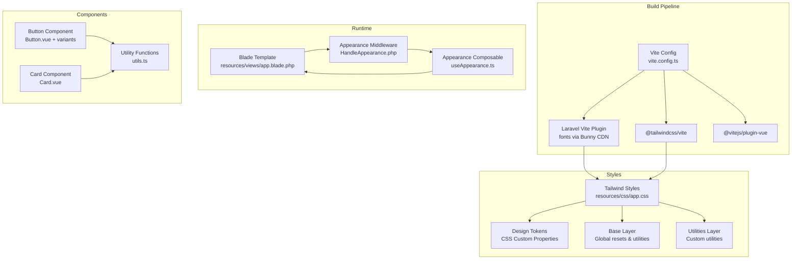
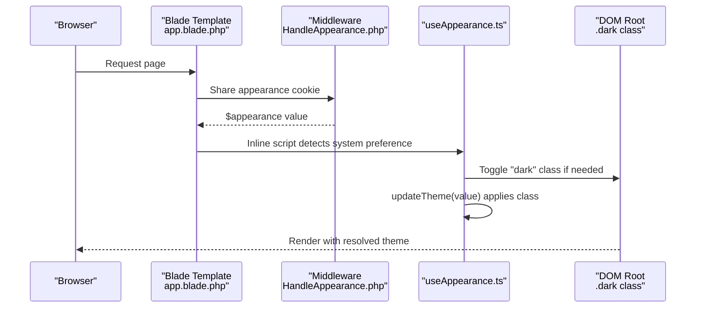
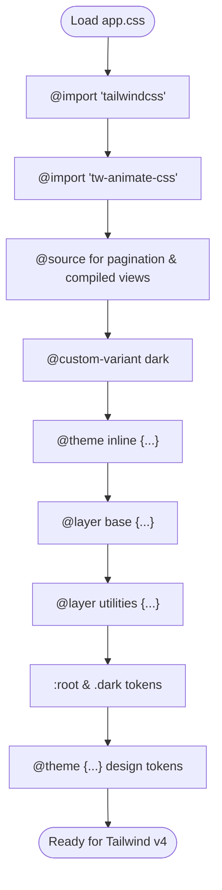
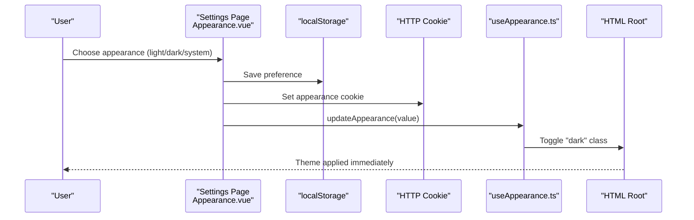
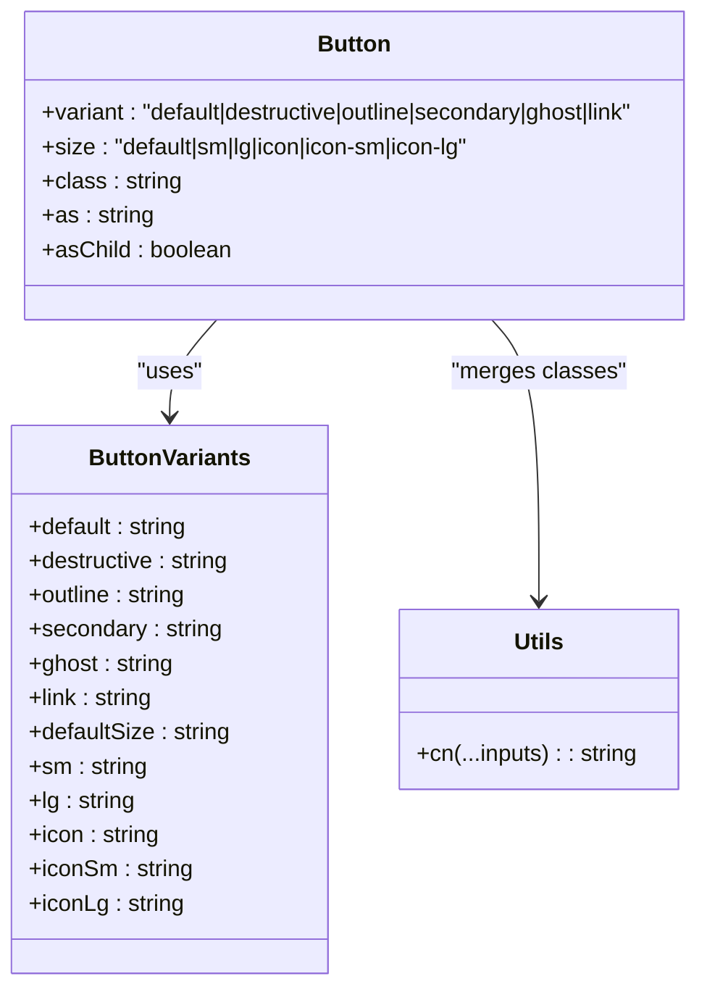
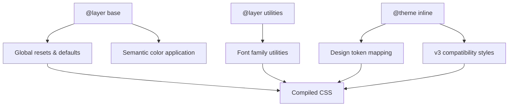
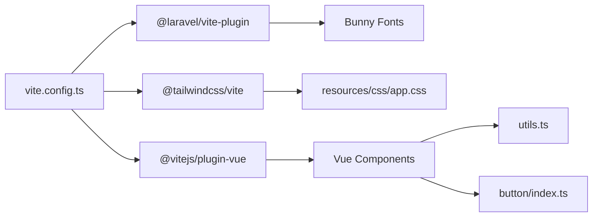

# Styling Architecture & Design System

<cite>
**Referenced Files in This Document**
- [app.css](file://resources/css/app.css)
- [vite.config.ts](file://vite.config.ts)
- [package.json](file://package.json)
- [HandleAppearance.php](file://app/Http/Middleware/HandleAppearance.php)
- [useAppearance.ts](file://resources/js/composables/useAppearance.ts)
- [app.blade.php](file://resources/views/app.blade.php)
- [Button.vue](file://resources/js/components/ui/button/Button.vue)
- [button/index.ts](file://resources/js/components/ui/button/index.ts)
- [Card.vue](file://resources/js/components/ui/card/Card.vue)
- [utils.ts](file://resources/js/lib/utils.ts)
- [ui.ts](file://resources/js/types/ui.ts)
- [AppShell.vue](file://resources/js/components/AppShell.vue)
- [AppLayout.vue](file://resources/js/layouts/AppLayout.vue)
- [Appearance.vue](file://resources/js/pages/settings/Appearance.vue)
- [DESIGN.md](file://DESIGN.md)
</cite>

## Table of Contents
1. [Introduction](#introduction)
2. [Project Structure](#project-structure)
3. [Core Components](#core-components)
4. [Architecture Overview](#architecture-overview)
5. [Detailed Component Analysis](#detailed-component-analysis)
6. [Dependency Analysis](#dependency-analysis)
7. [Performance Considerations](#performance-considerations)
8. [Troubleshooting Guide](#troubleshooting-guide)
9. [Conclusion](#conclusion)

## Introduction
This document describes the styling architecture and design system implementation in SmartRecruit ATS. It covers Tailwind CSS v4 integration, utility-first styling, design token management, theme system with light/dark mode switching, responsive design patterns, component styling conventions, CSS architecture, and custom utility classes. It also documents design system principles, component styling guidelines, accessibility considerations, and performance optimization strategies.

## Project Structure
The styling system is built around a modern Vite-powered asset pipeline with Tailwind CSS v4. Design tokens are centralized in CSS custom properties and Tailwind theme configuration. Vue components encapsulate reusable UI elements with consistent styling patterns. The theme system integrates server-side and client-side preferences for seamless dark/light mode switching.

**Diagram sources**
- [vite.config.ts:1-35](file://vite.config.ts#L1-L35)
- [app.css:1-241](file://resources/css/app.css#L1-L241)
- [app.blade.php:1-48](file://resources/views/app.blade.php#L1-L48)
- [HandleAppearance.php:1-24](file://app/Http/Middleware/HandleAppearance.php#L1-L24)
- [useAppearance.ts:1-125](file://resources/js/composables/useAppearance.ts#L1-L125)
- [Button.vue:1-32](file://resources/js/components/ui/button/Button.vue#L1-L32)
- [button/index.ts:1-39](file://resources/js/components/ui/button/index.ts#L1-L39)
- [Card.vue:1-23](file://resources/js/components/ui/card/Card.vue#L1-L23)
- [utils.ts:1-13](file://resources/js/lib/utils.ts#L1-L13)

**Section sources**
- [vite.config.ts:1-35](file://vite.config.ts#L1-L35)
- [app.css:1-241](file://resources/css/app.css#L1-L241)
- [app.blade.php:1-48](file://resources/views/app.blade.php#L1-L48)
- [HandleAppearance.php:1-24](file://app/Http/Middleware/HandleAppearance.php#L1-L24)
- [useAppearance.ts:1-125](file://resources/js/composables/useAppearance.ts#L1-L125)

## Core Components
- Tailwind CSS v4 integration via the official Vite plugin, enabling modern utility-first styling with design tokens and layered CSS.
- Centralized design tokens defined as CSS custom properties and Tailwind theme variables for consistent color, typography, spacing, radius, and shadow scales.
- Utility-first component composition using class merging utilities and variant systems for buttons and other primitives.
- Dark/light mode theme system combining server-rendered preferences, client-side cookies/localStorage, and media query detection.
- Responsive design patterns leveraging Tailwind utilities and custom spacing tokens.

Key implementation highlights:
- Design tokens and theme variables are declared in the Tailwind stylesheet and theme blocks.
- The base layer applies global resets and establishes default border/input/ring behavior.
- The utilities layer defines font families and other global utilities.
- The appearance system toggles a root class and persists user preferences across sessions.

**Section sources**
- [app.css:10-62](file://resources/css/app.css#L10-L62)
- [app.css:165-172](file://resources/css/app.css#L165-L172)
- [app.css:174-240](file://resources/css/app.css#L174-L240)
- [useAppearance.ts:13-31](file://resources/js/composables/useAppearance.ts#L13-L31)
- [useAppearance.ts:73-84](file://resources/js/composables/useAppearance.ts#L73-L84)

## Architecture Overview
The styling architecture follows a layered approach:
- Build-time: Vite compiles assets, injects fonts, and processes Tailwind directives.
- Runtime: Blade template sets the initial theme state and inline critical styles.
- Theme resolution: Middleware and composable coordinate server/client preferences.
- Component styling: Variants and utility merging ensure consistent, maintainable UI.

**Diagram sources**
- [app.blade.php:1-48](file://resources/views/app.blade.php#L1-L48)
- [HandleAppearance.php:17-22](file://app/Http/Middleware/HandleAppearance.php#L17-L22)
- [useAppearance.ts:13-31](file://resources/js/composables/useAppearance.ts#L13-L31)

## Detailed Component Analysis

### Tailwind CSS v4 Integration and Design Tokens
- The stylesheet imports Tailwind and animation utilities, enables source discovery for pagination and compiled views, and defines a custom dark mode variant.
- A theme block maps CSS variables to Tailwind-compatible tokens for background, foreground, semantic roles, sidebar colors, and chart palettes.
- A base layer ensures consistent border color defaults and applies background/foreground to body.
- Additional theme variables define brand colors, typography scales, spacing units, radii, and shadows.
- Root-level light/dark color tokens provide semantic color definitions for both modes.

**Diagram sources**
- [app.css:1-9](file://resources/css/app.css#L1-L9)
- [app.css:10-62](file://resources/css/app.css#L10-L62)
- [app.css:165-172](file://resources/css/app.css#L165-L172)
- [app.css:174-240](file://resources/css/app.css#L174-L240)
- [app.css:92-163](file://resources/css/app.css#L92-L163)

**Section sources**
- [app.css:1-9](file://resources/css/app.css#L1-L9)
- [app.css:10-62](file://resources/css/app.css#L10-L62)
- [app.css:165-172](file://resources/css/app.css#L165-L172)
- [app.css:174-240](file://resources/css/app.css#L174-L240)
- [app.css:92-163](file://resources/css/app.css#L92-L163)

### Theme System and Dark/Light Mode Switching
- Server-side: A middleware shares the stored appearance cookie with the view layer.
- Client-side: A composable reads stored preferences, subscribes to system theme changes, and updates the DOM root class accordingly.
- Blade template: Applies an initial dark class based on server-provided appearance and includes inline scripts/styles for immediate feedback.

**Diagram sources**
- [Appearance.vue:1-33](file://resources/js/pages/settings/Appearance.vue#L1-L33)
- [useAppearance.ts:107-117](file://resources/js/composables/useAppearance.ts#L107-L117)
- [useAppearance.ts:13-31](file://resources/js/composables/useAppearance.ts#L13-L31)
- [app.blade.php:22-31](file://resources/views/app.blade.php#L22-L31)

**Section sources**
- [HandleAppearance.php:17-22](file://app/Http/Middleware/HandleAppearance.php#L17-L22)
- [useAppearance.ts:86-124](file://resources/js/composables/useAppearance.ts#L86-L124)
- [app.blade.php:1-48](file://resources/views/app.blade.php#L1-L48)

### Component Styling Conventions and Variants
- Buttons use a variant system generated by a class variance authority pattern, enabling consistent sizing and semantic variants with focused, disabled, and icon-aware behaviors.
- Utility merging ensures safe combination of component classes with user-provided overrides.
- Cards and other primitives apply semantic color tokens and maintain consistent spacing and borders.

**Diagram sources**
- [Button.vue:1-32](file://resources/js/components/ui/button/Button.vue#L1-L32)
- [button/index.ts:6-38](file://resources/js/components/ui/button/index.ts#L6-L38)
- [utils.ts:6-8](file://resources/js/lib/utils.ts#L6-L8)

**Section sources**
- [Button.vue:1-32](file://resources/js/components/ui/button/Button.vue#L1-L32)
- [button/index.ts:1-39](file://resources/js/components/ui/button/index.ts#L1-L39)
- [utils.ts:1-13](file://resources/js/lib/utils.ts#L1-L13)

### CSS Architecture and Layering
- Base layer: Establishes global resets and default border/input/ring behavior using semantic CSS variables.
- Utilities layer: Defines font family tokens and other global utilities.
- Theme block: Maps design tokens to Tailwind-compatible variables for consistent color and spacing scales.
- Compatibility: Includes fallback styles to maintain v3-style border defaults under v4.

**Diagram sources**
- [app.css:72-80](file://resources/css/app.css#L72-L80)
- [app.css:82-90](file://resources/css/app.css#L82-L90)
- [app.css:10-62](file://resources/css/app.css#L10-L62)
- [app.css:64-80](file://resources/css/app.css#L64-L80)

**Section sources**
- [app.css:72-80](file://resources/css/app.css#L72-L80)
- [app.css:82-90](file://resources/css/app.css#L82-L90)
- [app.css:10-62](file://resources/css/app.css#L10-L62)

### Responsive Design Patterns
- Typography scales and spacing tokens support responsive typographic hierarchy and consistent spacing across breakpoints.
- Components leverage utility-first classes for responsive layouts and adaptive sizing.
- The design system documentation outlines named spacing units, typography scales, and layout constraints suitable for responsive grids.

**Section sources**
- [app.css:195-214](file://resources/css/app.css#L195-L214)
- [app.css:215-227](file://resources/css/app.css#L215-L227)
- [DESIGN.md:254-429](file://DESIGN.md#L254-L429)

### Accessibility Considerations
- Focus states: Buttons include ring/focus-visible utilities for keyboard navigation visibility.
- Color contrast: Semantic tokens define foreground/background pairs for accessible text and interactive elements.
- Screen reader-friendly markup: Headings and semantic roles are used appropriately in templates and components.

**Section sources**
- [button/index.ts:7](file://resources/js/components/ui/button/index.ts#L7)
- [app.css:20-62](file://resources/css/app.css#L20-L62)

## Dependency Analysis
The styling stack relies on a tight integration between Vite, Tailwind CSS v4, and Vue components. Dependencies include:
- Tailwind CSS v4 and the Vite plugin for build-time processing.
- Reka UI primitives and class variance authority for component variants.
- Tailwind merge and clsx for safe class concatenation.
- Laravel Vite plugin with Bunny CDN for font delivery.

**Diagram sources**
- [vite.config.ts:1-35](file://vite.config.ts#L1-L35)
- [package.json:19-48](file://package.json#L19-L48)
- [app.css:1-241](file://resources/css/app.css#L1-L241)
- [utils.ts:1-13](file://resources/js/lib/utils.ts#L1-L13)
- [button/index.ts:1-39](file://resources/js/components/ui/button/index.ts#L1-L39)

**Section sources**
- [package.json:19-48](file://package.json#L19-L48)
- [vite.config.ts:1-35](file://vite.config.ts#L1-L35)

## Performance Considerations
- Critical path rendering: The Blade template includes inline styles to set background colors based on theme, reducing flash-of-unstyled-content scenarios.
- Asset pipeline: Vite builds optimized bundles with tree-shaking and efficient CSS generation.
- Font loading: Fonts are served via Bunny CDN through the Laravel Vite plugin, improving delivery performance.
- CSS optimization: Tailwind v4’s modular architecture and design tokens minimize unused CSS and enable predictable bundle sizes.

[No sources needed since this section provides general guidance]

## Troubleshooting Guide
Common issues and resolutions:
- Theme not applying on first load: Ensure the appearance cookie is present and the middleware shares it with the view. Verify the inline script runs and toggles the dark class.
- Inconsistent button styles: Confirm variant classes are merged correctly using the utility function and that the variant definition matches component props.
- Missing design tokens: Check that theme variables are defined in the Tailwind theme block and that CSS variables are present in root/dark selectors.

**Section sources**
- [HandleAppearance.php:17-22](file://app/Http/Middleware/HandleAppearance.php#L17-L22)
- [app.blade.php:7-20](file://resources/views/app.blade.php#L7-L20)
- [button/index.ts:6-38](file://resources/js/components/ui/button/index.ts#L6-L38)
- [utils.ts:6-8](file://resources/js/lib/utils.ts#L6-L8)

## Conclusion
SmartRecruit ATS employs a robust, utility-first styling architecture powered by Tailwind CSS v4. Design tokens unify color, typography, spacing, and radii across light and dark themes. The theme system harmonizes server-side and client-side preferences, while Vue components enforce consistent styling through variant systems and utility merging. The build pipeline optimizes asset delivery and critical rendering, ensuring a fast and accessible user experience.