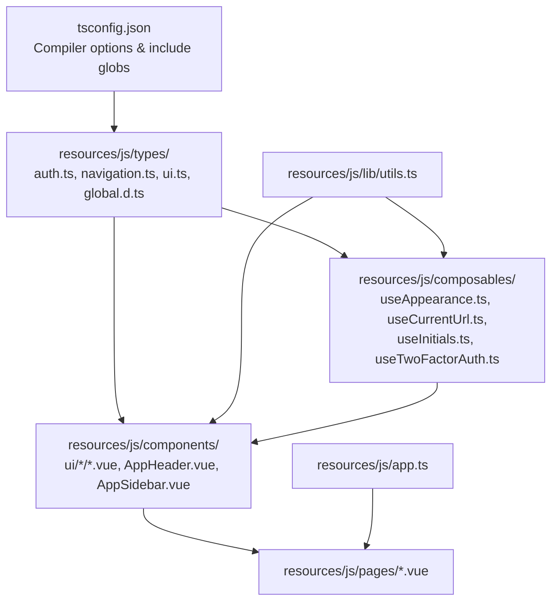
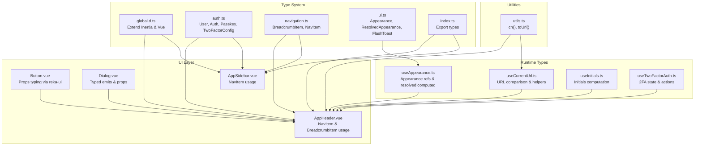
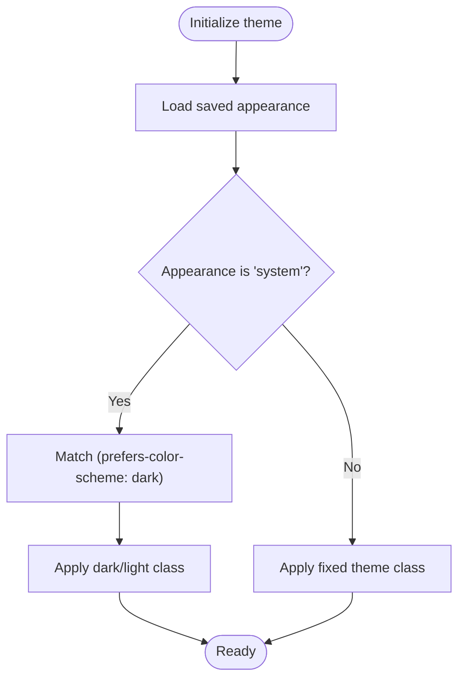
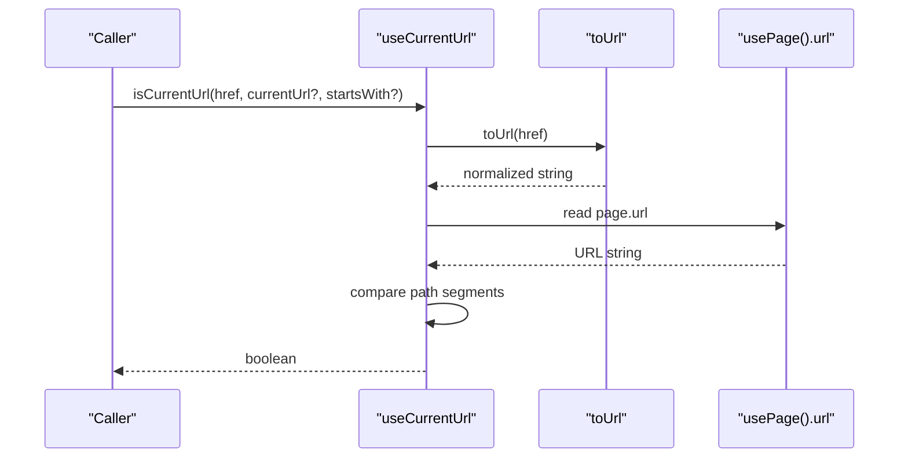
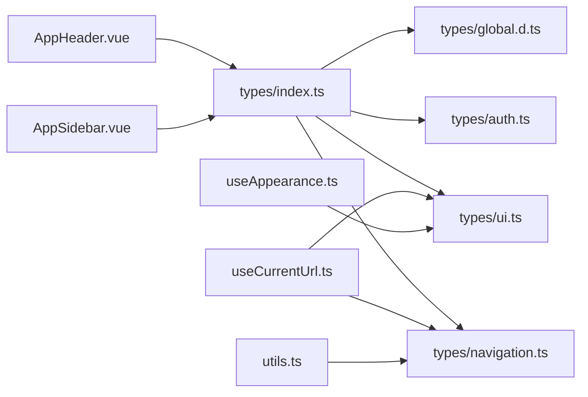

# TypeScript Implementation

<cite>
**Referenced Files in This Document**
- [tsconfig.json](file://tsconfig.json)
- [resources/js/types/global.d.ts](file://resources/js/types/global.d.ts)
- [resources/js/types/index.ts](file://resources/js/types/index.ts)
- [resources/js/types/auth.ts](file://resources/js/types/auth.ts)
- [resources/js/types/navigation.ts](file://resources/js/types/navigation.ts)
- [resources/js/types/ui.ts](file://resources/js/types/ui.ts)
- [resources/js/lib/utils.ts](file://resources/js/lib/utils.ts)
- [resources/js/composables/useAppearance.ts](file://resources/js/composables/useAppearance.ts)
- [resources/js/composables/useCurrentUrl.ts](file://resources/js/composables/useCurrentUrl.ts)
- [resources/js/composables/useInitials.ts](file://resources/js/composables/useInitials.ts)
- [resources/js/composables/useTwoFactorAuth.ts](file://resources/js/composables/useTwoFactorAuth.ts)
- [resources/js/components/ui/button/Button.vue](file://resources/js/components/ui/button/Button.vue)
- [resources/js/components/ui/dialog/Dialog.vue](file://resources/js/components/ui/dialog/Dialog.vue)
- [resources/js/components/AppHeader.vue](file://resources/js/components/AppHeader.vue)
- [resources/js/components/AppSidebar.vue](file://resources/js/components/AppSidebar.vue)
- [resources/js/pages/Dashboard.vue](file://resources/js/pages/Dashboard.vue)
- [resources/js/pages/auth/Login.vue](file://resources/js/pages/auth/Login.vue)
- [resources/js/app.ts](file://resources/js/app.ts)
</cite>

## Table of Contents
1. [Introduction](#introduction)
2. [Project Structure](#project-structure)
3. [Core Components](#core-components)
4. [Architecture Overview](#architecture-overview)
5. [Detailed Component Analysis](#detailed-component-analysis)
6. [Dependency Analysis](#dependency-analysis)
7. [Performance Considerations](#performance-considerations)
8. [Troubleshooting Guide](#troubleshooting-guide)
9. [Conclusion](#conclusion)

## Introduction
This document explains how TypeScript is integrated across the SmartRecruit frontend. It covers the type system implementation, global type definitions, navigation type safety, composable patterns, and UI component typing. It also documents API response typing via Inertia requests, form handling patterns, type inference, generics, and practical best practices for maintaining type safety in a large-scale Vue.js application.

## Project Structure
The TypeScript integration centers around a dedicated types directory, composable functions, UI components, and shared utilities. The build configuration enforces strictness and enables JSX preservation for Vue SFCs.

**Diagram sources**
- [tsconfig.json:119-125](file://tsconfig.json#L119-L125)
- [resources/js/types/index.ts:1-4](file://resources/js/types/index.ts#L1-L4)
- [resources/js/lib/utils.ts:1-13](file://resources/js/lib/utils.ts#L1-L13)
- [resources/js/app.ts:1-34](file://resources/js/app.ts#L1-L34)

**Section sources**
- [tsconfig.json:119-125](file://tsconfig.json#L119-L125)
- [resources/js/types/index.ts:1-4](file://resources/js/types/index.ts#L1-L4)

## Core Components
- Global type definitions extend Inertia and Vue interfaces for shared page props and component custom properties.
- Navigation types define breadcrumb and nav item structures with safe Inertia link href usage.
- UI types define appearance variants and flash toast shapes.
- Utilities centralize class merging and URL normalization helpers.

Key type definitions:
- Shared page props include auth, sidebarOpen, and arbitrary keys.
- Navigation types enforce non-null Inertia link hrefs and optional icon types.
- UI types enumerate appearance and flash toast variants.

**Section sources**
- [resources/js/types/global.d.ts:16-33](file://resources/js/types/global.d.ts#L16-L33)
- [resources/js/types/navigation.ts:1-15](file://resources/js/types/navigation.ts#L1-L15)
- [resources/js/types/ui.ts:1-10](file://resources/js/types/ui.ts#L1-L10)

## Architecture Overview
TypeScript is configured to compile Vue Single File Components with preserved JSX and strict checks. The types directory exposes reusable types consumed by composables and components. Inertia’s page props are augmented with typed auth and shared properties.

**Diagram sources**
- [resources/js/types/global.d.ts:16-33](file://resources/js/types/global.d.ts#L16-L33)
- [resources/js/types/auth.ts:1-32](file://resources/js/types/auth.ts#L1-L32)
- [resources/js/types/navigation.ts:1-15](file://resources/js/types/navigation.ts#L1-L15)
- [resources/js/types/ui.ts:1-10](file://resources/js/types/ui.ts#L1-L10)
- [resources/js/composables/useAppearance.ts:86-124](file://resources/js/composables/useAppearance.ts#L86-L124)
- [resources/js/composables/useCurrentUrl.ts:36-82](file://resources/js/composables/useCurrentUrl.ts#L36-L82)
- [resources/js/composables/useInitials.ts:27-29](file://resources/js/composables/useInitials.ts#L27-L29)
- [resources/js/composables/useTwoFactorAuth.ts:30-112](file://resources/js/composables/useTwoFactorAuth.ts#L30-L112)
- [resources/js/lib/utils.ts:6-12](file://resources/js/lib/utils.ts#L6-L12)
- [resources/js/components/ui/button/Button.vue:1-32](file://resources/js/components/ui/button/Button.vue#L1-L32)
- [resources/js/components/ui/dialog/Dialog.vue:1-20](file://resources/js/components/ui/dialog/Dialog.vue#L1-L20)
- [resources/js/components/AppHeader.vue:41-76](file://resources/js/components/AppHeader.vue#L41-L76)
- [resources/js/components/AppSidebar.vue:18-39](file://resources/js/components/AppSidebar.vue#L18-L39)

## Detailed Component Analysis

### Type System and Global Augmentations
- Inertia config is extended to require a sharedPageProps shape including auth and sidebarOpen.
- Vue component custom properties are augmented to include Inertia-specific page and head manager references.
- Vite’s ImportMetaEnv is extended to strongly type environment variables.

Best practices:
- Keep augmentation modules cohesive and scoped to their domains.
- Prefer explicit types over implicit any for props and emits.

**Section sources**
- [resources/js/types/global.d.ts:4-14](file://resources/js/types/global.d.ts#L4-L14)
- [resources/js/types/global.d.ts:16-25](file://resources/js/types/global.d.ts#L16-L25)
- [resources/js/types/global.d.ts:27-33](file://resources/js/types/global.d.ts#L27-L33)

### Navigation Types and Safe Link Handling
- BreadcrumbItem and NavItem enforce non-null Inertia link hrefs, preventing runtime errors when navigating.
- Optional icon fields accept LucideIcon types for consistent rendering.

Usage patterns:
- Build navigation arrays from typed NavItem definitions.
- Use toUrl helper to normalize href inputs for comparisons.

**Section sources**
- [resources/js/types/navigation.ts:4-14](file://resources/js/types/navigation.ts#L4-L14)
- [resources/js/lib/utils.ts:10-12](file://resources/js/lib/utils.ts#L10-L12)

### Authentication and User Types
- User type defines core identity fields and optional two-factor flags.
- Auth wraps a User and is propagated via Inertia shared props.
- Additional passkey and two-factor configuration types support secure flows.

Type safety tips:
- Treat user-provided fields as possibly partial; avoid unsafe property access.
- Use discriminated unions or guards when handling optional flags.

**Section sources**
- [resources/js/types/auth.ts:1-11](file://resources/js/types/auth.ts#L1-L11)
- [resources/js/types/auth.ts:13-15](file://resources/js/types/auth.ts#L13-L15)
- [resources/js/types/auth.ts:17-25](file://resources/js/types/auth.ts#L17-L25)
- [resources/js/types/auth.ts:27-31](file://resources/js/types/auth.ts#L27-L31)

### UI Types and Variants
- Appearance and ResolvedAppearance enumerate supported themes.
- FlashToast defines toast payload structure for consistent UX.

Integration:
- Use ResolvedAppearance to compute effective theme for DOM classes.
- Use FlashToast to standardize server-to-client notifications.

**Section sources**
- [resources/js/types/ui.ts:1-2](file://resources/js/types/ui.ts#L1-L2)
- [resources/js/types/ui.ts:6-9](file://resources/js/types/ui.ts#L6-L9)

### Composable Functions and Type Inference

#### useAppearance
- Encapsulates theme state with Ref<Appearance> and computed ResolvedAppearance.
- Provides updateAppearance to persist preferences and update DOM classes.
- Uses generics and type guards to handle browser APIs safely.

**Diagram sources**
- [resources/js/composables/useAppearance.ts:73-84](file://resources/js/composables/useAppearance.ts#L73-L84)
- [resources/js/composables/useAppearance.ts:107-117](file://resources/js/composables/useAppearance.ts#L107-L117)

**Section sources**
- [resources/js/composables/useAppearance.ts:86-124](file://resources/js/composables/useAppearance.ts#L86-L124)

#### useCurrentUrl
- Computes current URL from Inertia page.url and normalizes it.
- Provides helpers to test equality, parent-child relations, and conditional rendering.
- Uses generics in whenCurrentUrl to preserve return types.

**Diagram sources**
- [resources/js/composables/useCurrentUrl.ts:36-82](file://resources/js/composables/useCurrentUrl.ts#L36-L82)
- [resources/js/lib/utils.ts:10-12](file://resources/js/lib/utils.ts#L10-L12)

**Section sources**
- [resources/js/composables/useCurrentUrl.ts:7-23](file://resources/js/composables/useCurrentUrl.ts#L7-L23)
- [resources/js/composables/useCurrentUrl.ts:36-82](file://resources/js/composables/useCurrentUrl.ts#L36-L82)

#### useInitials
- Pure function to derive initials from a full name with robust edge-case handling.
- Returns a typed UseInitialsReturn with a getInitials method.

**Section sources**
- [resources/js/composables/useInitials.ts:1-30](file://resources/js/composables/useInitials.ts#L1-L30)

#### useTwoFactorAuth
- Manages QR code SVG, manual setup key, and recovery codes via refs.
- Exposes typed actions to fetch and clear data, with centralized error accumulation.
- Uses Promise.all for concurrent fetches and guarded assignments.

**Section sources**
- [resources/js/composables/useTwoFactorAuth.ts:6-19](file://resources/js/composables/useTwoFactorAuth.ts#L6-L19)
- [resources/js/composables/useTwoFactorAuth.ts:30-112](file://resources/js/composables/useTwoFactorAuth.ts#L30-L112)

### UI Components and Generic Typing

#### Button.vue
- Props interface extends primitive props and accepts variant/size/class overrides.
- Uses cn() and buttonVariants for consistent styling while preserving type safety.

**Section sources**
- [resources/js/components/ui/button/Button.vue:9-17](file://resources/js/components/ui/button/Button.vue#L9-L17)

#### Dialog.vue
- Uses reka-ui’s DialogRootProps and DialogRootEmits to maintain prop/emits fidelity.
- Forwards props and emits to preserve typing across slots.

**Section sources**
- [resources/js/components/ui/dialog/Dialog.vue:5-8](file://resources/js/components/ui/dialog/Dialog.vue#L5-L8)

### Pages and Forms

#### Dashboard.vue
- Demonstrates typed defineOptions with layout breadcrumbs containing typed BreadcrumbItem entries.

**Section sources**
- [resources/js/pages/Dashboard.vue:6-15](file://resources/js/pages/Dashboard.vue#L6-L15)

#### Login.vue
- Uses defineProps with explicit types for status and canResetPassword.
- Integrates Form from Inertia with typed slot props for errors and processing state.

**Section sources**
- [resources/js/pages/auth/Login.vue:23-26](file://resources/js/pages/auth/Login.vue#L23-L26)
- [resources/js/pages/auth/Login.vue:44-45](file://resources/js/pages/auth/Login.vue#L44-L45)

### Header and Sidebar Navigation
- AppHeader.vue consumes typed BreadcrumbItem and NavItem arrays to render navigation and breadcrumbs.
- AppSidebar.vue builds NavItem lists for main and footer navigation.

**Section sources**
- [resources/js/components/AppHeader.vue:41-76](file://resources/js/components/AppHeader.vue#L41-L76)
- [resources/js/components/AppSidebar.vue:18-39](file://resources/js/components/AppSidebar.vue#L18-L39)

## Dependency Analysis
The type system is intentionally decoupled from implementation details. Components import types from a single barrel export, enabling centralized maintenance.

**Diagram sources**
- [resources/js/types/index.ts:1-4](file://resources/js/types/index.ts#L1-L4)
- [resources/js/components/AppHeader.vue:39-40](file://resources/js/components/AppHeader.vue#L39-L40)
- [resources/js/components/AppSidebar.vue:18](file://resources/js/components/AppSidebar.vue#L18)
- [resources/js/composables/useCurrentUrl.ts:1-5](file://resources/js/composables/useCurrentUrl.ts#L1-L5)
- [resources/js/composables/useAppearance.ts:3](file://resources/js/composables/useAppearance.ts#L3)
- [resources/js/lib/utils.ts:1](file://resources/js/lib/utils.ts#L1)

**Section sources**
- [resources/js/types/index.ts:1-4](file://resources/js/types/index.ts#L1-L4)

## Performance Considerations
- Strict mode and isolated modules improve correctness and enable faster rebuilds.
- Using readonly and computed for derived state avoids unnecessary reactivity overhead.
- Centralized utilities reduce duplication and keep hot paths small.

[No sources needed since this section provides general guidance]

## Troubleshooting Guide
Common pitfalls and remedies:
- Inertia page props typing: Ensure sharedPageProps includes required fields; otherwise, access to page.props.auth will fail at compile-time.
- Non-null href assumptions: Always use NonNullable<InertiaLinkProps['href']> in typed navigation structures to prevent runtime errors.
- Generic inference: When using generics in helpers, specify return types explicitly if inference fails.
- Environment variables: Rely on ImportMetaEnv augmentations to avoid casting strings to booleans or numbers.

**Section sources**
- [resources/js/types/global.d.ts:16-25](file://resources/js/types/global.d.ts#L16-L25)
- [resources/js/types/navigation.ts:6, 11](file://resources/js/types/navigation.ts#L6,L11)
- [resources/js/types/global.d.ts:4-14](file://resources/js/types/global.d.ts#L4-L14)

## Conclusion
SmartRecruit’s TypeScript integration emphasizes strong typing across the type system, composables, and UI components. By leveraging global augmentations, reusable types, and strict compiler options, the application maintains reliability and developer productivity. Following the patterns documented here ensures consistent type safety across forms, navigation, and API interactions.