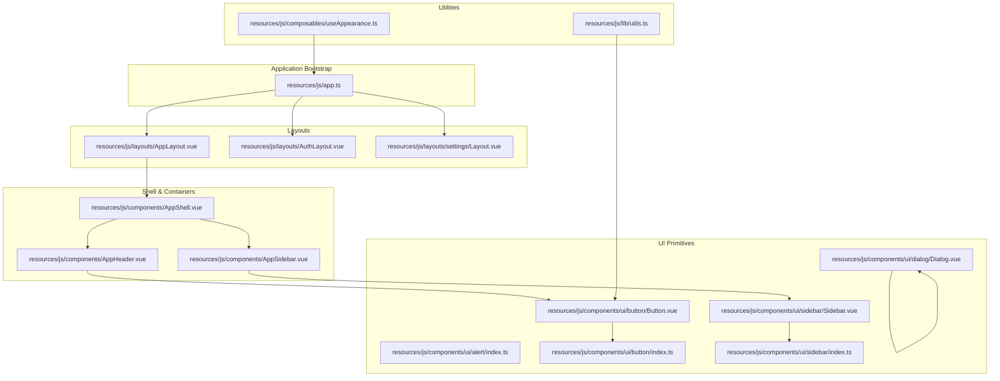
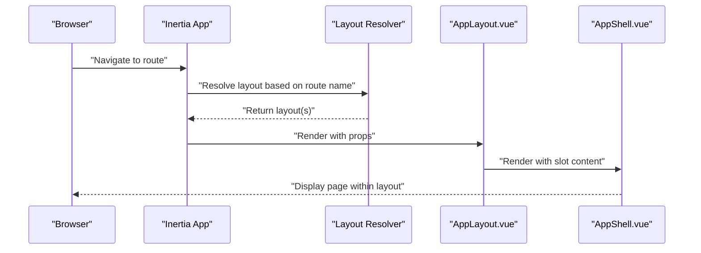
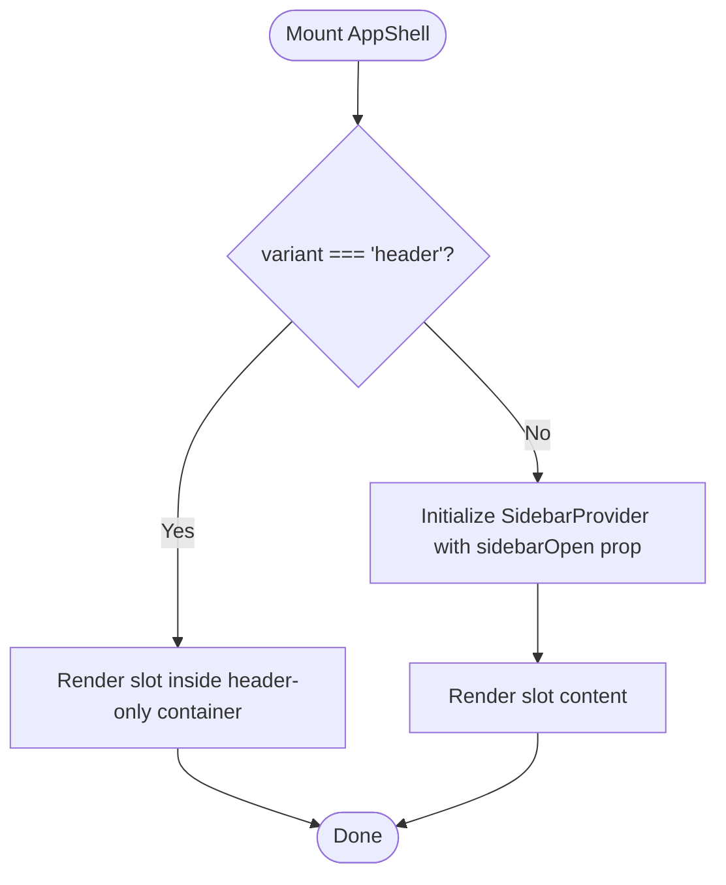
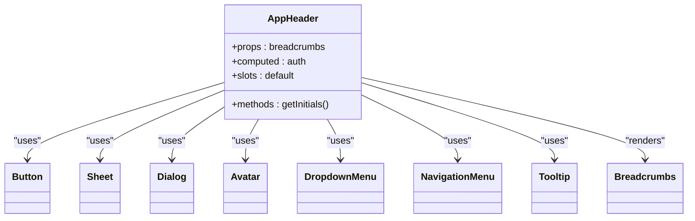
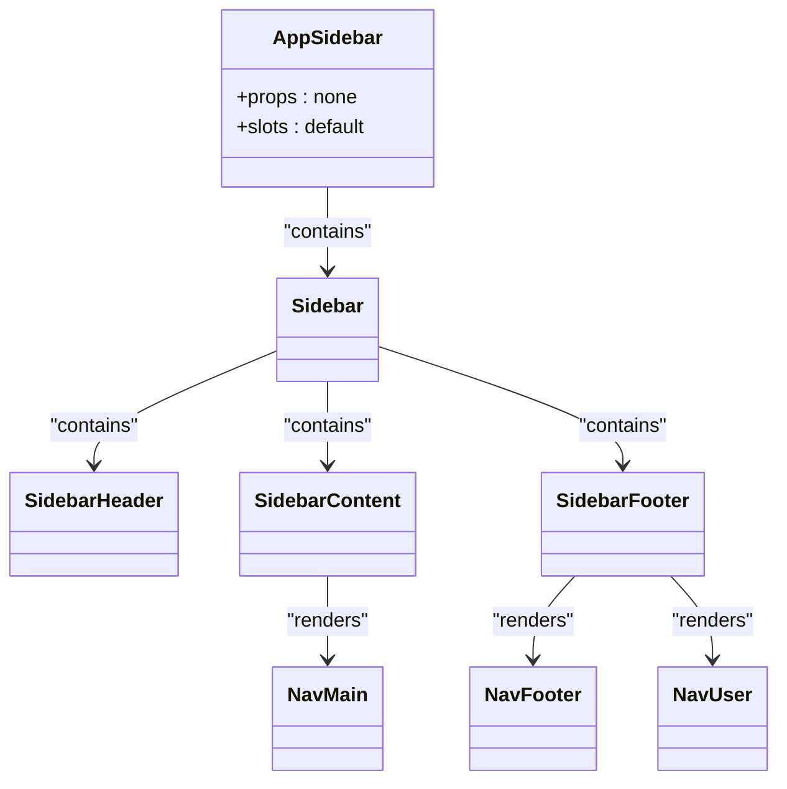
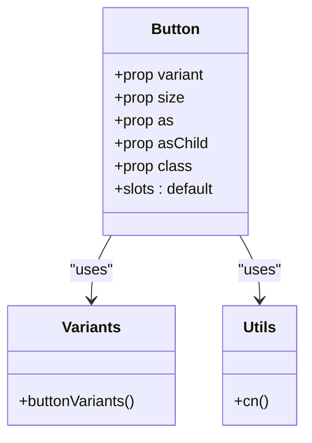
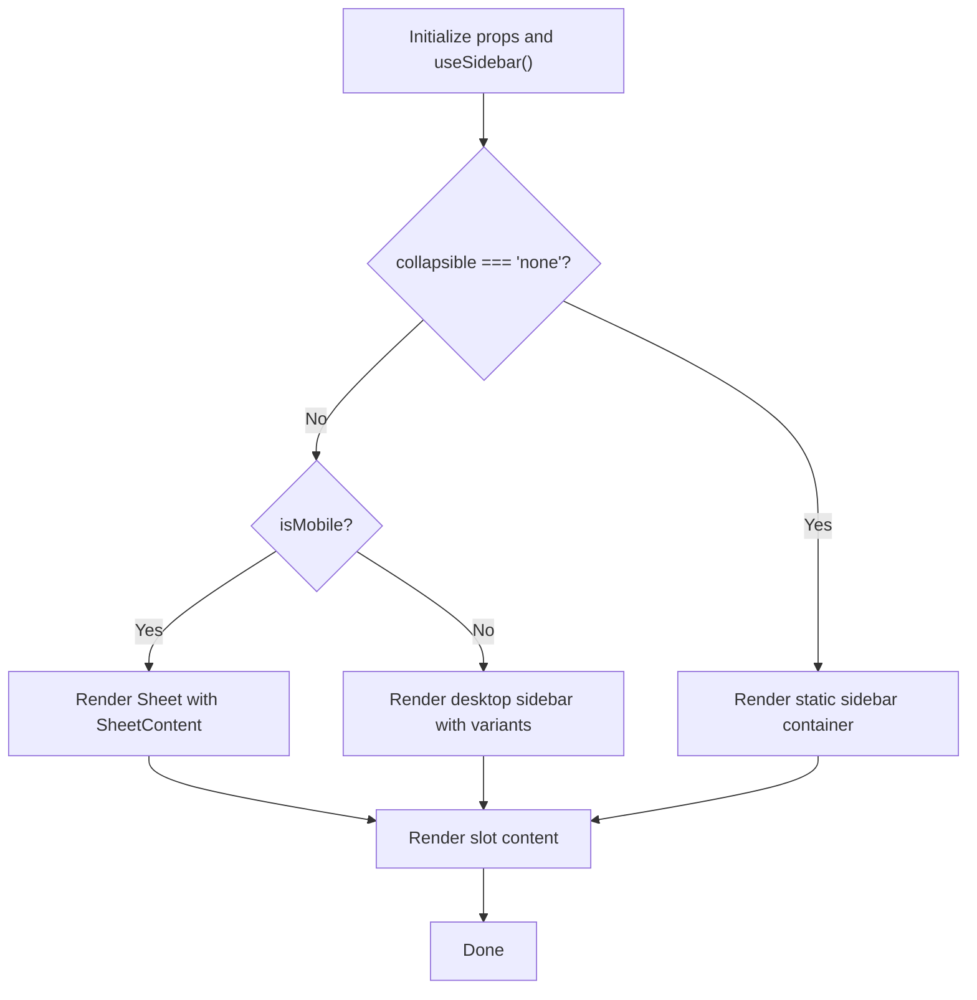
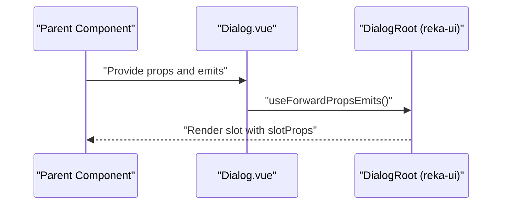
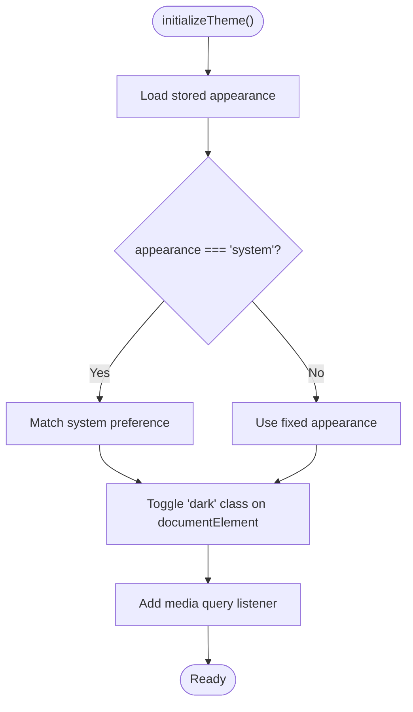
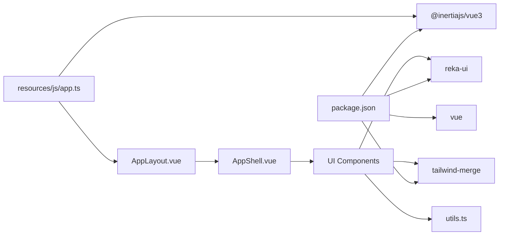

# Vue.js Component System

<cite>
**Referenced Files in This Document**
- [app.ts](file://resources/js/app.ts)
- [AppShell.vue](file://resources/js/components/AppShell.vue)
- [AppLayout.vue](file://resources/js/layouts/AppLayout.vue)
- [package.json](file://package.json)
- [alert/index.ts](file://resources/js/components/ui/alert/index.ts)
- [button/index.ts](file://resources/js/components/ui/button/index.ts)
- [sidebar/index.ts](file://resources/js/components/ui/sidebar/index.ts)
- [useAppearance.ts](file://resources/js/composables/useAppearance.ts)
- [utils.ts](file://resources/js/lib/utils.ts)
- [button/Button.vue](file://resources/js/components/ui/button/Button.vue)
- [sidebar/Sidebar.vue](file://resources/js/components/ui/sidebar/Sidebar.vue)
- [dialog/Dialog.vue](file://resources/js/components/ui/dialog/Dialog.vue)
- [AppHeader.vue](file://resources/js/components/AppHeader.vue)
- [AppSidebar.vue](file://resources/js/components/AppSidebar.vue)
</cite>

## Table of Contents
1. [Introduction](#introduction)
2. [Project Structure](#project-structure)
3. [Core Components](#core-components)
4. [Architecture Overview](#architecture-overview)
5. [Detailed Component Analysis](#detailed-component-analysis)
6. [Dependency Analysis](#dependency-analysis)
7. [Performance Considerations](#performance-considerations)
8. [Troubleshooting Guide](#troubleshooting-guide)
9. [Conclusion](#conclusion)

## Introduction
This document describes the Vue.js 3 component system powering SmartRecruit ATS. It covers the component hierarchy, reusable UI components, layout structures, page-level components, composition patterns, prop interfaces, event handling, slots, registration mechanisms, and integration with the broader Laravel and Inertia.js application architecture. The system emphasizes composability, theme-awareness, and responsive behavior through a cohesive set of UI primitives and layout containers.

## Project Structure
The frontend is organized around three primary layers:
- Components: Reusable UI primitives and composite components under resources/js/components
- Layouts: Page-level layout containers under resources/js/layouts
- Pages: Route-driven page components under resources/js/pages

Key architectural files:
- Application bootstrapping and layout selection via Inertia.js
- Theme initialization and appearance management
- Utility functions for class merging and URL normalization
- UI component libraries and variant systems

**Diagram sources**
- [app.ts:10-27](file://resources/js/app.ts#L10-L27)
- [AppLayout.vue:1-15](file://resources/js/layouts/AppLayout.vue#L1-L15)
- [AppShell.vue:1-25](file://resources/js/components/AppShell.vue#L1-L25)
- [AppHeader.vue:1-284](file://resources/js/components/AppHeader.vue#L1-L284)
- [AppSidebar.vue:1-67](file://resources/js/components/AppSidebar.vue#L1-L67)
- [button/Button.vue:1-32](file://resources/js/components/ui/button/Button.vue#L1-L32)
- [sidebar/Sidebar.vue:1-97](file://resources/js/components/ui/sidebar/Sidebar.vue#L1-L97)
- [dialog/Dialog.vue:1-20](file://resources/js/components/ui/dialog/Dialog.vue#L1-L20)
- [alert/index.ts:1-25](file://resources/js/components/ui/alert/index.ts#L1-L25)
- [button/index.ts:1-39](file://resources/js/components/ui/button/index.ts#L1-L39)
- [sidebar/index.ts:1-61](file://resources/js/components/ui/sidebar/index.ts#L1-L61)
- [useAppearance.ts:73-84](file://resources/js/composables/useAppearance.ts#L73-L84)
- [utils.ts:6-13](file://resources/js/lib/utils.ts#L6-L13)

**Section sources**
- [app.ts:1-34](file://resources/js/app.ts#L1-L34)
- [AppLayout.vue:1-15](file://resources/js/layouts/AppLayout.vue#L1-L15)
- [AppShell.vue:1-25](file://resources/js/components/AppShell.vue#L1-L25)
- [AppHeader.vue:1-284](file://resources/js/components/AppHeader.vue#L1-L284)
- [AppSidebar.vue:1-67](file://resources/js/components/AppSidebar.vue#L1-L67)
- [button/Button.vue:1-32](file://resources/js/components/ui/button/Button.vue#L1-L32)
- [sidebar/Sidebar.vue:1-97](file://resources/js/components/ui/sidebar/Sidebar.vue#L1-L97)
- [dialog/Dialog.vue:1-20](file://resources/js/components/ui/dialog/Dialog.vue#L1-L20)
- [alert/index.ts:1-25](file://resources/js/components/ui/alert/index.ts#L1-L25)
- [button/index.ts:1-39](file://resources/js/components/ui/button/index.ts#L1-L39)
- [sidebar/index.ts:1-61](file://resources/js/components/ui/sidebar/index.ts#L1-L61)
- [useAppearance.ts:73-84](file://resources/js/composables/useAppearance.ts#L73-L84)
- [utils.ts:6-13](file://resources/js/lib/utils.ts#L6-L13)

## Core Components
This section documents the foundational building blocks of the component system.

- AppShell: A container that switches between header-only and sidebar-provided layouts based on variant prop, integrating with the sidebar provider and reading initial sidebar state from the page props.
- AppHeader: A responsive navigation bar featuring mobile sheet menus, desktop navigation, tooltips, and user dropdown menus, composed from UI primitives.
- AppSidebar: A sidebar container built from modular sidebar components, housing main navigation, footer links, and user info.
- UI Button: A variant-rich primitive using class variance authority for size and variant combinations, forwarding attributes to a base primitive.
- UI Sidebar: A responsive sidebar supporting multiple variants and collapsible modes, delegating behavior to a composable and rendering different markup for mobile vs. desktop.
- UI Dialog: A thin wrapper around a third-party dialog primitive, forwarding props and emits.
- Alert Module: A collection of alert-related components and a variant system for alert styling.
- Appearance Composable: Manages theme initialization, updates, and persistence across client and server contexts.
- Utilities: Tailwind class merging and URL normalization helpers.

**Section sources**
- [AppShell.vue:1-25](file://resources/js/components/AppShell.vue#L1-L25)
- [AppHeader.vue:1-284](file://resources/js/components/AppHeader.vue#L1-L284)
- [AppSidebar.vue:1-67](file://resources/js/components/AppSidebar.vue#L1-L67)
- [button/Button.vue:1-32](file://resources/js/components/ui/button/Button.vue#L1-L32)
- [sidebar/Sidebar.vue:1-97](file://resources/js/components/ui/sidebar/Sidebar.vue#L1-L97)
- [dialog/Dialog.vue:1-20](file://resources/js/components/ui/dialog/Dialog.vue#L1-L20)
- [alert/index.ts:1-25](file://resources/js/components/ui/alert/index.ts#L1-L25)
- [useAppearance.ts:73-84](file://resources/js/composables/useAppearance.ts#L73-L84)
- [utils.ts:6-13](file://resources/js/lib/utils.ts#L6-L13)

## Architecture Overview
The component system integrates with Inertia.js for page transitions and layout selection. The application bootstrapper configures the title, layout resolution, and progress indicators. Layouts wrap page content and provide consistent shell structure. UI primitives encapsulate styling and behavior, while composables manage cross-cutting concerns like theming.

**Diagram sources**
- [app.ts:10-27](file://resources/js/app.ts#L10-L27)
- [AppLayout.vue:1-15](file://resources/js/layouts/AppLayout.vue#L1-L15)
- [AppShell.vue:17-24](file://resources/js/components/AppShell.vue#L17-L24)

## Detailed Component Analysis

### AppShell Component
AppShell conditionally renders either a header-only layout or a full sidebar-provided layout based on the variant prop. It reads the initial sidebar open state from the page props and passes it to the sidebar provider for consistent hydration.

**Diagram sources**
- [AppShell.vue:17-24](file://resources/js/components/AppShell.vue#L17-L24)

**Section sources**
- [AppShell.vue:1-25](file://resources/js/components/AppShell.vue#L1-L25)

### AppHeader Component
AppHeader composes multiple UI primitives to form a responsive navigation bar:
- Mobile: Sheet with trigger and content containing navigation items and external links
- Desktop: NavigationMenu with active state indicators
- User area: DropdownMenu with avatar fallback and initials
- Tooltips: TooltipProvider and TooltipTrigger for contextual help
- Breadcrumbs: Optional second row for breadcrumb navigation

**Diagram sources**
- [AppHeader.vue:1-284](file://resources/js/components/AppHeader.vue#L1-L284)
- [button/Button.vue:1-32](file://resources/js/components/ui/button/Button.vue#L1-L32)
- [sidebar/Sidebar.vue:1-97](file://resources/js/components/ui/sidebar/Sidebar.vue#L1-L97)

**Section sources**
- [AppHeader.vue:1-284](file://resources/js/components/AppHeader.vue#L1-L284)

### AppSidebar Component
AppSidebar builds a sidebar using modular UI components:
- Sidebar with inset variant and icon collapsible mode
- SidebarHeader containing the logo link
- SidebarContent hosting main navigation
- SidebarFooter hosting footer links, user info, and a user menu

**Diagram sources**
- [AppSidebar.vue:1-67](file://resources/js/components/AppSidebar.vue#L1-L67)
- [sidebar/Sidebar.vue:1-97](file://resources/js/components/ui/sidebar/Sidebar.vue#L1-L97)

**Section sources**
- [AppSidebar.vue:1-67](file://resources/js/components/AppSidebar.vue#L1-L67)

### UI Button Component
The Button component demonstrates a variant-driven design pattern:
- Accepts variant and size props mapped to a variant system
- Uses a utility function to merge Tailwind classes
- Forwards attributes to a base primitive for semantic correctness
- Supports custom element types via the as prop

**Diagram sources**
- [button/Button.vue:1-32](file://resources/js/components/ui/button/Button.vue#L1-L32)
- [button/index.ts:6-38](file://resources/js/components/ui/button/index.ts#L6-L38)
- [utils.ts:6-8](file://resources/js/lib/utils.ts#L6-L8)

**Section sources**
- [button/Button.vue:1-32](file://resources/js/components/ui/button/Button.vue#L1-L32)
- [button/index.ts:1-39](file://resources/js/components/ui/button/index.ts#L1-L39)
- [utils.ts:6-13](file://resources/js/lib/utils.ts#L6-L13)

### UI Sidebar Component
The Sidebar component showcases responsive behavior and composition:
- Uses a composable for state and behavior
- Renders different markup for mobile (Sheet) and desktop
- Applies dynamic classes based on props and state
- Forwards non-root attributes to maintain flexibility

**Diagram sources**
- [sidebar/Sidebar.vue:14-20](file://resources/js/components/ui/sidebar/Sidebar.vue#L14-L20)
- [sidebar/Sidebar.vue:33-52](file://resources/js/components/ui/sidebar/Sidebar.vue#L33-L52)
- [sidebar/Sidebar.vue:54-95](file://resources/js/components/ui/sidebar/Sidebar.vue#L54-L95)

**Section sources**
- [sidebar/Sidebar.vue:1-97](file://resources/js/components/ui/sidebar/Sidebar.vue#L1-L97)
- [sidebar/index.ts:1-61](file://resources/js/components/ui/sidebar/index.ts#L1-L61)

### UI Dialog Component
The Dialog component wraps a third-party primitive, forwarding props and emits to preserve behavior and typing.

**Diagram sources**
- [dialog/Dialog.vue:1-20](file://resources/js/components/ui/dialog/Dialog.vue#L1-L20)

**Section sources**
- [dialog/Dialog.vue:1-20](file://resources/js/components/ui/dialog/Dialog.vue#L1-L20)

### Theme and Appearance Management
The appearance composable manages theme initialization, updates, and persistence:
- Initializes theme on mount based on stored preferences or system preference
- Listens to system theme changes and updates accordingly
- Persists user choices in local storage and cookies for SSR compatibility
- Provides reactive resolved appearance for downstream consumers

**Diagram sources**
- [useAppearance.ts:73-84](file://resources/js/composables/useAppearance.ts#L73-L84)
- [useAppearance.ts:107-117](file://resources/js/composables/useAppearance.ts#L107-L117)

**Section sources**
- [useAppearance.ts:1-125](file://resources/js/composables/useAppearance.ts#L1-L125)

## Dependency Analysis
The component system relies on several key dependencies and patterns:
- Inertia.js for page transitions and layout resolution
- Reka UI primitives for accessible, composable components
- Tailwind CSS with class merging utilities for styling
- Composition API for shared logic and state

**Diagram sources**
- [package.json:36-51](file://package.json#L36-L51)
- [app.ts:1-34](file://resources/js/app.ts#L1-L34)
- [AppLayout.vue:1-15](file://resources/js/layouts/AppLayout.vue#L1-L15)
- [AppShell.vue:1-25](file://resources/js/components/AppShell.vue#L1-L25)
- [utils.ts:6-8](file://resources/js/lib/utils.ts#L6-L8)

**Section sources**
- [package.json:1-62](file://package.json#L1-L62)
- [app.ts:1-34](file://resources/js/app.ts#L1-L34)

## Performance Considerations
- Prefer variant-driven components (e.g., Button) to minimize duplication and reduce bundle size.
- Use responsive variants and conditional rendering (e.g., Sidebar) to avoid unnecessary DOM nodes on different screen sizes.
- Leverage class merging utilities to keep styles efficient and avoid cascade conflicts.
- Keep composables focused and memoized where appropriate to prevent unnecessary re-renders.
- Use lazy loading for heavy components and defer non-critical features until after initial render.

## Troubleshooting Guide
- Layout not applying: Verify layout resolver logic in the application bootstrapper and ensure route names match expected prefixes.
- Theme not persisting: Confirm local storage and cookie handling in the appearance composable and check media query listeners.
- Styles not merging: Ensure class merging utilities are used consistently and Tailwind variants are configured properly.
- Responsive sidebar issues: Check the sidebar composable state and ensure attributes are forwarded correctly.

**Section sources**
- [app.ts:10-27](file://resources/js/app.ts#L10-L27)
- [useAppearance.ts:107-117](file://resources/js/composables/useAppearance.ts#L107-L117)
- [utils.ts:6-8](file://resources/js/lib/utils.ts#L6-L8)
- [sidebar/Sidebar.vue:10-12](file://resources/js/components/ui/sidebar/Sidebar.vue#L10-L12)

## Conclusion
SmartRecruit ATS employs a robust Vue.js 3 component system centered on reusable UI primitives, responsive layout containers, and composable utilities. The architecture leverages Inertia.js for seamless navigation, variant-driven styling for consistency, and a composable theme manager for user preferences. This design promotes maintainability, scalability, and a consistent user experience across devices and pages.