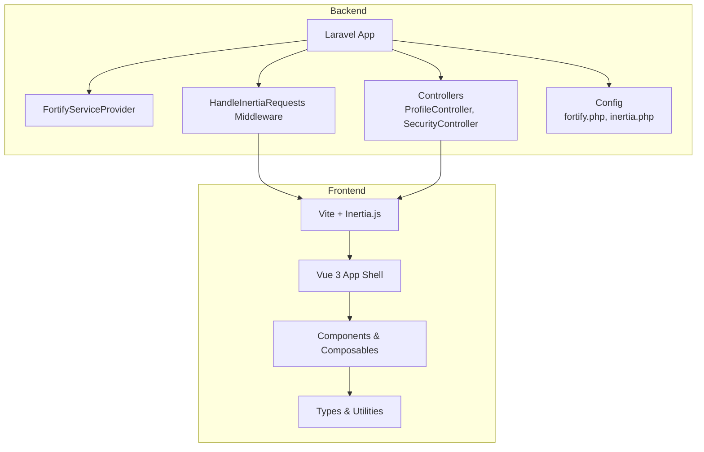
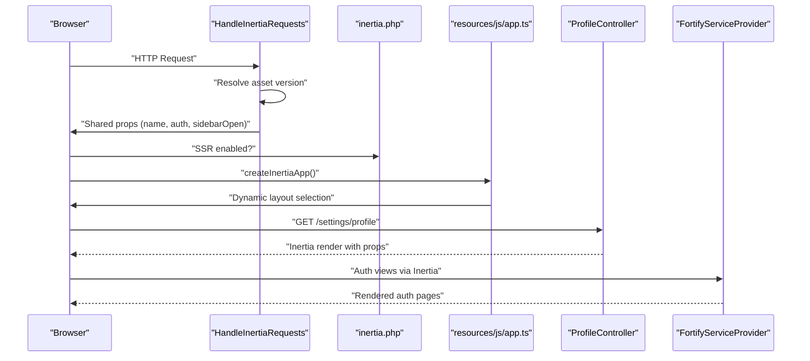
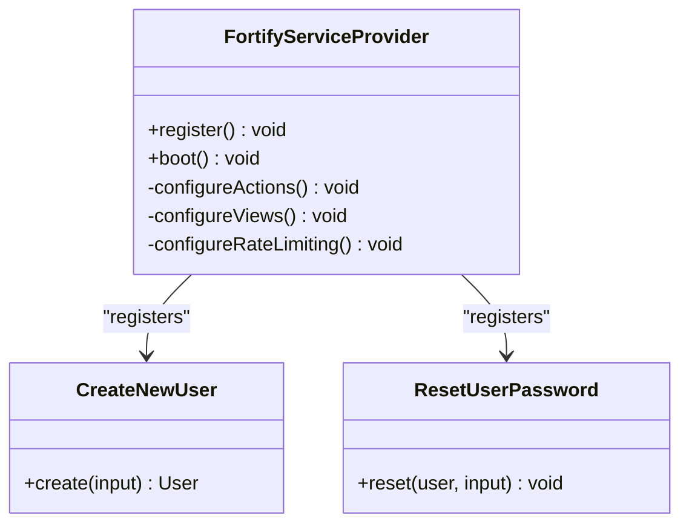
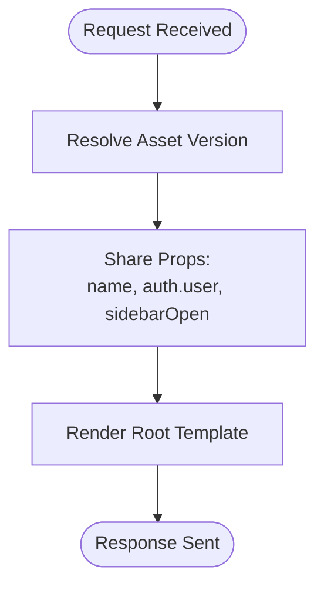
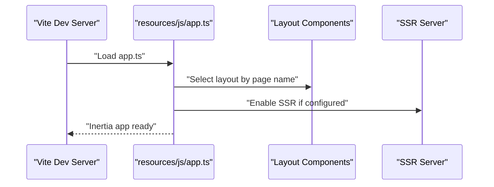
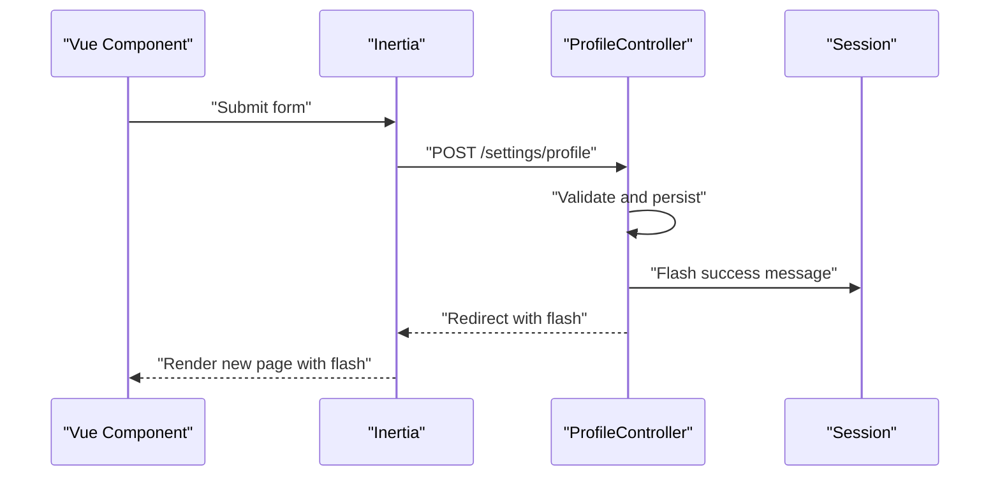
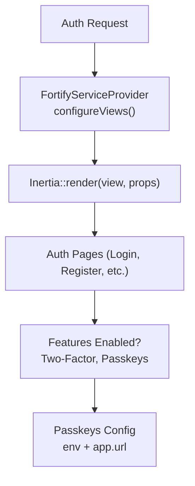
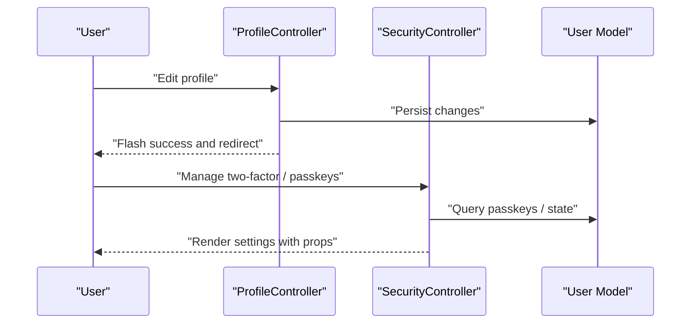
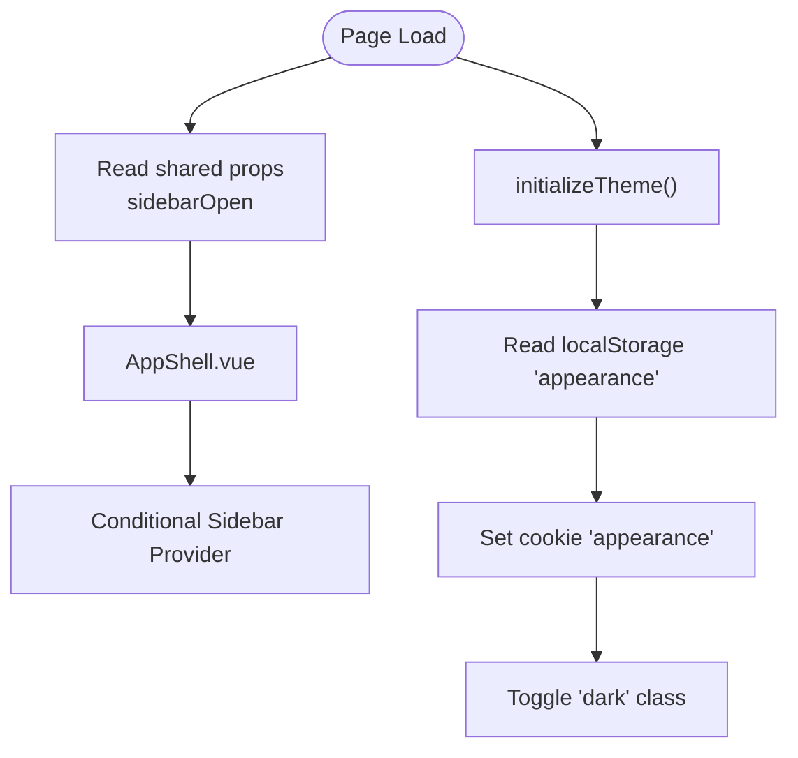
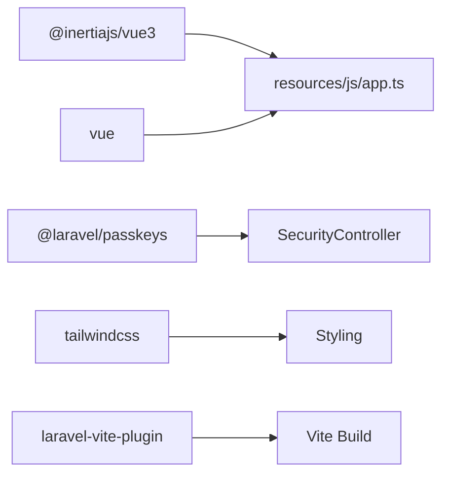

# Integration Patterns

<cite>
**Referenced Files in This Document**
- [FortifyServiceProvider.php](file://app/Providers/FortifyServiceProvider.php)
- [fortify.php](file://config/fortify.php)
- [HandleInertiaRequests.php](file://app/Http/Middleware/HandleInertiaRequests.php)
- [inertia.php](file://config/inertia.php)
- [app.ts](file://resources/js/app.ts)
- [CreateNewUser.php](file://app/Actions/Fortify/CreateNewUser.php)
- [ResetUserPassword.php](file://app/Actions/Fortify/ResetUserPassword.php)
- [ProfileController.php](file://app/Http/Controllers/Settings/ProfileController.php)
- [SecurityController.php](file://app/Http/Controllers/Settings/SecurityController.php)
- [web.php](file://routes/web.php)
- [AppShell.vue](file://resources/js/components/AppShell.vue)
- [useAppearance.ts](file://resources/js/composables/useAppearance.ts)
- [utils.ts](file://resources/js/lib/utils.ts)
- [global.d.ts](file://resources/js/types/global.d.ts)
- [package.json](file://package.json)
</cite>

## Table of Contents
1. [Introduction](#introduction)
2. [Project Structure](#project-structure)
3. [Core Components](#core-components)
4. [Architecture Overview](#architecture-overview)
5. [Detailed Component Analysis](#detailed-component-analysis)
6. [Dependency Analysis](#dependency-analysis)
7. [Performance Considerations](#performance-considerations)
8. [Troubleshooting Guide](#troubleshooting-guide)
9. [Conclusion](#conclusion)
10. [Appendices](#appendices)

## Introduction
This document describes the integration patterns for the SmartRecruit ATS system with a focus on:
- Laravel Fortify authentication services and service provider registration
- Middleware integration for Inertia.js shared state and request handling
- Frontend-backend communication via Inertia.js and Vue.js components
- Prop passing, event handling, and data synchronization between Vue components and Laravel controllers
- Third-party service integrations, API communication patterns, and external dependency management
- Configuration management, environment variables, and deployment-specific considerations
- Testing integration patterns, mock implementations, and development workflow integration

## Project Structure
The system follows a layered architecture:
- Backend: Laravel application with Fortify for authentication, Inertia middleware for SSR and shared data, controllers for domain logic, and service providers for bootstrapping
- Frontend: Vue 3 SPA with Inertia.js for seamless page navigation, TypeScript types, composables for cross-cutting concerns, and TailwindCSS for styling
- Routing: Web routes define application pages and resource endpoints; settings routes are grouped separately

**Diagram sources**
- [FortifyServiceProvider.php:17-35](file://app/Providers/FortifyServiceProvider.php#L17-L35)
- [HandleInertiaRequests.php:8-47](file://app/Http/Middleware/HandleInertiaRequests.php#L8-L47)
- [ProfileController.php:15-62](file://app/Http/Controllers/Settings/ProfileController.php#L15-L62)
- [SecurityController.php:14-66](file://app/Http/Controllers/Settings/SecurityController.php#L14-L66)
- [app.ts:10-27](file://resources/js/app.ts#L10-L27)

**Section sources**
- [web.php:1-32](file://routes/web.php#L1-L32)
- [app.ts:1-34](file://resources/js/app.ts#L1-L34)

## Core Components
- FortifyServiceProvider: Registers and boots Fortify actions, views, and rate limiters; integrates with Inertia for view rendering
- HandleInertiaRequests: Defines root template, asset versioning, and shared props (application name, auth.user, sidebarOpen)
- Inertia configuration: Controls SSR, page discovery paths, and testing behavior
- Vue app initialization: Bootstraps Inertia with dynamic layouts, progress bar, and theme/flash initialization
- Controllers: Serve Inertia pages and manage user settings updates; leverage request validation and flash messaging
- Frontend composables: Provide appearance management and utility helpers for consistent UI behavior

**Section sources**
- [FortifyServiceProvider.php:30-99](file://app/Providers/FortifyServiceProvider.php#L30-L99)
- [HandleInertiaRequests.php:24-46](file://app/Http/Middleware/HandleInertiaRequests.php#L24-L46)
- [inertia.php:18-51](file://config/inertia.php#L18-L51)
- [app.ts:10-27](file://resources/js/app.ts#L10-L27)
- [ProfileController.php:20-61](file://app/Http/Controllers/Settings/ProfileController.php#L20-L61)
- [SecurityController.php:19-65](file://app/Http/Controllers/Settings/SecurityController.php#L19-L65)

## Architecture Overview
The integration architecture centers on Inertia.js enabling full-stack-like development:
- Laravel renders initial pages and shared data via middleware
- Vue components consume shared props and navigate seamlessly with Inertia
- Fortify handles authentication flows and integrates with Inertia views
- Controllers coordinate domain logic and return Inertia responses or redirects

**Diagram sources**
- [HandleInertiaRequests.php:24-46](file://app/Http/Middleware/HandleInertiaRequests.php#L24-L46)
- [inertia.php:18-23](file://config/inertia.php#L18-L23)
- [app.ts:10-27](file://resources/js/app.ts#L10-L27)
- [ProfileController.php:20-26](file://app/Http/Controllers/Settings/ProfileController.php#L20-L26)
- [FortifyServiceProvider.php:51-77](file://app/Providers/FortifyServiceProvider.php#L51-L77)

## Detailed Component Analysis

### Laravel Fortify Integration
Fortify is configured via a dedicated service provider that:
- Registers custom actions for user creation and password resets
- Provides Inertia-based views for login, registration, password reset, email verification, two-factor challenge, and password confirmation
- Sets up rate limiters for login, two-factor, and passkeys

**Diagram sources**
- [FortifyServiceProvider.php:17-35](file://app/Providers/FortifyServiceProvider.php#L17-L35)
- [CreateNewUser.php:11-33](file://app/Actions/Fortify/CreateNewUser.php#L11-L33)
- [ResetUserPassword.php:10-29](file://app/Actions/Fortify/ResetUserPassword.php#L10-L29)

**Section sources**
- [FortifyServiceProvider.php:30-99](file://app/Providers/FortifyServiceProvider.php#L30-L99)
- [fortify.php:17-177](file://config/fortify.php#L17-L177)

### Middleware Integration for Inertia.js
The Inertia middleware:
- Sets the root template for initial loads
- Extends shared props with application metadata, authenticated user, and UI state
- Delegates asset versioning to the parent implementation

**Diagram sources**
- [HandleInertiaRequests.php:24-46](file://app/Http/Middleware/HandleInertiaRequests.php#L24-L46)

**Section sources**
- [HandleInertiaRequests.php:8-47](file://app/Http/Middleware/HandleInertiaRequests.php#L8-L47)
- [inertia.php:18-51](file://config/inertia.php#L18-L51)

### Frontend Initialization and Layout Management
The Vue application initializes:
- Dynamic layout selection based on route names
- Global progress indicator color
- Theme initialization and flash toast listeners

**Diagram sources**
- [app.ts:10-27](file://resources/js/app.ts#L10-L27)
- [inertia.php:18-23](file://config/inertia.php#L18-L23)

**Section sources**
- [app.ts:1-34](file://resources/js/app.ts#L1-L34)
- [inertia.php:18-51](file://config/inertia.php#L18-L51)

### Component Integration Patterns (Vue.js ↔ Laravel Controllers)
- Shared state: The middleware exposes auth.user and UI state to Vue components
- Prop passing: Controllers render pages with props; Vue components consume them directly
- Event handling: Flash messages are propagated via Inertia flash data and initialized in the app
- Data synchronization: Updates are performed via Inertia form submissions; controllers return redirects with flash messages

**Diagram sources**
- [ProfileController.php:31-44](file://app/Http/Controllers/Settings/ProfileController.php#L31-L44)
- [app.ts:32-33](file://resources/js/app.ts#L32-L33)

**Section sources**
- [HandleInertiaRequests.php:36-46](file://app/Http/Middleware/HandleInertiaRequests.php#L36-L46)
- [ProfileController.php:20-61](file://app/Http/Controllers/Settings/ProfileController.php#L20-L61)
- [app.ts:32-33](file://resources/js/app.ts#L32-L33)

### Authentication Views and Two-Factor/Passkey Features
- Inertia-based auth views are provided for login, registration, password reset, email verification, two-factor challenge, and password confirmation
- Fortify features include registration, password reset, email verification, two-factor authentication, and passkeys
- Passkeys rely on environment configuration for relying party ID and user handle secret

**Diagram sources**
- [FortifyServiceProvider.php:51-77](file://app/Providers/FortifyServiceProvider.php#L51-L77)
- [fortify.php:163-175](file://config/fortify.php#L163-L175)
- [fortify.php:145-150](file://config/fortify.php#L145-L150)

**Section sources**
- [FortifyServiceProvider.php:49-77](file://app/Providers/FortifyServiceProvider.php#L49-L77)
- [fortify.php:145-150](file://config/fortify.php#L145-L150)

### Settings and Security Workflows
- ProfileController manages profile editing, updates, and deletion with email verification handling
- SecurityController renders security settings, manages two-factor and passkeys, and updates passwords
- Both controllers use Inertia rendering and flash messaging for feedback

**Diagram sources**
- [ProfileController.php:20-61](file://app/Http/Controllers/Settings/ProfileController.php#L20-L61)
- [SecurityController.php:19-51](file://app/Http/Controllers/Settings/SecurityController.php#L19-L51)

**Section sources**
- [ProfileController.php:15-62](file://app/Http/Controllers/Settings/ProfileController.php#L15-L62)
- [SecurityController.php:14-66](file://app/Http/Controllers/Settings/SecurityController.php#L14-L66)

### UI State and Appearance Management
- The AppShell component reads sidebarOpen from shared props and conditionally applies the SidebarProvider
- The useAppearance composable manages theme preferences, persists choices in localStorage and cookies, and updates the DOM
- Utility functions provide Tailwind class merging and URL extraction helpers

**Diagram sources**
- [HandleInertiaRequests.php:36-46](file://app/Http/Middleware/HandleInertiaRequests.php#L36-L46)
- [AppShell.vue:14-23](file://resources/js/components/AppShell.vue#L14-L23)
- [useAppearance.ts:73-84](file://resources/js/composables/useAppearance.ts#L73-L84)
- [useAppearance.ts:107-117](file://resources/js/composables/useAppearance.ts#L107-L117)

**Section sources**
- [AppShell.vue:1-25](file://resources/js/components/AppShell.vue#L1-L25)
- [useAppearance.ts:1-125](file://resources/js/composables/useAppearance.ts#L1-L125)
- [utils.ts:6-13](file://resources/js/lib/utils.ts#L6-L13)

## Dependency Analysis
External dependencies and integrations:
- Inertia.js and Vue 3 for frontend-backend integration
- Laravel Fortify for authentication features
- Laravel Passkeys for WebAuthn support
- TailwindCSS and related utilities for styling
- Vite for asset bundling and SSR

**Diagram sources**
- [package.json:37-51](file://package.json#L37-L51)
- [app.ts:1-1](file://resources/js/app.ts#L1-L1)
- [SecurityController.php:12-12](file://app/Http/Controllers/Settings/SecurityController.php#L12-L12)

**Section sources**
- [package.json:1-62](file://package.json#L1-L62)

## Performance Considerations
- SSR: Enable and configure the SSR server to pre-render initial pages for improved perceived performance
- Asset versioning: Rely on Inertia’s default asset versioning strategy to invalidate caches appropriately
- Shared props: Keep shared data minimal to reduce payload sizes
- Middleware overhead: Avoid heavy computations in the shared data pipeline

[No sources needed since this section provides general guidance]

## Troubleshooting Guide
Common issues and resolutions:
- Authentication view rendering: Ensure Inertia views are mapped correctly in the Fortify provider and that the root template matches the Blade app shell
- Two-factor and passkeys: Verify feature flags and environment variables for relying party ID and user handle secret
- Flash messages: Confirm flash initialization in the Vue app and that controllers flash messages before redirects
- SSR: Validate SSR server availability and port configuration in the Inertia config

**Section sources**
- [FortifyServiceProvider.php:51-77](file://app/Providers/FortifyServiceProvider.php#L51-L77)
- [fortify.php:145-150](file://config/fortify.php#L145-L150)
- [app.ts:32-33](file://resources/js/app.ts#L32-L33)
- [inertia.php:18-23](file://config/inertia.php#L18-L23)

## Conclusion
The SmartRecruit ATS system integrates Laravel Fortify and Inertia.js to deliver a cohesive full-stack experience. Authentication flows are centralized in Fortify with Inertia-backed views, while middleware ensures consistent shared state for Vue components. Controllers orchestrate domain logic and maintain seamless navigation via Inertia. The frontend leverages composables for cross-cutting concerns like appearance management and utilities for consistent UI behavior. External dependencies are managed through NPM, and SSR can be enabled for optimal performance.

[No sources needed since this section summarizes without analyzing specific files]

## Appendices

### Configuration Management and Environment Variables
- Fortify configuration controls guard, password broker, username/email fields, home path, middleware, rate limiters, passkeys settings, and feature flags
- Inertia configuration enables SSR and defines page discovery paths and testing behavior
- Environment variables are used for passkeys user handle secret and app URL

**Section sources**
- [fortify.php:17-177](file://config/fortify.php#L17-L177)
- [inertia.php:18-51](file://config/inertia.php#L18-L51)

### Testing Integration Patterns
- Inertia testing configuration locates page components and ensures component existence during assertions
- Feature tests cover authentication, settings, and domain resources; Pest is configured at the project root

**Section sources**
- [inertia.php:64-68](file://config/inertia.php#L64-L68)
- [package.json:1-62](file://package.json#L1-L62)