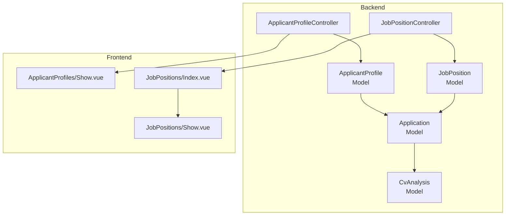
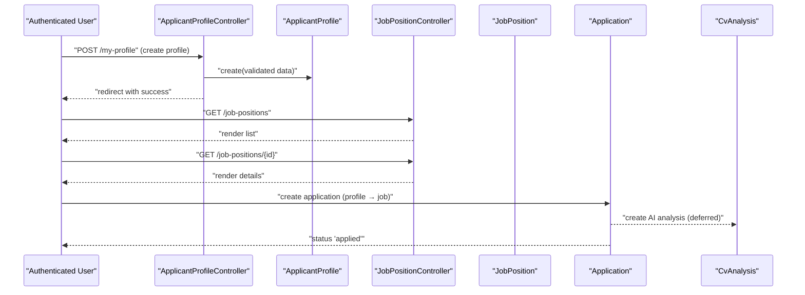
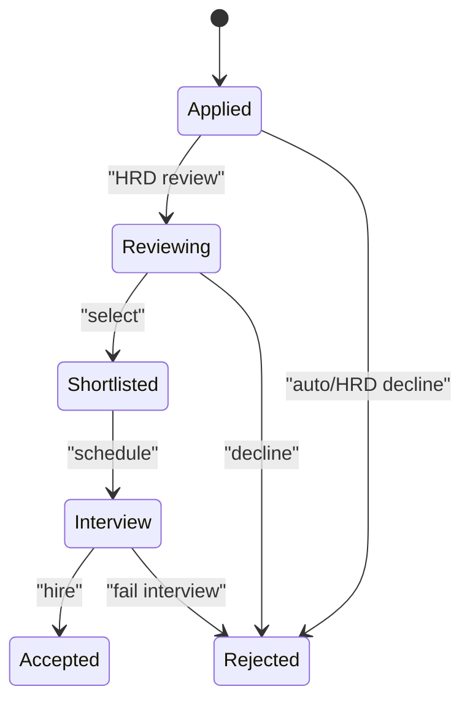
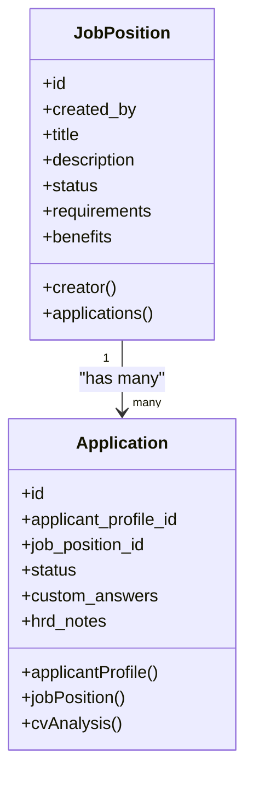
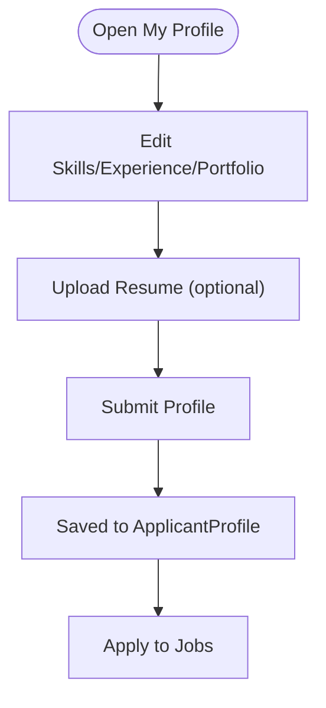
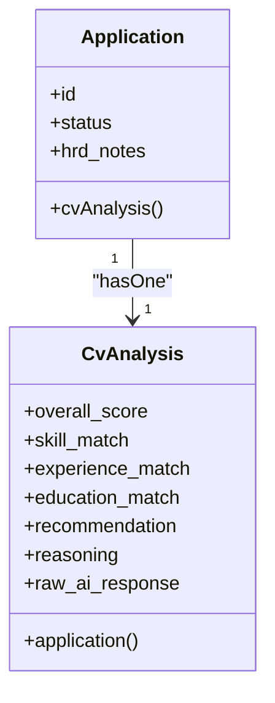
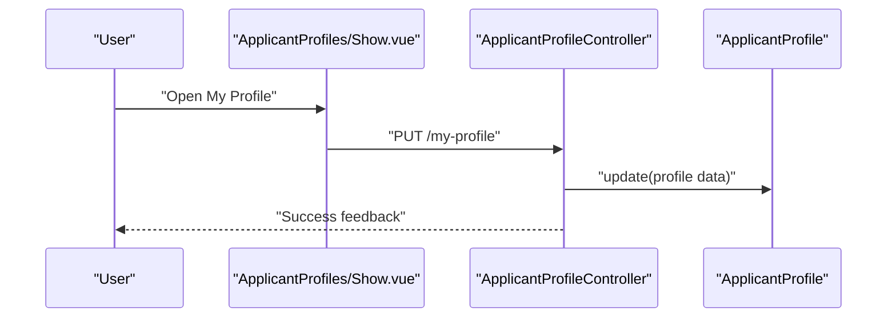
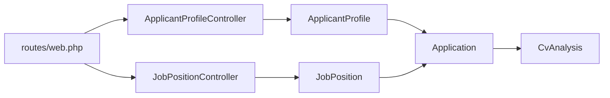

# Application Lifecycle Management

<cite>
**Referenced Files in This Document**
- [Application.php](file://app/Models/Application.php)
- [JobPosition.php](file://app/Models/JobPosition.php)
- [ApplicantProfile.php](file://app/Models/ApplicantProfile.php)
- [CvAnalysis.php](file://app/Models/CvAnalysis.php)
- [2026_06_24_164755_create_applications_table.php](file://database/migrations/2026_06_24_164755_create_applications_table.php)
- [2026_06_24_164755_create_job_positions_table.php](file://database/migrations/2026_06_24_164755_create_job_positions_table.php)
- [2026_06_24_164756_create_cv_analyses_table.php](file://database/migrations/2026_06_24_164756_create_cv_analyses_table.php)
- [ApplicantProfileController.php](file://app/Http/Controllers/ApplicantProfileController.php)
- [JobPositionController.php](file://app/Http/Controllers/JobPositionController.php)
- [web.php](file://routes/web.php)
- [Show.vue (ApplicantProfile)](file://resources/js/pages/ApplicantProfiles/Show.vue)
- [Index.vue (JobPositions)](file://resources/js/pages/JobPositions/Index.vue)
- [Show.vue (JobPositions)](file://resources/js/pages/JobPositions/Show.vue)
- [AGENTS.md](file://AGENTS.md)
- [CONTEXT.md](file://CONTEXT.md)
</cite>

## Table of Contents
1. [Introduction](#introduction)
2. [Project Structure](#project-structure)
3. [Core Components](#core-components)
4. [Architecture Overview](#architecture-overview)
5. [Detailed Component Analysis](#detailed-component-analysis)
6. [Dependency Analysis](#dependency-analysis)
7. [Performance Considerations](#performance-considerations)
8. [Troubleshooting Guide](#troubleshooting-guide)
9. [Conclusion](#conclusion)
10. [Appendices](#appendices)

## Introduction
This document describes the application lifecycle management within the SmartRecruit ATS system. It covers the complete journey from candidate submission through final hiring decisions, including status transitions, audit trail maintenance, automated status updates, integration with job position management, bulk operations, archiving, and data retention. It also documents the frontend interfaces that enable tracking and communication throughout the lifecycle.

## Project Structure
SmartRecruit is a Laravel + Inertia + Vue/Tailwind application. The ATS core revolves around three primary models:
- JobPosition: Defines roles and their metadata.
- ApplicantProfile: Stores candidate personal and professional details.
- Application: Links a candidate profile to a job position and tracks the application’s status and notes.

Supporting models:
- CvAnalysis: Stores AI-driven evaluation results associated with an application.

Routes bind controllers to frontend pages, and migrations define the database schema and default statuses.

**Diagram sources**
- [ApplicantProfileController.php:13-58](file://app/Http/Controllers/ApplicantProfileController.php#L13-L58)
- [JobPositionController.php:12-54](file://app/Http/Controllers/JobPositionController.php#L12-L54)
- [ApplicantProfile.php:10-40](file://app/Models/ApplicantProfile.php#L10-L40)
- [JobPosition.php:10-38](file://app/Models/JobPosition.php#L10-L38)
- [Application.php:10-41](file://app/Models/Application.php#L10-L41)
- [CvAnalysis.php:9-37](file://app/Models/CvAnalysis.php#L9-L37)
- [Show.vue (ApplicantProfile):1-117](file://resources/js/pages/ApplicantProfiles/Show.vue#L1-L117)
- [Index.vue (JobPositions):1-79](file://resources/js/pages/JobPositions/Index.vue#L1-L79)
- [Show.vue (JobPositions):1-101](file://resources/js/pages/JobPositions/Show.vue#L1-L101)

**Section sources**
- [web.php:18-29](file://routes/web.php#L18-L29)
- [CONTEXT.md:21-31](file://CONTEXT.md#L21-L31)

## Core Components
- Application model
  - Tracks the application’s current status with a default value.
  - Maintains free-form custom answers and HRD notes.
  - Establishes relationships to ApplicantProfile and JobPosition.
  - Provides a one-to-one relationship to CvAnalysis for AI insights.
- JobPosition model
  - Stores role metadata, default status, and JSONB arrays for requirements/benefits.
  - Links to the creator (User) and aggregates Applications.
- ApplicantProfile model
  - Holds candidate details and JSONB arrays for skills/experience/education/portfolio.
  - Links to the owning User and aggregates Applications.
- CvAnalysis model
  - Captures AI evaluation scores and match breakdowns per dimension.
  - Associates with a single Application.

Key defaults and constraints:
- Application.status defaults to “applied”.
- JobPosition.status defaults to “open”.

These defaults establish baseline automation triggers and reporting semantics.

**Section sources**
- [Application.php:10-41](file://app/Models/Application.php#L10-L41)
- [2026_06_24_164755_create_applications_table.php:14-22](file://database/migrations/2026_06_24_164755_create_applications_table.php#L14-L22)
- [JobPosition.php:10-38](file://app/Models/JobPosition.php#L10-L38)
- [2026_06_24_164755_create_job_positions_table.php:14-22](file://database/migrations/2026_06_24_164755_create_job_positions_table.php#L14-L22)
- [ApplicantProfile.php:10-40](file://app/Models/ApplicantProfile.php#L10-L40)
- [CvAnalysis.php:9-37](file://app/Models/CvAnalysis.php#L9-L37)
- [2026_06_24_164756_create_cv_analyses_table.php:14-24](file://database/migrations/2026_06_24_164756_create_cv_analyses_table.php#L14-L24)

## Architecture Overview
The lifecycle spans three stages:
1. Candidate preparation: Build a profile and upload a resume.
2. Application creation: Associate a profile with a job posting.
3. Evaluation and decision: AI analysis, status updates, HRD notes, and final outcomes.

**Diagram sources**
- [web.php:23-28](file://routes/web.php#L23-L28)
- [ApplicantProfileController.php:24-36](file://app/Http/Controllers/ApplicantProfileController.php#L24-L36)
- [JobPositionController.php:14-34](file://app/Http/Controllers/JobPositionController.php#L14-L34)
- [Application.php:10-41](file://app/Models/Application.php#L10-L41)
- [CvAnalysis.php:9-37](file://app/Models/CvAnalysis.php#L9-L37)

## Detailed Component Analysis

### Application Model and Lifecycle States
The Application model is central to tracking progress and enabling automation:
- Status field: Defaults to “applied”, supports transitions to “reviewing”, “shortlisted”, “interview”, “rejected”, “accepted”.
- Audit trail: HRD notes capture decision rationale; timestamps record state changes.
- Automation hooks: Status transitions can trigger downstream actions (e.g., scheduling interviews, notifications).

**Diagram sources**
- [2026_06_24_164755_create_applications_table.php:18-18](file://database/migrations/2026_06_24_164755_create_applications_table.php#L18-L18)
- [AGENTS.md:1328-1337](file://AGENTS.md#L1328-L1337)

**Section sources**
- [Application.php:10-41](file://app/Models/Application.php#L10-L41)
- [2026_06_24_164755_create_applications_table.php:14-22](file://database/migrations/2026_06_24_164755_create_applications_table.php#L14-L22)
- [AGENTS.md:1328-1337](file://AGENTS.md#L1328-L1337)

### Job Position Management and Application Distribution
JobPosition defines the role and its lifecycle:
- Default status “open” indicates availability for applications.
- Relationships to creator and applications enable reporting and filtering.
- Frontend surfaces status, requirements, and benefits for transparency.

**Diagram sources**
- [JobPosition.php:10-38](file://app/Models/JobPosition.php#L10-L38)
- [Application.php:10-41](file://app/Models/Application.php#L10-L41)

**Section sources**
- [JobPosition.php:10-38](file://app/Models/JobPosition.php#L10-L38)
- [2026_06_24_164755_create_job_positions_table.php:14-22](file://database/migrations/2026_06_24_164755_create_job_positions_table.php#L14-L22)
- [Index.vue (JobPositions):43-76](file://resources/js/pages/JobPositions/Index.vue#L43-L76)
- [Show.vue (JobPositions):40-96](file://resources/js/pages/JobPositions/Show.vue#L40-L96)

### Candidate Profile and Resume Handling
ApplicantProfile stores candidate data and integrates with resume uploads:
- JSONB arrays for skills, experience, education, and portfolio URLs.
- Controller handles file storage and updates with validation.
- Frontend provides a form for editing profile details and uploading resumes.

**Diagram sources**
- [Show.vue (ApplicantProfile):15-33](file://resources/js/pages/ApplicantProfiles/Show.vue#L15-L33)
- [ApplicantProfileController.php:24-57](file://app/Http/Controllers/ApplicantProfileController.php#L24-L57)
- [ApplicantProfile.php:10-40](file://app/Models/ApplicantProfile.php#L10-L40)

**Section sources**
- [Show.vue (ApplicantProfile):1-117](file://resources/js/pages/ApplicantProfiles/Show.vue#L1-L117)
- [ApplicantProfileController.php:13-58](file://app/Http/Controllers/ApplicantProfileController.php#L13-L58)
- [ApplicantProfile.php:10-40](file://app/Models/ApplicantProfile.php#L10-L40)

### AI Analysis and Scoring
CvAnalysis captures AI-driven insights:
- Scores and match breakdowns per dimension.
- Structured reasoning and recommendation for explainability.
- One-to-one linkage to Application enables seamless integration.

**Diagram sources**
- [Application.php:37-40](file://app/Models/Application.php#L37-L40)
- [CvAnalysis.php:9-37](file://app/Models/CvAnalysis.php#L9-L37)
- [2026_06_24_164756_create_cv_analyses_table.php:14-24](file://database/migrations/2026_06_24_164756_create_cv_analyses_table.php#L14-L24)

**Section sources**
- [CvAnalysis.php:9-37](file://app/Models/CvAnalysis.php#L9-L37)
- [2026_06_24_164756_create_cv_analyses_table.php:12-25](file://database/migrations/2026_06_24_164756_create_cv_analyses_table.php#L12-L25)

### Frontend Interfaces for Lifecycle Tracking and Communication
- My Profile page: Allows candidates to manage personal details and upload resumes.
- Job Positions list: Displays open roles with status and quick links to details.
- Job Details page: Presents role description, requirements, benefits, and an apply action.

**Diagram sources**
- [Show.vue (ApplicantProfile):23-33](file://resources/js/pages/ApplicantProfiles/Show.vue#L23-L33)
- [ApplicantProfileController.php:38-57](file://app/Http/Controllers/ApplicantProfileController.php#L38-L57)

**Section sources**
- [Show.vue (ApplicantProfile):1-117](file://resources/js/pages/ApplicantProfiles/Show.vue#L1-L117)
- [Index.vue (JobPositions):1-79](file://resources/js/pages/JobPositions/Index.vue#L1-L79)
- [Show.vue (JobPositions):1-101](file://resources/js/pages/JobPositions/Show.vue#L1-L101)
- [web.php:25-28](file://routes/web.php#L25-L28)

## Dependency Analysis
- Controllers orchestrate requests and render Inertia pages.
- Models define relationships and constraints.
- Migrations enforce schema and default values.
- Frontend components drive user interactions and submit forms.

**Diagram sources**
- [web.php:18-29](file://routes/web.php#L18-L29)
- [ApplicantProfileController.php:13-58](file://app/Http/Controllers/ApplicantProfileController.php#L13-L58)
- [JobPositionController.php:12-54](file://app/Http/Controllers/JobPositionController.php#L12-L54)
- [ApplicantProfile.php:10-40](file://app/Models/ApplicantProfile.php#L10-L40)
- [JobPosition.php:10-38](file://app/Models/JobPosition.php#L10-L38)
- [Application.php:10-41](file://app/Models/Application.php#L10-L41)
- [CvAnalysis.php:9-37](file://app/Models/CvAnalysis.php#L9-L37)

**Section sources**
- [web.php:18-29](file://routes/web.php#L18-L29)
- [ApplicantProfileController.php:13-58](file://app/Http/Controllers/ApplicantProfileController.php#L13-L58)
- [JobPositionController.php:12-54](file://app/Http/Controllers/JobPositionController.php#L12-L54)

## Performance Considerations
- Prefer eager loading for lists of applications and job positions to avoid N+1 queries.
- Use pagination for large candidate or job lists.
- Index frequently filtered/sorted fields (e.g., status, created_at).
- Offload long-running AI analysis to queues to keep UI responsive.
- Cache static or infrequently changing data where safe.

[No sources needed since this section provides general guidance]

## Troubleshooting Guide
Common issues and resolutions:
- Unauthorized deletion attempts: Only users with the appropriate role can delete job positions.
- Profile update conflicts: Ensure the authenticated user matches the profile owner before updating.
- Resume storage: Validate file types and sizes; securely store and avoid exposing private paths.
- Status transitions: Enforce state machine rules to prevent invalid transitions.

**Section sources**
- [JobPositionController.php:44-52](file://app/Http/Controllers/JobPositionController.php#L44-L52)
- [ApplicantProfileController.php:39-42](file://app/Http/Controllers/ApplicantProfileController.php#L39-L42)
- [AGENTS.md:854-865](file://AGENTS.md#L854-L865)

## Conclusion
SmartRecruit’s ATS architecture centers on the Application model to track candidate progress, integrate AI analysis, and support HRD decision-making. JobPosition and ApplicantProfile models provide the context and profile data necessary for effective matching and communication. The frontend offers intuitive interfaces for profile management and job exploration, while controllers and migrations enforce data integrity and default behaviors that enable automation and auditability.

## Appendices

### Status Definitions and Transitions
- Default statuses:
  - Application: applied
  - JobPosition: open
- Suggested lifecycle statuses:
  - new, reviewing, shortlisted, interview, rejected, accepted

**Section sources**
- [2026_06_24_164755_create_applications_table.php:18-18](file://database/migrations/2026_06_24_164755_create_applications_table.php#L18-L18)
- [2026_06_24_164755_create_job_positions_table.php:19-19](file://database/migrations/2026_06_24_164755_create_job_positions_table.php#L19-L19)
- [AGENTS.md:1328-1337](file://AGENTS.md#L1328-L1337)

### Practical Examples
- Application state management:
  - On profile completion, create an Application linking the profile to a chosen JobPosition with status “applied”.
  - Transition to “reviewing” when HRD begins assessment; add HRD notes for auditability.
- Workflow automation triggers:
  - Move to “shortlisted” to generate interview invitations.
  - Move to “rejected” to notify candidates via integrated messaging.
- HRD intervention points:
  - Add recommendations and reasoning in CvAnalysis for explainability.
  - Use status “interview” to coordinate scheduling and feedback collection.
- Bulk status updates:
  - Batch update Application.status for groups of candidates (e.g., moving multiple “reviewing” to “shortlisted”).
- Application archiving and data retention:
  - Retain Application and CvAnalysis records for compliance; apply retention policies to archived data per policy.

[No sources needed since this section provides general guidance]