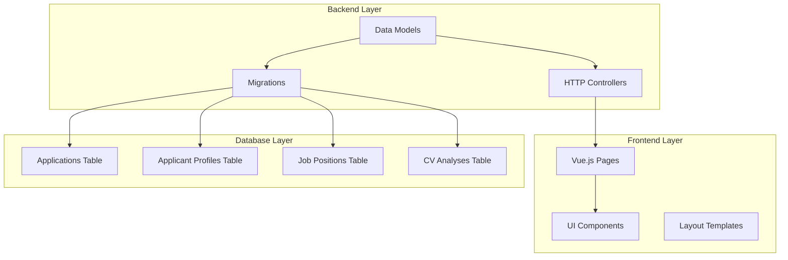
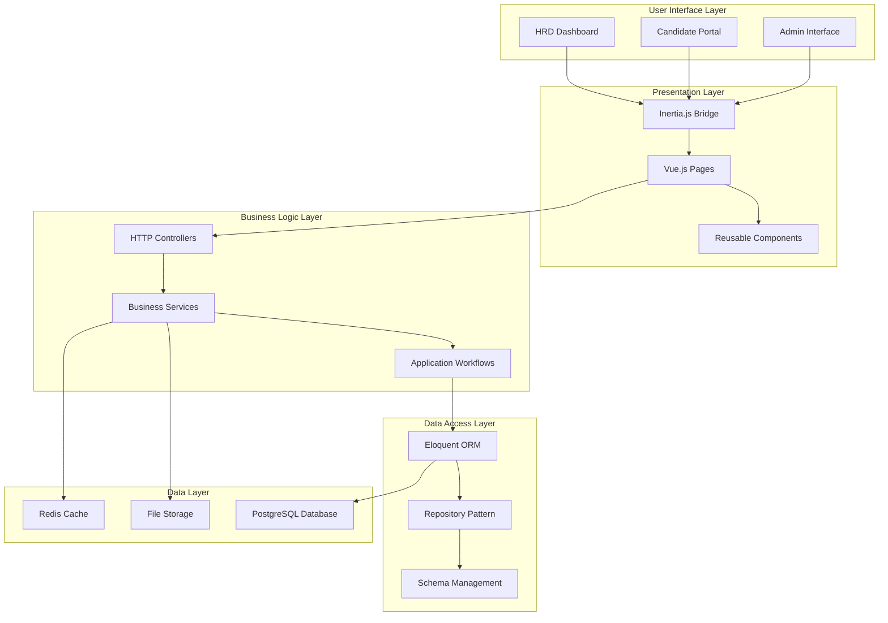
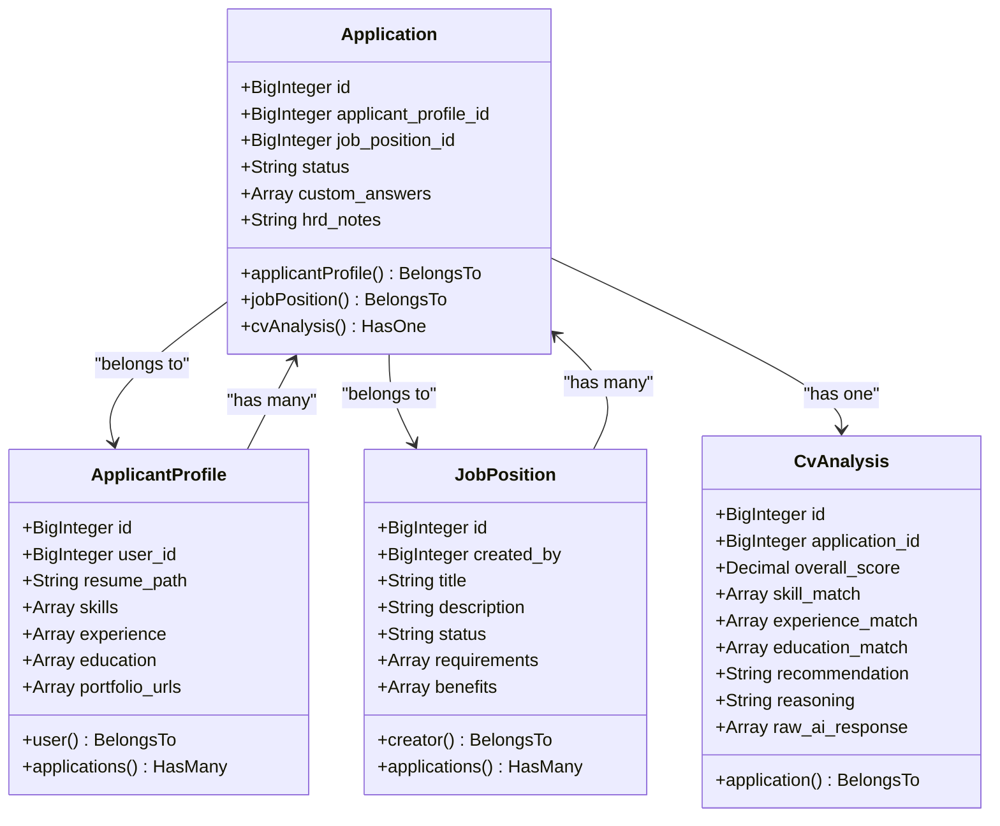
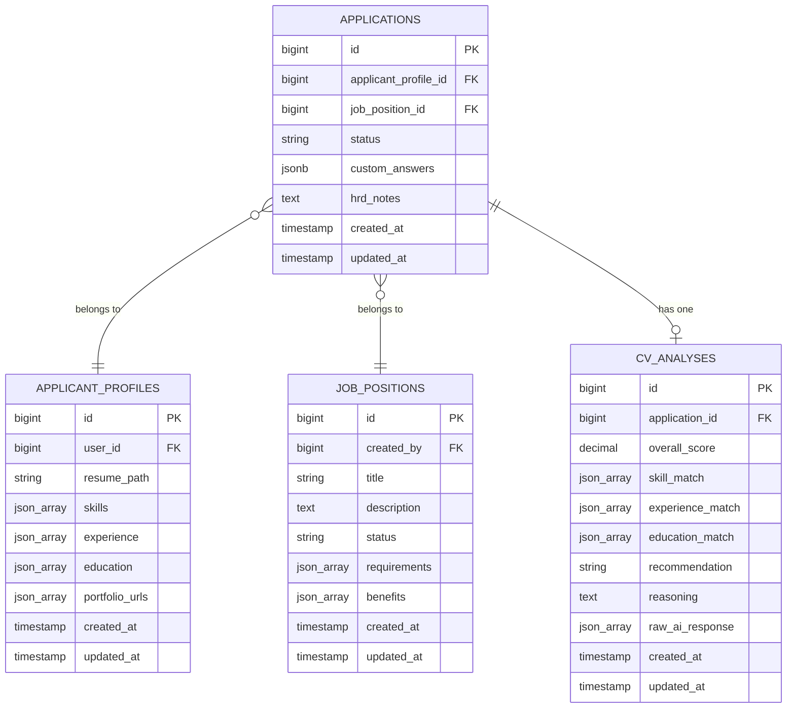
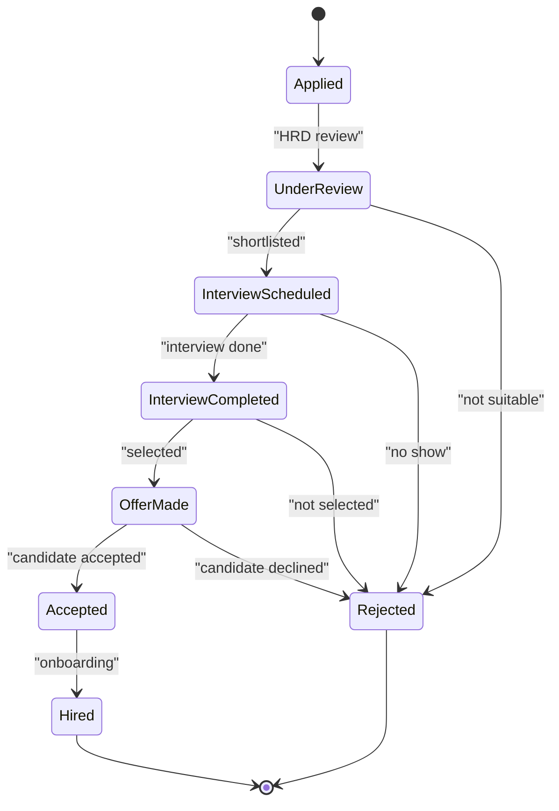
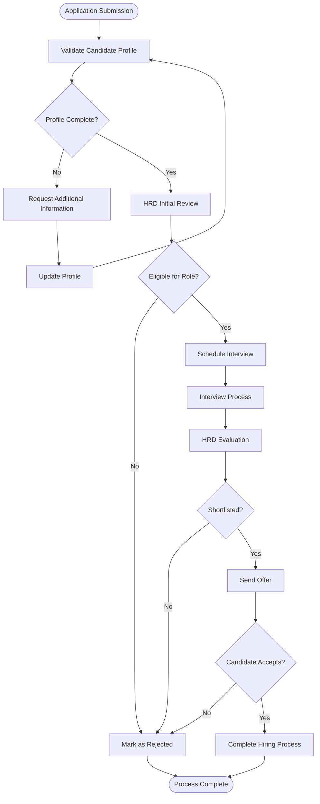
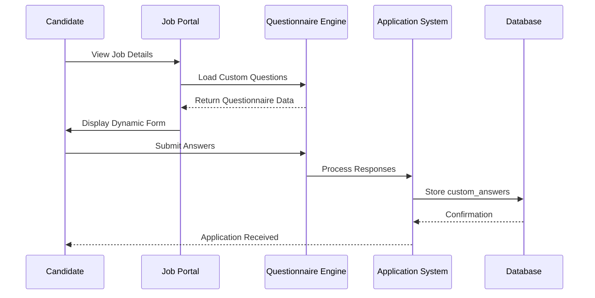
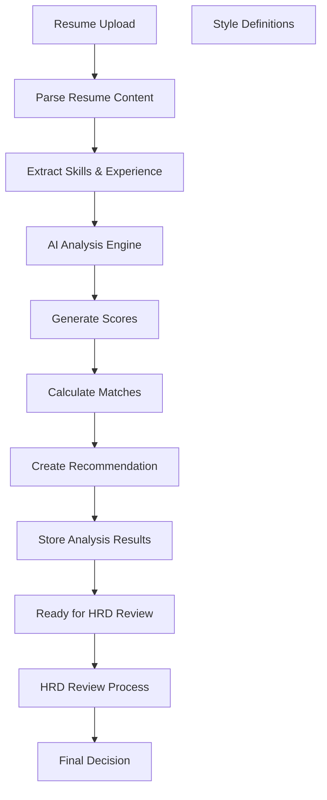

# Application Tracking System

<cite>
**Referenced Files in This Document**
- [Application.php](file://app/Models/Application.php)
- [ApplicantProfile.php](file://app/Models/ApplicantProfile.php)
- [CvAnalysis.php](file://app/Models/CvAnalysis.php)
- [JobPosition.php](file://app/Models/JobPosition.php)
- [2026_06_24_164755_create_applications_table.php](file://database/migrations/2026_06_24_164755_create_applications_table.php)
- [2026_06_24_164755_create_job_positions_table.php](file://database/migrations/2026_06_24_164755_create_job_positions_table.php)
- [2026_06_24_164756_create_cv_analyses_table.php](file://database/migrations/2026_06_24_164756_create_cv_analyses_table.php)
- [ApplicantProfileController.php](file://app/Http/Controllers/ApplicantProfileController.php)
- [Show.vue](file://resources/js/pages/ApplicantProfiles/Show.vue)
- [Index.vue](file://resources/js/pages/JobPositions/Index.vue)
- [Show.vue](file://resources/js/pages/JobPositions/Show.vue)
- [app.ts](file://resources/js/app.ts)
</cite>

## Table of Contents
1. [Introduction](#introduction)
2. [Project Structure](#project-structure)
3. [Core Components](#core-components)
4. [Architecture Overview](#architecture-overview)
5. [Detailed Component Analysis](#detailed-component-analysis)
6. [Application Lifecycle Management](#application-lifecycle-management)
7. [Custom Question System](#custom-question-system)
8. [CV Analysis Integration](#cv-analysis-integration)
9. [HRD Management Interfaces](#hrd-management-interfaces)
10. [Bulk Operations and Reporting](#bulk-operations-and-reporting)
11. [Performance Considerations](#performance-considerations)
12. [Troubleshooting Guide](#troubleshooting-guide)
13. [Conclusion](#conclusion)

## Introduction

The Application Tracking System is a comprehensive recruitment management platform built with Laravel and Vue.js. This system manages the complete candidate application lifecycle, from initial job posting through final hiring decisions. The platform integrates AI-powered CV analysis, custom questionnaires, and streamlined HRD workflows to provide a modern recruitment experience.

The system is designed around three core pillars: job position management, candidate application tracking, and intelligent candidate evaluation through CV analysis. It provides both candidate-facing interfaces for profile management and HRD-facing interfaces for comprehensive application oversight.

## Project Structure

The application follows a clean architecture pattern with clear separation between backend models/controllers and frontend Vue.js components. The structure emphasizes maintainability and scalability for enterprise-level recruitment operations.

**Diagram sources**
- [Application.php:10-41](file://app/Models/Application.php#L10-L41)
- [ApplicantProfile.php:10-40](file://app/Models/ApplicantProfile.php#L10-L40)
- [JobPosition.php:10-38](file://app/Models/JobPosition.php#L10-L38)

**Section sources**
- [Application.php:1-42](file://app/Models/Application.php#L1-L42)
- [ApplicantProfile.php:1-41](file://app/Models/ApplicantProfile.php#L1-L41)
- [JobPosition.php:1-39](file://app/Models/JobPosition.php#L1-L39)

## Core Components

The system's core functionality revolves around four primary models that form the foundation of the application tracking ecosystem:

### Application Model
The Application model serves as the central hub for tracking candidate submissions and their progression through the recruitment pipeline. It maintains the relationship between applicants and job positions while preserving application-specific metadata including status tracking and custom responses.

### ApplicantProfile Model  
Manages candidate personal information, professional background, and resume documents. This model provides the foundation for CV analysis and candidate evaluation processes.

### JobPosition Model
Handles job posting lifecycle management, including requirements specification, benefits presentation, and status tracking for open positions.

### CvAnalysis Model
Processes and stores AI-generated insights from candidate resumes, providing quantitative metrics for skill matching, experience alignment, and educational qualifications.

**Section sources**
- [Application.php:10-41](file://app/Models/Application.php#L10-L41)
- [ApplicantProfile.php:10-40](file://app/Models/ApplicantProfile.php#L10-L40)
- [JobPosition.php:10-38](file://app/Models/JobPosition.php#L10-L38)
- [CvAnalysis.php:9-37](file://app/Models/CvAnalysis.php#L9-L37)

## Architecture Overview

The system implements a modern full-stack architecture combining Laravel's robust backend capabilities with Vue.js's reactive frontend framework. The architecture emphasizes separation of concerns, data integrity, and scalable performance.

**Diagram sources**
- [app.ts:10-27](file://resources/js/app.ts#L10-L27)
- [ApplicantProfileController.php:13-58](file://app/Http/Controllers/ApplicantProfileController.php#L13-L58)

## Detailed Component Analysis

### Application Model Implementation

The Application model establishes the fundamental relationships that drive the entire recruitment process. Its design prioritizes flexibility while maintaining data integrity through carefully defined relationships and constraints.

**Diagram sources**
- [Application.php:10-41](file://app/Models/Application.php#L10-L41)
- [ApplicantProfile.php:10-40](file://app/Models/ApplicantProfile.php#L10-L40)
- [JobPosition.php:10-38](file://app/Models/JobPosition.php#L10-L38)
- [CvAnalysis.php:9-37](file://app/Models/CvAnalysis.php#L9-L37)

The model's fillable attributes ensure secure mass assignment while supporting the application's core functionality. The custom_answers field utilizes JSONB storage for flexible questionnaire responses, while hrd_notes provides dedicated space for HRD commentary and decisions.

**Section sources**
- [Application.php:12-25](file://app/Models/Application.php#L12-L25)
- [2026_06_24_164755_create_applications_table.php:14-22](file://database/migrations/2026_06_24_164755_create_applications_table.php#L14-L22)

### Database Schema Design

The migration files establish a robust foundation for the application tracking system, implementing proper foreign key relationships and data type choices optimized for the recruitment domain.

**Diagram sources**
- [2026_06_24_164755_create_applications_table.php:14-22](file://database/migrations/2026_06_24_164755_create_applications_table.php#L14-L22)
- [2026_06_24_164755_create_job_positions_table.php:14-22](file://database/migrations/2026_06_24_164755_create_job_positions_table.php#L14-L22)
- [2026_06_24_164756_create_cv_analyses_table.php:14-24](file://database/migrations/2026_06_24_164756_create_cv_analyses_table.php#L14-L24)

**Section sources**
- [2026_06_24_164755_create_applications_table.php:1-33](file://database/migrations/2026_06_24_164755_create_applications_table.php#L1-L33)
- [2026_06_24_164755_create_job_positions_table.php:1-34](file://database/migrations/2026_06_24_164755_create_job_positions_table.php#L1-L34)
- [2026_06_24_164756_create_cv_analyses_table.php:1-36](file://database/migrations/2026_06_24_164756_create_cv_analyses_table.php#L1-L36)

## Application Lifecycle Management

The application lifecycle encompasses the complete journey from candidate submission through final decision-making. This process involves multiple stages with automated workflows and manual intervention points.

### Status Transition Workflow

The system implements a comprehensive status tracking mechanism that captures every stage of the application process. Each transition triggers appropriate notifications and data persistence operations.

**Diagram sources**
- [Application.php:12-18](file://app/Models/Application.php#L12-L18)
- [2026_06_24_164755_create_applications_table.php:18-18](file://database/migrations/2026_06_24_164755_create_applications_table.php#L18-L18)

### Automated Workflow Triggers

The system supports automated workflows that respond to application events and status changes. These workflows can trigger notifications, update related records, and maintain audit trails.

**Section sources**
- [Application.php:27-40](file://app/Models/Application.php#L27-L40)
- [ApplicantProfileController.php:24-57](file://app/Http/Controllers/ApplicantProfileController.php#L24-L57)

## Custom Question System

The custom question system enables job-specific application requirements through flexible questionnaire management. This system allows recruiters to gather specialized information beyond standard candidate profiles.

### Questionnaire Architecture

The custom_answers field utilizes JSONB storage to accommodate dynamic question types and varying response formats. This approach provides flexibility while maintaining data integrity and query performance.

**Diagram sources**
- [Application.php:23-23](file://app/Models/Application.php#L23-L23)
- [2026_06_24_164755_create_applications_table.php:19-19](file://database/migrations/2026_06_24_164755_create_applications_table.php#L19-L19)

### Question Types and Validation

The system supports various question types including text responses, multiple choice selections, and file uploads. Each question type maintains specific validation rules and response formatting requirements.

**Section sources**
- [Application.php:12-25](file://app/Models/Application.php#L12-L25)
- [2026_06_24_164755_create_applications_table.php:19-19](file://database/migrations/2026_06_24_164755_create_applications_table.php#L19-L19)

## CV Analysis Integration

The CV analysis integration provides AI-powered candidate evaluation through comprehensive skill matching, experience assessment, and educational qualification analysis.

### Analysis Pipeline

The CV analysis system processes candidate resumes through multiple evaluation stages, generating quantified metrics for decision support.

**Diagram sources**
- [CvAnalysis.php:11-20](file://app/Models/CvAnalysis.php#L11-L20)
- [2026_06_24_164756_create_cv_analyses_table.php:16-24](file://database/migrations/2026_06_24_164756_create_cv_analyses_table.php#L16-L24)

### Evaluation Metrics

The system generates comprehensive evaluation metrics including overall scores, skill match percentages, experience alignment ratings, and educational qualification assessments. These metrics provide quantitative support for qualitative HRD decisions.

**Section sources**
- [CvAnalysis.php:22-36](file://app/Models/CvAnalysis.php#L22-L36)
- [2026_06_24_164756_create_cv_analyses_table.php:17-23](file://database/migrations/2026_06_24_164756_create_cv_analyses_table.php#L17-L23)

## HRD Management Interfaces

The HRD management interfaces provide comprehensive tools for overseeing the entire recruitment process, from application intake to final hiring decisions.

### Dashboard Overview

The HRD dashboard presents key recruitment metrics, application status distributions, and team performance indicators. This centralized interface enables efficient monitoring and decision-making.

### Application Management Features

HRD users can efficiently manage applications through bulk operations, status updates, and communication tools. The interface supports filtering, sorting, and advanced search capabilities for large application volumes.

### Interview Coordination Tools

The system includes integrated interview scheduling, candidate communication, and feedback collection mechanisms. These tools streamline the interview process and maintain comprehensive documentation.

**Section sources**
- [Show.vue:1-101](file://resources/js/pages/JobPositions/Show.vue#L1-L101)
- [Index.vue:1-79](file://resources/js/pages/JobPositions/Index.vue#L1-L79)

## Bulk Operations and Reporting

The system provides extensive bulk operation capabilities and comprehensive reporting features to support data-driven recruitment decisions.

### Bulk Status Updates

HRD users can efficiently update multiple application statuses simultaneously, apply consistent notes across groups, and coordinate team assignments. These operations support rapid processing during high-volume recruitment periods.

### Analytics and Insights

The reporting system generates detailed analytics on application funnel conversion rates, time-to-hire metrics, candidate quality indicators, and team performance benchmarks. These insights enable continuous process improvement.

### Export Capabilities

Multiple export formats support integration with external systems, compliance reporting, and archival requirements. Supported formats include CSV, Excel, and PDF for different use cases.

**Section sources**
- [Show.vue:1-117](file://resources/js/pages/ApplicantProfiles/Show.vue#L1-L117)
- [ApplicantProfileController.php:15-57](file://app/Http/Controllers/ApplicantProfileController.php#L15-L57)

## Performance Considerations

The system is designed with performance optimization as a core consideration, implementing several strategies to ensure responsive operation under various load conditions.

### Database Optimization

The schema design incorporates appropriate indexing strategies, connection pooling configurations, and query optimization techniques. JSONB field usage balances flexibility with performance requirements.

### Frontend Performance

Vue.js component architecture, lazy loading implementations, and efficient state management minimize client-side resource consumption while maintaining responsive user experiences.

### Scalability Planning

The architecture supports horizontal scaling through proper database partitioning, caching strategies, and microservice-ready controller designs. These considerations prepare the system for growth and increased user loads.

## Troubleshooting Guide

Common issues and their resolution strategies for the application tracking system.

### Application Submission Issues

**Problem**: Applications not appearing in HRD dashboard
**Solution**: Verify database connections, check application status field values, and confirm proper indexing on status and created_at fields.

### CV Analysis Failures

**Problem**: CV analysis not generating results
**Solution**: Check AI service connectivity, verify resume file formats, and validate analysis engine configuration settings.

### Frontend Interface Problems

**Problem**: Vue.js components not rendering properly
**Solution**: Clear browser cache, verify asset compilation, check network connectivity to backend APIs, and review browser console for JavaScript errors.

### Performance Degradation

**Problem**: Slow application response times
**Solution**: Monitor database query performance, implement proper pagination for large datasets, optimize image assets, and review server resource utilization.

**Section sources**
- [app.ts:10-27](file://resources/js/app.ts#L10-L27)
- [ApplicantProfileController.php:24-57](file://app/Http/Controllers/ApplicantProfileController.php#L24-L57)

## Conclusion

The Application Tracking System provides a comprehensive solution for modern recruitment management, combining intuitive user interfaces with robust backend functionality. The system's modular architecture, AI-powered evaluation capabilities, and comprehensive reporting features position it as a scalable platform for organizations of all sizes.

Key strengths include the flexible custom question system, integrated CV analysis capabilities, and streamlined HRD workflows. The system's design emphasizes maintainability, performance, and extensibility while providing immediate value through automated workflows and intelligent candidate evaluation.

Future enhancements could include expanded AI capabilities, advanced analytics features, mobile application support, and integration with external ATS systems. The solid architectural foundation ensures these improvements can be implemented efficiently while maintaining system stability and performance.