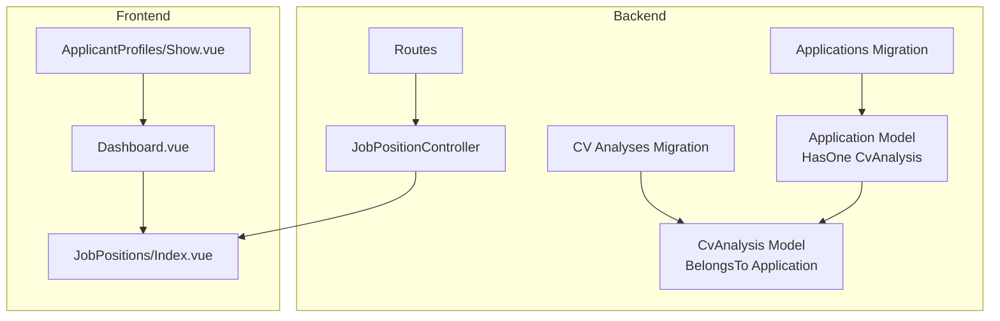
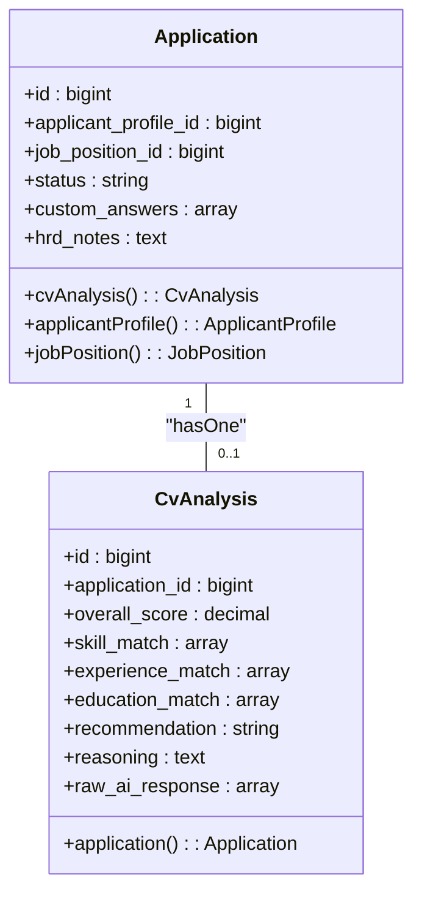
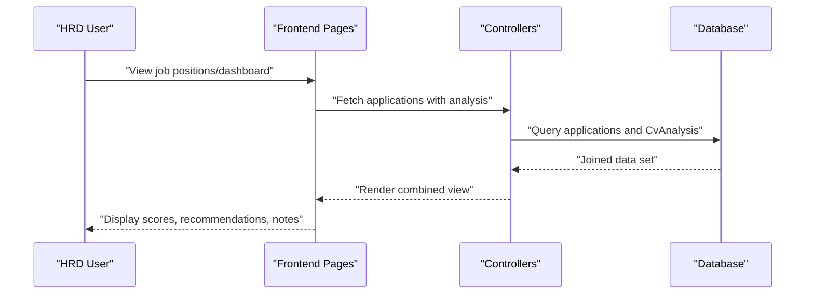
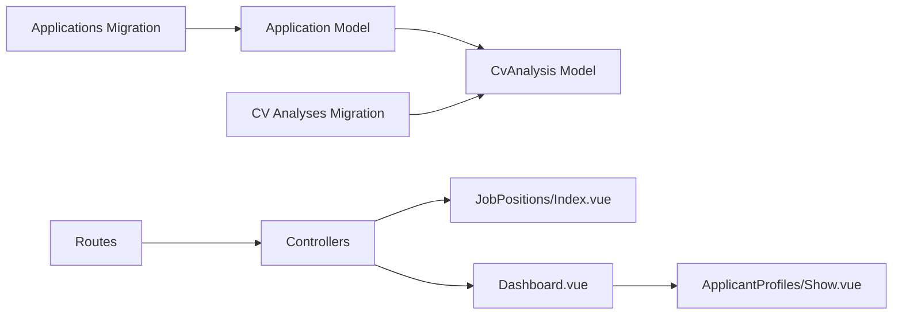

# CV Analysis Integration

<cite>
**Referenced Files in This Document**
- [CvAnalysis.php](file://app/Models/CvAnalysis.php)
- [Application.php](file://app/Models/Application.php)
- [2026_06_24_164756_create_cv_analyses_table.php](file://database/migrations/2026_06_24_164756_create_cv_analyses_table.php)
- [2026_06_24_164755_create_applications_table.php](file://database/migrations/2026_06_24_164755_create_applications_table.php)
- [web.php](file://routes/web.php)
- [JobPositionController.php](file://app/Http/Controllers/JobPositionController.php)
- [Dashboard.vue](file://resources/js/pages/Dashboard.vue)
- [Index.vue](file://resources/js/pages/JobPositions/Index.vue)
- [Show.vue](file://resources/js/pages/ApplicantProfiles/Show.vue)
- [MEMORY.md](file://MEMORY.md)
- [AGENTS.md](file://AGENTS.md)
</cite>

## Table of Contents
1. [Introduction](#introduction)
2. [Project Structure](#project-structure)
3. [Core Components](#core-components)
4. [Architecture Overview](#architecture-overview)
5. [Detailed Component Analysis](#detailed-component-analysis)
6. [Dependency Analysis](#dependency-analysis)
7. [Performance Considerations](#performance-considerations)
8. [Troubleshooting Guide](#troubleshooting-guide)
9. [Conclusion](#conclusion)

## Introduction
This document explains the CV analysis integration within the application tracking system. It details how AI-generated insights are linked to individual applications via a hasOne relationship with the CvAnalysis model, documents the scoring system and matching categories, and outlines the integration points between application data and AI analysis. It also covers data preprocessing expectations, analysis triggers, result presentation, interpretation guidelines, threshold-based automation, manual overrides, feedback loops, performance metrics, external AI service integration, and the frontend dashboard for combined application and analysis data.

## Project Structure
The CV analysis feature spans backend models and migrations, controller scaffolding, and frontend pages. The core relationship is established between Application and CvAnalysis, with supporting tables and controllers enabling the end-to-end flow.

**Diagram sources**
- [Application.php:10-41](file://app/Models/Application.php#L10-L41)
- [CvAnalysis.php:9-37](file://app/Models/CvAnalysis.php#L9-L37)
- [2026_06_24_164756_create_cv_analyses_table.php:14-25](file://database/migrations/2026_06_24_164756_create_cv_analyses_table.php#L14-L25)
- [2026_06_24_164755_create_applications_table.php:14-22](file://database/migrations/2026_06_24_164755_create_applications_table.php#L14-L22)
- [JobPositionController.php:12-55](file://app/Http/Controllers/JobPositionController.php#L12-L55)
- [web.php:18-29](file://routes/web.php#L18-L29)
- [Dashboard.vue:1-48](file://resources/js/pages/Dashboard.vue#L1-L48)
- [Index.vue:1-79](file://resources/js/pages/JobPositions/Index.vue#L1-L79)
- [Show.vue:1-117](file://resources/js/pages/ApplicantProfiles/Show.vue#L1-L117)

**Section sources**
- [Application.php:10-41](file://app/Models/Application.php#L10-L41)
- [CvAnalysis.php:9-37](file://app/Models/CvAnalysis.php#L9-L37)
- [2026_06_24_164756_create_cv_analyses_table.php:14-25](file://database/migrations/2026_06_24_164756_create_cv_analyses_table.php#L14-L25)
- [2026_06_24_164755_create_applications_table.php:14-22](file://database/migrations/2026_06_24_164755_create_applications_table.php#L14-L22)
- [web.php:18-29](file://routes/web.php#L18-L29)
- [JobPositionController.php:12-55](file://app/Http/Controllers/JobPositionController.php#L12-L55)
- [Dashboard.vue:1-48](file://resources/js/pages/Dashboard.vue#L1-L48)
- [Index.vue:1-79](file://resources/js/pages/JobPositions/Index.vue#L1-L79)
- [Show.vue:1-117](file://resources/js/pages/ApplicantProfiles/Show.vue#L1-L117)

## Core Components
- Application model defines a hasOne CvAnalysis relationship and belongsTo relationships to ApplicantProfile and JobPosition.
- CvAnalysis model stores AI-generated insights linked to a single application, including scores and match breakdowns.
- Migrations define the database schema for both Application and CvAnalysis tables with appropriate data types and foreign keys.
- Controllers and routes provide the backend foundation for managing job positions and exposing data to the frontend.
- Frontend pages present dashboards, job listings, and candidate profiles with placeholders indicating where CV analysis data will be shown.

Key implementation references:
- Application hasOne CvAnalysis: [Application.php:37-40](file://app/Models/Application.php#L37-L40)
- CvAnalysis belongsTo Application: [CvAnalysis.php:33-36](file://app/Models/CvAnalysis.php#L33-L36)
- Application table schema: [2026_06_24_164755_create_applications_table.php:14-22](file://database/migrations/2026_06_24_164755_create_applications_table.php#L14-L22)
- CvAnalysis table schema: [2026_06_24_164756_create_cv_analyses_table.php:14-25](file://database/migrations/2026_06_24_164756_create_cv_analyses_table.php#L14-L25)
- Routes for authenticated dashboard and job positions: [web.php:18-29](file://routes/web.php#L18-L29)

**Section sources**
- [Application.php:10-41](file://app/Models/Application.php#L10-L41)
- [CvAnalysis.php:9-37](file://app/Models/CvAnalysis.php#L9-L37)
- [2026_06_24_164756_create_cv_analyses_table.php:14-25](file://database/migrations/2026_06_24_164756_create_cv_analyses_table.php#L14-L25)
- [2026_06_24_164755_create_applications_table.php:14-22](file://database/migrations/2026_06_24_164755_create_applications_table.php#L14-L22)
- [web.php:18-29](file://routes/web.php#L18-L29)

## Architecture Overview
The CV analysis integration follows a clean separation of concerns:
- Data model layer: Application and CvAnalysis with explicit relationships and typed attributes.
- Persistence layer: Migrations define normalized tables with JSONB fields for flexible AI outputs.
- Presentation layer: Inertia-driven Vue pages consume backend data for dashboards and listings.
- Controller layer: Resource controllers manage job positions and expose data to the frontend.

**Diagram sources**
- [Application.php:10-41](file://app/Models/Application.php#L10-L41)
- [CvAnalysis.php:9-37](file://app/Models/CvAnalysis.php#L9-L37)

**Section sources**
- [Application.php:10-41](file://app/Models/Application.php#L10-L41)
- [CvAnalysis.php:9-37](file://app/Models/CvAnalysis.php#L9-L37)

## Detailed Component Analysis

### Data Model Layer
- Application: Stores candidate application metadata, status, and custom answers. Provides relationships to related entities and a hasOne CvAnalysis linkage.
- CvAnalysis: Captures AI insights with typed attributes for scores and arrays for match details, plus recommendation and reasoning fields, and raw AI response storage.

Implementation references:
- Application fillable and casts: [Application.php:12-25](file://app/Models/Application.php#L12-L25)
- CvAnalysis fillable and casts: [CvAnalysis.php:11-31](file://app/Models/CvAnalysis.php#L11-L31)
- Relationship definitions: [Application.php:37-40](file://app/Models/Application.php#L37-L40), [CvAnalysis.php:33-36](file://app/Models/CvAnalysis.php#L33-L36)

**Section sources**
- [Application.php:12-40](file://app/Models/Application.php#L12-L40)
- [CvAnalysis.php:11-36](file://app/Models/CvAnalysis.php#L11-L36)

### Persistence Layer
- Applications table: Includes foreign keys to applicant profiles and job positions, status field, and JSONB custom answers.
- CV analyses table: Links to applications via foreign key, stores overall score, match breakdowns, recommendation, reasoning, and raw AI response.

Schema references:
- Applications migration: [2026_06_24_164755_create_applications_table.php:14-22](file://database/migrations/2026_06_24_164755_create_applications_table.php#L14-L22)
- CV analyses migration: [2026_06_24_164756_create_cv_analyses_table.php:14-25](file://database/migrations/2026_06_24_164756_create_cv_analyses_table.php#L14-L25)

**Section sources**
- [2026_06_24_164755_create_applications_table.php:14-22](file://database/migrations/2026_06_24_164755_create_applications_table.php#L14-L22)
- [2026_06_24_164756_create_cv_analyses_table.php:14-25](file://database/migrations/2026_06_24_164756_create_cv_analyses_table.php#L14-L25)

### Integration Points and Workflows
- Data preprocessing: Candidate profiles and applications provide structured data (skills, experience, education, custom answers) that feed into AI analysis.
- Analysis triggers: The system expects a dedicated analysis pipeline to process application data and produce CvAnalysis records upon completion.
- Result presentation: Frontend pages will render combined application and analysis data, including score breakdowns, strengths, weaknesses, and recommendations.

References:
- Candidate profile page structure and upload mockup: [Show.vue:1-117](file://resources/js/pages/ApplicantProfiles/Show.vue#L1-L117)
- Job positions listing and dashboard placeholders: [Index.vue:1-79](file://resources/js/pages/JobPositions/Index.vue#L1-L79), [Dashboard.vue:1-48](file://resources/js/pages/Dashboard.vue#L1-L48)
- Backend feature guidelines for analysis controllers/services: [AGENTS.md:1285-1316](file://AGENTS.md#L1285-L1316)

**Diagram sources**
- [web.php:18-29](file://routes/web.php#L18-L29)
- [JobPositionController.php:14-20](file://app/Http/Controllers/JobPositionController.php#L14-L20)
- [Application.php:37-40](file://app/Models/Application.php#L37-L40)
- [CvAnalysis.php:33-36](file://app/Models/CvAnalysis.php#L33-L36)

**Section sources**
- [Show.vue:1-117](file://resources/js/pages/ApplicantProfiles/Show.vue#L1-L117)
- [Index.vue:1-79](file://resources/js/pages/JobPositions/Index.vue#L1-L79)
- [Dashboard.vue:1-48](file://resources/js/pages/Dashboard.vue#L1-L48)
- [AGENTS.md:1285-1316](file://AGENTS.md#L1285-L1316)

### Analysis Scoring System and Matching Categories
- Overall score: Decimal value representing the AI assessment.
- Match breakdowns: Arrays capturing skill_match, experience_match, and education_match for granular insights.
- Recommendation and reasoning: Structured fields for AI-provided guidance and explanations.
- Raw AI response: JSONB storage for auditability and future processing.

References:
- Field definitions and casts: [CvAnalysis.php:11-31](file://app/Models/CvAnalysis.php#L11-L31)
- Migration schema: [2026_06_24_164756_create_cv_analyses_table.php:17-23](file://database/migrations/2026_06_24_164756_create_cv_analyses_table.php#L17-L23)

**Section sources**
- [CvAnalysis.php:11-31](file://app/Models/CvAnalysis.php#L11-L31)
- [2026_06_24_164756_create_cv_analyses_table.php:17-23](file://database/migrations/2026_06_24_164756_create_cv_analyses_table.php#L17-L23)

### Recommendation Generation and Interpretation
- Recommendation: String field for a concise AI suggestion (e.g., shortlist, review, reject).
- Reasoning: Text field containing explainable rationale behind the recommendation.
- Manual override capability: HRD notes field on applications enables manual updates and overrides to the automated insights.

References:
- CvAnalysis fields: [CvAnalysis.php:17-18](file://app/Models/CvAnalysis.php#L17-L18)
- Application HRD notes: [2026_06_24_164755_create_applications_table.php:19-20](file://database/migrations/2026_06_24_164755_create_applications_table.php#L19-L20)

**Section sources**
- [CvAnalysis.php:17-18](file://app/Models/CvAnalysis.php#L17-L18)
- [2026_06_24_164755_create_applications_table.php:19-20](file://database/migrations/2026_06_24_164755_create_applications_table.php#L19-L20)

### Automated Decisions and Thresholds
- Threshold-based automation: The system supports configurable score thresholds to automatically move candidates to shortlisted, interview, or rejected states.
- Manual override: HRDs can adjust status and add notes to refine outcomes.
- Status lifecycle: Defined statuses include new, reviewing, shortlisted, interview, rejected, accepted.

References:
- Status enumeration and automation guidance: [AGENTS.md:1328-1337](file://AGENTS.md#L1328-L1337)

**Section sources**
- [AGENTS.md:1328-1337](file://AGENTS.md#L1328-L1337)

### Feedback Loop and Performance Metrics
- Feedback loop: HRD actions and outcomes inform model refinement; raw AI responses enable auditing and iterative improvements.
- Performance rules: Backend guidance emphasizes avoiding N+1 queries, eager loading, pagination, indexing, queuing long tasks, and selective caching.

References:
- Data handling and performance rules: [AGENTS.md:1317-1379](file://AGENTS.md#L1317-L1379)

**Section sources**
- [AGENTS.md:1317-1379](file://AGENTS.md#L1317-L1379)

### External AI Service Integration
- Recommended backend structure: ResumeParserService, ResumeScoringService, and OpenAIResumeAnalysisService indicate a modular approach to integrating external AI APIs.
- Data flow: Candidate data is parsed, scored, and analyzed by external services, then persisted as CvAnalysis records.

References:
- Backend feature guidelines: [AGENTS.md:1285-1316](file://AGENTS.md#L1285-L1316)

**Section sources**
- [AGENTS.md:1285-1316](file://AGENTS.md#L1285-L1316)

### Frontend Dashboard and Combined Data Presentation
- Dashboard placeholders: Indicate areas for embedding candidate analytics and CV analysis summaries.
- Job positions listing: Serves as a navigation hub to view applications and their analysis.
- Candidate profile page: Provides resume upload and structured data entry to enrich AI analysis.

References:
- Dashboard layout and placeholders: [Dashboard.vue:1-48](file://resources/js/pages/Dashboard.vue#L1-L48)
- Job positions listing: [Index.vue:1-79](file://resources/js/pages/JobPositions/Index.vue#L1-L79)
- Candidate profile page: [Show.vue:1-117](file://resources/js/pages/ApplicantProfiles/Show.vue#L1-L117)

**Section sources**
- [Dashboard.vue:1-48](file://resources/js/pages/Dashboard.vue#L1-L48)
- [Index.vue:1-79](file://resources/js/pages/JobPositions/Index.vue#L1-L79)
- [Show.vue:1-117](file://resources/js/pages/ApplicantProfiles/Show.vue#L1-L117)

## Dependency Analysis
The CV analysis feature depends on:
- Application model for linking analysis results to specific applications.
- CvAnalysis model for storing AI outputs and metadata.
- Migrations ensuring referential integrity and proper data typing.
- Controllers and routes for exposing data to the frontend.
- Frontend pages for rendering combined application and analysis information.

**Diagram sources**
- [Application.php:10-41](file://app/Models/Application.php#L10-L41)
- [CvAnalysis.php:9-37](file://app/Models/CvAnalysis.php#L9-L37)
- [2026_06_24_164755_create_applications_table.php:14-22](file://database/migrations/2026_06_24_164755_create_applications_table.php#L14-L22)
- [2026_06_24_164756_create_cv_analyses_table.php:14-25](file://database/migrations/2026_06_24_164756_create_cv_analyses_table.php#L14-L25)
- [web.php:18-29](file://routes/web.php#L18-L29)
- [JobPositionController.php:14-20](file://app/Http/Controllers/JobPositionController.php#L14-L20)
- [Index.vue:1-79](file://resources/js/pages/JobPositions/Index.vue#L1-L79)
- [Dashboard.vue:1-48](file://resources/js/pages/Dashboard.vue#L1-L48)
- [Show.vue:1-117](file://resources/js/pages/ApplicantProfiles/Show.vue#L1-L117)

**Section sources**
- [Application.php:10-41](file://app/Models/Application.php#L10-L41)
- [CvAnalysis.php:9-37](file://app/Models/CvAnalysis.php#L9-L37)
- [2026_06_24_164755_create_applications_table.php:14-22](file://database/migrations/2026_06_24_164755_create_applications_table.php#L14-L22)
- [2026_06_24_164756_create_cv_analyses_table.php:14-25](file://database/migrations/2026_06_24_164756_create_cv_analyses_table.php#L14-L25)
- [web.php:18-29](file://routes/web.php#L18-L29)
- [JobPositionController.php:14-20](file://app/Http/Controllers/JobPositionController.php#L14-L20)
- [Index.vue:1-79](file://resources/js/pages/JobPositions/Index.vue#L1-L79)
- [Dashboard.vue:1-48](file://resources/js/pages/Dashboard.vue#L1-L48)
- [Show.vue:1-117](file://resources/js/pages/ApplicantProfiles/Show.vue#L1-L117)

## Performance Considerations
- Avoid N+1 queries by eager loading CvAnalysis when retrieving applications.
- Use pagination for candidate lists to limit payload sizes.
- Index frequently filtered/sorted fields (e.g., status, timestamps).
- Queue long-running AI analysis tasks to prevent request timeouts.
- Cache static or infrequently changing data judiciously.

Reference:
- Performance guidance: [AGENTS.md:1371-1379](file://AGENTS.md#L1371-L1379)

**Section sources**
- [AGENTS.md:1371-1379](file://AGENTS.md#L1371-L1379)

## Troubleshooting Guide
- Missing analysis data: Ensure CvAnalysis records are generated and linked to the correct application ID.
- Relationship errors: Verify foreign key constraints and cascading deletes are applied as per migrations.
- Data casting issues: Confirm decimal and array casts align with stored values.
- Frontend display gaps: Check that routes and controllers expose joined application and analysis data to the frontend.

References:
- CvAnalysis casts: [CvAnalysis.php:22-31](file://app/Models/CvAnalysis.php#L22-L31)
- Applications migration: [2026_06_24_164755_create_applications_table.php:14-22](file://database/migrations/2026_06_24_164755_create_applications_table.php#L14-L22)
- CV analyses migration: [2026_06_24_164756_create_cv_analyses_table.php:14-25](file://database/migrations/2026_06_24_164756_create_cv_analyses_table.php#L14-L25)

**Section sources**
- [CvAnalysis.php:22-31](file://app/Models/CvAnalysis.php#L22-L31)
- [2026_06_24_164755_create_applications_table.php:14-22](file://database/migrations/2026_06_24_164755_create_applications_table.php#L14-L22)
- [2026_06_24_164756_create_cv_analyses_table.php:14-25](file://database/migrations/2026_06_24_164756_create_cv_analyses_table.php#L14-L25)

## Conclusion
The CV analysis integration establishes a robust foundation for linking AI-generated insights to individual applications. The hasOne relationship between Application and CvAnalysis ensures clear attribution of analysis results. The schema supports structured scoring and explainable recommendations, while frontend pages provide the canvas for combined presentation. By following the recommended backend structure, performance rules, and feedback loop practices, the system can evolve toward automated decision-making with transparent manual override capabilities.