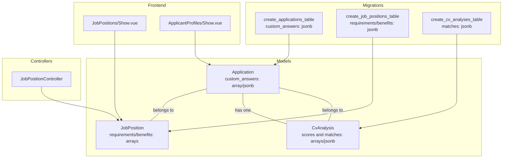
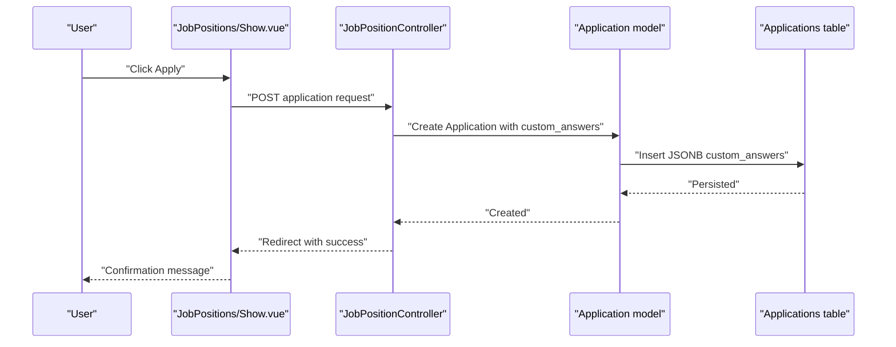
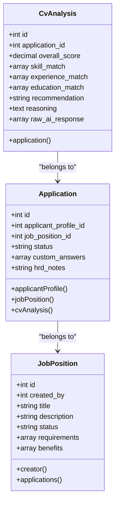
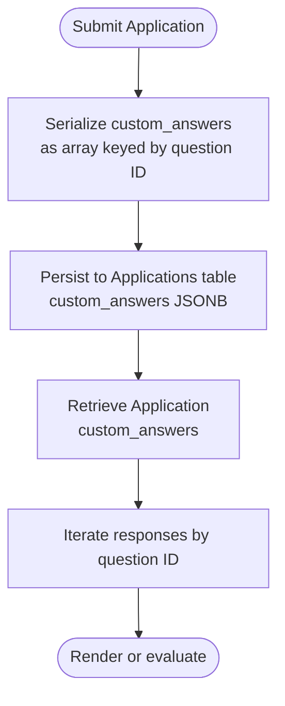
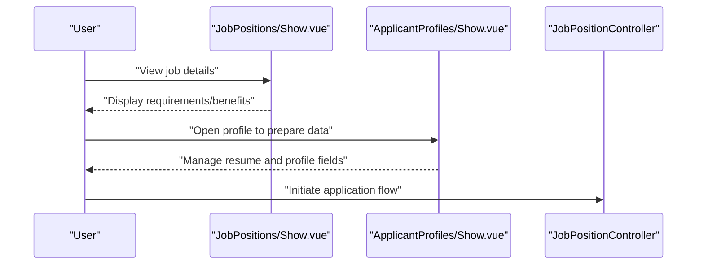
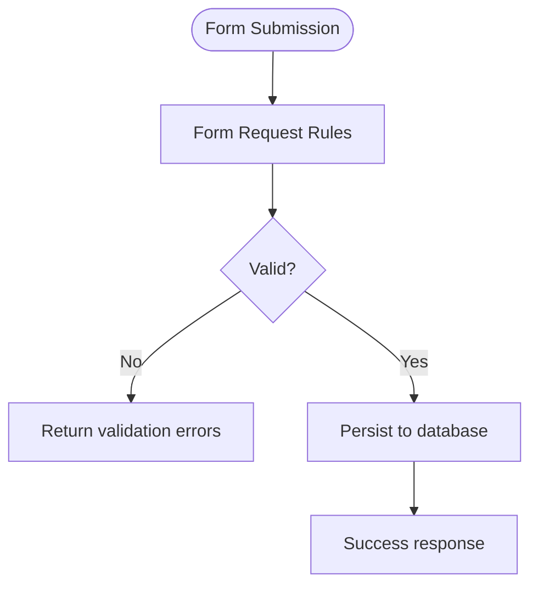
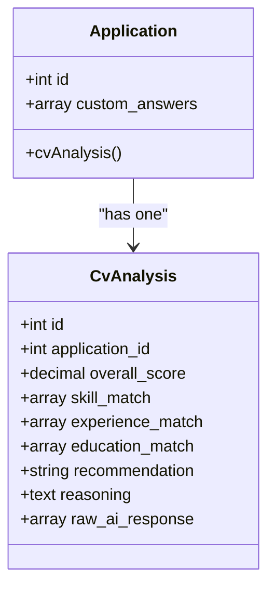
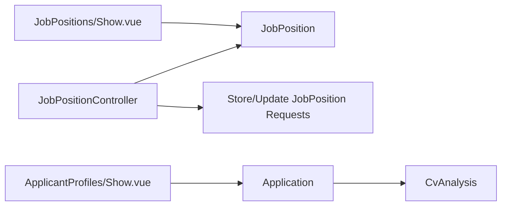

# Custom Questions & Responses

<cite>
**Referenced Files in This Document**
- [Application.php](file://app/Models/Application.php)
- [JobPosition.php](file://app/Models/JobPosition.php)
- [CvAnalysis.php](file://app/Models/CvAnalysis.php)
- [2026_06_24_164755_create_applications_table.php](file://database/migrations/2026_06_24_164755_create_applications_table.php)
- [2026_06_24_164755_create_job_positions_table.php](file://database/migrations/2026_06_24_164755_create_job_positions_table.php)
- [2026_06_24_164756_create_cv_analyses_table.php](file://database/migrations/2026_06_24_164756_create_cv_analyses_table.php)
- [JobPositionController.php](file://app/Http/Controllers/JobPositionController.php)
- [Show.vue](file://resources/js/pages/JobPositions/Show.vue)
- [Show.vue](file://resources/js/pages/ApplicantProfiles/Show.vue)
- [StoreJobPositionRequest.php](file://app/Http/Requests/StoreJobPositionRequest.php)
- [UpdateJobPositionRequest.php](file://app/Http/Requests/UpdateJobPositionRequest.php)
- [AGENTS.md](file://AGENTS.md)
- [validation.md](file://.agents/skills/laravel-best-practices/rules/validation.md)
</cite>

## Table of Contents
1. [Introduction](#introduction)
2. [Project Structure](#project-structure)
3. [Core Components](#core-components)
4. [Architecture Overview](#architecture-overview)
5. [Detailed Component Analysis](#detailed-component-analysis)
6. [Dependency Analysis](#dependency-analysis)
7. [Performance Considerations](#performance-considerations)
8. [Troubleshooting Guide](#troubleshooting-guide)
9. [Conclusion](#conclusion)
10. [Appendices](#appendices)

## Introduction
This document explains the custom questions system integrated with application tracking. It covers how job positions define custom application questions beyond standard fields, how candidates submit responses stored in the custom_answers array field, and how the system integrates with CV analysis for comprehensive candidate evaluation. It also documents frontend display patterns, backend validation, and future extensibility such as question inheritance and dynamic display logic.

## Project Structure
The custom questions system spans Eloquent models, database migrations, controllers, frontend pages, and validation requests. The relevant parts of the repository include:
- Models for applications, job positions, and CV analyses
- Migrations defining JSONB columns for flexible question-answer storage
- Controllers and requests for job position CRUD and validation
- Frontend pages for job details and candidate profile management

**Diagram sources**
- [Application.php:10-41](file://app/Models/Application.php#L10-L41)
- [JobPosition.php:10-38](file://app/Models/JobPosition.php#L10-L38)
- [CvAnalysis.php:9-37](file://app/Models/CvAnalysis.php#L9-L37)
- [2026_06_24_164755_create_applications_table.php:14-22](file://database/migrations/2026_06_24_164755_create_applications_table.php#L14-L22)
- [2026_06_24_164755_create_job_positions_table.php:14-23](file://database/migrations/2026_06_24_164755_create_job_positions_table.php#L14-L23)
- [2026_06_24_164756_create_cv_analyses_table.php:14-25](file://database/migrations/2026_06_24_164756_create_cv_analyses_table.php#L14-L25)
- [JobPositionController.php:12-54](file://app/Http/Controllers/JobPositionController.php#L12-L54)
- [Show.vue:1-101](file://resources/js/pages/JobPositions/Show.vue#L1-L101)
- [Show.vue:1-117](file://resources/js/pages/ApplicantProfiles/Show.vue#L1-L117)

**Section sources**
- [Application.php:10-41](file://app/Models/Application.php#L10-L41)
- [JobPosition.php:10-38](file://app/Models/JobPosition.php#L10-L38)
- [CvAnalysis.php:9-37](file://app/Models/CvAnalysis.php#L9-L37)
- [2026_06_24_164755_create_applications_table.php:14-22](file://database/migrations/2026_06_24_164755_create_applications_table.php#L14-L22)
- [2026_06_24_164755_create_job_positions_table.php:14-23](file://database/migrations/2026_06_24_164755_create_job_positions_table.php#L14-L23)
- [2026_06_24_164756_create_cv_analyses_table.php:14-25](file://database/migrations/2026_06_24_164756_create_cv_analyses_table.php#L14-L25)
- [JobPositionController.php:12-54](file://app/Http/Controllers/JobPositionController.php#L12-L54)
- [Show.vue:1-101](file://resources/js/pages/JobPositions/Show.vue#L1-L101)
- [Show.vue:1-117](file://resources/js/pages/ApplicantProfiles/Show.vue#L1-L117)

## Core Components
- Application model
  - Stores custom_answers as an array cast and JSONB column in the database.
  - Defines relationships to ApplicantProfile and JobPosition.
  - Has a one-to-one CvAnalysis relationship for AI-driven evaluation.
- JobPosition model
  - Stores requirements and benefits as arrays with JSONB casting.
  - Defines relationships to User (creator) and Application.
- CvAnalysis model
  - Stores structured AI analysis results including scores and match arrays.
- Migrations
  - Applications table defines custom_answers as JSONB.
  - Job positions table defines requirements and benefits as JSONB.
  - CV analyses table defines multiple JSONB fields for structured results.

Key implementation references:
- [Application.php:12-25](file://app/Models/Application.php#L12-L25)
- [2026_06_24_164755_create_applications_table.php](file://database/migrations/2026_06_24_164755_create_applications_table.php#L19)
- [JobPosition.php:21-27](file://app/Models/JobPosition.php#L21-L27)
- [2026_06_24_164755_create_job_positions_table.php:20-21](file://database/migrations/2026_06_24_164755_create_job_positions_table.php#L20-L21)
- [CvAnalysis.php:22-31](file://app/Models/CvAnalysis.php#L22-L31)
- [2026_06_24_164756_create_cv_analyses_table.php:17-23](file://database/migrations/2026_06_24_164756_create_cv_analyses_table.php#L17-L23)

**Section sources**
- [Application.php:10-41](file://app/Models/Application.php#L10-L41)
- [JobPosition.php:10-38](file://app/Models/JobPosition.php#L10-L38)
- [CvAnalysis.php:9-37](file://app/Models/CvAnalysis.php#L9-L37)
- [2026_06_24_164755_create_applications_table.php:14-22](file://database/migrations/2026_06_24_164755_create_applications_table.php#L14-L22)
- [2026_06_24_164755_create_job_positions_table.php:14-23](file://database/migrations/2026_06_24_164755_create_job_positions_table.php#L14-L23)
- [2026_06_24_164756_create_cv_analyses_table.php:14-25](file://database/migrations/2026_06_24_164756_create_cv_analyses_table.php#L14-L25)

## Architecture Overview
The system separates concerns across models, migrations, controllers, and frontend pages:
- JobPositionController handles job position CRUD and delegates validation to Form Requests.
- Frontend pages render job details and candidate profile forms.
- Application model persists custom_answers and links to CV analysis.
- CV analysis stores AI-derived insights for candidate evaluation.

**Diagram sources**
- [JobPositionController.php:22-27](file://app/Http/Controllers/JobPositionController.php#L22-L27)
- [Application.php:12-25](file://app/Models/Application.php#L12-L25)
- [2026_06_24_164755_create_applications_table.php](file://database/migrations/2026_06_24_164755_create_applications_table.php#L19)
- [Show.vue:92-96](file://resources/js/pages/JobPositions/Show.vue#L92-L96)

## Detailed Component Analysis

### Application Model and Storage
- Field: custom_answers
  - Eloquent cast: array
  - Database column: JSONB custom_answers
  - Purpose: Stores candidate responses to job-specific custom questions
- Relationships
  - belongs to ApplicantProfile
  - belongs to JobPosition
  - has one CvAnalysis

**Diagram sources**
- [Application.php:10-41](file://app/Models/Application.php#L10-L41)
- [JobPosition.php:10-38](file://app/Models/JobPosition.php#L10-L38)
- [CvAnalysis.php:9-37](file://app/Models/CvAnalysis.php#L9-L37)

**Section sources**
- [Application.php:12-25](file://app/Models/Application.php#L12-L25)
- [2026_06_24_164755_create_applications_table.php](file://database/migrations/2026_06_24_164755_create_applications_table.php#L19)
- [CvAnalysis.php:22-31](file://app/Models/CvAnalysis.php#L22-L31)

### Question Types and Validation
- Current state
  - Job positions support requirements and benefits as arrays.
  - Applications support custom_answers as an array.
- Extending for custom questions
  - Define question configurations in job positions (e.g., as JSON in a future requirements/benefits expansion).
  - Validate and serialize responses in custom_answers with question ID keys and typed values.
  - Enforce required fields and validation rules via Form Requests and backend logic.

Note: The current schema does not yet include a dedicated questions array on JobPosition. Extending it would involve:
- Adding a JSONB column for questions on job_positions
- Updating validation rules and controllers
- Implementing frontend rendering and backend persistence

**Section sources**
- [JobPosition.php:21-27](file://app/Models/JobPosition.php#L21-L27)
- [StoreJobPositionRequest.php:23-32](file://app/Http/Requests/StoreJobPositionRequest.php#L23-L32)
- [UpdateJobPositionRequest.php:23-32](file://app/Http/Requests/UpdateJobPositionRequest.php#L23-L32)

### Data Serialization and Retrieval Patterns
- Serialization
  - custom_answers stored as JSONB; Eloquent casts to array for PHP-side handling.
- Retrieval
  - Access via Application->custom_answers; iterate and map to question IDs.
  - Use array keys to correlate with question definitions.

**Diagram sources**
- [Application.php:22-24](file://app/Models/Application.php#L22-L24)
- [2026_06_24_164755_create_applications_table.php](file://database/migrations/2026_06_24_164755_create_applications_table.php#L19)

**Section sources**
- [Application.php:22-24](file://app/Models/Application.php#L22-L24)
- [2026_06_24_164755_create_applications_table.php](file://database/migrations/2026_06_24_164755_create_applications_table.php#L19)

### Frontend Implementation for Job-Specific Questions
- Job details page
  - Renders job title, description, requirements, and benefits.
  - Contains an Apply button placeholder for initiating application.
- Candidate profile page
  - Manages resume upload and profile data (skills, experience, education, portfolio URLs).
  - Serves as a foundation for integrating custom question UI.

**Diagram sources**
- [Show.vue:35-101](file://resources/js/pages/JobPositions/Show.vue#L35-L101)
- [Show.vue:47-117](file://resources/js/pages/ApplicantProfiles/Show.vue#L47-L117)
- [JobPositionController.php:29-35](file://app/Http/Controllers/JobPositionController.php#L29-L35)

**Section sources**
- [Show.vue:35-101](file://resources/js/pages/JobPositions/Show.vue#L35-L101)
- [Show.vue:47-117](file://resources/js/pages/ApplicantProfiles/Show.vue#L47-L117)
- [JobPositionController.php:14-35](file://app/Http/Controllers/JobPositionController.php#L14-L35)

### Backend Validation Process
- Job position creation and updates use Form Requests with strict rules.
- Validation ensures required fields and acceptable values for job metadata.
- For custom questions, extend Form Requests to validate custom_answers against question definitions.

**Diagram sources**
- [StoreJobPositionRequest.php:13-32](file://app/Http/Requests/StoreJobPositionRequest.php#L13-L32)
- [UpdateJobPositionRequest.php:13-32](file://app/Http/Requests/UpdateJobPositionRequest.php#L13-L32)

**Section sources**
- [StoreJobPositionRequest.php:13-32](file://app/Http/Requests/StoreJobPositionRequest.php#L13-L32)
- [UpdateJobPositionRequest.php:13-32](file://app/Http/Requests/UpdateJobPositionRequest.php#L13-L32)
- [validation.md:3-24](file://.agents/skills/laravel-best-practices/rules/validation.md#L3-L24)

### CV Analysis Integration
- CvAnalysis stores structured AI results including overall_score and match arrays.
- Integrates with Application via a one-to-one relationship.
- Supports comprehensive candidate evaluation alongside custom_answers.

**Diagram sources**
- [Application.php:37-40](file://app/Models/Application.php#L37-L40)
- [CvAnalysis.php:33-36](file://app/Models/CvAnalysis.php#L33-L36)
- [2026_06_24_164756_create_cv_analyses_table.php:17-23](file://database/migrations/2026_06_24_164756_create_cv_analyses_table.php#L17-L23)

**Section sources**
- [CvAnalysis.php:22-31](file://app/Models/CvAnalysis.php#L22-L31)
- [2026_06_24_164756_create_cv_analyses_table.php:14-25](file://database/migrations/2026_06_24_164756_create_cv_analyses_table.php#L14-L25)

### Examples and Patterns
- Question configuration (conceptual)
  - Define question arrays on JobPosition with fields like id, type, label, required, choices, and validation rules.
  - Example reference: [JobPosition.php:21-27](file://app/Models/JobPosition.php#L21-L27)
- Response management (conceptual)
  - On application submission, collect responses keyed by question ID and persist to custom_answers.
  - Example reference: [Application.php:22-24](file://app/Models/Application.php#L22-L24)
- Filtering/search capabilities (conceptual)
  - Use JSONB operators to filter applications by presence of specific answers or match criteria.
  - Reference: [AGENTS.md:1317-1327](file://AGENTS.md#L1317-L1327)

**Section sources**
- [JobPosition.php:21-27](file://app/Models/JobPosition.php#L21-L27)
- [Application.php:22-24](file://app/Models/Application.php#L22-L24)
- [AGENTS.md:1317-1327](file://AGENTS.md#L1317-L1327)

## Dependency Analysis
- Application depends on JobPosition and CvAnalysis.
- JobPosition depends on User (creator) and has many Applications.
- Controllers depend on models and Form Requests.
- Frontend pages depend on Inertia for server-rendered props.

**Diagram sources**
- [JobPositionController.php:12-54](file://app/Http/Controllers/JobPositionController.php#L12-L54)
- [JobPosition.php:29-37](file://app/Models/JobPosition.php#L29-L37)
- [Application.php:27-40](file://app/Models/Application.php#L27-L40)
- [Show.vue:1-101](file://resources/js/pages/JobPositions/Show.vue#L1-L101)
- [Show.vue:1-117](file://resources/js/pages/ApplicantProfiles/Show.vue#L1-L117)

**Section sources**
- [JobPositionController.php:12-54](file://app/Http/Controllers/JobPositionController.php#L12-L54)
- [JobPosition.php:29-37](file://app/Models/JobPosition.php#L29-L37)
- [Application.php:27-40](file://app/Models/Application.php#L27-L40)

## Performance Considerations
- Prefer JSONB columns for flexible question-answer storage while indexing frequently queried fields.
- Use pagination and eager loading for listing applications and job positions.
- Avoid N+1 queries when loading applications with job details and CV analysis.
- Queue long-running AI analysis tasks to keep UI responsive.

Reference guidance:
- [AGENTS.md:1371-1378](file://AGENTS.md#L1371-L1378)

**Section sources**
- [AGENTS.md:1371-1378](file://AGENTS.md#L1371-L1378)

## Troubleshooting Guide
- Validation failures
  - Ensure Form Requests are used and validated() is called to avoid mass assignment issues.
  - Reference: [validation.md:38-50](file://.agents/skills/laravel-best-practices/rules/validation.md#L38-L50)
- JSONB parsing errors
  - Verify custom_answers serialization and ensure keys match question IDs.
  - Reference: [Application.php:22-24](file://app/Models/Application.php#L22-L24)
- Missing or incorrect relationships
  - Confirm foreign keys and relationship definitions.
  - References: [Application.php:27-40](file://app/Models/Application.php#L27-L40), [CvAnalysis.php:33-36](file://app/Models/CvAnalysis.php#L33-L36)

**Section sources**
- [validation.md:38-50](file://.agents/skills/laravel-best-practices/rules/validation.md#L38-L50)
- [Application.php:22-24](file://app/Models/Application.php#L22-L24)
- [CvAnalysis.php:33-36](file://app/Models/CvAnalysis.php#L33-L36)

## Conclusion
The custom questions system leverages JSONB storage for flexible, scalable question-answer handling integrated with application tracking and CV analysis. While the current schema focuses on job metadata and application responses, extending it to include explicit question definitions, dynamic display logic, and inheritance from templates will enable robust, candidate-centric hiring workflows.

## Appendices
- Security and data handling guidelines
  - Keep AI analysis auditable and avoid exposing secrets.
  - Reference: [AGENTS.md:806-821](file://AGENTS.md#L806-L821)

**Section sources**
- [AGENTS.md:806-821](file://AGENTS.md#L806-L821)