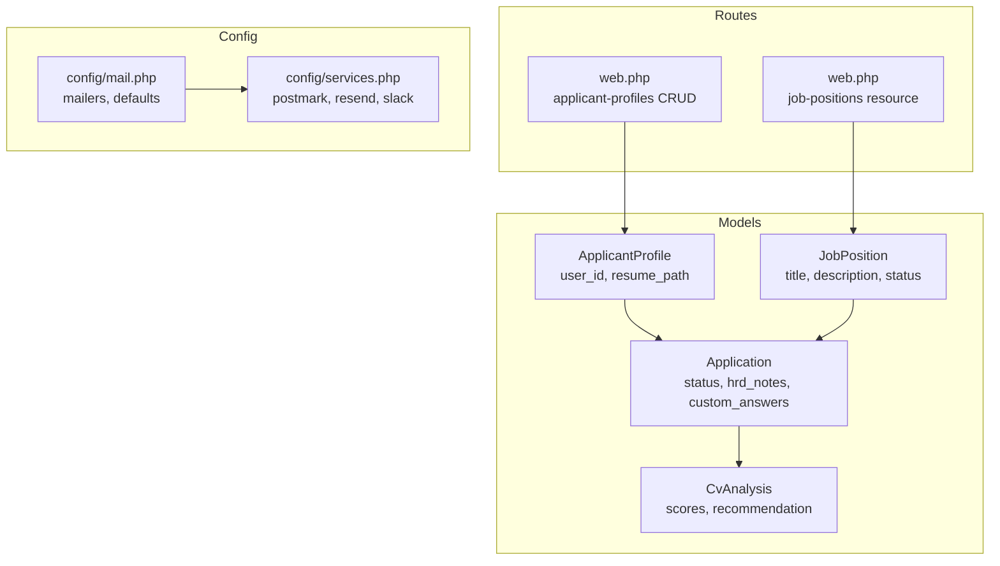
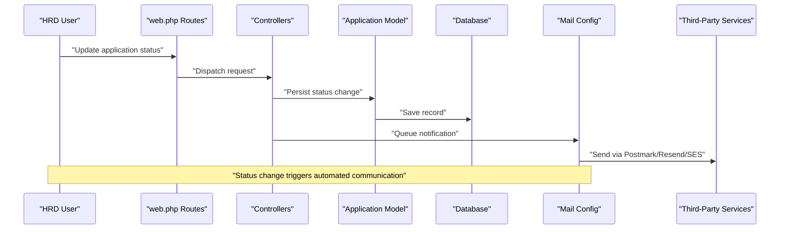
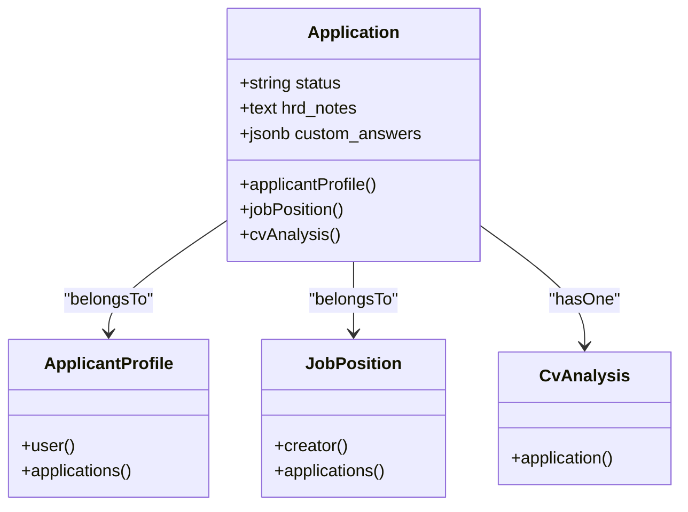

# Status Tracking & Communication

<cite>
**Referenced Files in This Document**
- [Application.php](file://app/Models/Application.php)
- [2026_06_24_164755_create_applications_table.php](file://database/migrations/2026_06_24_164755_create_applications_table.php)
- [ApplicantProfile.php](file://app/Models/ApplicantProfile.php)
- [JobPosition.php](file://app/Models/JobPosition.php)
- [CvAnalysis.php](file://app/Models/CvAnalysis.php)
- [web.php](file://routes/web.php)
- [mail.php](file://config/mail.php)
- [services.php](file://config/services.php)
- [events-notifications.md](file://.agents/skills/laravel-best-practices/rules/events-notifications.md)
- [AGENTS.md](file://AGENTS.md)
- [CONTEXT.md](file://CONTEXT.md)
</cite>

## Table of Contents
1. [Introduction](#introduction)
2. [Project Structure](#project-structure)
3. [Core Components](#core-components)
4. [Architecture Overview](#architecture-overview)
5. [Detailed Component Analysis](#detailed-component-analysis)
6. [Dependency Analysis](#dependency-analysis)
7. [Performance Considerations](#performance-considerations)
8. [Troubleshooting Guide](#troubleshooting-guide)
9. [Conclusion](#conclusion)

## Introduction
This document describes the status tracking and communication system for the application tracking workflow. It explains the status field implementation, available status values, transition rules, automated notification mechanisms, email configuration, HRD notes for internal evaluation, bulk operations, filtering for reporting, historical tracking, and integration with external channels and the candidate portal.

## Project Structure
The status tracking system centers on the Application model and its relationships with profiles, positions, and AI analysis. Routes expose endpoints for managing job positions and applicant profiles, while configuration files define email and third-party service integrations used for notifications.

**Diagram sources**
- [Application.php:10-41](file://app/Models/Application.php#L10-L41)
- [ApplicantProfile.php:10-39](file://app/Models/ApplicantProfile.php#L10-L39)
- [JobPosition.php:10-38](file://app/Models/JobPosition.php#L10-L38)
- [CvAnalysis.php:9-37](file://app/Models/CvAnalysis.php#L9-L37)
- [web.php:18-29](file://routes/web.php#L18-L29)
- [mail.php:17](file://config/mail.php#L17)
- [services.php:17-36](file://config/services.php#L17-L36)

**Section sources**
- [web.php:18-29](file://routes/web.php#L18-L29)
- [Application.php:10-41](file://app/Models/Application.php#L10-L41)
- [ApplicantProfile.php:10-39](file://app/Models/ApplicantProfile.php#L10-L39)
- [JobPosition.php:10-38](file://app/Models/JobPosition.php#L10-L38)
- [CvAnalysis.php:9-37](file://app/Models/CvAnalysis.php#L9-L37)
- [mail.php:17](file://config/mail.php#L17)
- [services.php:17-36](file://config/services.php#L17-L36)

## Core Components
- Application model defines the status field, HRD notes, and custom answers, and relates to ApplicantProfile, JobPosition, and CvAnalysis.
- Migration establishes the applications table with default status and nullable HRD notes.
- Relationships enable joining applications with profiles, positions, and AI analysis results.
- Routes expose job positions and applicant profiles for HRD operations.

Key implementation references:
- [Application fillable fields:12-18](file://app/Models/Application.php#L12-L18)
- [Application casts:20-25](file://app/Models/Application.php#L20-L25)
- [Application relations:27-40](file://app/Models/Application.php#L27-L40)
- [Applications table schema:14-22](file://database/migrations/2026_06_24_164755_create_applications_table.php#L14-L22)
- [ApplicantProfile relations:31-39](file://app/Models/ApplicantProfile.php#L31-L39)
- [JobPosition relations:29-37](file://app/Models/JobPosition.php#L29-L37)
- [CvAnalysis casts:22-31](file://app/Models/CvAnalysis.php#L22-L31)

**Section sources**
- [Application.php:10-41](file://app/Models/Application.php#L10-L41)
- [2026_06_24_164755_create_applications_table.php:12-22](file://database/migrations/2026_06_24_164755_create_applications_table.php#L12-L22)
- [ApplicantProfile.php:10-39](file://app/Models/ApplicantProfile.php#L10-L39)
- [JobPosition.php:10-38](file://app/Models/JobPosition.php#L10-L38)
- [CvAnalysis.php:9-37](file://app/Models/CvAnalysis.php#L9-L37)

## Architecture Overview
The status tracking workflow integrates model persistence, route exposure, and notification delivery. When an Application status changes, the system can trigger notifications via queued channels (email, Slack). The candidate portal can surface status updates through the existing routes and controllers.

**Diagram sources**
- [web.php:18-29](file://routes/web.php#L18-L29)
- [Application.php:10-41](file://app/Models/Application.php#L10-L41)
- [mail.php:17](file://config/mail.php#L17)
- [services.php:17-36](file://config/services.php#L17-L36)

## Detailed Component Analysis

### Status Field Implementation
- The status field is stored as a string with a default value on application creation.
- HRD notes are stored as text and can be updated alongside status.
- Custom answers are stored as JSONB for flexible, structured candidate responses.

References:
- [Default status in migration](file://database/migrations/2026_06_24_164755_create_applications_table.php#L18)
- [Nullable HRD notes](file://database/migrations/2026_06_24_164755_create_applications_table.php#L20)
- [Custom answers cast to array:22-24](file://app/Models/Application.php#L22-L24)

**Section sources**
- [2026_06_24_164755_create_applications_table.php:18-20](file://database/migrations/2026_06_24_164755_create_applications_table.php#L18-L20)
- [Application.php:20-25](file://app/Models/Application.php#L20-L25)

### Available Status Values
According to project guidelines, the candidate application lifecycle uses the following statuses:
- new
- reviewing
- shortlisted
- interview
- rejected
- accepted

These values inform UI filters, reporting, and automated workflows.

References:
- [Status enumeration:1328-1337](file://AGENTS.md#L1328-L1337)

**Section sources**
- [AGENTS.md:1328-1337](file://AGENTS.md#L1328-L1337)

### Transition Rules Between States
- The system defines a canonical set of statuses for the application lifecycle.
- Transition rules should enforce logical progression (e.g., new → reviewing → shortlisted/interview/rejected) and prevent invalid regressions.
- UI and controllers should validate transitions and log changes for auditability.

References:
- [Lifecycle statuses:1328-1337](file://AGENTS.md#L1328-L1337)

**Section sources**
- [AGENTS.md:1328-1337](file://AGENTS.md#L1328-L1337)

### Automated Notification System for Status Changes
- Notifications must be queued to avoid blocking HTTP responses.
- Use transaction-aware dispatching to ensure notifications fire after successful persistence.
- Route notifications to dedicated queues for mail and database channels.

References:
- [Events & Notifications best practices:11-36](file://.agents/skills/laravel-best-practices/rules/events-notifications.md#L11-L36)

**Section sources**
- [.agents/skills/laravel-best-practices/rules/events-notifications.md:11-36](file://.agents/skills/laravel-best-practices/rules/events-notifications.md#L11-L36)

### Email Templates and Candidate Communication Workflows
- Configure mailers (Postmark, Resend, SES) and default sender in the mail configuration.
- Use on-demand notifications for recipient-specific emails.
- Implement localized notifications by implementing locale preference on notifiable models.

References:
- [Mail configuration](file://config/mail.php#L17)
- [Third-party services:17-36](file://config/services.php#L17-L36)
- [Notification best practices:42-52](file://.agents/skills/laravel-best-practices/rules/events-notifications.md#L42-L52)

**Section sources**
- [mail.php:17](file://config/mail.php#L17)
- [services.php:17-36](file://config/services.php#L17-L36)
- [.agents/skills/laravel-best-practices/rules/events-notifications.md:42-52](file://.agents/skills/laravel-best-practices/rules/events-notifications.md#L42-L52)

### HRD Notes Functionality
- HRD notes are stored as text on the Application record and can accompany status updates.
- Use dedicated forms and controllers to capture and persist notes alongside status changes.
- Ensure access control and authorization for HRD-only fields.

References:
- [HRD notes column](file://database/migrations/2026_06_24_164755_create_applications_table.php#L20)
- [Authorization guidance:844-851](file://AGENTS.md#L844-L851)

**Section sources**
- [2026_06_24_164755_create_applications_table.php:20](file://database/migrations/2026_06_24_164755_create_applications_table.php#L20)
- [AGENTS.md:844-851](file://AGENTS.md#L844-L851)

### Examples of Status Update Triggers and Communication Timing
- Trigger: Status change via HRD interface.
- Timing: Dispatch notifications after commit to ensure data consistency.
- Channel: Email via configured mailers; optional Slack notifications via services.

References:
- [Transaction-safe notifications:11-36](file://.agents/skills/laravel-best-practices/rules/events-notifications.md#L11-L36)
- [Slack service configuration:31-36](file://config/services.php#L31-L36)

**Section sources**
- [.agents/skills/laravel-best-practices/rules/events-notifications.md:11-36](file://.agents/skills/laravel-best-practices/rules/events-notifications.md#L11-L36)
- [services.php:31-36](file://config/services.php#L31-L36)

### Compliance Requirements
- Protect sensitive data and ensure authorization for accessing HRD notes and candidate information.
- Use environment variables for credentials and avoid exposing secrets.
- Validate and sanitize all inputs for status updates and notes.

References:
- [Security rules:824-842](file://AGENTS.md#L824-L842)
- [File upload and CV handling:854-866](file://AGENTS.md#L854-L866)

**Section sources**
- [AGENTS.md:824-866](file://AGENTS.md#L824-L866)

### Bulk Status Operations
- Use collection operations and batch updates to minimize database round-trips.
- Prefer lazy iteration with ID-based pagination for large sets.
- Apply higher-order messages for concise transformations.

References:
- [Collection best practices:16-36](file://.agents/skills/laravel-best-practices/rules/collections.md#L16-L36)

**Section sources**
- [.agents/skills/laravel-best-practices/rules/collections.md:16-36](file://.agents/skills/laravel-best-practices/rules/collections.md#L16-L36)

### Status Filtering for Reporting
- Filter applications by status for dashboards and reports.
- Use indexed fields for efficient filtering and sorting.
- Aggregate counts per status for funnel visualization.

References:
- [Indexing guidance:1324-1326](file://AGENTS.md#L1324-L1326)

**Section sources**
- [AGENTS.md:1324-1326](file://AGENTS.md#L1324-L1326)

### Historical Status Tracking for Analytics
- Persist status changes with timestamps to enable funnel analytics and trend analysis.
- Use dedicated audit tables or append-only status logs for compliance and insights.

References:
- [Auditability emphasis:1326-1327](file://AGENTS.md#L1326-L1327)

**Section sources**
- [AGENTS.md:1326-1327](file://AGENTS.md#L1326-L1327)

### Integration with External Communication Channels and Candidate Portal Updates
- Use dedicated routes for job positions and applicant profiles to surface status changes in the UI.
- Integrate Slack notifications via services configuration for team alerts.
- Ensure candidate portal reflects status updates through the existing resource routes.

References:
- [Job positions resource routes](file://routes/web.php#L23)
- [Applicant profiles routes:25-29](file://routes/web.php#L25-L29)
- [Slack services:31-36](file://config/services.php#L31-L36)

**Section sources**
- [web.php:23](file://routes/web.php#L23)
- [web.php:25-29](file://routes/web.php#L25-L29)
- [services.php:31-36](file://config/services.php#L31-L36)

## Dependency Analysis
The Application model depends on ApplicantProfile and JobPosition, and is extended by CvAnalysis. Routes expose controllers for job positions and applicant profiles. Mail and services configurations underpin notification delivery.

**Diagram sources**
- [Application.php:10-41](file://app/Models/Application.php#L10-L41)
- [ApplicantProfile.php:10-39](file://app/Models/ApplicantProfile.php#L10-L39)
- [JobPosition.php:10-38](file://app/Models/JobPosition.php#L10-L38)
- [CvAnalysis.php:9-37](file://app/Models/CvAnalysis.php#L9-L37)

**Section sources**
- [Application.php:10-41](file://app/Models/Application.php#L10-L41)
- [ApplicantProfile.php:10-39](file://app/Models/ApplicantProfile.php#L10-L39)
- [JobPosition.php:10-38](file://app/Models/JobPosition.php#L10-L38)
- [CvAnalysis.php:9-37](file://app/Models/CvAnalysis.php#L9-L37)

## Performance Considerations
- Use indexed status fields for filtering and reporting.
- Batch operations and lazy iteration for bulk updates.
- Queue notifications to avoid blocking requests.
- Avoid eager loading entire relationships when only scalar values are needed.

[No sources needed since this section provides general guidance]

## Troubleshooting Guide
- If notifications are not delivered, verify mailer configuration and credentials.
- If status updates appear inconsistent, ensure transaction-aware dispatching and after-commit queuing.
- If routes are missing, confirm resource routes for job positions and applicant profiles are registered.

References:
- [Mailer defaults](file://config/mail.php#L17)
- [Events & Notifications best practices:11-36](file://.agents/skills/laravel-best-practices/rules/events-notifications.md#L11-L36)
- [Routes](file://routes/web.php#L23)

**Section sources**
- [mail.php:17](file://config/mail.php#L17)
- [.agents/skills/laravel-best-practices/rules/events-notifications.md:11-36](file://.agents/skills/laravel-best-practices/rules/events-notifications.md#L11-L36)
- [web.php:23](file://routes/web.php#L23)

## Conclusion
The status tracking and communication system leverages a clear status model, robust relationships, and configurable notifications. By enforcing transition rules, using queued notifications, and integrating with mail and Slack services, the system supports transparent candidate communication and internal HRD workflows. Extending the design with audit trails, bulk operations, and optimized filtering will further strengthen reporting and scalability.