# Authentication & Authorization

<cite>
**Referenced Files in This Document**
- [User.php](file://app/Models/User.php)
- [auth.php](file://config/auth.php)
- [fortify.php](file://config/fortify.php)
- [session.php](file://config/session.php)
- [FortifyServiceProvider.php](file://app/Providers/FortifyServiceProvider.php)
- [CreateNewUser.php](file://app/Actions/Fortify/CreateNewUser.php)
- [ResetUserPassword.php](file://app/Actions/Fortify/ResetUserPassword.php)
- [PasswordValidationRules.php](file://app/Concerns/PasswordValidationRules.php)
- [ProfileValidationRules.php](file://app/Concerns/ProfileValidationRules.php)
- [2026_06_24_164756_add_role_and_metadata_to_users_table.php](file://database/migrations/2026_06_24_164756_add_role_and_metadata_to_users_table.php)
- [2025_08_14_170933_add_two_factor_columns_to_users_table.php](file://database/migrations/2025_08_14_170933_add_two_factor_columns_to_users_table.php)
- [2024_01_01_000000_create_passkeys_table.php](file://database/migrations/2024_01_01_000000_create_passkeys_table.php)
- [0001_01_01_000000_create_users_table.php](file://database/migrations/0001_01_01_000000_create_users_table.php)
- [Login.vue](file://resources/js/pages/auth/Login.vue)
- [Register.vue](file://resources/js/pages/auth/Register.vue)
- [TwoFactorChallenge.vue](file://resources/js/pages/auth/TwoFactorChallenge.vue)
- [ForgotPassword.vue](file://resources/js/pages/auth/ForgotPassword.vue)
- [ResetPassword.vue](file://resources/js/pages/auth/ResetPassword.vue)
- [VerifyEmail.vue](file://resources/js/pages/auth/VerifyEmail.vue)
- [Security.vue](file://resources/js/pages/settings/Security.vue)
- [Profile.vue](file://resources/js/pages/settings/Profile.vue)
- [SecurityController.php](file://app/Http/Controllers/Settings/SecurityController.php)
- [ProfileController.php](file://app/Http/Controllers/Settings/ProfileController.php)
- [TwoFactorAuthenticationRequest.php](file://app/Http/Requests/Settings/TwoFactorAuthenticationRequest.php)
- [PasswordUpdateRequest.php](file://app/Http/Requests/Settings/PasswordUpdateRequest.php)
- [ProfileUpdateRequest.php](file://app/Http/Requests/Settings/ProfileUpdateRequest.php)
- [ProfileDeleteRequest.php](file://app/Http/Requests/Settings/ProfileDeleteRequest.php)
- [settings.php](file://routes/settings.php)
- [web.php](file://routes/web.php)
</cite>

## Table of Contents
1. [Introduction](#introduction)
2. [Project Structure](#project-structure)
3. [Core Components](#core-components)
4. [Architecture Overview](#architecture-overview)
5. [Detailed Component Analysis](#detailed-component-analysis)
6. [Dependency Analysis](#dependency-analysis)
7. [Performance Considerations](#performance-considerations)
8. [Troubleshooting Guide](#troubleshooting-guide)
9. [Conclusion](#conclusion)
10. [Appendices](#appendices)

## Introduction
This document provides comprehensive authentication and authorization documentation for SmartRecruit ATS. It details the Laravel Fortify implementation covering registration, login, password reset, and email verification. It explains the enhanced User model with role-based access control (HRD vs candidate roles) and metadata management. It also covers two-factor authentication setup and verification (including backup codes and authenticator apps), passkey authentication using the WebAuthn protocol for passwordless login, security middleware, session management, and CSRF protection. Practical examples of authentication flows, role-based route protection, and permission checking are included, along with security best practices, token management, and account security features.

## Project Structure
SmartRecruit ATS integrates Laravel Fortify for authentication services and Inertia.js for a modern frontend experience. The backend configuration resides in configuration files, while the frontend authentication views are Vue components. The User model is extended with passkey and two-factor capabilities, and database migrations define the schema for users, sessions, password resets, passkeys, and two-factor fields.

```mermaid
graph TB
subgraph "Configuration"
CFG_AUTH["config/auth.php"]
CFG_FORTIFY["config/fortify.php"]
CFG_SESSION["config/session.php"]
end
subgraph "Providers"
FORTIFY_PROVIDER["app/Providers/FortifyServiceProvider.php"]
end
subgraph "Models"
MODEL_USER["app/Models/User.php"]
end
subgraph "Actions"
ACTION_CREATE["app/Actions/Fortify/CreateNewUser.php"]
ACTION_RESET["app/Actions/Fortify/ResetUserPassword.php"]
end
subgraph "Concerns"
CONC_PW["app/Concerns/PasswordValidationRules.php"]
CONC_PROFILE["app/Concerns/ProfileValidationRules.php"]
end
subgraph "Migrations"
MIG_USERS["database/migrations/0001_01_01_000000_create_users_table.php"]
MIG_ROLE["database/migrations/2026_06_24_164756_add_role_and_metadata_to_users_table.php"]
MIG_2FA["database/migrations/2025_08_14_170933_add_two_factor_columns_to_users_table.php"]
MIG_PASSKEY["database/migrations/2024_01_01_000000_create_passkeys_table.php"]
end
subgraph "Frontend Views"
VIEW_LOGIN["resources/js/pages/auth/Login.vue"]
VIEW_REGISTER["resources/js/pages/auth/Register.vue"]
VIEW_2FA["resources/js/pages/auth/TwoFactorChallenge.vue"]
VIEW_FORGOT["resources/js/pages/auth/ForgotPassword.vue"]
VIEW_RESET["resources/js/pages/auth/ResetPassword.vue"]
VIEW_VERIFY["resources/js/pages/auth/VerifyEmail.vue"]
VIEW_SECURITY["resources/js/pages/settings/Security.vue"]
VIEW_PROFILE["resources/js/pages/settings/Profile.vue"]
end
CFG_AUTH --> MODEL_USER
CFG_FORTIFY --> FORTIFY_PROVIDER
CFG_SESSION --> CFG_FORTIFY
FORTIFY_PROVIDER --> ACTION_CREATE
FORTIFY_PROVIDER --> ACTION_RESET
ACTION_CREATE --> CONC_PW
ACTION_CREATE --> CONC_PROFILE
ACTION_RESET --> CONC_PW
MODEL_USER --> MIG_USERS
MODEL_USER --> MIG_ROLE
MODEL_USER --> MIG_2FA
MODEL_USER --> MIG_PASSKEY
VIEW_LOGIN --> CFG_FORTIFY
VIEW_REGISTER --> CFG_FORTIFY
VIEW_2FA --> CFG_FORTIFY
VIEW_FORGOT --> CFG_FORTIFY
VIEW_RESET --> CFG_FORTIFY
VIEW_VERIFY --> CFG_FORTIFY
VIEW_SECURITY --> CFG_AUTH
VIEW_PROFILE --> CFG_AUTH
```

**Diagram sources**
- [auth.php:1-118](file://config/auth.php#L1-L118)
- [fortify.php:1-178](file://config/fortify.php#L1-L178)
- [session.php:1-234](file://config/session.php#L1-L234)
- [FortifyServiceProvider.php:1-101](file://app/Providers/FortifyServiceProvider.php#L1-L101)
- [User.php:1-62](file://app/Models/User.php#L1-L62)
- [CreateNewUser.php:1-34](file://app/Actions/Fortify/CreateNewUser.php#L1-L34)
- [ResetUserPassword.php:1-30](file://app/Actions/Fortify/ResetUserPassword.php#L1-L30)
- [PasswordValidationRules.php:1-30](file://app/Concerns/PasswordValidationRules.php#L1-L30)
- [ProfileValidationRules.php:1-52](file://app/Concerns/ProfileValidationRules.php#L1-L52)
- [0001_01_01_000000_create_users_table.php:1-50](file://database/migrations/0001_01_01_000000_create_users_table.php#L1-L50)
- [2026_06_24_164756_add_role_and_metadata_to_users_table.php:1-30](file://database/migrations/2026_06_24_164756_add_role_and_metadata_to_users_table.php#L1-L30)
- [2025_08_14_170933_add_two_factor_columns_to_users_table.php:1-35](file://database/migrations/2025_08_14_170933_add_two_factor_columns_to_users_table.php#L1-L35)
- [2024_01_01_000000_create_passkeys_table.php:1-35](file://database/migrations/2024_01_01_000000_create_passkeys_table.php#L1-L35)
- [Login.vue:1-111](file://resources/js/pages/auth/Login.vue#L1-L111)
- [Register.vue:1-115](file://resources/js/pages/auth/Register.vue#L1-L115)
- [TwoFactorChallenge.vue](file://resources/js/pages/auth/TwoFactorChallenge.vue)
- [ForgotPassword.vue](file://resources/js/pages/auth/ForgotPassword.vue)
- [ResetPassword.vue](file://resources/js/pages/auth/ResetPassword.vue)
- [VerifyEmail.vue](file://resources/js/pages/auth/VerifyEmail.vue)
- [Security.vue](file://resources/js/pages/settings/Security.vue)
- [Profile.vue](file://resources/js/pages/settings/Profile.vue)

**Section sources**
- [auth.php:1-118](file://config/auth.php#L1-L118)
- [fortify.php:1-178](file://config/fortify.php#L1-L178)
- [session.php:1-234](file://config/session.php#L1-L234)
- [FortifyServiceProvider.php:1-101](file://app/Providers/FortifyServiceProvider.php#L1-L101)
- [User.php:1-62](file://app/Models/User.php#L1-L62)
- [CreateNewUser.php:1-34](file://app/Actions/Fortify/CreateNewUser.php#L1-L34)
- [ResetUserPassword.php:1-30](file://app/Actions/Fortify/ResetUserPassword.php#L1-L30)
- [PasswordValidationRules.php:1-30](file://app/Concerns/PasswordValidationRules.php#L1-L30)
- [ProfileValidationRules.php:1-52](file://app/Concerns/ProfileValidationRules.php#L1-L52)
- [0001_01_01_000000_create_users_table.php:1-50](file://database/migrations/0001_01_01_000000_create_users_table.php#L1-L50)
- [2026_06_24_164756_add_role_and_metadata_to_users_table.php:1-30](file://database/migrations/2026_06_24_164756_add_role_and_metadata_to_users_table.php#L1-L30)
- [2025_08_14_170933_add_two_factor_columns_to_users_table.php:1-35](file://database/migrations/2025_08_14_170933_add_two_factor_columns_to_users_table.php#L1-L35)
- [2024_01_01_000000_create_passkeys_table.php:1-35](file://database/migrations/2024_01_01_000000_create_passkeys_table.php#L1-L35)
- [Login.vue:1-111](file://resources/js/pages/auth/Login.vue#L1-L111)
- [Register.vue:1-115](file://resources/js/pages/auth/Register.vue#L1-L115)

## Core Components
- Authentication configuration: Defines guards, providers, password reset behavior, and timeouts.
- Fortify configuration: Enables registration, password reset, email verification, two-factor authentication, and passkeys with rate limits and view rendering.
- Session configuration: Controls driver, lifetime, cookie policies, and serialization.
- User model: Implements passkey and two-factor authentication, manages role and metadata, and defines relationships.
- Fortify actions: Encapsulate creation and password reset logic with validation.
- Frontend authentication views: Provide login, registration, password reset, email verification, and two-factor challenge pages.
- Settings controllers and requests: Support security and profile management with validated forms.

**Section sources**
- [auth.php:1-118](file://config/auth.php#L1-L118)
- [fortify.php:1-178](file://config/fortify.php#L1-L178)
- [session.php:1-234](file://config/session.php#L1-L234)
- [User.php:1-62](file://app/Models/User.php#L1-L62)
- [FortifyServiceProvider.php:1-101](file://app/Providers/FortifyServiceProvider.php#L1-L101)
- [CreateNewUser.php:1-34](file://app/Actions/Fortify/CreateNewUser.php#L1-L34)
- [ResetUserPassword.php:1-30](file://app/Actions/Fortify/ResetUserPassword.php#L1-L30)
- [Login.vue:1-111](file://resources/js/pages/auth/Login.vue#L1-L111)
- [Register.vue:1-115](file://resources/js/pages/auth/Register.vue#L1-L115)

## Architecture Overview
SmartRecruit ATS leverages Laravel Fortify to handle authentication flows and Inertia.js for rendering views. The FortifyServiceProvider configures custom views and rate limiters. The User model integrates passkey and two-factor capabilities. Sessions are managed by the configured driver with strict cookie policies. Password resets and registrations are handled through dedicated actions with validation rules.

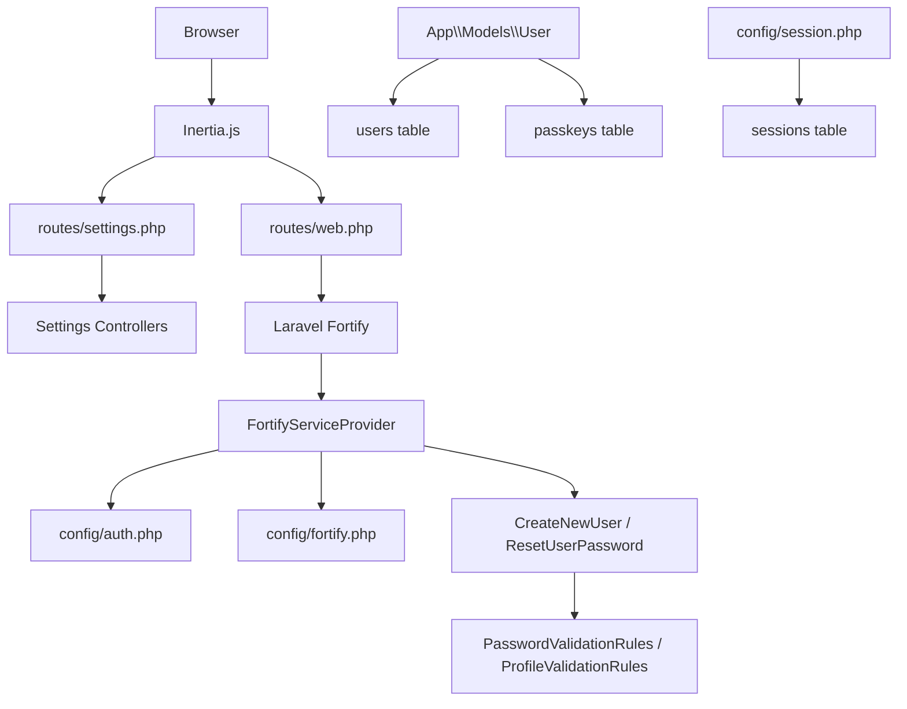

**Diagram sources**
- [web.php](file://routes/web.php)
- [settings.php](file://routes/settings.php)
- [FortifyServiceProvider.php:1-101](file://app/Providers/FortifyServiceProvider.php#L1-L101)
- [auth.php:1-118](file://config/auth.php#L1-L118)
- [fortify.php:1-178](file://config/fortify.php#L1-L178)
- [session.php:1-234](file://config/session.php#L1-L234)
- [User.php:1-62](file://app/Models/User.php#L1-L62)
- [CreateNewUser.php:1-34](file://app/Actions/Fortify/CreateNewUser.php#L1-L34)
- [ResetUserPassword.php:1-30](file://app/Actions/Fortify/ResetUserPassword.php#L1-L30)
- [PasswordValidationRules.php:1-30](file://app/Concerns/PasswordValidationRules.php#L1-L30)
- [ProfileValidationRules.php:1-52](file://app/Concerns/ProfileValidationRules.php#L1-L52)
- [0001_01_01_000000_create_users_table.php:1-50](file://database/migrations/0001_01_01_000000_create_users_table.php#L1-L50)
- [2024_01_01_000000_create_passkeys_table.php:1-35](file://database/migrations/2024_01_01_000000_create_passkeys_table.php#L1-L35)

## Detailed Component Analysis

### User Model and Enhanced Attributes
The User model extends the base Authenticatable and implements the PasskeyUser interface. It incorporates:
- PasskeyAuthenticatable for WebAuthn passkey support.
- TwoFactorAuthenticatable for two-factor authentication.
- Role and metadata fields for role-based access control and user-specific data.
- Hidden attributes for sensitive fields and fillable attributes for controlled mass assignment.
- Casts for timestamps and arrays.

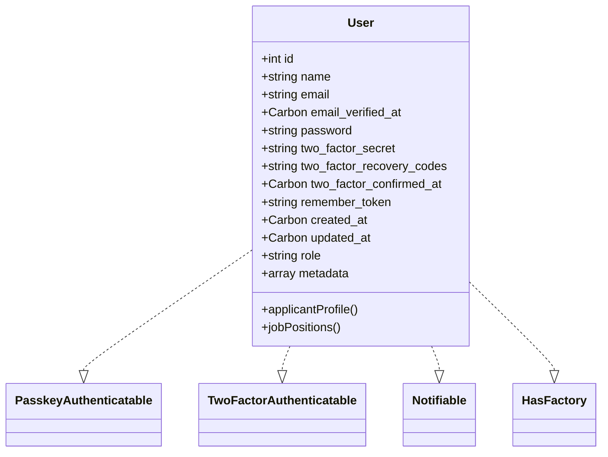

**Diagram sources**
- [User.php:1-62](file://app/Models/User.php#L1-L62)

**Section sources**
- [User.php:1-62](file://app/Models/User.php#L1-L62)
- [2026_06_24_164756_add_role_and_metadata_to_users_table.php:1-30](file://database/migrations/2026_06_24_164756_add_role_and_metadata_to_users_table.php#L1-L30)

### Fortify Configuration and Features
Fortify is configured with:
- Guard and password broker aligned with the auth configuration.
- Username/email settings and lowercase normalization.
- Home path after authentication.
- Middleware stack and rate limiters for login, two-factor, and passkeys.
- Enabled features: registration, password reset, email verification, two-factor authentication (with confirmation), and passkeys (with password confirmation).
- Passkeys relying party ID, allowed origins, user handle secret, and timeout.

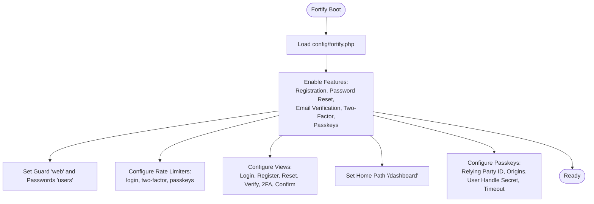

**Diagram sources**
- [fortify.php:1-178](file://config/fortify.php#L1-L178)
- [FortifyServiceProvider.php:1-101](file://app/Providers/FortifyServiceProvider.php#L1-L101)

**Section sources**
- [fortify.php:1-178](file://config/fortify.php#L1-L178)
- [FortifyServiceProvider.php:1-101](file://app/Providers/FortifyServiceProvider.php#L1-L101)

### Authentication Flows

#### Registration Flow
- Frontend: Registration form collects name, email, and password with confirmation.
- Backend: CreateNewUser validates profile and password rules, then creates a User record.
- Fortify: Uses the configured registration feature and views.

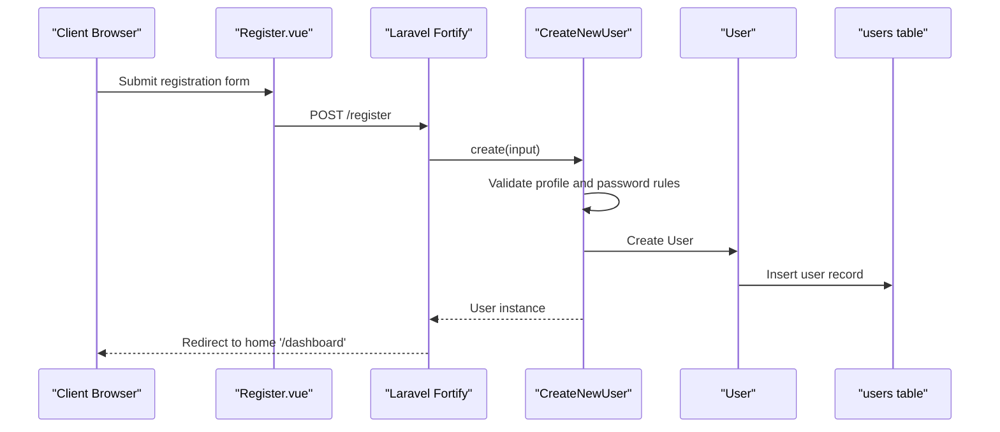

**Diagram sources**
- [Register.vue:1-115](file://resources/js/pages/auth/Register.vue#L1-L115)
- [CreateNewUser.php:1-34](file://app/Actions/Fortify/CreateNewUser.php#L1-L34)
- [PasswordValidationRules.php:1-30](file://app/Concerns/PasswordValidationRules.php#L1-L30)
- [ProfileValidationRules.php:1-52](file://app/Concerns/ProfileValidationRules.php#L1-L52)
- [0001_01_01_000000_create_users_table.php:1-50](file://database/migrations/0001_01_01_000000_create_users_table.php#L1-L50)

**Section sources**
- [Register.vue:1-115](file://resources/js/pages/auth/Register.vue#L1-L115)
- [CreateNewUser.php:1-34](file://app/Actions/Fortify/CreateNewUser.php#L1-L34)
- [PasswordValidationRules.php:1-30](file://app/Concerns/PasswordValidationRules.php#L1-L30)
- [ProfileValidationRules.php:1-52](file://app/Concerns/ProfileValidationRules.php#L1-L52)

#### Login and Two-Factor Challenge Flow
- Frontend: Login form submits credentials and optionally uses passkey verification.
- Backend: Fortify authenticates via the 'web' guard; if two-factor is enabled, redirects to the two-factor challenge view.
- Two-Factor: User enters a code from an authenticator app or uses backup codes.

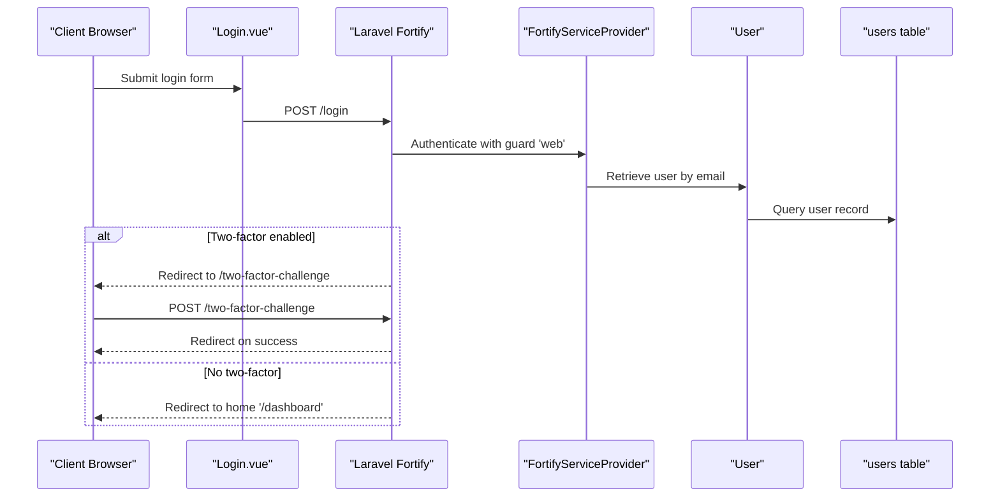

**Diagram sources**
- [Login.vue:1-111](file://resources/js/pages/auth/Login.vue#L1-L111)
- [FortifyServiceProvider.php:1-101](file://app/Providers/FortifyServiceProvider.php#L1-L101)
- [User.php:1-62](file://app/Models/User.php#L1-L62)
- [0001_01_01_000000_create_users_table.php:1-50](file://database/migrations/0001_01_01_000000_create_users_table.php#L1-L50)

**Section sources**
- [Login.vue:1-111](file://resources/js/pages/auth/Login.vue#L1-L111)
- [FortifyServiceProvider.php:1-101](file://app/Providers/FortifyServiceProvider.php#L1-L101)
- [TwoFactorChallenge.vue](file://resources/js/pages/auth/TwoFactorChallenge.vue)

#### Password Reset Flow
- Frontend: Request password reset and reset password forms.
- Backend: ResetUserPassword validates the new password and updates the user record.

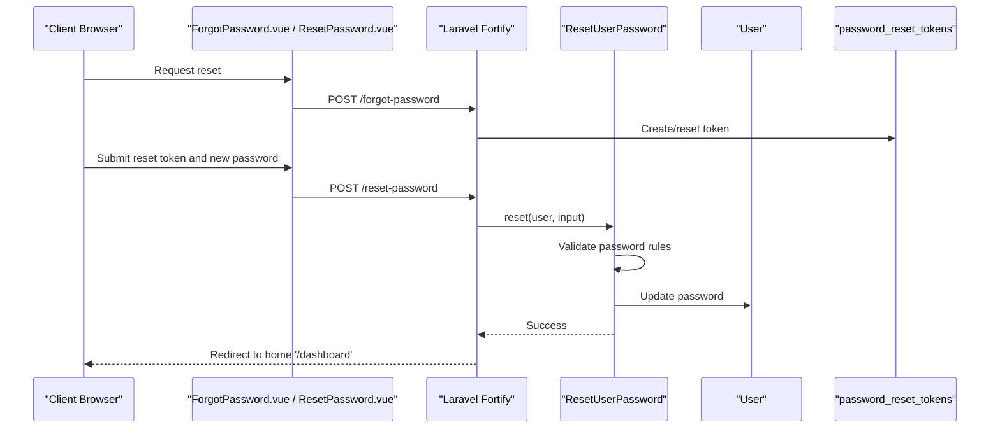

**Diagram sources**
- [ForgotPassword.vue](file://resources/js/pages/auth/ForgotPassword.vue)
- [ResetPassword.vue](file://resources/js/pages/auth/ResetPassword.vue)
- [ResetUserPassword.php:1-30](file://app/Actions/Fortify/ResetUserPassword.php#L1-L30)
- [PasswordValidationRules.php:1-30](file://app/Concerns/PasswordValidationRules.php#L1-L30)
- [0001_01_01_000000_create_users_table.php:1-50](file://database/migrations/0001_01_01_000000_create_users_table.php#L1-L50)

**Section sources**
- [ForgotPassword.vue](file://resources/js/pages/auth/ForgotPassword.vue)
- [ResetPassword.vue](file://resources/js/pages/auth/ResetPassword.vue)
- [ResetUserPassword.php:1-30](file://app/Actions/Fortify/ResetUserPassword.php#L1-L30)
- [PasswordValidationRules.php:1-30](file://app/Concerns/PasswordValidationRules.php#L1-L30)

#### Email Verification Flow
- Frontend: VerifyEmail view.
- Backend: Fortify handles email verification and redirects appropriately.

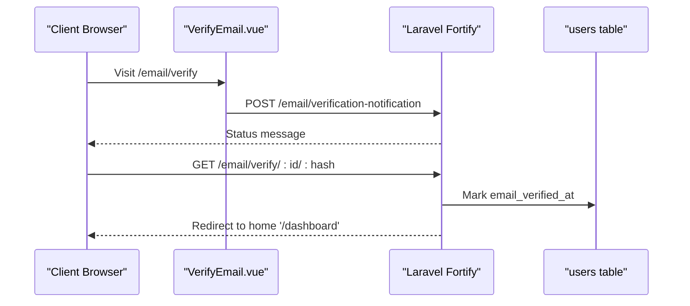

**Diagram sources**
- [VerifyEmail.vue](file://resources/js/pages/auth/VerifyEmail.vue)
- [fortify.php:1-178](file://config/fortify.php#L1-L178)
- [0001_01_01_000000_create_users_table.php:1-50](file://database/migrations/0001_01_01_000000_create_users_table.php#L1-L50)

**Section sources**
- [VerifyEmail.vue](file://resources/js/pages/auth/VerifyEmail.vue)
- [fortify.php:1-178](file://config/fortify.php#L1-L178)

#### Passkey Authentication (WebAuthn) Flow
- Frontend: PasskeyVerify component integrated into Login.vue.
- Backend: Fortify passkeys configuration with relying party ID, allowed origins, and rate limiting.

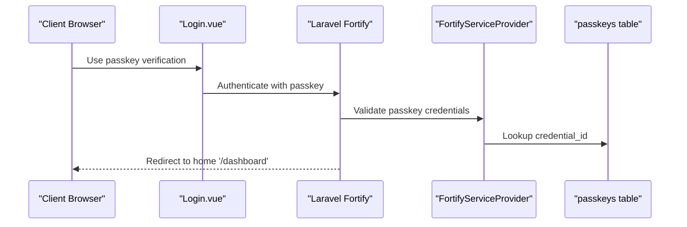

**Diagram sources**
- [Login.vue:1-111](file://resources/js/pages/auth/Login.vue#L1-L111)
- [FortifyServiceProvider.php:1-101](file://app/Providers/FortifyServiceProvider.php#L1-L101)
- [2024_01_01_000000_create_passkeys_table.php:1-35](file://database/migrations/2024_01_01_000000_create_passkeys_table.php#L1-L35)

**Section sources**
- [Login.vue:1-111](file://resources/js/pages/auth/Login.vue#L1-L111)
- [FortifyServiceProvider.php:1-101](file://app/Providers/FortifyServiceProvider.php#L1-L101)
- [2024_01_01_000000_create_passkeys_table.php:1-35](file://database/migrations/2024_01_01_000000_create_passkeys_table.php#L1-L35)

### Role-Based Access Control and Metadata Management
- Role field: Stored in the users table with a default value suitable for candidates.
- Metadata field: JSONB for flexible user-specific data.
- Relationships: The User model defines relationships to related entities (e.g., applicant profile, job positions).

Best practices:
- Enforce role checks at route and controller levels.
- Use policies and gates for granular permissions.
- Store only necessary metadata and sanitize inputs.

**Section sources**
- [2026_06_24_164756_add_role_and_metadata_to_users_table.php:1-30](file://database/migrations/2026_06_24_164756_add_role_and_metadata_to_users_table.php#L1-L30)
- [User.php:1-62](file://app/Models/User.php#L1-L62)

### Two-Factor Authentication (2FA)
- Columns: two_factor_secret, two_factor_recovery_codes, two_factor_confirmed_at.
- Setup: Users enable 2FA and receive backup codes.
- Verification: Authenticator app codes or backup codes during login.
- Confirmation: Optional confirmation requirement enforced by Fortify.

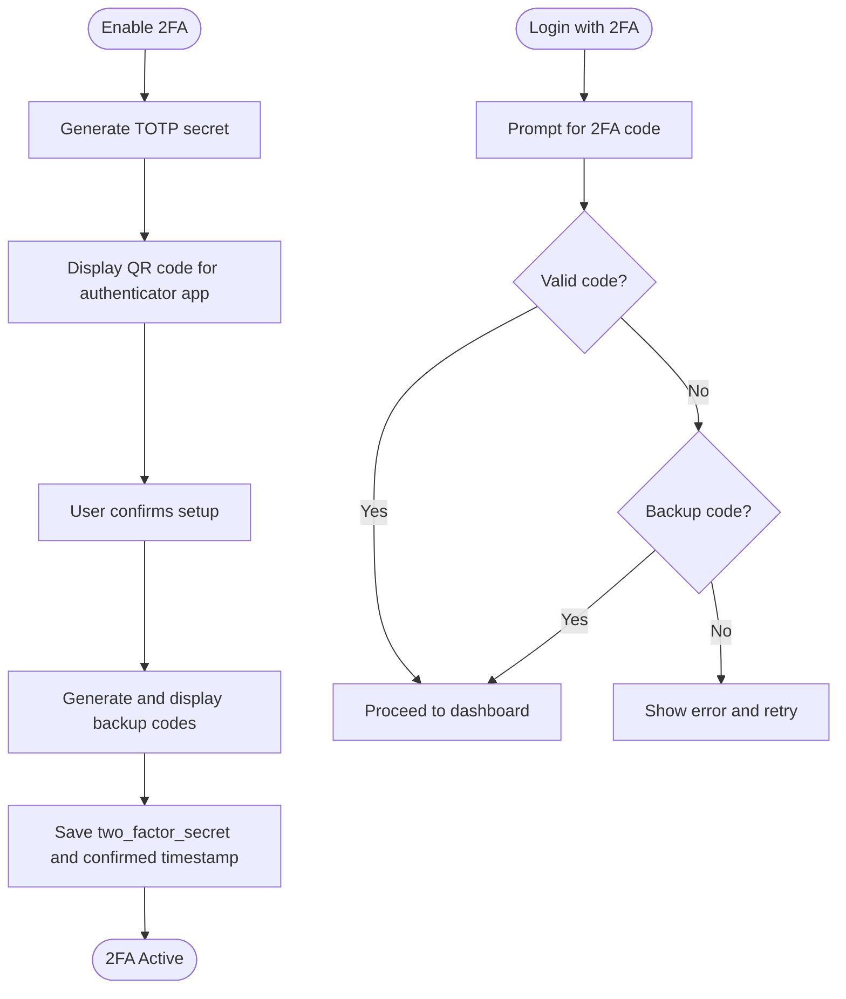

**Diagram sources**
- [2025_08_14_170933_add_two_factor_columns_to_users_table.php:1-35](file://database/migrations/2025_08_14_170933_add_two_factor_columns_to_users_table.php#L1-L35)
- [fortify.php:167-171](file://config/fortify.php#L167-L171)
- [TwoFactorChallenge.vue](file://resources/js/pages/auth/TwoFactorChallenge.vue)

**Section sources**
- [2025_08_14_170933_add_two_factor_columns_to_users_table.php:1-35](file://database/migrations/2025_08_14_170933_add_two_factor_columns_to_users_table.php#L1-L35)
- [fortify.php:167-171](file://config/fortify.php#L167-L171)

### Session Management and CSRF Protection
- Driver: Configured via SESSION_DRIVER (default database).
- Lifetime: SESSION_LIFETIME in minutes.
- Cookie policies: Secure, HttpOnly, SameSite, partitioned options.
- Serialization: JSON by default for safety.
- CSRF protection: Laravel's built-in CSRF middleware applies to web routes.

Recommendations:
- Use HTTPS in production to enable secure cookies.
- Keep SameSite at 'lax' or stricter for cross-site protection.
- Regularly rotate session data and monitor session table growth.

**Section sources**
- [session.php:1-234](file://config/session.php#L1-L234)
- [web.php](file://routes/web.php)

### Settings and Security Management
- Security page: Manages passkeys and two-factor settings.
- Profile page: Updates personal information with validated requests.
- Controllers: Handle updates and enforce validation rules.

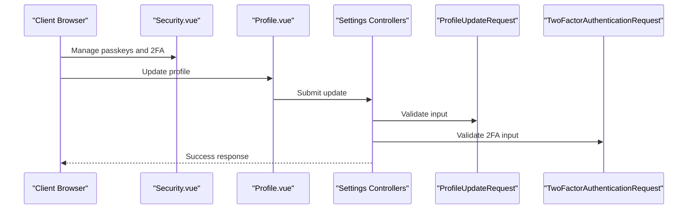

**Diagram sources**
- [Security.vue](file://resources/js/pages/settings/Security.vue)
- [Profile.vue](file://resources/js/pages/settings/Profile.vue)
- [SecurityController.php](file://app/Http/Controllers/Settings/SecurityController.php)
- [ProfileController.php](file://app/Http/Controllers/Settings/ProfileController.php)
- [ProfileUpdateRequest.php](file://app/Http/Requests/Settings/ProfileUpdateRequest.php)
- [TwoFactorAuthenticationRequest.php](file://app/Http/Requests/Settings/TwoFactorAuthenticationRequest.php)

**Section sources**
- [Security.vue](file://resources/js/pages/settings/Security.vue)
- [Profile.vue](file://resources/js/pages/settings/Profile.vue)
- [SecurityController.php](file://app/Http/Controllers/Settings/SecurityController.php)
- [ProfileController.php](file://app/Http/Controllers/Settings/ProfileController.php)
- [ProfileUpdateRequest.php](file://app/Http/Requests/Settings/ProfileUpdateRequest.php)
- [TwoFactorAuthenticationRequest.php](file://app/Http/Requests/Settings/TwoFactorAuthenticationRequest.php)

## Dependency Analysis
The authentication system exhibits clear separation of concerns:
- FortifyServiceProvider depends on Fortify configuration and registers actions and views.
- Actions depend on validation concerns for consistent rules.
- User model depends on database migrations for schema.
- Frontend views depend on Inertia routes and Fortify features.

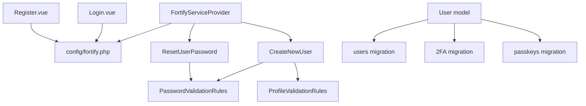

**Diagram sources**
- [FortifyServiceProvider.php:1-101](file://app/Providers/FortifyServiceProvider.php#L1-L101)
- [fortify.php:1-178](file://config/fortify.php#L1-L178)
- [CreateNewUser.php:1-34](file://app/Actions/Fortify/CreateNewUser.php#L1-L34)
- [ResetUserPassword.php:1-30](file://app/Actions/Fortify/ResetUserPassword.php#L1-L30)
- [PasswordValidationRules.php:1-30](file://app/Concerns/PasswordValidationRules.php#L1-L30)
- [ProfileValidationRules.php:1-52](file://app/Concerns/ProfileValidationRules.php#L1-L52)
- [User.php:1-62](file://app/Models/User.php#L1-L62)
- [0001_01_01_000000_create_users_table.php:1-50](file://database/migrations/0001_01_01_000000_create_users_table.php#L1-L50)
- [2025_08_14_170933_add_two_factor_columns_to_users_table.php:1-35](file://database/migrations/2025_08_14_170933_add_two_factor_columns_to_users_table.php#L1-L35)
- [2024_01_01_000000_create_passkeys_table.php:1-35](file://database/migrations/2024_01_01_000000_create_passkeys_table.php#L1-L35)
- [Login.vue:1-111](file://resources/js/pages/auth/Login.vue#L1-L111)
- [Register.vue:1-115](file://resources/js/pages/auth/Register.vue#L1-L115)

**Section sources**
- [FortifyServiceProvider.php:1-101](file://app/Providers/FortifyServiceProvider.php#L1-L101)
- [CreateNewUser.php:1-34](file://app/Actions/Fortify/CreateNewUser.php#L1-L34)
- [ResetUserPassword.php:1-30](file://app/Actions/Fortify/ResetUserPassword.php#L1-L30)
- [PasswordValidationRules.php:1-30](file://app/Concerns/PasswordValidationRules.php#L1-L30)
- [ProfileValidationRules.php:1-52](file://app/Concerns/ProfileValidationRules.php#L1-L52)
- [User.php:1-62](file://app/Models/User.php#L1-L62)
- [Login.vue:1-111](file://resources/js/pages/auth/Login.vue#L1-L111)
- [Register.vue:1-115](file://resources/js/pages/auth/Register.vue#L1-L115)

## Performance Considerations
- Rate limiting: Fortify provides built-in throttling for login, two-factor, and passkeys to mitigate brute force attempts.
- Session driver: Database sessions are reliable but require maintenance; consider Redis for high traffic.
- Cookie policies: Enabling secure and HttpOnly cookies adds security without significant overhead.
- Validation rules: Centralized validation traits reduce duplication and improve maintainability.

[No sources needed since this section provides general guidance]

## Troubleshooting Guide
Common issues and resolutions:
- Login failures: Check rate limiter thresholds and IP-based throttling keys.
- Two-factor challenges: Ensure time synchronization for authenticator apps and verify backup codes.
- Passkey authentication: Confirm relying party ID matches application URL and allowed origins.
- Session problems: Verify session driver configuration and database connectivity.
- CSRF errors: Ensure forms include CSRF tokens and SameSite policy aligns with frontend behavior.

**Section sources**
- [FortifyServiceProvider.php:82-99](file://app/Providers/FortifyServiceProvider.php#L82-L99)
- [fortify.php:117-121](file://config/fortify.php#L117-L121)
- [session.php:160-202](file://config/session.php#L160-L202)

## Conclusion
SmartRecruit ATS implements a robust authentication and authorization system using Laravel Fortify and Inertia.js. The User model supports passkeys and two-factor authentication, while role and metadata fields enable flexible access control. Session management and CSRF protection are configured securely. The modular design with actions and validation concerns ensures maintainability and scalability. Following the best practices outlined here will help sustain a secure and efficient authentication experience.

[No sources needed since this section summarizes without analyzing specific files]

## Appendices

### Practical Examples

#### Role-Based Route Protection
- Apply middleware to restrict access to HRD-only routes.
- Use policies to enforce fine-grained permissions.

#### Permission Checking
- Validate user roles and metadata before granting access.
- Combine with gates and policies for consistent enforcement.

[No sources needed since this section provides general guidance]