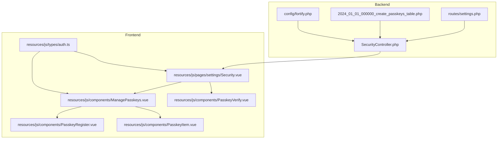
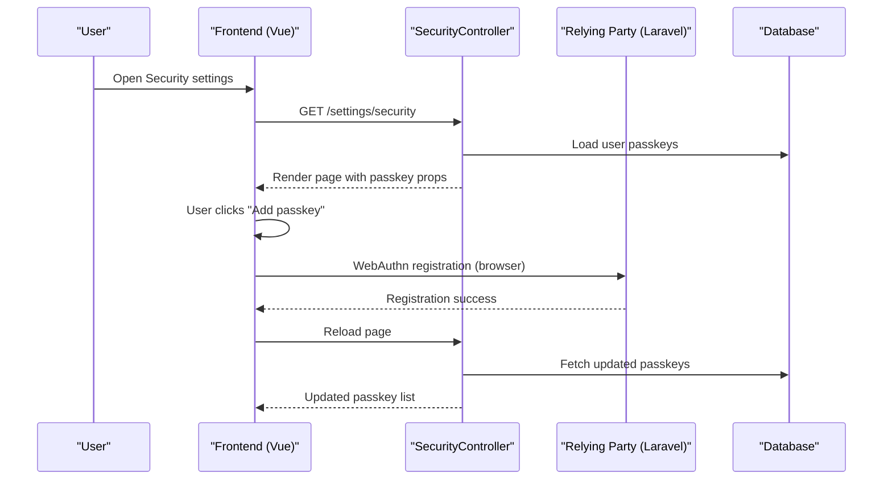
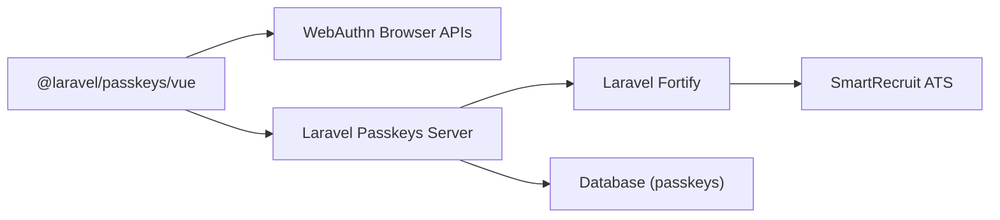

# Passkey Authentication

<cite>
**Referenced Files in This Document**
- [SecurityController.php](file://app/Http/Controllers/Settings/SecurityController.php)
- [Security.vue](file://resources/js/pages/settings/Security.vue)
- [ManagePasskeys.vue](file://resources/js/components/ManagePasskeys.vue)
- [PasskeyRegister.vue](file://resources/js/components/PasskeyRegister.vue)
- [PasskeyVerify.vue](file://resources/js/components/PasskeyVerify.vue)
- [PasskeyItem.vue](file://resources/js/components/PasskeyItem.vue)
- [auth.ts](file://resources/js/types/auth.ts)
- [settings.php](file://routes/settings.php)
- [2024_01_01_000000_create_passkeys_table.php](file://database/migrations/2024_01_01_000000_create_passkeys_table.php)
- [fortify.php](file://config/fortify.php)
- [composer.json](file://composer.json)
</cite>

## Table of Contents
1. [Introduction](#introduction)
2. [Project Structure](#project-structure)
3. [Core Components](#core-components)
4. [Architecture Overview](#architecture-overview)
5. [Detailed Component Analysis](#detailed-component-analysis)
6. [Dependency Analysis](#dependency-analysis)
7. [Performance Considerations](#performance-considerations)
8. [Troubleshooting Guide](#troubleshooting-guide)
9. [Conclusion](#conclusion)
10. [Appendices](#appendices)

## Introduction
This document explains the passkey authentication implementation using the WebAuthn protocol in SmartRecruit ATS. It covers the end-to-end flows for registering passkeys, listing and removing them, and performing passwordless authentication via browser-based WebAuthn APIs. It also documents the backend controller responsible for rendering the security settings page, the database schema for storing passkey credentials, and the frontend components that integrate with the @laravel/passkeys client library.

The implementation leverages:
- Laravel Fortify’s passkey features
- Laravel Passkeys server package for WebAuthn operations
- Frontend Vue components using @laravel/passkeys/vue composable hooks
- Inertia.js for seamless SPA-like interactions within a Laravel backend

## Project Structure
The passkey feature spans backend controllers, frontend pages and components, database migrations, and configuration. The following diagram maps the primary files involved in passkey operations.

**Diagram sources**
- [SecurityController.php:14-66](file://app/Http/Controllers/Settings/SecurityController.php#L14-L66)
- [Security.vue:15-119](file://resources/js/pages/settings/Security.vue#L15-L119)
- [ManagePasskeys.vue:10-65](file://resources/js/components/ManagePasskeys.vue#L10-L65)
- [PasskeyRegister.vue:1-95](file://resources/js/components/PasskeyRegister.vue#L1-L95)
- [PasskeyVerify.vue:1-74](file://resources/js/components/PasskeyVerify.vue#L1-L74)
- [PasskeyItem.vue:16-96](file://resources/js/components/PasskeyItem.vue#L16-L96)
- [auth.ts:17-25](file://resources/js/types/auth.ts#L17-L25)
- [settings.php:18-34](file://routes/settings.php#L18-L34)
- [2024_01_01_000000_create_passkeys_table.php:14-24](file://database/migrations/2024_01_01_000000_create_passkeys_table.php#L14-L24)
- [fortify.php:145-175](file://config/fortify.php#L145-L175)

**Section sources**
- [SecurityController.php:14-66](file://app/Http/Controllers/Settings/SecurityController.php#L14-L66)
- [Security.vue:15-119](file://resources/js/pages/settings/Security.vue#L15-L119)
- [ManagePasskeys.vue:10-65](file://resources/js/components/ManagePasskeys.vue#L10-L65)
- [PasskeyRegister.vue:1-95](file://resources/js/components/PasskeyRegister.vue#L1-L95)
- [PasskeyVerify.vue:1-74](file://resources/js/components/PasskeyVerify.vue#L1-L74)
- [PasskeyItem.vue:16-96](file://resources/js/components/PasskeyItem.vue#L16-L96)
- [auth.ts:17-25](file://resources/js/types/auth.ts#L17-L25)
- [settings.php:18-34](file://routes/settings.php#L18-L34)
- [2024_01_01_000000_create_passkeys_table.php:14-24](file://database/migrations/2024_01_01_000000_create_passkeys_table.php#L14-L24)
- [fortify.php:145-175](file://config/fortify.php#L145-L175)

## Core Components
- SecurityController: Renders the security settings page and prepares passkey data for the frontend.
- ManagePasskeys: Aggregates passkey listing, registration, and removal UI.
- PasskeyRegister: Handles passkey enrollment via the browser WebAuthn API.
- PasskeyVerify: Performs passwordless authentication using WebAuthn.
- PasskeyItem: Displays individual passkeys with removal UX.
- Database migration: Defines the passkeys table schema.
- Fortify configuration: Enables passkeys and sets relying party and security parameters.
- Routes: Exposes the security page and a .well-known endpoint for passkey discovery.

**Section sources**
- [SecurityController.php:19-51](file://app/Http/Controllers/Settings/SecurityController.php#L19-L51)
- [ManagePasskeys.vue:10-65](file://resources/js/components/ManagePasskeys.vue#L10-L65)
- [PasskeyRegister.vue:30-46](file://resources/js/components/PasskeyRegister.vue#L30-L46)
- [PasskeyVerify.vue:23-35](file://resources/js/components/PasskeyVerify.vue#L23-L35)
- [PasskeyItem.vue:16-96](file://resources/js/components/PasskeyItem.vue#L16-L96)
- [2024_01_01_000000_create_passkeys_table.php:14-24](file://database/migrations/2024_01_01_000000_create_passkeys_table.php#L14-L24)
- [fortify.php:145-175](file://config/fortify.php#L145-L175)
- [settings.php:18-34](file://routes/settings.php#L18-L34)

## Architecture Overview
The passkey architecture integrates frontend Vue components with Laravel Fortify and the Laravel Passkeys server package. The frontend uses @laravel/passkeys/vue hooks to communicate with WebAuthn endpoints exposed by the backend.

**Diagram sources**
- [SecurityController.php:19-51](file://app/Http/Controllers/Settings/SecurityController.php#L19-L51)
- [Security.vue:115-118](file://resources/js/pages/settings/Security.vue#L115-L118)
- [ManagePasskeys.vue:27-29](file://resources/js/components/ManagePasskeys.vue#L27-L29)
- [PasskeyRegister.vue:30-46](file://resources/js/components/PasskeyRegister.vue#L30-L46)
- [2024_01_01_000000_create_passkeys_table.php:14-24](file://database/migrations/2024_01_01_000000_create_passkeys_table.php#L14-L24)

## Detailed Component Analysis

### SecurityController
Responsibilities:
- Renders the security settings page.
- Loads passkey records for the current user and maps them for the frontend.
- Exposes feature flags for passkey management.

Key behaviors:
- Builds props including passkey metadata and human-friendly timestamps.
- Integrates with Fortify features to gate passkey capabilities.

**Section sources**
- [SecurityController.php:19-51](file://app/Http/Controllers/Settings/SecurityController.php#L19-L51)

### ManagePasskeys
Responsibilities:
- Displays a list of registered passkeys.
- Provides registration UI via PasskeyRegister.
- Delegates removal to the backend via Inertia delete.

UI/UX:
- Empty state messaging when no passkeys exist.
- Per-passkey removal with confirmation dialog.

**Section sources**
- [ManagePasskeys.vue:10-65](file://resources/js/components/ManagePasskeys.vue#L10-L65)
- [PasskeyItem.vue:16-96](file://resources/js/components/PasskeyItem.vue#L16-L96)

### PasskeyRegister
Responsibilities:
- Uses @laravel/passkeys/vue to initiate WebAuthn registration.
- Generates a default passkey name based on browser and OS.
- Emits success to refresh the passkey list.

Flow:
- Validates input name.
- Calls register(name) and resets form on success.

**Section sources**
- [PasskeyRegister.vue:13-51](file://resources/js/components/PasskeyRegister.vue#L13-L51)
- [PasskeyRegister.vue:30-46](file://resources/js/components/PasskeyRegister.vue#L30-L46)

### PasskeyVerify
Responsibilities:
- Initiates WebAuthn authentication via @laravel/passkeys/vue.
- Navigates on success; displays errors; supports custom labels.

Integration:
- Accepts route pairs for options and submit endpoints.
- On success, redirects to dashboard or provided redirect target.

**Section sources**
- [PasskeyVerify.vue:23-35](file://resources/js/components/PasskeyVerify.vue#L23-L35)

### PasskeyItem
Responsibilities:
- Renders a single passkey with metadata.
- Triggers removal via ManagePasskeys.

**Section sources**
- [PasskeyItem.vue:16-96](file://resources/js/components/PasskeyItem.vue#L16-L96)

### Database Schema: Passkeys Table
Design:
- Stores user association, passkey name, unique credential identifier, serialized credential, last-used timestamp, and timestamps.

Indexes:
- Foreign key on user_id and index for efficient lookups.

**Section sources**
- [2024_01_01_000000_create_passkeys_table.php:14-24](file://database/migrations/2024_01_01_000000_create_passkeys_table.php#L14-L24)

### Fortify Configuration
Highlights:
- Enables passkeys feature with password confirmation requirement.
- Configures relying party ID, allowed origins, user handle secret, and timeout.
- Sets a dedicated rate limiter for passkeys.

**Section sources**
- [fortify.php:145-175](file://config/fortify.php#L145-L175)

### Routes
Endpoints:
- GET /settings/security renders the security page.
- DELETE /settings/profile removes the user profile.
- GET /.well-known/passkey-endpoints exposes passkey endpoints for discovery.

**Section sources**
- [settings.php:18-34](file://routes/settings.php#L18-L34)

## Dependency Analysis
The frontend depends on @laravel/passkeys/vue for WebAuthn operations. The backend relies on Laravel Passkeys server package and Fortify for passkey features. The database stores passkey credentials associated with users.

**Diagram sources**
- [PasskeyRegister.vue:2](file://resources/js/components/PasskeyRegister.vue#L2)
- [PasskeyVerify.vue:4](file://resources/js/components/PasskeyVerify.vue#L4)
- [composer.json:16](file://composer.json#L16)
- [fortify.php:145-175](file://config/fortify.php#L145-L175)
- [2024_01_01_000000_create_passkeys_table.php:14-24](file://database/migrations/2024_01_01_000000_create_passkeys_table.php#L14-L24)

**Section sources**
- [PasskeyRegister.vue:2](file://resources/js/components/PasskeyRegister.vue#L2)
- [PasskeyVerify.vue:4](file://resources/js/components/PasskeyVerify.vue#L4)
- [composer.json:16](file://composer.json#L16)
- [fortify.php:145-175](file://config/fortify.php#L145-L175)
- [2024_01_01_000000_create_passkeys_table.php:14-24](file://database/migrations/2024_01_01_000000_create_passkeys_table.php#L14-L24)

## Performance Considerations
- Minimize database queries: The controller already fetches only necessary fields and orders by latest.
- Efficient frontend updates: Use Inertia reloads sparingly; consider partial updates if needed.
- WebAuthn timeouts: Configure appropriate timeouts in Fortify to balance security and usability.
- Caching: Consider caching frequently accessed passkey lists for logged-in users.

## Troubleshooting Guide
Common issues and resolutions:
- Browser compatibility: The register component checks support and displays a message when unsupported. Ensure HTTPS and modern browsers.
- .well-known endpoint: Verify the /.well-known/passkey-endpoints route returns the expected JSON structure.
- Rate limiting: Passkey operations are rate-limited; excessive attempts may be throttled.
- Credentials not saved: Ensure the passkeys table exists and migrations have been run.
- Redirects after verification: Confirm the verify component receives proper routes and handles redirects correctly.

**Section sources**
- [PasskeyRegister.vue:55-57](file://resources/js/components/PasskeyRegister.vue#L55-L57)
- [settings.php:29-34](file://routes/settings.php#L29-L34)
- [fortify.php:120](file://config/fortify.php#L120)
- [2024_01_01_000000_create_passkeys_table.php:14-24](file://database/migrations/2024_01_01_000000_create_passkeys_table.php#L14-L24)
- [PasskeyVerify.vue:32-35](file://resources/js/components/PasskeyVerify.vue#L32-L35)

## Conclusion
SmartRecruit ATS implements passwordless authentication using WebAuthn passkeys through a clean separation of concerns: the backend controller and Fortify configuration manage passkey lifecycle and security policies, while the frontend Vue components provide a smooth user experience for registration, listing, and authentication. The solution is extensible, secure, and aligned with modern standards for passwordless login.

## Appendices

### Practical Setup Flows
- Enrolling a passkey:
  - Navigate to Security settings.
  - Click “Add passkey” and confirm the browser prompt.
  - Enter a descriptive name and complete registration.
  - The list reloads to reflect the new passkey.

- Authenticating with a passkey:
  - Use the “Sign in with a passkey” button on supported pages.
  - Complete the browser prompt; on success, you are redirected.

- Removing a passkey:
  - Open the passkey item menu and confirm removal.
  - The passkey is deleted from the database and is no longer usable.

**Section sources**
- [Security.vue:115-118](file://resources/js/pages/settings/Security.vue#L115-L118)
- [ManagePasskeys.vue:20-29](file://resources/js/components/ManagePasskeys.vue#L20-L29)
- [PasskeyRegister.vue:38-46](file://resources/js/components/PasskeyRegister.vue#L38-L46)
- [PasskeyVerify.vue:32-35](file://resources/js/components/PasskeyVerify.vue#L32-L35)
- [PasskeyItem.vue:74-93](file://resources/js/components/PasskeyItem.vue#L74-L93)

### Browser Compatibility and Fallbacks
- Compatibility: The register component detects support and informs users if passkeys are not supported.
- Fallbacks: Traditional password-based authentication remains available via the password update flow and standard login pages.

**Section sources**
- [PasskeyRegister.vue:55-57](file://resources/js/components/PasskeyRegister.vue#L55-L57)
- [Security.vue:46-106](file://resources/js/pages/settings/Security.vue#L46-L106)

### Security Benefits and UX Improvements
- Benefits:
  - Strong cryptographic authentication without sharing secrets.
  - Protection against phishing and credential theft.
  - Seamless, password-free sign-in experience.
- UX:
  - Intuitive registration with suggested device names.
  - Clear passkey listing with creation and last-used timestamps.
  - Confirmation dialogs for destructive actions.

**Section sources**
- [ManagePasskeys.vue:34-61](file://resources/js/components/ManagePasskeys.vue#L34-L61)
- [PasskeyItem.vue:42-58](file://resources/js/components/PasskeyItem.vue#L42-L58)