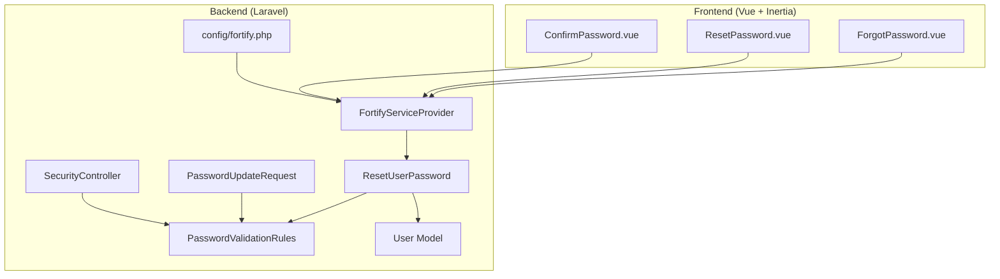
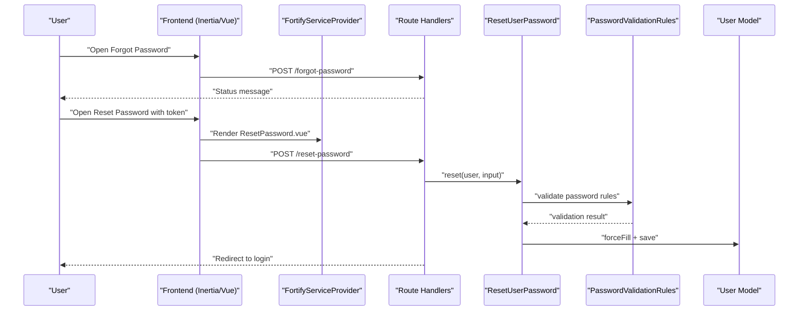
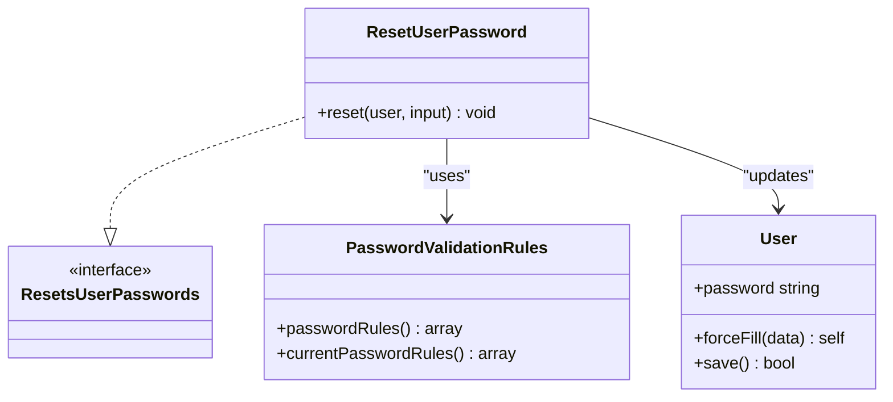
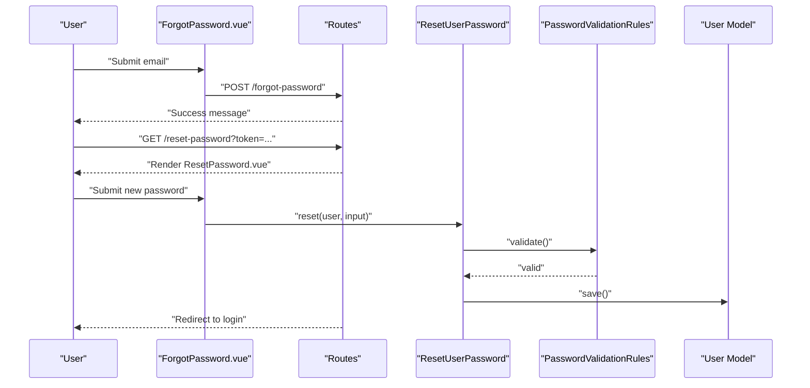
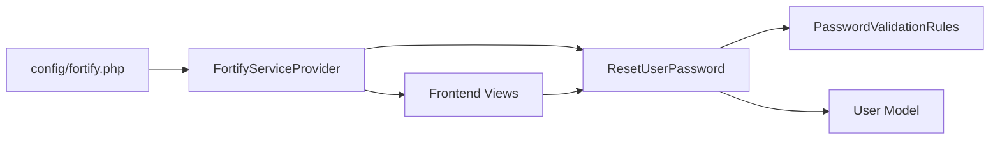

# Password Management

<cite>
**Referenced Files in This Document**
- [ResetUserPassword.php](file://app/Actions/Fortify/ResetUserPassword.php)
- [PasswordValidationRules.php](file://app/Concerns/PasswordValidationRules.php)
- [FortifyServiceProvider.php](file://app/Providers/FortifyServiceProvider.php)
- [PasswordResetTest.php](file://tests/Feature/Auth/PasswordResetTest.php)
- [ForgotPassword.vue](file://resources/js/pages/auth/ForgotPassword.vue)
- [ResetPassword.vue](file://resources/js/pages/auth/ResetPassword.vue)
- [ConfirmPassword.vue](file://resources/js/pages/auth/ConfirmPassword.vue)
- [PasswordUpdateRequest.php](file://app/Http/Requests/Settings/PasswordUpdateRequest.php)
- [SecurityController.php](file://app/Http/Controllers/Settings/SecurityController.php)
- [User.php](file://app/Models/User.php)
- [fortify.php](file://config/fortify.php)
- [ResetsUserPasswords.php](file://vendor/laravel/fortify/src/Contracts/ResetsUserPasswords.php)
- [CompletePasswordReset.php](file://vendor/laravel/fortify/src/Actions/CompletePasswordReset.php)
</cite>

## Table of Contents
1. [Introduction](#introduction)
2. [Project Structure](#project-structure)
3. [Core Components](#core-components)
4. [Architecture Overview](#architecture-overview)
5. [Detailed Component Analysis](#detailed-component-analysis)
6. [Dependency Analysis](#dependency-analysis)
7. [Performance Considerations](#performance-considerations)
8. [Troubleshooting Guide](#troubleshooting-guide)
9. [Conclusion](#conclusion)

## Introduction
This document explains the password management features in SmartRecruit ATS, focusing on the complete password reset workflow, secure password updates, and integration with Laravel Fortify. It covers the forgot password flow, email verification tokens, token expiration handling, rate limiting, password confirmation requirements, password validation rules, and best practices for password storage and transmission. Practical examples illustrate form validation and error handling scenarios.

## Project Structure
SmartRecruit ATS integrates Laravel Fortify for authentication features, including password reset and email verification. The frontend uses Inertia.js with Vue components to render password-related screens. Backend actions and validation rules enforce secure password handling.

**Diagram sources**
- [ForgotPassword.vue:1-67](file://resources/js/pages/auth/ForgotPassword.vue#L1-L67)
- [ResetPassword.vue:1-91](file://resources/js/pages/auth/ResetPassword.vue#L1-L91)
- [ConfirmPassword.vue:1-70](file://resources/js/pages/auth/ConfirmPassword.vue#L1-L70)
- [FortifyServiceProvider.php:1-101](file://app/Providers/FortifyServiceProvider.php#L1-L101)
- [ResetUserPassword.php:1-30](file://app/Actions/Fortify/ResetUserPassword.php#L1-L30)
- [PasswordValidationRules.php:1-30](file://app/Concerns/PasswordValidationRules.php#L1-L30)
- [PasswordUpdateRequest.php:1-26](file://app/Http/Requests/Settings/PasswordUpdateRequest.php#L1-L26)
- [SecurityController.php:1-44](file://app/Http/Controllers/Settings/SecurityController.php#L1-L44)
- [User.php:1-62](file://app/Models/User.php#L1-L62)
- [fortify.php:1-178](file://config/fortify.php#L1-L178)

**Section sources**
- [ForgotPassword.vue:1-67](file://resources/js/pages/auth/ForgotPassword.vue#L1-L67)
- [ResetPassword.vue:1-91](file://resources/js/pages/auth/ResetPassword.vue#L1-L91)
- [ConfirmPassword.vue:1-70](file://resources/js/pages/auth/ConfirmPassword.vue#L1-L70)
- [FortifyServiceProvider.php:1-101](file://app/Providers/FortifyServiceProvider.php#L1-L101)
- [ResetUserPassword.php:1-30](file://app/Actions/Fortify/ResetUserPassword.php#L1-L30)
- [PasswordValidationRules.php:1-30](file://app/Concerns/PasswordValidationRules.php#L1-L30)
- [PasswordUpdateRequest.php:1-26](file://app/Http/Requests/Settings/PasswordUpdateRequest.php#L1-L26)
- [SecurityController.php:1-44](file://app/Http/Controllers/Settings/SecurityController.php#L1-L44)
- [User.php:1-62](file://app/Models/User.php#L1-L62)
- [fortify.php:1-178](file://config/fortify.php#L1-L178)

## Core Components
- ResetUserPassword action: Validates and resets a user's password using Laravel Fortify's contract and shared validation rules.
- PasswordValidationRules trait: Provides reusable validation rules for password strength and confirmation.
- FortifyServiceProvider: Registers custom views and rate limiters for authentication features.
- Frontend password forms: Vue components for forgot password, reset password, and password confirmation.
- PasswordUpdateRequest: Validates current and new passwords for user-initiated updates.
- SecurityController: Supplies password policy strings to the frontend for consistent UX.
- User model: Uses hashed casting for secure password storage and integrates Fortify features.

**Section sources**
- [ResetUserPassword.php:1-30](file://app/Actions/Fortify/ResetUserPassword.php#L1-L30)
- [PasswordValidationRules.php:1-30](file://app/Concerns/PasswordValidationRules.php#L1-L30)
- [FortifyServiceProvider.php:1-101](file://app/Providers/FortifyServiceProvider.php#L1-L101)
- [ForgotPassword.vue:1-67](file://resources/js/pages/auth/ForgotPassword.vue#L1-L67)
- [ResetPassword.vue:1-91](file://resources/js/pages/auth/ResetPassword.vue#L1-L91)
- [ConfirmPassword.vue:1-70](file://resources/js/pages/auth/ConfirmPassword.vue#L1-L70)
- [PasswordUpdateRequest.php:1-26](file://app/Http/Requests/Settings/PasswordUpdateRequest.php#L1-L26)
- [SecurityController.php:1-44](file://app/Http/Controllers/Settings/SecurityController.php#L1-L44)
- [User.php:1-62](file://app/Models/User.php#L1-L62)

## Architecture Overview
The password reset architecture combines Fortify's backend handlers with Inertia-rendered Vue components. The flow begins with a forgot password request, proceeds to token-based reset, and concludes with secure password update and automatic re-authentication.

**Diagram sources**
- [ForgotPassword.vue:1-67](file://resources/js/pages/auth/ForgotPassword.vue#L1-L67)
- [ResetPassword.vue:1-91](file://resources/js/pages/auth/ResetPassword.vue#L1-L91)
- [FortifyServiceProvider.php:56-60](file://app/Providers/FortifyServiceProvider.php#L56-L60)
- [ResetUserPassword.php:19-28](file://app/Actions/Fortify/ResetUserPassword.php#L19-L28)
- [PasswordValidationRules.php:15-18](file://app/Concerns/PasswordValidationRules.php#L15-L18)
- [User.php:42-50](file://app/Models/User.php#L42-L50)

## Detailed Component Analysis

### ResetUserPassword Action Class
The ResetUserPassword action enforces password validation and securely updates the user's password.

**Diagram sources**
- [ResetsUserPasswords.php:1-12](file://vendor/laravel/fortify/src/Contracts/ResetsUserPasswords.php#L1-L12)
- [ResetUserPassword.php:10-28](file://app/Actions/Fortify/ResetUserPassword.php#L10-L28)
- [PasswordValidationRules.php:8-28](file://app/Concerns/PasswordValidationRules.php#L8-L28)
- [User.php:32-35](file://app/Models/User.php#L32-L35)

Implementation highlights:
- Enforces password validation via shared rules.
- Updates the user record with a validated new password.
- Integrates with Laravel Fortify's reset pipeline.

**Section sources**
- [ResetUserPassword.php:1-30](file://app/Actions/Fortify/ResetUserPassword.php#L1-L30)
- [ResetsUserPasswords.php:1-12](file://vendor/laravel/fortify/src/Contracts/ResetsUserPasswords.php#L1-L12)

### Password Validation Rules
PasswordValidationRules centralizes validation logic for strong passwords and current password confirmation.

Key rules:
- New password: required, string, meets Fortify defaults, and confirmed.
- Current password: required, string, validated against the existing password.

These rules are reused across the reset action and user-initiated password updates.

**Section sources**
- [PasswordValidationRules.php:1-30](file://app/Concerns/PasswordValidationRules.php#L1-L30)
- [PasswordUpdateRequest.php:18-24](file://app/Http/Requests/Settings/PasswordUpdateRequest.php#L18-L24)

### Frontend Password Forms
- ForgotPassword.vue: Renders the forgot password form, submits email, and displays status messages.
- ResetPassword.vue: Accepts token and email, validates new password and confirmation, and submits to the reset endpoint.
- ConfirmPassword.vue: Requires current password or passkey confirmation for accessing secure areas.

Form behaviors:
- Autocomplete attributes prevent browser autofill issues.
- PasswordInput component toggles visibility for improved UX.
- Frontend passes token and email to the backend during reset.

**Section sources**
- [ForgotPassword.vue:1-67](file://resources/js/pages/auth/ForgotPassword.vue#L1-L67)
- [ResetPassword.vue:1-91](file://resources/js/pages/auth/ResetPassword.vue#L1-L91)
- [ConfirmPassword.vue:1-70](file://resources/js/pages/auth/ConfirmPassword.vue#L1-L70)

### Password Confirmation and Secure Access
Password confirmation ensures privileged actions are performed by the legitimate user. The system supports both password confirmation and passkey-based confirmation.

Integration points:
- ConfirmPassword.vue renders the confirmation UI and routes.
- Fortify handles the underlying confirmation logic and passkey verification.

**Section sources**
- [ConfirmPassword.vue:1-70](file://resources/js/pages/auth/ConfirmPassword.vue#L1-L70)
- [FortifyServiceProvider.php:76-76](file://app/Providers/FortifyServiceProvider.php#L76-L76)

### Password History and Storage
- Password hashing: The User model casts the password attribute to hashed, ensuring secure storage.
- No explicit password history enforcement is implemented in the reviewed code; future enhancements could track previous hashes to prevent reuse.

Best practices:
- Enforce strong password policies via validation rules.
- Avoid storing plaintext passwords.
- Consider implementing password history checks if required by policy.

**Section sources**
- [User.php:42-50](file://app/Models/User.php#L42-L50)

### Token-Based Reset Workflow
End-to-end flow:
1. User requests a reset link via the forgot password form.
2. Fortify sends a password reset notification containing a token.
3. User opens the reset link, which renders the reset form with token and email.
4. User submits new password and confirmation.
5. Backend validates inputs and updates the password.
6. Fortify completes the reset and triggers a PasswordReset event.

**Diagram sources**
- [ForgotPassword.vue:35-58](file://resources/js/pages/auth/ForgotPassword.vue#L35-L58)
- [ResetPassword.vue:31-88](file://resources/js/pages/auth/ResetPassword.vue#L31-L88)
- [ResetUserPassword.php:19-28](file://app/Actions/Fortify/ResetUserPassword.php#L19-L28)
- [PasswordValidationRules.php:15-18](file://app/Concerns/PasswordValidationRules.php#L15-L18)
- [PasswordResetTest.php:18-65](file://tests/Feature/Auth/PasswordResetTest.php#L18-L65)

**Section sources**
- [PasswordResetTest.php:1-78](file://tests/Feature/Auth/PasswordResetTest.php#L1-L78)
- [FortifyServiceProvider.php:56-60](file://app/Providers/FortifyServiceProvider.php#L56-L60)

### Rate Limiting for Reset Requests
Fortify provides built-in rate limiting for authentication features. The configuration throttles requests by username and IP, reducing abuse potential.

- Default login limiter: 5 requests per minute per username+IP combination.
- Additional limiters for two-factor and passkeys are also configured.

Recommendations:
- Keep default limits unless specific requirements dictate otherwise.
- Monitor rate-limit hits during load testing.

**Section sources**
- [fortify.php:117-121](file://config/fortify.php#L117-L121)
- [FortifyServiceProvider.php:82-99](file://app/Providers/FortifyServiceProvider.php#L82-L99)

### Token Expiration Handling
Token expiration is managed by Laravel's password reset broker. When a user clicks the reset link, the system verifies the token and expiry before allowing password updates. If the token is invalid or expired, the backend rejects the request and returns appropriate errors.

Testing evidence:
- Invalid token submissions trigger validation errors on the email field.

**Section sources**
- [PasswordResetTest.php:67-78](file://tests/Feature/Auth/PasswordResetTest.php#L67-L78)

### Password Update Request Validation
PasswordUpdateRequest ensures that:
- The current password matches the stored password.
- The new password satisfies the shared validation rules.

This request class is used for user-initiated password changes in settings.

**Section sources**
- [PasswordUpdateRequest.php:1-26](file://app/Http/Requests/Settings/PasswordUpdateRequest.php#L1-L26)

### SecurityController Integration
SecurityController supplies password policy strings to the frontend, ensuring consistent validation feedback across components like the settings page.

**Section sources**
- [SecurityController.php:19-41](file://app/Http/Controllers/Settings/SecurityController.php#L19-L41)

## Dependency Analysis
The password management subsystem exhibits low coupling and high cohesion:
- ResetUserPassword depends on PasswordValidationRules and the User model.
- FortifyServiceProvider orchestrates view rendering and rate limiting.
- Frontend components depend on route helpers and shared validation strings.
- Laravel Fortify provides the underlying reset completion and event emission.

**Diagram sources**
- [ResetUserPassword.php:5-12](file://app/Actions/Fortify/ResetUserPassword.php#L5-L12)
- [PasswordValidationRules.php:8-18](file://app/Concerns/PasswordValidationRules.php#L8-L18)
- [FortifyServiceProvider.php:40-77](file://app/Providers/FortifyServiceProvider.php#L40-L77)
- [User.php:32-35](file://app/Models/User.php#L32-L35)
- [fortify.php:1-178](file://config/fortify.php#L1-L178)

**Section sources**
- [ResetUserPassword.php:1-30](file://app/Actions/Fortify/ResetUserPassword.php#L1-L30)
- [PasswordValidationRules.php:1-30](file://app/Concerns/PasswordValidationRules.php#L1-L30)
- [FortifyServiceProvider.php:1-101](file://app/Providers/FortifyServiceProvider.php#L1-L101)
- [User.php:1-62](file://app/Models/User.php#L1-L62)
- [fortify.php:1-178](file://config/fortify.php#L1-L178)

## Performance Considerations
- Validation overhead: PasswordValidationRules adds minimal overhead; keep validation logic concise.
- Hashing cost: Password hashing is handled by the framework; avoid redundant hashing in application code.
- Rate limiting: Default limits balance security and usability; adjust only when necessary.
- Frontend responsiveness: Use optimistic UI patterns with proper error messaging for better perceived performance.

## Troubleshooting Guide
Common issues and resolutions:
- Invalid token or expired link:
  - Symptom: Validation errors on the email field after submission.
  - Cause: Token mismatch or expiration.
  - Resolution: Ensure the user clicked the latest email link and retry the reset.
  - Evidence: See test coverage for invalid token handling.

- Password does not meet requirements:
  - Symptom: Validation errors on password or confirmation fields.
  - Cause: Violation of shared validation rules.
  - Resolution: Review the displayed password rules and adjust accordingly.

- Forgotten password link not received:
  - Symptom: No email sent after submitting the forgot password form.
  - Cause: Email delivery issues or incorrect email address.
  - Resolution: Verify email configuration and ensure the address exists in the system.

- Redirect loop after reset:
  - Symptom: User remains on the reset page or gets redirected incorrectly.
  - Cause: Misconfigured home path or session state.
  - Resolution: Confirm the home path setting and clear session cookies if needed.

**Section sources**
- [PasswordResetTest.php:67-78](file://tests/Feature/Auth/PasswordResetTest.php#L67-L78)
- [PasswordValidationRules.php:15-18](file://app/Concerns/PasswordValidationRules.php#L15-L18)
- [fortify.php:76-76](file://config/fortify.php#L76-L76)

## Conclusion
SmartRecruit ATS implements a robust password management system leveraging Laravel Fortify. The reset workflow is secure, user-friendly, and configurable, with strong validation rules, rate limiting, and clear frontend feedback. Passwords are stored securely using hashed casting, and the system supports both password and passkey-based confirmation for sensitive operations. Extending the solution with password history enforcement and additional monitoring would further strengthen security posture.