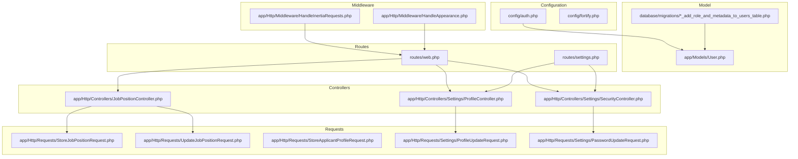
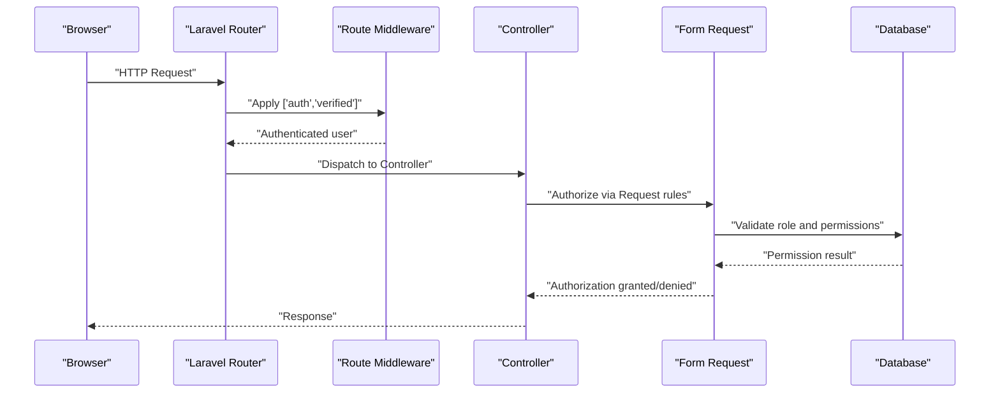
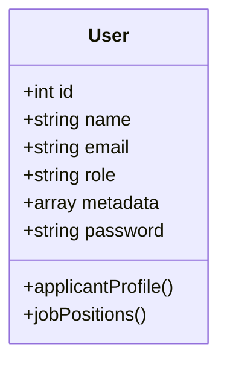
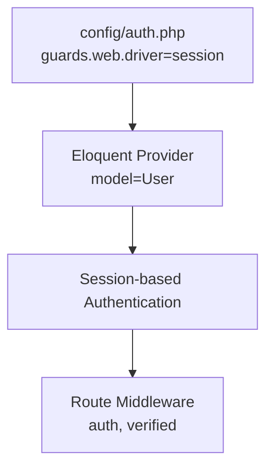
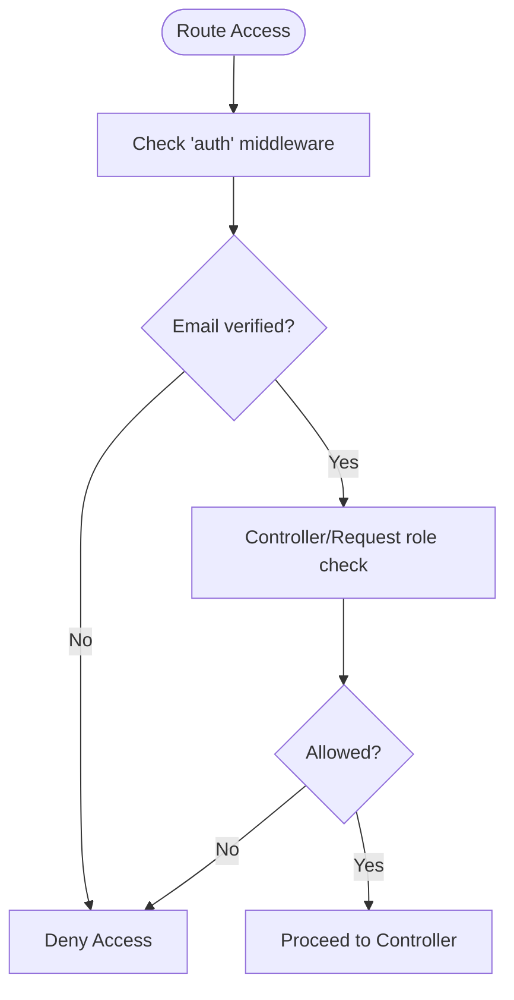
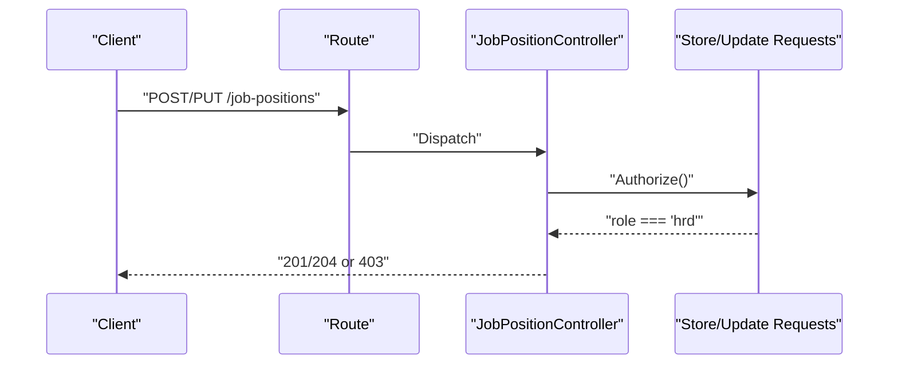
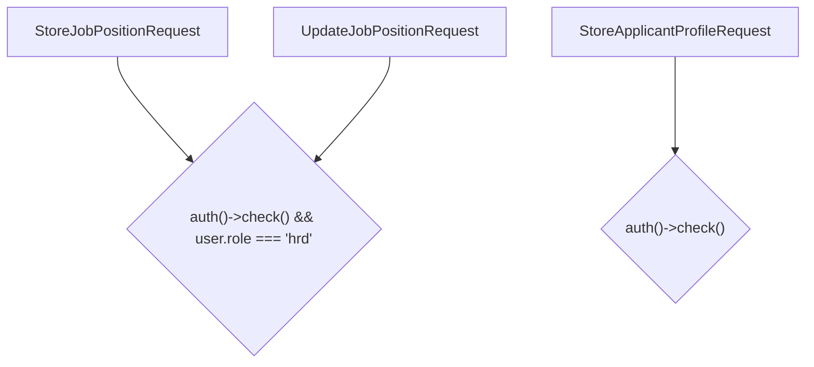
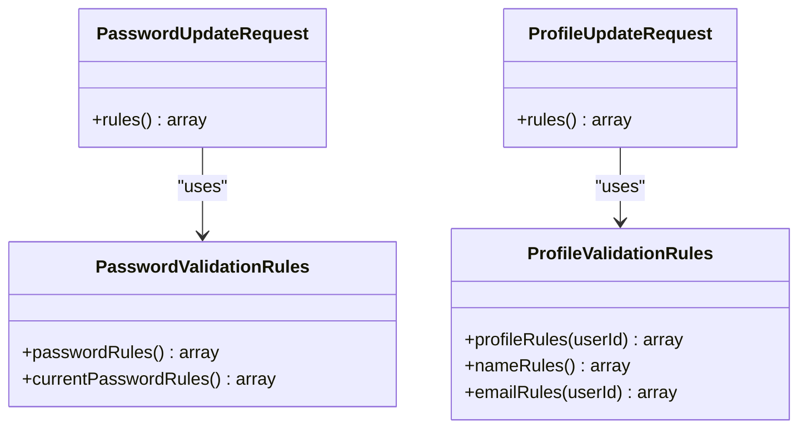
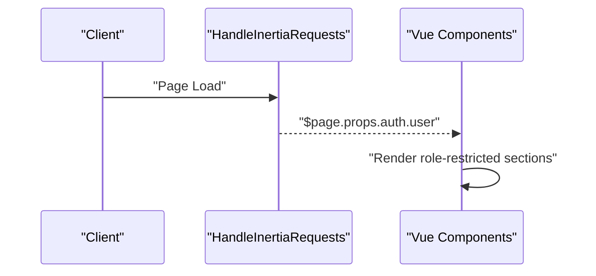
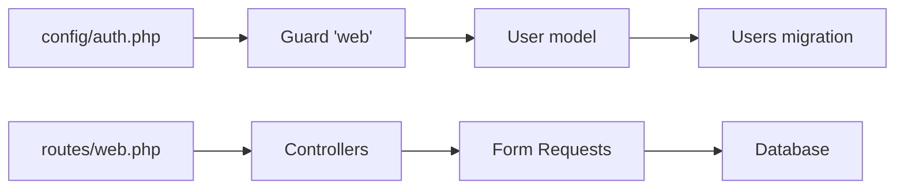

# Role-Based Access Control

<cite>
**Referenced Files in This Document**
- [User.php](file://app/Models/User.php)
- [2026_06_24_164756_add_role_and_metadata_to_users_table.php](file://database/migrations/2026_06_24_164756_add_role_and_metadata_to_users_table.php)
- [auth.php](file://config/auth.php)
- [HandleInertiaRequests.php](file://app/Http/Middleware/HandleInertiaRequests.php)
- [HandleAppearance.php](file://app/Http/Middleware/HandleAppearance.php)
- [web.php](file://routes/web.php)
- [settings.php](file://routes/settings.php)
- [JobPositionController.php](file://app/Http/Controllers/JobPositionController.php)
- [StoreJobPositionRequest.php](file://app/Http/Requests/StoreJobPositionRequest.php)
- [UpdateJobPositionRequest.php](file://app/Http/Requests/UpdateJobPositionRequest.php)
- [StoreApplicantProfileRequest.php](file://app/Http/Requests/StoreApplicantProfileRequest.php)
- [ProfileController.php](file://app/Http/Controllers/Settings/ProfileController.php)
- [SecurityController.php](file://app/Http/Controllers/Settings/SecurityController.php)
- [ProfileUpdateRequest.php](file://app/Http/Requests/Settings/ProfileUpdateRequest.php)
- [PasswordUpdateRequest.php](file://app/Http/Requests/Settings/PasswordUpdateRequest.php)
- [PasswordValidationRules.php](file://app/Concerns/PasswordValidationRules.php)
- [ProfileValidationRules.php](file://app/Concerns/ProfileValidationRules.php)
- [FortifyServiceProvider.php](file://app/Providers/FortifyServiceProvider.php)
- [2FA Challenge View](file://app/Providers/FortifyServiceProvider.php)
- [JobPositionTest.php](file://tests/Feature/JobPositionTest.php)
- [ApplicantProfileTest.php](file://tests/Feature/ApplicantProfileTest.php)
</cite>

## Table of Contents
1. [Introduction](#introduction)
2. [Project Structure](#project-structure)
3. [Core Components](#core-components)
4. [Architecture Overview](#architecture-overview)
5. [Detailed Component Analysis](#detailed-component-analysis)
6. [Dependency Analysis](#dependency-analysis)
7. [Performance Considerations](#performance-considerations)
8. [Troubleshooting Guide](#troubleshooting-guide)
9. [Conclusion](#conclusion)

## Introduction
This document explains the role-based access control (RBAC) implementation in SmartRecruit ATS. It focuses on the User model’s role system, distinguishing between HRD (Human Resource Director) and candidate roles, and documents how role assignment, permission checking, and access control are enforced across controllers, requests, routes, and middleware. It also covers authorization patterns, validation rules tailored to roles, and practical examples of role-based navigation and UI rendering.

## Project Structure
SmartRecruit ATS organizes RBAC-related logic across models, migrations, configuration, controllers, requests, routes, and middleware. Roles are persisted on the User model and enforced at multiple layers: route middleware, controller checks, and form request authorizations.

**Diagram sources**
- [auth.php:1-118](file://config/auth.php#L1-L118)
- [2026_06_24_164756_add_role_and_metadata_to_users_table.php:1-30](file://database/migrations/2026_06_24_164756_add_role_and_metadata_to_users_table.php#L1-L30)
- [User.php:1-62](file://app/Models/User.php#L1-L62)
- [HandleInertiaRequests.php:1-48](file://app/Http/Middleware/HandleInertiaRequests.php#L1-L48)
- [HandleAppearance.php:1-24](file://app/Http/Middleware/HandleAppearance.php#L1-L24)
- [web.php:1-32](file://routes/web.php#L1-L32)
- [settings.php:1-35](file://routes/settings.php#L1-L35)
- [JobPositionController.php:1-100](file://app/Http/Controllers/JobPositionController.php#L1-L100)
- [StoreJobPositionRequest.php:1-25](file://app/Http/Requests/StoreJobPositionRequest.php#L1-L25)
- [UpdateJobPositionRequest.php:1-25](file://app/Http/Requests/UpdateJobPositionRequest.php#L1-L25)
- [StoreApplicantProfileRequest.php:1-25](file://app/Http/Requests/StoreApplicantProfileRequest.php#L1-L25)
- [ProfileController.php:1-63](file://app/Http/Controllers/Settings/ProfileController.php#L1-L63)
- [SecurityController.php:1-67](file://app/Http/Controllers/Settings/SecurityController.php#L1-L67)
- [ProfileUpdateRequest.php:1-23](file://app/Http/Requests/Settings/ProfileUpdateRequest.php#L1-L23)
- [PasswordUpdateRequest.php:1-26](file://app/Http/Requests/Settings/PasswordUpdateRequest.php#L1-L26)

**Section sources**
- [auth.php:1-118](file://config/auth.php#L1-L118)
- [web.php:1-32](file://routes/web.php#L1-L32)
- [settings.php:1-35](file://routes/settings.php#L1-L35)

## Core Components
- User model with role and metadata fields:
  - Role field is stored as a string with a default value and is fillable.
  - Metadata is stored as JSONB and intended for role-specific attributes.
- Authentication and session guards configured via config/auth.php.
- Route protection using middleware stacks:
  - General auth and email verification for dashboard and resource routes.
  - RequirePassword middleware for sensitive settings endpoints.
- Controller-level checks:
  - JobPositionController enforces role-based access for write operations.
- Request-level authorizations:
  - StoreJobPositionRequest and UpdateJobPositionRequest enforce HRD-only access.
  - StoreApplicantProfileRequest allows both candidates and HRD to manage profiles.
- Validation rules:
  - PasswordValidationRules and ProfileValidationRules provide role-aware validation for updates.

**Section sources**
- [User.php:29-31](file://app/Models/User.php#L29-L31)
- [2026_06_24_164756_add_role_and_metadata_to_users_table.php:14-16](file://database/migrations/2026_06_24_164756_add_role_and_metadata_to_users_table.php#L14-L16)
- [auth.php:40-74](file://config/auth.php#L40-L74)
- [web.php:18-29](file://routes/web.php#L18-L29)
- [settings.php:8-27](file://routes/settings.php#L8-L27)
- [JobPositionController.php:45-45](file://app/Http/Controllers/JobPositionController.php#L45-L45)
- [StoreJobPositionRequest.php:14-14](file://app/Http/Requests/StoreJobPositionRequest.php#L14-L14)
- [UpdateJobPositionRequest.php:14-14](file://app/Http/Requests/UpdateJobPositionRequest.php#L14-L14)
- [StoreApplicantProfileRequest.php:14-14](file://app/Http/Requests/StoreApplicantProfileRequest.php#L14-L14)
- [PasswordValidationRules.php:15-28](file://app/Concerns/PasswordValidationRules.php#L15-L28)
- [ProfileValidationRules.php:16-50](file://app/Concerns/ProfileValidationRules.php#L16-L50)

## Architecture Overview
RBAC spans configuration, persistence, transport, and presentation layers:
- Persistence: Users table extended with role and metadata columns.
- Transport: Session-based authentication via the 'web' guard.
- Authorization: Route middleware, controller checks, and request authorizations.
- Presentation: Shared auth.user via Inertia middleware for UI role checks.

**Diagram sources**
- [web.php:18-29](file://routes/web.php#L18-L29)
- [settings.php:18-24](file://routes/settings.php#L18-L24)
- [JobPositionController.php:45-45](file://app/Http/Controllers/JobPositionController.php#L45-L45)
- [StoreJobPositionRequest.php:14-14](file://app/Http/Requests/StoreJobPositionRequest.php#L14-L14)
- [UpdateJobPositionRequest.php:14-14](file://app/Http/Requests/UpdateJobPositionRequest.php#L14-L14)

## Detailed Component Analysis

### User Model and Role Storage
- Role column is added to the users table with a default value of 'candidate'.
- The User model declares fillable attributes including role and metadata.
- The metadata field is cast as an array for flexible role-specific data.

**Diagram sources**
- [User.php:29-31](file://app/Models/User.php#L29-L31)
- [User.php:52-60](file://app/Models/User.php#L52-L60)
- [2026_06_24_164756_add_role_and_metadata_to_users_table.php:14-16](file://database/migrations/2026_06_24_164756_add_role_and_metadata_to_users_table.php#L14-L16)

**Section sources**
- [User.php:29-31](file://app/Models/User.php#L29-L31)
- [2026_06_24_164756_add_role_and_metadata_to_users_table.php:14-16](file://database/migrations/2026_06_24_164756_add_role_and_metadata_to_users_table.php#L14-L16)

### Authentication and Guards
- The 'web' guard uses the session driver and Eloquent provider with the User model.
- Fortify integrates with Inertia for SPA-like flows and sets up login views.

**Diagram sources**
- [auth.php:40-74](file://config/auth.php#L40-L74)
- [FortifyServiceProvider.php:51-54](file://app/Providers/FortifyServiceProvider.php#L51-L54)

**Section sources**
- [auth.php:40-74](file://config/auth.php#L40-L74)
- [FortifyServiceProvider.php:51-54](file://app/Providers/FortifyServiceProvider.php#L51-L54)

### Route Guards and Policy Enforcement
- Dashboard and protected resources require both 'auth' and 'verified' middleware.
- Sensitive settings endpoints apply RequirePassword middleware.
- Controllers enforce role checks for write operations.

**Diagram sources**
- [web.php:18-29](file://routes/web.php#L18-L29)
- [settings.php:18-24](file://routes/settings.php#L18-L24)
- [JobPositionController.php:45-45](file://app/Http/Controllers/JobPositionController.php#L45-L45)

**Section sources**
- [web.php:18-29](file://routes/web.php#L18-L29)
- [settings.php:18-24](file://routes/settings.php#L18-L24)
- [JobPositionController.php:45-45](file://app/Http/Controllers/JobPositionController.php#L45-L45)

### Controller-Level Access Checks
- JobPositionController restricts write operations to HRD users.
- ProfileController and SecurityController operate under general auth and verified constraints.

**Diagram sources**
- [JobPositionController.php:45-45](file://app/Http/Controllers/JobPositionController.php#L45-L45)
- [StoreJobPositionRequest.php:14-14](file://app/Http/Requests/StoreJobPositionRequest.php#L14-L14)
- [UpdateJobPositionRequest.php:14-14](file://app/Http/Requests/UpdateJobPositionRequest.php#L14-L14)

**Section sources**
- [JobPositionController.php:45-45](file://app/Http/Controllers/JobPositionController.php#L45-L45)
- [StoreJobPositionRequest.php:14-14](file://app/Http/Requests/StoreJobPositionRequest.php#L14-L14)
- [UpdateJobPositionRequest.php:14-14](file://app/Http/Requests/UpdateJobPositionRequest.php#L14-L14)

### Request-Level Authorization Patterns
- StoreJobPositionRequest and UpdateJobPositionRequest enforce HRD-only access via a simple role check.
- StoreApplicantProfileRequest permits both candidates and HRD to manage profiles.

**Diagram sources**
- [StoreJobPositionRequest.php:14-14](file://app/Http/Requests/StoreJobPositionRequest.php#L14-L14)
- [UpdateJobPositionRequest.php:14-14](file://app/Http/Requests/UpdateJobPositionRequest.php#L14-L14)
- [StoreApplicantProfileRequest.php:14-14](file://app/Http/Requests/StoreApplicantProfileRequest.php#L14-L14)

**Section sources**
- [StoreJobPositionRequest.php:14-14](file://app/Http/Requests/StoreJobPositionRequest.php#L14-L14)
- [UpdateJobPositionRequest.php:14-14](file://app/Http/Requests/UpdateJobPositionRequest.php#L14-L14)
- [StoreApplicantProfileRequest.php:14-14](file://app/Http/Requests/StoreApplicantProfileRequest.php#L14-L14)

### Validation Rules Tailored to Roles
- PasswordUpdateRequest composes PasswordValidationRules for password strength and current password confirmation.
- ProfileUpdateRequest composes ProfileValidationRules for name and email uniqueness with optional ignore for existing users.

**Diagram sources**
- [PasswordUpdateRequest.php:18-24](file://app/Http/Requests/Settings/PasswordUpdateRequest.php#L18-L24)
- [PasswordValidationRules.php:15-28](file://app/Concerns/PasswordValidationRules.php#L15-L28)
- [ProfileUpdateRequest.php:18-21](file://app/Http/Requests/Settings/ProfileUpdateRequest.php#L18-L21)
- [ProfileValidationRules.php:16-50](file://app/Concerns/ProfileValidationRules.php#L16-L50)

**Section sources**
- [PasswordUpdateRequest.php:18-24](file://app/Http/Requests/Settings/PasswordUpdateRequest.php#L18-L24)
- [PasswordValidationRules.php:15-28](file://app/Concerns/PasswordValidationRules.php#L15-L28)
- [ProfileUpdateRequest.php:18-21](file://app/Http/Requests/Settings/ProfileUpdateRequest.php#L18-L21)
- [ProfileValidationRules.php:16-50](file://app/Concerns/ProfileValidationRules.php#L16-L50)

### View-Level Role Restrictions and UI Rendering
- Inertia middleware shares the authenticated user globally, enabling UI components to render role-restricted content.
- Tests demonstrate role-specific behavior for job positions and profiles.

**Diagram sources**
- [HandleInertiaRequests.php:36-46](file://app/Http/Middleware/HandleInertiaRequests.php#L36-L46)
- [JobPositionTest.php:23-26](file://tests/Feature/JobPositionTest.php#L23-L26)
- [ApplicantProfileTest.php:6-6](file://tests/Feature/ApplicantProfileTest.php#L6-L6)

**Section sources**
- [HandleInertiaRequests.php:36-46](file://app/Http/Middleware/HandleInertiaRequests.php#L36-L46)
- [JobPositionTest.php:23-26](file://tests/Feature/JobPositionTest.php#L23-L26)
- [ApplicantProfileTest.php:6-6](file://tests/Feature/ApplicantProfileTest.php#L6-L6)

## Dependency Analysis
RBAC depends on consistent role storage, middleware enforcement, and layered authorization checks.

**Diagram sources**
- [auth.php:40-74](file://config/auth.php#L40-L74)
- [User.php:29-31](file://app/Models/User.php#L29-L31)
- [2026_06_24_164756_add_role_and_metadata_to_users_table.php:14-16](file://database/migrations/2026_06_24_164756_add_role_and_metadata_to_users_table.php#L14-L16)
- [web.php:18-29](file://routes/web.php#L18-L29)

**Section sources**
- [auth.php:40-74](file://config/auth.php#L40-L74)
- [web.php:18-29](file://routes/web.php#L18-L29)

## Performance Considerations
- Keep role checks simple and fast (single attribute lookup).
- Prefer early exits in controllers and requests to avoid unnecessary work.
- Reuse shared props (like auth.user) to minimize repeated fetches in UI components.

## Troubleshooting Guide
- Permission denied on job position operations:
  - Ensure the authenticated user has role 'hrd'.
  - Verify StoreJobPositionRequest and UpdateJobPositionRequest authorizations.
- Profile deletion requires email verification:
  - Confirm routes/settings.php applies verified middleware for delete endpoints.
- Password updates failing:
  - Confirm RequirePassword middleware is applied and rate limiting is not blocking.
- UI shows incorrect role-based content:
  - Verify HandleInertiaRequests shares auth.user and components read it correctly.

**Section sources**
- [JobPositionController.php:45-45](file://app/Http/Controllers/JobPositionController.php#L45-L45)
- [StoreJobPositionRequest.php:14-14](file://app/Http/Requests/StoreJobPositionRequest.php#L14-L14)
- [UpdateJobPositionRequest.php:14-14](file://app/Http/Requests/UpdateJobPositionRequest.php#L14-L14)
- [settings.php:18-24](file://routes/settings.php#L18-L24)
- [HandleInertiaRequests.php:36-46](file://app/Http/Middleware/HandleInertiaRequests.php#L36-L46)

## Conclusion
SmartRecruit ATS implements RBAC by persisting a role field on the User model and enforcing access at the route, controller, and request layers. The 'hrd' role is enforced for job position creation and updates, while profile management is broadly permitted for both candidates and HRD. Validation rules ensure secure password and profile updates, and Inertia middleware enables role-aware UI rendering. This layered approach provides clear separation of concerns and predictable access control across the application.