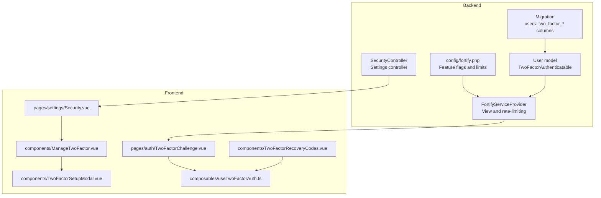
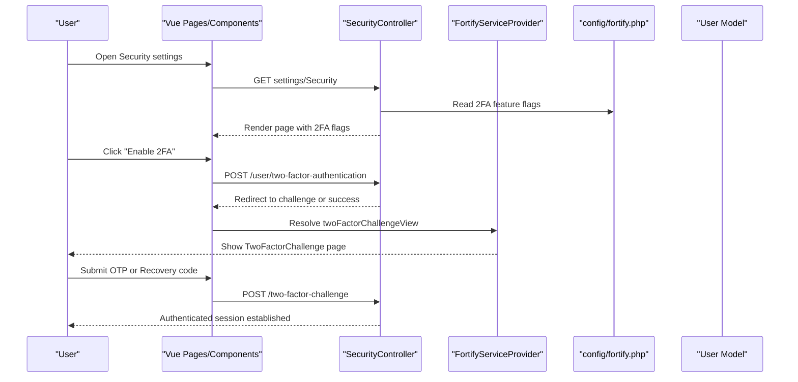
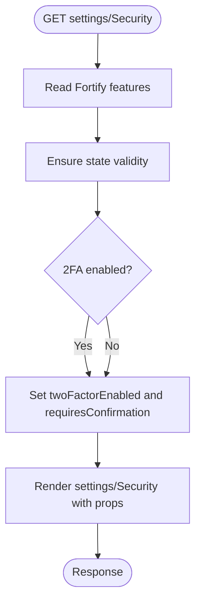
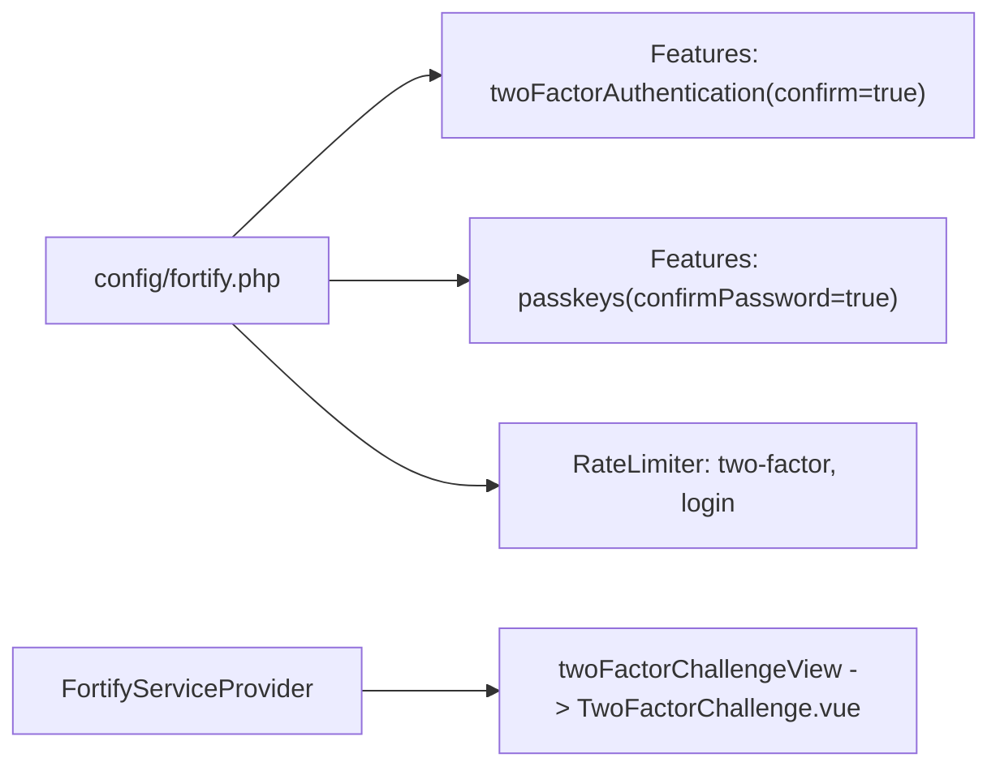
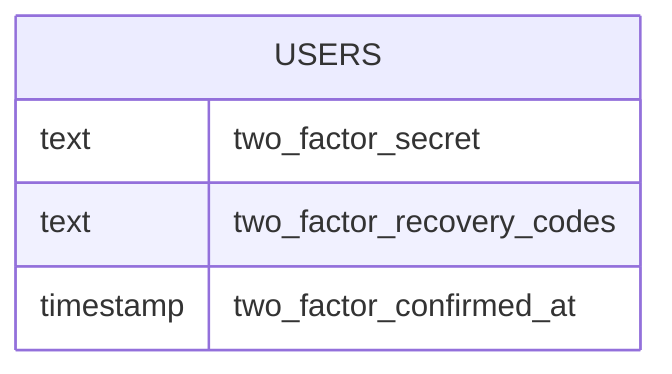
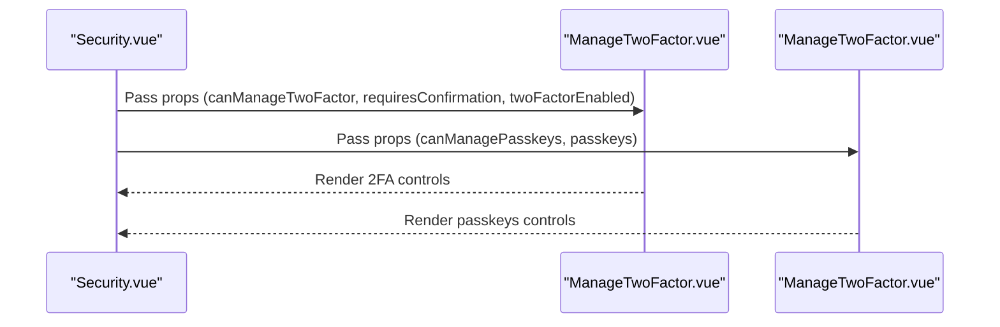
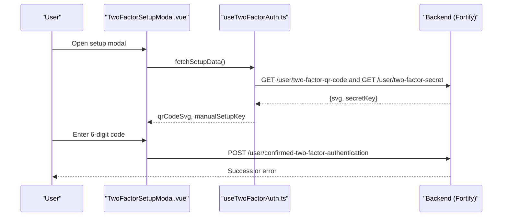
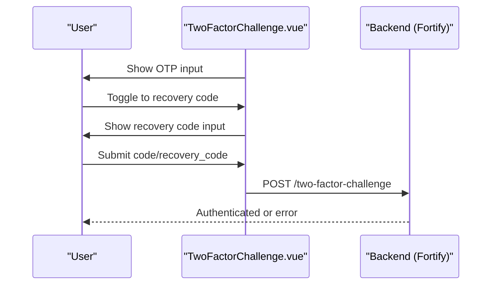
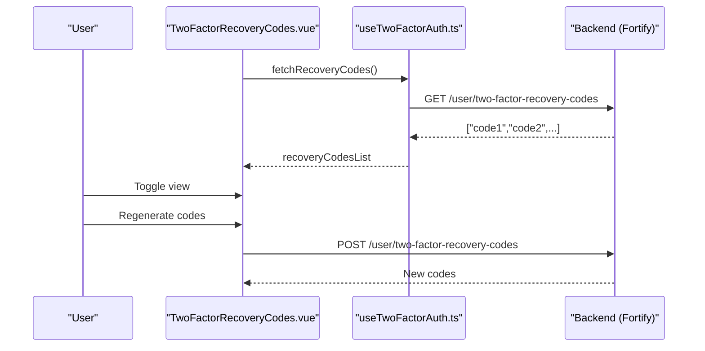
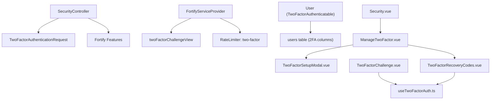

# Two-Factor Authentication

<cite>
**Referenced Files in This Document**
- [SecurityController.php](file://app/Http/Controllers/Settings/SecurityController.php)
- [TwoFactorAuthenticationRequest.php](file://app/Http/Requests/Settings/TwoFactorAuthenticationRequest.php)
- [FortifyServiceProvider.php](file://app/Providers/FortifyServiceProvider.php)
- [fortify.php](file://config/fortify.php)
- [User.php](file://app/Models/User.php)
- [2025_08_14_170933_add_two_factor_columns_to_users_table.php](file://database/migrations/2025_08_14_170933_add_two_factor_columns_to_users_table.php)
- [Security.vue](file://resources/js/pages/settings/Security.vue)
- [ManageTwoFactor.vue](file://resources/js/components/ManageTwoFactor.vue)
- [TwoFactorSetupModal.vue](file://resources/js/components/TwoFactorSetupModal.vue)
- [TwoFactorChallenge.vue](file://resources/js/pages/auth/TwoFactorChallenge.vue)
- [TwoFactorRecoveryCodes.vue](file://resources/js/components/TwoFactorRecoveryCodes.vue)
- [useTwoFactorAuth.ts](file://resources/js/composables/useTwoFactorAuth.ts)
- [SKILL.md](file://.agents/skills/fortify-development/SKILL.md)
</cite>

## Table of Contents
1. [Introduction](#introduction)
2. [Project Structure](#project-structure)
3. [Core Components](#core-components)
4. [Architecture Overview](#architecture-overview)
5. [Detailed Component Analysis](#detailed-component-analysis)
6. [Dependency Analysis](#dependency-analysis)
7. [Performance Considerations](#performance-considerations)
8. [Troubleshooting Guide](#troubleshooting-guide)
9. [Conclusion](#conclusion)
10. [Appendices](#appendices)

## Introduction
This document explains the two-factor authentication (2FA) implementation in SmartRecruit ATS. It covers the backend Laravel Fortify integration, session-based authentication states, and the frontend components that enable users to enroll in 2FA, verify authenticator codes, manage backup recovery codes, and recover access using backup codes. Practical examples demonstrate the end-to-end flows for enrollment, verification challenges, and fallback procedures.

## Project Structure
The 2FA implementation spans backend controllers and requests, Fortify configuration and service provider, database schema for 2FA fields, and Vue-based frontend components and composables.

**Diagram sources**
- [SecurityController.php:19-51](file://app/Http/Controllers/Settings/SecurityController.php#L19-L51)
- [FortifyServiceProvider.php:74](file://app/Providers/FortifyServiceProvider.php#L74)
- [fortify.php:163-175](file://config/fortify.php#L163-L175)
- [2025_08_14_170933_add_two_factor_columns_to_users_table.php:14-18](file://database/migrations/2025_08_14_170933_add_two_factor_columns_to_users_table.php#L14-L18)
- [User.php:35](file://app/Models/User.php#L35)
- [Security.vue:109-113](file://resources/js/pages/settings/Security.vue#L109-L113)
- [ManageTwoFactor.vue:87-91](file://resources/js/components/ManageTwoFactor.vue#L87-L91)
- [TwoFactorSetupModal.vue:113-149](file://resources/js/components/TwoFactorSetupModal.vue#L113-L149)
- [TwoFactorChallenge.vue:55-98](file://resources/js/pages/auth/TwoFactorChallenge.vue#L55-L98)
- [TwoFactorRecoveryCodes.vue:65-80](file://resources/js/components/TwoFactorRecoveryCodes.vue#L65-L80)
- [useTwoFactorAuth.ts:30-98](file://resources/js/composables/useTwoFactorAuth.ts#L30-L98)

**Section sources**
- [SecurityController.php:19-51](file://app/Http/Controllers/Settings/SecurityController.php#L19-L51)
- [FortifyServiceProvider.php:74](file://app/Providers/FortifyServiceProvider.php#L74)
- [fortify.php:163-175](file://config/fortify.php#L163-L175)
- [2025_08_14_170933_add_two_factor_columns_to_users_table.php:14-18](file://database/migrations/2025_08_14_170933_add_two_factor_columns_to_users_table.php#L14-L18)
- [User.php:35](file://app/Models/User.php#L35)
- [Security.vue:109-113](file://resources/js/pages/settings/Security.vue#L109-L113)
- [ManageTwoFactor.vue:87-91](file://resources/js/components/ManageTwoFactor.vue#L87-L91)
- [TwoFactorSetupModal.vue:113-149](file://resources/js/components/TwoFactorSetupModal.vue#L113-L149)
- [TwoFactorChallenge.vue:55-98](file://resources/js/pages/auth/TwoFactorChallenge.vue#L55-L98)
- [TwoFactorRecoveryCodes.vue:65-80](file://resources/js/components/TwoFactorRecoveryCodes.vue#L65-L80)
- [useTwoFactorAuth.ts:30-98](file://resources/js/composables/useTwoFactorAuth.ts#L30-L98)

## Core Components
- Backend controllers and requests:
  - Settings controller renders security settings and exposes 2FA flags and confirmation requirements.
  - Two-factor request integrates with Fortify’s state helpers.
- Fortify configuration and provider:
  - Feature flags enable 2FA with optional password confirmation.
  - Rate limiters protect 2FA and login attempts.
  - Views map to Inertia pages for challenge and registration flows.
- Database schema:
  - Users table augmented with two-factor secret, recovery codes, and confirmation timestamp.
- Frontend components:
  - Security page composes manage 2FA and passkeys sections.
  - 2FA setup modal handles QR code rendering, manual setup key, and verification steps.
  - Challenge page supports OTP entry and recovery code fallback.
  - Recovery codes card displays and regenerates backup codes.
- Composable:
  - Centralized logic to fetch QR code SVG, manual setup key, and recovery codes; manages errors and state.

**Section sources**
- [SecurityController.php:19-51](file://app/Http/Controllers/Settings/SecurityController.php#L19-L51)
- [TwoFactorAuthenticationRequest.php:11](file://app/Http/Requests/Settings/TwoFactorAuthenticationRequest.php#L11)
- [FortifyServiceProvider.php:74](file://app/Providers/FortifyServiceProvider.php#L74)
- [fortify.php:163-175](file://config/fortify.php#L163-L175)
- [2025_08_14_170933_add_two_factor_columns_to_users_table.php:14-18](file://database/migrations/2025_08_14_170933_add_two_factor_columns_to_users_table.php#L14-L18)
- [Security.vue:109-113](file://resources/js/pages/settings/Security.vue#L109-L113)
- [ManageTwoFactor.vue:87-91](file://resources/js/components/ManageTwoFactor.vue#L87-L91)
- [TwoFactorSetupModal.vue:113-149](file://resources/js/components/TwoFactorSetupModal.vue#L113-L149)
- [TwoFactorChallenge.vue:55-98](file://resources/js/pages/auth/TwoFactorChallenge.vue#L55-L98)
- [TwoFactorRecoveryCodes.vue:65-80](file://resources/js/components/TwoFactorRecoveryCodes.vue#L65-L80)
- [useTwoFactorAuth.ts:30-98](file://resources/js/composables/useTwoFactorAuth.ts#L30-L98)

## Architecture Overview
SmartRecruit ATS leverages Laravel Fortify for 2FA. The backend enforces feature flags and rate limits, while the frontend uses Inertia to render Vue pages and modals. Session-based state tracks 2FA enrollment and challenge prompts.

**Diagram sources**
- [SecurityController.php:19-51](file://app/Http/Controllers/Settings/SecurityController.php#L19-L51)
- [FortifyServiceProvider.php:74](file://app/Providers/FortifyServiceProvider.php#L74)
- [fortify.php:163-175](file://config/fortify.php#L163-L175)
- [User.php:35](file://app/Models/User.php#L35)

## Detailed Component Analysis

### Backend: SecurityController and 2FA Flags
- Renders the security settings page and injects:
  - canManageTwoFactor and canManagePasskeys flags.
  - Two-factor state flags: twoFactorEnabled and requiresConfirmation.
  - Password rules string for client-side validation hints.
- Uses the two-factor request to ensure state validity and query user flags.

**Diagram sources**
- [SecurityController.php:19-51](file://app/Http/Controllers/Settings/SecurityController.php#L19-L51)
- [TwoFactorAuthenticationRequest.php:11](file://app/Http/Requests/Settings/TwoFactorAuthenticationRequest.php#L11)

**Section sources**
- [SecurityController.php:19-51](file://app/Http/Controllers/Settings/SecurityController.php#L19-L51)
- [TwoFactorAuthenticationRequest.php:11](file://app/Http/Requests/Settings/TwoFactorAuthenticationRequest.php#L11)

### Backend: Fortify 2FA Configuration and Rate Limits
- Features:
  - Two-factor authentication enabled with optional password confirmation.
  - Passkeys supported with confirmation requirement.
- Rate limiting:
  - Separate limiter for two-factor attempts keyed by login session ID.
  - General login limiter keyed by normalized username and IP.
- Views:
  - twoFactorChallengeView mapped to the Inertia TwoFactorChallenge page.

**Diagram sources**
- [fortify.php:163-175](file://config/fortify.php#L163-L175)
- [FortifyServiceProvider.php:84-98](file://app/Providers/FortifyServiceProvider.php#L84-L98)
- [FortifyServiceProvider.php:74](file://app/Providers/FortifyServiceProvider.php#L74)

**Section sources**
- [fortify.php:163-175](file://config/fortify.php#L163-L175)
- [FortifyServiceProvider.php:84-98](file://app/Providers/FortifyServiceProvider.php#L84-L98)
- [FortifyServiceProvider.php:74](file://app/Providers/FortifyServiceProvider.php#L74)

### Backend: User Model and Database Schema
- The User model uses the TwoFactorAuthenticatable trait to integrate with Fortify’s 2FA capabilities.
- The migration adds three columns to the users table:
  - two_factor_secret: stores the TOTP secret.
  - two_factor_recovery_codes: stores JSON-encoded recovery codes.
  - two_factor_confirmed_at: marks when 2FA was confirmed.

**Diagram sources**
- [User.php:35](file://app/Models/User.php#L35)
- [2025_08_14_170933_add_two_factor_columns_to_users_table.php:14-18](file://database/migrations/2025_08_14_170933_add_two_factor_columns_to_users_table.php#L14-L18)

**Section sources**
- [User.php:35](file://app/Models/User.php#L35)
- [2025_08_14_170933_add_two_factor_columns_to_users_table.php:14-18](file://database/migrations/2025_08_14_170933_add_two_factor_columns_to_users_table.php#L14-L18)

### Frontend: Security Page Composition
- The Security page receives props from the backend (flags and password rules).
- It composes ManageTwoFactor and ManagePasskeys components to present 2FA controls and passkey management.

**Diagram sources**
- [Security.vue:109-113](file://resources/js/pages/settings/Security.vue#L109-L113)
- [ManageTwoFactor.vue:87-91](file://resources/js/components/ManageTwoFactor.vue#L87-L91)

**Section sources**
- [Security.vue:109-113](file://resources/js/pages/settings/Security.vue#L109-L113)
- [ManageTwoFactor.vue:87-91](file://resources/js/components/ManageTwoFactor.vue#L87-L91)

### Frontend: 2FA Setup Modal (QR Code, Manual Key, Verification)
- Fetches setup data (QR code SVG and manual setup key) when the modal opens.
- Supports scanning the QR code or entering the manual key into an authenticator app.
- On confirmation, submits the 6-digit code to Fortify’s confirmation endpoint.
- Handles errors and clears state appropriately.

**Diagram sources**
- [TwoFactorSetupModal.vue:113-149](file://resources/js/components/TwoFactorSetupModal.vue#L113-L149)
- [useTwoFactorAuth.ts:30-98](file://resources/js/composables/useTwoFactorAuth.ts#L30-L98)
- [SKILL.md:140-144](file://.agents/skills/fortify-development/SKILL.md#L140-L144)

**Section sources**
- [TwoFactorSetupModal.vue:113-149](file://resources/js/components/TwoFactorSetupModal.vue#L113-L149)
- [useTwoFactorAuth.ts:30-98](file://resources/js/composables/useTwoFactorAuth.ts#L30-L98)
- [SKILL.md:140-144](file://.agents/skills/fortify-development/SKILL.md#L140-L144)

### Frontend: Challenge Verification (OTP and Recovery Code)
- Presents OTP input with 6 slots and a toggle to switch to recovery code mode.
- Submits either the OTP or recovery code to Fortify’s challenge endpoint.
- Updates page metadata dynamically based on mode.

**Diagram sources**
- [TwoFactorChallenge.vue:55-98](file://resources/js/pages/auth/TwoFactorChallenge.vue#L55-L98)
- [TwoFactorChallenge.vue:102-130](file://resources/js/pages/auth/TwoFactorChallenge.vue#L102-L130)
- [SKILL.md:142](file://.agents/skills/fortify-development/SKILL.md#L142)

**Section sources**
- [TwoFactorChallenge.vue:55-98](file://resources/js/pages/auth/TwoFactorChallenge.vue#L55-L98)
- [TwoFactorChallenge.vue:102-130](file://resources/js/pages/auth/TwoFactorChallenge.vue#L102-L130)
- [SKILL.md:142](file://.agents/skills/fortify-development/SKILL.md#L142)

### Frontend: Backup Recovery Code Management
- Displays recovery codes in a card with visibility toggle.
- Allows regenerating codes, which replaces the stored codes.
- Uses the composable to fetch and refresh lists.

**Diagram sources**
- [TwoFactorRecoveryCodes.vue:65-80](file://resources/js/components/TwoFactorRecoveryCodes.vue#L65-L80)
- [useTwoFactorAuth.ts:76-86](file://resources/js/composables/useTwoFactorAuth.ts#L76-L86)
- [SKILL.md:144](file://.agents/skills/fortify-development/SKILL.md#L144)

**Section sources**
- [TwoFactorRecoveryCodes.vue:65-80](file://resources/js/components/TwoFactorRecoveryCodes.vue#L65-L80)
- [useTwoFactorAuth.ts:76-86](file://resources/js/composables/useTwoFactorAuth.ts#L76-L86)
- [SKILL.md:144](file://.agents/skills/fortify-development/SKILL.md#L144)

## Dependency Analysis
- Backend:
  - SecurityController depends on Fortify features and the two-factor request trait.
  - FortifyServiceProvider binds views and rate limiters.
  - User model integrates Fortify traits for 2FA and passkeys.
- Frontend:
  - Security.vue composes ManageTwoFactor.vue and ManagePasskeys.vue.
  - ManageTwoFactor.vue orchestrates TwoFactorSetupModal.vue and TwoFactorRecoveryCodes.vue.
  - TwoFactorChallenge.vue and TwoFactorRecoveryCodes.vue rely on useTwoFactorAuth.ts for data fetching and state.
- External endpoints:
  - The skill guide documents the key endpoints for 2FA operations.

**Diagram sources**
- [SecurityController.php:19-51](file://app/Http/Controllers/Settings/SecurityController.php#L19-L51)
- [TwoFactorAuthenticationRequest.php:11](file://app/Http/Requests/Settings/TwoFactorAuthenticationRequest.php#L11)
- [FortifyServiceProvider.php:74](file://app/Providers/FortifyServiceProvider.php#L74)
- [FortifyServiceProvider.php:84-98](file://app/Providers/FortifyServiceProvider.php#L84-L98)
- [User.php:35](file://app/Models/User.php#L35)
- [2025_08_14_170933_add_two_factor_columns_to_users_table.php:14-18](file://database/migrations/2025_08_14_170933_add_two_factor_columns_to_users_table.php#L14-L18)
- [Security.vue:109-113](file://resources/js/pages/settings/Security.vue#L109-L113)
- [ManageTwoFactor.vue:87-91](file://resources/js/components/ManageTwoFactor.vue#L87-L91)
- [TwoFactorSetupModal.vue:113-149](file://resources/js/components/TwoFactorSetupModal.vue#L113-L149)
- [TwoFactorRecoveryCodes.vue:65-80](file://resources/js/components/TwoFactorRecoveryCodes.vue#L65-L80)
- [TwoFactorChallenge.vue:55-98](file://resources/js/pages/auth/TwoFactorChallenge.vue#L55-L98)
- [useTwoFactorAuth.ts:30-98](file://resources/js/composables/useTwoFactorAuth.ts#L30-L98)

**Section sources**
- [SecurityController.php:19-51](file://app/Http/Controllers/Settings/SecurityController.php#L19-L51)
- [TwoFactorAuthenticationRequest.php:11](file://app/Http/Requests/Settings/TwoFactorAuthenticationRequest.php#L11)
- [FortifyServiceProvider.php:74](file://app/Providers/FortifyServiceProvider.php#L74)
- [FortifyServiceProvider.php:84-98](file://app/Providers/FortifyServiceProvider.php#L84-L98)
- [User.php:35](file://app/Models/User.php#L35)
- [2025_08_14_170933_add_two_factor_columns_to_users_table.php:14-18](file://database/migrations/2025_08_14_170933_add_two_factor_columns_to_users_table.php#L14-L18)
- [Security.vue:109-113](file://resources/js/pages/settings/Security.vue#L109-L113)
- [ManageTwoFactor.vue:87-91](file://resources/js/components/ManageTwoFactor.vue#L87-L91)
- [TwoFactorSetupModal.vue:113-149](file://resources/js/components/TwoFactorSetupModal.vue#L113-L149)
- [TwoFactorRecoveryCodes.vue:65-80](file://resources/js/components/TwoFactorRecoveryCodes.vue#L65-L80)
- [TwoFactorChallenge.vue:55-98](file://resources/js/pages/auth/TwoFactorChallenge.vue#L55-L98)
- [useTwoFactorAuth.ts:30-98](file://resources/js/composables/useTwoFactorAuth.ts#L30-L98)

## Performance Considerations
- Parallel data fetching:
  - The composable fetches QR code and secret key concurrently to reduce perceived latency.
- Rate limiting:
  - Two-factor attempts are rate-limited to mitigate brute-force attacks.
- Rendering:
  - Conditional rendering avoids unnecessary DOM updates for hidden recovery code lists.

**Section sources**
- [useTwoFactorAuth.ts:88-96](file://resources/js/composables/useTwoFactorAuth.ts#L88-L96)
- [FortifyServiceProvider.php:84-98](file://app/Providers/FortifyServiceProvider.php#L84-L98)

## Troubleshooting Guide
- QR code or setup key not loading:
  - Ensure the modal triggers fetchSetupData on open and that the composable sets appropriate errors.
  - Verify the endpoints exist and are reachable.
- OTP verification fails repeatedly:
  - Confirm the authenticator app time sync and that the 6-digit code is entered correctly.
  - Check rate limiter thresholds and session state.
- Recovery code not accepted:
  - Ensure the recovery code is used immediately after regeneration and matches exactly.
  - Confirm the recovery codes endpoint returns a fresh list when toggled.
- Session state inconsistencies:
  - Use the two-factor request trait to validate and refresh state before rendering settings.

**Section sources**
- [TwoFactorSetupModal.vue:105-108](file://resources/js/components/TwoFactorSetupModal.vue#L105-L108)
- [useTwoFactorAuth.ts:33-58](file://resources/js/composables/useTwoFactorAuth.ts#L33-L58)
- [TwoFactorChallenge.vue:18-47](file://resources/js/pages/auth/TwoFactorChallenge.vue#L18-L47)
- [TwoFactorRecoveryCodes.vue:21-38](file://resources/js/components/TwoFactorRecoveryCodes.vue#L21-L38)
- [TwoFactorAuthenticationRequest.php:11](file://app/Http/Requests/Settings/TwoFactorAuthenticationRequest.php#L11)

## Conclusion
SmartRecruit ATS integrates Laravel Fortify’s 2FA capabilities with a cohesive frontend experience. Users can enable 2FA via a guided modal, verify codes through OTP or recovery codes, and manage backup codes securely. The backend enforces feature flags, rate limits, and session-aware states, while the frontend optimizes UX with parallel data fetching and responsive UI patterns.

## Appendices

### Practical Examples

- Enrolling in 2FA
  - Navigate to Security settings, click “Enable 2FA,” scan the QR code or enter the manual key, then enter the 6-digit code to confirm.
  - Reference: [TwoFactorSetupModal.vue:113-149](file://resources/js/components/TwoFactorSetupModal.vue#L113-L149), [SKILL.md:140-141](file://.agents/skills/fortify-development/SKILL.md#L140-L141)

- Verifying a 2FA challenge
  - On login, enter the 6-digit code from your authenticator app or use a recovery code if you cannot access the app.
  - Reference: [TwoFactorChallenge.vue:55-98](file://resources/js/pages/auth/TwoFactorChallenge.vue#L55-L98), [SKILL.md:142](file://.agents/skills/fortify-development/SKILL.md#L142)

- Using backup codes
  - View and toggle visibility of recovery codes; regenerate codes when needed.
  - Reference: [TwoFactorRecoveryCodes.vue:65-80](file://resources/js/components/TwoFactorRecoveryCodes.vue#L65-L80), [SKILL.md:144](file://.agents/skills/fortify-development/SKILL.md#L144)

- Managing 2FA from settings
  - From Security settings, enable/disable 2FA and review passkeys alongside 2FA controls.
  - Reference: [Security.vue:109-113](file://resources/js/pages/settings/Security.vue#L109-L113), [ManageTwoFactor.vue:87-91](file://resources/js/components/ManageTwoFactor.vue#L87-L91)