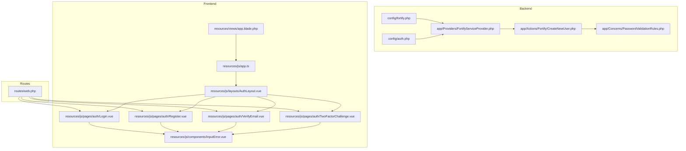
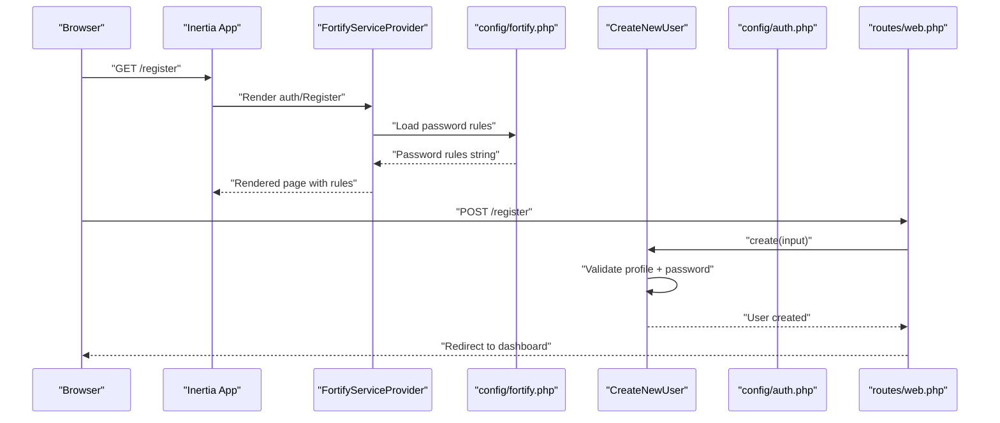
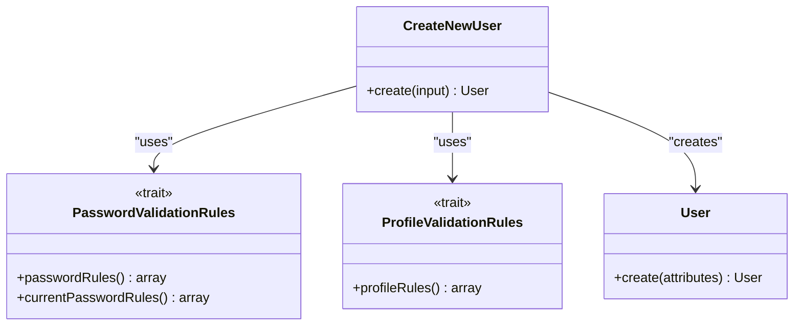
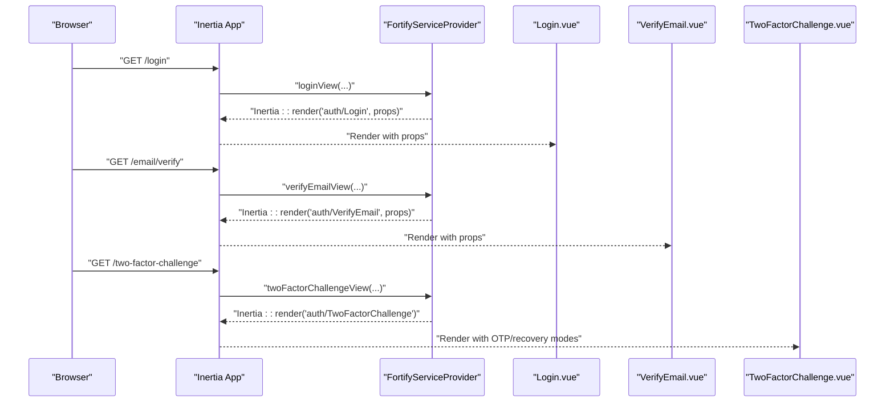
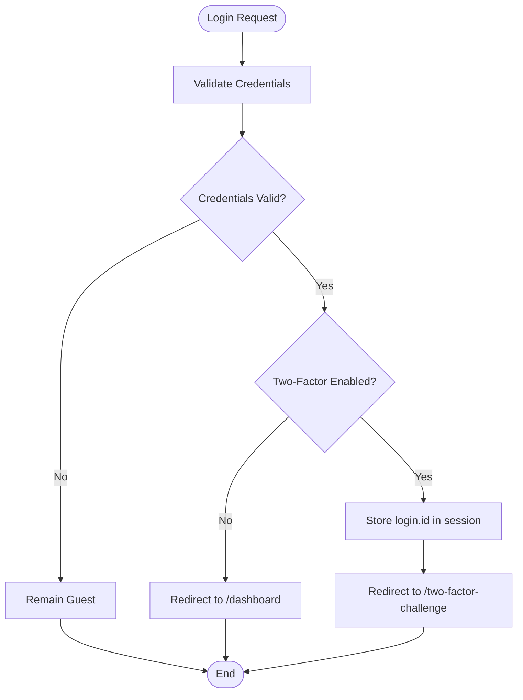
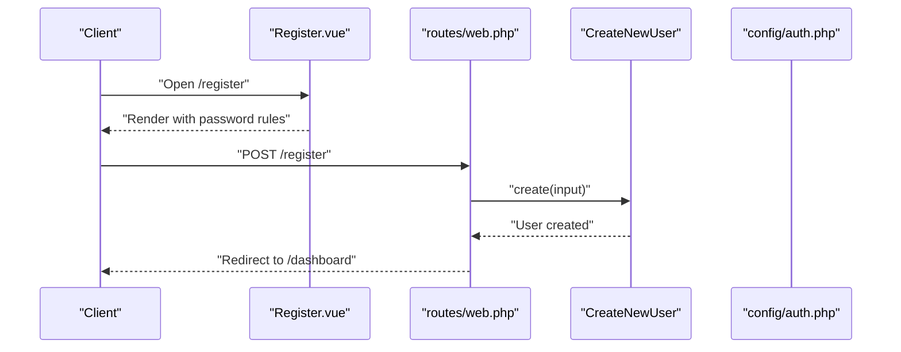
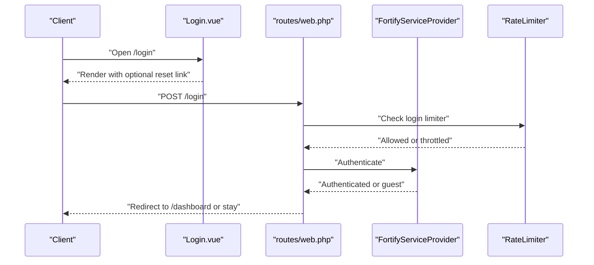
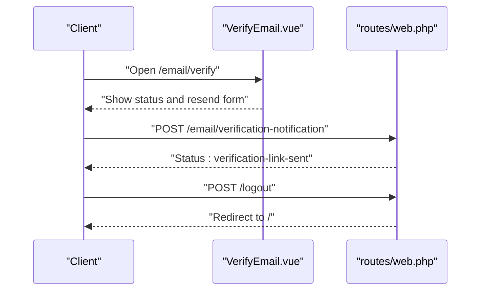
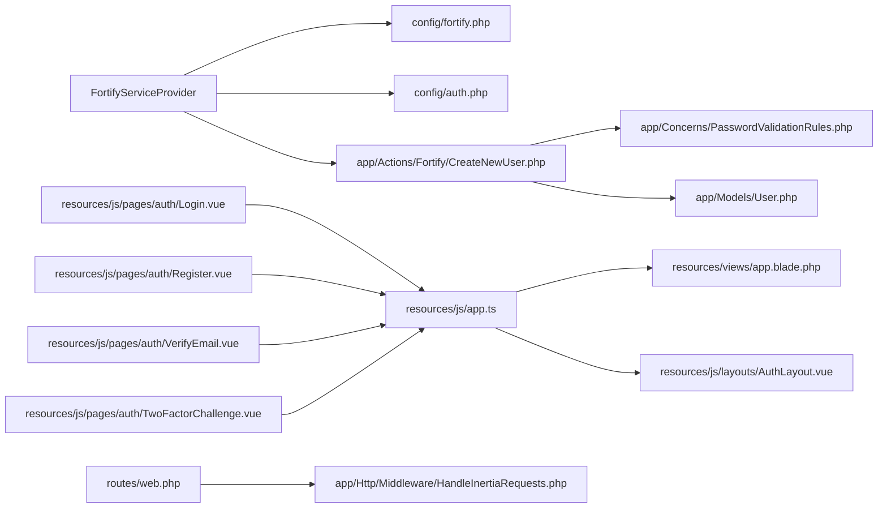

# User Registration & Login

<cite>
**Referenced Files in This Document**
- [CreateNewUser.php](file://app/Actions/Fortify/CreateNewUser.php)
- [PasswordValidationRules.php](file://app/Concerns/PasswordValidationRules.php)
- [fortify.php](file://config/fortify.php)
- [auth.php](file://config/auth.php)
- [FortifyServiceProvider.php](file://app/Providers/FortifyServiceProvider.php)
- [Login.vue](file://resources/js/pages/auth/Login.vue)
- [Register.vue](file://resources/js/pages/auth/Register.vue)
- [VerifyEmail.vue](file://resources/js/pages/auth/VerifyEmail.vue)
- [TwoFactorChallenge.vue](file://resources/js/pages/auth/TwoFactorChallenge.vue)
- [InputError.vue](file://resources/js/components/InputError.vue)
- [web.php](file://routes/web.php)
- [HandleInertiaRequests.php](file://app/Http/Middleware/HandleInertiaRequests.php)
- [app.ts](file://resources/js/app.ts)
- [app.blade.php](file://resources/views/app.blade.php)
- [AuthLayout.vue](file://resources/js/layouts/AuthLayout.vue)
- [RegistrationTest.php](file://tests/Feature/Auth/RegistrationTest.php)
- [AuthenticationTest.php](file://tests/Feature/Auth/AuthenticationTest.php)
</cite>

## Table of Contents
1. [Introduction](#introduction)
2. [Project Structure](#project-structure)
3. [Core Components](#core-components)
4. [Architecture Overview](#architecture-overview)
5. [Detailed Component Analysis](#detailed-component-analysis)
6. [Dependency Analysis](#dependency-analysis)
7. [Performance Considerations](#performance-considerations)
8. [Troubleshooting Guide](#troubleshooting-guide)
9. [Conclusion](#conclusion)

## Introduction
This document explains the user registration and login functionality in SmartRecruit ATS, focusing on Laravel Fortify integration, password validation, email verification, secure login, and Inertia.js-driven SPA experiences. It covers the CreateNewUser action, form validation patterns, session management, rate limiting, and practical examples of registration and login flows.

## Project Structure
SmartRecruit ATS integrates Laravel Fortify for authentication and Inertia.js for a seamless single-page experience. Key areas:
- Backend: Fortify configuration, service provider wiring, and action classes
- Frontend: Vue pages for login, registration, email verification, and two-factor challenge
- Middleware: Inertia request handling and route protection
- Tests: Behavioral coverage for registration and authentication flows

**Diagram sources**
- [fortify.php:1-178](file://config/fortify.php#L1-L178)
- [auth.php:1-118](file://config/auth.php#L1-L118)
- [FortifyServiceProvider.php:1-101](file://app/Providers/FortifyServiceProvider.php#L1-L101)
- [CreateNewUser.php:1-34](file://app/Actions/Fortify/CreateNewUser.php#L1-L34)
- [PasswordValidationRules.php:1-30](file://app/Concerns/PasswordValidationRules.php#L1-L30)
- [web.php:1-32](file://routes/web.php#L1-L32)
- [app.ts:1-34](file://resources/js/app.ts#L1-L34)
- [AuthLayout.vue:1-15](file://resources/js/layouts/AuthLayout.vue#L1-L15)
- [app.blade.php:1-48](file://resources/views/app.blade.php#L1-L48)
- [Login.vue:1-111](file://resources/js/pages/auth/Login.vue#L1-L111)
- [Register.vue:1-115](file://resources/js/pages/auth/Register.vue#L1-L115)
- [VerifyEmail.vue:1-48](file://resources/js/pages/auth/VerifyEmail.vue#L1-L48)
- [TwoFactorChallenge.vue:1-134](file://resources/js/pages/auth/TwoFactorChallenge.vue#L1-L134)
- [InputError.vue:1-14](file://resources/js/components/InputError.vue#L1-L14)

**Section sources**
- [fortify.php:1-178](file://config/fortify.php#L1-L178)
- [auth.php:1-118](file://config/auth.php#L1-L118)
- [FortifyServiceProvider.php:1-101](file://app/Providers/FortifyServiceProvider.php#L1-L101)
- [web.php:1-32](file://routes/web.php#L1-L32)
- [app.ts:1-34](file://resources/js/app.ts#L1-L34)
- [AuthLayout.vue:1-15](file://resources/js/layouts/AuthLayout.vue#L1-L15)
- [app.blade.php:1-48](file://resources/views/app.blade.php#L1-L48)
- [Login.vue:1-111](file://resources/js/pages/auth/Login.vue#L1-L111)
- [Register.vue:1-115](file://resources/js/pages/auth/Register.vue#L1-L115)
- [VerifyEmail.vue:1-48](file://resources/js/pages/auth/VerifyEmail.vue#L1-L48)
- [TwoFactorChallenge.vue:1-134](file://resources/js/pages/auth/TwoFactorChallenge.vue#L1-L134)
- [InputError.vue:1-14](file://resources/js/components/InputError.vue#L1-L14)

## Core Components
- Fortify configuration enables registration, password resets, email verification, two-factor authentication, and passkeys.
- FortifyServiceProvider wires CreateNewUser and view renderers to Inertia.
- CreateNewUser validates profile and password rules and creates the User record.
- PasswordValidationRules centralizes password policy enforcement.
- Inertia.js renders Vue pages with shared data and layout selection.

Key capabilities:
- Registration with validated name, email, and password
- Secure login with rate limiting and optional two-factor challenge
- Email verification workflow with resend capability
- Two-factor authentication with OTP and recovery codes

**Section sources**
- [fortify.php:163-175](file://config/fortify.php#L163-L175)
- [FortifyServiceProvider.php:40-77](file://app/Providers/FortifyServiceProvider.php#L40-L77)
- [CreateNewUser.php:20-32](file://app/Actions/Fortify/CreateNewUser.php#L20-L32)
- [PasswordValidationRules.php:15-28](file://app/Concerns/PasswordValidationRules.php#L15-L28)
- [app.ts:10-27](file://resources/js/app.ts#L10-L27)

## Architecture Overview
The authentication architecture combines Laravel Fortify with Inertia.js to deliver SPA-like flows for registration, login, verification, and two-factor challenge.

**Diagram sources**
- [FortifyServiceProvider.php:70-72](file://app/Providers/FortifyServiceProvider.php#L70-L72)
- [Register.vue:1-115](file://resources/js/pages/auth/Register.vue#L1-L115)
- [CreateNewUser.php:20-32](file://app/Actions/Fortify/CreateNewUser.php#L20-L32)
- [auth.php:1-118](file://config/auth.php#L1-L118)
- [web.php:1-32](file://routes/web.php#L1-L32)

## Detailed Component Analysis

### CreateNewUser Action
Responsibilities:
- Merge profile validation rules with password rules
- Validate incoming input
- Persist the new user

Implementation highlights:
- Uses shared validation traits for consistency
- Returns a newly created User model instance

**Diagram sources**
- [CreateNewUser.php:11-32](file://app/Actions/Fortify/CreateNewUser.php#L11-L32)
- [PasswordValidationRules.php:8-29](file://app/Concerns/PasswordValidationRules.php#L8-L29)

**Section sources**
- [CreateNewUser.php:1-34](file://app/Actions/Fortify/CreateNewUser.php#L1-L34)
- [PasswordValidationRules.php:1-30](file://app/Concerns/PasswordValidationRules.php#L1-L30)

### Password Validation Rules
- Enforces a strong default password policy and requires confirmation
- Provides reusable rules for current password checks

Policy summary:
- Required, string, meets default password requirements, confirmed

**Section sources**
- [PasswordValidationRules.php:15-28](file://app/Concerns/PasswordValidationRules.php#L15-L28)

### Fortify Configuration and Rate Limiting
- Enables registration, password reset, email verification, two-factor, and passkeys
- Defines rate limiters for login, two-factor, and passkeys
- Sets home redirect path after successful auth

Rate limiting specifics:
- Login: 5 requests per minute keyed by normalized email and IP
- Two-factor: 5 requests per minute keyed by session login ID
- Passkeys: 10 requests per minute keyed by credential ID or session ID and IP

**Section sources**
- [fortify.php:117-121](file://config/fortify.php#L117-L121)
- [FortifyServiceProvider.php:82-99](file://app/Providers/FortifyServiceProvider.php#L82-L99)

### Inertia.js Integration for Authentication Views
- Login view renders with optional password reset link and status messages
- Registration view passes password rules string for client-side guidance
- Email verification view supports resending verification emails
- Two-factor challenge supports OTP entry and recovery code fallback

**Diagram sources**
- [FortifyServiceProvider.php:49-77](file://app/Providers/FortifyServiceProvider.php#L49-L77)
- [Login.vue:1-111](file://resources/js/pages/auth/Login.vue#L1-L111)
- [VerifyEmail.vue:1-48](file://resources/js/pages/auth/VerifyEmail.vue#L1-L48)
- [TwoFactorChallenge.vue:1-134](file://resources/js/pages/auth/TwoFactorChallenge.vue#L1-L134)

**Section sources**
- [FortifyServiceProvider.php:49-77](file://app/Providers/FortifyServiceProvider.php#L49-L77)
- [Login.vue:1-111](file://resources/js/pages/auth/Login.vue#L1-L111)
- [Register.vue:1-115](file://resources/js/pages/auth/Register.vue#L1-L115)
- [VerifyEmail.vue:1-48](file://resources/js/pages/auth/VerifyEmail.vue#L1-L48)
- [TwoFactorChallenge.vue:1-134](file://resources/js/pages/auth/TwoFactorChallenge.vue#L1-L134)

### Session Management During Authentication
- After successful login, users are redirected to the configured home path
- Two-factor enabled users are redirected to the two-factor challenge and their user ID stored in the session for safe continuation
- Logout clears the session and redirects to the home route

**Diagram sources**
- [AuthenticationTest.php:25-43](file://tests/Feature/Auth/AuthenticationTest.php#L25-L43)
- [web.php:18-29](file://routes/web.php#L18-L29)

**Section sources**
- [AuthenticationTest.php:13-43](file://tests/Feature/Auth/AuthenticationTest.php#L13-L43)
- [web.php:18-29](file://routes/web.php#L18-L29)

### Practical Examples

#### Registration Flow
- Client renders the registration page with password rules
- On submit, the form posts to the registration endpoint
- Backend validates profile and password rules, then creates the user
- On success, the user is authenticated and redirected to the dashboard

**Diagram sources**
- [Register.vue:1-115](file://resources/js/pages/auth/Register.vue#L1-L115)
- [web.php:1-32](file://routes/web.php#L1-L32)
- [CreateNewUser.php:20-32](file://app/Actions/Fortify/CreateNewUser.php#L20-L32)

**Section sources**
- [RegistrationTest.php:9-25](file://tests/Feature/Auth/RegistrationTest.php#L9-L25)
- [Register.vue:1-115](file://resources/js/pages/auth/Register.vue#L1-L115)
- [web.php:1-32](file://routes/web.php#L1-L32)
- [CreateNewUser.php:20-32](file://app/Actions/Fortify/CreateNewUser.php#L20-L32)

#### Login Flow
- Client opens the login page and optionally resets password
- On submit, credentials are validated with rate limiting
- Successful login redirects to the dashboard; failed attempts remain guest

**Diagram sources**
- [Login.vue:1-111](file://resources/js/pages/auth/Login.vue#L1-L111)
- [web.php:1-32](file://routes/web.php#L1-L32)
- [FortifyServiceProvider.php:82-99](file://app/Providers/FortifyServiceProvider.php#L82-L99)
- [AuthenticationTest.php:13-23](file://tests/Feature/Auth/AuthenticationTest.php#L13-L23)

**Section sources**
- [Login.vue:1-111](file://resources/js/pages/auth/Login.vue#L1-L111)
- [web.php:1-32](file://routes/web.php#L1-L32)
- [FortifyServiceProvider.php:82-99](file://app/Providers/FortifyServiceProvider.php#L82-L99)
- [AuthenticationTest.php:13-23](file://tests/Feature/Auth/AuthenticationTest.php#L13-L23)

#### Email Verification Workflow
- After registration, users land on the verification page
- They can resend the verification email or log out
- Verified users gain access to protected routes

**Diagram sources**
- [VerifyEmail.vue:1-48](file://resources/js/pages/auth/VerifyEmail.vue#L1-L48)
- [web.php:18-29](file://routes/web.php#L18-L29)

**Section sources**
- [VerifyEmail.vue:1-48](file://resources/js/pages/auth/VerifyEmail.vue#L1-L48)
- [web.php:18-29](file://routes/web.php#L18-L29)

#### Two-Factor Challenge
- Users enter a 6-digit OTP or a recovery code
- Supports toggling between OTP and recovery modes
- On success, continues authenticated session

```mermaid
flowchart TD
EnterCode["Enter 6-digit code or recovery code"] --> Mode{"OTP or Recovery?"}
Mode --> |OTP| ValidateOTP["Validate OTP"]
Mode --> |Recovery| ValidateRC["Validate Recovery Code"]
ValidateOTP --> Valid{"Valid?"}
ValidateRC --> Valid
Valid --> |Yes| Continue["Continue authenticated session"]
Valid --> |No| Retry["Show error and retry"]
```

**Diagram sources**
- [TwoFactorChallenge.vue:1-134](file://resources/js/pages/auth/TwoFactorChallenge.vue#L1-L134)

**Section sources**
- [TwoFactorChallenge.vue:1-134](file://resources/js/pages/auth/TwoFactorChallenge.vue#L1-L134)

## Dependency Analysis
- FortifyServiceProvider depends on Fortify configuration and Inertia to render views
- CreateNewUser depends on shared validation traits and the User model
- Frontend pages depend on Inertia app initialization and layout selection
- Route protection middleware ensures authenticated and verified access to protected areas

**Diagram sources**
- [FortifyServiceProvider.php:1-101](file://app/Providers/FortifyServiceProvider.php#L1-L101)
- [CreateNewUser.php:1-34](file://app/Actions/Fortify/CreateNewUser.php#L1-L34)
- [PasswordValidationRules.php:1-30](file://app/Concerns/PasswordValidationRules.php#L1-L30)
- [Login.vue:1-111](file://resources/js/pages/auth/Login.vue#L1-L111)
- [Register.vue:1-115](file://resources/js/pages/auth/Register.vue#L1-L115)
- [VerifyEmail.vue:1-48](file://resources/js/pages/auth/VerifyEmail.vue#L1-L48)
- [TwoFactorChallenge.vue:1-134](file://resources/js/pages/auth/TwoFactorChallenge.vue#L1-L134)
- [app.ts:1-34](file://resources/js/app.ts#L1-L34)
- [app.blade.php:1-48](file://resources/views/app.blade.php#L1-L48)
- [AuthLayout.vue:1-15](file://resources/js/layouts/AuthLayout.vue#L1-L15)
- [web.php:1-32](file://routes/web.php#L1-L32)
- [HandleInertiaRequests.php:1-48](file://app/Http/Middleware/HandleInertiaRequests.php#L1-L48)

**Section sources**
- [FortifyServiceProvider.php:1-101](file://app/Providers/FortifyServiceProvider.php#L1-L101)
- [CreateNewUser.php:1-34](file://app/Actions/Fortify/CreateNewUser.php#L1-L34)
- [PasswordValidationRules.php:1-30](file://app/Concerns/PasswordValidationRules.php#L1-L30)
- [app.ts:1-34](file://resources/js/app.ts#L1-L34)
- [app.blade.php:1-48](file://resources/views/app.blade.php#L1-L48)
- [AuthLayout.vue:1-15](file://resources/js/layouts/AuthLayout.vue#L1-L15)
- [web.php:1-32](file://routes/web.php#L1-L32)
- [HandleInertiaRequests.php:1-48](file://app/Http/Middleware/HandleInertiaRequests.php#L1-L48)

## Performance Considerations
- Rate limiting reduces brute-force login attempts and protects user accounts
- Two-factor and passkeys limiters prevent abuse of secondary authentication methods
- Inertia’s shared data minimizes redundant server requests
- Keep password rules aligned with organizational security policies to balance usability and safety

[No sources needed since this section provides general guidance]

## Troubleshooting Guide
Common issues and resolutions:
- Too many login attempts: Exceeding the rate limit triggers a throttled response; wait for the limiter to reset
- Two-factor challenge failures: Ensure the correct OTP or recovery code; toggle modes if needed
- Email verification not received: Use the resend option on the verification page
- Authentication redirects unexpectedly: Verify middleware groups and home path configuration

**Section sources**
- [AuthenticationTest.php:66-77](file://tests/Feature/Auth/AuthenticationTest.php#L66-L77)
- [VerifyEmail.vue:25-31](file://resources/js/pages/auth/VerifyEmail.vue#L25-L31)
- [web.php:18-29](file://routes/web.php#L18-L29)

## Conclusion
SmartRecruit ATS delivers a robust, secure, and user-friendly authentication experience by combining Laravel Fortify’s proven features with Inertia.js for modern SPA interactions. The system enforces strong password policies, limits brute-force attempts, and guides users through email verification and two-factor authentication, ensuring both usability and security across registration and login flows.