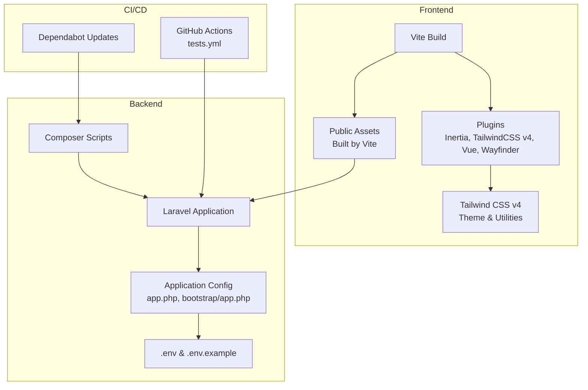
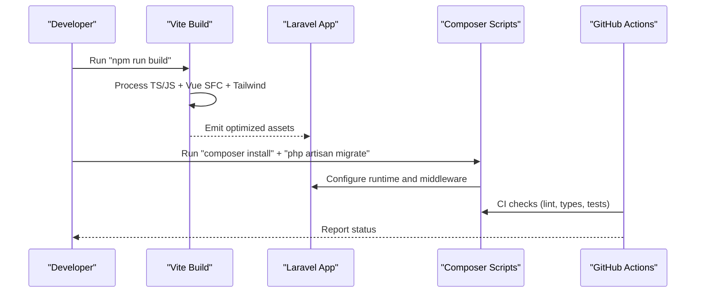
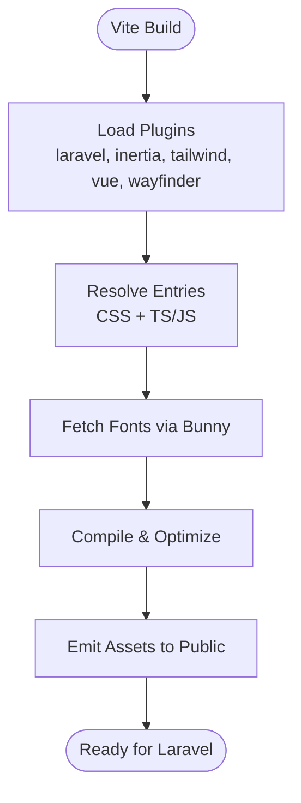
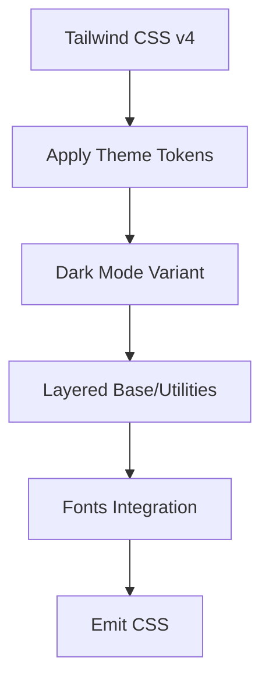
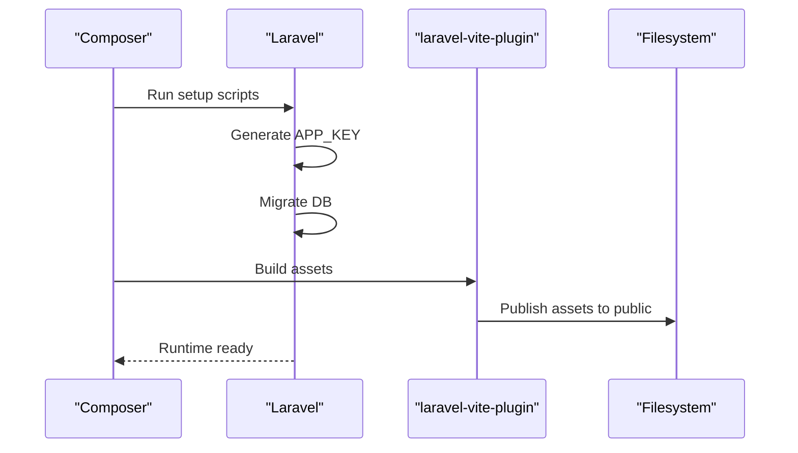
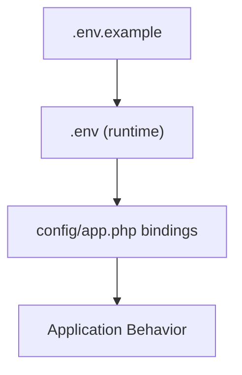
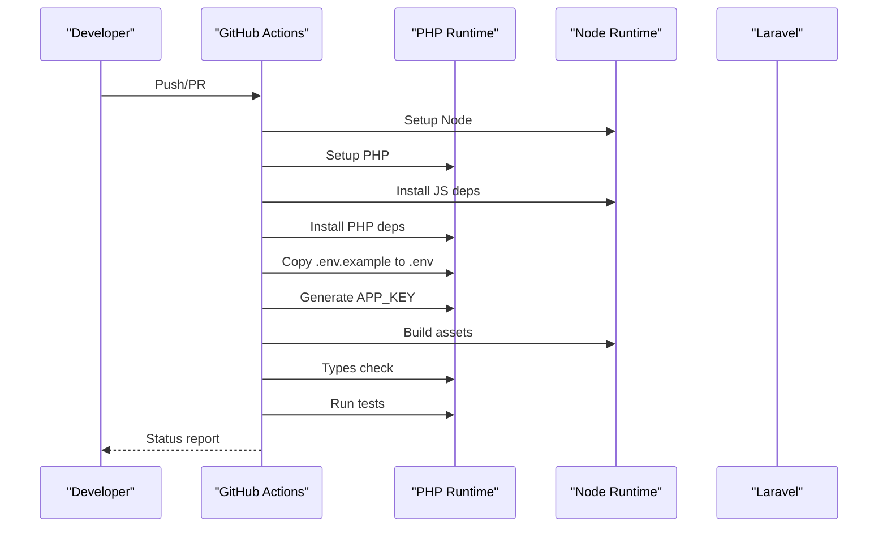
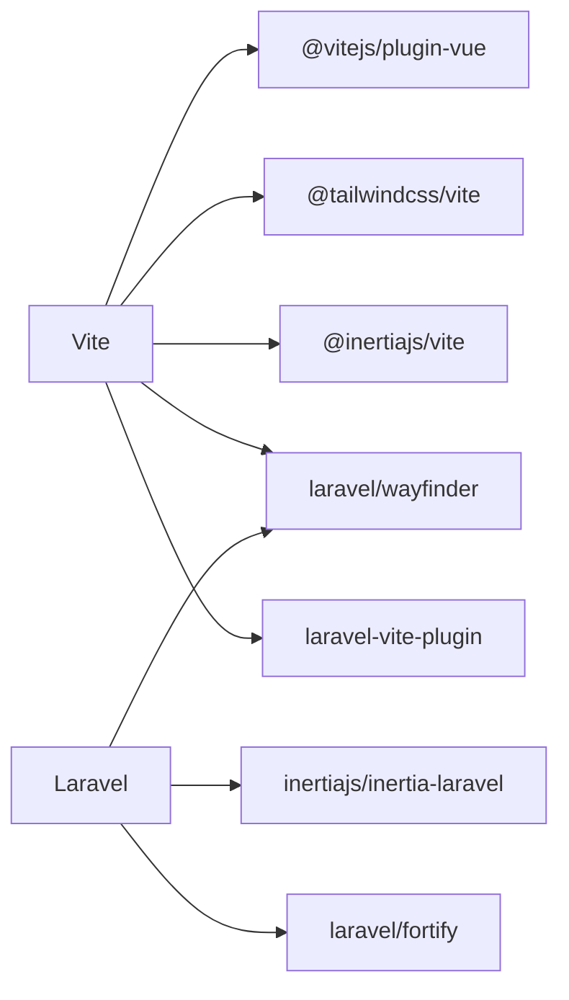

# Build & Deployment

<cite>
**Referenced Files in This Document**
- [vite.config.ts](file://vite.config.ts)
- [package.json](file://package.json)
- [resources/css/app.css](file://resources/css/app.css)
- [composer.json](file://composer.json)
- [.env.example](file://.env.example)
- [config/app.php](file://config/app.php)
- [bootstrap/app.php](file://bootstrap/app.php)
- [.github/workflows/tests.yml](file://.github/workflows/tests.yml)
- [.github/dependabot.yml](file://.github/dependabot.yml)
</cite>

## Table of Contents
1. [Introduction](#introduction)
2. [Project Structure](#project-structure)
3. [Core Components](#core-components)
4. [Architecture Overview](#architecture-overview)
5. [Detailed Component Analysis](#detailed-component-analysis)
6. [Dependency Analysis](#dependency-analysis)
7. [Performance Considerations](#performance-considerations)
8. [Troubleshooting Guide](#troubleshooting-guide)
9. [Conclusion](#conclusion)
10. [Appendices](#appendices)

## Introduction
This document provides comprehensive build and deployment guidance for SmartRecruit ATS. It covers Vite build configuration, asset optimization, bundle splitting, and production compilation. It also documents Laravel Mix integration via laravel-vite-plugin for CSS preprocessing and asset management, environment configuration, database migrations, and asset publishing. Practical deployment examples are included for shared hosting, VPS, and cloud platforms. Additional topics include environment variables management, security hardening, performance optimization, rollback procedures, monitoring setup, maintenance tasks, CI/CD pipeline configuration, automated testing integration, deployment automation, scaling considerations, load balancing, and high availability.

## Project Structure
SmartRecruit ATS uses a modern frontend toolchain with Vite and Vue 3, integrated with Laravel’s backend. The build system is configured through Vite with plugins for Inertia, Tailwind CSS v4, Vue SFC support, and Wayfinder. CSS is processed using Tailwind directives and theme customization. Composer scripts orchestrate development, testing, and production builds. GitHub Actions define CI checks for PHP and frontend assets.

**Diagram sources**
- [vite.config.ts:1-35](file://vite.config.ts#L1-L35)
- [resources/css/app.css:1-241](file://resources/css/app.css#L1-L241)
- [composer.json:45-99](file://composer.json#L45-L99)
- [config/app.php:16-126](file://config/app.php#L16-L126)
- [.env.example:1-66](file://.env.example#L1-L66)
- [.github/workflows/tests.yml:1-64](file://.github/workflows/tests.yml#L1-L64)
- [.github/dependabot.yml:1-13](file://.github/dependabot.yml#L1-L13)

**Section sources**
- [vite.config.ts:1-35](file://vite.config.ts#L1-L35)
- [package.json:1-62](file://package.json#L1-L62)
- [resources/css/app.css:1-241](file://resources/css/app.css#L1-L241)
- [composer.json:45-99](file://composer.json#L45-L99)
- [config/app.php:16-126](file://config/app.php#L16-L126)
- [.env.example:1-66](file://.env.example#L1-L66)
- [.github/workflows/tests.yml:1-64](file://.github/workflows/tests.yml#L1-L64)
- [.github/dependabot.yml:1-13](file://.github/dependabot.yml#L1-L13)

## Core Components
- Vite build configuration defines plugin chain and entry points for CSS and TypeScript/Vue.
- Tailwind CSS v4 is configured with theme customization, dark mode variants, and utility layers.
- Laravel integration via laravel-vite-plugin manages asset manifest and font delivery.
- Composer scripts orchestrate setup, development, linting, type checking, testing, and post-update tasks.
- Environment variables are managed via .env and .env.example, with Laravel config bindings.
- CI/CD is defined by GitHub Actions workflow and Dependabot configuration.

**Section sources**
- [vite.config.ts:1-35](file://vite.config.ts#L1-L35)
- [resources/css/app.css:1-241](file://resources/css/app.css#L1-L241)
- [composer.json:45-99](file://composer.json#L45-L99)
- [.env.example:1-66](file://.env.example#L1-L66)
- [config/app.php:16-126](file://config/app.php#L16-L126)
- [.github/workflows/tests.yml:1-64](file://.github/workflows/tests.yml#L1-L64)
- [.github/dependabot.yml:1-13](file://.github/dependabot.yml#L1-L13)

## Architecture Overview
The build and deployment pipeline integrates frontend and backend components:

**Diagram sources**
- [package.json:5-14](file://package.json#L5-L14)
- [composer.json:45-99](file://composer.json#L45-L99)
- [.github/workflows/tests.yml:27-64](file://.github/workflows/tests.yml#L27-L64)

## Detailed Component Analysis

### Vite Build Configuration
- Plugins:
  - laravel-vite-plugin: Defines entry points for CSS and TypeScript/Vue, enables refresh, and integrates fonts via Bunny.
  - @inertiajs/vite: Supports Inertia-driven single-page navigation.
  - @tailwindcss/vite: Integrates Tailwind CSS v4 processing.
  - @vitejs/plugin-vue: Compiles Vue Single File Components with asset URL transformation.
  - @laravel/vite-plugin-wayfinder: Generates form variants and improves DX.
- Asset pipeline:
  - CSS is processed with Tailwind directives and theme customization.
  - Fonts are fetched from Bunny CDN with specified weights.
- Production compilation:
  - npm script triggers Vite build for production assets.

**Diagram sources**
- [vite.config.ts:9-35](file://vite.config.ts#L9-L35)
- [package.json:6](file://package.json#L6)

**Section sources**
- [vite.config.ts:1-35](file://vite.config.ts#L1-L35)
- [package.json:6](file://package.json#L6)

### CSS Preprocessing and Asset Management (Tailwind CSS v4)
- Tailwind directives and theme customization:
  - Uses @import and @theme to define tokens, colors, typography, spacing, and shadows.
  - Provides dark mode variant and layered base/utilities for compatibility.
- Asset management:
  - laravel-vite-plugin handles asset manifest and public path resolution.
  - Fonts are integrated via Bunny CDN with configurable weights.

**Diagram sources**
- [resources/css/app.css:1-241](file://resources/css/app.css#L1-L241)
- [vite.config.ts:14-18](file://vite.config.ts#L14-L18)

**Section sources**
- [resources/css/app.css:1-241](file://resources/css/app.css#L1-L241)
- [vite.config.ts:14-18](file://vite.config.ts#L14-L18)

### Laravel Integration and Asset Publishing
- laravel-vite-plugin:
  - Registers entries and enables hot-module replacement during development.
  - Publishes assets to the public directory and supports font delivery.
- Composer scripts:
  - setup: Installs dependencies, generates APP_KEY, runs migrations, installs JS deps, and builds assets.
  - dev: Runs Laravel server, queue listener, and Vite concurrently.
  - post-update-cmd: Publishes Laravel assets and updates Boost configuration.
- Bootstrap and middleware:
  - bootstrap/app.php configures routing, middleware stack, cookie encryption exceptions, and preloaded asset headers.

**Diagram sources**
- [composer.json:46-53](file://composer.json#L46-L53)
- [composer.json:84-87](file://composer.json#L84-L87)
- [bootstrap/app.php:11-30](file://bootstrap/app.php#L11-L30)

**Section sources**
- [composer.json:46-53](file://composer.json#L46-L53)
- [composer.json:84-87](file://composer.json#L84-L87)
- [bootstrap/app.php:11-30](file://bootstrap/app.php#L11-L30)

### Environment Variables and Configuration
- .env.example defines core variables for app name, environment, debug, URL, locale, database connection, sessions, queues, cache, Redis, mail, and AWS credentials.
- config/app.php binds environment variables to application configuration, including maintenance driver/store and encryption key handling.

**Diagram sources**
- [.env.example:1-66](file://.env.example#L1-L66)
- [config/app.php:16-126](file://config/app.php#L16-L126)

**Section sources**
- [.env.example:1-66](file://.env.example#L1-L66)
- [config/app.php:16-126](file://config/app.php#L16-L126)

### CI/CD Pipeline and Automated Testing
- GitHub Actions workflow:
  - Triggers on pushes and pull requests to selected branches.
  - Sets up PHP and Node, installs dependencies, copies .env.example to .env, generates APP_KEY, builds assets, runs type checks, and executes tests.
- Dependabot:
  - Groups GitHub Actions updates with weekly intervals and cooldown.

**Diagram sources**
- [.github/workflows/tests.yml:27-64](file://.github/workflows/tests.yml#L27-L64)
- [.github/dependabot.yml:1-13](file://.github/dependabot.yml#L1-L13)

**Section sources**
- [.github/workflows/tests.yml:1-64](file://.github/workflows/tests.yml#L1-L64)
- [.github/dependabot.yml:1-13](file://.github/dependabot.yml#L1-L13)

## Dependency Analysis
- Frontend dependencies:
  - Vite, @vitejs/plugin-vue, @tailwindcss/vite, @inertiajs/vite, @laravel/vite-plugin-wayfinder, laravel-vite-plugin, reka-ui, tw-animate-css, and others.
- Backend dependencies:
  - Laravel framework, Inertia Laravel, Laravel Fortify, Laravel Wayfinder, and development tools.
- Optional native dependencies:
  - Platform-specific Rollup and LightningCSS binaries for optimal build performance.

**Diagram sources**
- [package.json:15-60](file://package.json#L15-L60)
- [composer.json:11-32](file://composer.json#L11-L32)

**Section sources**
- [package.json:15-60](file://package.json#L15-L60)
- [composer.json:11-32](file://composer.json#L11-L32)

## Performance Considerations
- Asset optimization:
  - Use Vite’s built-in minification and tree-shaking in production builds.
  - Tailwind CSS v4 directive processing should be scoped to reduce CSS size.
- Bundle splitting:
  - Split vendor and application bundles to improve caching; leverage Vite’s code-splitting heuristics.
- Caching:
  - Enable long-term caching for static assets and invalidate on versioned filenames.
- Rendering:
  - Preload critical assets via Laravel’s preloaded asset headers.
- Monitoring:
  - Track asset sizes and load times; monitor backend response metrics.

[No sources needed since this section provides general guidance]

## Troubleshooting Guide
- Build failures:
  - Ensure Node and PHP versions match CI matrix and local environment.
  - Re-run “npm install” and “composer install” after dependency changes.
- Asset not found:
  - Confirm laravel-vite-plugin entries and public directory publishing.
  - Clear caches and rebuild assets.
- Environment issues:
  - Validate .env presence and required keys; regenerate APP_KEY if missing.
- CI failures:
  - Review GitHub Actions logs for lint, type check, and test phases.
  - Align local Node version with workflow setup-node configuration.

**Section sources**
- [.github/workflows/tests.yml:27-64](file://.github/workflows/tests.yml#L27-L64)
- [composer.json:46-53](file://composer.json#L46-L53)

## Conclusion
SmartRecruit ATS leverages a streamlined build and deployment pipeline combining Vite, Tailwind CSS v4, and Laravel. The configuration emphasizes developer productivity and production readiness through plugin-driven asset processing, environment-driven configuration, and CI/CD automation. Following the practices outlined here ensures reliable deployments across shared hosting, VPS, and cloud platforms while maintaining strong security and performance characteristics.

[No sources needed since this section summarizes without analyzing specific files]

## Appendices

### A. Production Deployment Checklist
- Prepare environment:
  - Set APP_ENV=production, APP_DEBUG=false, APP_URL=https://your-domain.com.
  - Generate APP_KEY and configure database credentials.
- Build and publish:
  - Run “npm run build” to produce optimized assets.
  - Run “composer install --no-dev” and “php artisan migrate --force”.
  - Publish Laravel assets if applicable.
- Web server:
  - Point document root to public/.
  - Configure HTTPS and security headers.
- Monitoring:
  - Set up logs, uptime monitoring, and performance metrics.

[No sources needed since this section provides general guidance]

### B. Environment Variables Reference
- Essential variables:
  - APP_ENV, APP_DEBUG, APP_URL, APP_KEY
  - DB_CONNECTION, DB_HOST, DB_PORT, DB_DATABASE, DB_USERNAME, DB_PASSWORD
  - QUEUE_CONNECTION, CACHE_STORE, SESSION_DRIVER
  - MAIL_* settings, AWS_* settings
- Vite variables:
  - VITE_APP_NAME for frontend consumption.

**Section sources**
- [.env.example:1-66](file://.env.example#L1-L66)

### C. CI/CD Configuration Notes
- Workflow triggers:
  - Adjust branch filters to match your release strategy.
- Matrix builds:
  - Add PHP versions as needed; align with Laravel requirements.
- Secrets:
  - Store sensitive values in GitHub Secrets and map to environment variables in the workflow.

**Section sources**
- [.github/workflows/tests.yml:3-16](file://.github/workflows/tests.yml#L3-L16)
- [.github/workflows/tests.yml:33-43](file://.github/workflows/tests.yml#L33-L43)