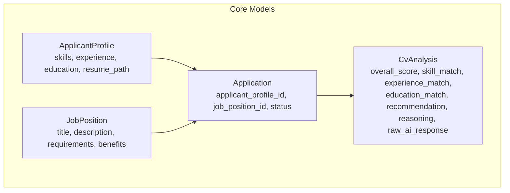
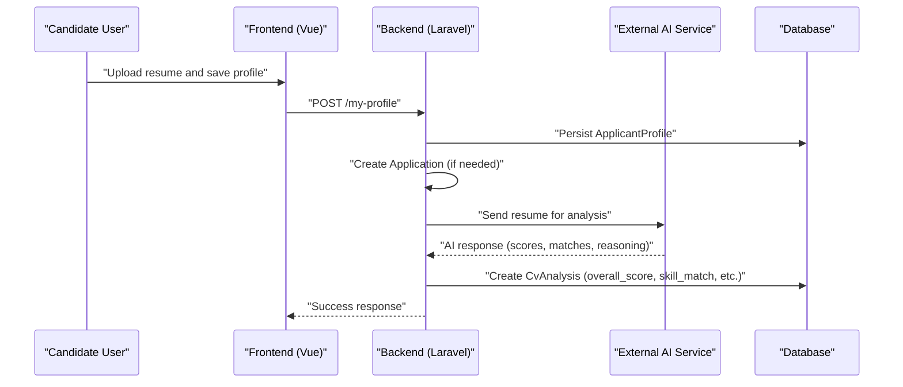
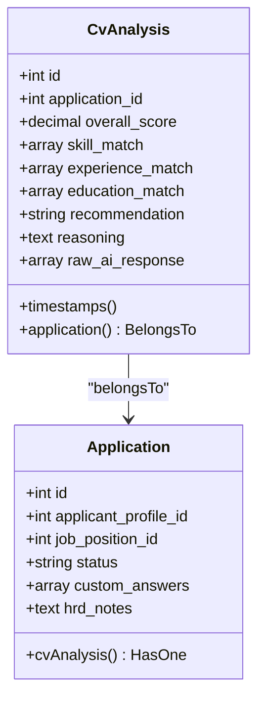
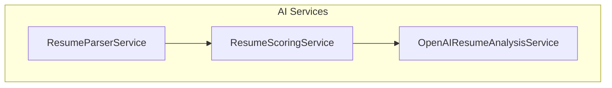
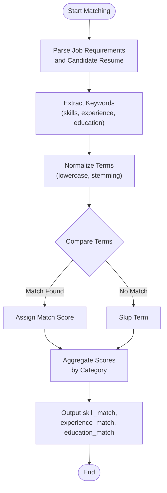
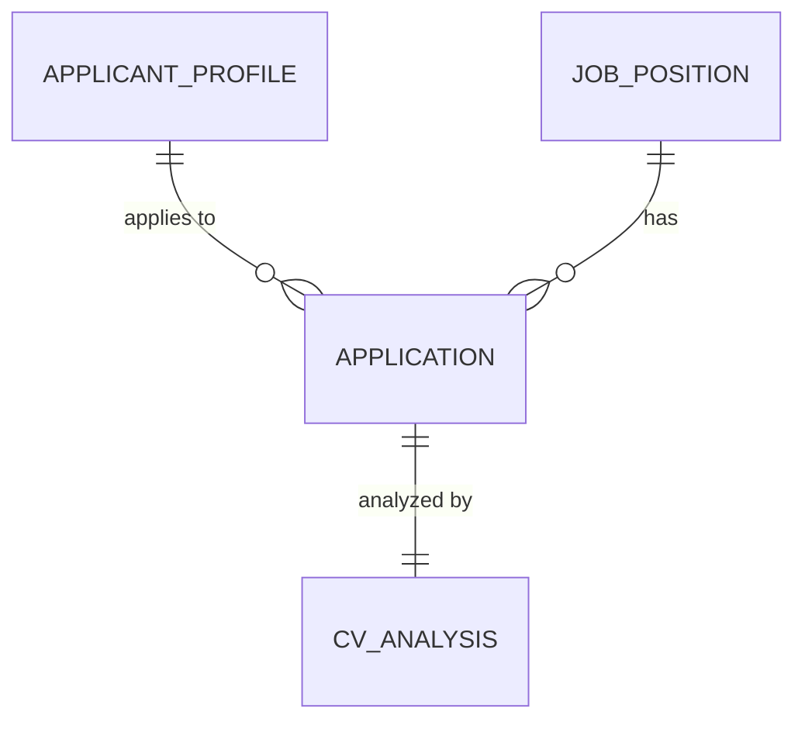
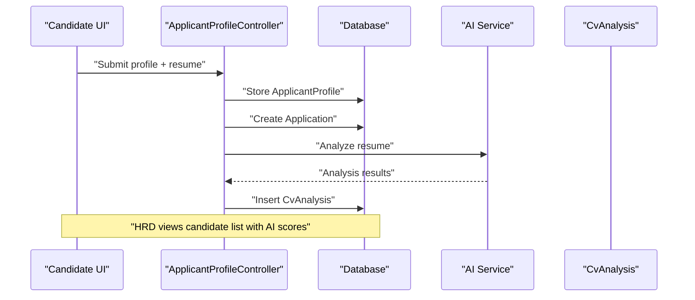
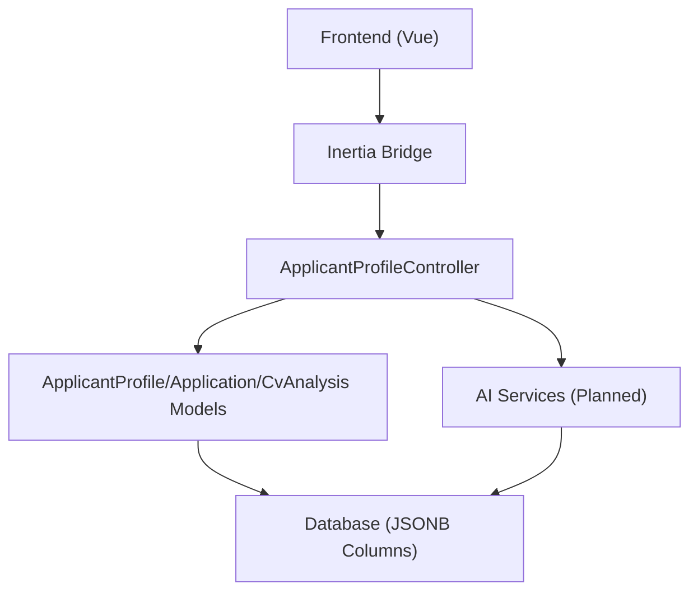

# CV Analysis & AI Integration

<cite>
**Referenced Files in This Document**
- [CvAnalysis.php](file://app/Models/CvAnalysis.php)
- [Application.php](file://app/Models/Application.php)
- [ApplicantProfile.php](file://app/Models/ApplicantProfile.php)
- [JobPosition.php](file://app/Models/JobPosition.php)
- [create_cv_analyses_table.php](file://database/migrations/2026_06_24_164756_create_cv_analyses_table.php)
- [create_applications_table.php](file://database/migrations/2026_06_24_164755_create_applications_table.php)
- [ApplicantProfileController.php](file://app/Http/Controllers/ApplicantProfileController.php)
- [web.php](file://routes/web.php)
- [Show.vue](file://resources/js/pages/ApplicantProfiles/Show.vue)
- [AGENTS.md](file://AGENTS.md)
- [DESIGN.md](file://DESIGN.md)
- [CONTEXT.md](file://CONTEXT.md)
- [services.php](file://config/services.php)
- [cache.php](file://config/cache.php)
</cite>

## Table of Contents
1. [Introduction](#introduction)
2. [Project Structure](#project-structure)
3. [Core Components](#core-components)
4. [Architecture Overview](#architecture-overview)
5. [Detailed Component Analysis](#detailed-component-analysis)
6. [Dependency Analysis](#dependency-analysis)
7. [Performance Considerations](#performance-considerations)
8. [Troubleshooting Guide](#troubleshooting-guide)
9. [Conclusion](#conclusion)
10. [Appendices](#appendices)

## Introduction
This document explains the CV analysis and AI integration functionality for SmartRecruit, an Applicant Tracking System (ATS). It focuses on the CvAnalysis model implementation, AI-powered candidate assessment, skill matching algorithms, scoring mechanisms, and the planned integration with external AI services. It also documents the structured data storage approach for AI-generated insights, the relationship between analysis results and application tracking, practical analysis workflows, data interpretation, result visualization, extensibility points for AI providers, and ethical considerations for bias mitigation.

## Project Structure
SmartRecruit is built with Laravel 13 and Inertia.js (Vue 3 + TypeScript). The CV analysis feature centers around four core models and their relationships:
- CvAnalysis: Stores AI-generated insights and scores linked to a specific application
- Application: Links an applicant profile to a job position and holds the application lifecycle
- ApplicantProfile: Holds candidate data including resume path and structured attributes
- JobPosition: Defines roles and requirements for hiring

**Diagram sources**
- [CvAnalysis.php:9-37](file://app/Models/CvAnalysis.php#L9-L37)
- [Application.php:10-41](file://app/Models/Application.php#L10-L41)
- [ApplicantProfile.php:10-40](file://app/Models/ApplicantProfile.php#L10-L40)
- [JobPosition.php:10-38](file://app/Models/JobPosition.php#L10-L38)

**Section sources**
- [CvAnalysis.php:9-37](file://app/Models/CvAnalysis.php#L9-L37)
- [Application.php:10-41](file://app/Models/Application.php#L10-L41)
- [ApplicantProfile.php:10-40](file://app/Models/ApplicantProfile.php#L10-L40)
- [JobPosition.php:10-38](file://app/Models/JobPosition.php#L10-L38)
- [create_cv_analyses_table.php:14-25](file://database/migrations/2026_06_24_164756_create_cv_analyses_table.php#L14-L25)
- [create_applications_table.php:14-22](file://database/migrations/2026_06_24_164755_create_applications_table.php#L14-L22)

## Core Components
- CvAnalysis model
  - Filled attributes: application_id, overall_score, skill_match, experience_match, education_match, recommendation, reasoning, raw_ai_response
  - Casts: overall_score as decimal (precision 5, scale 2), arrays for match fields, array for raw_ai_response
  - Relationship: belongsTo Application
- Application model
  - Filled attributes: applicant_profile_id, job_position_id, status, custom_answers, hrd_notes
  - Casts: custom_answers as array
  - Relationships: belongsTo ApplicantProfile, belongsTo JobPosition, hasOne CvAnalysis
- ApplicantProfile model
  - Filled attributes: user_id, resume_path, skills, experience, education, portfolio_urls
  - Casts: arrays for skills, experience, education, portfolio_urls
  - Relationships: belongsTo User, hasMany Application
- JobPosition model
  - Filled attributes: created_by, title, description, status, requirements, benefits
  - Casts: arrays for requirements, benefits
  - Relationships: belongsTo User, hasMany Application

These models establish a clear data flow from candidate profiles through applications to AI-assisted analysis.

**Section sources**
- [CvAnalysis.php:11-36](file://app/Models/CvAnalysis.php#L11-L36)
- [Application.php:12-40](file://app/Models/Application.php#L12-L40)
- [ApplicantProfile.php:12-39](file://app/Models/ApplicantProfile.php#L12-L39)
- [JobPosition.php:12-37](file://app/Models/JobPosition.php#L12-L37)

## Architecture Overview
The CV analysis pipeline integrates frontend upload, backend processing, and AI service orchestration. The frontend allows candidates to manage their profiles and upload resumes. Upon submission, the backend validates and persists the profile, then triggers AI analysis linked to the application record. Results are stored in CvAnalysis for downstream use in hiring decisions.

**Diagram sources**
- [ApplicantProfileController.php:24-36](file://app/Http/Controllers/ApplicantProfileController.php#L24-L36)
- [Show.vue:23-33](file://resources/js/pages/ApplicantProfiles/Show.vue#L23-L33)
- [create_cv_analyses_table.php:14-25](file://database/migrations/2026_06_24_164756_create_cv_analyses_table.php#L14-L25)
- [AGENTS.md:1289-1309](file://AGENTS.md#L1289-L1309)

## Detailed Component Analysis

### CvAnalysis Model Implementation
CvAnalysis encapsulates AI-generated insights and scores for a given application. Its schema supports:
- Numerical overall_score with two-decimal precision
- Structured JSONB arrays for skill_match, experience_match, and education_match
- Recommendation text and reasoning for interpretability
- raw_ai_response for auditability and replay

**Diagram sources**
- [CvAnalysis.php:9-37](file://app/Models/CvAnalysis.php#L9-L37)
- [Application.php:37-40](file://app/Models/Application.php#L37-L40)

**Section sources**
- [CvAnalysis.php:11-36](file://app/Models/CvAnalysis.php#L11-L36)
- [create_cv_analyses_table.php:17-23](file://database/migrations/2026_06_24_164756_create_cv_analyses_table.php#L17-L23)

### AI-Powered Candidate Assessment and Scoring Mechanisms
The system is designed to integrate with external AI services for:
- Resume parsing and entity extraction
- Keyword extraction aligned with job requirements
- Candidate evaluation and scoring
- Structured reasoning and recommendations

Planned backend structure includes dedicated services:
- ResumeParserService
- ResumeScoringService
- OpenAIResumeAnalysisService

**Diagram sources**
- [AGENTS.md:1289-1309](file://AGENTS.md#L1289-L1309)

**Section sources**
- [AGENTS.md:1289-1309](file://AGENTS.md#L1289-L1309)

### Skill Matching Algorithms
Skill matching is modeled as JSONB arrays within CvAnalysis. The recommended approach:
- Extract keywords from job requirements and candidate resumes
- Normalize terms (case-insensitive, stemming, synonym expansion)
- Compute similarity scores (e.g., cosine similarity, Jaccard index)
- Aggregate per-category scores (skills, experience, education)

[No sources needed since this diagram shows conceptual workflow, not actual code structure]

### Structured Data Storage Approach
CvAnalysis uses JSONB columns for flexible yet structured storage:
- skill_match, experience_match, education_match: arrays of scored matches
- raw_ai_response: full AI payload for auditing
- recommendation and reasoning: natural language explanations
- overall_score: normalized numerical score

This approach balances flexibility with queryability and auditability.

**Section sources**
- [create_cv_analyses_table.php:18-23](file://database/migrations/2026_06_24_164756_create_cv_analyses_table.php#L18-L23)
- [CvAnalysis.php:22-30](file://app/Models/CvAnalysis.php#L22-L30)

### Relationship Between CV Analysis Results and Application Tracking
CvAnalysis is linked to Application, enabling:
- AI scores and insights to inform hiring stages
- Status updates (e.g., shortlisted, interview, rejected) integrated with analysis
- HRD notes and candidate communication tied to analysis

**Diagram sources**
- [Application.php:27-40](file://app/Models/Application.php#L27-L40)
- [JobPosition.php:34-37](file://app/Models/JobPosition.php#L34-L37)
- [ApplicantProfile.php:36-39](file://app/Models/ApplicantProfile.php#L36-L39)

**Section sources**
- [Application.php:37-40](file://app/Models/Application.php#L37-L40)
- [create_applications_table.php:14-22](file://database/migrations/2026_06_24_164755_create_applications_table.php#L14-L22)

### Practical Examples of Analysis Workflows
- Candidate uploads resume and saves profile via frontend
- Backend controller persists ApplicantProfile and creates Application
- AI service parses resume, extracts keywords, computes scores, and generates reasoning
- CvAnalysis is created with overall_score and match arrays
- Hiring dashboard displays candidate list with sort/filter by score and status

**Diagram sources**
- [ApplicantProfileController.php:24-36](file://app/Http/Controllers/ApplicantProfileController.php#L24-L36)
- [Show.vue:23-33](file://resources/js/pages/ApplicantProfiles/Show.vue#L23-L33)
- [create_cv_analyses_table.php:14-25](file://database/migrations/2026_06_24_164756_create_cv_analyses_table.php#L14-L25)

**Section sources**
- [web.php:25-28](file://routes/web.php#L25-L28)
- [Show.vue:47-113](file://resources/js/pages/ApplicantProfiles/Show.vue#L47-L113)

### Data Interpretation and Result Visualization
- Score interpretation: overall_score normalized to 0–100 for quick ranking
- Match breakdown: skill_match, experience_match, education_match arrays enable highlighting strengths/weaknesses
- Reasoning: structured reasoning text supports transparent decision-making
- UI guidelines emphasize clarity and accessibility for HR dashboards

**Section sources**
- [AGENTS.md:1256-1282](file://AGENTS.md#L1256-L1282)
- [DESIGN.md:117-193](file://DESIGN.md#L117-L193)

### Extensibility Points for AI Providers and Customization
- Pluggable AI service layer: swap OpenAIResumeAnalysisService with other providers
- Custom scoring algorithms: inject ResumeScoringService implementations
- Resume parsing: replace ResumeParserService with provider-specific parsers
- Configuration: centralize provider credentials and endpoints in services configuration

**Section sources**
- [AGENTS.md:1289-1309](file://AGENTS.md#L1289-L1309)
- [services.php:17-38](file://config/services.php#L17-L38)

### Ethical Considerations and Bias Mitigation Strategies
- Auditability: retain raw_ai_response and reasoning for review
- Transparency: expose reasoning and match arrays in UI for scrutiny
- Fairness: normalize and standardize term extraction; avoid discriminatory signals
- Human-in-the-loop: require HRD override for borderline cases
- Bias detection: monitor score distributions and match patterns across demographic groups

**Section sources**
- [AGENTS.md:1317-1327](file://AGENTS.md#L1317-L1327)

## Dependency Analysis
The CV analysis feature depends on:
- Laravel Eloquent ORM for model relationships and casting
- JSONB columns for flexible data structures
- Inertia.js for frontend-backend integration
- External AI services for analysis (planned)
- Configuration files for third-party integrations

**Diagram sources**
- [Show.vue:1-117](file://resources/js/pages/ApplicantProfiles/Show.vue#L1-L117)
- [ApplicantProfileController.php:13-58](file://app/Http/Controllers/ApplicantProfileController.php#L13-L58)
- [create_cv_analyses_table.php:14-25](file://database/migrations/2026_06_24_164756_create_cv_analyses_table.php#L14-L25)

**Section sources**
- [web.php:18-29](file://routes/web.php#L18-L29)
- [services.php:17-38](file://config/services.php#L17-L38)

## Performance Considerations
- Backend
  - Avoid N+1 queries; eager load relationships when rendering candidate lists
  - Use pagination for large candidate datasets
  - Index frequently filtered/sorted fields (e.g., status, created_at)
  - Queue long-running AI analysis tasks
  - Cache stable data (e.g., job requirements) when safe
- Frontend
  - Minimize re-renders; lazy-load heavy sections
  - Keep computed logic efficient

**Section sources**
- [AGENTS.md:1371-1378](file://AGENTS.md#L1371-L1378)

## Troubleshooting Guide
- Resume upload issues
  - Validate file presence and storage permissions
  - Ensure resume_path is persisted and accessible
- Analysis failures
  - Inspect raw_ai_response for error details
  - Verify AI service credentials and endpoint configuration
- Data inconsistencies
  - Confirm JSONB columns are properly cast in models
  - Review CvAnalysis creation and Application linkage

**Section sources**
- [ApplicantProfileController.php:28-54](file://app/Http/Controllers/ApplicantProfileController.php#L28-L54)
- [CvAnalysis.php:22-30](file://app/Models/CvAnalysis.php#L22-L30)
- [services.php:17-38](file://config/services.php#L17-L38)

## Conclusion
SmartRecruit’s CV analysis and AI integration provide a robust foundation for AI-assisted candidate evaluation. The CvAnalysis model, combined with structured JSONB storage and clear application relationships, enables transparent, auditable, and scalable assessments. By following the planned backend structure, performance guidelines, and ethical practices, the system can evolve to support diverse AI providers and continuously improve hiring outcomes.

## Appendices

### Appendix A: Data Model Definitions
- CvAnalysis
  - Attributes: application_id, overall_score, skill_match, experience_match, education_match, recommendation, reasoning, raw_ai_response
  - Types: decimal, JSONB arrays, text, JSONB
- Application
  - Attributes: applicant_profile_id, job_position_id, status, custom_answers, hrd_notes
  - Types: foreign keys, string, JSONB array

**Section sources**
- [create_cv_analyses_table.php:14-25](file://database/migrations/2026_06_24_164756_create_cv_analyses_table.php#L14-L25)
- [create_applications_table.php:14-22](file://database/migrations/2026_06_24_164755_create_applications_table.php#L14-L22)

### Appendix B: UI/UX Guidelines for Candidate Pages
- Candidate list: name, applied position, score, status, upload date, skill highlights, sort by score, filter by status, search, view detail
- Candidate detail: profile, CV summary, AI score breakdown, strengths, weaknesses, HRD notes, status update, recommendation, original CV access
- Upload page: clear upload area, file requirements, loading/error/success states, explanation of AI analysis

**Section sources**
- [AGENTS.md:1239-1282](file://AGENTS.md#L1239-L1282)