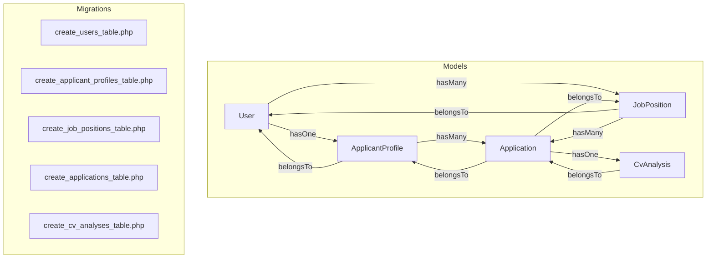
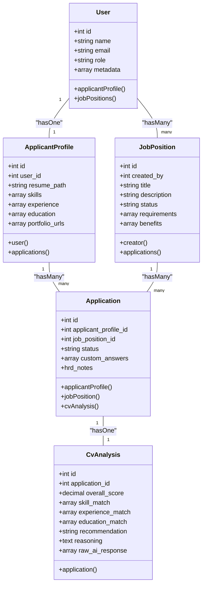
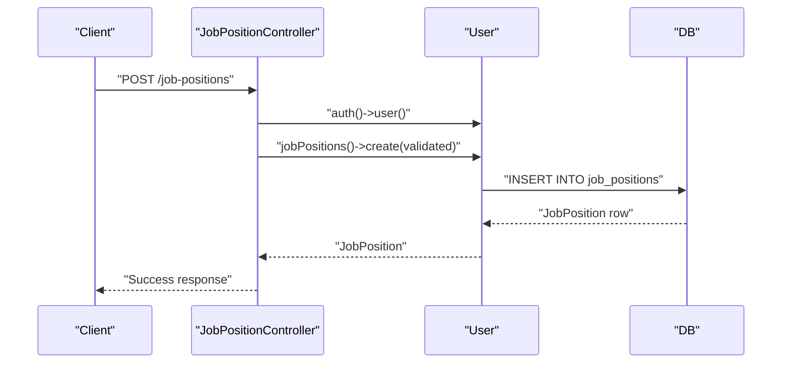
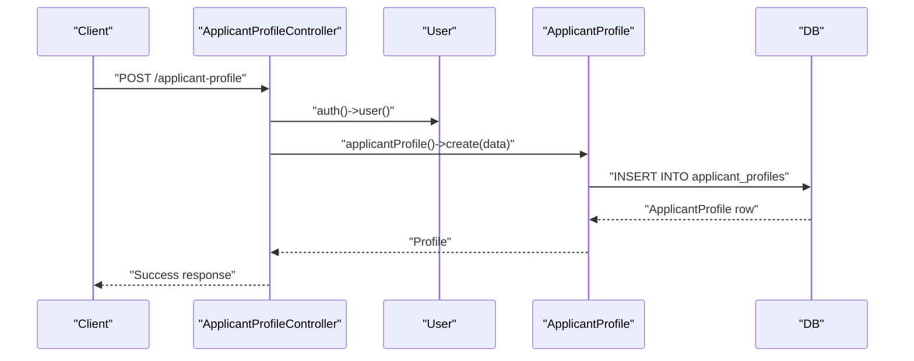
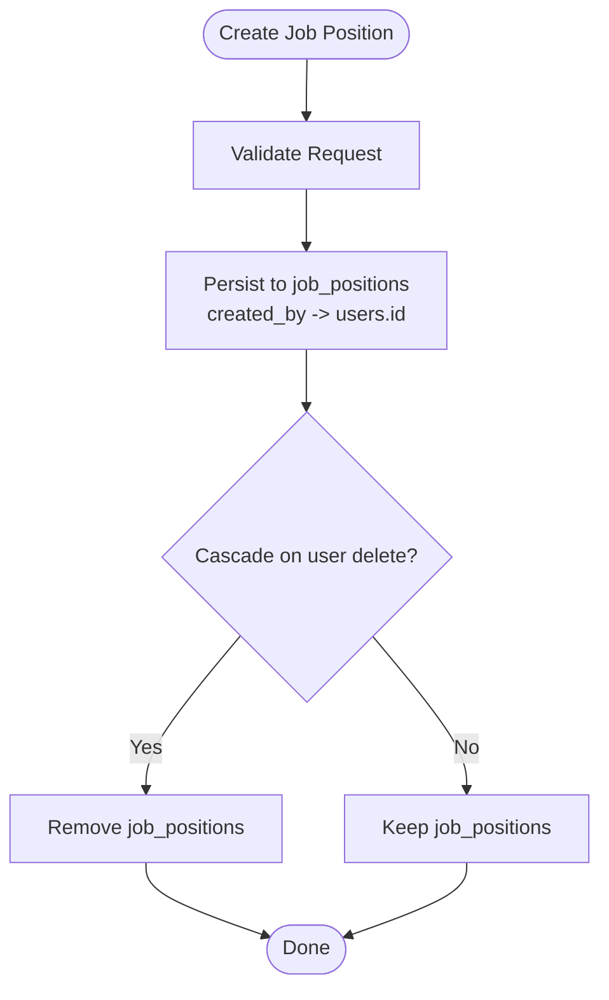
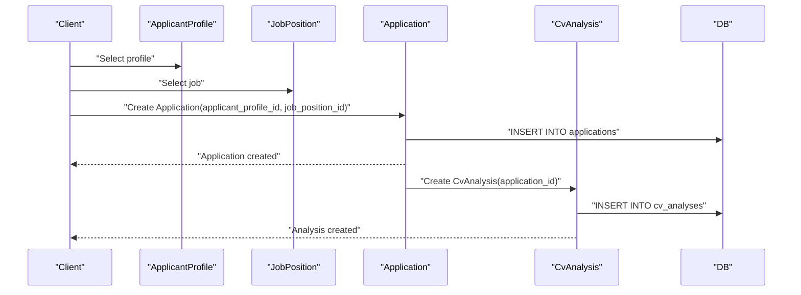
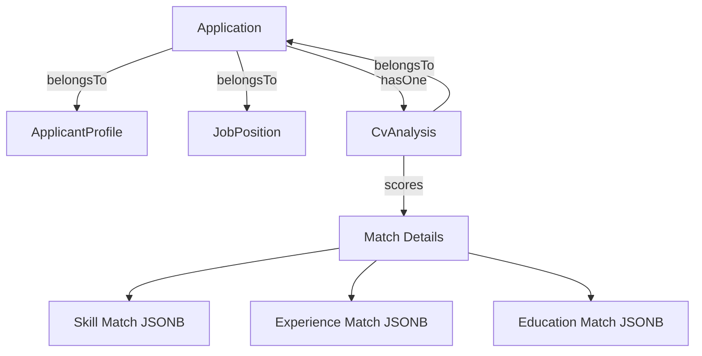
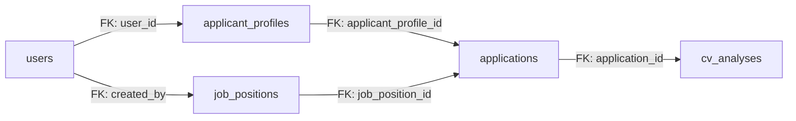

# Core Entities & Relationships

<cite>
**Referenced Files in This Document**
- [User.php](file://app/Models/User.php)
- [ApplicantProfile.php](file://app/Models/ApplicantProfile.php)
- [JobPosition.php](file://app/Models/JobPosition.php)
- [Application.php](file://app/Models/Application.php)
- [CvAnalysis.php](file://app/Models/CvAnalysis.php)
- [create_users_table.php](file://database/migrations/0001_01_01_000000_create_users_table.php)
- [add_role_and_metadata_to_users_table.php](file://database/migrations/2026_06_24_164756_add_role_and_metadata_to_users_table.php)
- [create_applicant_profiles_table.php](file://database/migrations/2026_06_24_164755_create_applicant_profiles_table.php)
- [create_job_positions_table.php](file://database/migrations/2026_06_24_164755_create_job_positions_table.php)
- [create_applications_table.php](file://database/migrations/2026_06_24_164755_create_applications_table.php)
- [create_cv_analyses_table.php](file://database/migrations/2026_06_24_164756_create_cv_analyses_table.php)
- [ApplicantProfileController.php](file://app/Http/Controllers/ApplicantProfileController.php)
- [JobPositionController.php](file://app/Http/Controllers/JobPositionController.php)
- [auth.php](file://config/auth.php)
- [UserFactory.php](file://database/factories/UserFactory.php)
</cite>

## Table of Contents
1. [Introduction](#introduction)
2. [Project Structure](#project-structure)
3. [Core Components](#core-components)
4. [Architecture Overview](#architecture-overview)
5. [Detailed Component Analysis](#detailed-component-analysis)
6. [Dependency Analysis](#dependency-analysis)
7. [Performance Considerations](#performance-considerations)
8. [Troubleshooting Guide](#troubleshooting-guide)
9. [Conclusion](#conclusion)

## Introduction
This document describes SmartRecruit’s core data entities and their relationships. It focuses on five primary models: User (central authentication and role-based access), ApplicantProfile (candidate data), JobPosition (job listing), Application (candidate-job linkage), and CvAnalysis (AI-driven candidate assessment). It explains entity relationships, foreign keys, cascading behaviors, referential integrity, and the JSONB data modeling approach used for flexible skill and experience management.

## Project Structure
SmartRecruit follows a conventional Laravel structure with models under app/Models, database migrations under database/migrations, controllers under app/Http/Controllers, and configuration under config. The models define relationships and casting, while migrations define schema, foreign keys, and JSONB columns.

**Diagram sources**
- [User.php:52-61](file://app/Models/User.php#L52-L61)
- [ApplicantProfile.php:31-40](file://app/Models/ApplicantProfile.php#L31-L40)
- [JobPosition.php:29-38](file://app/Models/JobPosition.php#L29-L38)
- [Application.php:27-41](file://app/Models/Application.php#L27-L41)
- [CvAnalysis.php:33-37](file://app/Models/CvAnalysis.php#L33-L37)
- [create_users_table.php:14-22](file://database/migrations/0001_01_01_000000_create_users_table.php#L14-L22)
- [create_applicant_profiles_table.php:14-23](file://database/migrations/2026_06_24_164755_create_applicant_profiles_table.php#L14-L23)
- [create_job_positions_table.php:14-23](file://database/migrations/2026_06_24_164755_create_job_positions_table.php#L14-L23)
- [create_applications_table.php:14-22](file://database/migrations/2026_06_24_164755_create_applications_table.php#L14-L22)
- [create_cv_analyses_table.php:14-25](file://database/migrations/2026_06_24_164756_create_cv_analyses_table.php#L14-L25)

**Section sources**
- [User.php:17-61](file://app/Models/User.php#L17-L61)
- [ApplicantProfile.php:10-41](file://app/Models/ApplicantProfile.php#L10-L41)
- [JobPosition.php:10-39](file://app/Models/JobPosition.php#L10-L39)
- [Application.php:10-42](file://app/Models/Application.php#L10-L42)
- [CvAnalysis.php:9-38](file://app/Models/CvAnalysis.php#L9-L38)

## Core Components
- User: Central authentication entity with role-based access control and optional metadata stored as JSONB. Provides relationships to ApplicantProfile and JobPosition.
- ApplicantProfile: Candidate profile containing resume path and flexible arrays for skills, experience, education, and portfolio URLs, persisted as JSONB.
- JobPosition: Job listing created by a User, with status and JSONB fields for requirements and benefits.
- Application: Links an ApplicantProfile to a JobPosition, tracks application status and custom answers, and connects to CvAnalysis.
- CvAnalysis: AI-powered candidate assessment tied to a single Application, storing scores and structured match data as JSONB.

Key implementation highlights:
- Role-based access control is enforced in controllers (e.g., deletion requires HRD role).
- JSONB columns enable flexible, schema-less data for skills, experience, education, and related fields.
- Cascading deletes propagate when parent records are removed.

**Section sources**
- [User.php:30-50](file://app/Models/User.php#L30-L50)
- [ApplicantProfile.php:21-29](file://app/Models/ApplicantProfile.php#L21-L29)
- [JobPosition.php:21-27](file://app/Models/JobPosition.php#L21-L27)
- [Application.php:20-25](file://app/Models/Application.php#L20-L25)
- [CvAnalysis.php:22-31](file://app/Models/CvAnalysis.php#L22-L31)
- [JobPositionController.php:44-53](file://app/Http/Controllers/JobPositionController.php#L44-L53)

## Architecture Overview
The system centers around User as the identity and access control hub. Users create job positions and can optionally have a single associated ApplicantProfile. Candidates apply to jobs via Application, which triggers or links to CvAnalysis for automated evaluation.

**Diagram sources**
- [User.php:52-61](file://app/Models/User.php#L52-L61)
- [ApplicantProfile.php:31-40](file://app/Models/ApplicantProfile.php#L31-L40)
- [JobPosition.php:29-38](file://app/Models/JobPosition.php#L29-L38)
- [Application.php:27-41](file://app/Models/Application.php#L27-L41)
- [CvAnalysis.php:33-37](file://app/Models/CvAnalysis.php#L33-L37)

## Detailed Component Analysis

### User Model
- Purpose: Authentication and authorization backbone with role and metadata support.
- Relationships:
  - One-to-one with ApplicantProfile via applicantProfile().
  - One-to-many with JobPosition via jobPositions(), using created_by foreign key.
- Access control: Controllers enforce role checks (e.g., HRD-only deletion of job positions).
- Casting: metadata stored as array; sensitive fields hidden from serialization.

**Diagram sources**
- [JobPositionController.php:22-27](file://app/Http/Controllers/JobPositionController.php#L22-L27)
- [User.php:57-60](file://app/Models/User.php#L57-L60)
- [create_job_positions_table.php:16](file://database/migrations/2026_06_24_164755_create_job_positions_table.php#L16)

**Section sources**
- [User.php:30-50](file://app/Models/User.php#L30-L50)
- [User.php:52-61](file://app/Models/User.php#L52-L61)
- [auth.php:64-74](file://config/auth.php#L64-L74)
- [JobPositionController.php:44-53](file://app/Http/Controllers/JobPositionController.php#L44-L53)

### ApplicantProfile Model
- Purpose: Stores candidate data including resume path and flexible arrays for skills, experience, education, and portfolio URLs.
- Relationships:
  - Belongs to User.
  - Has many Applications.
- JSONB modeling: skills, experience, education, portfolio_urls are stored as JSONB for flexibility.

**Diagram sources**
- [ApplicantProfileController.php:24-36](file://app/Http/Controllers/ApplicantProfileController.php#L24-L36)
- [ApplicantProfile.php:31-40](file://app/Models/ApplicantProfile.php#L31-L40)
- [create_applicant_profiles_table.php:16-22](file://database/migrations/2026_06_24_164755_create_applicant_profiles_table.php#L16-L22)

**Section sources**
- [ApplicantProfile.php:12-29](file://app/Models/ApplicantProfile.php#L12-L29)
- [ApplicantProfile.php:31-40](file://app/Models/ApplicantProfile.php#L31-L40)
- [ApplicantProfileController.php:15-36](file://app/Http/Controllers/ApplicantProfileController.php#L15-L36)

### JobPosition Model
- Purpose: Represents job listings with status and JSONB fields for requirements and benefits.
- Relationships:
  - Belongs to User (creator).
  - Has many Applications.
- Constraints: created_by references users.id with cascade-on-delete.

**Diagram sources**
- [JobPosition.php:29-38](file://app/Models/JobPosition.php#L29-L38)
- [create_job_positions_table.php:16](file://database/migrations/2026_06_24_164755_create_job_positions_table.php#L16)

**Section sources**
- [JobPosition.php:12-27](file://app/Models/JobPosition.php#L12-L27)
- [JobPosition.php:29-38](file://app/Models/JobPosition.php#L29-L38)
- [create_job_positions_table.php:14-23](file://database/migrations/2026_06_24_164755_create_job_positions_table.php#L14-L23)

### Application Model
- Purpose: Connects candidates (ApplicantProfile) to job listings (JobPosition), tracks status, and supports custom answers.
- Relationships:
  - Belongs to ApplicantProfile and JobPosition.
  - Has one CvAnalysis.
- JSONB modeling: custom_answers stored as JSONB.

**Diagram sources**
- [Application.php:27-41](file://app/Models/Application.php#L27-L41)
- [CvAnalysis.php:33-37](file://app/Models/CvAnalysis.php#L33-L37)
- [create_applications_table.php:16-17](file://database/migrations/2026_06_24_164755_create_applications_table.php#L16-L17)
- [create_cv_analyses_table.php:16](file://database/migrations/2026_06_24_164756_create_cv_analyses_table.php#L16)

**Section sources**
- [Application.php:12-25](file://app/Models/Application.php#L12-L25)
- [Application.php:27-41](file://app/Models/Application.php#L27-L41)
- [create_applications_table.php:14-22](file://database/migrations/2026_06_24_164755_create_applications_table.php#L14-L22)

### CvAnalysis Model
- Purpose: AI-powered candidate assessment with scores and match details.
- Relationships:
  - Belongs to Application.
- JSONB modeling: skill_match, experience_match, education_match, raw_ai_response stored as JSONB.

**Diagram sources**
- [Application.php:37-41](file://app/Models/Application.php#L37-L41)
- [CvAnalysis.php:33-37](file://app/Models/CvAnalysis.php#L33-L37)
- [create_cv_analyses_table.php:18-23](file://database/migrations/2026_06_24_164756_create_cv_analyses_table.php#L18-L23)

**Section sources**
- [CvAnalysis.php:11-31](file://app/Models/CvAnalysis.php#L11-L31)
- [CvAnalysis.php:33-37](file://app/Models/CvAnalysis.php#L33-L37)
- [create_cv_analyses_table.php:14-25](file://database/migrations/2026_06_24_164756_create_cv_analyses_table.php#L14-L25)

## Dependency Analysis
- Foreign Keys and Referential Integrity:
  - applicant_profiles.user_id → users.id (cascade on delete).
  - job_positions.created_by → users.id (cascade on delete).
  - applications.applicant_profile_id → applicant_profiles.id (cascade on delete).
  - applications.job_position_id → job_positions.id (cascade on delete).
  - cv_analyses.application_id → applications.id (cascade on delete).
- Relationship Coupling:
  - User is central; ApplicantProfile and JobPosition depend on User.
  - Application depends on both ApplicantProfile and JobPosition.
  - CvAnalysis depends on Application.
- Cohesion:
  - Each model encapsulates its domain and casting rules.
  - Controllers mediate access and enforce role-based policies.

**Diagram sources**
- [create_applicant_profiles_table.php:16](file://database/migrations/2026_06_24_164755_create_applicant_profiles_table.php#L16)
- [create_job_positions_table.php:16](file://database/migrations/2026_06_24_164755_create_job_positions_table.php#L16)
- [create_applications_table.php:16-17](file://database/migrations/2026_06_24_164755_create_applications_table.php#L16-L17)
- [create_cv_analyses_table.php:16](file://database/migrations/2026_06_24_164756_create_cv_analyses_table.php#L16)

**Section sources**
- [create_applicant_profiles_table.php:16-22](file://database/migrations/2026_06_24_164755_create_applicant_profiles_table.php#L16-L22)
- [create_job_positions_table.php:16](file://database/migrations/2026_06_24_164755_create_job_positions_table.php#L16)
- [create_applications_table.php:16-17](file://database/migrations/2026_06_24_164755_create_applications_table.php#L16-L17)
- [create_cv_analyses_table.php:16](file://database/migrations/2026_06_24_164756_create_cv_analyses_table.php#L16)

## Performance Considerations
- JSONB indexing: Consider adding GIN indexes on frequently queried JSONB fields (e.g., skills, experience) to improve filtering and sorting performance.
- Eager loading: Controllers already load related data (e.g., JobPositionController loads creator); continue using with() to prevent N+1 queries.
- Casting overhead: Array casting for JSONB fields is automatic; keep payload sizes reasonable to avoid large memory allocations during serialization.
- Cascade deletes: While convenient, cascades can trigger large delete sets; monitor and batch cleanup if needed.

## Troubleshooting Guide
- Role-based errors:
  - Deletion of job positions requires HRD role; otherwise a 403 is returned.
- Authorization checks:
  - Profile updates validate ownership against user_id to prevent unauthorized edits.
- Authentication provider:
  - Ensure the Eloquent provider is configured to use the User model.

**Section sources**
- [JobPositionController.php:44-53](file://app/Http/Controllers/JobPositionController.php#L44-L53)
- [ApplicantProfileController.php:40-42](file://app/Http/Controllers/ApplicantProfileController.php#L40-L42)
- [auth.php:64-74](file://config/auth.php#L64-L74)

## Conclusion
SmartRecruit’s data model centers on User with clear relationships to ApplicantProfile and JobPosition, linking candidates to jobs through Application and enriching decisions with CvAnalysis. JSONB columns enable flexible, scalable data structures for skills and experiences, while migrations define robust foreign keys and cascading behaviors. Role-based access control and controller-level checks ensure secure operations across the platform.