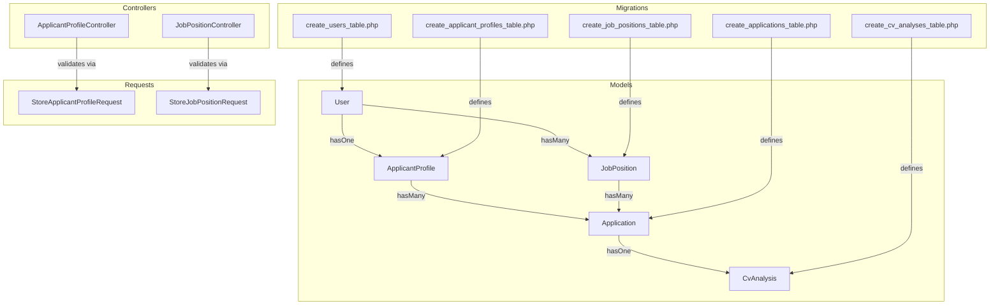
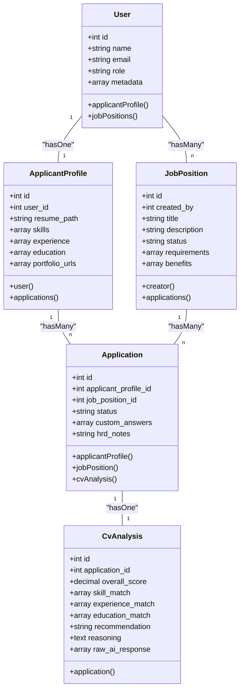
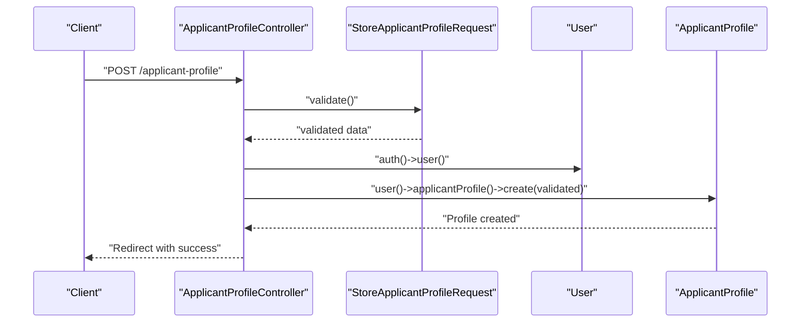
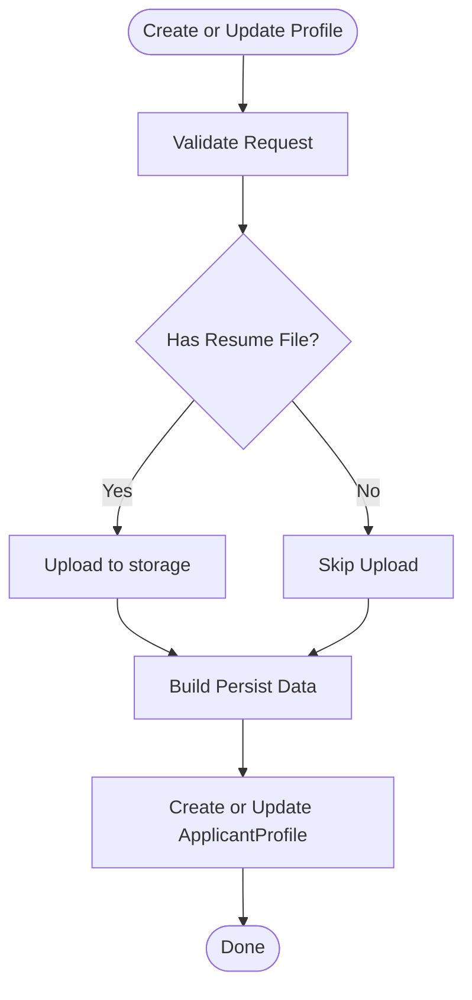
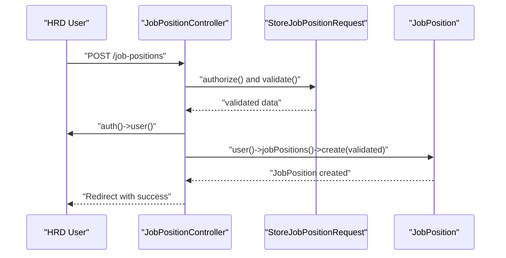
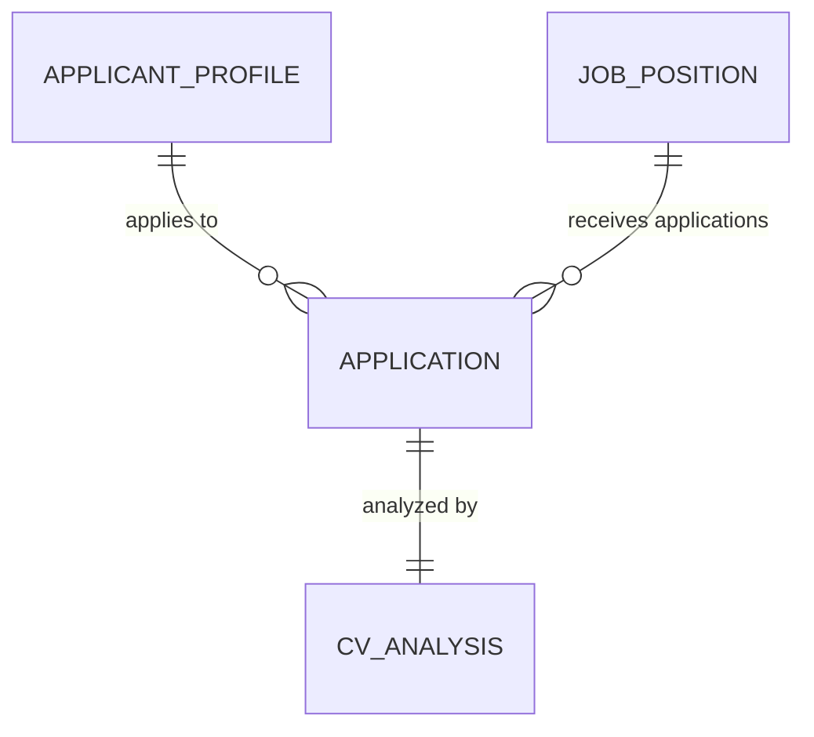
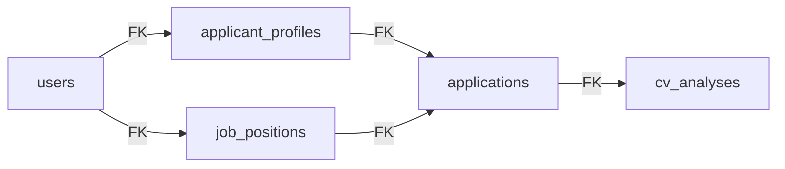

# Data Models & Database Schema

<cite>
**Referenced Files in This Document**
- [User.php](file://app/Models/User.php)
- [ApplicantProfile.php](file://app/Models/ApplicantProfile.php)
- [JobPosition.php](file://app/Models/JobPosition.php)
- [Application.php](file://app/Models/Application.php)
- [CvAnalysis.php](file://app/Models/CvAnalysis.php)
- [create_users_table.php](file://database/migrations/0001_01_01_000000_create_users_table.php)
- [add_two_factor_columns_to_users_table.php](file://database/migrations/2025_08_14_170933_add_two_factor_columns_to_users_table.php)
- [add_role_and_metadata_to_users_table.php](file://database/migrations/2026_06_24_164756_add_role_and_metadata_to_users_table.php)
- [create_applicant_profiles_table.php](file://database/migrations/2026_06_24_164755_create_applicant_profiles_table.php)
- [create_job_positions_table.php](file://database/migrations/2026_06_24_164755_create_job_positions_table.php)
- [create_applications_table.php](file://database/migrations/2026_06_24_164755_create_applications_table.php)
- [create_cv_analyses_table.php](file://database/migrations/2026_06_24_164756_create_cv_analyses_table.php)
- [ApplicantProfileController.php](file://app/Http/Controllers/ApplicantProfileController.php)
- [JobPositionController.php](file://app/Http/Controllers/JobPositionController.php)
- [StoreApplicantProfileRequest.php](file://app/Http/Requests/StoreApplicantProfileRequest.php)
- [StoreJobPositionRequest.php](file://app/Http/Requests/StoreJobPositionRequest.php)
- [UserFactory.php](file://database/factories/UserFactory.php)
</cite>

## Table of Contents
1. [Introduction](#introduction)
2. [Project Structure](#project-structure)
3. [Core Components](#core-components)
4. [Architecture Overview](#architecture-overview)
5. [Detailed Component Analysis](#detailed-component-analysis)
6. [Dependency Analysis](#dependency-analysis)
7. [Performance Considerations](#performance-considerations)
8. [Troubleshooting Guide](#troubleshooting-guide)
9. [Conclusion](#conclusion)
10. [Appendices](#appendices)

## Introduction
This document provides comprehensive data model documentation for the SmartRecruit ATS database schema. It focuses on the core entities—User, ApplicantProfile, JobPosition, Application, and CvAnalysis—detailing their relationships, database migrations, JSONB data modeling for flexible candidate skills and experience tracking, Eloquent model implementations, accessors/mutators, validation rules, and common query patterns. The goal is to enable developers and stakeholders to understand how data flows through the system, how models relate to each other, and how to work effectively with the schema.

## Project Structure
The data models and migrations are organized under app/Models and database/migrations respectively. Controllers and Form Requests encapsulate business logic and validation rules for creating/updating records. Factories support seeding and testing.

**Diagram sources**
- [User.php:52-60](file://app/Models/User.php#L52-L60)
- [ApplicantProfile.php:31-39](file://app/Models/ApplicantProfile.php#L31-L39)
- [JobPosition.php:29-37](file://app/Models/JobPosition.php#L29-L37)
- [Application.php:27-40](file://app/Models/Application.php#L27-L40)
- [CvAnalysis.php:33-36](file://app/Models/CvAnalysis.php#L33-L36)
- [ApplicantProfileController.php:24-36](file://app/Http/Controllers/ApplicantProfileController.php#L24-L36)
- [JobPositionController.php:22-27](file://app/Http/Controllers/JobPositionController.php#L22-L27)
- [StoreApplicantProfileRequest.php:23-32](file://app/Http/Requests/StoreApplicantProfileRequest.php#L23-L32)
- [StoreJobPositionRequest.php:23-32](file://app/Http/Requests/StoreJobPositionRequest.php#L23-L32)
- [create_users_table.php:14-22](file://database/migrations/0001_01_01_000000_create_users_table.php#L14-L22)
- [create_applicant_profiles_table.php:14-23](file://database/migrations/2026_06_24_164755_create_applicant_profiles_table.php#L14-L23)
- [create_job_positions_table.php:14-23](file://database/migrations/2026_06_24_164755_create_job_positions_table.php#L14-L23)
- [create_applications_table.php:14-22](file://database/migrations/2026_06_24_164755_create_applications_table.php#L14-L22)
- [create_cv_analyses_table.php:14-25](file://database/migrations/2026_06_24_164756_create_cv_analyses_table.php#L14-L25)

**Section sources**
- [User.php:32-61](file://app/Models/User.php#L32-L61)
- [ApplicantProfile.php:10-40](file://app/Models/ApplicantProfile.php#L10-L40)
- [JobPosition.php:10-38](file://app/Models/JobPosition.php#L10-L38)
- [Application.php:10-41](file://app/Models/Application.php#L10-L41)
- [CvAnalysis.php:9-37](file://app/Models/CvAnalysis.php#L9-L37)

## Core Components
This section documents each model’s purpose, fillable attributes, casting behavior, relationships, and controller/request integration.

- User
  - Purpose: Base identity and authentication for candidates and HRD users.
  - Fillable: name, email, password, role, metadata.
  - Casts: email_verified_at, password, two_factor_confirmed_at, metadata (array).
  - Relationships:
    - One-to-one with ApplicantProfile via applicantProfile().
    - One-to-many with JobPosition via jobPositions(), using created_by foreign key.
  - Additional columns introduced by migrations: role, metadata (JSONB), two-factor columns.

- ApplicantProfile
  - Purpose: Stores candidate resume, skills, experience, education, and portfolio URLs.
  - Fillable: user_id, resume_path, skills, experience, education, portfolio_urls.
  - Casts: skills, experience, education, portfolio_urls (arrays).
  - Relationships:
    - Belongs to User via user().
    - Has many Application via applications().

- JobPosition
  - Purpose: Represents job postings with status, requirements, and benefits.
  - Fillable: created_by, title, description, status, requirements, benefits.
  - Casts: requirements, benefits (arrays).
  - Relationships:
    - Belongs to User (creator) via creator(), using created_by foreign key.
    - Has many Application via applications().

- Application
  - Purpose: Links a candidate’s profile to a job posting with status and custom answers.
  - Fillable: applicant_profile_id, job_position_id, status, custom_answers, hrd_notes.
  - Casts: custom_answers (array).
  - Relationships:
    - Belongs to ApplicantProfile via applicantProfile().
    - Belongs to JobPosition via jobPosition().
    - One-to-one with CvAnalysis via cvAnalysis().

- CvAnalysis
  - Purpose: AI-driven analysis of a candidate’s CV against a job posting.
  - Fillable: application_id, overall_score, skill_match, experience_match, education_match, recommendation, reasoning, raw_ai_response.
  - Casts: overall_score (decimal:2), skill_match, experience_match, education_match, raw_ai_response (arrays).
  - Relationships:
    - Belongs to Application via application().

**Section sources**
- [User.php:32-61](file://app/Models/User.php#L32-L61)
- [ApplicantProfile.php:10-40](file://app/Models/ApplicantProfile.php#L10-L40)
- [JobPosition.php:10-38](file://app/Models/JobPosition.php#L10-L38)
- [Application.php:10-41](file://app/Models/Application.php#L10-L41)
- [CvAnalysis.php:9-37](file://app/Models/CvAnalysis.php#L9-L37)

## Architecture Overview
The system follows a relational schema with JSONB columns enabling flexible, semi-structured data for skills, experience, education, and related arrays. The Eloquent ORM enforces relationships and type casting, while controllers and form requests manage validation and persistence.

**Diagram sources**
- [User.php:52-60](file://app/Models/User.php#L52-L60)
- [ApplicantProfile.php:31-39](file://app/Models/ApplicantProfile.php#L31-L39)
- [JobPosition.php:29-37](file://app/Models/JobPosition.php#L29-L37)
- [Application.php:27-40](file://app/Models/Application.php#L27-L40)
- [CvAnalysis.php:33-36](file://app/Models/CvAnalysis.php#L33-L36)

## Detailed Component Analysis

### User Model
- Identity and authentication base with two-factor and passkey support.
- Role and metadata stored as JSONB for extensibility.
- Relationship to ApplicantProfile is one-to-one; to JobPosition is one-to-many via created_by.

**Diagram sources**
- [ApplicantProfileController.php:24-36](file://app/Http/Controllers/ApplicantProfileController.php#L24-L36)
- [StoreApplicantProfileRequest.php:23-32](file://app/Http/Requests/StoreApplicantProfileRequest.php#L23-L32)
- [User.php:52-55](file://app/Models/User.php#L52-L55)

**Section sources**
- [User.php:32-61](file://app/Models/User.php#L32-L61)
- [add_role_and_metadata_to_users_table.php:14-17](file://database/migrations/2026_06_24_164756_add_role_and_metadata_to_users_table.php#L14-L17)
- [add_two_factor_columns_to_users_table.php:14-18](file://database/migrations/2025_08_14_170933_add_two_factor_columns_to_users_table.php#L14-L18)

### ApplicantProfile Model
- Stores resume file path and JSONB arrays for skills, experience, education, and portfolio URLs.
- Casts JSONB fields to arrays for convenient manipulation.
- One-to-one with User and one-to-many with Application.

**Diagram sources**
- [ApplicantProfileController.php:24-57](file://app/Http/Controllers/ApplicantProfileController.php#L24-L57)
- [StoreApplicantProfileRequest.php:23-32](file://app/Http/Requests/StoreApplicantProfileRequest.php#L23-L32)

**Section sources**
- [ApplicantProfile.php:10-40](file://app/Models/ApplicantProfile.php#L10-L40)
- [create_applicant_profiles_table.php:14-23](file://database/migrations/2026_06_24_164755_create_applicant_profiles_table.php#L14-L23)
- [ApplicantProfileController.php:24-57](file://app/Http/Controllers/ApplicantProfileController.php#L24-L57)

### JobPosition Model
- Represents job postings with status and JSONB arrays for requirements and benefits.
- One-to-one relationship with User as creator and one-to-many with Application.

**Diagram sources**
- [JobPositionController.php:22-27](file://app/Http/Controllers/JobPositionController.php#L22-L27)
- [StoreJobPositionRequest.php:13-16](file://app/Http/Requests/StoreJobPositionRequest.php#L13-L16)
- [JobPosition.php:29-37](file://app/Models/JobPosition.php#L29-L37)

**Section sources**
- [JobPosition.php:10-38](file://app/Models/JobPosition.php#L10-L38)
- [create_job_positions_table.php:14-23](file://database/migrations/2026_06_24_164755_create_job_positions_table.php#L14-L23)
- [JobPositionController.php:14-54](file://app/Http/Controllers/JobPositionController.php#L14-L54)

### Application Model
- Links an ApplicantProfile to a JobPosition with status and custom answers.
- One-to-one CvAnalysis for AI insights.

**Diagram sources**
- [Application.php:27-40](file://app/Models/Application.php#L27-L40)
- [CvAnalysis.php:33-36](file://app/Models/CvAnalysis.php#L33-L36)

**Section sources**
- [Application.php:10-41](file://app/Models/Application.php#L10-L41)
- [create_applications_table.php:14-22](file://database/migrations/2026_06_24_164755_create_applications_table.php#L14-L22)

### CvAnalysis Model
- Stores AI-generated scores and match data for skills, experience, and education.
- Uses decimal casting for overall score and array casting for match fields.

**Section sources**
- [CvAnalysis.php:9-37](file://app/Models/CvAnalysis.php#L9-L37)
- [create_cv_analyses_table.php:14-25](file://database/migrations/2026_06_24_164756_create_cv_analyses_table.php#L14-L25)

## Dependency Analysis
- Foreign keys:
  - applicant_profiles.user_id → users.id (cascade delete)
  - job_positions.created_by → users.id (cascade delete)
  - applications.applicant_profile_id → applicant_profiles.id (cascade delete)
  - applications.job_position_id → job_positions.id (cascade delete)
  - cv_analyses.application_id → applications.id (cascade delete)
- JSONB columns enable flexible schema evolution without altering table structure.
- Type casting ensures consistent data handling across models.

**Diagram sources**
- [create_applicant_profiles_table.php:16](file://database/migrations/2026_06_24_164755_create_applicant_profiles_table.php#L16)
- [create_job_positions_table.php:16](file://database/migrations/2026_06_24_164755_create_job_positions_table.php#L16)
- [create_applications_table.php:16-17](file://database/migrations/2026_06_24_164755_create_applications_table.php#L16-L17)
- [create_cv_analyses_table.php:16](file://database/migrations/2026_06_24_164756_create_cv_analyses_table.php#L16)

**Section sources**
- [create_applicant_profiles_table.php:14-23](file://database/migrations/2026_06_24_164755_create_applicant_profiles_table.php#L14-L23)
- [create_job_positions_table.php:14-23](file://database/migrations/2026_06_24_164755_create_job_positions_table.php#L14-L23)
- [create_applications_table.php:14-22](file://database/migrations/2026_06_24_164755_create_applications_table.php#L14-L22)
- [create_cv_analyses_table.php:14-25](file://database/migrations/2026_06_24_164756_create_cv_analyses_table.php#L14-L25)

## Performance Considerations
- JSONB vs. relational joins: JSONB columns reduce normalization overhead but limit index usage; consider adding GIN indexes on frequently queried JSONB fields if performance requires it.
- Casting arrays/decimals: Eloquent casting avoids manual parsing but adds minor overhead; keep casting minimal and only where necessary.
- Eager loading: Controllers already use with() and load() to avoid N+1 queries (e.g., JobPositionController index and show).
- Cascade deletes: Ensure cascade delete behavior aligns with data retention policies to prevent accidental mass deletions.

## Troubleshooting Guide
- Validation failures:
  - ApplicantProfile uploads accept PDF/DOC/DOCX with max size; ensure client respects these constraints.
  - JobPosition creation requires HRD role; unauthorized attempts are blocked.
- Authorization:
  - Profile updates restrict editing to the owning user; controller checks user_id and aborts if mismatch.
- Two-factor and passkey:
  - Users may have two-factor columns; ensure authentication flows handle presence/absence gracefully.
- Resume storage:
  - Updates replace existing resumes; verify storage disk permissions and cleanup after deletion.

**Section sources**
- [StoreApplicantProfileRequest.php:23-32](file://app/Http/Requests/StoreApplicantProfileRequest.php#L23-L32)
- [StoreJobPositionRequest.php:13-16](file://app/Http/Requests/StoreJobPositionRequest.php#L13-L16)
- [ApplicantProfileController.php:40-42](file://app/Http/Controllers/ApplicantProfileController.php#L40-L42)
- [add_two_factor_columns_to_users_table.php:14-18](file://database/migrations/2025_08_14_170933_add_two_factor_columns_to_users_table.php#L14-L18)

## Conclusion
SmartRecruit ATS employs a clean, normalized relational schema with JSONB columns to capture flexible candidate data. Eloquent models define clear relationships and casting, while controllers and form requests enforce validation and authorization. The design supports scalable growth through JSONB arrays and maintains referential integrity via foreign keys and cascading deletes.

## Appendices

### Database Schema Reference

- users
  - Columns: id, name, email (unique), email_verified_at, password, remember_token, timestamps; plus role (string), metadata (JSONB), and two-factor columns.
  - Indexes: email unique; sessions table includes indexes on user_id and last_activity.

- applicant_profiles
  - Columns: id, user_id (FK), resume_path, skills (JSONB), experience (JSONB), education (JSONB), portfolio_urls (JSONB), timestamps.
  - Indexes: FK on user_id; cascade delete.

- job_positions
  - Columns: id, created_by (FK), title, description, status, requirements (JSONB), benefits (JSONB), timestamps.
  - Indexes: FK on created_by; cascade delete.

- applications
  - Columns: id, applicant_profile_id (FK), job_position_id (FK), status, custom_answers (JSONB), hrd_notes (text), timestamps.
  - Indexes: FK on both profile and job; cascade delete.

- cv_analyses
  - Columns: id, application_id (FK), overall_score (decimal), skill_match (JSONB), experience_match (JSONB), education_match (JSONB), recommendation, reasoning, raw_ai_response (JSONB), timestamps.
  - Indexes: FK on application_id; cascade delete.

**Section sources**
- [create_users_table.php:14-37](file://database/migrations/0001_01_01_000000_create_users_table.php#L14-L37)
- [add_role_and_metadata_to_users_table.php:14-17](file://database/migrations/2026_06_24_164756_add_role_and_metadata_to_users_table.php#L14-L17)
- [add_two_factor_columns_to_users_table.php:14-18](file://database/migrations/2025_08_14_170933_add_two_factor_columns_to_users_table.php#L14-L18)
- [create_applicant_profiles_table.php:14-23](file://database/migrations/2026_06_24_164755_create_applicant_profiles_table.php#L14-L23)
- [create_job_positions_table.php:14-23](file://database/migrations/2026_06_24_164755_create_job_positions_table.php#L14-L23)
- [create_applications_table.php:14-22](file://database/migrations/2026_06_24_164755_create_applications_table.php#L14-L22)
- [create_cv_analyses_table.php:14-25](file://database/migrations/2026_06_24_164756_create_cv_analyses_table.php#L14-L25)

### Sample Data Structures
- User
  - role: "candidate" or "hrd"
  - metadata: JSON object (e.g., preferences, settings)
- ApplicantProfile
  - skills: JSON array of skill objects
  - experience: JSON array of job experiences
  - education: JSON array of educational entries
  - portfolio_urls: JSON array of URLs
- JobPosition
  - requirements: JSON array of qualifications
  - benefits: JSON array of benefit items
- Application
  - custom_answers: JSON array/object of answers
  - hrd_notes: free-form text
- CvAnalysis
  - overall_score: numeric (decimal)
  - skill_match: JSON array of matches
  - experience_match: JSON array of matches
  - education_match: JSON array of matches
  - raw_ai_response: JSON object/array returned by AI

### Common Query Patterns
- Load job positions with creator:
  - JobPosition::with("creator")->latest()->get()
- Load a single job position with creator:
  - JobPosition::with("creator")->find($id)
- Fetch applications for a job position:
  - $jobPosition->applications()->with(["applicantProfile.user", "cvAnalysis"])->get()
- Fetch applications for a candidate profile:
  - $profile->applications()->with(["jobPosition.creator", "cvAnalysis"])->get()
- Retrieve CV analysis for an application:
  - $application->cvAnalysis

**Section sources**
- [JobPositionController.php:16-19](file://app/Http/Controllers/JobPositionController.php#L16-L19)
- [JobPosition.php:34-37](file://app/Models/JobPosition.php#L34-L37)
- [Application.php:37-40](file://app/Models/Application.php#L37-L40)
- [ApplicantProfile.php:36-39](file://app/Models/ApplicantProfile.php#L36-L39)