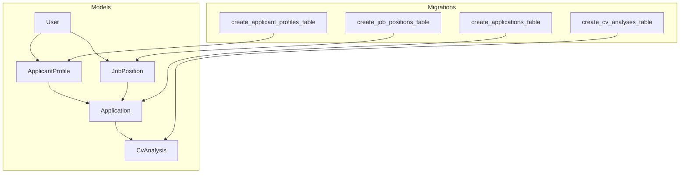
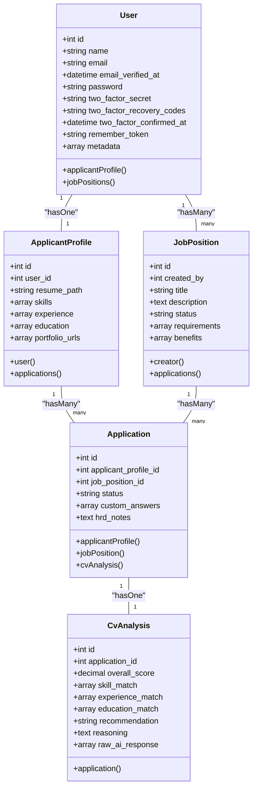
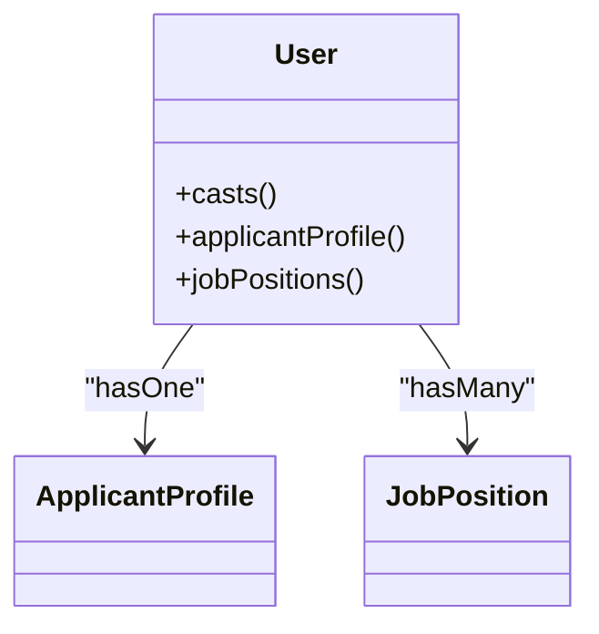
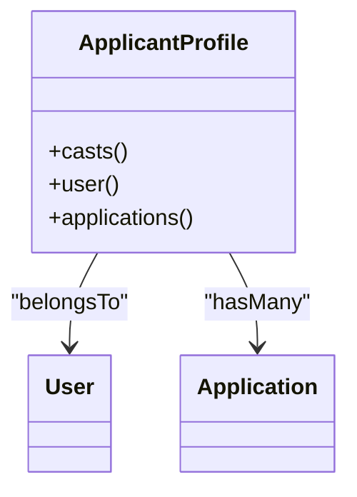
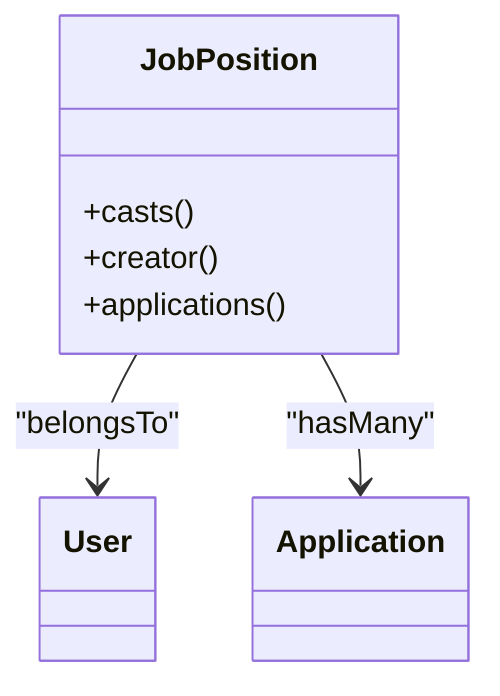
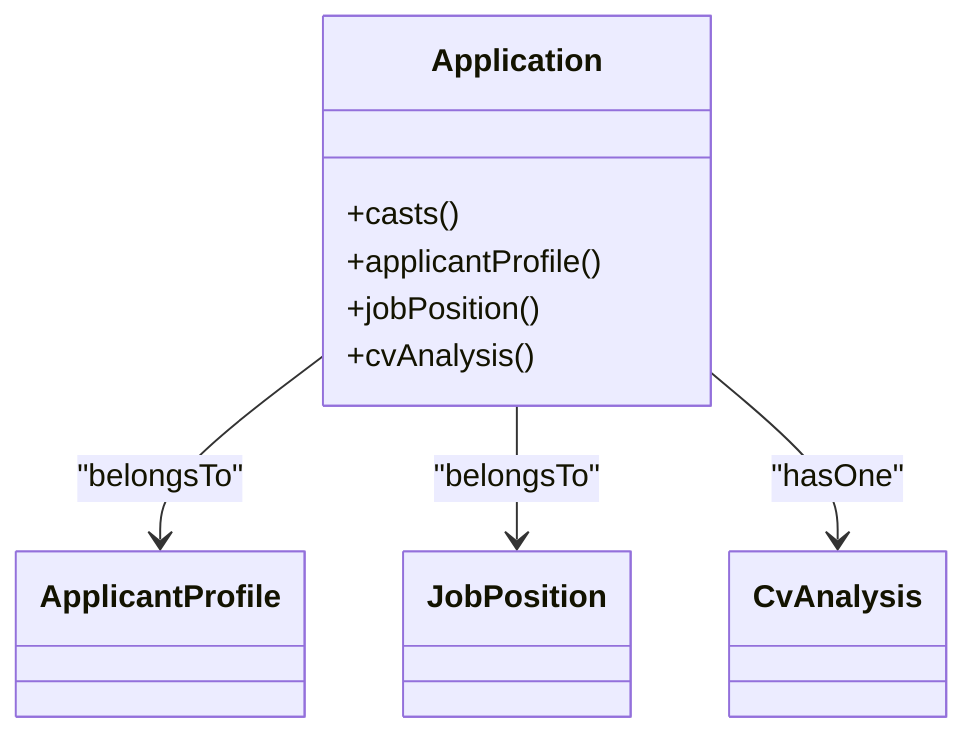
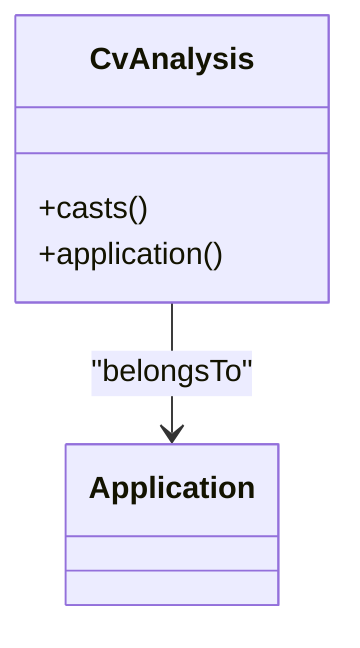
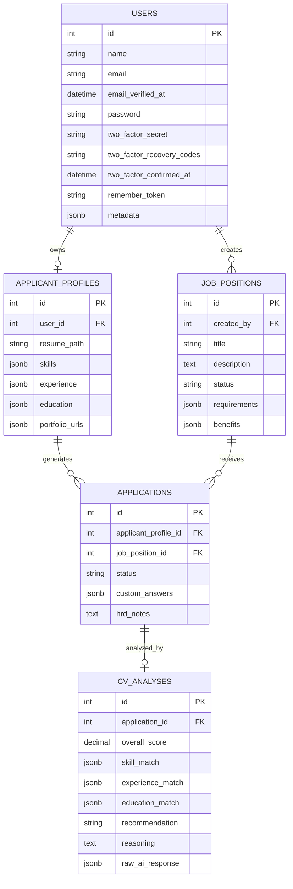

# Eloquent Model Implementations

<cite>
**Referenced Files in This Document**
- [User.php](file://app/Models/User.php)
- [ApplicantProfile.php](file://app/Models/ApplicantProfile.php)
- [JobPosition.php](file://app/Models/JobPosition.php)
- [Application.php](file://app/Models/Application.php)
- [CvAnalysis.php](file://app/Models/CvAnalysis.php)
- [2026_06_24_164755_create_applicant_profiles_table.php](file://database/migrations/2026_06_24_164755_create_applicant_profiles_table.php)
- [2026_06_24_164755_create_job_positions_table.php](file://database/migrations/2026_06_24_164755_create_job_positions_table.php)
- [2026_06_24_164755_create_applications_table.php](file://database/migrations/2026_06_24_164755_create_applications_table.php)
- [2026_06_24_164756_create_cv_analyses_table.php](file://database/migrations/2026_06_24_164756_create_cv_analyses_table.php)
- [UserFactory.php](file://database/factories/UserFactory.php)
- [ApplicantProfileController.php](file://app/Http/Controllers/ApplicantProfileController.php)
- [JobPositionController.php](file://app/Http/Controllers/JobPositionController.php)
</cite>

## Table of Contents
1. [Introduction](#introduction)
2. [Project Structure](#project-structure)
3. [Core Components](#core-components)
4. [Architecture Overview](#architecture-overview)
5. [Detailed Component Analysis](#detailed-component-analysis)
6. [Dependency Analysis](#dependency-analysis)
7. [Performance Considerations](#performance-considerations)
8. [Troubleshooting Guide](#troubleshooting-guide)
9. [Conclusion](#conclusion)

## Introduction
This document provides comprehensive documentation for SmartRecruit's Eloquent model implementations and ORM patterns. It focuses on five core models: User, ApplicantProfile, JobPosition, Application, and CvAnalysis. The documentation covers authentication enhancements (role metadata, two-factor authentication, and passkey integration), JSONB-based data modeling for skills and related arrays, pivot functionality for applications, AI assessment storage, model accessors and mutators, query scopes, and controller-level authorization patterns. It also outlines relationships, casting strategies, and practical usage patterns observed in controllers.

## Project Structure
SmartRecruit organizes models under app/Models and their database schema under database/migrations. Each model encapsulates fillable attributes, casting rules, and relationship definitions. Controllers demonstrate authorization checks and data transformation patterns, particularly around resume uploads and role-based restrictions.

**Diagram sources**
- [User.php:32-61](file://app/Models/User.php#L32-L61)
- [ApplicantProfile.php:10-40](file://app/Models/ApplicantProfile.php#L10-L40)
- [JobPosition.php:10-38](file://app/Models/JobPosition.php#L10-L38)
- [Application.php:10-41](file://app/Models/Application.php#L10-L41)
- [CvAnalysis.php:9-37](file://app/Models/CvAnalysis.php#L9-L37)
- [2026_06_24_164755_create_applicant_profiles_table.php:14-22](file://database/migrations/2026_06_24_164755_create_applicant_profiles_table.php#L14-L22)
- [2026_06_24_164755_create_job_positions_table.php:14-22](file://database/migrations/2026_06_24_164755_create_job_positions_table.php#L14-L22)
- [2026_06_24_164755_create_applications_table.php:14-21](file://database/migrations/2026_06_24_164755_create_applications_table.php#L14-L21)
- [2026_06_24_164756_create_cv_analyses_table.php:14-24](file://database/migrations/2026_06_24_164756_create_cv_analyses_table.php#L14-L24)

**Section sources**
- [User.php:1-62](file://app/Models/User.php#L1-L62)
- [ApplicantProfile.php:1-41](file://app/Models/ApplicantProfile.php#L1-L41)
- [JobPosition.php:1-39](file://app/Models/JobPosition.php#L1-L39)
- [Application.php:1-42](file://app/Models/Application.php#L1-L42)
- [CvAnalysis.php:1-38](file://app/Models/CvAnalysis.php#L1-L38)

## Core Components
This section summarizes each model’s primary responsibilities, relationships, and data characteristics.

- User
  - Enhanced authentication via Laravel Fortify traits for passkey and two-factor authentication.
  - Role metadata stored as array-cast for flexible access control.
  - One-to-one relationship with ApplicantProfile and one-to-many with JobPosition via created_by foreign key.
  - Hidden sensitive attributes and hashed password casting.

- ApplicantProfile
  - JSONB-backed arrays for skills, experience, education, and portfolio URLs.
  - Belongs to User and has many Applications.

- JobPosition
  - JSONB-backed arrays for requirements and benefits.
  - Belongs to User as creator and has many Applications.

- Application
  - Pivot-like model connecting ApplicantProfile and JobPosition.
  - JSONB-backed custom_answers and optional HRD notes.
  - Has one CvAnalysis.

- CvAnalysis
  - Stores AI-assessed metrics with decimal precision and JSONB arrays for match scores and raw AI response.
  - Belongs to Application.

**Section sources**
- [User.php:32-61](file://app/Models/User.php#L32-L61)
- [ApplicantProfile.php:10-40](file://app/Models/ApplicantProfile.php#L10-L40)
- [JobPosition.php:10-38](file://app/Models/JobPosition.php#L10-L38)
- [Application.php:10-41](file://app/Models/Application.php#L10-L41)
- [CvAnalysis.php:9-37](file://app/Models/CvAnalysis.php#L9-L37)

## Architecture Overview
The system follows a clean separation of concerns:
- Models define schema, casting, and relationships.
- Controllers enforce authorization and orchestrate persistence.
- Migrations define JSONB columns and foreign keys.

**Diagram sources**
- [User.php:32-61](file://app/Models/User.php#L32-L61)
- [ApplicantProfile.php:10-40](file://app/Models/ApplicantProfile.php#L10-L40)
- [JobPosition.php:10-38](file://app/Models/JobPosition.php#L10-L38)
- [Application.php:10-41](file://app/Models/Application.php#L10-L41)
- [CvAnalysis.php:9-37](file://app/Models/CvAnalysis.php#L9-L37)

## Detailed Component Analysis

### User Model
- Authentication and Authorization Enhancements
  - Implements PasskeyUser and leverages PasskeyAuthenticatable and TwoFactorAuthenticatable traits for passkey and two-factor support.
  - Role-based access control is supported via metadata casting to array, enabling flexible role definitions and checks in controllers.
- Relationships
  - One-to-one with ApplicantProfile via hasOne.
  - One-to-many with JobPosition via hasMany using created_by foreign key.
- Casting and Security
  - Password is hashed via cast.
  - Sensitive fields (password, two-factor secrets, recovery codes, remember token) are hidden by default.

**Diagram sources**
- [User.php:32-61](file://app/Models/User.php#L32-L61)

**Section sources**
- [User.php:32-61](file://app/Models/User.php#L32-L61)
- [UserFactory.php:25-60](file://database/factories/UserFactory.php#L25-L60)

### ApplicantProfile Model
- Purpose
  - Stores candidate profile data linked to a single User.
- JSONB Fields
  - skills, experience, education, and portfolio_urls are modeled as JSONB arrays for flexible, queryable structures.
- Relationships
  - Belongs to User.
  - Has many Applications.

**Diagram sources**
- [ApplicantProfile.php:10-40](file://app/Models/ApplicantProfile.php#L10-L40)

**Section sources**
- [ApplicantProfile.php:10-40](file://app/Models/ApplicantProfile.php#L10-L40)
- [2026_06_24_164755_create_applicant_profiles_table.php:14-22](file://database/migrations/2026_06_24_164755_create_applicant_profiles_table.php#L14-L22)

### JobPosition Model
- Purpose
  - Represents job listings created by Users.
- JSONB Fields
  - requirements and benefits are JSONB arrays for dynamic job descriptors.
- Authorization Mechanism
  - Controllers restrict deletion to users with role hrd, demonstrating role-based authorization.
- Relationships
  - Belongs to User as creator.
  - Has many Applications.

**Diagram sources**
- [JobPosition.php:10-38](file://app/Models/JobPosition.php#L10-L38)

**Section sources**
- [JobPosition.php:10-38](file://app/Models/JobPosition.php#L10-L38)
- [2026_06_24_164755_create_job_positions_table.php:14-22](file://database/migrations/2026_06_24_164755_create_job_positions_table.php#L14-L22)
- [JobPositionController.php:44-53](file://app/Http/Controllers/JobPositionController.php#L44-L53)

### Application Model
- Purpose
  - Connects ApplicantProfile and JobPosition with status tracking and HRD notes.
- JSONB Fields
  - custom_answers stored as JSONB for flexible interview/candidate responses.
- Relationships
  - Belongs to ApplicantProfile and JobPosition.
  - Has one CvAnalysis.

**Diagram sources**
- [Application.php:10-41](file://app/Models/Application.php#L10-L41)

**Section sources**
- [Application.php:10-41](file://app/Models/Application.php#L10-L41)
- [2026_06_24_164755_create_applications_table.php:14-21](file://database/migrations/2026_06_24_164755_create_applications_table.php#L14-L21)

### CvAnalysis Model
- Purpose
  - Stores AI-generated assessment data for an Application.
- Data Types
  - overall_score as decimal with two decimals.
  - skill_match, experience_match, education_match as JSONB arrays.
  - raw_ai_response as JSONB for auditability.
- Relationships
  - Belongs to Application.

**Diagram sources**
- [CvAnalysis.php:9-37](file://app/Models/CvAnalysis.php#L9-L37)

**Section sources**
- [CvAnalysis.php:9-37](file://app/Models/CvAnalysis.php#L9-L37)
- [2026_06_24_164756_create_cv_analyses_table.php:14-24](file://database/migrations/2026_06_24_164756_create_cv_analyses_table.php#L14-L24)

### Accessors, Mutators, and Query Scopes
- Accessors and Mutators
  - No explicit accessors or mutators are defined in the examined models.
- Query Scopes
  - No custom query scopes are present in the examined models.
- Observers and Event Handling
  - No model observers or explicit event listeners are defined in the examined models or controllers.

Recommendations:
- Add accessors/mutators for computed fields (e.g., formatted scores, derived status).
- Introduce scopes for common filters (e.g., status, date ranges, creator).
- Consider observers or model events for lifecycle hooks (e.g., after CV analysis creation).

**Section sources**
- [User.php:32-61](file://app/Models/User.php#L32-L61)
- [ApplicantProfile.php:10-40](file://app/Models/ApplicantProfile.php#L10-L40)
- [JobPosition.php:10-38](file://app/Models/JobPosition.php#L10-L38)
- [Application.php:10-41](file://app/Models/Application.php#L10-L41)
- [CvAnalysis.php:9-37](file://app/Models/CvAnalysis.php#L9-L37)

## Dependency Analysis
The models form a clear hierarchy with foreign keys and JSONB columns:

**Diagram sources**
- [2026_06_24_164755_create_applicant_profiles_table.php:14-22](file://database/migrations/2026_06_24_164755_create_applicant_profiles_table.php#L14-L22)
- [2026_06_24_164755_create_job_positions_table.php:14-22](file://database/migrations/2026_06_24_164755_create_job_positions_table.php#L14-L22)
- [2026_06_24_164755_create_applications_table.php:14-21](file://database/migrations/2026_06_24_164755_create_applications_table.php#L14-L21)
- [2026_06_24_164756_create_cv_analyses_table.php:14-24](file://database/migrations/2026_06_24_164756_create_cv_analyses_table.php#L14-L24)

**Section sources**
- [User.php:32-61](file://app/Models/User.php#L32-L61)
- [ApplicantProfile.php:10-40](file://app/Models/ApplicantProfile.php#L10-L40)
- [JobPosition.php:10-38](file://app/Models/JobPosition.php#L10-L38)
- [Application.php:10-41](file://app/Models/Application.php#L10-L41)
- [CvAnalysis.php:9-37](file://app/Models/CvAnalysis.php#L9-L37)

## Performance Considerations
- JSONB vs. Relations
  - Using JSONB for skills, experience, education, and benefits enables flexible schemas but can limit indexed queries. Consider normalized tables if frequent filtering by specific items becomes necessary.
- Casting Precision
  - decimal:2 for overall_score ensures consistent precision and efficient storage.
- Lazy Loading
  - Controllers use eager loading (with) for creator relationships to reduce N+1 queries.
- File Storage
  - Resume uploads are stored on public disk; ensure appropriate permissions and consider virus scanning and access controls.

[No sources needed since this section provides general guidance]

## Troubleshooting Guide
- Authentication and Authorization
  - Two-factor and passkey states are managed by Fortify traits; ensure proper configuration in Fortify settings and that users are properly registered for these features.
  - Role-based checks (e.g., hrd) should be enforced consistently across controllers.
- Data Validation
  - Controllers validate input via Form Requests; ensure validation rules align with model casts and database constraints.
- File Management
  - When updating resumes, existing files are deleted from storage; confirm storage disk configuration and permissions.
- JSONB Integrity
  - Ensure arrays stored in JSONB fields remain valid JSON; malformed JSON can cause downstream parsing errors.

**Section sources**
- [ApplicantProfileController.php:24-57](file://app/Http/Controllers/ApplicantProfileController.php#L24-L57)
- [JobPositionController.php:44-53](file://app/Http/Controllers/JobPositionController.php#L44-L53)
- [UserFactory.php:52-59](file://database/factories/UserFactory.php#L52-L59)

## Conclusion
SmartRecruit’s models implement a robust, JSONB-centric data layer with strong authentication integrations and clear relational boundaries. The User model centralizes role and authentication features, while ApplicantProfile, JobPosition, Application, and CvAnalysis form a cohesive pipeline for candidate evaluation. Controllers enforce authorization and handle file operations, complementing the models’ casting and relationship definitions. Extending the models with accessors, scopes, and observers would further enhance maintainability and functionality.