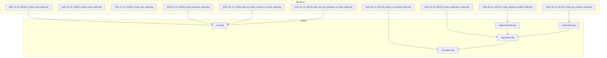
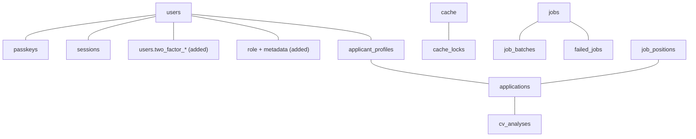
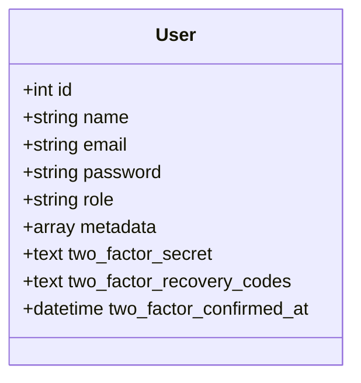
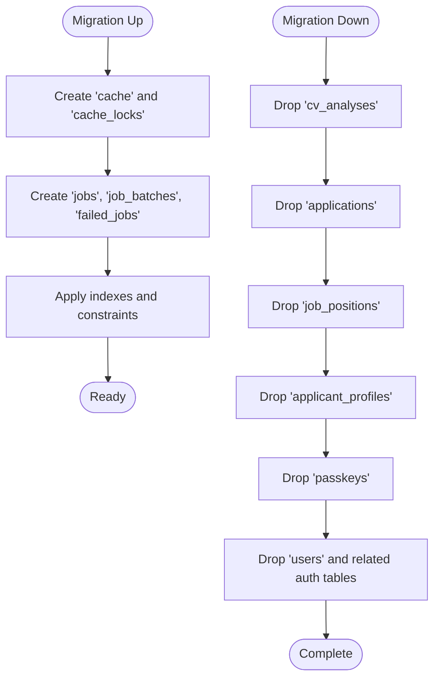
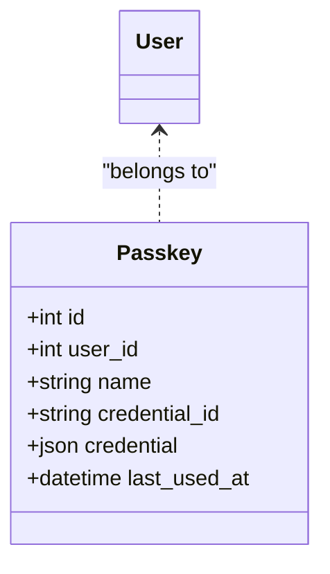
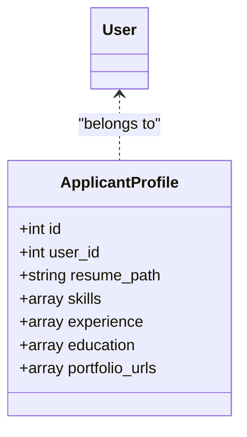
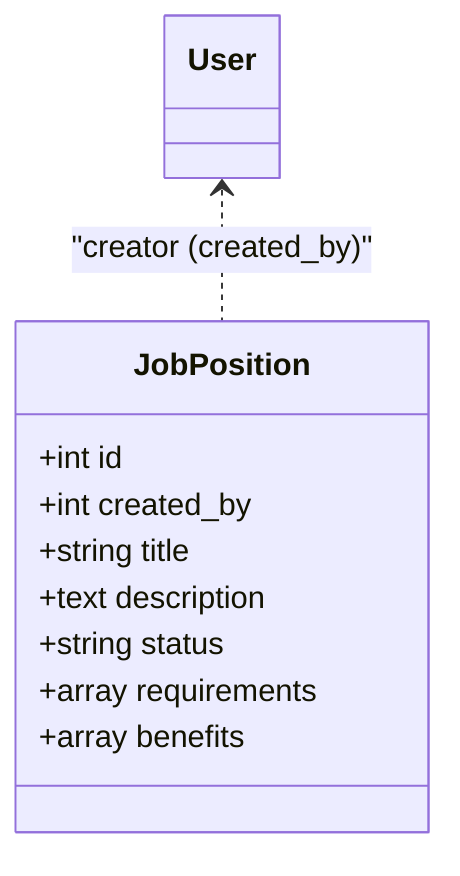
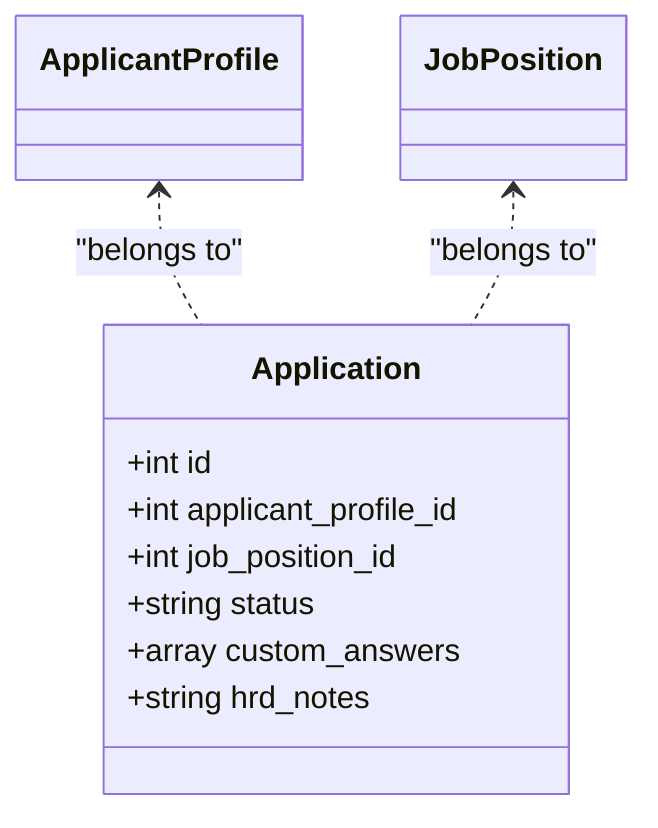
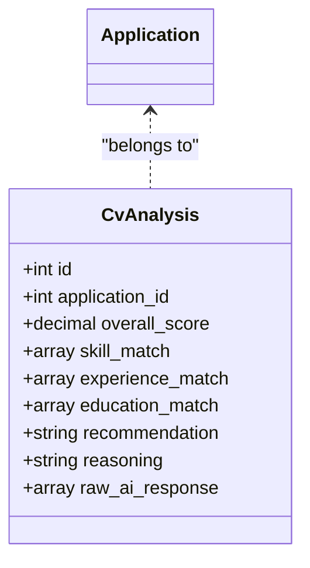
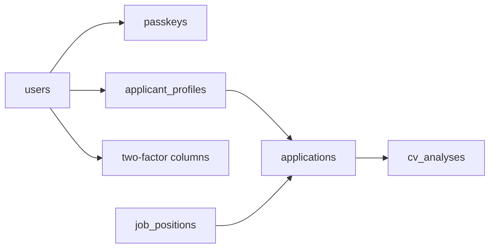

# Migration Files & Schema Design

<cite>
**Referenced Files in This Document**
- [0001_01_01_000000_create_users_table.php](file://database/migrations/0001_01_01_000000_create_users_table.php)
- [0001_01_01_000001_create_cache_table.php](file://database/migrations/0001_01_01_000001_create_cache_table.php)
- [0001_01_01_000002_create_jobs_table.php](file://database/migrations/0001_01_01_000002_create_jobs_table.php)
- [2024_01_01_000000_create_passkeys_table.php](file://database/migrations/2024_01_01_000000_create_passkeys_table.php)
- [2025_08_14_170933_add_two_factor_columns_to_users_table.php](file://database/migrations/2025_08_14_170933_add_two_factor_columns_to_users_table.php)
- [2026_06_24_164755_create_applicant_profiles_table.php](file://database/migrations/2026_06_24_164755_create_applicant_profiles_table.php)
- [2026_06_24_164755_create_applications_table.php](file://database/migrations/2026_06_24_164755_create_applications_table.php)
- [2026_06_24_164755_create_job_positions_table.php](file://database/migrations/2026_06_24_164755_create_job_positions_table.php)
- [2026_06_24_164756_add_role_and_metadata_to_users_table.php](file://database/migrations/2026_06_24_164756_add_role_and_metadata_to_users_table.php)
- [2026_06_24_164756_create_cv_analyses_table.php](file://database/migrations/2026_06_24_164756_create_cv_analyses_table.php)
- [User.php](file://app/Models/User.php)
- [ApplicantProfile.php](file://app/Models/ApplicantProfile.php)
- [Application.php](file://app/Models/Application.php)
- [JobPosition.php](file://app/Models/JobPosition.php)
- [CvAnalysis.php](file://app/Models/CvAnalysis.php)
</cite>

## Table of Contents
1. [Introduction](#introduction)
2. [Project Structure](#project-structure)
3. [Core Components](#core-components)
4. [Architecture Overview](#architecture-overview)
5. [Detailed Component Analysis](#detailed-component-analysis)
6. [Dependency Analysis](#dependency-analysis)
7. [Performance Considerations](#performance-considerations)
8. [Troubleshooting Guide](#troubleshooting-guide)
9. [Conclusion](#conclusion)

## Introduction
This document explains SmartRecruit’s database migration files and schema design patterns. It chronologically documents the creation of foundational infrastructure (users, cache, jobs, passkeys), followed by application-specific entities (applicant profiles, job positions, applications, CV analyses). It details schema evolution including two-factor authentication columns, role-based metadata, and JSONB columns enabling flexible storage of structured candidate data. Indexing strategies, foreign key constraints, and unique constraints are outlined, along with the rationale for JSONB modeling. Rollback procedures, migration execution order, and environment-specific considerations are included, alongside PostgreSQL-specific features leveraged in the schema.

## Project Structure
The database schema is defined via Laravel migrations under database/migrations. The application models in app/Models define Eloquent relationships and attribute casting that align with the migrations’ column types and JSONB usage.

**Diagram sources**
- [0001_01_01_000000_create_users_table.php:1-50](file://database/migrations/0001_01_01_000000_create_users_table.php#L1-L50)
- [0001_01_01_000001_create_cache_table.php:1-36](file://database/migrations/0001_01_01_000001_create_cache_table.php#L1-L36)
- [0001_01_01_000002_create_jobs_table.php:1-60](file://database/migrations/0001_01_01_000002_create_jobs_table.php#L1-L60)
- [2024_01_01_000000_create_passkeys_table.php:1-35](file://database/migrations/2024_01_01_000000_create_passkeys_table.php#L1-L35)
- [2025_08_14_170933_add_two_factor_columns_to_users_table.php:1-35](file://database/migrations/2025_08_14_170933_add_two_factor_columns_to_users_table.php#L1-L35)
- [2026_06_24_164755_create_applicant_profiles_table.php:1-34](file://database/migrations/2026_06_24_164755_create_applicant_profiles_table.php#L1-L34)
- [2026_06_24_164755_create_applications_table.php:1-33](file://database/migrations/2026_06_24_164755_create_applications_table.php#L1-L33)
- [2026_06_24_164755_create_job_positions_table.php:1-34](file://database/migrations/2026_06_24_164755_create_job_positions_table.php#L1-L34)
- [2026_06_24_164756_add_role_and_metadata_to_users_table.php:1-30](file://database/migrations/2026_06_24_164756_add_role_and_metadata_to_users_table.php#L1-L30)
- [2026_06_24_164756_create_cv_analyses_table.php:1-36](file://database/migrations/2026_06_24_164756_create_cv_analyses_table.php#L1-L36)
- [User.php:1-62](file://app/Models/User.php#L1-L62)
- [ApplicantProfile.php:1-41](file://app/Models/ApplicantProfile.php#L1-L41)
- [Application.php:1-42](file://app/Models/Application.php#L1-L42)
- [JobPosition.php:1-39](file://app/Models/JobPosition.php#L1-L39)
- [CvAnalysis.php:1-38](file://app/Models/CvAnalysis.php#L1-L38)

**Section sources**
- [0001_01_01_000000_create_users_table.php:1-50](file://database/migrations/0001_01_01_000000_create_users_table.php#L1-L50)
- [0001_01_01_000001_create_cache_table.php:1-36](file://database/migrations/0001_01_01_000001_create_cache_table.php#L1-L36)
- [0001_01_01_000002_create_jobs_table.php:1-60](file://database/migrations/0001_01_01_000002_create_jobs_table.php#L1-L60)
- [2024_01_01_000000_create_passkeys_table.php:1-35](file://database/migrations/2024_01_01_000000_create_passkeys_table.php#L1-L35)
- [2025_08_14_170933_add_two_factor_columns_to_users_table.php:1-35](file://database/migrations/2025_08_14_170933_add_two_factor_columns_to_users_table.php#L1-L35)
- [2026_06_24_164755_create_applicant_profiles_table.php:1-34](file://database/migrations/2026_06_24_164755_create_applicant_profiles_table.php#L1-L34)
- [2026_06_24_164755_create_applications_table.php:1-33](file://database/migrations/2026_06_24_164755_create_applications_table.php#L1-L33)
- [2026_06_24_164755_create_job_positions_table.php:1-34](file://database/migrations/2026_06_24_164755_create_job_positions_table.php#L1-L34)
- [2026_06_24_164756_add_role_and_metadata_to_users_table.php:1-30](file://database/migrations/2026_06_24_164756_add_role_and_metadata_to_users_table.php#L1-L30)
- [2026_06_24_164756_create_cv_analyses_table.php:1-36](file://database/migrations/2026_06_24_164756_create_cv_analyses_table.php#L1-L36)

## Core Components
- Base infrastructure tables
  - users: core identity and authentication table with unique email, timestamps, and Laravel Fortify/TOTP support columns introduced later.
  - cache and cache_locks: key-value cache and distributed lock primitives with primary keys and expiration indexes.
  - jobs, job_batches, failed_jobs: queue infrastructure supporting job payload storage, batch tracking, and failure records with composite and single-column indexes.
  - passkeys: WebAuthn passkey credentials linked to users with unique credential identifiers and JSON storage for credential material.
- Application domain tables
  - applicant_profiles: per-user profile with optional resume path and JSONB fields for skills, experience, education, and portfolio URLs.
  - job_positions: roles posted by users with JSONB requirements and benefits, plus status tracking.
  - applications: linking profiles to job positions with status, custom answers, and HR notes.
  - cv_analyses: AI-driven analysis results per application with scores and JSONB match data.
- Schema evolution
  - Two-factor authentication columns added to users for TOTP secrets, recovery codes, and confirmation timestamp.
  - Role and metadata columns added to users for role-based access and flexible user attributes stored as JSONB.

Key PostgreSQL-specific features used:
- JSONB columns for semi-structured data (skills, experience, education, requirements, benefits, custom answers, match metrics, raw AI response).
- Array casting in Eloquent models to handle JSONB-derived arrays.
- Decimal precision for scoring fields.

**Section sources**
- [0001_01_01_000000_create_users_table.php:14-37](file://database/migrations/0001_01_01_000000_create_users_table.php#L14-L37)
- [0001_01_01_000001_create_cache_table.php:14-24](file://database/migrations/0001_01_01_000001_create_cache_table.php#L14-L24)
- [0001_01_01_000002_create_jobs_table.php:14-47](file://database/migrations/0001_01_01_000002_create_jobs_table.php#L14-L47)
- [2024_01_01_000000_create_passkeys_table.php:14-24](file://database/migrations/2024_01_01_000000_create_passkeys_table.php#L14-L24)
- [2025_08_14_170933_add_two_factor_columns_to_users_table.php:14-18](file://database/migrations/2025_08_14_170933_add_two_factor_columns_to_users_table.php#L14-L18)
- [2026_06_24_164755_create_applicant_profiles_table.php:14-23](file://database/migrations/2026_06_24_164755_create_applicant_profiles_table.php#L14-L23)
- [2026_06_24_164755_create_job_positions_table.php:14-23](file://database/migrations/2026_06_24_164755_create_job_positions_table.php#L14-L23)
- [2026_06_24_164755_create_applications_table.php:14-22](file://database/migrations/2026_06_24_164755_create_applications_table.php#L14-L22)
- [2026_06_24_164756_create_cv_analyses_table.php:14-25](file://database/migrations/2026_06_24_164756_create_cv_analyses_table.php#L14-L25)
- [2026_06_24_164756_add_role_and_metadata_to_users_table.php:14-17](file://database/migrations/2026_06_24_164756_add_role_and_metadata_to_users_table.php#L14-L17)

## Architecture Overview
The schema follows a layered design:
- Foundation layer: identity, sessions, cache, queues.
- Security layer: passkeys and two-factor augmentation to users.
- Domain layer: profiles, positions, applications, and AI-driven analyses.

**Diagram sources**
- [0001_01_01_000000_create_users_table.php:14-37](file://database/migrations/0001_01_01_000000_create_users_table.php#L14-L37)
- [0001_01_01_000001_create_cache_table.php:14-24](file://database/migrations/0001_01_01_000001_create_cache_table.php#L14-L24)
- [0001_01_01_000002_create_jobs_table.php:14-47](file://database/migrations/0001_01_01_000002_create_jobs_table.php#L14-L47)
- [2024_01_01_000000_create_passkeys_table.php:14-24](file://database/migrations/2024_01_01_000000_create_passkeys_table.php#L14-L24)
- [2025_08_14_170933_add_two_factor_columns_to_users_table.php:14-18](file://database/migrations/2025_08_14_170933_add_two_factor_columns_to_users_table.php#L14-L18)
- [2026_06_24_164755_create_applicant_profiles_table.php:14-23](file://database/migrations/2026_06_24_164755_create_applicant_profiles_table.php#L14-L23)
- [2026_06_24_164755_create_job_positions_table.php:14-23](file://database/migrations/2026_06_24_164755_create_job_positions_table.php#L14-L23)
- [2026_06_24_164755_create_applications_table.php:14-22](file://database/migrations/2026_06_24_164755_create_applications_table.php#L14-L22)
- [2026_06_24_164756_create_cv_analyses_table.php:14-25](file://database/migrations/2026_06_24_164756_create_cv_analyses_table.php#L14-L25)

## Detailed Component Analysis

### Identity and Sessions (users, sessions)
- Purpose: Centralize user identity, email verification, password hashing, remember tokens, and session tracking.
- Constraints and indexes:
  - Unique index on users.email.
  - sessions.user_id indexed for fast lookup; sessions.id as primary key.
- Evolution:
  - Two-factor columns added to support TOTP.
  - Role and metadata columns added to support role-based access and flexible attributes.

**Diagram sources**
- [0001_01_01_000000_create_users_table.php:14-22](file://database/migrations/0001_01_01_000000_create_users_table.php#L14-L22)
- [2025_08_14_170933_add_two_factor_columns_to_users_table.php:14-18](file://database/migrations/2025_08_14_170933_add_two_factor_columns_to_users_table.php#L14-L18)
- [2026_06_24_164756_add_role_and_metadata_to_users_table.php:14-17](file://database/migrations/2026_06_24_164756_add_role_and_metadata_to_users_table.php#L14-L17)
- [User.php:32-61](file://app/Models/User.php#L32-L61)

**Section sources**
- [0001_01_01_000000_create_users_table.php:14-37](file://database/migrations/0001_01_01_000000_create_users_table.php#L14-L37)
- [2025_08_14_170933_add_two_factor_columns_to_users_table.php:14-18](file://database/migrations/2025_08_14_170933_add_two_factor_columns_to_users_table.php#L14-L18)
- [2026_06_24_164756_add_role_and_metadata_to_users_table.php:14-17](file://database/migrations/2026_06_24_164756_add_role_and_metadata_to_users_table.php#L14-L17)
- [User.php:32-61](file://app/Models/User.php#L32-L61)

### Cache and Queue Infrastructure (cache, cache_locks, jobs, job_batches, failed_jobs)
- Purpose: Provide caching primitives and robust job queueing with batch and failure tracking.
- Indexing and constraints:
  - cache.key and cache_locks.key as primary keys; expiration indexed for TTL scans.
  - jobs.queue indexed; failed_jobs.uuid unique; composite index on failed_jobs.connection, queue, failed_at.
- Rollback: Drops all associated tables in reverse dependency order.

**Diagram sources**
- [0001_01_01_000001_create_cache_table.php:14-24](file://database/migrations/0001_01_01_000001_create_cache_table.php#L14-L24)
- [0001_01_01_000002_create_jobs_table.php:14-47](file://database/migrations/0001_01_01_000002_create_jobs_table.php#L14-L47)
- [0001_01_01_000000_create_users_table.php:24-37](file://database/migrations/0001_01_01_000000_create_users_table.php#L24-L37)

**Section sources**
- [0001_01_01_000001_create_cache_table.php:14-24](file://database/migrations/0001_01_01_000001_create_cache_table.php#L14-L24)
- [0001_01_01_000002_create_jobs_table.php:14-47](file://database/migrations/0001_01_01_000002_create_jobs_table.php#L14-L47)
- [0001_01_01_000000_create_users_table.php:24-37](file://database/migrations/0001_01_01_000000_create_users_table.php#L24-L37)

### Passkeys (WebAuthn)
- Purpose: Store passkey credentials bound to users with unique credential identifiers and JSON-formatted credential material.
- Constraints:
  - passkeys.credential_id unique; passkeys.user_id foreign key to users with cascade delete; index on user_id.

**Diagram sources**
- [2024_01_01_000000_create_passkeys_table.php:14-24](file://database/migrations/2024_01_01_000000_create_passkeys_table.php#L14-L24)
- [User.php:32-35](file://app/Models/User.php#L32-L35)

**Section sources**
- [2024_01_01_000000_create_passkeys_table.php:14-24](file://database/migrations/2024_01_01_000000_create_passkeys_table.php#L14-L24)

### Applicant Profiles
- Purpose: Capture candidate resumes and flexible skill/experience/education/portfolio data.
- JSONB fields:
  - skills, experience, education, portfolio_urls modeled as JSONB for extensibility.
- Relationships:
  - One-to-one with User via user_id.
- Casting:
  - Eloquent model casts JSONB-derived arrays to PHP arrays.

**Diagram sources**
- [2026_06_24_164755_create_applicant_profiles_table.php:14-23](file://database/migrations/2026_06_24_164755_create_applicant_profiles_table.php#L14-L23)
- [ApplicantProfile.php:10-40](file://app/Models/ApplicantProfile.php#L10-L40)

**Section sources**
- [2026_06_24_164755_create_applicant_profiles_table.php:14-23](file://database/migrations/2026_06_24_164755_create_applicant_profiles_table.php#L14-L23)
- [ApplicantProfile.php:10-40](file://app/Models/ApplicantProfile.php#L10-L40)

### Job Positions
- Purpose: Define roles with structured metadata stored as JSONB for requirements and benefits.
- Status tracking and creator linkage:
  - created_by links to users; default status open.
- Casting:
  - requirements and benefits mapped to arrays.

**Diagram sources**
- [2026_06_24_164755_create_job_positions_table.php:14-23](file://database/migrations/2026_06_24_164755_create_job_positions_table.php#L14-L23)
- [JobPosition.php:10-38](file://app/Models/JobPosition.php#L10-L38)

**Section sources**
- [2026_06_24_164755_create_job_positions_table.php:14-23](file://database/migrations/2026_06_24_164755_create_job_positions_table.php#L14-L23)
- [JobPosition.php:10-38](file://app/Models/JobPosition.php#L10-L38)

### Applications
- Purpose: Link profiles to job positions, track application lifecycle, and capture custom answers and HR notes.
- Status defaults to applied; foreign keys enforce referential integrity with cascade deletes.
- Casting:
  - custom_answers mapped to array.

**Diagram sources**
- [2026_06_24_164755_create_applications_table.php:14-22](file://database/migrations/2026_06_24_164755_create_applications_table.php#L14-L22)
- [Application.php:10-41](file://app/Models/Application.php#L10-L41)

**Section sources**
- [2026_06_24_164755_create_applications_table.php:14-22](file://database/migrations/2026_06_24_164755_create_applications_table.php#L14-L22)
- [Application.php:10-41](file://app/Models/Application.php#L10-L41)

### CV Analyses
- Purpose: Store AI-generated insights per application, including scores and match breakdowns.
- Scoring precision:
  - overall_score uses decimal type with fixed precision.
- JSONB fields:
  - skill_match, experience_match, education_match, raw_ai_response for structured analysis outputs.

**Diagram sources**
- [2026_06_24_164756_create_cv_analyses_table.php:14-25](file://database/migrations/2026_06_24_164756_create_cv_analyses_table.php#L14-L25)
- [CvAnalysis.php:9-37](file://app/Models/CvAnalysis.php#L9-L37)

**Section sources**
- [2026_06_24_164756_create_cv_analyses_table.php:14-25](file://database/migrations/2026_06_24_164756_create_cv_analyses_table.php#L14-L25)
- [CvAnalysis.php:9-37](file://app/Models/CvAnalysis.php#L9-L37)

### JSONB Data Modeling Rationale
- Flexibility: Skills, experience, education, requirements, benefits, and AI outputs vary widely; JSONB accommodates evolving structures without altering schema.
- Query efficiency: JSONB enables targeted lookups and filtering using PostgreSQL operators and path expressions.
- Casting alignment: Eloquent models cast JSONB-derived arrays to PHP arrays for convenient manipulation in application code.
- Storage cost: JSONB reduces duplication compared to normalized relational structures for semi-structured data.

## Dependency Analysis
The domain layer depends on the foundation and security layers as follows:
- users is central; passkeys, sessions, and two-factor metadata augment identity.
- applicant_profiles belongs to users; applications link profiles to job_positions; cv_analyses belong to applications.

**Diagram sources**
- [0001_01_01_000000_create_users_table.php:14-37](file://database/migrations/0001_01_01_000000_create_users_table.php#L14-L37)
- [2024_01_01_000000_create_passkeys_table.php:14-24](file://database/migrations/2024_01_01_000000_create_passkeys_table.php#L14-L24)
- [2025_08_14_170933_add_two_factor_columns_to_users_table.php:14-18](file://database/migrations/2025_08_14_170933_add_two_factor_columns_to_users_table.php#L14-L18)
- [2026_06_24_164755_create_applicant_profiles_table.php:14-23](file://database/migrations/2026_06_24_164755_create_applicant_profiles_table.php#L14-L23)
- [2026_06_24_164755_create_job_positions_table.php:14-23](file://database/migrations/2026_06_24_164755_create_job_positions_table.php#L14-L23)
- [2026_06_24_164755_create_applications_table.php:14-22](file://database/migrations/2026_06_24_164755_create_applications_table.php#L14-L22)
- [2026_06_24_164756_create_cv_analyses_table.php:14-25](file://database/migrations/2026_06_24_164756_create_cv_analyses_table.php#L14-L25)

**Section sources**
- [User.php:52-60](file://app/Models/User.php#L52-L60)
- [ApplicantProfile.php:31-39](file://app/Models/ApplicantProfile.php#L31-L39)
- [JobPosition.php:29-37](file://app/Models/JobPosition.php#L29-L37)
- [Application.php:27-40](file://app/Models/Application.php#L27-L40)
- [CvAnalysis.php:33-36](file://app/Models/CvAnalysis.php#L33-L36)

## Performance Considerations
- Indexing strategy
  - Single-column indexes on frequently filtered/sorted columns: sessions.user_id, jobs.queue, passkeys.user_id.
  - Composite index on failed_jobs for efficient failure auditing by connection, queue, and timestamp.
  - Expiration indexes on cache and cache_locks enable fast TTL scans.
- JSONB vs normalization
  - JSONB minimizes joins for semi-structured data but requires appropriate GIN/BRIN strategies if heavy querying is anticipated; current migrations rely on basic JSONB columns.
- Foreign keys
  - Cascade deletes simplify cleanup but require careful handling during rollbacks to avoid unintended truncation.
- Two-factor and metadata
  - Additional nullable columns increase row width slightly; ensure appropriate monitoring of storage growth.

[No sources needed since this section provides general guidance]

## Troubleshooting Guide
- Migration execution order
  - Always apply base infrastructure migrations first (users, cache, jobs), then passkeys, then schema evolution (two-factor, role/metadata), and finally domain tables (profiles, positions, applications, analyses).
- Rollback procedures
  - Reverse the order: drop cv_analyses, applications, job_positions, applicant_profiles, passkeys, then users-related tables (users, sessions, password reset tokens), cache, and jobs.
  - Ensure dependent tables are dropped before their dependents.
- Environment-specific variations
  - Adjust JSONB operator usage and array functions according to PostgreSQL version and extensions installed (e.g., pg_trgm for text similarity).
  - Validate decimal precision for scoring fields across environments.
- Common issues
  - Unique constraint violations on passkeys.credential_id or users.email after re-seeding.
  - Missing indexes causing slow queries on job failures or cache scans; verify indexes exist post-migration.
  - JSONB casting mismatches if raw JSON does not conform to expected array/object shapes; sanitize data during seeding or ETL.

**Section sources**
- [0001_01_01_000000_create_users_table.php:43-48](file://database/migrations/0001_01_01_000000_create_users_table.php#L43-L48)
- [0001_01_01_000001_create_cache_table.php:30-34](file://database/migrations/0001_01_01_000001_create_cache_table.php#L30-L34)
- [0001_01_01_000002_create_jobs_table.php:53-58](file://database/migrations/0001_01_01_000002_create_jobs_table.php#L53-L58)
- [2024_01_01_000000_create_passkeys_table.php:30-33](file://database/migrations/2024_01_01_000000_create_passkeys_table.php#L30-L33)
- [2026_06_24_164755_create_applicant_profiles_table.php:29-32](file://database/migrations/2026_06_24_164755_create_applicant_profiles_table.php#L29-L32)
- [2026_06_24_164755_create_job_positions_table.php:29-31](file://database/migrations/2026_06_24_164755_create_job_positions_table.php#L29-L31)
- [2026_06_24_164755_create_applications_table.php:28-31](file://database/migrations/2026_06_24_164755_create_applications_table.php#L28-L31)
- [2026_06_24_164756_create_cv_analyses_table.php:31-34](file://database/migrations/2026_06_24_164756_create_cv_analyses_table.php#L31-L34)

## Conclusion
SmartRecruit’s schema employs a clean separation of concerns across foundational, security, and domain layers. The use of JSONB for flexible, evolving data like skills and job requirements balances agility with maintainability. Two-factor authentication and role/metadata enhancements demonstrate forward-looking design. Careful indexing and foreign key constraints ensure data integrity and query performance. Adhering to the documented migration order and rollback procedures will keep deployments predictable and reversible across environments.