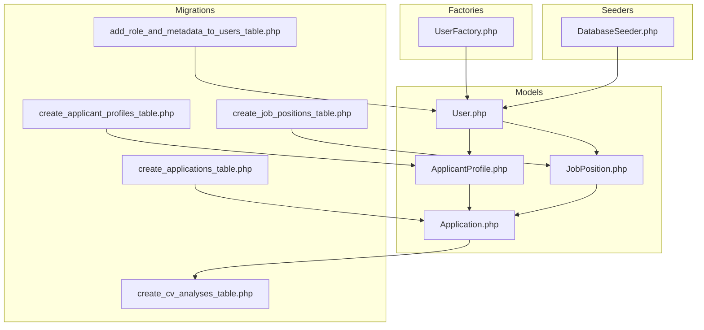
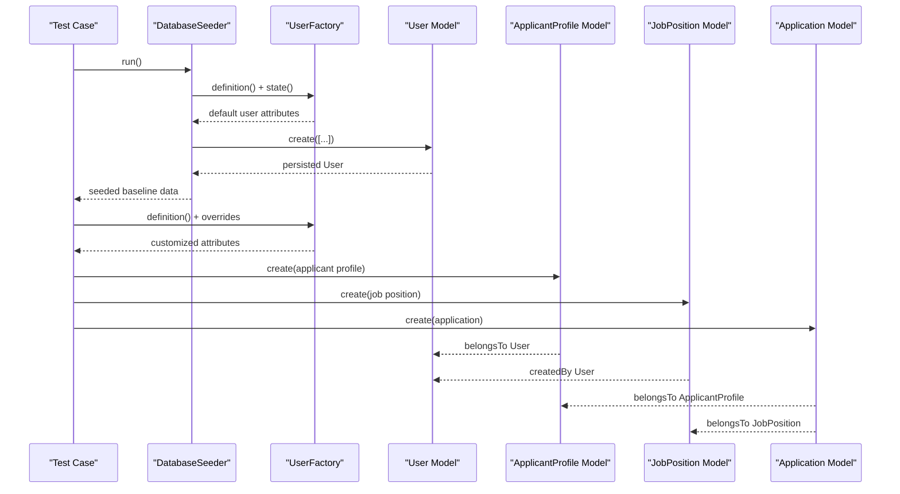
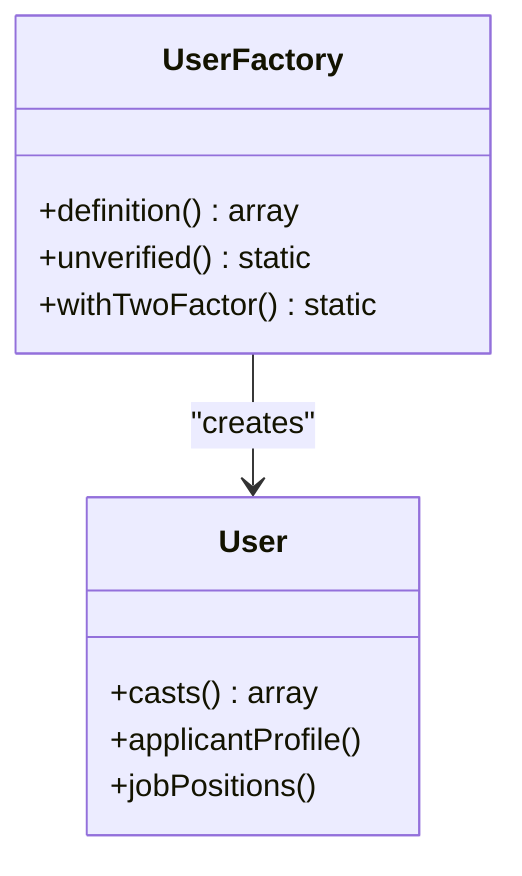
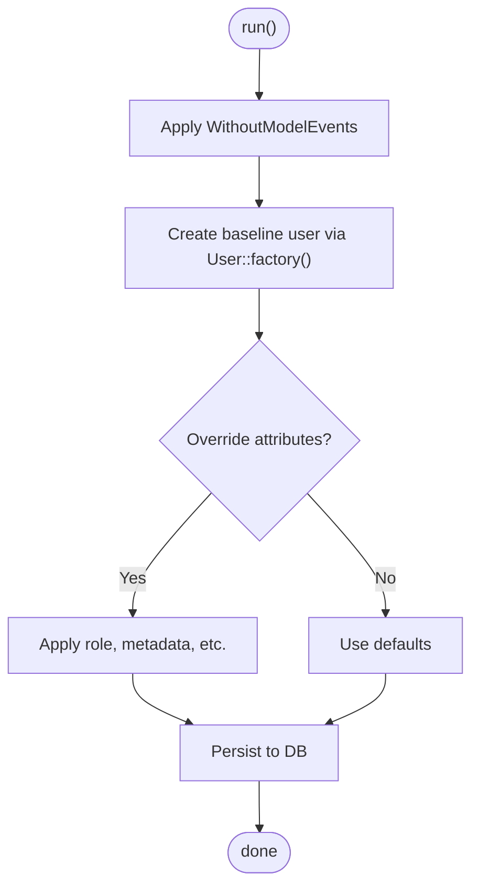
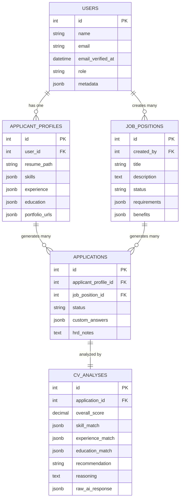
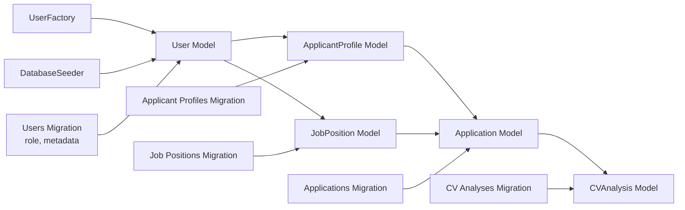

# Model Factories & Seeders

<cite>
**Referenced Files in This Document**
- [UserFactory.php](file://database/factories/UserFactory.php)
- [DatabaseSeeder.php](file://database/seeders/DatabaseSeeder.php)
- [User.php](file://app/Models/User.php)
- [ApplicantProfile.php](file://app/Models/ApplicantProfile.php)
- [JobPosition.php](file://app/Models/JobPosition.php)
- [Application.php](file://app/Models/Application.php)
- [2026_06_24_164755_create_applicant_profiles_table.php](file://database/migrations/2026_06_24_164755_create_applicant_profiles_table.php)
- [2026_06_24_164755_create_applications_table.php](file://database/migrations/2026_06_24_164755_create_applications_table.php)
- [2026_06_24_164755_create_job_positions_table.php](file://database/migrations/2026_06_24_164755_create_job_positions_table.php)
- [2026_06_24_164756_create_cv_analyses_table.php](file://database/migrations/2026_06_24_164756_create_cv_analyses_table.php)
- [2026_06_24_164756_add_role_and_metadata_to_users_table.php](file://database/migrations/2026_06_24_164756_add_role_and_metadata_to_users_table.php)
- [ApplicantProfileTest.php](file://tests/Feature/ApplicantProfileTest.php)
- [JobPositionTest.php](file://tests/Feature/JobPositionTest.php)
</cite>

## Table of Contents
1. [Introduction](#introduction)
2. [Project Structure](#project-structure)
3. [Core Components](#core-components)
4. [Architecture Overview](#architecture-overview)
5. [Detailed Component Analysis](#detailed-component-analysis)
6. [Dependency Analysis](#dependency-analysis)
7. [Performance Considerations](#performance-considerations)
8. [Troubleshooting Guide](#troubleshooting-guide)
9. [Conclusion](#conclusion)
10. [Appendices](#appendices)

## Introduction
This document explains SmartRecruit’s model factory and database seeder patterns with a focus on realistic test data generation. It covers:
- The UserFactory for creating test users with varied roles, authentication states, and profile-ready configurations
- Factory patterns for associated models (ApplicantProfile, JobPosition, Application)
- The DatabaseSeeder’s seeding strategy, including base data population and relationship establishment
- Factory method chaining, attribute customization, and relationship generation patterns
- Testing best practices for model factories, seed data consistency, and environment-specific data loading
- Integration between factories and seeder classes for comprehensive test data management

## Project Structure
SmartRecruit organizes factory and seeder code under dedicated directories and models under the app/Models namespace. Migrations define the schema and relationships among users, profiles, job positions, applications, and CV analyses.

**Diagram sources**
- [UserFactory.php:1-61](file://database/factories/UserFactory.php#L1-L61)
- [DatabaseSeeder.php:1-26](file://database/seeders/DatabaseSeeder.php#L1-L26)
- [User.php:1-62](file://app/Models/User.php#L1-L62)
- [ApplicantProfile.php:1-41](file://app/Models/ApplicantProfile.php#L1-L41)
- [JobPosition.php:1-39](file://app/Models/JobPosition.php#L1-L39)
- [Application.php:1-42](file://app/Models/Application.php#L1-L42)
- [2026_06_24_164756_add_role_and_metadata_to_users_table.php:1-30](file://database/migrations/2026_06_24_164756_add_role_and_metadata_to_users_table.php#L1-L30)
- [2026_06_24_164755_create_applicant_profiles_table.php:1-34](file://database/migrations/2026_06_24_164755_create_applicant_profiles_table.php#L1-L34)
- [2026_06_24_164755_create_job_positions_table.php:1-34](file://database/migrations/2026_06_24_164755_create_job_positions_table.php#L1-L34)
- [2026_06_24_164755_create_applications_table.php:1-33](file://database/migrations/2026_06_24_164755_create_applications_table.php#L1-L33)
- [2026_06_24_164756_create_cv_analyses_table.php:1-36](file://database/migrations/2026_06_24_164756_create_cv_analyses_table.php#L1-L36)

**Section sources**
- [UserFactory.php:1-61](file://database/factories/UserFactory.php#L1-L61)
- [DatabaseSeeder.php:1-26](file://database/seeders/DatabaseSeeder.php#L1-L26)
- [User.php:1-62](file://app/Models/User.php#L1-L62)
- [ApplicantProfile.php:1-41](file://app/Models/ApplicantProfile.php#L1-L41)
- [JobPosition.php:1-39](file://app/Models/JobPosition.php#L1-L39)
- [Application.php:1-42](file://app/Models/Application.php#L1-L42)
- [2026_06_24_164756_add_role_and_metadata_to_users_table.php:1-30](file://database/migrations/2026_06_24_164756_add_role_and_metadata_to_users_table.php#L1-L30)
- [2026_06_24_164755_create_applicant_profiles_table.php:1-34](file://database/migrations/2026_06_24_164755_create_applicant_profiles_table.php#L1-L34)
- [2026_06_24_164755_create_job_positions_table.php:1-34](file://database/migrations/2026_06_24_164755_create_job_positions_table.php#L1-L34)
- [2026_06_24_164755_create_applications_table.php:1-33](file://database/migrations/2026_06_24_164755_create_applications_table.php#L1-L33)
- [2026_06_24_164756_create_cv_analyses_table.php:1-36](file://database/migrations/2026_06_24_164756_create_cv_analyses_table.php#L1-L36)

## Core Components
- UserFactory: Generates realistic users with default attributes and optional states (unverified email, two-factor enabled). Supports attribute overrides and method chaining for flexible test data creation.
- DatabaseSeeder: Orchestrates base data population. Currently seeds a single test user; can be extended to generate larger datasets and establish relationships.
- Associated Models: ApplicantProfile, JobPosition, and Application define fillable attributes, casts, and Eloquent relationships that factories and seeders can leverage to build realistic test scenarios.

Key capabilities:
- Attribute customization via constructor overrides
- Method chaining for state transitions (e.g., unverified, with two-factor)
- Relationship-aware creation for associated models

**Section sources**
- [UserFactory.php:25-60](file://database/factories/UserFactory.php#L25-L60)
- [DatabaseSeeder.php:16-24](file://database/seeders/DatabaseSeeder.php#L16-L24)
- [User.php:30-61](file://app/Models/User.php#L30-L61)
- [ApplicantProfile.php:12-39](file://app/Models/ApplicantProfile.php#L12-L39)
- [JobPosition.php:12-37](file://app/Models/JobPosition.php#L12-L37)
- [Application.php:12-40](file://app/Models/Application.php#L12-L40)

## Architecture Overview
The factory and seeder architecture integrates with Eloquent models and migrations to produce consistent, relational test data.

**Diagram sources**
- [DatabaseSeeder.php:16-24](file://database/seeders/DatabaseSeeder.php#L16-L24)
- [UserFactory.php:25-60](file://database/factories/UserFactory.php#L25-L60)
- [User.php:52-61](file://app/Models/User.php#L52-L61)
- [ApplicantProfile.php:31-39](file://app/Models/ApplicantProfile.php#L31-L39)
- [JobPosition.php:29-37](file://app/Models/JobPosition.php#L29-L37)
- [Application.php:27-40](file://app/Models/Application.php#L27-L40)

## Detailed Component Analysis

### UserFactory
Implements default user attributes and state helpers:
- Default state includes verified email, hashed password, and standard tokens
- Methods:
  - unverified(): clears email verification timestamp
  - withTwoFactor(): sets encrypted two-factor secret and recovery codes with confirmed timestamp

Usage patterns:
- Override defaults during creation (e.g., role, metadata)
- Chain methods to combine states (e.g., unverified()->withTwoFactor())
- Combine with model relationships to create associated records

**Diagram sources**
- [UserFactory.php:25-60](file://database/factories/UserFactory.php#L25-L60)
- [User.php:30-61](file://app/Models/User.php#L30-L61)

**Section sources**
- [UserFactory.php:25-60](file://database/factories/UserFactory.php#L25-L60)
- [User.php:30-61](file://app/Models/User.php#L30-L61)

### DatabaseSeeder
Seeding strategy:
- Uses WithoutModelEvents trait to suppress model events during seeding
- Creates a baseline user with explicit credentials for deterministic testing
- Can be extended to generate multiple users, roles, and relationships

Best practices:
- Keep seed order predictable for referential integrity
- Use factory overrides for role and metadata to simulate real environments
- Consider environment-specific seeds (e.g., dev vs staging) via configuration

**Diagram sources**
- [DatabaseSeeder.php:16-24](file://database/seeders/DatabaseSeeder.php#L16-L24)

**Section sources**
- [DatabaseSeeder.php:16-24](file://database/seeders/DatabaseSeeder.php#L16-L24)

### Associated Models and Relationships
- User has one ApplicantProfile and many JobPositions (via created_by)
- ApplicantProfile belongs to User and has many Applications
- JobPosition belongs to User and has many Applications
- Application belongs to ApplicantProfile and JobPosition and has one CVAnalysis

**Diagram sources**
- [User.php:52-61](file://app/Models/User.php#L52-L61)
- [ApplicantProfile.php:31-39](file://app/Models/ApplicantProfile.php#L31-L39)
- [JobPosition.php:29-37](file://app/Models/JobPosition.php#L29-L37)
- [Application.php:27-40](file://app/Models/Application.php#L27-L40)
- [2026_06_24_164756_add_role_and_metadata_to_users_table.php:14-17](file://database/migrations/2026_06_24_164756_add_role_and_metadata_to_users_table.php#L14-L17)
- [2026_06_24_164755_create_applicant_profiles_table.php:14-22](file://database/migrations/2026_06_24_164755_create_applicant_profiles_table.php#L14-L22)
- [2026_06_24_164755_create_job_positions_table.php:14-21](file://database/migrations/2026_06_24_164755_create_job_positions_table.php#L14-L21)
- [2026_06_24_164755_create_applications_table.php:14-21](file://database/migrations/2026_06_24_164755_create_applications_table.php#L14-L21)
- [2026_06_24_164756_create_cv_analyses_table.php:14-24](file://database/migrations/2026_06_24_164756_create_cv_analyses_table.php#L14-L24)

**Section sources**
- [User.php:52-61](file://app/Models/User.php#L52-L61)
- [ApplicantProfile.php:31-39](file://app/Models/ApplicantProfile.php#L31-L39)
- [JobPosition.php:29-37](file://app/Models/JobPosition.php#L29-L37)
- [Application.php:27-40](file://app/Models/Application.php#L27-L40)
- [2026_06_24_164756_add_role_and_metadata_to_users_table.php:14-17](file://database/migrations/2026_06_24_164756_add_role_and_metadata_to_users_table.php#L14-L17)
- [2026_06_24_164755_create_applicant_profiles_table.php:14-22](file://database/migrations/2026_06_24_164755_create_applicant_profiles_table.php#L14-L22)
- [2026_06_24_164755_create_job_positions_table.php:14-21](file://database/migrations/2026_06_24_164755_create_job_positions_table.php#L14-L21)
- [2026_06_24_164755_create_applications_table.php:14-21](file://database/migrations/2026_06_24_164755_create_applications_table.php#L14-L21)
- [2026_06_24_164756_create_cv_analyses_table.php:14-24](file://database/migrations/2026_06_24_164756_create_cv_analyses_table.php#L14-L24)

### Factory Patterns for Associated Models
Recommended patterns for realistic test scenarios:
- Create a User with desired role and metadata, then create an ApplicantProfile linked to that user
- Create a JobPosition owned by a user with HRD role
- Create an Application linking an ApplicantProfile to a JobPosition
- Optionally attach a CVAnalysis to the Application

Integration points:
- Use UserFactory for baseline users
- Use model creation methods to establish foreign keys and relationships
- Leverage casts and fillable arrays to ensure data integrity

**Section sources**
- [UserFactory.php:25-60](file://database/factories/UserFactory.php#L25-L60)
- [ApplicantProfile.php:12-39](file://app/Models/ApplicantProfile.php#L12-L39)
- [JobPosition.php:12-37](file://app/Models/JobPosition.php#L12-L37)
- [Application.php:12-40](file://app/Models/Application.php#L12-L40)

### Testing Best Practices with Factories and Seeders
- Deterministic seeds: Use explicit credentials and roles in DatabaseSeeder for repeatable tests
- Attribute overrides: Prefer overriding role and metadata to simulate real-world scenarios
- Relationship chaining: Build associated records in the correct order to maintain referential integrity
- Environment-specific data: Conditionally seed different datasets per environment using configuration flags
- Event suppression: Use WithoutModelEvents during seeding to avoid unintended side effects

Evidence from tests:
- Tests create users with specific roles and assert controller behavior accordingly
- Tests rely on factories to quickly spin up users and profiles for feature assertions

**Section sources**
- [ApplicantProfileTest.php:6-18](file://tests/Feature/ApplicantProfileTest.php#L6-L18)
- [JobPositionTest.php:6-22](file://tests/Feature/JobPositionTest.php#L6-L22)
- [DatabaseSeeder.php:16-24](file://database/seeders/DatabaseSeeder.php#L16-L24)

## Dependency Analysis
The following diagram shows how factories, seeders, and models depend on each other and on migrations:

**Diagram sources**
- [UserFactory.php:5-6](file://database/factories/UserFactory.php#L5-L6)
- [DatabaseSeeder.php](file://database/seeders/DatabaseSeeder.php#L5)
- [User.php](file://app/Models/User.php#L6)
- [ApplicantProfile.php](file://app/Models/ApplicantProfile.php#L5)
- [JobPosition.php](file://app/Models/JobPosition.php#L5)
- [Application.php](file://app/Models/Application.php#L5)
- [2026_06_24_164756_add_role_and_metadata_to_users_table.php:14-17](file://database/migrations/2026_06_24_164756_add_role_and_metadata_to_users_table.php#L14-L17)
- [2026_06_24_164755_create_applicant_profiles_table.php:14-22](file://database/migrations/2026_06_24_164755_create_applicant_profiles_table.php#L14-L22)
- [2026_06_24_164755_create_job_positions_table.php:14-21](file://database/migrations/2026_06_24_164755_create_job_positions_table.php#L14-L21)
- [2026_06_24_164755_create_applications_table.php:14-21](file://database/migrations/2026_06_24_164755_create_applications_table.php#L14-L21)
- [2026_06_24_164756_create_cv_analyses_table.php:14-24](file://database/migrations/2026_06_24_164756_create_cv_analyses_table.php#L14-L24)

**Section sources**
- [UserFactory.php:5-6](file://database/factories/UserFactory.php#L5-L6)
- [DatabaseSeeder.php](file://database/seeders/DatabaseSeeder.php#L5)
- [User.php](file://app/Models/User.php#L6)
- [ApplicantProfile.php](file://app/Models/ApplicantProfile.php#L5)
- [JobPosition.php](file://app/Models/JobPosition.php#L5)
- [Application.php](file://app/Models/Application.php#L5)
- [2026_06_24_164756_add_role_and_metadata_to_users_table.php:14-17](file://database/migrations/2026_06_24_164756_add_role_and_metadata_to_users_table.php#L14-L17)
- [2026_06_24_164755_create_applicant_profiles_table.php:14-22](file://database/migrations/2026_06_24_164755_create_applicant_profiles_table.php#L14-L22)
- [2026_06_24_164755_create_job_positions_table.php:14-21](file://database/migrations/2026_06_24_164755_create_job_positions_table.php#L14-L21)
- [2026_06_24_164755_create_applications_table.php:14-21](file://database/migrations/2026_06_24_164755_create_applications_table.php#L14-L21)
- [2026_06_24_164756_create_cv_analyses_table.php:14-24](file://database/migrations/2026_06_24_164756_create_cv_analyses_table.php#L14-L24)

## Performance Considerations
- Minimize database writes in tests by reusing seeded data where possible
- Use factory overrides sparingly; prefer shared fixtures for repeated scenarios
- Avoid heavy JSONB transformations in tight loops; precompute where feasible
- Consider batch creation for large datasets in seeders to reduce overhead

## Troubleshooting Guide
Common issues and resolutions:
- Missing role or metadata fields: Ensure migrations are applied before running tests or seeders
- Foreign key constraint failures: Create parent records (e.g., User) before child records (e.g., ApplicantProfile)
- Two-factor state inconsistencies: Use the provided factory methods to set encrypted secrets and confirmed timestamps
- Unverified emails causing auth issues: Use the unverified() method or override email_verified_at appropriately

**Section sources**
- [UserFactory.php:42-59](file://database/factories/UserFactory.php#L42-L59)
- [2026_06_24_164756_add_role_and_metadata_to_users_table.php:14-17](file://database/migrations/2026_06_24_164756_add_role_and_metadata_to_users_table.php#L14-L17)

## Conclusion
SmartRecruit’s factory and seeder patterns provide a robust foundation for generating realistic, relational test data. The UserFactory offers flexible defaults and state helpers, while the DatabaseSeeder establishes baseline users ready for feature tests. By leveraging model relationships and migrations, teams can consistently create associated records (profiles, job positions, applications) and maintain environment-specific datasets for reliable testing.

## Appendices
- Example usage references:
  - [ApplicantProfileTest.php:6-18](file://tests/Feature/ApplicantProfileTest.php#L6-L18)
  - [JobPositionTest.php:6-22](file://tests/Feature/JobPositionTest.php#L6-L22)