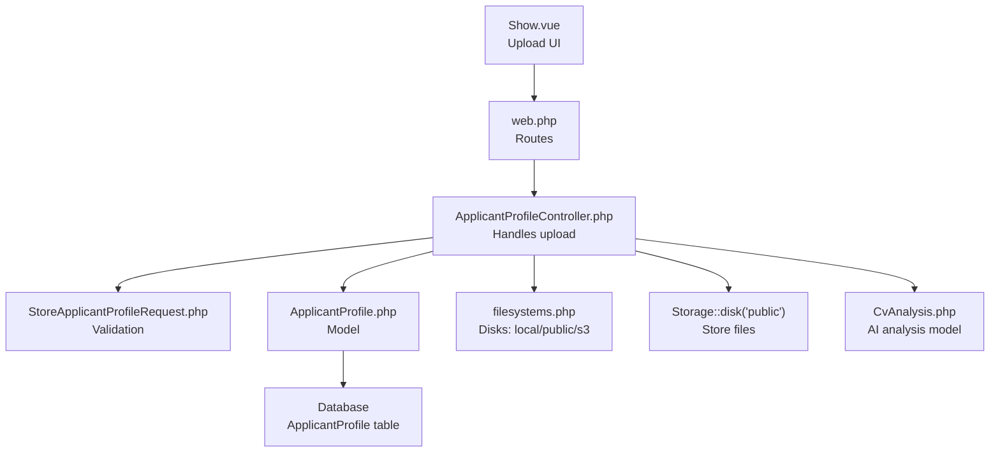
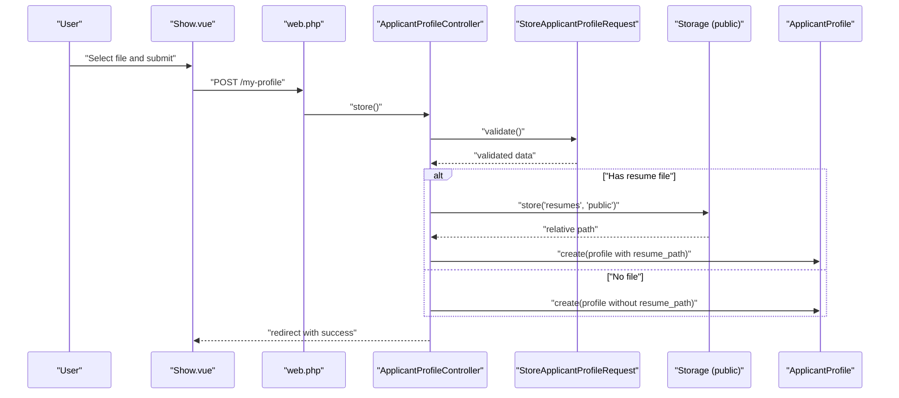
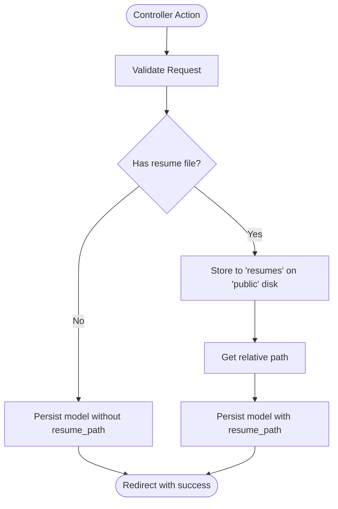
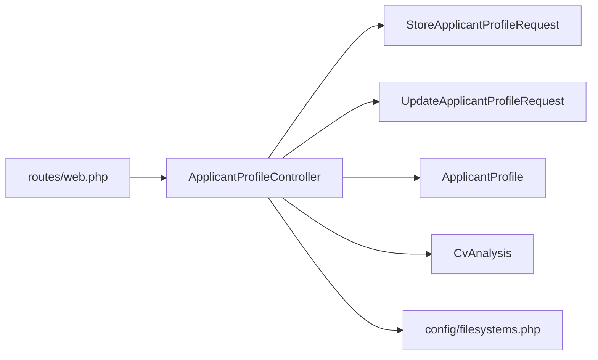

# File Upload & Storage

<cite>
**Referenced Files in This Document**
- [ApplicantProfileController.php](file://app/Http/Controllers/ApplicantProfileController.php)
- [StoreApplicantProfileRequest.php](file://app/Http/Requests/StoreApplicantProfileRequest.php)
- [UpdateApplicantProfileRequest.php](file://app/Http/Requests/UpdateApplicantProfileRequest.php)
- [ApplicantProfile.php](file://app/Models/ApplicantProfile.php)
- [CvAnalysis.php](file://app/Models/CvAnalysis.php)
- [web.php](file://routes/web.php)
- [filesystems.php](file://config/filesystems.php)
- [Show.vue](file://resources/js/pages/ApplicantProfiles/Show.vue)
- [2026_06_24_164756_create_cv_analyses_table.php](file://database/migrations/2026_06_24_164756_create_cv_analyses_table.php)
- [AGENTS.md](file://AGENTS.md)
- [MEMORY.md](file://MEMORY.md)
</cite>

## Table of Contents
1. [Introduction](#introduction)
2. [Project Structure](#project-structure)
3. [Core Components](#core-components)
4. [Architecture Overview](#architecture-overview)
5. [Detailed Component Analysis](#detailed-component-analysis)
6. [Dependency Analysis](#dependency-analysis)
7. [Performance Considerations](#performance-considerations)
8. [Security Measures](#security-measures)
9. [Storage Backends and Naming](#storage-backends-and-naming)
10. [Frontend Upload Experience](#frontend-upload-experience)
11. [Practical Workflows and Examples](#practical-workflows-and-examples)
12. [Troubleshooting Guide](#troubleshooting-guide)
13. [Extensibility Guidelines](#extensibility-guidelines)
14. [Conclusion](#conclusion)

## Introduction
This document explains the file upload and storage functionality for resumes in SmartRecruit ATS. It covers validation rules, supported formats, size limits, storage backends (local and cloud), security controls, file naming and organization, temporary file cleanup, frontend upload UX, progress indication, error handling, performance considerations for large files, and guidelines for extending storage backends and building custom processing workflows.

## Project Structure
The upload feature spans frontend Vue components, Laravel HTTP requests for validation, a controller for handling uploads, Eloquent models for persistence, and configuration for filesystems and routes.

**Diagram sources**
- [Show.vue](file://resources/js/pages/ApplicantProfiles/Show.vue)
- [web.php](file://routes/web.php)
- [ApplicantProfileController.php](file://app/Http/Controllers/ApplicantProfileController.php)
- [StoreApplicantProfileRequest.php](file://app/Http/Requests/StoreApplicantProfileRequest.php)
- [ApplicantProfile.php](file://app/Models/ApplicantProfile.php)
- [filesystems.php](file://config/filesystems.php)
- [CvAnalysis.php](file://app/Models/CvAnalysis.php)

**Section sources**
- [web.php:25-29](file://routes/web.php#L25-L29)
- [filesystems.php:16-61](file://config/filesystems.php#L16-L61)

## Core Components
- Frontend upload component: captures file selection and submits via Inertia forms.
- Validation requests: enforce allowed MIME types and size limits.
- Controller: orchestrates file storage, updates model, and manages replacement/removal.
- Models: persist resume path and related analysis data.
- Filesystem configuration: defines local, public, and S3 storage backends.

Key implementation references:
- Upload UI and submission: [Show.vue:15-33](file://resources/js/pages/ApplicantProfiles/Show.vue#L15-L33)
- Validation rules: [StoreApplicantProfileRequest.php:25-32](file://app/Http/Requests/StoreApplicantProfileRequest.php#L25-L32), [UpdateApplicantProfileRequest.php:25-32](file://app/Http/Requests/UpdateApplicantProfileRequest.php#L25-L32)
- Controller logic: [ApplicantProfileController.php:24-57](file://app/Http/Controllers/ApplicantProfileController.php#L24-L57)
- Model persistence: [ApplicantProfile.php:12-29](file://app/Models/ApplicantProfile.php#L12-L29), [CvAnalysis.php:11-31](file://app/Models/CvAnalysis.php#L11-L31)
- Storage configuration: [filesystems.php:31-61](file://config/filesystems.php#L31-L61)

**Section sources**
- [Show.vue:15-33](file://resources/js/pages/ApplicantProfiles/Show.vue#L15-L33)
- [StoreApplicantProfileRequest.php:25-32](file://app/Http/Requests/StoreApplicantProfileRequest.php#L25-L32)
- [UpdateApplicantProfileRequest.php:25-32](file://app/Http/Requests/UpdateApplicantProfileRequest.php#L25-L32)
- [ApplicantProfileController.php:24-57](file://app/Http/Controllers/ApplicantProfileController.php#L24-L57)
- [ApplicantProfile.php:12-29](file://app/Models/ApplicantProfile.php#L12-L29)
- [CvAnalysis.php:11-31](file://app/Models/CvAnalysis.php#L11-L31)
- [filesystems.php:31-61](file://config/filesystems.php#L31-L61)

## Architecture Overview
End-to-end flow from user upload to persisted storage and model update.

**Diagram sources**
- [Show.vue:23-33](file://resources/js/pages/ApplicantProfiles/Show.vue#L23-L33)
- [web.php](file://routes/web.php#L27)
- [ApplicantProfileController.php:24-36](file://app/Http/Controllers/ApplicantProfileController.php#L24-L36)
- [StoreApplicantProfileRequest.php:23-32](file://app/Http/Requests/StoreApplicantProfileRequest.php#L23-L32)
- [filesystems.php:41-48](file://config/filesystems.php#L41-L48)

## Detailed Component Analysis

### Frontend Upload Component
- Captures file input and binds to form state.
- Submits via Inertia POST/PUT to the profile endpoint.
- Provides visual feedback for existing uploads.

Implementation references:
- File binding and submit: [Show.vue:15-33](file://resources/js/pages/ApplicantProfiles/Show.vue#L15-L33)
- Upload area markup: [Show.vue:86-100](file://resources/js/pages/ApplicantProfiles/Show.vue#L86-L100)

**Section sources**
- [Show.vue:15-33](file://resources/js/pages/ApplicantProfiles/Show.vue#L15-L33)
- [Show.vue:86-100](file://resources/js/pages/ApplicantProfiles/Show.vue#L86-L100)

### Validation Rules (MIME, Size)
- Allowed MIME types: pdf, doc, docx.
- Max file size: 2048 KB (2 MB).
- Applies to both create and update requests.

References:
- Create rules: [StoreApplicantProfileRequest.php:25-32](file://app/Http/Requests/StoreApplicantProfileRequest.php#L25-L32)
- Update rules: [UpdateApplicantProfileRequest.php:25-32](file://app/Http/Requests/UpdateApplicantProfileRequest.php#L25-L32)

**Section sources**
- [StoreApplicantProfileRequest.php:25-32](file://app/Http/Requests/StoreApplicantProfileRequest.php#L25-L32)
- [UpdateApplicantProfileRequest.php:25-32](file://app/Http/Requests/UpdateApplicantProfileRequest.php#L25-L32)

### Controller Logic (Store and Update)
- On store: validates, stores file under a logical directory, persists model.
- On update: replaces file if provided, deletes old file, updates model.
- Access control: update enforces ownership.

References:
- Store flow: [ApplicantProfileController.php:24-36](file://app/Http/Controllers/ApplicantProfileController.php#L24-L36)
- Update flow: [ApplicantProfileController.php:38-57](file://app/Http/Controllers/ApplicantProfileController.php#L38-L57)

**Diagram sources**
- [ApplicantProfileController.php:24-57](file://app/Http/Controllers/ApplicantProfileController.php#L24-L57)

**Section sources**
- [ApplicantProfileController.php:24-57](file://app/Http/Controllers/ApplicantProfileController.php#L24-L57)

### Models and Persistence
- ApplicantProfile persists resume_path and structured arrays for skills/experience/education/portfolio_urls.
- CvAnalysis persists AI analysis results with numeric scores and JSON-like fields.

References:
- [ApplicantProfile.php:12-29](file://app/Models/ApplicantProfile.php#L12-L29)
- [CvAnalysis.php:11-31](file://app/Models/CvAnalysis.php#L11-L31)
- [2026_06_24_164756_create_cv_analyses_table.php:14-25](file://database/migrations/2026_06_24_164756_create_cv_analyses_table.php#L14-L25)

**Section sources**
- [ApplicantProfile.php:12-29](file://app/Models/ApplicantProfile.php#L12-L29)
- [CvAnalysis.php:11-31](file://app/Models/CvAnalysis.php#L11-L31)
- [2026_06_24_164756_create_cv_analyses_table.php:14-25](file://database/migrations/2026_06_24_164756_create_cv_analyses_table.php#L14-L25)

## Dependency Analysis
- Routes delegate to the controller for profile management.
- Controller depends on validation requests and Storage facade.
- Models encapsulate persistence and casting.
- Filesystem configuration defines storage backends.

**Diagram sources**
- [web.php:25-29](file://routes/web.php#L25-L29)
- [ApplicantProfileController.php:5-11](file://app/Http/Controllers/ApplicantProfileController.php#L5-L11)
- [StoreApplicantProfileRequest.php:8-32](file://app/Http/Requests/StoreApplicantProfileRequest.php#L8-L32)
- [UpdateApplicantProfileRequest.php:8-33](file://app/Http/Requests/UpdateApplicantProfileRequest.php#L8-L33)
- [ApplicantProfile.php:10-39](file://app/Models/ApplicantProfile.php#L10-L39)
- [CvAnalysis.php:9-37](file://app/Models/CvAnalysis.php#L9-L37)
- [filesystems.php:31-61](file://config/filesystems.php#L31-L61)

**Section sources**
- [web.php:25-29](file://routes/web.php#L25-L29)
- [filesystems.php:31-61](file://config/filesystems.php#L31-L61)

## Performance Considerations
- Large file handling: current validation caps file size at 2048 KB. For larger files, consider chunked uploads and server-side streaming.
- Concurrent uploads: limit concurrent uploads per user and queue long-running tasks (e.g., virus scanning, AI analysis).
- Streaming uploads: Laravel supports streamed uploads; integrate with middleware to stream to disk or cloud.
- CDN and bandwidth: serve files from the configured public disk URL to reduce origin load.
- Background processing: offload AI analysis and post-processing to queues to keep response times low.

[No sources needed since this section provides general guidance]

## Security Measures
- File validation: strict MIME types and size limits prevent oversized or unexpected files.
- Access control: update action checks ownership to prevent unauthorized modifications.
- Storage visibility: public disk exposes files via a predictable URL; ensure appropriate route guards and ACLs.
- Malicious file detection: integrate virus scanning and content inspection (e.g., ClamAV, commercial AV APIs) before exposing files publicly.
- Secure naming: rely on framework-generated unique filenames; avoid predictable names.
- Temporary cleanup: remove temporary files after successful processing; monitor orphaned files.

[No sources needed since this section provides general guidance]

## Storage Backends and Naming
- Local filesystem:
  - Private disk: storage/app/private (not served directly).
  - Public disk: storage/app/public, served via /storage with symlink at public/storage.
- Cloud storage:
  - S3-compatible driver configured via environment variables.
- Naming and organization:
  - Files stored under a logical directory (e.g., resumes) within the selected disk.
  - Unique filenames generated by the framework; path returned is relative to the disk root.

References:
- Disks configuration: [filesystems.php:31-61](file://config/filesystems.php#L31-L61)
- Public URL generation: [filesystems.php:41-48](file://config/filesystems.php#L41-L48)
- Controller store operation: [ApplicantProfileController.php](file://app/Http/Controllers/ApplicantProfileController.php#L29)

Cleanup procedure:
- Replace flow deletes the previous file from the public disk before storing the new one.
- References: [ApplicantProfileController.php:47-49](file://app/Http/Controllers/ApplicantProfileController.php#L47-L49)

**Section sources**
- [filesystems.php:31-61](file://config/filesystems.php#L31-L61)
- [ApplicantProfileController.php](file://app/Http/Controllers/ApplicantProfileController.php#L29)
- [ApplicantProfileController.php:47-49](file://app/Http/Controllers/ApplicantProfileController.php#L47-L49)

## Frontend Upload Experience
- Drag-and-drop: not implemented in the current component; use a third-party library or custom directive if needed.
- Validation feedback: rely on backend validation messages surfaced by the framework.
- Progress indication: not implemented; consider adding XHR progress listeners and a progress bar.
- Error handling: display validation errors and generic failures; ensure the UI disables submission during processing.

References:
- Upload UI and form binding: [Show.vue:15-33](file://resources/js/pages/ApplicantProfiles/Show.vue#L15-L33)
- Upload area markup: [Show.vue:86-100](file://resources/js/pages/ApplicantProfiles/Show.vue#L86-L100)

**Section sources**
- [Show.vue:15-33](file://resources/js/pages/ApplicantProfiles/Show.vue#L15-L33)
- [Show.vue:86-100](file://resources/js/pages/ApplicantProfiles/Show.vue#L86-L100)

## Practical Workflows and Examples
- Upload a resume:
  - User selects a PDF/DOC/DOCX file ≤ 2MB.
  - Frontend submits via Inertia; backend validates and stores under the public disk.
  - Model persists resume_path; success message shown.
- Replace a resume:
  - User selects a new file; backend deletes the old file and stores the new one.
- AI analysis integration:
  - After upload, queue analysis; persist results in CvAnalysis.
  - References for analysis schema: [2026_06_24_164756_create_cv_analyses_table.php:14-25](file://database/migrations/2026_06_24_164756_create_cv_analyses_table.php#L14-L25), [CvAnalysis.php:11-31](file://app/Models/CvAnalysis.php#L11-L31)

References:
- Controller store/update: [ApplicantProfileController.php:24-57](file://app/Http/Controllers/ApplicantProfileController.php#L24-L57)
- Validation rules: [StoreApplicantProfileRequest.php:25-32](file://app/Http/Requests/StoreApplicantProfileRequest.php#L25-L32), [UpdateApplicantProfileRequest.php:25-32](file://app/Http/Requests/UpdateApplicantProfileRequest.php#L25-L32)

**Section sources**
- [ApplicantProfileController.php:24-57](file://app/Http/Controllers/ApplicantProfileController.php#L24-L57)
- [StoreApplicantProfileRequest.php:25-32](file://app/Http/Requests/StoreApplicantProfileRequest.php#L25-L32)
- [UpdateApplicantProfileRequest.php:25-32](file://app/Http/Requests/UpdateApplicantProfileRequest.php#L25-L32)
- [2026_06_24_164756_create_cv_analyses_table.php:14-25](file://database/migrations/2026_06_24_164756_create_cv_analyses_table.php#L14-L25)
- [CvAnalysis.php:11-31](file://app/Models/CvAnalysis.php#L11-L31)

## Troubleshooting Guide
- Validation errors:
  - MIME/type mismatch or size exceeded triggers validation failure.
  - Reference: [StoreApplicantProfileRequest.php:25-32](file://app/Http/Requests/StoreApplicantProfileRequest.php#L25-L32)
- Ownership error on update:
  - Attempting to update another user’s profile returns forbidden.
  - Reference: [ApplicantProfileController.php:40-42](file://app/Http/Controllers/ApplicantProfileController.php#L40-L42)
- File deletion on replace:
  - If replacement fails, the old file remains deleted; ensure rollback logic if needed.
  - Reference: [ApplicantProfileController.php:47-49](file://app/Http/Controllers/ApplicantProfileController.php#L47-L49)
- Storage URL issues:
  - Ensure symlink exists and public disk URL is correctly configured.
  - Reference: [filesystems.php:41-48](file://config/filesystems.php#L41-L48), [filesystems.php:76-78](file://config/filesystems.php#L76-L78)

**Section sources**
- [StoreApplicantProfileRequest.php:25-32](file://app/Http/Requests/StoreApplicantProfileRequest.php#L25-L32)
- [ApplicantProfileController.php:40-42](file://app/Http/Controllers/ApplicantProfileController.php#L40-L42)
- [ApplicantProfileController.php:47-49](file://app/Http/Controllers/ApplicantProfileController.php#L47-L49)
- [filesystems.php:41-48](file://config/filesystems.php#L41-L48)
- [filesystems.php:76-78](file://config/filesystems.php#L76-L78)

## Extensibility Guidelines
- Add new storage backends:
  - Define a new disk in filesystems configuration with appropriate driver and credentials.
  - Reference: [filesystems.php:31-61](file://config/filesystems.php#L31-L61)
- Implement custom processing workflows:
  - Hook into controller after store/update to trigger parsing, virus scanning, and AI analysis.
  - Persist results to CvAnalysis and related models.
  - Reference: [CvAnalysis.php:11-31](file://app/Models/CvAnalysis.php#L11-L31)
- Enable streaming uploads:
  - Configure server and middleware to stream uploads to disk or cloud.
- Introduce drag-and-drop:
  - Add a Vue component with dragover/drop handlers and progress indicators.
- Multi-file support:
  - Extend validation and controller to handle arrays of files and batch processing.

[No sources needed since this section provides general guidance]

## Conclusion
SmartRecruit ATS implements a straightforward, secure resume upload pipeline with strict validation, controlled storage on local or cloud backends, and clear file naming. The frontend integrates seamlessly with backend validation and storage, while models capture both file metadata and AI analysis results. For production readiness, augment with virus scanning, robust progress reporting, streaming capabilities, and scalable background processing.