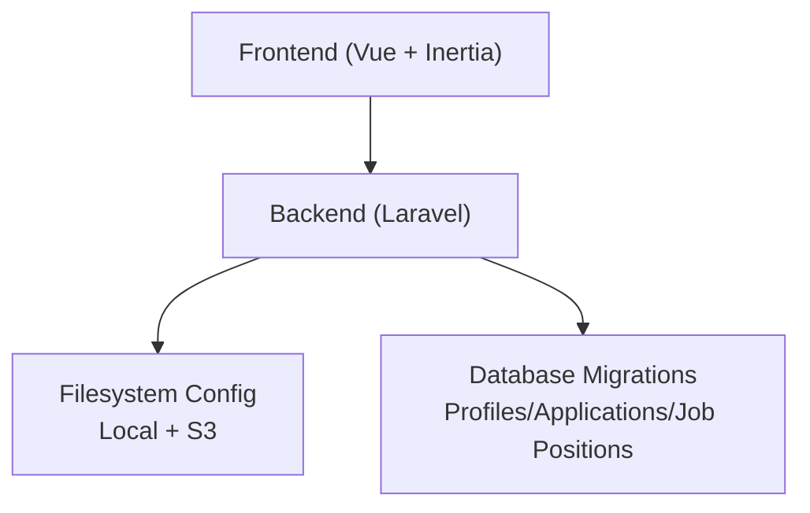
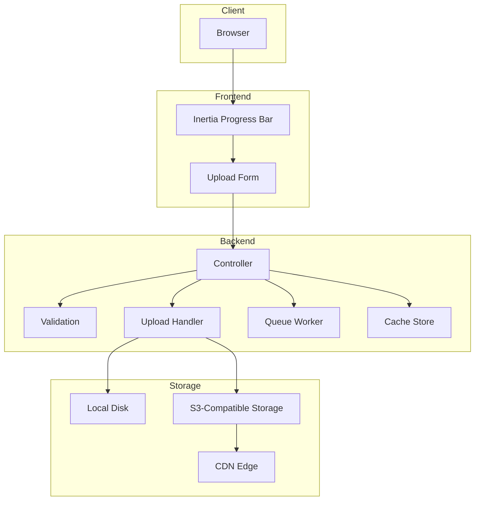
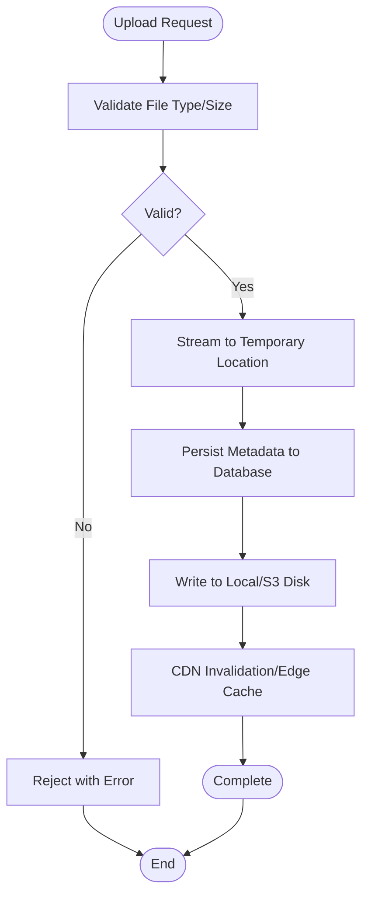
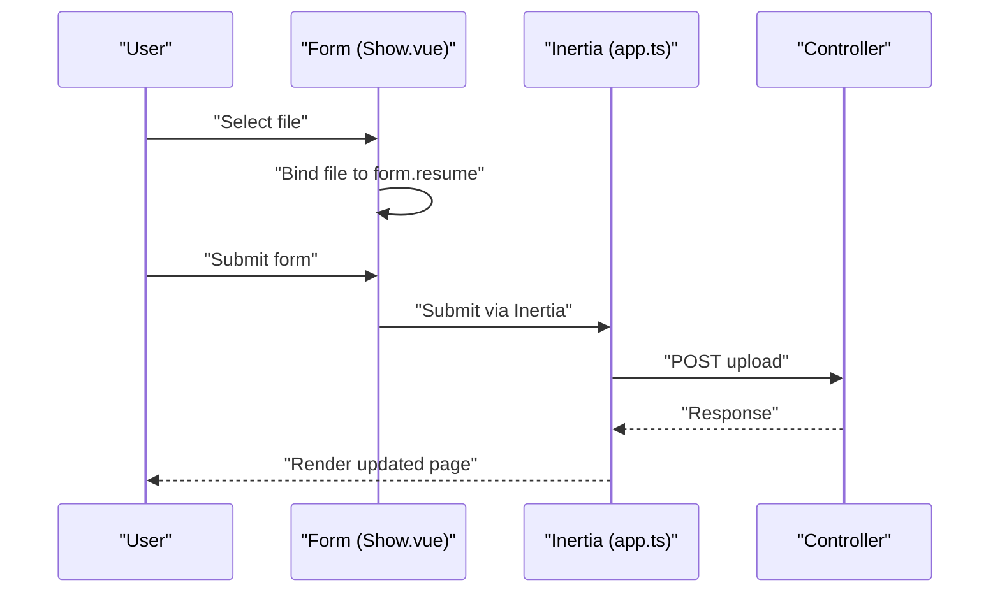
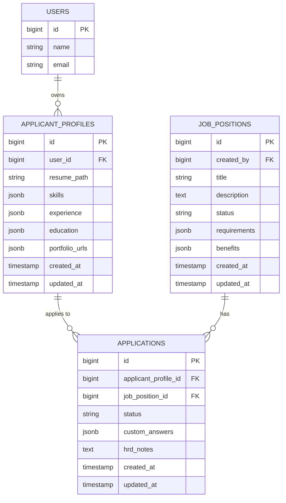
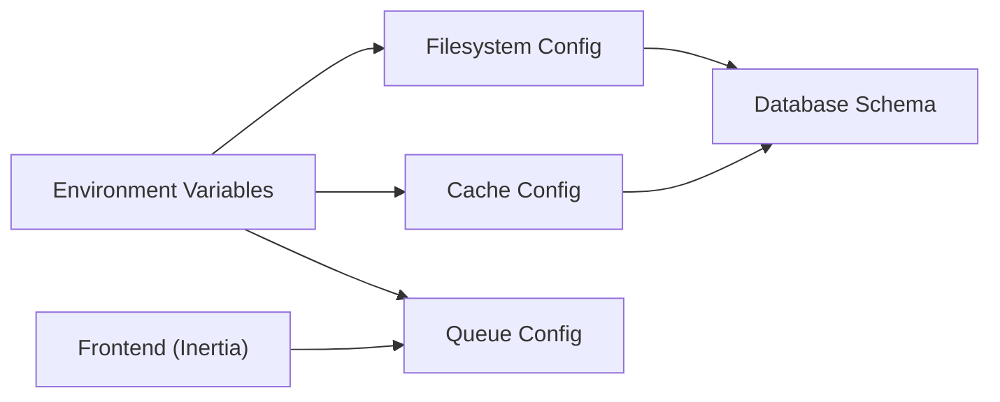

# Performance & Scaling

<cite>
**Referenced Files in This Document**
- [filesystems.php](file://config/filesystems.php)
- [cache.php](file://config/cache.php)
- [queue.php](file://config/queue.php)
- [app.ts](file://resources/js/app.ts)
- [Show.vue](file://resources/js/pages/ApplicantProfiles/Show.vue)
- [2026_06_24_164755_create_applicant_profiles_table.php](file://database/migrations/2026_06_24_164755_create_applicant_profiles_table.php)
- [2026_06_24_164755_create_applications_table.php](file://database/migrations/2026_06_24_164755_create_applications_table.php)
- [2026_06_24_164755_create_job_positions_table.php](file://database/migrations/2026_06_24_164755_create_job_positions_table.php)
- [caching.md](file://.agents/skills/laravel-best-practices/rules/caching.md)
- [db-performance.md](file://.agents/skills/laravel-best-practices/rules/db-performance.md)
- [advanced-queries.md](file://.agents/skills/laravel-best-practices/rules/advanced-queries.md)
</cite>

## Table of Contents
1. [Introduction](#introduction)
2. [Project Structure](#project-structure)
3. [Core Components](#core-components)
4. [Architecture Overview](#architecture-overview)
5. [Detailed Component Analysis](#detailed-component-analysis)
6. [Dependency Analysis](#dependency-analysis)
7. [Performance Considerations](#performance-considerations)
8. [Troubleshooting Guide](#troubleshooting-guide)
9. [Conclusion](#conclusion)
10. [Appendices](#appendices)

## Introduction
This document focuses on optimizing file upload performance and enabling scalable handling of large files. It covers backend and frontend strategies for memory-efficient uploads, streaming, concurrency, caching, CDN integration, load balancing, and database optimization for file metadata. It also provides guidance on monitoring, bottleneck identification, and backup/recovery procedures.

## Project Structure
The repository organizes file handling across configuration, frontend integration, and database schema:
- Storage configuration defines local and S3-backed disks for private and public assets.
- Frontend integrates Inertia with progress indicators for uploads.
- Database migrations define the schema for profiles, applications, and job positions, including JSONB fields suitable for resume metadata.

**Diagram sources**
- [filesystems.php:1-81](file://config/filesystems.php#L1-L81)
- [app.ts:1-34](file://resources/js/app.ts#L1-L34)
- [2026_06_24_164755_create_applicant_profiles_table.php:1-34](file://database/migrations/2026_06_24_164755_create_applicant_profiles_table.php#L1-L34)
- [2026_06_24_164755_create_applications_table.php:1-33](file://database/migrations/2026_06_24_164755_create_applications_table.php#L1-L33)
- [2026_06_24_164755_create_job_positions_table.php:1-34](file://database/migrations/2026_06_24_164755_create_job_positions_table.php#L1-L34)

**Section sources**
- [filesystems.php:1-81](file://config/filesystems.php#L1-L81)
- [app.ts:1-34](file://resources/js/app.ts#L1-L34)
- [2026_06_24_164755_create_applicant_profiles_table.php:1-34](file://database/migrations/2026_06_24_164755_create_applicant_profiles_table.php#L1-L34)
- [2026_06_24_164755_create_applications_table.php:1-33](file://database/migrations/2026_06_24_164755_create_applications_table.php#L1-L33)
- [2026_06_24_164755_create_job_positions_table.php:1-34](file://database/migrations/2026_06_24_164755_create_job_positions_table.php#L1-L34)

## Core Components
- Filesystem configuration supports local and S3 disks, enabling scalable storage and CDN-ready URLs.
- Cache configuration supports failover stores and multiple backends for resilience.
- Queue configuration supports database and Redis backends for asynchronous processing.
- Frontend progress indicator is configured for upload feedback.
- Database schema includes JSONB fields for flexible metadata and foreign keys linking profiles to applications and jobs.

Key implementation references:
- Filesystem disks and S3 endpoint configuration
- Cache stores and failover configuration
- Queue connections and retry policies
- Inertia progress bar configuration
- JSONB fields for resume metadata and arrays

**Section sources**
- [filesystems.php:16-61](file://config/filesystems.php#L16-L61)
- [cache.php:18-106](file://config/cache.php#L18-L106)
- [queue.php:16-90](file://config/queue.php#L16-L90)
- [app.ts:24-26](file://resources/js/app.ts#L24-L26)
- [2026_06_24_164755_create_applicant_profiles_table.php:14-23](file://database/migrations/2026_06_24_164755_create_applicant_profiles_table.php#L14-L23)

## Architecture Overview
The upload pipeline leverages a frontend-to-backend-to-storage architecture with optional CDN offloading and background processing.

**Diagram sources**
- [filesystems.php:31-61](file://config/filesystems.php#L31-L61)
- [queue.php:32-90](file://config/queue.php#L32-L90)
- [cache.php:35-106](file://config/cache.php#L35-L106)
- [app.ts:24-26](file://resources/js/app.ts#L24-L26)

## Detailed Component Analysis

### Backend Upload Handler (Conceptual)
This handler coordinates validation, streaming, and persistence while managing memory and concurrency.

[No sources needed since this diagram shows conceptual workflow, not actual code structure]

### Frontend Upload Experience (Current Implementation)
The frontend currently uses a basic file input bound to reactive form data. The Inertia progress bar is configured globally.

**Diagram sources**
- [Show.vue:86-116](file://resources/js/pages/ApplicantProfiles/Show.vue#L86-L116)
- [app.ts:24-26](file://resources/js/app.ts#L24-L26)

**Section sources**
- [Show.vue:86-116](file://resources/js/pages/ApplicantProfiles/Show.vue#L86-L116)
- [app.ts:24-26](file://resources/js/app.ts#L24-L26)

### Database Schema for File Metadata
The schema captures resume paths and JSONB metadata for skills, experience, education, and portfolio URLs. Foreign keys connect profiles to applications and jobs.

**Diagram sources**
- [2026_06_24_164755_create_applicant_profiles_table.php:14-23](file://database/migrations/2026_06_24_164755_create_applicant_profiles_table.php#L14-L23)
- [2026_06_24_164755_create_applications_table.php:14-22](file://database/migrations/2026_06_24_164755_create_applications_table.php#L14-L22)
- [2026_06_24_164755_create_job_positions_table.php:14-22](file://database/migrations/2026_06_24_164755_create_job_positions_table.php#L14-L22)

**Section sources**
- [2026_06_24_164755_create_applicant_profiles_table.php:14-23](file://database/migrations/2026_06_24_164755_create_applicant_profiles_table.php#L14-L23)
- [2026_06_24_164755_create_applications_table.php:14-22](file://database/migrations/2026_06_24_164755_create_applications_table.php#L14-L22)
- [2026_06_24_164755_create_job_positions_table.php:14-22](file://database/migrations/2026_06_24_164755_create_job_positions_table.php#L14-L22)

## Dependency Analysis
- Filesystem configuration depends on environment variables for S3 credentials and endpoints.
- Cache and queue configurations enable failover and horizontal scaling.
- Frontend progress relies on Inertia’s global configuration.
- Database schema depends on PostgreSQL-compatible JSONB fields and foreign keys.

**Diagram sources**
- [filesystems.php:50-61](file://config/filesystems.php#L50-L61)
- [cache.php:18-106](file://config/cache.php#L18-L106)
- [queue.php:16-90](file://config/queue.php#L16-L90)
- [app.ts:24-26](file://resources/js/app.ts#L24-L26)

**Section sources**
- [filesystems.php:50-61](file://config/filesystems.php#L50-L61)
- [cache.php:18-106](file://config/cache.php#L18-L106)
- [queue.php:16-90](file://config/queue.php#L16-L90)
- [app.ts:24-26](file://resources/js/app.ts#L24-L26)

## Performance Considerations

### Memory Management During Large File Uploads
- Stream uploads to temporary storage and persist metadata immediately to reduce peak memory usage.
- Avoid loading entire files into memory; process in chunks and write incrementally.
- Use local disk for staging and offload to S3 asynchronously.

### Streaming Upload Techniques
- Implement chunked uploads with resume capability to improve reliability over unstable networks.
- Track upload progress and handle partial failures gracefully.

### Concurrent Upload Handling
- Scale queue workers horizontally to process uploads concurrently.
- Use Redis-backed queues for low-latency coordination and horizontal scaling.

### Caching Strategies for Frequently Accessed Files
- Cache metadata and derived artifacts (e.g., processed thumbnails) in Redis or database cache.
- Use failover cache stores to maintain availability during primary store outages.

### CDN Integration for Static Assets
- Configure S3-compatible storage with CDN endpoints for global distribution.
- Invalidate CDN edges after updates to ensure freshness.

### Load Balancing for High-Volume Scenarios
- Distribute traffic across multiple backend instances behind a load balancer.
- Use sticky sessions only when necessary; otherwise rely on shared storage and cache.

### Frontend Performance Optimizations
- Use chunked uploads with adjustable chunk sizes based on bandwidth.
- Implement progress tracking and bandwidth adaptation to optimize throughput.
- Debounce or throttle UI updates during upload to minimize re-renders.

### Database Optimization for File Metadata
- Index JSONB fields used in filtering and sorting; consider GIN indexes for high-cardinality data.
- Normalize frequently queried subsets into separate columns if query patterns warrant it.
- Use pagination and eager loading to avoid N+1 queries when listing profiles or applications.

### Backup and Recovery Procedures
- Back up S3 buckets and local storage snapshots regularly.
- Maintain database backups with point-in-time recovery enabled.
- Test restore procedures periodically to validate integrity.

**Section sources**
- [filesystems.php:31-61](file://config/filesystems.php#L31-L61)
- [cache.php:100-106](file://config/cache.php#L100-L106)
- [queue.php:32-90](file://config/queue.php#L32-L90)
- [caching.md:64-70](file://.agents/skills/laravel-best-practices/rules/caching.md#L64-L70)
- [db-performance.md:94-150](file://.agents/skills/laravel-best-practices/rules/db-performance.md#L94-L150)
- [advanced-queries.md:81-91](file://.agents/skills/laravel-best-practices/rules/advanced-queries.md#L81-L91)

## Troubleshooting Guide
- Symptom: Uploads fail under load
  - Action: Increase queue worker concurrency and enable Redis-backed queues; monitor retry_after settings.
  - Reference: [queue.php:38-74](file://config/queue.php#L38-L74)
- Symptom: Slow metadata retrieval
  - Action: Add composite indexes on frequently filtered/sorted columns; leverage withCount() and eager loading.
  - References: [db-performance.md:94-150](file://.agents/skills/laravel-best-practices/rules/db-performance.md#L94-L150), [advanced-queries.md:81-91](file://.agents/skills/laravel-best-practices/rules/advanced-queries.md#L81-L91)
- Symptom: CDN serving stale assets
  - Action: Invalidate CDN cache entries after file updates; verify S3 endpoint configuration.
  - References: [filesystems.php:50-61](file://config/filesystems.php#L50-L61)
- Symptom: Cache unavailability
  - Action: Enable failover cache stores and monitor health checks.
  - Reference: [cache.php:100-106](file://config/cache.php#L100-L106)

**Section sources**
- [queue.php:38-74](file://config/queue.php#L38-L74)
- [db-performance.md:94-150](file://.agents/skills/laravel-best-practices/rules/db-performance.md#L94-L150)
- [advanced-queries.md:81-91](file://.agents/skills/laravel-best-practices/rules/advanced-queries.md#L81-L91)
- [filesystems.php:50-61](file://config/filesystems.php#L50-L61)
- [cache.php:100-106](file://config/cache.php#L100-L106)

## Conclusion
Optimizing file uploads requires a coordinated approach across frontend chunking and progress tracking, backend streaming and queue-driven processing, resilient caching and CDN integration, and database indexing tailored to metadata access patterns. The provided configuration and schema offer a strong foundation; extending with chunked uploads, CDN invalidation, and robust monitoring will deliver scalable performance.

## Appendices

### Monitoring and Bottleneck Identification
- Monitor queue backlog and worker utilization to detect saturation.
- Track upload latency and failure rates to identify network or storage bottlenecks.
- Observe cache hit ratios and fallback triggers to assess cache health.
- Measure CDN hit ratios and cache miss latencies to tune edge caching.

### Scaling Architecture Patterns
- Horizontal scaling: Add backend instances behind a load balancer; ensure shared storage and cache.
- Asynchronous processing: Offload heavy tasks to queue workers; scale workers independently.
- Multi-tier caching: Use in-memory cache for hot data and database cache for warm data with failover.