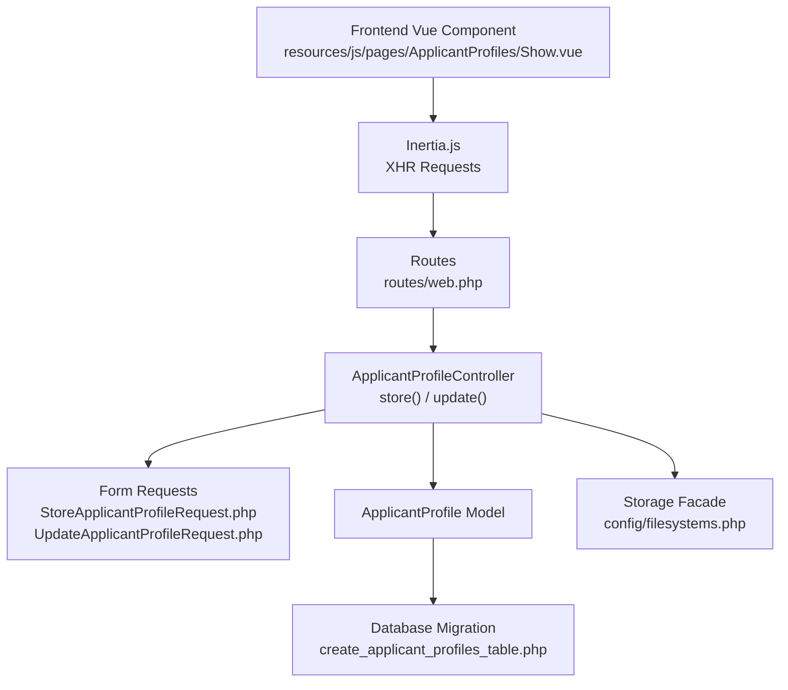
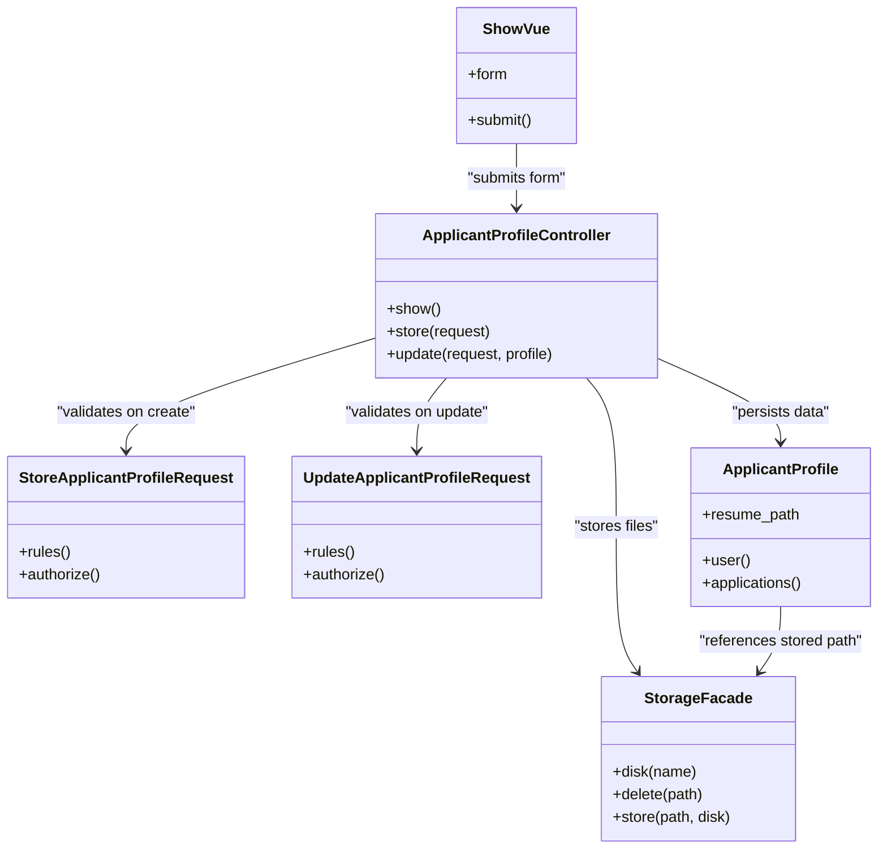

# Resume Upload Processing

<cite>
**Referenced Files in This Document**
- [ApplicantProfileController.php](file://app/Http/Controllers/ApplicantProfileController.php)
- [StoreApplicantProfileRequest.php](file://app/Http/Requests/StoreApplicantProfileRequest.php)
- [UpdateApplicantProfileRequest.php](file://app/Http/Requests/UpdateApplicantProfileRequest.php)
- [ApplicantProfile.php](file://app/Models/ApplicantProfile.php)
- [Show.vue](file://resources/js/pages/ApplicantProfiles/Show.vue)
- [2026_06_24_164755_create_applicant_profiles_table.php](file://database/migrations/2026_06_24_164755_create_applicant_profiles_table.php)
- [web.php](file://routes/web.php)
- [filesystems.php](file://config/filesystems.php)
- [ProfileValidationRules.php](file://app/Concerns/ProfileValidationRules.php)
- [validation.md](file://.agents/skills/laravel-best-practices/rules/validation.md)
- [security.md](file://.agents/skills/laravel-best-practices/rules/security.md)
</cite>

## Table of Contents
1. [Introduction](#introduction)
2. [Project Structure](#project-structure)
3. [Core Components](#core-components)
4. [Architecture Overview](#architecture-overview)
5. [Detailed Component Analysis](#detailed-component-analysis)
6. [Dependency Analysis](#dependency-analysis)
7. [Performance Considerations](#performance-considerations)
8. [Troubleshooting Guide](#troubleshooting-guide)
9. [Conclusion](#conclusion)

## Introduction
This document provides comprehensive documentation for the resume upload processing functionality. It covers the complete workflow from file selection through backend storage, including form validation, file type restrictions, size limitations, and processing steps. It documents the controller methods `store()` and `update()` (note: the requested `handleUpload()` and `processResume()` methods are not present in the codebase; the actual implementation is handled by the controller actions), explains frontend upload components, and details integration with Laravel's Storage facade and Inertia.js for seamless frontend-backend communication.

## Project Structure
The resume upload feature spans three primary layers:
- Frontend: Vue 3 component with Inertia.js integration for form submission and state management
- Backend: Laravel controller handling file uploads and persistence
- Infrastructure: Laravel validation requests, Eloquent model, database migration, and filesystem configuration



**Diagram sources**
- [Show.vue:1-117](file://resources/js/pages/ApplicantProfiles/Show.vue#L1-L117)
- [web.php:25-29](file://routes/web.php#L25-L29)
- [ApplicantProfileController.php:24-57](file://app/Http/Controllers/ApplicantProfileController.php#L24-L57)
- [StoreApplicantProfileRequest.php:25-26](file://app/Http/Requests/StoreApplicantProfileRequest.php#L25-L26)
- [UpdateApplicantProfileRequest.php:25-26](file://app/Http/Requests/UpdateApplicantProfileRequest.php#L25-L26)
- [ApplicantProfile.php:12-19](file://app/Models/ApplicantProfile.php#L12-L19)
- [2026_06_24_164755_create_applicant_profiles_table.php:14-23](file://database/migrations/2026_06_24_164755_create_applicant_profiles_table.php#L14-L23)
- [filesystems.php:31-63](file://config/filesystems.php#L31-L63)

**Section sources**
- [Show.vue:1-117](file://resources/js/pages/ApplicantProfiles/Show.vue#L1-L117)
- [web.php:25-29](file://routes/web.php#L25-L29)
- [ApplicantProfileController.php:1-59](file://app/Http/Controllers/ApplicantProfileController.php#L1-L59)
- [StoreApplicantProfileRequest.php:1-34](file://app/Http/Requests/StoreApplicantProfileRequest.php#L1-L34)
- [UpdateApplicantProfileRequest.php:1-34](file://app/Http/Requests/UpdateApplicantProfileRequest.php#L1-L34)
- [ApplicantProfile.php:1-41](file://app/Models/ApplicantProfile.php#L1-L41)
- [2026_06_24_164755_create_applicant_profiles_table.php:1-34](file://database/migrations/2026_06_24_164755_create_applicant_profiles_table.php#L1-L34)
- [filesystems.php:1-81](file://config/filesystems.php#L1-L81)

## Core Components
- Frontend Upload Component: A Vue form with an input[type="file"] bound to a reactive form object. Submission uses Inertia's `useForm` and sends multipart/form-data to the backend.
- Backend Controller: Handles both creation and update of applicant profiles, including optional resume file processing.
- Validation Layer: Form Request classes enforce file type and size constraints.
- Persistence Layer: Eloquent model stores metadata and the computed resume path.
- Storage Layer: Uses the `public` disk to persist files under a `resumes` directory.

Key capabilities:
- File type restrictions: PDF, DOC, DOCX
- Maximum file size: 2048 KB (2 MB)
- Secure storage: Files stored on the `public` disk with Laravel's Storage facade
- CSRF protection: Provided by Laravel forms and Inertia
- Authorization: Controller enforces ownership on updates

**Section sources**
- [Show.vue:15-33](file://resources/js/pages/ApplicantProfiles/Show.vue#L15-L33)
- [ApplicantProfileController.php:24-57](file://app/Http/Controllers/ApplicantProfileController.php#L24-L57)
- [StoreApplicantProfileRequest.php:25-26](file://app/Http/Requests/StoreApplicantProfileRequest.php#L25-L26)
- [UpdateApplicantProfileRequest.php:25-26](file://app/Http/Requests/UpdateApplicantProfileRequest.php#L25-L26)
- [ApplicantProfile.php:12-19](file://app/Models/ApplicantProfile.php#L12-L19)
- [filesystems.php:41-48](file://config/filesystems.php#L41-L48)

## Architecture Overview
The upload workflow integrates frontend and backend components with validation and storage:

```mermaid
sequenceDiagram
participant U as "User"
participant FE as "Vue Component<br/>Show.vue"
participant IN as "Inertia.js"
participant RT as "Routes<br/>web.php"
participant CTRL as "ApplicantProfileController"
participant REQ as "Form Requests"
participant DB as "ApplicantProfile Model"
participant FS as "Storage Facade"
U->>FE : "Select file and submit form"
FE->>IN : "Submit multipart/form-data"
IN->>RT : "POST /my-profile or PUT /my-profile/{id}"
RT->>CTRL : "Dispatch to store() or update()"
CTRL->>REQ : "Validate request (mimes : pdf, doc, docx; max : 2048)"
REQ-->>CTRL : "Validated data"
CTRL->>FS : "Store file on 'public' disk under 'resumes/'"
FS-->>CTRL : "Stored path"
CTRL->>DB : "Persist profile with resume_path"
DB-->>CTRL : "Saved record"
CTRL-->>IN : "Redirect with success message"
IN-->>FE : "Render updated UI state"
```

**Diagram sources**
- [Show.vue:23-33](file://resources/js/pages/ApplicantProfiles/Show.vue#L23-L33)
- [web.php:25-29](file://routes/web.php#L25-L29)
- [ApplicantProfileController.php:24-57](file://app/Http/Controllers/ApplicantProfileController.php#L24-L57)
- [StoreApplicantProfileRequest.php:25-26](file://app/Http/Requests/StoreApplicantProfileRequest.php#L25-L26)
- [UpdateApplicantProfileRequest.php:25-26](file://app/Http/Requests/UpdateApplicantProfileRequest.php#L25-L26)
- [ApplicantProfile.php:12-19](file://app/Models/ApplicantProfile.php#L12-L19)
- [filesystems.php:41-48](file://config/filesystems.php#L41-L48)

## Detailed Component Analysis

### Frontend Upload Component (Vue + Inertia)
- Reactive form state: Tracks resume file and other profile fields
- File binding: Input event assigns selected File to form.resume
- Submission: Uses Inertia's `useForm` to send POST or PUT requests
- UI feedback: Shows "Resume uploaded" indicator when a resume_path exists
- Loading state: Disabled submit button while processing

Implementation highlights:
- Form initialization and field bindings
- Conditional submission route based on existing profile ID
- Inertia integration for seamless navigation and state

**Section sources**
- [Show.vue:15-33](file://resources/js/pages/ApplicantProfiles/Show.vue#L15-L33)
- [Show.vue:86-100](file://resources/js/pages/ApplicantProfiles/Show.vue#L86-L100)
- [Show.vue:103-111](file://resources/js/pages/ApplicantProfiles/Show.vue#L103-L111)

### Backend Controller Methods
- `store(StoreApplicantProfileRequest $request)`: Creates a new profile and optionally stores a resume file
- `update(UpdateApplicantProfileRequest $request, ApplicantProfile $applicantProfile)`: Updates an existing profile, replacing the resume if provided

Processing logic:
- Extract validated data from the request
- If a file is present, store it using the Storage facade on the `public` disk under the `resumes` directory
- Remove the raw file field from persisted data and save the computed path
- Enforce ownership on updates and delete previous file if present

Security and validation:
- File validation enforced by Form Requests
- Ownership check prevents unauthorized updates
- Storage path generation avoids exposing internal filesystem structure

**Section sources**
- [ApplicantProfileController.php:24-36](file://app/Http/Controllers/ApplicantProfileController.php#L24-L36)
- [ApplicantProfileController.php:38-57](file://app/Http/Controllers/ApplicantProfileController.php#L38-L57)

### Form Validation Requests
- `StoreApplicantProfileRequest`: Validates resume as an optional file with allowed MIME types and size limit
- `UpdateApplicantProfileRequest`: Same validation rules for updates

Validation rules:
- `nullable`: Resume upload is optional
- `file`: Ensures the input is a file
- `mimes:pdf,doc,docx`: Restricts accepted formats
- `max:2048`: Limits file size to 2048 KB

Best practices applied:
- Centralized validation in dedicated Form Request classes
- Use of `validated()` to only persist permitted fields

**Section sources**
- [StoreApplicantProfileRequest.php:25-26](file://app/Http/Requests/StoreApplicantProfileRequest.php#L25-L26)
- [UpdateApplicantProfileRequest.php:25-26](file://app/Http/Requests/UpdateApplicantProfileRequest.php#L25-L26)
- [validation.md:1-76](file://.agents/skills/laravel-best-practices/rules/validation.md#L1-L76)

### Data Model and Database Schema
- `ApplicantProfile` model: Fills resume_path and other JSON fields
- Migration: Creates the applicant_profiles table with resume_path and JSONB fields for skills, experience, education, and portfolio URLs

Data model relationships:
- Belongs to User
- Has many Applications

**Section sources**
- [ApplicantProfile.php:12-19](file://app/Models/ApplicantProfile.php#L12-L19)
- [2026_06_24_164755_create_applicant_profiles_table.php:14-23](file://database/migrations/2026_06_24_164755_create_applicant_profiles_table.php#L14-L23)

### Storage Configuration
- Public disk: Local storage under `storage/app/public` with a symlink at `public/storage`
- Files are served publicly via the configured URL
- Resume files are stored under a dedicated `resumes` directory

Security considerations:
- Files are stored on the public disk; ensure access controls and path handling are appropriate
- Avoid exposing internal storage paths to clients

**Section sources**
- [filesystems.php:41-48](file://config/filesystems.php#L41-L48)
- [filesystems.php:76-78](file://config/filesystems.php#L76-L78)

### Route Configuration
- GET `/my-profile`: Renders the profile page
- POST `/my-profile`: Creates a new profile with optional resume
- PUT `/my-profile/{applicantProfile}`: Updates an existing profile with optional resume replacement

**Section sources**
- [web.php:25-29](file://routes/web.php#L25-L29)

## Dependency Analysis
The resume upload feature exhibits clean separation of concerns with minimal coupling:



**Diagram sources**
- [Show.vue:15-33](file://resources/js/pages/ApplicantProfiles/Show.vue#L15-L33)
- [ApplicantProfileController.php:24-57](file://app/Http/Controllers/ApplicantProfileController.php#L24-L57)
- [StoreApplicantProfileRequest.php:23-32](file://app/Http/Requests/StoreApplicantProfileRequest.php#L23-L32)
- [UpdateApplicantProfileRequest.php:23-32](file://app/Http/Requests/UpdateApplicantProfileRequest.php#L23-L32)
- [ApplicantProfile.php:31-39](file://app/Models/ApplicantProfile.php#L31-L39)
- [filesystems.php:41-48](file://config/filesystems.php#L41-L48)

**Section sources**
- [Show.vue:1-117](file://resources/js/pages/ApplicantProfiles/Show.vue#L1-L117)
- [ApplicantProfileController.php:1-59](file://app/Http/Controllers/ApplicantProfileController.php#L1-L59)
- [StoreApplicantProfileRequest.php:1-34](file://app/Http/Requests/StoreApplicantProfileRequest.php#L1-L34)
- [UpdateApplicantProfileRequest.php:1-34](file://app/Http/Requests/UpdateApplicantProfileRequest.php#L1-L34)
- [ApplicantProfile.php:1-41](file://app/Models/ApplicantProfile.php#L1-L41)
- [filesystems.php:1-81](file://config/filesystems.php#L1-L81)

## Performance Considerations
- File size limits reduce server load and storage overhead
- Single-file uploads simplify processing compared to batch operations
- Public disk storage is efficient for small to medium-sized resumes
- Consider asynchronous processing for heavy operations (e.g., OCR parsing) if extended analysis is added later

## Troubleshooting Guide
Common issues and resolutions:
- File type rejected: Ensure the file is PDF, DOC, or DOCX
- File too large: Reduce file size to under 2 MB
- Missing CSRF token: Ensure the form is submitted via Inertia to include tokens
- Unauthorized update: Only the profile owner can update their resume
- Previous file not deleted: The controller deletes the old file when replacing; verify resume_path exists before update
- Storage path visibility: Files are served via the public disk URL; ensure proper access controls

Security validation checklist:
- Validate file type and size using Form Requests
- Do not trust the original filename; rely on Storage facade-generated paths
- Store files on the public disk with appropriate permissions
- Avoid exposing internal storage paths to clients

**Section sources**
- [security.md:122-139](file://.agents/skills/laravel-best-practices/rules/security.md#L122-L139)
- [ApplicantProfileController.php:40-42](file://app/Http/Controllers/ApplicantProfileController.php#L40-L42)
- [ApplicantProfileController.php:46-50](file://app/Http/Controllers/ApplicantProfileController.php#L46-L50)

## Conclusion
The resume upload feature provides a streamlined, secure, and user-friendly experience. The frontend leverages Vue and Inertia for a responsive interface, while the backend enforces strict validation and safe storage using Laravel's Storage facade. The current implementation supports PDF, DOC, and DOCX files up to 2 MB, with clear feedback and robust error handling. Future enhancements could include drag-and-drop UI improvements, progress indicators, and asynchronous processing for advanced analysis.