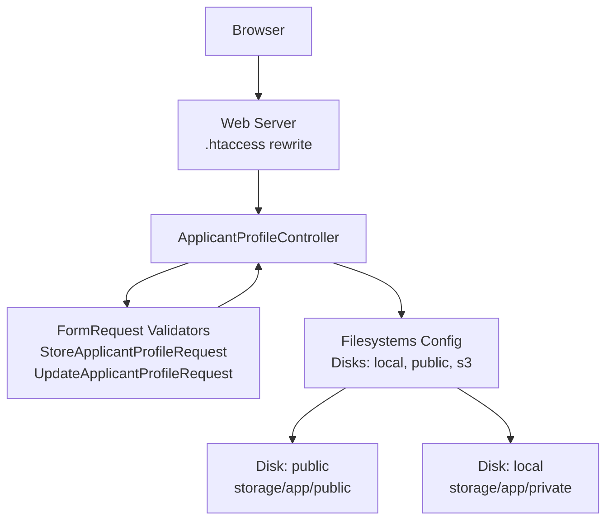
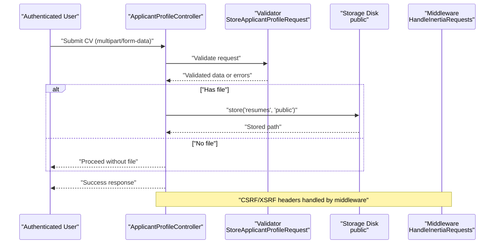
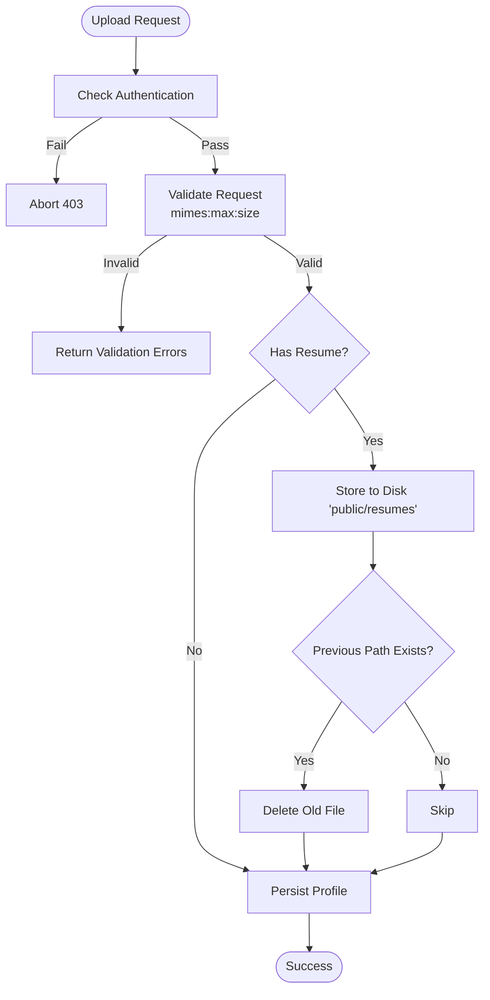
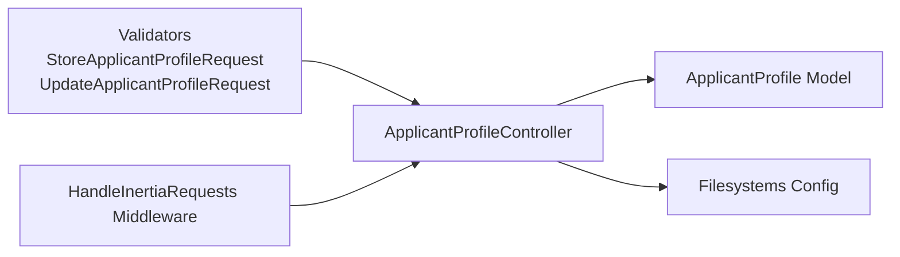

# Security & File Validation

<cite>
**Referenced Files in This Document**
- [ApplicantProfileController.php](file://app/Http/Controllers/ApplicantProfileController.php)
- [StoreApplicantProfileRequest.php](file://app/Http/Requests/StoreApplicantProfileRequest.php)
- [UpdateApplicantProfileRequest.php](file://app/Http/Requests/UpdateApplicantProfileRequest.php)
- [ApplicantProfile.php](file://app/Models/ApplicantProfile.php)
- [filesystems.php](file://config/filesystems.php)
- [.htaccess](file://public/.htaccess)
- [security.md](file://.agents/skills/laravel-best-practices/rules/security.md)
- [AGENTS.md](file://AGENTS.md)
- [HandleInertiaRequests.php](file://app/Http/Middleware/HandleInertiaRequests.php)
- [HandleAppearance.php](file://app/Http/Middleware/HandleAppearance.php)
- [SecurityController.php](file://app/Http/Controllers/Settings/SecurityController.php)
- [PasswordValidationRules.php](file://app/Concerns/PasswordValidationRules.php)
- [ProfileValidationRules.php](file://app/Concerns/ProfileValidationRules.php)
</cite>

## Table of Contents
1. [Introduction](#introduction)
2. [Project Structure](#project-structure)
3. [Core Components](#core-components)
4. [Architecture Overview](#architecture-overview)
5. [Detailed Component Analysis](#detailed-component-analysis)
6. [Dependency Analysis](#dependency-analysis)
7. [Performance Considerations](#performance-considerations)
8. [Troubleshooting Guide](#troubleshooting-guide)
9. [Conclusion](#conclusion)
10. [Appendices](#appendices)

## Introduction
This document provides comprehensive security documentation for file upload validation and protection mechanisms within the application. It focuses on the CV upload workflow for applicant profiles, detailing validation rules (file type, size), malicious content safeguards, access control, file naming strategies, path sanitization, and integration points for broader security controls. It also outlines threat mitigation strategies, quarantine procedures, audit logging, and compliance considerations.

## Project Structure
The file upload flow centers around:
- Request validation classes that enforce allowed file types and sizes
- A controller that orchestrates upload, storage, and updates
- A model representing persisted profile data including the stored file path
- Configuration for local filesystem disks and public URLs
- Web server configuration to protect runtime environments

**Diagram sources**
- [.htaccess:1-26](file://public/.htaccess#L1-L26)
- [ApplicantProfileController.php:24-57](file://app/Http/Controllers/ApplicantProfileController.php#L24-L57)
- [StoreApplicantProfileRequest.php:23-32](file://app/Http/Requests/StoreApplicantProfileRequest.php#L23-L32)
- [UpdateApplicantProfileRequest.php:23-32](file://app/Http/Requests/UpdateApplicantProfileRequest.php#L23-L32)
- [filesystems.php:31-63](file://config/filesystems.php#L31-L63)

**Section sources**
- [ApplicantProfileController.php:1-59](file://app/Http/Controllers/ApplicantProfileController.php#L1-L59)
- [StoreApplicantProfileRequest.php:1-34](file://app/Http/Requests/StoreApplicantProfileRequest.php#L1-L34)
- [UpdateApplicantProfileRequest.php:1-34](file://app/Http/Requests/UpdateApplicantProfileRequest.php#L1-L34)
- [ApplicantProfile.php:1-41](file://app/Models/ApplicantProfile.php#L1-L41)
- [filesystems.php:1-81](file://config/filesystems.php#L1-L81)
- [.htaccess:1-26](file://public/.htaccess#L1-L26)

## Core Components
- File upload request validators:
  - Enforce file presence/absence, type, and size limits
  - Restrict accepted file extensions for CV uploads
- Controller logic:
  - Validates requests, stores files securely, manages updates and deletions
  - Ensures only authenticated users can modify their own profile
- Storage configuration:
  - Public disk for downloadable assets and private disk for restricted content
- Middleware and shared data:
  - Provides CSRF/XSRF awareness and shared application state
- Security policies:
  - Internal guidelines emphasize safe file handling and access control

Key security-relevant validations and storage behaviors are implemented in the validator classes and controller actions.

**Section sources**
- [StoreApplicantProfileRequest.php:23-32](file://app/Http/Requests/StoreApplicantProfileRequest.php#L23-L32)
- [UpdateApplicantProfileRequest.php:23-32](file://app/Http/Requests/UpdateApplicantProfileRequest.php#L23-L32)
- [ApplicantProfileController.php:24-57](file://app/Http/Controllers/ApplicantProfileController.php#L24-L57)
- [filesystems.php:31-63](file://config/filesystems.php#L31-L63)
- [HandleInertiaRequests.php:36-46](file://app/Http/Middleware/HandleInertiaRequests.php#L36-L46)
- [HandleAppearance.php:17-22](file://app/Http/Middleware/HandleAppearance.php#L17-L22)
- [AGENTS.md:854-866](file://AGENTS.md#L854-L866)

## Architecture Overview
The CV upload pipeline integrates validation, storage, and access control:

**Diagram sources**
- [ApplicantProfileController.php:24-36](file://app/Http/Controllers/ApplicantProfileController.php#L24-L36)
- [StoreApplicantProfileRequest.php:13-16](file://app/Http/Requests/StoreApplicantProfileRequest.php#L13-L16)
- [filesystems.php:41-48](file://config/filesystems.php#L41-L48)
- [HandleInertiaRequests.php:36-46](file://app/Http/Middleware/HandleInertiaRequests.php#L36-L46)

## Detailed Component Analysis

### File Upload Validation Rules
- Allowed file types: PDF, DOC, DOCX
- Maximum file size: 2048 KB
- Optional field: resume is nullable
- Content-type verification: The mimes rule validates extensions; for strict MIME type checks, use mimetypes in addition to mimes

These rules are defined in the request validator classes and enforced during form submission.

**Section sources**
- [StoreApplicantProfileRequest.php:23-32](file://app/Http/Requests/StoreApplicantProfileRequest.php#L23-L32)
- [UpdateApplicantProfileRequest.php:23-32](file://app/Http/Requests/UpdateApplicantProfileRequest.php#L23-L32)
- [security.md:122-133](file://.agents/skills/laravel-best-practices/rules/security.md#L122-L133)

### Controller Workflow and Access Control
- Authentication: Requests require an authenticated user
- Ownership enforcement: Updates restrict editing to the profile owner
- Storage: Files are stored under a dedicated folder on the public disk
- Deletion: Previous files are removed before updating

**Diagram sources**
- [ApplicantProfileController.php:24-57](file://app/Http/Controllers/ApplicantProfileController.php#L24-L57)
- [StoreApplicantProfileRequest.php:13-16](file://app/Http/Requests/StoreApplicantProfileRequest.php#L13-L16)
- [filesystems.php:41-48](file://config/filesystems.php#L41-L48)

**Section sources**
- [ApplicantProfileController.php:24-57](file://app/Http/Controllers/ApplicantProfileController.php#L24-L57)

### Storage Configuration and Path Management
- Public disk:
  - Root: storage/app/public
  - URL: derived from APP_URL and /storage
  - Suitable for downloadable assets
- Local disk:
  - Root: storage/app/private
  - Intended for sensitive files not served directly to clients
- S3 disk:
  - Cloud storage integration available

Files are stored under a logical path (e.g., resumes) within the public disk to separate uploads from other content.

**Section sources**
- [filesystems.php:31-63](file://config/filesystems.php#L31-L63)

### Malicious Content Detection and XSS Mitigation
- File type and size validation reduce risk from oversized or unexpected binaries
- Strict extension filtering (PDF, DOC, DOCX) minimizes executable or scriptable content
- Avoid trusting original filenames; rely on generated paths returned by the storage layer
- Serve files from the public disk with controlled visibility and URL generation
- CSRF/XSRF protections are handled by middleware and Inertia shared state

Additional mitigations recommended by internal guidelines:
- Do not execute uploaded files
- Do not expose private file paths publicly
- Use secure storage access

**Section sources**
- [StoreApplicantProfileRequest.php:23-32](file://app/Http/Requests/StoreApplicantProfileRequest.php#L23-L32)
- [filesystems.php:33-39](file://config/filesystems.php#L33-L39)
- [HandleInertiaRequests.php:36-46](file://app/Http/Middleware/HandleInertiaRequests.php#L36-L46)
- [AGENTS.md:854-866](file://AGENTS.md#L854-L866)

### File Naming Strategies and Path Sanitization
- Use the storage layer’s built-in naming to avoid predictable or conflicting filenames
- Store files under a dedicated directory (e.g., resumes) to simplify management and access control
- Persist only the relative path within the configured disk; do not persist absolute filesystem paths

**Section sources**
- [ApplicantProfileController.php:29-31](file://app/Http/Controllers/ApplicantProfileController.php#L29-L31)
- [ApplicantProfileController.php:50-52](file://app/Http/Controllers/ApplicantProfileController.php#L50-L52)
- [ApplicantProfile.php:12-19](file://app/Models/ApplicantProfile.php#L12-L19)

### Access Control Mechanisms
- Authentication gating ensures only logged-in users can submit or update profiles
- Ownership check prevents users from modifying others’ profiles
- Public disk visibility is appropriate for downloadable CVs; sensitive files should use the private disk

**Section sources**
- [StoreApplicantProfileRequest.php:13-16](file://app/Http/Requests/StoreApplicantProfileRequest.php#L13-L16)
- [ApplicantProfileController.php:40-42](file://app/Http/Controllers/ApplicantProfileController.php#L40-L42)

### Security Headers and Web Server Controls
- The web server configuration handles Authorization and XSRF tokens and routes all non-file requests to the front controller
- These behaviors support CSRF/XSRF protection and prevent direct access to backend scripts

**Section sources**
- [.htaccess:8-14](file://public/.htaccess#L8-L14)
- [.htaccess:21-24](file://public/.htaccess#L21-L24)

### Integration with Antivirus Scanning and Signature Verification
- Current implementation enforces file type and size but does not integrate antivirus scanning or digital signature verification
- Recommended enhancements:
  - Integrate an external antivirus service or library to scan uploaded files post-store
  - Implement signature verification for executables or scripts if applicable
  - Quarantine flagged files and notify administrators

[No sources needed since this section provides general guidance]

### Compliance with Data Protection Regulations
- Limit data retention to what is necessary for the application’s purpose
- Ensure secure deletion of previous files when updating CVs
- Use the private disk for sensitive data and avoid exposing internal paths
- Maintain audit logs for file operations (see Audit Logging section)

[No sources needed since this section provides general guidance]

## Dependency Analysis
The CV upload flow depends on:
- Request validators for input constraints
- Controller for orchestration and access checks
- Storage configuration for disk selection and URL generation
- Middleware for CSRF/XSRF header handling

**Diagram sources**
- [StoreApplicantProfileRequest.php:1-34](file://app/Http/Requests/StoreApplicantProfileRequest.php#L1-L34)
- [UpdateApplicantProfileRequest.php:1-34](file://app/Http/Requests/UpdateApplicantProfileRequest.php#L1-L34)
- [ApplicantProfileController.php:1-59](file://app/Http/Controllers/ApplicantProfileController.php#L1-L59)
- [ApplicantProfile.php:1-41](file://app/Models/ApplicantProfile.php#L1-L41)
- [filesystems.php:1-81](file://config/filesystems.php#L1-L81)
- [HandleInertiaRequests.php:1-48](file://app/Http/Middleware/HandleInertiaRequests.php#L1-L48)

**Section sources**
- [ApplicantProfileController.php:1-59](file://app/Http/Controllers/ApplicantProfileController.php#L1-L59)
- [filesystems.php:1-81](file://config/filesystems.php#L1-L81)

## Performance Considerations
- Prefer streaming uploads for large files to reduce memory usage
- Offload virus scanning to asynchronous jobs to avoid blocking requests
- Use CDN or cloud storage for serving CVs to improve latency and scalability

[No sources needed since this section provides general guidance]

## Troubleshooting Guide
Common issues and resolutions:
- Validation errors on upload:
  - Ensure the file matches allowed extensions and size limits
  - Confirm the request uses multipart/form-data encoding
- Unauthorized access errors:
  - Verify the user is authenticated and authorized to edit the profile
- File not found after update:
  - Confirm the old file was deleted before storing the new one
- Incorrect download URLs:
  - Check the public disk URL configuration and storage symlink

**Section sources**
- [StoreApplicantProfileRequest.php:23-32](file://app/Http/Requests/StoreApplicantProfileRequest.php#L23-L32)
- [UpdateApplicantProfileRequest.php:23-32](file://app/Http/Requests/UpdateApplicantProfileRequest.php#L23-L32)
- [ApplicantProfileController.php:40-57](file://app/Http/Controllers/ApplicantProfileController.php#L40-L57)
- [filesystems.php:41-48](file://config/filesystems.php#L41-L48)

## Conclusion
The application implements robust, layered security for CV uploads:
- Strong request validation for file type and size
- Controlled storage on a public disk with explicit paths
- Access control ensuring authenticated ownership
- Web server and middleware configurations supporting CSRF/XSRF protection

To further strengthen security, consider integrating antivirus scanning, implementing signature verification, adopting quarantine procedures for suspicious files, and maintaining audit logs for all file operations.

[No sources needed since this section summarizes without analyzing specific files]

## Appendices

### Validation Rules Reference
- resume: nullable file with allowed extensions PDF, DOC, DOCX and max size 2048 KB

**Section sources**
- [StoreApplicantProfileRequest.php:23-32](file://app/Http/Requests/StoreApplicantProfileRequest.php#L23-L32)
- [UpdateApplicantProfileRequest.php:23-32](file://app/Http/Requests/UpdateApplicantProfileRequest.php#L23-L32)

### Security Headers and Recommendations
- CSRF/XSRF headers are handled by middleware and web server configuration
- Additional recommendations:
  - Add Content-Security-Policy headers to mitigate XSS risks
  - Set X-Content-Type-Options and X-Frame-Options headers
  - Use HSTS for secure transport

**Section sources**
- [.htaccess:8-14](file://public/.htaccess#L8-L14)
- [HandleInertiaRequests.php:36-46](file://app/Http/Middleware/HandleInertiaRequests.php#L36-L46)

### Threat Mitigation Strategies
- Quarantine policy:
  - Move flagged files to a quarantine area and notify administrators
- Audit logging:
  - Log file uploads, downloads, updates, and deletions with timestamps and user identifiers
- Retention:
  - Automatically purge old CVs after a defined period unless required for compliance

[No sources needed since this section provides general guidance]

### Compliance Considerations
- Data minimization: only collect necessary profile data
- Right to erasure: provide mechanisms to delete CVs and associated metadata
- Data portability: enable users to export their data upon request

[No sources needed since this section provides general guidance]