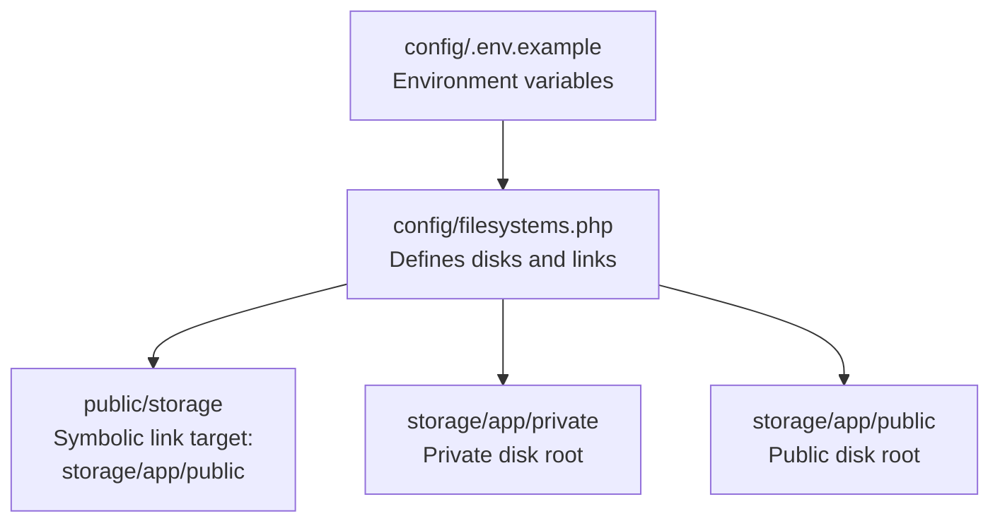
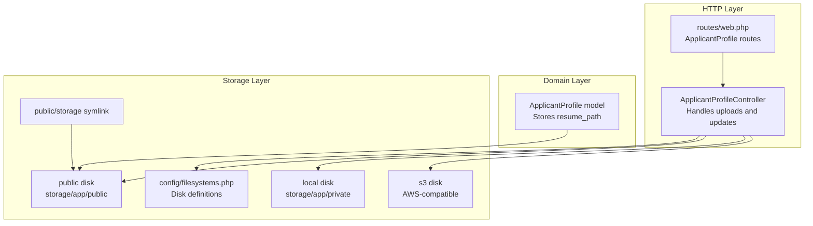
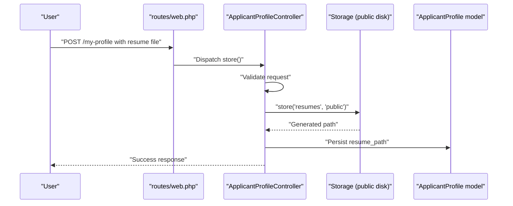
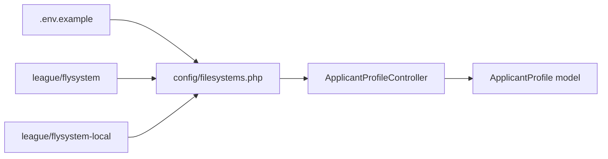

# Storage Configuration & Backends

<cite>
**Referenced Files in This Document**
- [config/filesystems.php](file://config/filesystems.php)
- [.env.example](file://.env.example)
- [routes/web.php](file://routes/web.php)
- [app/Http/Controllers/ApplicantProfileController.php](file://app/Http/Controllers/ApplicantProfileController.php)
- [app/Models/ApplicantProfile.php](file://app/Models/ApplicantProfile.php)
- [storage/app/public/.gitignore](file://storage/app/public/.gitignore)
- [storage/app/private/.gitignore](file://storage/app/private/.gitignore)
- [composer.lock](file://composer.lock)
</cite>

## Table of Contents
1. [Introduction](#introduction)
2. [Project Structure](#project-structure)
3. [Core Components](#core-components)
4. [Architecture Overview](#architecture-overview)
5. [Detailed Component Analysis](#detailed-component-analysis)
6. [Dependency Analysis](#dependency-analysis)
7. [Performance Considerations](#performance-considerations)
8. [Troubleshooting Guide](#troubleshooting-guide)
9. [Conclusion](#conclusion)
10. [Appendices](#appendices)

## Introduction
This document explains storage configuration and backend management in SmartRecruit ATS. It covers filesystem configuration, local and public disk setup, cloud storage integration (S3-compatible), directory organization under storage/app/public/resumes/, access permissions, switching backends via environment configuration, performance tuning, quotas and cleanup, and best practices for secure file access and URL generation using Laravel’s Storage facade.

## Project Structure
SmartRecruit ATS uses Laravel’s filesystem configuration to define storage disks and symbolic links. The key configuration resides in config/filesystems.php, while environment variables in .env.example control runtime behavior. Public assets are served via a symbolic link from public/storage to storage/app/public.

**Diagram sources**
- [config/filesystems.php:16](file://config/filesystems.php#L16)
- [config/filesystems.php:31](file://config/filesystems.php#L31)
- [config/filesystems.php:76](file://config/filesystems.php#L76)
- [.env.example:37](file://.env.example#L37)

**Section sources**
- [config/filesystems.php:16](file://config/filesystems.php#L16)
- [config/filesystems.php:31](file://config/filesystems.php#L31)
- [config/filesystems.php:76](file://config/filesystems.php#L76)
- [.env.example:37](file://.env.example#L37)

## Core Components
- Default disk selection: Controlled by FILESYSTEM_DISK environment variable.
- Disks:
  - local: Private storage under storage/app/private.
  - public: Public storage under storage/app/public with a base URL derived from APP_URL.
  - s3: S3-compatible cloud storage using AWS_* environment variables.
- Symbolic link: public/storage -> storage/app/public enables web-accessible URLs for public files.

Key implementation references:
- Disk definitions and defaults: [config/filesystems.php:16](file://config/filesystems.php#L16), [config/filesystems.php:31](file://config/filesystems.php#L31)
- Public URL composition: [config/filesystems.php:44](file://config/filesystems.php#L44)
- Symbolic link configuration: [config/filesystems.php:76](file://config/filesystems.php#L76)
- Environment-driven defaults: [config/filesystems.php:16](file://config/filesystems.php#L16), [.env.example:37](file://.env.example#L37)

**Section sources**
- [config/filesystems.php:16](file://config/filesystems.php#L16)
- [config/filesystems.php:31](file://config/filesystems.php#L31)
- [config/filesystems.php:44](file://config/filesystems.php#L44)
- [config/filesystems.php:76](file://config/filesystems.php#L76)
- [.env.example:37](file://.env.example#L37)

## Architecture Overview
The storage subsystem integrates configuration, controller actions, and model attributes to manage resumes and related documents. Controllers use the Storage facade to persist files to the configured public disk, while models store metadata such as resume_path.

**Diagram sources**
- [routes/web.php:25](file://routes/web.php#L25)
- [routes/web.php:28](file://routes/web.php#L28)
- [app/Http/Controllers/ApplicantProfileController.php:9](file://app/Http/Controllers/ApplicantProfileController.php#L9)
- [app/Http/Controllers/ApplicantProfileController.php:29](file://app/Http/Controllers/ApplicantProfileController.php#L29)
- [app/Http/Controllers/ApplicantProfileController.php:50](file://app/Http/Controllers/ApplicantProfileController.php#L50)
- [config/filesystems.php:31](file://config/filesystems.php#L31)
- [config/filesystems.php:41](file://config/filesystems.php#L41)
- [config/filesystems.php:50](file://config/filesystems.php#L50)
- [config/filesystems.php:76](file://config/filesystems.php#L76)

## Detailed Component Analysis

### Local Storage Setup
- Private disk (local):
  - Root: storage/app/private
  - Visibility: private (not web-accessible)
  - Purpose: secure internal files
- Public disk (local):
  - Root: storage/app/public
  - Base URL: derived from APP_URL plus "/storage"
  - Visibility: public (web-accessible)
  - Purpose: files exposed via public/storage symlink

Implementation references:
- Private disk definition: [config/filesystems.php:33](file://config/filesystems.php#L33)
- Public disk definition: [config/filesystems.php:41](file://config/filesystems.php#L41)
- Public URL composition: [config/filesystems.php:44](file://config/filesystems.php#L44)

**Section sources**
- [config/filesystems.php:33](file://config/filesystems.php#L33)
- [config/filesystems.php:41](file://config/filesystems.php#L41)
- [config/filesystems.php:44](file://config/filesystems.php#L44)

### Public Disk Configuration and Access Permissions
- Symbolic link creation:
  - Command: php artisan storage:link
  - Effect: Creates public/storage pointing to storage/app/public
- Directory permissions:
  - storage/app/public/.gitignore excludes all files except .gitignore, ensuring only intended files are tracked
  - Access is governed by the web server and the public disk URL

Implementation references:
- Symbolic link configuration: [config/filesystems.php:76](file://config/filesystems.php#L76)
- Public directory ignore pattern: [storage/app/public/.gitignore:1](file://storage/app/public/.gitignore#L1)

**Section sources**
- [config/filesystems.php:76](file://config/filesystems.php#L76)
- [storage/app/public/.gitignore:1](file://storage/app/public/.gitignore#L1)

### Cloud Storage Integration (S3-Compatible)
- Disk: s3
- Required environment variables:
  - AWS_ACCESS_KEY_ID, AWS_SECRET_ACCESS_KEY, AWS_DEFAULT_REGION, AWS_BUCKET
  - Optional: AWS_URL, AWS_ENDPOINT, AWS_USE_PATH_STYLE_ENDPOINT
- Default disk selection:
  - FILESYSTEM_DISK controls which disk is used by default

Implementation references:
- S3 disk definition: [config/filesystems.php:50](file://config/filesystems.php#L50)
- Environment variables: [.env.example:59](file://.env.example#L59), [.env.example:63](file://.env.example#L63)
- Default disk selection: [config/filesystems.php:16](file://config/filesystems.php#L16), [.env.example:37](file://.env.example#L37)

**Section sources**
- [config/filesystems.php:50](file://config/filesystems.php#L50)
- [.env.example:59](file://.env.example#L59)
- [.env.example:63](file://.env.example#L63)
- [config/filesystems.php:16](file://config/filesystems.php#L16)
- [.env.example:37](file://.env.example#L37)

### Directory Structure Under storage/app/public/resumes/
- Organization:
  - Files are stored under storage/app/public/resumes/<path>, where <path> is generated by the Storage facade
- Access:
  - Public URL: APP_URL/storage/resumes/<path>
  - Controlled by public disk configuration and APP_URL

Implementation references:
- Controller storing files under resumes/: [app/Http/Controllers/ApplicantProfileController.php:29](file://app/Http/Controllers/ApplicantProfileController.php#L29), [app/Http/Controllers/ApplicantProfileController.php:50](file://app/Http/Controllers/ApplicantProfileController.php#L50)
- Public disk URL: [config/filesystems.php:44](file://config/filesystems.php#L44)

**Section sources**
- [app/Http/Controllers/ApplicantProfileController.php:29](file://app/Http/Controllers/ApplicantProfileController.php#L29)
- [app/Http/Controllers/ApplicantProfileController.php:50](file://app/Http/Controllers/ApplicantProfileController.php#L50)
- [config/filesystems.php:44](file://config/filesystems.php#L44)

### Switching Between Storage Backends
- Method:
  - Set FILESYSTEM_DISK in the environment to "local", "public", or "s3"
- Behavior:
  - The framework selects the corresponding disk configuration automatically

Implementation references:
- Default disk selection: [config/filesystems.php:16](file://config/filesystems.php#L16), [.env.example:37](file://.env.example#L37)
- Disk definitions: [config/filesystems.php:31](file://config/filesystems.php#L31)

**Section sources**
- [config/filesystems.php:16](file://config/filesystems.php#L16)
- [.env.example:37](file://.env.example#L37)
- [config/filesystems.php:31](file://config/filesystems.php#L31)

### Environment-Specific Configurations
- Local development:
  - FILESYSTEM_DISK=local
  - APP_URL=http://localhost
- Production with S3:
  - FILESYSTEM_DISK=s3
  - AWS_* variables set appropriately
  - Optional: AWS_URL for custom CDN/domain

Implementation references:
- Default disk: [.env.example:37](file://.env.example#L37)
- S3 variables: [.env.example:59](file://.env.example#L59), [.env.example:63](file://.env.example#L63)
- Public URL derivation: [config/filesystems.php:44](file://config/filesystems.php#L44)

**Section sources**
- [.env.example:37](file://.env.example#L37)
- [.env.example:59](file://.env.example#L59)
- [.env.example:63](file://.env.example#L63)
- [config/filesystems.php:44](file://config/filesystems.php#L44)

### Using Laravel’s Storage Facade and Secure Access
- Controller usage:
  - Store files to the "public" disk under the "resumes" directory
  - Delete previous files when updating
- Model integration:
  - resume_path persisted to track uploaded files
- URL generation:
  - Public URLs are constructed from APP_URL and the public disk base URL

Implementation references:
- Storing files: [app/Http/Controllers/ApplicantProfileController.php:29](file://app/Http/Controllers/ApplicantProfileController.php#L29), [app/Http/Controllers/ApplicantProfileController.php:50](file://app/Http/Controllers/ApplicantProfileController.php#L50)
- Deleting old files: [app/Http/Controllers/ApplicantProfileController.php:48](file://app/Http/Controllers/ApplicantProfileController.php#L48)
- Persisting resume_path: [app/Models/ApplicantProfile.php:14](file://app/Models/ApplicantProfile.php#L14)
- Public disk URL: [config/filesystems.php:44](file://config/filesystems.php#L44)

**Section sources**
- [app/Http/Controllers/ApplicantProfileController.php:29](file://app/Http/Controllers/ApplicantProfileController.php#L29)
- [app/Http/Controllers/ApplicantProfileController.php:48](file://app/Http/Controllers/ApplicantProfileController.php#L48)
- [app/Http/Controllers/ApplicantProfileController.php:50](file://app/Http/Controllers/ApplicantProfileController.php#L50)
- [app/Models/ApplicantProfile.php:14](file://app/Models/ApplicantProfile.php#L14)
- [config/filesystems.php:44](file://config/filesystems.php#L44)

### Sequence: Resume Upload Flow

**Diagram sources**
- [routes/web.php:27](file://routes/web.php#L27)
- [app/Http/Controllers/ApplicantProfileController.php:24](file://app/Http/Controllers/ApplicantProfileController.php#L24)
- [app/Http/Controllers/ApplicantProfileController.php:29](file://app/Http/Controllers/ApplicantProfileController.php#L29)
- [app/Models/ApplicantProfile.php:14](file://app/Models/ApplicantProfile.php#L14)

## Dependency Analysis
- Composer dependencies:
  - league/flysystem and league/flysystem-local provide the filesystem abstraction and local adapter
- Configuration dependencies:
  - FILESYSTEM_DISK determines which disk is selected
  - APP_URL influences public disk URL construction
  - AWS_* variables enable S3 disk configuration

**Diagram sources**
- [config/filesystems.php:16](file://config/filesystems.php#L16)
- [config/filesystems.php:31](file://config/filesystems.php#L31)
- [composer.lock:2149](file://composer.lock#L2149)
- [composer.lock:2218](file://composer.lock#L2218)
- [app/Http/Controllers/ApplicantProfileController.php:9](file://app/Http/Controllers/ApplicantProfileController.php#L9)
- [app/Models/ApplicantProfile.php:14](file://app/Models/ApplicantProfile.php#L14)

**Section sources**
- [composer.lock:2149](file://composer.lock#L2149)
- [composer.lock:2218](file://composer.lock#L2218)
- [config/filesystems.php:16](file://config/filesystems.php#L16)
- [config/filesystems.php:31](file://config/filesystems.php#L31)

## Performance Considerations
- Disk selection:
  - Prefer local disk for small-scale deployments; use S3 for scalability and offloading static assets
- URL generation:
  - Configure AWS_URL to point to a CDN for reduced latency
- Path-style endpoints:
  - Enable AWS_USE_PATH_STYLE_ENDPOINT for compatibility with self-hosted S3-compatible services
- File serving:
  - Keep public disk minimal and organized under subdirectories (e.g., resumes/) to simplify cleanup and access control

[No sources needed since this section provides general guidance]

## Troubleshooting Guide
- Public files not accessible:
  - Ensure public/storage symlink exists and points to storage/app/public
  - Verify APP_URL and public disk URL configuration
- Permission denied errors:
  - Confirm web server has read access to storage/app/public
  - Review storage/app/public/.gitignore to ensure intended files are present
- S3 connectivity issues:
  - Validate AWS_* environment variables
  - Check endpoint and region settings; toggle AWS_USE_PATH_STYLE_ENDPOINT if needed
- Cleanup and quotas:
  - Remove stale resumes by scanning storage/app/public/resumes/ and deleting outdated files
  - Implement retention policies and periodic pruning jobs

**Section sources**
- [config/filesystems.php:76](file://config/filesystems.php#L76)
- [config/filesystems.php:44](file://config/filesystems.php#L44)
- [storage/app/public/.gitignore:1](file://storage/app/public/.gitignore#L1)
- [.env.example:59](file://.env.example#L59)
- [.env.example:63](file://.env.example#L63)

## Conclusion
SmartRecruit ATS leverages Laravel’s flexible filesystem configuration to support local and S3-compatible storage backends. The public disk exposes files via public/storage, while the private disk secures sensitive content. Controllers integrate with the Storage facade to persist resumes under storage/app/public/resumes/, and models track resume_path for retrieval. Environment variables enable seamless backend switching and URL customization, while symbolic links and directory organization facilitate secure and scalable file access.

[No sources needed since this section summarizes without analyzing specific files]

## Appendices

### Appendix A: Storage Drivers Overview
- local: Filesystem-backed storage for private and public content
- s3: S3-compatible cloud storage using AWS_* credentials and endpoints

**Section sources**
- [config/filesystems.php:27](file://config/filesystems.php#L27)
- [config/filesystems.php:50](file://config/filesystems.php#L50)

### Appendix B: Best Practices for Secure File Access and URL Generation
- Use the public disk for publicly accessible files and the private disk for sensitive content
- Generate URLs from APP_URL and the public disk base URL
- Restrict directory contents using .gitignore and web server permissions
- For S3, leverage CDN URLs via AWS_URL and consider path-style endpoints for compatibility

**Section sources**
- [config/filesystems.php:44](file://config/filesystems.php#L44)
- [storage/app/public/.gitignore:1](file://storage/app/public/.gitignore#L1)
- [.env.example:63](file://.env.example#L63)