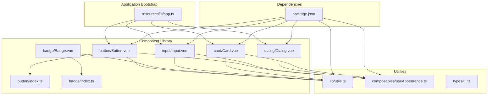
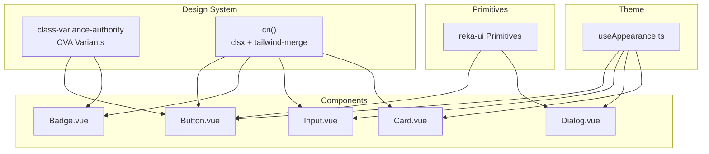
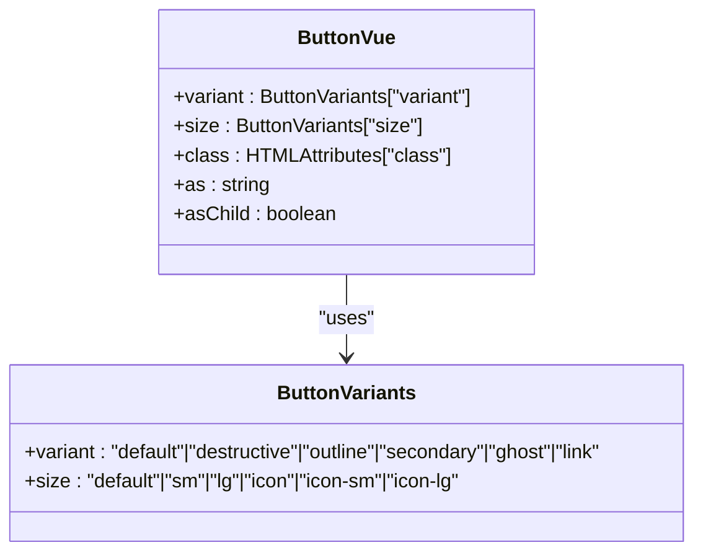
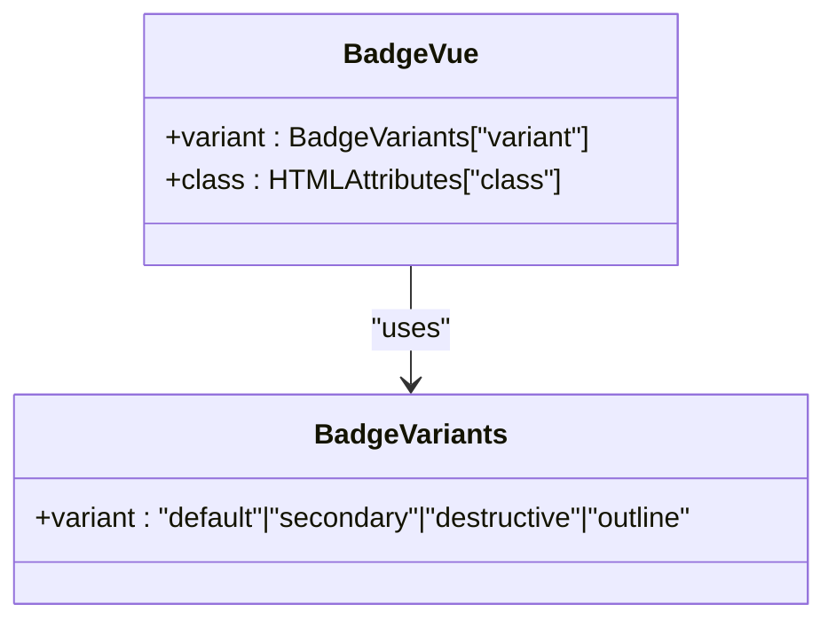
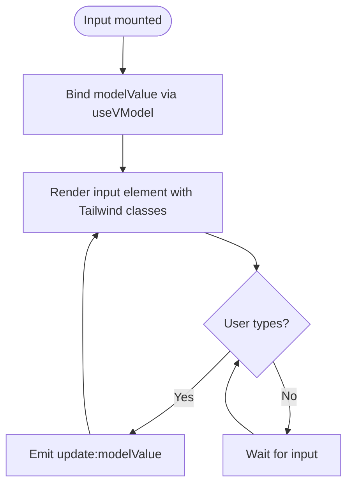
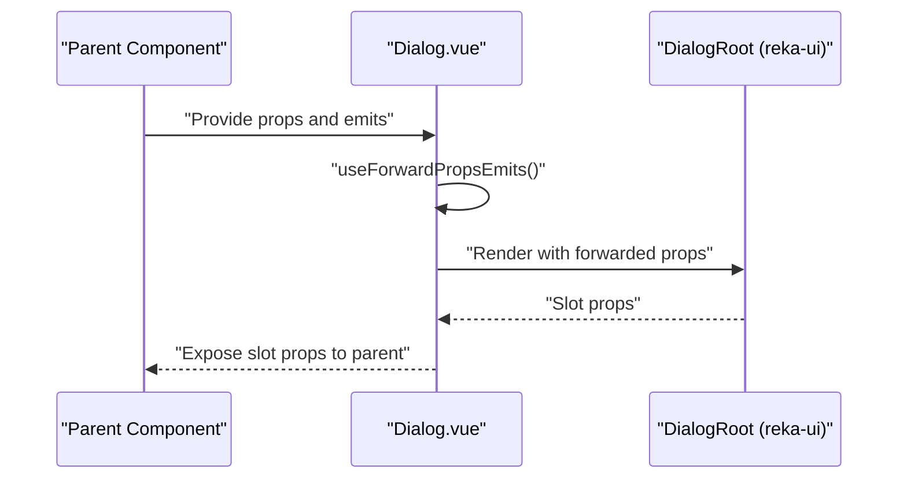
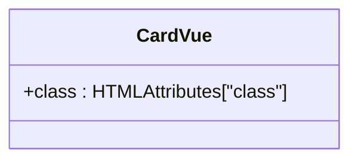
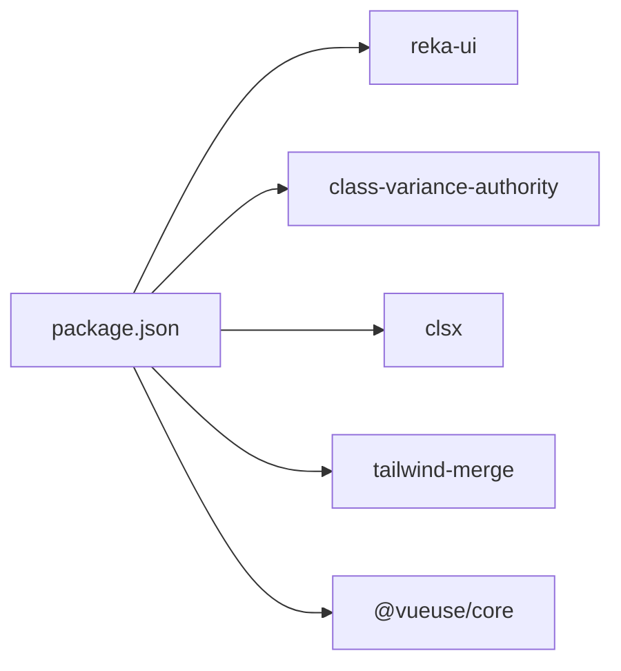

# Component Library System

<cite>
**Referenced Files in This Document**
- [app.ts](file://resources/js/app.ts)
- [package.json](file://package.json)
- [utils.ts](file://resources/js/lib/utils.ts)
- [useAppearance.ts](file://resources/js/composables/useAppearance.ts)
- [ui.ts](file://resources/js/types/ui.ts)
- [Button.vue](file://resources/js/components/ui/button/Button.vue)
- [button/index.ts](file://resources/js/components/ui/button/index.ts)
- [Badge.vue](file://resources/js/components/ui/badge/Badge.vue)
- [badge/index.ts](file://resources/js/components/ui/badge/index.ts)
- [Input.vue](file://resources/js/components/ui/input/Input.vue)
- [Dialog.vue](file://resources/js/components/ui/dialog/Dialog.vue)
- [Card.vue](file://resources/js/components/ui/card/Card.vue)
</cite>

## Table of Contents
1. [Introduction](#introduction)
2. [Project Structure](#project-structure)
3. [Core Components](#core-components)
4. [Architecture Overview](#architecture-overview)
5. [Detailed Component Analysis](#detailed-component-analysis)
6. [Dependency Analysis](#dependency-analysis)
7. [Performance Considerations](#performance-considerations)
8. [Troubleshooting Guide](#troubleshooting-guide)
9. [Conclusion](#conclusion)
10. [Appendices](#appendices)

## Introduction
This document describes the Vue component library system used in a Laravel/Vue application. It explains the component organization, reusable UI components, and the design system built on Tailwind CSS and reka-ui primitives. It covers component categories (buttons, forms, navigation, dialogs, and layout), composition patterns, prop/event interfaces, and the component registry via barrel exports. It also provides guidelines for creating new components, maintaining consistency, integrating Tailwind utility classes, and following design system principles. Testing, documentation, and versioning practices are addressed to ensure maintainability and scalability.

## Project Structure
The component library resides under resources/js/components/ui and is organized by feature category. Each category exposes a barrel export (index.ts) that re-exports the primary component and its variants. Utility functions and composables support the design system and theme management. The application bootstraps Inertia.js and initializes theme and flash toast integrations.

**Diagram sources**
- [app.ts:1-34](file://resources/js/app.ts#L1-L34)
- [Button.vue:1-32](file://resources/js/components/ui/button/Button.vue#L1-L32)
- [button/index.ts:1-39](file://resources/js/components/ui/button/index.ts#L1-L39)
- [Badge.vue:1-27](file://resources/js/components/ui/badge/Badge.vue#L1-L27)
- [badge/index.ts:1-27](file://resources/js/components/ui/badge/index.ts#L1-L27)
- [Input.vue:1-34](file://resources/js/components/ui/input/Input.vue#L1-L34)
- [Dialog.vue:1-20](file://resources/js/components/ui/dialog/Dialog.vue#L1-L20)
- [Card.vue:1-23](file://resources/js/components/ui/card/Card.vue#L1-L23)
- [utils.ts:1-13](file://resources/js/lib/utils.ts#L1-L13)
- [useAppearance.ts:1-125](file://resources/js/composables/useAppearance.ts#L1-L125)
- [ui.ts:1-10](file://resources/js/types/ui.ts#L1-L10)
- [package.json:1-62](file://package.json#L1-L62)

**Section sources**
- [app.ts:1-34](file://resources/js/app.ts#L1-L34)
- [package.json:1-62](file://package.json#L1-L62)

## Core Components
This section outlines the core building blocks of the component library and their roles in the design system.

- Button
  - Purpose: Base button primitive with variant and size control.
  - Composition: Uses reka-ui Primitive and class variance authority (CVA) variants.
  - Props: variant, size, as/asChild, and optional class override.
  - Events: Inherits from reka-ui DialogRootEmits via forwarding.
  - Integration: Tailwind utility classes combined with cn() merging.

- Badge
  - Purpose: Lightweight indicator or label with variant support.
  - Composition: Uses reka-ui Primitive and CVA variants.
  - Props: variant, optional class override.
  - Behavior: Delegates non-class props to the Primitive.

- Input
  - Purpose: Form input with controlled v-model binding.
  - Composition: Uses @vueuse/core useVModel for two-way binding.
  - Props: defaultValue, modelValue, class.
  - Events: update:modelValue.
  - Integration: Tailwind utility classes for focus, invalid states, and responsive sizing.

- Dialog
  - Purpose: Accessible dialog container with slot-based composition.
  - Composition: Wraps reka-ui DialogRoot and forwards props/emits.
  - Props/Events: Inherits DialogRootProps and DialogRootEmits.

- Card
  - Purpose: Container component for grouping related content.
  - Composition: Simple div wrapper with Tailwind classes.
  - Props: Optional class override.

**Section sources**
- [Button.vue:1-32](file://resources/js/components/ui/button/Button.vue#L1-L32)
- [button/index.ts:1-39](file://resources/js/components/ui/button/index.ts#L1-L39)
- [Badge.vue:1-27](file://resources/js/components/ui/badge/Badge.vue#L1-L27)
- [badge/index.ts:1-27](file://resources/js/components/ui/badge/index.ts#L1-L27)
- [Input.vue:1-34](file://resources/js/components/ui/input/Input.vue#L1-L34)
- [Dialog.vue:1-20](file://resources/js/components/ui/dialog/Dialog.vue#L1-L20)
- [Card.vue:1-23](file://resources/js/components/ui/card/Card.vue#L1-L23)

## Architecture Overview
The component library architecture centers on:
- Design System Layer: Variants defined via class-variance-authority (CVA) and merged with Tailwind utilities using cn().
- Composition Utilities: clsx and tailwind-merge for safe class concatenation and conflict resolution.
- Theme Management: useAppearance composable for light/dark/system modes with persistence.
- Component Registry: Barrel exports per category for clean imports and discoverability.
- Integration: Reusable UI primitives from reka-ui for accessible base components.

**Diagram sources**
- [button/index.ts:1-39](file://resources/js/components/ui/button/index.ts#L1-L39)
- [badge/index.ts:1-27](file://resources/js/components/ui/badge/index.ts#L1-L27)
- [utils.ts:1-13](file://resources/js/lib/utils.ts#L1-L13)
- [Button.vue:1-32](file://resources/js/components/ui/button/Button.vue#L1-L32)
- [Badge.vue:1-27](file://resources/js/components/ui/badge/Badge.vue#L1-L27)
- [Input.vue:1-34](file://resources/js/components/ui/input/Input.vue#L1-L34)
- [Dialog.vue:1-20](file://resources/js/components/ui/dialog/Dialog.vue#L1-L20)
- [Card.vue:1-23](file://resources/js/components/ui/card/Card.vue#L1-L23)
- [useAppearance.ts:1-125](file://resources/js/composables/useAppearance.ts#L1-L125)

## Detailed Component Analysis

### Button Component
The Button component demonstrates the design system pattern:
- Prop interface includes variant, size, as/asChild, and class.
- Uses cn() to merge CVA-generated classes with user-provided classes.
- Delegates rendering to reka-ui Primitive for semantic correctness and accessibility.

**Diagram sources**
- [Button.vue:9-17](file://resources/js/components/ui/button/Button.vue#L9-L17)
- [button/index.ts:6-37](file://resources/js/components/ui/button/index.ts#L6-L37)

**Section sources**
- [Button.vue:1-32](file://resources/js/components/ui/button/Button.vue#L1-L32)
- [button/index.ts:1-39](file://resources/js/components/ui/button/index.ts#L1-L39)

### Badge Component
The Badge component showcases variant-driven styling and delegation:
- Accepts variant and class props.
- Delegates non-class props to the Primitive to preserve reka-ui semantics.

**Diagram sources**
- [Badge.vue:10-13](file://resources/js/components/ui/badge/Badge.vue#L10-L13)
- [badge/index.ts:6-25](file://resources/js/components/ui/badge/index.ts#L6-L25)

**Section sources**
- [Badge.vue:1-27](file://resources/js/components/ui/badge/Badge.vue#L1-L27)
- [badge/index.ts:1-27](file://resources/js/components/ui/badge/index.ts#L1-L27)

### Input Component
The Input component illustrates controlled form behavior:
- Uses useVModel for reactive two-way binding with passive updates.
- Emits update:modelValue on user input.
- Applies Tailwind utility classes for focus, invalid states, and responsive typography.

**Diagram sources**
- [Input.vue:16-19](file://resources/js/components/ui/input/Input.vue#L16-L19)

**Section sources**
- [Input.vue:1-34](file://resources/js/components/ui/input/Input.vue#L1-L34)

### Dialog Component
The Dialog component wraps reka-ui’s DialogRoot:
- Forwards props and emits to maintain API compatibility.
- Exposes slot props for composition.

**Diagram sources**
- [Dialog.vue:1-20](file://resources/js/components/ui/dialog/Dialog.vue#L1-L20)

**Section sources**
- [Dialog.vue:1-20](file://resources/js/components/ui/dialog/Dialog.vue#L1-L20)

### Card Component
The Card component provides a foundational layout container:
- Renders a div with Tailwind classes for background, border, and shadow.
- Supports optional class overrides.

**Diagram sources**
- [Card.vue:5-7](file://resources/js/components/ui/card/Card.vue#L5-L7)

**Section sources**
- [Card.vue:1-23](file://resources/js/components/ui/card/Card.vue#L1-L23)

## Dependency Analysis
The component library relies on external dependencies and internal utilities:
- reka-ui: Provides accessible primitives and composite components.
- class-variance-authority: Defines variant-driven class sets.
- clsx and tailwind-merge: Safely merge and deduplicate Tailwind classes.
- @vueuse/core: Provides useVModel for controlled inputs.
- Tailwind CSS v4: Utility-first styling framework.

**Diagram sources**
- [package.json:36-51](file://package.json#L36-L51)

**Section sources**
- [package.json:1-62](file://package.json#L1-L62)

## Performance Considerations
- Prefer variant-driven styling with CVA to minimize runtime class computation.
- Use cn() to merge classes efficiently and avoid duplicates.
- Keep component props minimal and delegate to primitives to reduce overhead.
- Use passive v-model updates for inputs to avoid unnecessary re-renders.
- Leverage Tailwind’s JIT compilation and purging to keep bundle sizes small.

## Troubleshooting Guide
- Theme not applying on initial load:
  - Ensure initializeTheme is called during app bootstrap.
  - Verify useAppearance persists preferences in localStorage and cookies.
- Variant classes not taking effect:
  - Confirm variant names match those defined in the component’s index.ts.
  - Ensure cn() merges default classes with user-provided classes.
- Dialog not forwarding events:
  - Verify useForwardPropsEmits is applied and forwarded props are bound to DialogRoot.
- Input not updating:
  - Confirm useVModel is configured with correct prop and emit names.
  - Ensure passive option aligns with desired update strategy.

**Section sources**
- [app.ts:29-33](file://resources/js/app.ts#L29-L33)
- [useAppearance.ts:73-84](file://resources/js/composables/useAppearance.ts#L73-L84)
- [button/index.ts:6-37](file://resources/js/components/ui/button/index.ts#L6-L37)
- [badge/index.ts:6-25](file://resources/js/components/ui/badge/index.ts#L6-L25)
- [Dialog.vue:8-8](file://resources/js/components/ui/dialog/Dialog.vue#L8-L8)
- [Input.vue:16-19](file://resources/js/components/ui/input/Input.vue#L16-L19)

## Conclusion
The component library follows a robust design system leveraging reka-ui primitives, CVA variants, and Tailwind utilities. The barrel export pattern simplifies imports and promotes discoverability. Utilities like cn(), clsx, and tailwind-merge ensure consistent, conflict-free styling. The useAppearance composable provides seamless theme management. By adhering to these patterns and guidelines, teams can build scalable, accessible, and maintainable UI components.

## Appendices

### Creating New Components
- Define variants and defaults in a barrel index.ts using CVA.
- Implement the component with a clear prop interface and optional class override.
- Use cn() to merge CVA classes with user-provided classes.
- Wrap base elements with reka-ui primitives for accessibility.
- Export the component and variants from the barrel index.ts.

**Section sources**
- [button/index.ts:1-39](file://resources/js/components/ui/button/index.ts#L1-L39)
- [badge/index.ts:1-27](file://resources/js/components/ui/badge/index.ts#L1-L27)
- [utils.ts:6-8](file://resources/js/lib/utils.ts#L6-L8)

### Maintaining Consistency
- Align variant names and defaults across components.
- Centralize shared utilities in lib/utils.ts.
- Use the composable pattern for cross-cutting concerns like theme management.
- Keep Tailwind classes scoped to component boundaries to prevent leakage.

**Section sources**
- [utils.ts:1-13](file://resources/js/lib/utils.ts#L1-L13)
- [useAppearance.ts:1-125](file://resources/js/composables/useAppearance.ts#L1-L125)

### Design System Principles
- Variants drive visual states; props control behavior.
- Delegation to primitives ensures accessibility.
- Utility classes are merged safely to avoid conflicts.
- Theme modes are persisted and synchronized across client and server.

**Section sources**
- [button/index.ts:6-37](file://resources/js/components/ui/button/index.ts#L6-L37)
- [badge/index.ts:6-25](file://resources/js/components/ui/badge/index.ts#L6-L25)
- [useAppearance.ts:13-31](file://resources/js/composables/useAppearance.ts#L13-L31)

### Component Categories
- Buttons: Button.vue with buttonVariants.
- Forms: Input.vue with controlled v-model binding.
- Navigation: Navigation components available under navigation-menu.
- Dialogs: Dialog.vue wrapping reka-ui DialogRoot.
- Layout: Card.vue and other structural containers.

**Section sources**
- [Button.vue:1-32](file://resources/js/components/ui/button/Button.vue#L1-L32)
- [Input.vue:1-34](file://resources/js/components/ui/input/Input.vue#L1-L34)
- [Dialog.vue:1-20](file://resources/js/components/ui/dialog/Dialog.vue#L1-L20)
- [Card.vue:1-23](file://resources/js/components/ui/card/Card.vue#L1-L23)

### Integration with Tailwind CSS
- Use cn() to merge CVA classes with Tailwind utilities.
- Apply focus, invalid, and responsive states via Tailwind modifiers.
- Keep class definitions centralized for consistency.

**Section sources**
- [utils.ts:6-8](file://resources/js/lib/utils.ts#L6-L8)
- [Input.vue:26-31](file://resources/js/components/ui/input/Input.vue#L26-L31)

### Component Registry System
- Barrel exports in each category simplify imports.
- Import components from the category index.ts for discoverability.

**Section sources**
- [button/index.ts:4-4](file://resources/js/components/ui/button/index.ts#L4-L4)
- [badge/index.ts:4-4](file://resources/js/components/ui/badge/index.ts#L4-L4)

### Guidelines for Testing, Documentation, and Versioning
- Testing: Write unit tests for component behavior and variant rendering. Use controlled props and emits to simulate user interactions.
- Documentation: Document props, events, slots, and variants per component. Include usage examples and variant matrices.
- Versioning: Pin major versions of design system dependencies and update incrementally. Use changelogs to track breaking changes.

[No sources needed since this section provides general guidance]