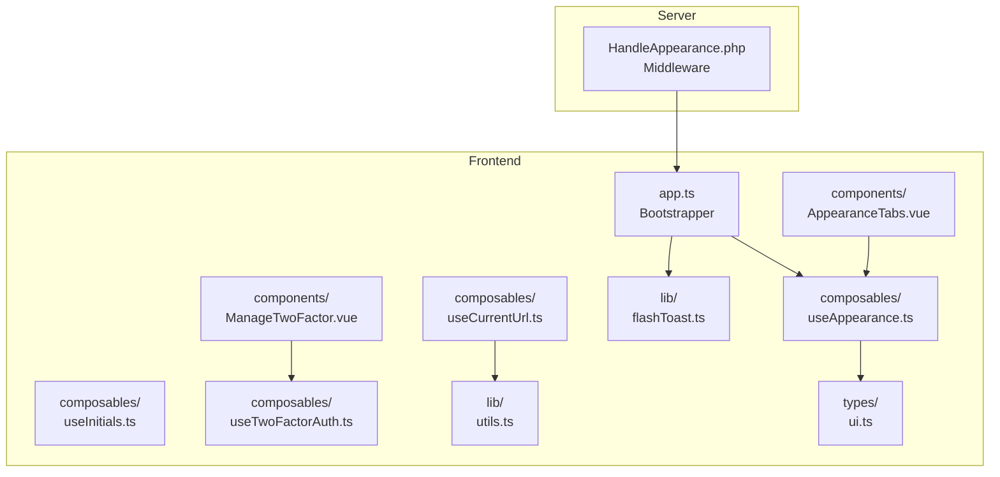
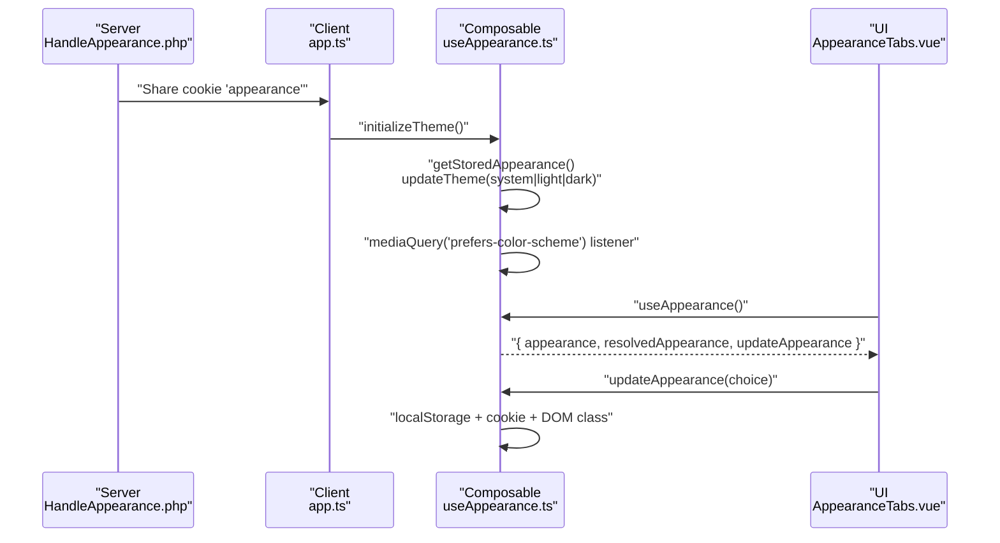
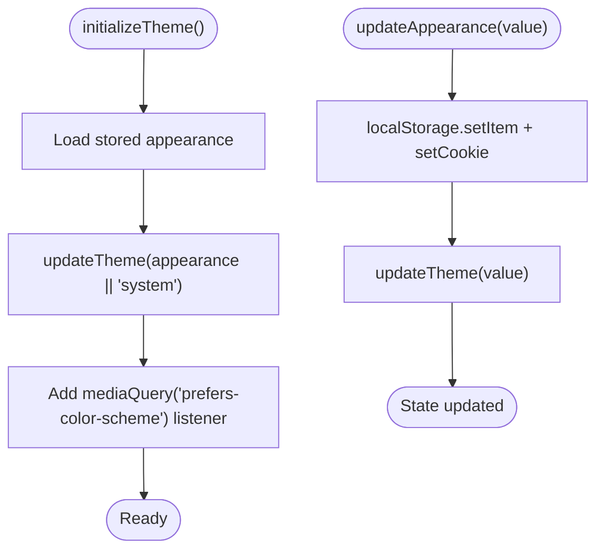
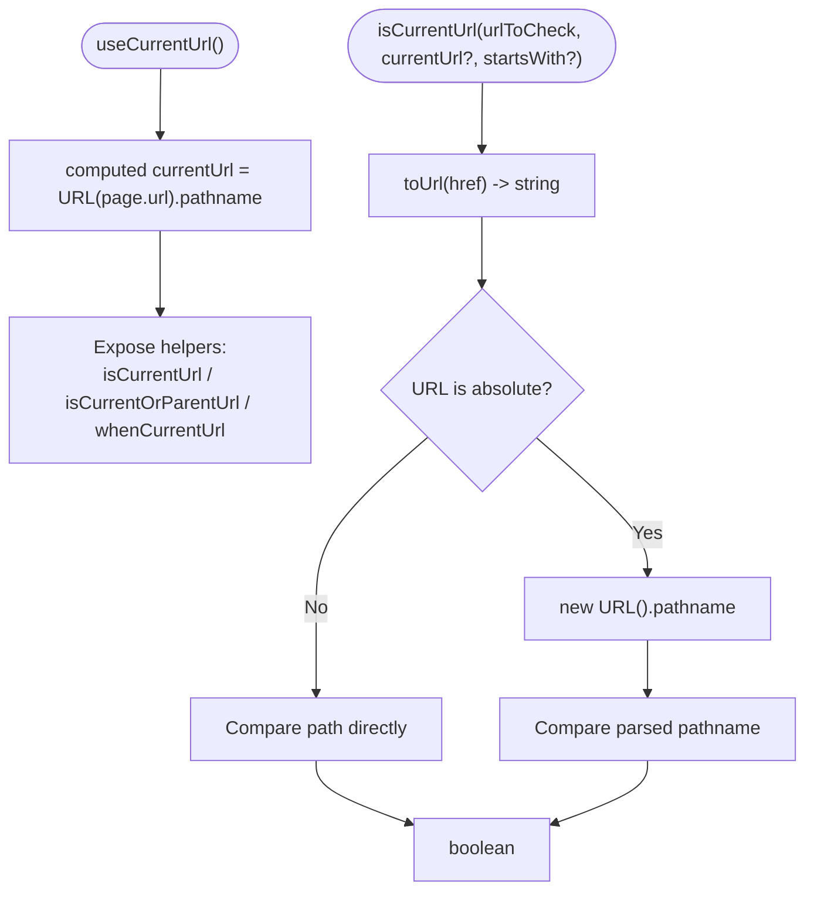
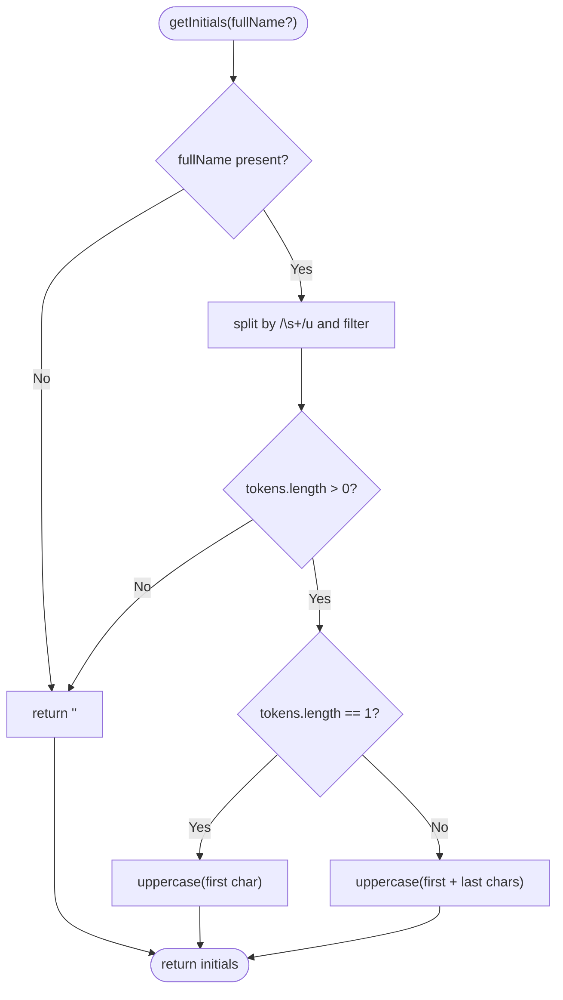
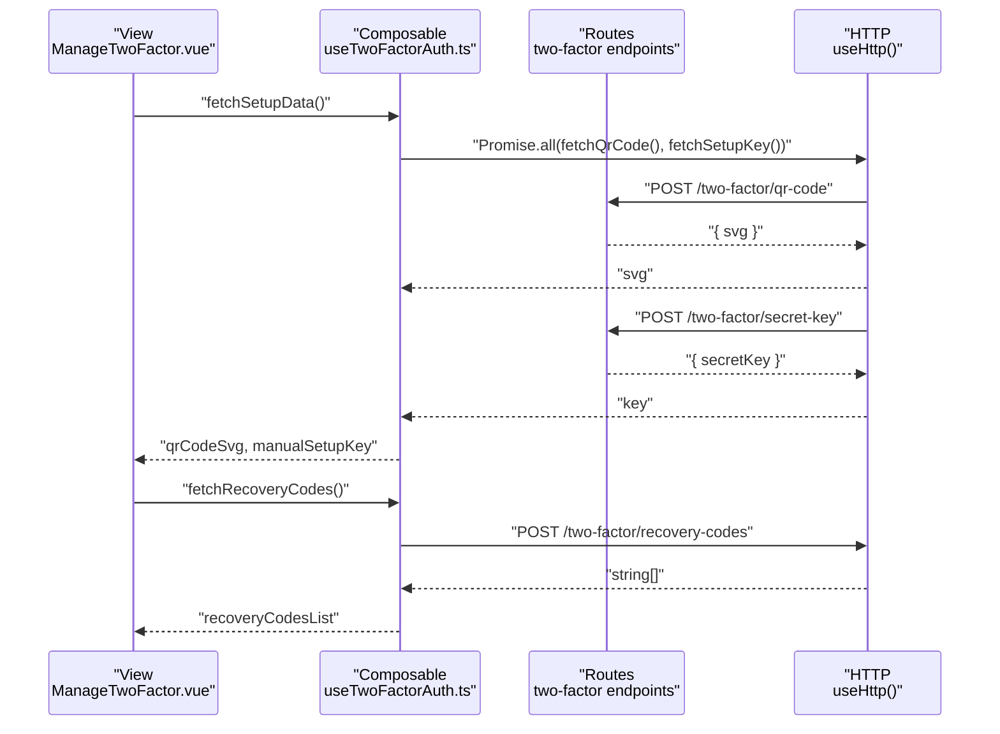
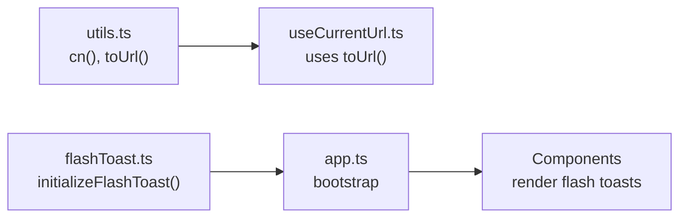
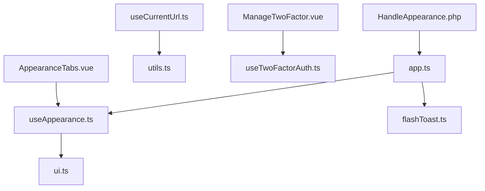

# Composables & Utility Functions

<cite>
**Referenced Files in This Document**
- [useAppearance.ts](file://resources/js/composables/useAppearance.ts)
- [useCurrentUrl.ts](file://resources/js/composables/useCurrentUrl.ts)
- [useInitials.ts](file://resources/js/composables/useInitials.ts)
- [useTwoFactorAuth.ts](file://resources/js/composables/useTwoFactorAuth.ts)
- [flashToast.ts](file://resources/js/lib/flashToast.ts)
- [utils.ts](file://resources/js/lib/utils.ts)
- [HandleAppearance.php](file://app/Http/Middleware/HandleAppearance.php)
- [app.ts](file://resources/js/app.ts)
- [ui.ts](file://resources/js/types/ui.ts)
- [index.ts](file://resources/js/types/index.ts)
- [AppearanceTabs.vue](file://resources/js/components/AppearanceTabs.vue)
- [ManageTwoFactor.vue](file://resources/js/components/ManageTwoFactor.vue)
- [web.php](file://routes/web.php)
</cite>

## Table of Contents
1. [Introduction](#introduction)
2. [Project Structure](#project-structure)
3. [Core Components](#core-components)
4. [Architecture Overview](#architecture-overview)
5. [Detailed Component Analysis](#detailed-component-analysis)
6. [Dependency Analysis](#dependency-analysis)
7. [Performance Considerations](#performance-considerations)
8. [Troubleshooting Guide](#troubleshooting-guide)
9. [Conclusion](#conclusion)
10. [Appendices](#appendices)

## Introduction
This document explains the composable functions and utility libraries used across the frontend. It focuses on:
- Shared logic via Vue composables for appearance management, URL detection, initials generation, and two-factor authentication
- Utility functions for class merging and URL normalization
- Flash toast initialization and integration with server-side flash messages
- Patterns for reactive state, SSR-aware behavior, and cross-component reuse
- Practical guidance on building custom composables, performance, memory, and testing strategies

## Project Structure
The relevant code resides under resources/js:
- composables/: Reusable logic for appearance, URLs, initials, and 2FA
- lib/: Utilities for UI and flash toast integration
- components/: Examples of composables in action
- types/: Type definitions for composables and UI
- app.ts: Bootstraps SSR-aware appearance and flash toast listeners
- middleware: Server-side sharing of appearance preferences

**Diagram sources**
- [app.ts:1-34](file://resources/js/app.ts#L1-L34)
- [useAppearance.ts:1-125](file://resources/js/composables/useAppearance.ts#L1-L125)
- [useCurrentUrl.ts:1-83](file://resources/js/composables/useCurrentUrl.ts#L1-L83)
- [useInitials.ts:1-30](file://resources/js/composables/useInitials.ts#L1-L30)
- [useTwoFactorAuth.ts:1-113](file://resources/js/composables/useTwoFactorAuth.ts#L1-L113)
- [utils.ts:1-13](file://resources/js/lib/utils.ts#L1-L13)
- [flashToast.ts:1-17](file://resources/js/lib/flashToast.ts#L1-L17)
- [AppearanceTabs.vue:1-34](file://resources/js/components/AppearanceTabs.vue#L1-L34)
- [ManageTwoFactor.vue:1-94](file://resources/js/components/ManageTwoFactor.vue#L1-L94)
- [ui.ts:1-10](file://resources/js/types/ui.ts#L1-L10)
- [HandleAppearance.php:1-24](file://app/Http/Middleware/HandleAppearance.php#L1-L24)

**Section sources**
- [app.ts:1-34](file://resources/js/app.ts#L1-L34)
- [HandleAppearance.php:1-24](file://app/Http/Middleware/HandleAppearance.php#L1-L24)

## Core Components
- Appearance management composable: Provides reactive appearance state, resolves effective theme, updates DOM classes, persists preferences, and listens to system theme changes.
- Current URL composable: Computes current path, checks equality or parent relationships, and conditionally renders content based on the current route.
- Initials generator: Produces initials from full names with robust whitespace and empty-name handling.
- Two-factor authentication composable: Manages QR code, manual setup key, recovery codes, and error state for 2FA setup and retrieval.
- Utilities: Class merging and URL normalization helpers.
- Flash toast integration: Initializes a listener to render server-provided flash notifications.

**Section sources**
- [useAppearance.ts:86-125](file://resources/js/composables/useAppearance.ts#L86-L125)
- [useCurrentUrl.ts:36-83](file://resources/js/composables/useCurrentUrl.ts#L36-L83)
- [useInitials.ts:9-30](file://resources/js/composables/useInitials.ts#L9-L30)
- [useTwoFactorAuth.ts:30-113](file://resources/js/composables/useTwoFactorAuth.ts#L30-L113)
- [utils.ts:6-13](file://resources/js/lib/utils.ts#L6-L13)
- [flashToast.ts:5-17](file://resources/js/lib/flashToast.ts#L5-L17)

## Architecture Overview
The composable ecosystem integrates with SSR and client-side rendering:
- Server shares appearance preference via middleware to avoid FOUC
- Client initializes theme on mount and listens to system changes
- Components consume composables to share state and logic across the app
- Utilities centralize cross-cutting concerns like class merging and URL handling
- Flash toast listener bridges server flash messages to client notifications

**Diagram sources**
- [HandleAppearance.php:17-22](file://app/Http/Middleware/HandleAppearance.php#L17-L22)
- [app.ts:29-34](file://resources/js/app.ts#L29-L34)
- [useAppearance.ts:73-84](file://resources/js/composables/useAppearance.ts#L73-L84)
- [useAppearance.ts:88-125](file://resources/js/composables/useAppearance.ts#L88-L125)
- [AppearanceTabs.vue:3-5](file://resources/js/components/AppearanceTabs.vue#L3-L5)

## Detailed Component Analysis

### Appearance Management Composable
Purpose:
- Provide reactive appearance state and a resolved theme derived from user choice or system preference
- Persist choices locally and across SSR via cookies
- Apply dark mode class to document element and react to system theme changes

Key behaviors:
- Initialization reads stored preference or defaults to system and applies theme immediately
- Listens to system theme changes and re-applies theme accordingly
- Exposes updateAppearance to persist and apply changes
- Uses localStorage for client persistence and cookies for SSR hydration

**Diagram sources**
- [useAppearance.ts:73-84](file://resources/js/composables/useAppearance.ts#L73-L84)
- [useAppearance.ts:107-117](file://resources/js/composables/useAppearance.ts#L107-L117)

**Section sources**
- [useAppearance.ts:13-31](file://resources/js/composables/useAppearance.ts#L13-L31)
- [useAppearance.ts:33-41](file://resources/js/composables/useAppearance.ts#L33-L41)
- [useAppearance.ts:43-65](file://resources/js/composables/useAppearance.ts#L43-L65)
- [useAppearance.ts:73-84](file://resources/js/composables/useAppearance.ts#L73-L84)
- [useAppearance.ts:86-125](file://resources/js/composables/useAppearance.ts#L86-L125)
- [HandleAppearance.php:17-22](file://app/Http/Middleware/HandleAppearance.php#L17-L22)
- [app.ts:29-34](file://resources/js/app.ts#L29-L34)

### Current URL Composable
Purpose:
- Compute and expose the current path for navigation-related decisions
- Provide helpers to test whether a given URL matches the current location, including parent-path checks
- Offer a conditional-rendering helper that returns one of two values depending on the match

Highlights:
- Uses Inertia’s page.url and window origin to construct a normalized pathname
- Converts href-like inputs to URL strings and handles absolute vs relative URLs
- Supports strict equality and “startsWith” semantics for parent-child matching

**Diagram sources**
- [useCurrentUrl.ts:25-34](file://resources/js/composables/useCurrentUrl.ts#L25-L34)
- [useCurrentUrl.ts:36-83](file://resources/js/composables/useCurrentUrl.ts#L36-L83)
- [utils.ts:10-12](file://resources/js/lib/utils.ts#L10-L12)

**Section sources**
- [useCurrentUrl.ts:25-34](file://resources/js/composables/useCurrentUrl.ts#L25-L34)
- [useCurrentUrl.ts:36-83](file://resources/js/composables/useCurrentUrl.ts#L36-L83)
- [utils.ts:10-12](file://resources/js/lib/utils.ts#L10-L12)

### Initials Generator
Purpose:
- Produce initials from a full name string with predictable behavior for single/multiple names and whitespace

Behavior:
- Trims input and splits by one or more whitespace characters
- Filters out empty tokens
- Returns uppercase initials for one name and for first and last names when multiple tokens exist

**Diagram sources**
- [useInitials.ts:9-25](file://resources/js/composables/useInitials.ts#L9-L25)

**Section sources**
- [useInitials.ts:9-30](file://resources/js/composables/useInitials.ts#L9-L30)

### Two-Factor Authentication Composable
Purpose:
- Centralize state and actions for 2FA setup and recovery code retrieval
- Provide reactive refs for QR code SVG, manual setup key, and recovery codes
- Expose helpers to clear state and errors

Key actions:
- Fetch QR code and setup key concurrently
- Retrieve recovery codes
- Clear setup data, errors, and broader 2FA state
- Compute presence of initial setup data

**Diagram sources**
- [useTwoFactorAuth.ts:30-113](file://resources/js/composables/useTwoFactorAuth.ts#L30-L113)
- [ManageTwoFactor.vue:24-27](file://resources/js/components/ManageTwoFactor.vue#L24-L27)

**Section sources**
- [useTwoFactorAuth.ts:30-113](file://resources/js/composables/useTwoFactorAuth.ts#L30-L113)
- [ManageTwoFactor.vue:24-27](file://resources/js/components/ManageTwoFactor.vue#L24-L27)

### Utilities and Flash Toast
Utilities:
- cn(...inputs): Merge Tailwind classes with clsx and twMerge
- toUrl(href): Normalize href-like props to a string URL

Flash Toast:
- initializeFlashToast(): Listens for a custom "flash" event from Inertia and renders toast messages based on server-provided data

**Diagram sources**
- [utils.ts:6-12](file://resources/js/lib/utils.ts#L6-L12)
- [useCurrentUrl.ts:5](file://resources/js/composables/useCurrentUrl.ts#L5)
- [flashToast.ts:5-16](file://resources/js/lib/flashToast.ts#L5-L16)
- [app.ts:6](file://resources/js/app.ts#L6)

**Section sources**
- [utils.ts:6-13](file://resources/js/lib/utils.ts#L6-L13)
- [flashToast.ts:5-17](file://resources/js/lib/flashToast.ts#L5-L17)
- [app.ts:6](file://resources/js/app.ts#L6)

## Dependency Analysis
- SSR hydration: Server middleware shares the appearance cookie so the client avoids mismatched initial theme
- Composables depend on Vue reactivity primitives and browser APIs
- Utilities are pure and dependency-light, enabling reuse across composables
- Flash toast depends on Inertia router events and a toast library

**Diagram sources**
- [HandleAppearance.php:17-22](file://app/Http/Middleware/HandleAppearance.php#L17-L22)
- [app.ts:29-34](file://resources/js/app.ts#L29-L34)
- [useAppearance.ts:86-125](file://resources/js/composables/useAppearance.ts#L86-L125)
- [ui.ts:1-10](file://resources/js/types/ui.ts#L1-L10)
- [flashToast.ts:5-16](file://resources/js/lib/flashToast.ts#L5-L16)
- [useCurrentUrl.ts:5](file://resources/js/composables/useCurrentUrl.ts#L5)
- [utils.ts:6-12](file://resources/js/lib/utils.ts#L6-L12)
- [ManageTwoFactor.vue:9](file://resources/js/components/ManageTwoFactor.vue#L9)
- [useTwoFactorAuth.ts:30-113](file://resources/js/composables/useTwoFactorAuth.ts#L30-L113)
- [AppearanceTabs.vue:3](file://resources/js/components/AppearanceTabs.vue#L3)

**Section sources**
- [HandleAppearance.php:17-22](file://app/Http/Middleware/HandleAppearance.php#L17-L22)
- [app.ts:29-34](file://resources/js/app.ts#L29-L34)
- [useAppearance.ts:86-125](file://resources/js/composables/useAppearance.ts#L86-L125)
- [useCurrentUrl.ts:5](file://resources/js/composables/useCurrentUrl.ts#L5)
- [utils.ts:6-12](file://resources/js/lib/utils.ts#L6-L12)
- [flashToast.ts:5-16](file://resources/js/lib/flashToast.ts#L5-L16)
- [ManageTwoFactor.vue:9](file://resources/js/components/ManageTwoFactor.vue#L9)
- [useTwoFactorAuth.ts:30-113](file://resources/js/composables/useTwoFactorAuth.ts#L30-L113)
- [AppearanceTabs.vue:3](file://resources/js/components/AppearanceTabs.vue#L3)

## Performance Considerations
- Minimize DOM writes: Appearance composable toggles a single class on the document element; batch updates by avoiding repeated writes
- Debounce or coalesce listeners: System theme media queries can fire frequently; keep handlers lightweight
- Reactive computation: Use computed refs for derived values (resolved appearance) to avoid recomputation
- Network requests: 2FA composable uses Promise.all for concurrent fetches; ensure error boundaries prevent partial state pollution
- Memory hygiene: Clear composables on unmount (e.g., 2FA data cleanup) to prevent stale state accumulation
- SSR awareness: Avoid accessing window/document before mount; composables already guard against SSR mismatches

[No sources needed since this section provides general guidance]

## Troubleshooting Guide
Common issues and resolutions:
- Appearance mismatch on first paint: Ensure server shares the cookie and client calls initialization on mount
- System theme not updating: Verify media query listener is attached and updateTheme is invoked after state changes
- URL helpers returning unexpected results: Confirm toUrl normalization and absolute URL parsing; prefer relative paths for internal links
- 2FA state not clearing: Call clearTwoFactorAuthData on component unmount to reset refs and errors
- Flash toasts not appearing: Confirm router event handler is initialized and server emits the expected flash payload

**Section sources**
- [HandleAppearance.php:17-22](file://app/Http/Middleware/HandleAppearance.php#L17-L22)
- [useAppearance.ts:73-84](file://resources/js/composables/useAppearance.ts#L73-L84)
- [useAppearance.ts:107-117](file://resources/js/composables/useAppearance.ts#L107-L117)
- [useCurrentUrl.ts:36-83](file://resources/js/composables/useCurrentUrl.ts#L36-L83)
- [useTwoFactorAuth.ts:70-74](file://resources/js/composables/useTwoFactorAuth.ts#L70-L74)
- [flashToast.ts:5-16](file://resources/js/lib/flashToast.ts#L5-L16)

## Conclusion
These composables and utilities encapsulate shared logic for appearance, navigation, identity, and security while remaining SSR-friendly and easy to reuse. By centralizing state and side effects, they reduce duplication and improve maintainability. The included utilities and flash toast integration further streamline cross-cutting concerns.

[No sources needed since this section summarizes without analyzing specific files]

## Appendices

### Creating Custom Composables
Patterns demonstrated in this codebase:
- Encapsulate reactive state with refs/computed
- Provide helper methods to mutate and clear state
- Expose typed return objects for predictable consumption
- Guard SSR access to browser globals
- Keep pure utilities separate for reuse

Example references:
- Stateful composable with lifecycle hooks: [useAppearance.ts:88-125](file://resources/js/composables/useAppearance.ts#L88-L125)
- Pure utility function: [utils.ts:6-12](file://resources/js/lib/utils.ts#L6-L12)
- SSR-aware initialization: [app.ts:29-34](file://resources/js/app.ts#L29-L34)

**Section sources**
- [useAppearance.ts:88-125](file://resources/js/composables/useAppearance.ts#L88-L125)
- [utils.ts:6-12](file://resources/js/lib/utils.ts#L6-L12)
- [app.ts:29-34](file://resources/js/app.ts#L29-L34)

### Managing Reactive State
- Use refs for mutable state (appearance, QR code, keys, recovery codes)
- Use computed for derived state (resolved appearance)
- Clear state on unmount to prevent leaks
- Persist selections in both localStorage and cookies for SSR

References:
- [useAppearance.ts:86-125](file://resources/js/composables/useAppearance.ts#L86-L125)
- [useTwoFactorAuth.ts:21-28](file://resources/js/composables/useTwoFactorAuth.ts#L21-L28)
- [useTwoFactorAuth.ts:70-74](file://resources/js/composables/useTwoFactorAuth.ts#L70-L74)

**Section sources**
- [useAppearance.ts:86-125](file://resources/js/composables/useAppearance.ts#L86-L125)
- [useTwoFactorAuth.ts:21-28](file://resources/js/composables/useTwoFactorAuth.ts#L21-L28)
- [useTwoFactorAuth.ts:70-74](file://resources/js/composables/useTwoFactorAuth.ts#L70-L74)

### Implementing Reusable Logic
- Extract cross-component logic into composables
- Provide small, focused helpers (initials, URL normalization)
- Keep side effects isolated and testable
- Integrate with SSR via middleware and initialization hooks

References:
- [useInitials.ts:9-30](file://resources/js/composables/useInitials.ts#L9-L30)
- [useCurrentUrl.ts:36-83](file://resources/js/composables/useCurrentUrl.ts#L36-L83)
- [utils.ts:6-12](file://resources/js/lib/utils.ts#L6-L12)

**Section sources**
- [useInitials.ts:9-30](file://resources/js/composables/useInitials.ts#L9-L30)
- [useCurrentUrl.ts:36-83](file://resources/js/composables/useCurrentUrl.ts#L36-L83)
- [utils.ts:6-12](file://resources/js/lib/utils.ts#L6-L12)

### Testing Strategies for Composables
Recommended approaches:
- Mock browser APIs (window, document, localStorage) for unit tests
- Test computed derivations (resolved appearance) with various inputs
- Simulate network failures for 2FA fetches and assert error handling
- Verify SSR hydration by checking cookie-driven initial state
- Validate flash toast rendering by dispatching custom router events

[No sources needed since this section provides general guidance]