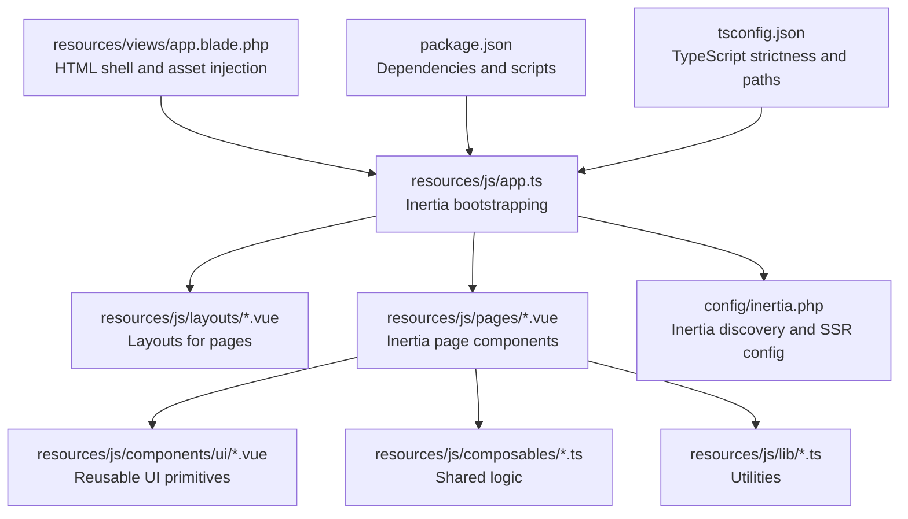
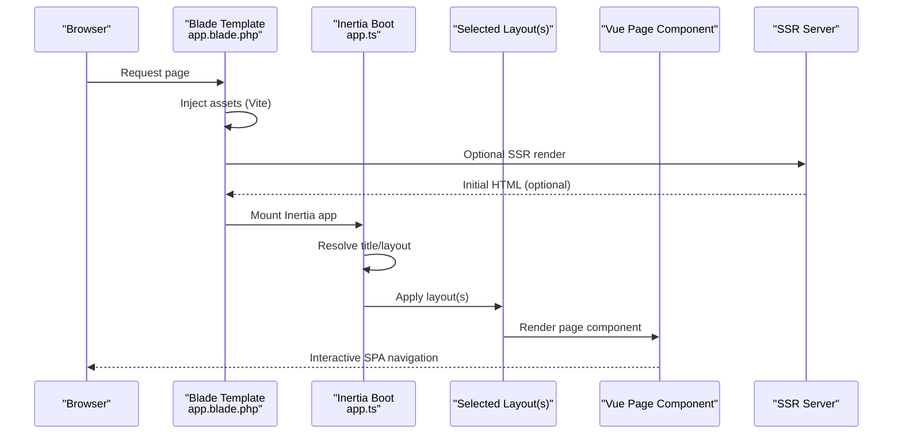
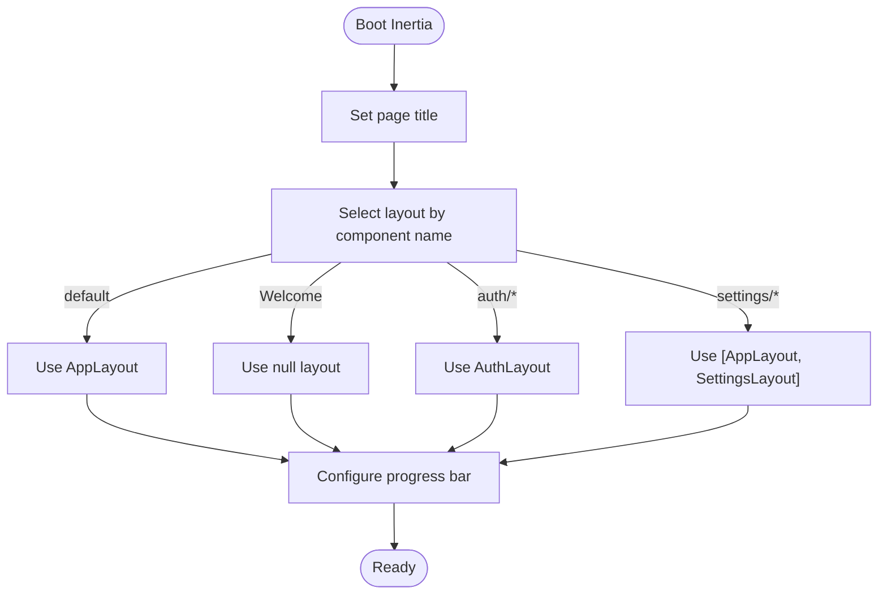
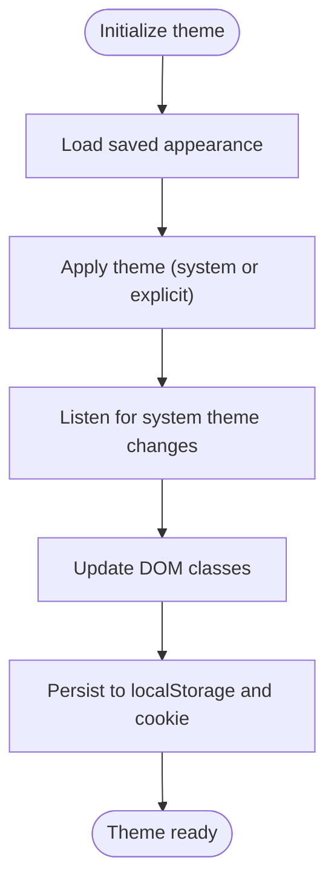
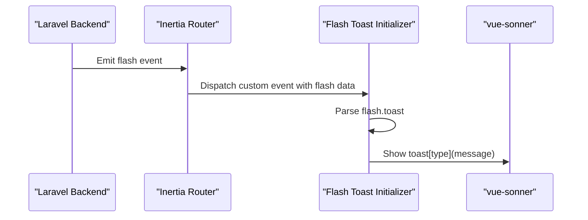
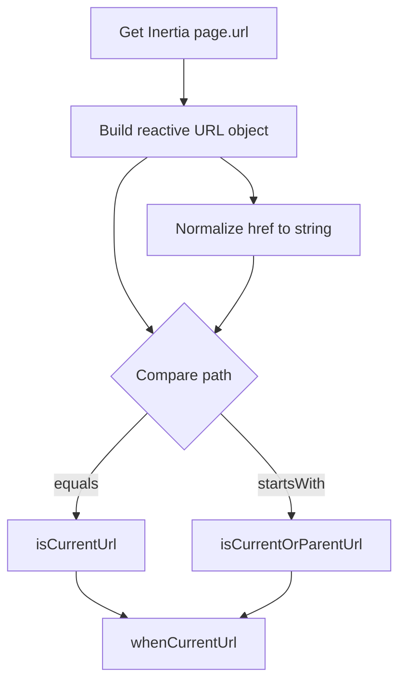
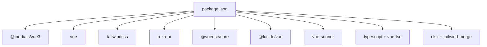

# Frontend Architecture & Components

<cite>
**Referenced Files in This Document**
- [app.ts](file://resources/js/app.ts)
- [app.blade.php](file://resources/views/app.blade.php)
- [inertia.php](file://config/inertia.php)
- [package.json](file://package.json)
- [tsconfig.json](file://tsconfig.json)
- [utils.ts](file://resources/js/lib/utils.ts)
- [flashToast.ts](file://resources/js/lib/flashToast.ts)
- [useAppearance.ts](file://resources/js/composables/useAppearance.ts)
- [useCurrentUrl.ts](file://resources/js/composables/useCurrentUrl.ts)
</cite>

## Table of Contents
1. [Introduction](#introduction)
2. [Project Structure](#project-structure)
3. [Core Components](#core-components)
4. [Architecture Overview](#architecture-overview)
5. [Detailed Component Analysis](#detailed-component-analysis)
6. [Dependency Analysis](#dependency-analysis)
7. [Performance Considerations](#performance-considerations)
8. [Troubleshooting Guide](#troubleshooting-guide)
9. [Conclusion](#conclusion)

## Introduction
This document describes the frontend architecture of SmartRecruit ATS, focusing on the Vue.js 3 application built with the Composition API and TypeScript integration. It explains the component library architecture, layout systems, Inertia.js integration for seamless single-page navigation while retaining Laravel backend capabilities, shared composables for state and utilities, and the type system with interfaces and type safety patterns. Practical guidance is included for responsive design, accessibility, cross-browser compatibility, and integrating with backend APIs.

## Project Structure
The frontend is organized around a clear separation of concerns:
- Entry point initializes Inertia.js, sets dynamic page titles, selects layouts, and configures progress indicators.
- Blade template renders the HTML shell, injects Vite assets, and supports SSR via Inertia.
- TypeScript configuration enables strict type checking and path aliases.
- A rich component library under resources/js/components/ui provides reusable UI primitives.
- Composables encapsulate shared logic for appearance, URLs, and two-factor authentication.
- Utilities centralize class merging and URL normalization.
- Pages under resources/js/pages correspond to Inertia route targets.

**Diagram sources**
- [app.ts:1-34](file://resources/js/app.ts#L1-L34)
- [app.blade.php:1-48](file://resources/views/app.blade.php#L1-L48)
- [inertia.php:1-71](file://config/inertia.php#L1-L71)
- [package.json:1-62](file://package.json#L1-L62)
- [tsconfig.json:1-126](file://tsconfig.json#L1-L126)

**Section sources**
- [app.ts:1-34](file://resources/js/app.ts#L1-L34)
- [app.blade.php:1-48](file://resources/views/app.blade.php#L1-L48)
- [inertia.php:1-71](file://config/inertia.php#L1-L71)
- [package.json:1-62](file://package.json#L1-L62)
- [tsconfig.json:1-126](file://tsconfig.json#L1-L126)

## Core Components
- Inertia bootstrapper: Initializes Inertia, sets page title, selects layouts based on component names, and configures progress bar color.
- Theme initializer: Applies light/dark theme on load and listens for system preference changes.
- Flash toast initializer: Subscribes to flash events and displays toast notifications.
- Appearance composable: Manages user’s appearance preference, persists it, and updates DOM classes.
- URL utilities: Normalize href values and provide helpers to determine current and parent URLs.
- Current URL composable: Reactive URL tracking and helpers for conditional rendering and active states.

Key responsibilities:
- Layout selection logic ensures Welcome uses no layout, auth pages use AuthLayout, settings pages use a dual AppLayout + SettingsLayout, and others use AppLayout.
- SSR is enabled and configured to render server-side HTML for initial requests.

**Section sources**
- [app.ts:10-27](file://resources/js/app.ts#L10-L27)
- [app.ts:29-33](file://resources/js/app.ts#L29-L33)
- [app.blade.php:1-48](file://resources/views/app.blade.php#L1-L48)
- [inertia.php:18-23](file://config/inertia.php#L18-L23)
- [useAppearance.ts:73-84](file://resources/js/composables/useAppearance.ts#L73-L84)
- [flashToast.ts:5-16](file://resources/js/lib/flashToast.ts#L5-L16)
- [utils.ts:6-12](file://resources/js/lib/utils.ts#L6-L12)
- [useCurrentUrl.ts:36-82](file://resources/js/composables/useCurrentUrl.ts#L36-L82)

## Architecture Overview
SmartRecruit ATS uses Inertia.js to bridge Laravel and Vue:
- Laravel renders the HTML shell and assets via Blade.
- Inertia mounts Vue pages on the client, enabling SPA navigation without full page reloads.
- SSR can prerender initial HTML for improved performance and SEO.
- Tailwind CSS v4 and Tailwind Merge/CLSX provide responsive styling and class composition.
- Reka UI offers a comprehensive set of accessible, composable primitives.

**Diagram sources**
- [app.blade.php:39-45](file://resources/views/app.blade.php#L39-L45)
- [app.ts:10-27](file://resources/js/app.ts#L10-L27)
- [inertia.php:18-23](file://config/inertia.php#L18-L23)

## Detailed Component Analysis

### Inertia Bootstrapping and Layout Selection
- Title customization: Uses a callback to prepend app name to page titles.
- Layout resolution: Switches based on component name prefixes and special cases.
- Progress indicator: Sets a neutral gray color for navigations.
- SSR: Enabled and configured with a dedicated SSR URL.

**Diagram sources**
- [app.ts:10-27](file://resources/js/app.ts#L10-L27)

**Section sources**
- [app.ts:10-27](file://resources/js/app.ts#L10-L27)
- [inertia.php:18-23](file://config/inertia.php#L18-L23)

### Theme Management (Appearance)
- Persists user preference in localStorage and cookies.
- Updates documentElement classes for dark/light modes.
- Listens to system preference changes and recomputes resolved appearance.
- Provides reactive resolvedAppearance for conditional rendering.

**Diagram sources**
- [useAppearance.ts:73-84](file://resources/js/composables/useAppearance.ts#L73-L84)
- [useAppearance.ts:13-31](file://resources/js/composables/useAppearance.ts#L13-L31)
- [useAppearance.ts:107-117](file://resources/js/composables/useAppearance.ts#L107-L117)

**Section sources**
- [useAppearance.ts:1-125](file://resources/js/composables/useAppearance.ts#L1-L125)
- [app.ts:29-30](file://resources/js/app.ts#L29-L30)

### Flash Toast Integration
- Subscribes to Inertia flash events.
- Extracts typed toast data and dispatches appropriate toast notifications.

**Diagram sources**
- [flashToast.ts:5-16](file://resources/js/lib/flashToast.ts#L5-L16)

**Section sources**
- [flashToast.ts:1-17](file://resources/js/lib/flashToast.ts#L1-L17)
- [app.ts:32-33](file://resources/js/app.ts#L32-L33)

### URL Utilities and Active State Helpers
- Normalizes href values for Inertia links.
- Computes current URL reactively from Inertia page state.
- Provides helpers to test equality, parent-child relationships, and conditional rendering.

**Diagram sources**
- [useCurrentUrl.ts:25-34](file://resources/js/composables/useCurrentUrl.ts#L25-L34)
- [utils.ts:10-12](file://resources/js/lib/utils.ts#L10-L12)

**Section sources**
- [utils.ts:1-13](file://resources/js/lib/utils.ts#L1-L13)
- [useCurrentUrl.ts:1-83](file://resources/js/composables/useCurrentUrl.ts#L1-L83)

### Component Library Overview
The component library under resources/js/components/ui provides a comprehensive set of accessible primitives grouped by domain (alert, avatar, badge, breadcrumb, button, card, checkbox, collapsible, dialog, dropdown-menu, input, input-otp, label, navigation-menu, select, separator, sheet, sidebar, skeleton, sonner, spinner, tooltip). Each group exposes an index.ts that re-exports the primary component and related subcomponents, enabling clean imports and tree-shaking-friendly consumption.

Patterns:
- Each primitive is self-contained with clear internal structure and a cohesive API.
- Many components expose subcomponents (e.g., DialogContent, DialogTrigger) to compose complex UIs.
- Consistent prop interfaces and event handling promote predictable usage.

Integration:
- Components integrate seamlessly with Inertia pages and layouts.
- Utilities like cn (clsx + tailwind-merge) enable safe class composition.

**Section sources**
- [utils.ts:6-8](file://resources/js/lib/utils.ts#L6-L8)

## Dependency Analysis
External dependencies and their roles:
- Inertia.js: Enables SPA navigation and SSR.
- Vue 3 + @inertiajs/vue3: Reactive application and client-side routing.
- Tailwind CSS v4: Utility-first styling with oklch color support and dark mode.
- Reka UI: Accessible, composable UI primitives.
- VueUse: Cross-browser and SSR-friendly composables.
- Lucide icons: SVG iconography.
- Vue Sonner: Elegant toast notifications.
- TypeScript + vue-tsc: Strict type checking and declaration emission.

**Diagram sources**
- [package.json:36-51](file://package.json#L36-L51)

**Section sources**
- [package.json:1-62](file://package.json#L1-L62)
- [tsconfig.json:1-126](file://tsconfig.json#L1-L126)

## Performance Considerations
- SSR: Enabled to improve initial load performance and SEO; ensure SSR bundle is available and reachable.
- Asset pipeline: Vite builds optimized bundles; use dev vs. production scripts appropriately.
- Class composition: Use cn to merge classes efficiently and avoid duplicates.
- Lazy loading: Consider lazy-loading heavy pages or components when appropriate.
- Strict typing: Leverage TypeScript strict mode to catch performance-related bugs early.

[No sources needed since this section provides general guidance]

## Troubleshooting Guide
Common issues and resolutions:
- Layout not applied: Verify component name prefixes and layout selection logic in the Inertia boot file.
- Theme not persisting: Ensure localStorage and cookies are writable and initializeTheme runs on load.
- Toasts not appearing: Confirm flash events are emitted by the backend and initializeFlashToast is called.
- URL helpers not working: Ensure Inertia page state is available and normalize hrefs via toUrl.

**Section sources**
- [app.ts:12-23](file://resources/js/app.ts#L12-L23)
- [useAppearance.ts:73-84](file://resources/js/composables/useAppearance.ts#L73-L84)
- [flashToast.ts:5-16](file://resources/js/lib/flashToast.ts#L5-L16)
- [utils.ts:10-12](file://resources/js/lib/utils.ts#L10-L12)

## Conclusion
SmartRecruit ATS combines Laravel’s robust backend with a modern Vue 3 frontend powered by Inertia.js and TypeScript. The architecture emphasizes:
- Clean separation of concerns with a strong component library and composables.
- Seamless SPA navigation with SSR support for performance and SEO.
- Strong type safety and utility functions for maintainable UI development.
- Responsive and accessible UI primitives integrated with Tailwind CSS.

This foundation supports scalable development, consistent UX, and efficient collaboration between frontend and backend teams.