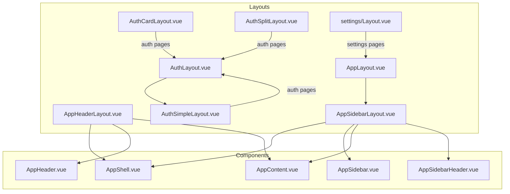
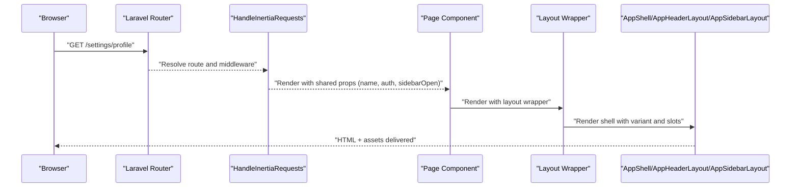
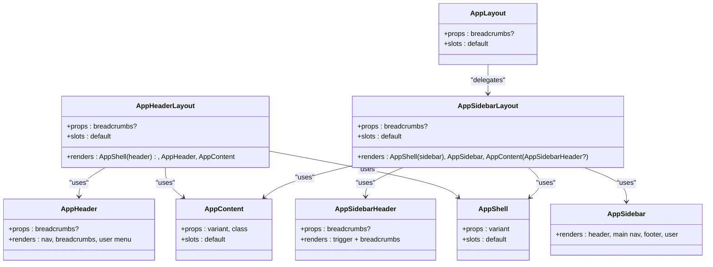
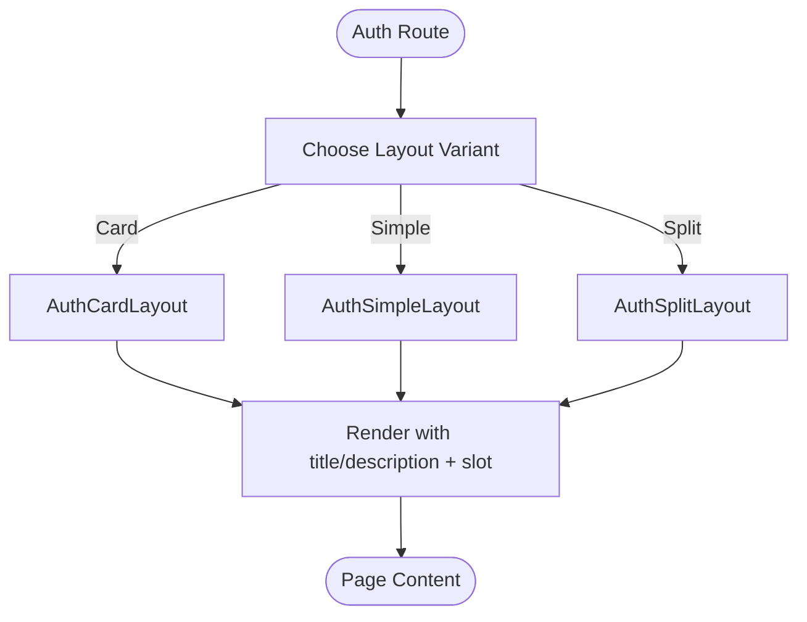
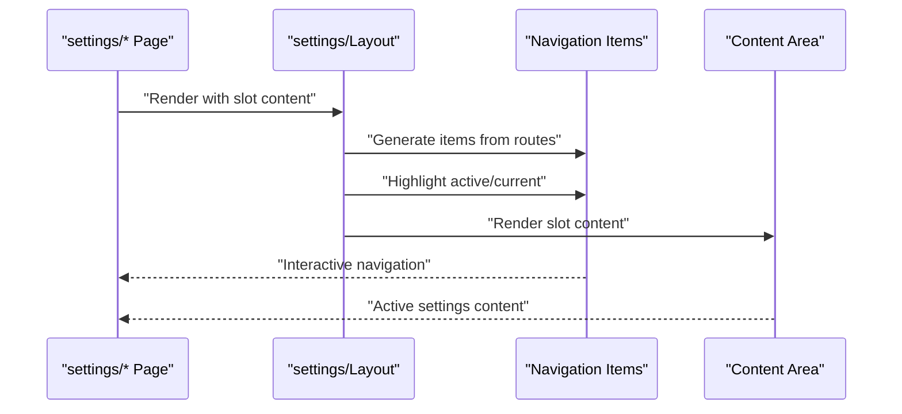
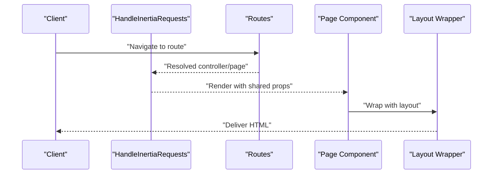
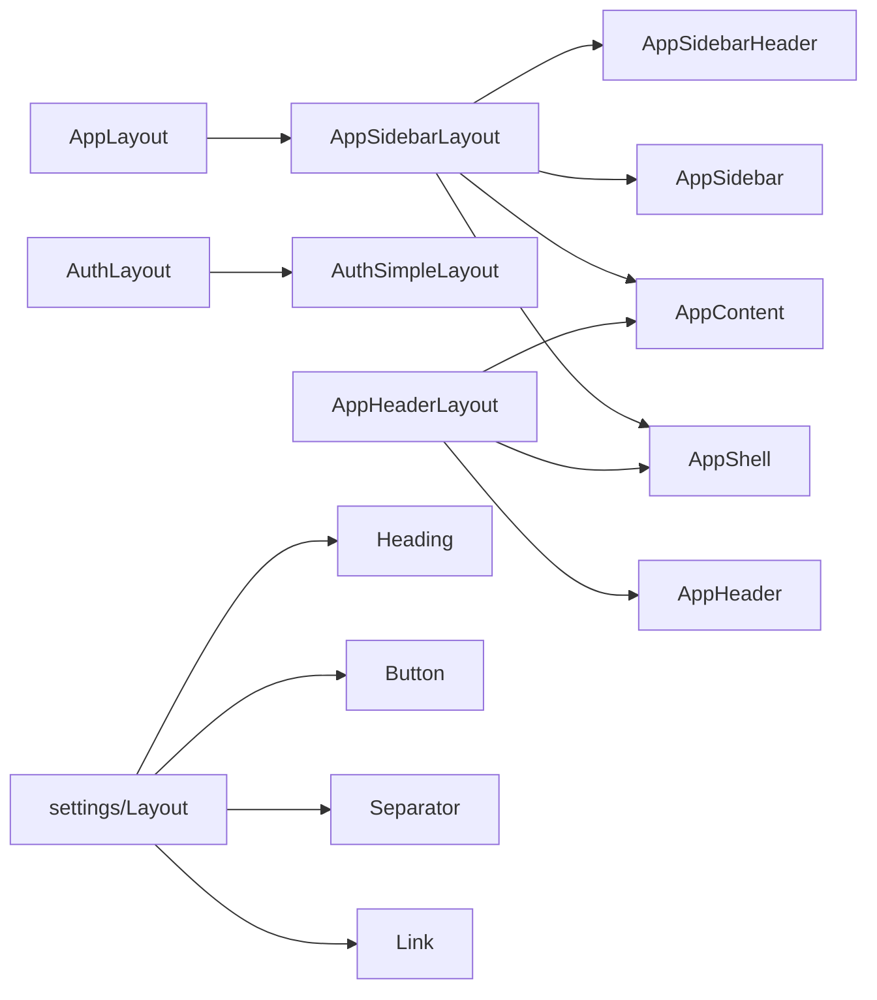
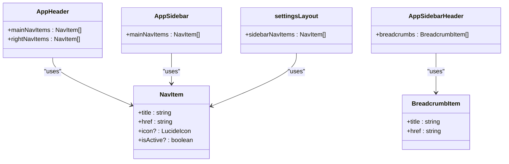
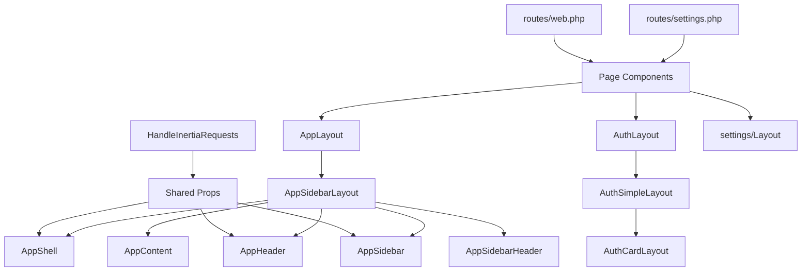

# Layout System & Page Structure

<cite>
**Referenced Files in This Document**
- [AppLayout.vue](file://resources/js/layouts/AppLayout.vue)
- [AuthLayout.vue](file://resources/js/layouts/AuthLayout.vue)
- [AppHeaderLayout.vue](file://resources/js/layouts/app/AppHeaderLayout.vue)
- [AppSidebarLayout.vue](file://resources/js/layouts/app/AppSidebarLayout.vue)
- [AuthCardLayout.vue](file://resources/js/layouts/auth/AuthCardLayout.vue)
- [AuthSimpleLayout.vue](file://resources/js/layouts/auth/AuthSimpleLayout.vue)
- [AuthSplitLayout.vue](file://resources/js/layouts/auth/AuthSplitLayout.vue)
- [settings/Layout.vue](file://resources/js/layouts/settings/Layout.vue)
- [AppShell.vue](file://resources/js/components/AppShell.vue)
- [AppContent.vue](file://resources/js/components/AppContent.vue)
- [AppHeader.vue](file://resources/js/components/AppHeader.vue)
- [AppSidebar.vue](file://resources/js/components/AppSidebar.vue)
- [AppSidebarHeader.vue](file://resources/js/components/AppSidebarHeader.vue)
- [navigation.ts](file://resources/js/types/navigation.ts)
- [HandleInertiaRequests.php](file://app/Http/Middleware/HandleInertiaRequests.php)
- [web.php](file://routes/web.php)
- [settings.php](file://routes/settings.php)
- [global.d.ts](file://resources/js/types/global.d.ts)
</cite>

## Table of Contents
1. [Introduction](#introduction)
2. [Project Structure](#project-structure)
3. [Core Components](#core-components)
4. [Architecture Overview](#architecture-overview)
5. [Detailed Component Analysis](#detailed-component-analysis)
6. [Dependency Analysis](#dependency-analysis)
7. [Performance Considerations](#performance-considerations)
8. [Troubleshooting Guide](#troubleshooting-guide)
9. [Conclusion](#conclusion)

## Introduction
This document explains the layout system architecture used by the frontend pages. It covers the main application layout, authentication layouts, and settings layouts; describes composition patterns, conditional selection via routes and middleware, and the inheritance hierarchy. It also documents responsive design integration, navigation and breadcrumbs, content area management, and practical guidance for creating and modifying layouts, including SSR considerations.

## Project Structure
The layout system is organized under resources/js/layouts with three primary families:
- Application layouts: AppLayout and app/* variants
- Authentication layouts: auth/* variants
- Settings layout: settings/Layout.vue

Shared building blocks live under resources/js/components and are composed by layouts to form cohesive page shells.

**Diagram sources**
- [AppLayout.vue:1-15](file://resources/js/layouts/AppLayout.vue#L1-L15)
- [AppHeaderLayout.vue:1-26](file://resources/js/layouts/app/AppHeaderLayout.vue#L1-L26)
- [AppSidebarLayout.vue:1-28](file://resources/js/layouts/app/AppSidebarLayout.vue#L1-L28)
- [AuthLayout.vue:1-15](file://resources/js/layouts/AuthLayout.vue#L1-L15)
- [AuthCardLayout.vue:1-51](file://resources/js/layouts/auth/AuthCardLayout.vue#L1-L51)
- [AuthSimpleLayout.vue:1-44](file://resources/js/layouts/auth/AuthSimpleLayout.vue#L1-L44)
- [AuthSplitLayout.vue:1-48](file://resources/js/layouts/auth/AuthSplitLayout.vue#L1-L48)
- [settings/Layout.vue:1-72](file://resources/js/layouts/settings/Layout.vue#L1-L72)
- [AppShell.vue:1-25](file://resources/js/components/AppShell.vue#L1-L25)
- [AppContent.vue:1-29](file://resources/js/components/AppContent.vue#L1-L29)
- [AppHeader.vue:1-284](file://resources/js/components/AppHeader.vue#L1-L284)
- [AppSidebar.vue:1-67](file://resources/js/components/AppSidebar.vue#L1-L67)
- [AppSidebarHeader.vue:1-28](file://resources/js/components/AppSidebarHeader.vue#L1-L28)

**Section sources**
- [AppLayout.vue:1-15](file://resources/js/layouts/AppLayout.vue#L1-L15)
- [AuthLayout.vue:1-15](file://resources/js/layouts/AuthLayout.vue#L1-L15)
- [AppHeaderLayout.vue:1-26](file://resources/js/layouts/app/AppHeaderLayout.vue#L1-L26)
- [AppSidebarLayout.vue:1-28](file://resources/js/layouts/app/AppSidebarLayout.vue#L1-L28)
- [AuthCardLayout.vue:1-51](file://resources/js/layouts/auth/AuthCardLayout.vue#L1-L51)
- [AuthSimpleLayout.vue:1-44](file://resources/js/layouts/auth/AuthSimpleLayout.vue#L1-L44)
- [AuthSplitLayout.vue:1-48](file://resources/js/layouts/auth/AuthSplitLayout.vue#L1-L48)
- [settings/Layout.vue:1-72](file://resources/js/layouts/settings/Layout.vue#L1-L72)
- [AppShell.vue:1-25](file://resources/js/components/AppShell.vue#L1-L25)
- [AppContent.vue:1-29](file://resources/js/components/AppContent.vue#L1-L29)
- [AppHeader.vue:1-284](file://resources/js/components/AppHeader.vue#L1-L284)
- [AppSidebar.vue:1-67](file://resources/js/components/AppSidebar.vue#L1-L67)
- [AppSidebarHeader.vue:1-28](file://resources/js/components/AppSidebarHeader.vue#L1-L28)

## Core Components
- AppLayout: A convenience wrapper that delegates to the sidebar-based app layout while passing optional breadcrumbs.
- AppHeaderLayout: Header-based shell with header, content area, and toast integration.
- AppSidebarLayout: Sidebar-based shell with sidebar, content area, optional breadcrumbs header, and toast integration.
- AuthLayout: A convenience wrapper that delegates to the simple auth layout while accepting title and description.
- AuthCardLayout: Card-based auth layout with logo, title/description, and centered card content.
- AuthSimpleLayout: Minimal centered auth layout with logo, title/description, and slot for form content.
- AuthSplitLayout: Two-column split auth layout with branding and content areas.
- settings/Layout: Settings shell with a heading, vertical navigation, and content area.

Key shared components:
- AppShell: Provides the root shell container with variant switching and sidebar provider integration.
- AppContent: Renders either a sidebar inset or a main content container depending on variant.
- AppHeader: Desktop/mobile navigation, breadcrumbs bar, and user menu.
- AppSidebar: Collapsible sidebar with main nav, footer links, and user info.
- AppSidebarHeader: Sidebar-aware header with trigger and breadcrumbs.

**Section sources**
- [AppLayout.vue:1-15](file://resources/js/layouts/AppLayout.vue#L1-L15)
- [AppHeaderLayout.vue:1-26](file://resources/js/layouts/app/AppHeaderLayout.vue#L1-L26)
- [AppSidebarLayout.vue:1-28](file://resources/js/layouts/app/AppSidebarLayout.vue#L1-L28)
- [AuthLayout.vue:1-15](file://resources/js/layouts/AuthLayout.vue#L1-L15)
- [AuthCardLayout.vue:1-51](file://resources/js/layouts/auth/AuthCardLayout.vue#L1-L51)
- [AuthSimpleLayout.vue:1-44](file://resources/js/layouts/auth/AuthSimpleLayout.vue#L1-L44)
- [AuthSplitLayout.vue:1-48](file://resources/js/layouts/auth/AuthSplitLayout.vue#L1-L48)
- [settings/Layout.vue:1-72](file://resources/js/layouts/settings/Layout.vue#L1-L72)
- [AppShell.vue:1-25](file://resources/js/components/AppShell.vue#L1-L25)
- [AppContent.vue:1-29](file://resources/js/components/AppContent.vue#L1-L29)
- [AppHeader.vue:1-284](file://resources/js/components/AppHeader.vue#L1-L284)
- [AppSidebar.vue:1-67](file://resources/js/components/AppSidebar.vue#L1-L67)
- [AppSidebarHeader.vue:1-28](file://resources/js/components/AppSidebarHeader.vue#L1-L28)

## Architecture Overview
The layout system composes reusable components into page shells. Layouts delegate to specific shells (header or sidebar) and pass through shared UI primitives. Routes and middleware influence which layout is used implicitly by selecting page components that wrap themselves in the appropriate layout.

**Diagram sources**
- [web.php:1-32](file://routes/web.php#L1-L32)
- [settings.php:1-35](file://routes/settings.php#L1-L35)
- [HandleInertiaRequests.php:1-48](file://app/Http/Middleware/HandleInertiaRequests.php#L1-L48)
- [AppLayout.vue:1-15](file://resources/js/layouts/AppLayout.vue#L1-L15)
- [AppHeaderLayout.vue:1-26](file://resources/js/layouts/app/AppHeaderLayout.vue#L1-L26)
- [AppSidebarLayout.vue:1-28](file://resources/js/layouts/app/AppSidebarLayout.vue#L1-L28)
- [AppShell.vue:1-25](file://resources/js/components/AppShell.vue#L1-L25)

## Detailed Component Analysis

### Application Layout Family
- AppLayout: Delegates to AppSidebarLayout and forwards breadcrumbs.
- AppHeaderLayout: Uses header variant shell, renders AppHeader and AppContent, and includes toast support.
- AppSidebarLayout: Uses sidebar variant shell, renders AppSidebar and AppContent, conditionally shows AppSidebarHeader with breadcrumbs, and includes toast support.

Composition pattern:
- Variants are controlled by AppShell via a variant prop.
- AppContent switches between sidebar inset and main content container based on variant.
- AppHeader and AppSidebarHeader integrate breadcrumbs and navigation triggers.

Responsive behavior:
- AppHeader switches between mobile Sheet menu and desktop NavigationMenu.
- AppSidebar is collapsible and inset, with a trigger in AppSidebarHeader.
- AppShell conditionally wraps children in SidebarProvider for sidebar variant.

**Diagram sources**
- [AppLayout.vue:1-15](file://resources/js/layouts/AppLayout.vue#L1-L15)
- [AppHeaderLayout.vue:1-26](file://resources/js/layouts/app/AppHeaderLayout.vue#L1-L26)
- [AppSidebarLayout.vue:1-28](file://resources/js/layouts/app/AppSidebarLayout.vue#L1-L28)
- [AppShell.vue:1-25](file://resources/js/components/AppShell.vue#L1-L25)
- [AppContent.vue:1-29](file://resources/js/components/AppContent.vue#L1-L29)
- [AppHeader.vue:1-284](file://resources/js/components/AppHeader.vue#L1-L284)
- [AppSidebar.vue:1-67](file://resources/js/components/AppSidebar.vue#L1-L67)
- [AppSidebarHeader.vue:1-28](file://resources/js/components/AppSidebarHeader.vue#L1-L28)

**Section sources**
- [AppLayout.vue:1-15](file://resources/js/layouts/AppLayout.vue#L1-L15)
- [AppHeaderLayout.vue:1-26](file://resources/js/layouts/app/AppHeaderLayout.vue#L1-L26)
- [AppSidebarLayout.vue:1-28](file://resources/js/layouts/app/AppSidebarLayout.vue#L1-L28)
- [AppShell.vue:1-25](file://resources/js/components/AppShell.vue#L1-L25)
- [AppContent.vue:1-29](file://resources/js/components/AppContent.vue#L1-L29)
- [AppHeader.vue:1-284](file://resources/js/components/AppHeader.vue#L1-L284)
- [AppSidebar.vue:1-67](file://resources/js/components/AppSidebar.vue#L1-L67)
- [AppSidebarHeader.vue:1-28](file://resources/js/components/AppSidebarHeader.vue#L1-L28)

### Authentication Layout Family
- AuthLayout: Delegates to AuthSimpleLayout and forwards title and description.
- AuthCardLayout: Centers content in a card with logo, title/description, and slot for form content.
- AuthSimpleLayout: Minimal centered layout with logo, title/description, and slot for form content.
- AuthSplitLayout: Two-column layout with branding column and content column; reads page name for branding.

Selection pattern:
- Pages under authentication routes render with wrappers that use the auth layouts.
- AuthCardLayout is suitable for forms requiring a contained card.
- AuthSimpleLayout is minimal and clean for straightforward auth flows.
- AuthSplitLayout is ideal for marketing-style auth pages with brand presence.

**Diagram sources**
- [AuthLayout.vue:1-15](file://resources/js/layouts/AuthLayout.vue#L1-L15)
- [AuthCardLayout.vue:1-51](file://resources/js/layouts/auth/AuthCardLayout.vue#L1-L51)
- [AuthSimpleLayout.vue:1-44](file://resources/js/layouts/auth/AuthSimpleLayout.vue#L1-L44)
- [AuthSplitLayout.vue:1-48](file://resources/js/layouts/auth/AuthSplitLayout.vue#L1-L48)

**Section sources**
- [AuthLayout.vue:1-15](file://resources/js/layouts/AuthLayout.vue#L1-L15)
- [AuthCardLayout.vue:1-51](file://resources/js/layouts/auth/AuthCardLayout.vue#L1-L51)
- [AuthSimpleLayout.vue:1-44](file://resources/js/layouts/auth/AuthSimpleLayout.vue#L1-L44)
- [AuthSplitLayout.vue:1-48](file://resources/js/layouts/auth/AuthSplitLayout.vue#L1-L48)

### Settings Layout
- settings/Layout: Provides a two-column layout with a heading, a vertical navigation list, and a content area.
- Navigation items are generated from route helpers and styled conditionally based on the current URL.
- Responsive behavior: navigation stacks vertically on small screens; separator visually separates on narrow viewports.

**Diagram sources**
- [settings/Layout.vue:1-72](file://resources/js/layouts/settings/Layout.vue#L1-L72)

**Section sources**
- [settings/Layout.vue:1-72](file://resources/js/layouts/settings/Layout.vue#L1-L72)

### Conditional Layout Selection Based on Routes and Middleware
- Root template is configured server-side so all Inertia responses use the same root.
- Middleware shares application name, authentication state, and sidebar open state with the client.
- Routes select page components; page components choose layouts via wrapper components:
  - Application routes render pages inside AppLayout (which uses AppSidebarLayout).
  - Settings routes render pages inside settings/Layout.
  - Authentication routes render pages inside AuthLayout (which uses AuthSimpleLayout).

**Diagram sources**
- [HandleInertiaRequests.php:1-48](file://app/Http/Middleware/HandleInertiaRequests.php#L1-L48)
- [web.php:1-32](file://routes/web.php#L1-L32)
- [settings.php:1-35](file://routes/settings.php#L1-L35)
- [AppLayout.vue:1-15](file://resources/js/layouts/AppLayout.vue#L1-L15)
- [AuthLayout.vue:1-15](file://resources/js/layouts/AuthLayout.vue#L1-L15)
- [settings/Layout.vue:1-72](file://resources/js/layouts/settings/Layout.vue#L1-L72)

**Section sources**
- [HandleInertiaRequests.php:1-48](file://app/Http/Middleware/HandleInertiaRequests.php#L1-L48)
- [web.php:1-32](file://routes/web.php#L1-L32)
- [settings.php:1-35](file://routes/settings.php#L1-L35)
- [global.d.ts:16-25](file://resources/js/types/global.d.ts#L16-L25)

### Layout Inheritance and Composition Hierarchies
- AppLayout inherits from AppSidebarLayout (layout-to-layout delegation).
- AuthLayout inherits from AuthSimpleLayout (layout-to-layout delegation).
- AppSidebarLayout composes AppShell, AppSidebar, AppContent, and AppSidebarHeader.
- AppHeaderLayout composes AppShell, AppHeader, and AppContent.
- settings/Layout composes Heading, Button, Separator, and Link to build navigation and content.

**Diagram sources**
- [AppLayout.vue:1-15](file://resources/js/layouts/AppLayout.vue#L1-L15)
- [AppSidebarLayout.vue:1-28](file://resources/js/layouts/app/AppSidebarLayout.vue#L1-L28)
- [AuthLayout.vue:1-15](file://resources/js/layouts/AuthLayout.vue#L1-L15)
- [AuthSimpleLayout.vue:1-44](file://resources/js/layouts/auth/AuthSimpleLayout.vue#L1-L44)
- [AppHeaderLayout.vue:1-26](file://resources/js/layouts/app/AppHeaderLayout.vue#L1-L26)
- [AppShell.vue:1-25](file://resources/js/components/AppShell.vue#L1-L25)
- [AppContent.vue:1-29](file://resources/js/components/AppContent.vue#L1-L29)
- [AppSidebar.vue:1-67](file://resources/js/components/AppSidebar.vue#L1-L67)
- [AppSidebarHeader.vue:1-28](file://resources/js/components/AppSidebarHeader.vue#L1-L28)
- [settings/Layout.vue:1-72](file://resources/js/layouts/settings/Layout.vue#L1-L72)

**Section sources**
- [AppLayout.vue:1-15](file://resources/js/layouts/AppLayout.vue#L1-L15)
- [AuthLayout.vue:1-15](file://resources/js/layouts/AuthLayout.vue#L1-L15)
- [AppHeaderLayout.vue:1-26](file://resources/js/layouts/app/AppHeaderLayout.vue#L1-L26)
- [AppSidebarLayout.vue:1-28](file://resources/js/layouts/app/AppSidebarLayout.vue#L1-L28)
- [settings/Layout.vue:1-72](file://resources/js/layouts/settings/Layout.vue#L1-L72)

### Responsive Design Implementation
- AppHeader:
  - Mobile-first with Sheet-triggered drawer menu for navigation and external links.
  - Desktop NavigationMenu with tooltips for external links.
  - Breadcrumbs bar appears below header when breadcrumbs exist.
- AppSidebar:
  - Collapsible inset sidebar with trigger in AppSidebarHeader.
  - Responsive breakpoint toggles mobile vs desktop navigation.
- AppShell:
  - Variant-driven rendering: header vs sidebar modes.
  - SidebarProvider manages sidebar state and default open state.
- settings/Layout:
  - Responsive two-column layout; navigation stacks below content on small screens.
  - Separator visually separates navigation and content on narrow viewports.

**Section sources**
- [AppHeader.vue:1-284](file://resources/js/components/AppHeader.vue#L1-L284)
- [AppSidebar.vue:1-67](file://resources/js/components/AppSidebar.vue#L1-L67)
- [AppShell.vue:1-25](file://resources/js/components/AppShell.vue#L1-L25)
- [AppSidebarHeader.vue:1-28](file://resources/js/components/AppSidebarHeader.vue#L1-L28)
- [settings/Layout.vue:1-72](file://resources/js/layouts/settings/Layout.vue#L1-L72)

### Navigation Integration and Breadcrumbs
- Navigation items are typed via NavItem and BreadcrumbItem.
- AppHeader defines main and external navigation items and applies active styles based on current URL.
- AppSidebar mirrors main navigation in a sidebar context.
- AppSidebarHeader integrates a SidebarTrigger and displays breadcrumbs when present.
- settings/Layout builds navigation from route helpers and highlights active items.

**Diagram sources**
- [navigation.ts:1-15](file://resources/js/types/navigation.ts#L1-L15)
- [AppHeader.vue:1-284](file://resources/js/components/AppHeader.vue#L1-L284)
- [AppSidebar.vue:1-67](file://resources/js/components/AppSidebar.vue#L1-L67)
- [AppSidebarHeader.vue:1-28](file://resources/js/components/AppSidebarHeader.vue#L1-L28)
- [settings/Layout.vue:1-72](file://resources/js/layouts/settings/Layout.vue#L1-L72)

**Section sources**
- [navigation.ts:1-15](file://resources/js/types/navigation.ts#L1-L15)
- [AppHeader.vue:1-284](file://resources/js/components/AppHeader.vue#L1-L284)
- [AppSidebar.vue:1-67](file://resources/js/components/AppSidebar.vue#L1-L67)
- [AppSidebarHeader.vue:1-28](file://resources/js/components/AppSidebarHeader.vue#L1-L28)
- [settings/Layout.vue:1-72](file://resources/js/layouts/settings/Layout.vue#L1-L72)

### Content Area Management
- AppContent:
  - Sidebar variant renders as SidebarInset for proper spacing and scrolling.
  - Header variant renders as a main content container with max width and padding.
- AppSidebarHeader:
  - Provides a compact header with trigger and breadcrumbs for sidebar mode.
- settings/Layout:
  - Uses a two-column layout with a fixed-width navigation column and flexible content area.

**Section sources**
- [AppContent.vue:1-29](file://resources/js/components/AppContent.vue#L1-L29)
- [AppSidebarHeader.vue:1-28](file://resources/js/components/AppSidebarHeader.vue#L1-L28)
- [settings/Layout.vue:1-72](file://resources/js/layouts/settings/Layout.vue#L1-L72)

### Creating Custom Layouts
- Duplicate an existing layout and adjust the variant and included components.
- For new variants, create a new AppShell variant and update AppContent to handle it.
- Add new navigation items by extending the relevant NavItem arrays in AppHeader/AppSidebar or settings/Layout.
- Use typed props from navigation.ts to maintain consistency.

**Section sources**
- [AppShell.vue:1-25](file://resources/js/components/AppShell.vue#L1-L25)
- [AppContent.vue:1-29](file://resources/js/components/AppContent.vue#L1-L29)
- [AppHeader.vue:1-284](file://resources/js/components/AppHeader.vue#L1-L284)
- [AppSidebar.vue:1-67](file://resources/js/components/AppSidebar.vue#L1-L67)
- [settings/Layout.vue:1-72](file://resources/js/layouts/settings/Layout.vue#L1-L72)
- [navigation.ts:1-15](file://resources/js/types/navigation.ts#L1-L15)

### Modifying Existing Layouts
- Adjust breadcrumbs by updating the breadcrumbs prop passed to AppHeaderLayout or AppSidebarLayout.
- Change navigation by editing NavItem arrays in AppHeader/AppSidebar or settings/Layout.
- Modify responsive behavior by adjusting breakpoints and conditional rendering in AppHeader and AppSidebar.
- Update styling by editing component templates and Tailwind classes.

**Section sources**
- [AppHeaderLayout.vue:1-26](file://resources/js/layouts/app/AppHeaderLayout.vue#L1-L26)
- [AppSidebarLayout.vue:1-28](file://resources/js/layouts/app/AppSidebarLayout.vue#L1-L28)
- [AppHeader.vue:1-284](file://resources/js/components/AppHeader.vue#L1-L284)
- [AppSidebar.vue:1-67](file://resources/js/components/AppSidebar.vue#L1-L67)
- [settings/Layout.vue:1-72](file://resources/js/layouts/settings/Layout.vue#L1-L72)

### Layout-Specific Functionality
- Toast notifications: Integrated via Toaster in AppHeaderLayout and AppSidebarLayout.
- Sidebar state: Controlled by shared prop from middleware; AppShell respects sidebarOpen.
- Active navigation highlighting: Implemented via URL comparison utilities in AppHeader and settings/Layout.

**Section sources**
- [AppHeaderLayout.vue:1-26](file://resources/js/layouts/app/AppHeaderLayout.vue#L1-L26)
- [AppSidebarLayout.vue:1-28](file://resources/js/layouts/app/AppSidebarLayout.vue#L1-L28)
- [HandleInertiaRequests.php:1-48](file://app/Http/Middleware/HandleInertiaRequests.php#L1-L48)
- [AppShell.vue:1-25](file://resources/js/components/AppShell.vue#L1-L25)
- [AppHeader.vue:1-284](file://resources/js/components/AppHeader.vue#L1-L284)
- [settings/Layout.vue:1-72](file://resources/js/layouts/settings/Layout.vue#L1-L72)

## Dependency Analysis
The layout system exhibits low coupling and high cohesion:
- Layouts depend on shared components (AppShell, AppContent, AppHeader, AppSidebar, AppSidebarHeader).
- Route selection determines which page component is rendered; page components then choose the appropriate layout wrapper.
- Middleware supplies shared props consumed by layouts and components.

**Diagram sources**
- [HandleInertiaRequests.php:1-48](file://app/Http/Middleware/HandleInertiaRequests.php#L1-L48)
- [web.php:1-32](file://routes/web.php#L1-L32)
- [settings.php:1-35](file://routes/settings.php#L1-L35)
- [AppLayout.vue:1-15](file://resources/js/layouts/AppLayout.vue#L1-L15)
- [AuthLayout.vue:1-15](file://resources/js/layouts/AuthLayout.vue#L1-L15)
- [AppHeaderLayout.vue:1-26](file://resources/js/layouts/app/AppHeaderLayout.vue#L1-L26)
- [AppSidebarLayout.vue:1-28](file://resources/js/layouts/app/AppSidebarLayout.vue#L1-L28)
- [AppHeader.vue:1-284](file://resources/js/components/AppHeader.vue#L1-L284)
- [AppSidebar.vue:1-67](file://resources/js/components/AppSidebar.vue#L1-L67)
- [AppShell.vue:1-25](file://resources/js/components/AppShell.vue#L1-L25)
- [AppContent.vue:1-29](file://resources/js/components/AppContent.vue#L1-L29)
- [AppSidebarHeader.vue:1-28](file://resources/js/components/AppSidebarHeader.vue#L1-L28)
- [settings/Layout.vue:1-72](file://resources/js/layouts/settings/Layout.vue#L1-L72)

**Section sources**
- [HandleInertiaRequests.php:1-48](file://app/Http/Middleware/HandleInertiaRequests.php#L1-L48)
- [web.php:1-32](file://routes/web.php#L1-L32)
- [settings.php:1-35](file://routes/settings.php#L1-L35)
- [AppLayout.vue:1-15](file://resources/js/layouts/AppLayout.vue#L1-L15)
- [AuthLayout.vue:1-15](file://resources/js/layouts/AuthLayout.vue#L1-L15)
- [AppHeaderLayout.vue:1-26](file://resources/js/layouts/app/AppHeaderLayout.vue#L1-L26)
- [AppSidebarLayout.vue:1-28](file://resources/js/layouts/app/AppSidebarLayout.vue#L1-L28)
- [AppHeader.vue:1-284](file://resources/js/components/AppHeader.vue#L1-L284)
- [AppSidebar.vue:1-67](file://resources/js/components/AppSidebar.vue#L1-L67)
- [AppShell.vue:1-25](file://resources/js/components/AppShell.vue#L1-L25)
- [AppContent.vue:1-29](file://resources/js/components/AppContent.vue#L1-L29)
- [AppSidebarHeader.vue:1-28](file://resources/js/components/AppSidebarHeader.vue#L1-L28)
- [settings/Layout.vue:1-72](file://resources/js/layouts/settings/Layout.vue#L1-L72)

## Performance Considerations
- Prefer the sidebar variant for complex applications to leverage SidebarProvider and efficient layout switching.
- Minimize unnecessary re-renders by keeping layout props minimal and using computed values where appropriate.
- Use responsive breakpoints judiciously to avoid excessive DOM thrashing on small screens.
- Keep breadcrumb lists concise to reduce rendering overhead.
- Leverage shared props from middleware to avoid redundant data fetching in layouts.

## Troubleshooting Guide
Common issues and resolutions:
- Sidebar not opening/closing: Verify shared sidebarOpen prop and cookie state.
- Active navigation not highlighted: Ensure NavItem hrefs match current URL and use provided URL helpers.
- Breadcrumbs missing: Confirm breadcrumbs prop is passed to AppHeaderLayout/AppSidebarLayout and AppSidebarHeader.
- Auth layout not rendering: Confirm page component uses AuthLayout wrapper and passes title/description.

**Section sources**
- [HandleInertiaRequests.php:1-48](file://app/Http/Middleware/HandleInertiaRequests.php#L1-L48)
- [AppHeader.vue:1-284](file://resources/js/components/AppHeader.vue#L1-L284)
- [AppSidebar.vue:1-67](file://resources/js/components/AppSidebar.vue#L1-L67)
- [AppSidebarHeader.vue:1-28](file://resources/js/components/AppSidebarHeader.vue#L1-L28)
- [AuthLayout.vue:1-15](file://resources/js/layouts/AuthLayout.vue#L1-L15)
- [AppLayout.vue:1-15](file://resources/js/layouts/AppLayout.vue#L1-L15)

## Conclusion
The layout system combines reusable components with layout wrappers to deliver consistent, responsive page structures. Application, authentication, and settings layouts are composed from shared building blocks, enabling easy customization and maintenance. Route-driven selection and middleware-provided shared props ensure coherent behavior across the application, while responsive patterns and navigation integration provide a robust UX foundation.