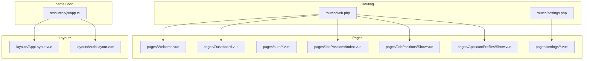
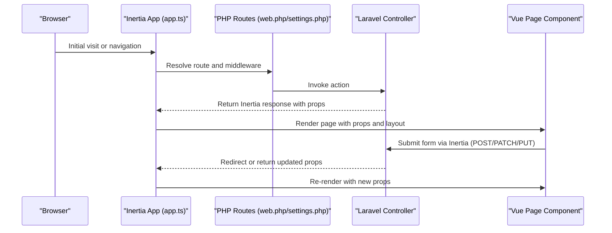
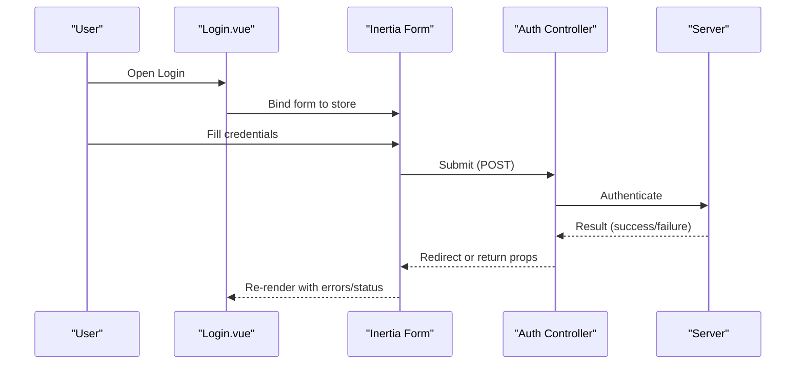
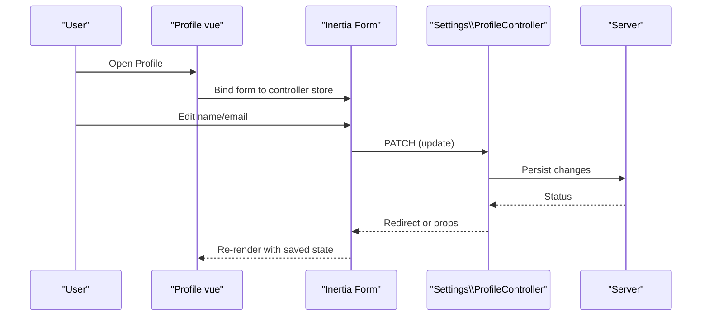
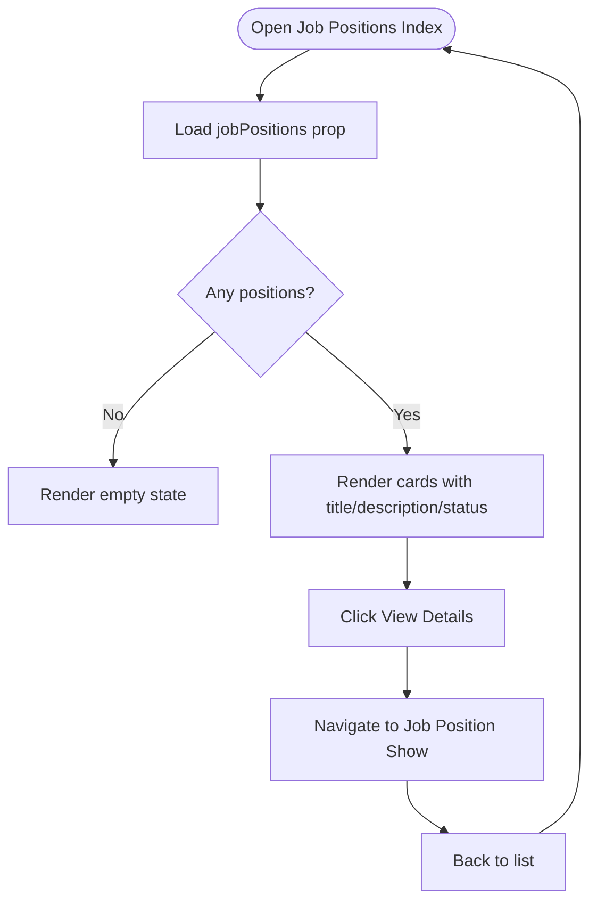
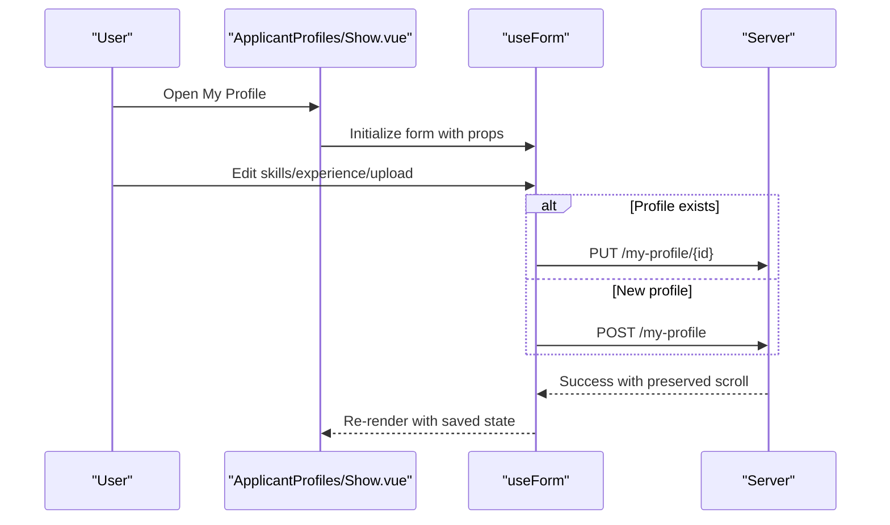
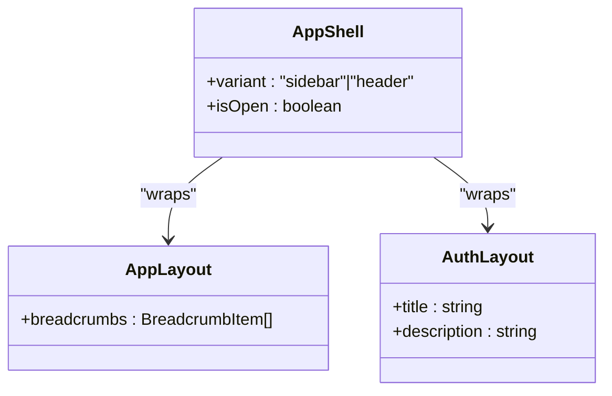
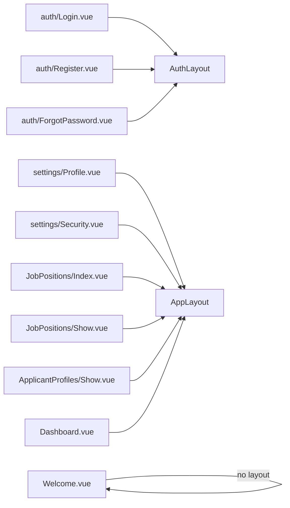

# Page Components & Views

<cite>
**Referenced Files in This Document**
- [Dashboard.vue](file://resources/js/pages/Dashboard.vue)
- [Welcome.vue](file://resources/js/pages/Welcome.vue)
- [Login.vue](file://resources/js/pages/auth/Login.vue)
- [Register.vue](file://resources/js/pages/auth/Register.vue)
- [ForgotPassword.vue](file://resources/js/pages/auth/ForgotPassword.vue)
- [Profile.vue](file://resources/js/pages/settings/Profile.vue)
- [Security.vue](file://resources/js/pages/settings/Security.vue)
- [Index.vue](file://resources/js/pages/JobPositions/Index.vue)
- [Show.vue](file://resources/js/pages/JobPositions/Show.vue)
- [Show.vue](file://resources/js/pages/ApplicantProfiles/Show.vue)
- [app.ts](file://resources/js/app.ts)
- [web.php](file://routes/web.php)
- [settings.php](file://routes/settings.php)
- [AppLayout.vue](file://resources/js/layouts/AppLayout.vue)
- [AuthLayout.vue](file://resources/js/layouts/AuthLayout.vue)
- [AppShell.vue](file://resources/js/components/AppShell.vue)
</cite>

## Table of Contents
1. [Introduction](#introduction)
2. [Project Structure](#project-structure)
3. [Core Components](#core-components)
4. [Architecture Overview](#architecture-overview)
5. [Detailed Component Analysis](#detailed-component-analysis)
6. [Dependency Analysis](#dependency-analysis)
7. [Performance Considerations](#performance-considerations)
8. [Troubleshooting Guide](#troubleshooting-guide)
9. [Conclusion](#conclusion)

## Introduction
This document explains the page components and view implementation for the Single Page Application built with Inertia.js and Vue 3. It covers:
- Page component structure and layout composition
- Data fetching patterns via Inertia props and controller actions
- User interface organization and navigation
- Authentication pages, settings pages, job position management, and applicant profile pages
- Component lifecycle, data binding, and user interaction patterns
- Examples of page-level state management, form handling, and navigation integration
- Performance optimization strategies, lazy loading, and SEO considerations

## Project Structure
The front-end uses Inertia’s render-to-client pattern to serve Vue pages with server-provided props. Routing is defined in PHP and mapped to Vue page components. Layouts are selected per page category.

**Diagram sources**
- [app.ts:10-27](file://resources/js/app.ts#L10-L27)
- [web.php:9-29](file://routes/web.php#L9-L29)
- [settings.php:8-27](file://routes/settings.php#L8-L27)
- [Welcome.vue:1-5](file://resources/js/pages/Welcome.vue#L1-L5)
- [Dashboard.vue:1-15](file://resources/js/pages/Dashboard.vue#L1-L15)
- [Index.vue:1-24](file://resources/js/pages/JobPositions/Index.vue#L1-L24)
- [Show.vue:1-33](file://resources/js/pages/JobPositions/Show.vue#L1-L33)
- [Show.vue:1-45](file://resources/js/pages/ApplicantProfiles/Show.vue#L1-L45)
- [Profile.vue:15-24](file://resources/js/pages/settings/Profile.vue#L15-L24)
- [Security.vue:22-31](file://resources/js/pages/settings/Security.vue#L22-L31)
- [AppLayout.vue:10-14](file://resources/js/layouts/AppLayout.vue#L10-L14)
- [AuthLayout.vue:10-14](file://resources/js/layouts/AuthLayout.vue#L10-L14)

**Section sources**
- [app.ts:10-27](file://resources/js/app.ts#L10-L27)
- [web.php:9-29](file://routes/web.php#L9-L29)
- [settings.php:8-27](file://routes/settings.php#L8-L27)

## Core Components
- Pages are Vue Single File Components rendered by Inertia. They declare page metadata (title, breadcrumbs) and bind to forms or props supplied by controllers.
- Layout selection is centralized in the Inertia boot file, applying different layouts based on the page name.
- Authentication pages use Inertia forms bound to route-specific stores, while settings pages bind to dedicated controllers/actions.

Key patterns:
- Head management via Inertia’s Head component
- Layout composition via wrapper components
- Form handling via Inertia Form helpers and controller-backed stores/controllers
- Navigation via Inertia Links and route helpers

**Section sources**
- [Dashboard.vue:6-15](file://resources/js/pages/Dashboard.vue#L6-L15)
- [Login.vue:16-26](file://resources/js/pages/auth/Login.vue#L16-L26)
- [Profile.vue:15-24](file://resources/js/pages/settings/Profile.vue#L15-L24)
- [Security.vue:22-31](file://resources/js/pages/settings/Security.vue#L22-L31)
- [app.ts:12-23](file://resources/js/app.ts#L12-L23)

## Architecture Overview
The SPA architecture integrates Vue pages with Laravel controllers and middleware. Pages receive props from controllers, handle user interactions via Inertia forms, and navigate seamlessly without full reloads.

**Diagram sources**
- [app.ts:10-27](file://resources/js/app.ts#L10-L27)
- [web.php:9-29](file://routes/web.php#L9-L29)
- [settings.php:8-27](file://routes/settings.php#L8-L27)

## Detailed Component Analysis

### Authentication Pages
- Login: Declares layout metadata, renders a form bound to a route store, and supports passkey verification and password reset links.
- Register: Renders a registration form bound to a route store with password confirmation and rules.
- Forgot Password: Renders a reset link request form with status feedback and a return-to-login link.

**Diagram sources**
- [Login.vue:41-103](file://resources/js/pages/auth/Login.vue#L41-L103)

**Section sources**
- [Login.vue:16-26](file://resources/js/pages/auth/Login.vue#L16-L26)
- [Register.vue:17-22](file://resources/js/pages/auth/Register.vue#L17-L22)
- [ForgotPassword.vue:12-17](file://resources/js/pages/auth/ForgotPassword.vue#L12-L17)

### Settings Pages
- Profile: Displays editable user profile fields, verifies email status, and binds to a controller action for updates.
- Security: Provides password update form with current password confirmation and integrates two-factor and passkey management components.

**Diagram sources**
- [Profile.vue:42-101](file://resources/js/pages/settings/Profile.vue#L42-L101)

**Section sources**
- [Profile.vue:15-24](file://resources/js/pages/settings/Profile.vue#L15-L24)
- [Security.vue:22-31](file://resources/js/pages/settings/Security.vue#L22-L31)

### Job Position Management Pages
- Index: Lists job positions with status badges, titles, and descriptions, linking to individual details.
- Show: Displays role details, requirements, benefits, and creator/post date; includes a back link and apply button.

**Diagram sources**
- [Index.vue:26-78](file://resources/js/pages/JobPositions/Index.vue#L26-L78)
- [Show.vue:35-100](file://resources/js/pages/JobPositions/Show.vue#L35-L100)

**Section sources**
- [Index.vue:14-23](file://resources/js/pages/JobPositions/Index.vue#L14-L23)
- [Show.vue:19-32](file://resources/js/pages/JobPositions/Show.vue#L19-L32)

### Applicant Profile Page
- Show: Manages skills, experience, and resume upload via a local form object; submits either create or update depending on presence of profile id.

**Diagram sources**
- [Show.vue:15-33](file://resources/js/pages/ApplicantProfiles/Show.vue#L15-L33)

**Section sources**
- [Show.vue:15-45](file://resources/js/pages/ApplicantProfiles/Show.vue#L15-L45)

### Layout Composition
- AppLayout wraps the application shell and injects breadcrumbs.
- AuthLayout wraps authentication pages with a title and description.
- AppShell conditionally applies sidebar provider or header-only layout based on variant.

**Diagram sources**
- [AppShell.vue:10-24](file://resources/js/components/AppShell.vue#L10-L24)
- [AppLayout.vue:5-7](file://resources/js/layouts/AppLayout.vue#L5-L7)
- [AuthLayout.vue:4-6](file://resources/js/layouts/AuthLayout.vue#L4-L6)

**Section sources**
- [AppLayout.vue:10-14](file://resources/js/layouts/AppLayout.vue#L10-L14)
- [AuthLayout.vue:10-14](file://resources/js/layouts/AuthLayout.vue#L10-L14)
- [AppShell.vue:17-24](file://resources/js/components/AppShell.vue#L17-L24)

## Dependency Analysis
- Page components depend on:
  - Inertia Head/title and Link for SEO/navigation
  - Localized layout wrappers for consistent UI
  - Controller-bound forms for stateful interactions
- Routing groups enforce authentication and verification middleware for protected areas.

**Diagram sources**
- [Login.vue:16-21](file://resources/js/pages/auth/Login.vue#L16-L21)
- [Register.vue:17-22](file://resources/js/pages/auth/Register.vue#L17-L22)
- [ForgotPassword.vue:12-17](file://resources/js/pages/auth/ForgotPassword.vue#L12-L17)
- [Profile.vue:15-24](file://resources/js/pages/settings/Profile.vue#L15-L24)
- [Security.vue:22-31](file://resources/js/pages/settings/Security.vue#L22-L31)
- [Index.vue:14-23](file://resources/js/pages/JobPositions/Index.vue#L14-L23)
- [Show.vue:19-32](file://resources/js/pages/JobPositions/Show.vue#L19-L32)
- [Show.vue:35-44](file://resources/js/pages/ApplicantProfiles/Show.vue#L35-L44)
- [Dashboard.vue:6-15](file://resources/js/pages/Dashboard.vue#L6-L15)
- [Welcome.vue:1-5](file://resources/js/pages/Welcome.vue#L1-L5)

**Section sources**
- [web.php:18-29](file://routes/web.php#L18-L29)
- [settings.php:8-27](file://routes/settings.php#L8-L27)

## Performance Considerations
- Prefer client-side navigation with Inertia Links to avoid full-page reloads.
- Use preserveScroll and preserveState on form submissions to reduce layout shifts and maintain user context.
- Lazy-load heavy assets and defer non-critical images; leverage IntersectionObserver for viewport-aware rendering.
- Minimize props payload by requesting only necessary fields from controllers.
- Enable browser caching for static assets and use CDN for assets.
- Keep layout wrappers lightweight; avoid unnecessary watchers or deep reactivity inside shared components.

## Troubleshooting Guide
Common issues and resolutions:
- Forms not resetting after success: ensure reset-on-success is configured on the form binding.
- Missing layout: verify the page name matches the layout selector in the Inertia boot file.
- Authentication redirects: confirm middleware groups and verified email requirements for protected routes.
- Navigation inconsistencies: use route helpers consistently and Inertia Links for SPA navigation.

**Section sources**
- [Login.vue:42-44](file://resources/js/pages/auth/Login.vue#L42-L44)
- [Profile.vue:42-46](file://resources/js/pages/settings/Profile.vue#L42-L46)
- [web.php:18-29](file://routes/web.php#L18-L29)
- [settings.php:8-27](file://routes/settings.php#L8-L27)

## Conclusion
The page components and views are structured around Inertia’s render-to-client paradigm, enabling fast, seamless navigation and robust form handling. Centralized layout selection and route-driven props provide a consistent UX, while middleware ensures secure access to sensitive areas. Following the outlined patterns and performance recommendations will help maintain a responsive, accessible, and scalable SPA.