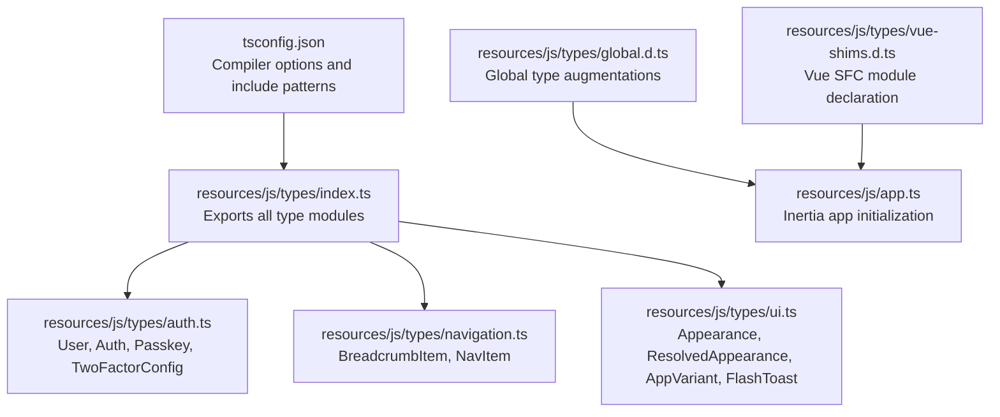
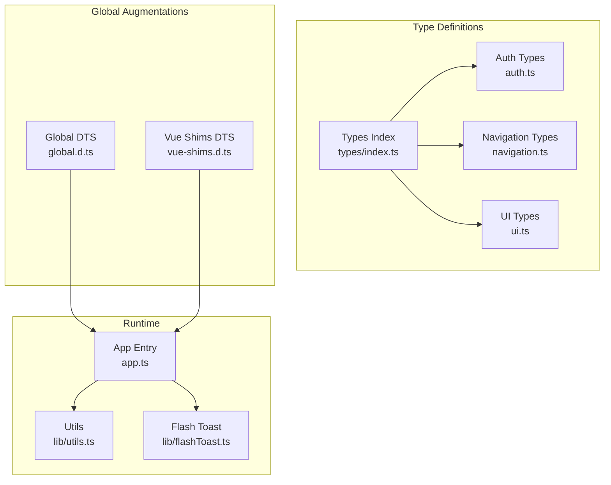
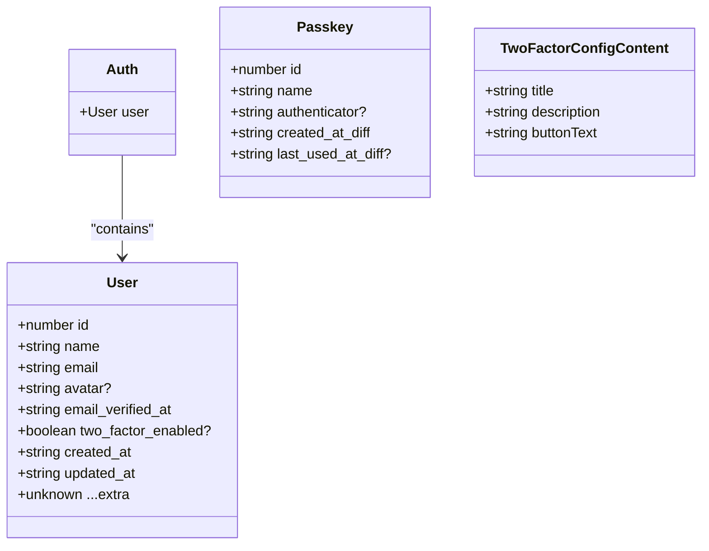
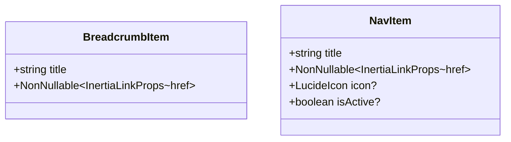
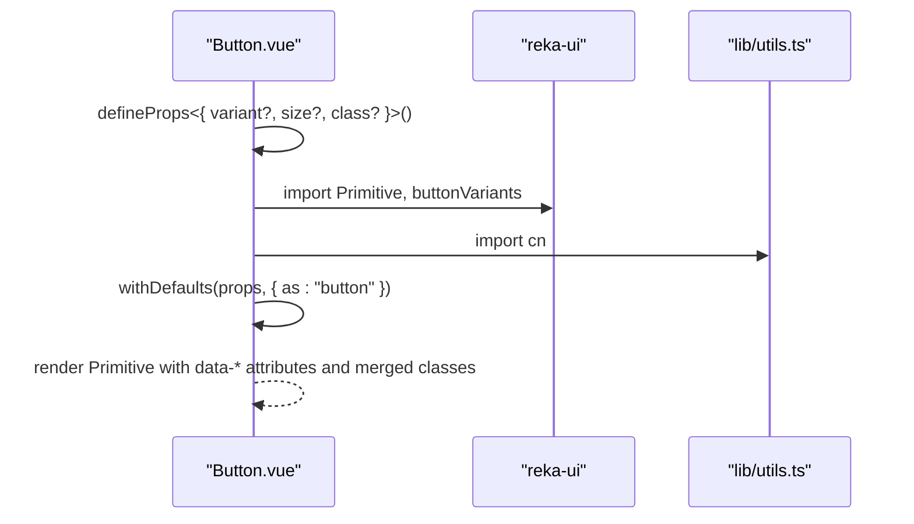
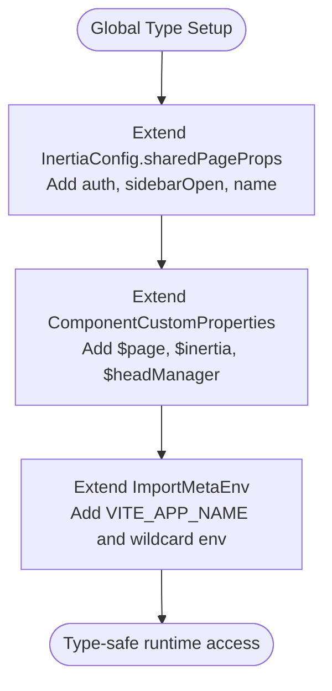
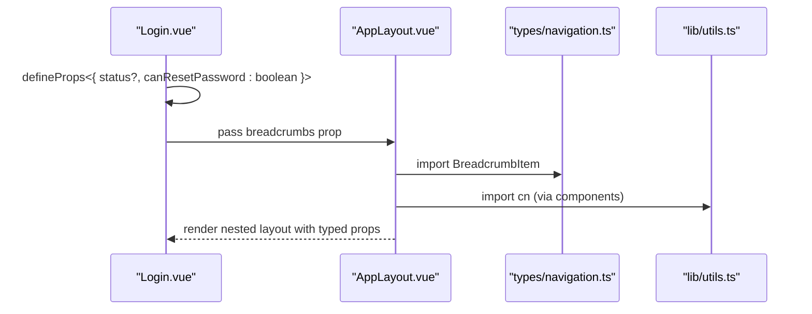
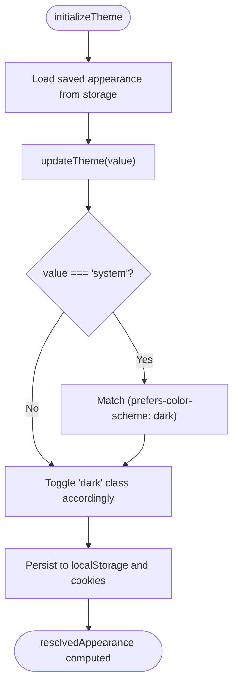
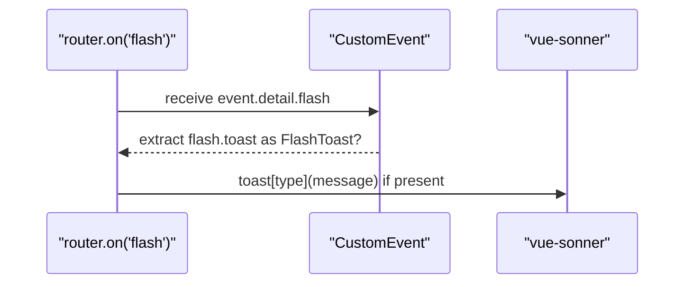
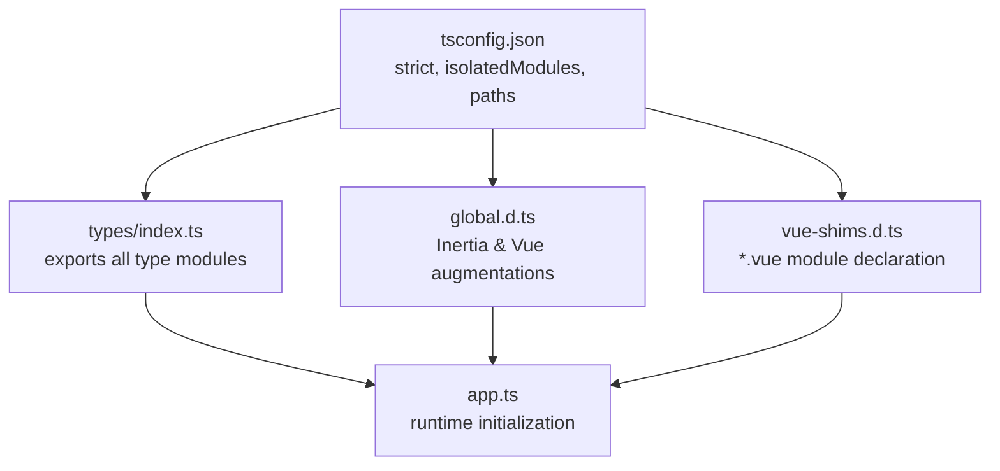

# TypeScript Integration & Type System

<cite>
**Referenced Files in This Document**
- [tsconfig.json](file://tsconfig.json)
- [package.json](file://package.json)
- [resources/js/types/index.ts](file://resources/js/types/index.ts)
- [resources/js/types/global.d.ts](file://resources/js/types/global.d.ts)
- [resources/js/types/vue-shims.d.ts](file://resources/js/types/vue-shims.d.ts)
- [resources/js/types/auth.ts](file://resources/js/types/auth.ts)
- [resources/js/types/navigation.ts](file://resources/js/types/navigation.ts)
- [resources/js/types/ui.ts](file://resources/js/types/ui.ts)
- [resources/js/app.ts](file://resources/js/app.ts)
- [resources/js/components/ui/button/Button.vue](file://resources/js/components/ui/button/Button.vue)
- [resources/js/components/ui/card/Card.vue](file://resources/js/components/ui/card/Card.vue)
- [resources/js/composables/useAppearance.ts](file://resources/js/composables/useAppearance.ts)
- [resources/js/lib/utils.ts](file://resources/js/lib/utils.ts)
- [resources/js/layouts/AppLayout.vue](file://resources/js/layouts/AppLayout.vue)
- [resources/js/pages/auth/Login.vue](file://resources/js/pages/auth/Login.vue)
- [resources/js/lib/flashToast.ts](file://resources/js/lib/flashToast.ts)
</cite>

## Table of Contents
1. [Introduction](#introduction)
2. [Project Structure](#project-structure)
3. [Core Components](#core-components)
4. [Architecture Overview](#architecture-overview)
5. [Detailed Component Analysis](#detailed-component-analysis)
6. [Dependency Analysis](#dependency-analysis)
7. [Performance Considerations](#performance-considerations)
8. [Troubleshooting Guide](#troubleshooting-guide)
9. [Conclusion](#conclusion)

## Introduction
This document provides comprehensive TypeScript integration and type system documentation for the frontend architecture. It covers the type definitions for authentication, navigation, and UI components, along with Vue component typing patterns, global type declarations, and Vue component type augmentations. It also includes guidance on type checking configuration, IDE integration, and best practices for type-safe development.

## Project Structure
The frontend TypeScript setup centers around a dedicated types directory that exports unified type definitions and augments global interfaces for Inertia and Vue. The configuration ensures strict type checking and seamless integration with Vite and Vue SFCs.



**Diagram sources**
- [tsconfig.json:1-126](file://tsconfig.json#L1-L126)
- [resources/js/types/index.ts:1-4](file://resources/js/types/index.ts#L1-L4)
- [resources/js/types/global.d.ts:1-34](file://resources/js/types/global.d.ts#L1-L34)
- [resources/js/types/vue-shims.d.ts:1-6](file://resources/js/types/vue-shims.d.ts#L1-L6)
- [resources/js/types/auth.ts:1-32](file://resources/js/types/auth.ts#L1-L32)
- [resources/js/types/navigation.ts:1-15](file://resources/js/types/navigation.ts#L1-L15)
- [resources/js/types/ui.ts:1-10](file://resources/js/types/ui.ts#L1-L10)
- [resources/js/app.ts:1-34](file://resources/js/app.ts#L1-L34)

**Section sources**
- [tsconfig.json:1-126](file://tsconfig.json#L1-L126)
- [resources/js/types/index.ts:1-4](file://resources/js/types/index.ts#L1-L4)
- [resources/js/types/global.d.ts:1-34](file://resources/js/types/global.d.ts#L1-L34)
- [resources/js/types/vue-shims.d.ts:1-6](file://resources/js/types/vue-shims.d.ts#L1-L6)
- [resources/js/app.ts:1-34](file://resources/js/app.ts#L1-L34)

## Core Components
This section documents the primary type categories and their roles in the application.

- Authentication Types
  - User: Defines the authenticated user shape, including identifiers, timestamps, and optional two-factor fields.
  - Auth: Wraps the current user context for the application.
  - Passkey: Represents WebAuthn passkey entries with metadata.
  - TwoFactorConfigContent: Configuration content for two-factor flows.

- Navigation Types
  - BreadcrumbItem: Represents a single breadcrumb with a title and a non-null Inertia link href.
  - NavItem: Represents a navigable item with title, href, optional icon, and optional active state.

- UI Types
  - Appearance: Union of supported appearance modes.
  - ResolvedAppearance: Final resolved appearance after considering system preferences.
  - AppVariant: Layout variants for header and sidebar contexts.
  - FlashToast: Structure for toast notifications with type and message.

**Section sources**
- [resources/js/types/auth.ts:1-32](file://resources/js/types/auth.ts#L1-L32)
- [resources/js/types/navigation.ts:1-15](file://resources/js/types/navigation.ts#L1-L15)
- [resources/js/types/ui.ts:1-10](file://resources/js/types/ui.ts#L1-L10)

## Architecture Overview
The type system integrates with Vue components, Inertia requests, and Vite environment variables. Global augmentations extend Vue’s component properties and Inertia’s shared page props, while module declarations enable proper typing for Vue Single File Components.



**Diagram sources**
- [resources/js/types/index.ts:1-4](file://resources/js/types/index.ts#L1-L4)
- [resources/js/types/auth.ts:1-32](file://resources/js/types/auth.ts#L1-L32)
- [resources/js/types/navigation.ts:1-15](file://resources/js/types/navigation.ts#L1-L15)
- [resources/js/types/ui.ts:1-10](file://resources/js/types/ui.ts#L1-L10)
- [resources/js/types/global.d.ts:1-34](file://resources/js/types/global.d.ts#L1-L34)
- [resources/js/types/vue-shims.d.ts:1-6](file://resources/js/types/vue-shims.d.ts#L1-L6)
- [resources/js/app.ts:1-34](file://resources/js/app.ts#L1-L34)
- [resources/js/lib/utils.ts:1-13](file://resources/js/lib/utils.ts#L1-L13)
- [resources/js/lib/flashToast.ts:1-17](file://resources/js/lib/flashToast.ts#L1-L17)

## Detailed Component Analysis

### Authentication Types
Authentication types encapsulate user identity and related configuration. They are augmented into Inertia’s shared page props to ensure type-safe access across pages.



**Diagram sources**
- [resources/js/types/auth.ts:1-32](file://resources/js/types/auth.ts#L1-L32)

**Section sources**
- [resources/js/types/auth.ts:1-32](file://resources/js/types/auth.ts#L1-L32)
- [resources/js/types/global.d.ts:16-25](file://resources/js/types/global.d.ts#L16-L25)

### Navigation Types
Navigation types define breadcrumb and menu item structures, leveraging Inertia link props and Lucide icons for typed navigation components.



**Diagram sources**
- [resources/js/types/navigation.ts:4-14](file://resources/js/types/navigation.ts#L4-L14)

**Section sources**
- [resources/js/types/navigation.ts:1-15](file://resources/js/types/navigation.ts#L1-L15)

### UI Types
UI types standardize appearance modes, layout variants, and toast notification shapes used across the application.

```mermaid
classDiagram
class Appearance {
<<union>>
"light"|"dark"|"system"
}
class ResolvedAppearance {
<<union>>
"light"|"dark"
}
class AppVariant {
<<union>>
"header"|"sidebar"
}
class FlashToast {
+("success"|"info"|"warning"|"error") type
+string message
}
```

**Diagram sources**
- [resources/js/types/ui.ts:1-10](file://resources/js/types/ui.ts#L1-L10)

**Section sources**
- [resources/js/types/ui.ts:1-10](file://resources/js/types/ui.ts#L1-L10)

### Vue Component Typing Patterns
Vue components leverage TypeScript via script setup with explicit prop definitions and utility types. Examples include button variants, HTML attributes, and Tailwind class merging.



**Diagram sources**
- [resources/js/components/ui/button/Button.vue:1-32](file://resources/js/components/ui/button/Button.vue#L1-L32)
- [resources/js/lib/utils.ts:6-8](file://resources/js/lib/utils.ts#L6-L8)

**Section sources**
- [resources/js/components/ui/button/Button.vue:1-32](file://resources/js/components/ui/button/Button.vue#L1-L32)
- [resources/js/components/ui/card/Card.vue:1-23](file://resources/js/components/ui/card/Card.vue#L1-L23)
- [resources/js/lib/utils.ts:1-13](file://resources/js/lib/utils.ts#L1-L13)

### Global Type Declarations and Vue Augmentations
Global declarations extend Inertia’s shared page props and Vue’s component custom properties, enabling type-safe access to $page and $inertia within templates and composables.



**Diagram sources**
- [resources/js/types/global.d.ts:16-33](file://resources/js/types/global.d.ts#L16-L33)

**Section sources**
- [resources/js/types/global.d.ts:1-34](file://resources/js/types/global.d.ts#L1-34)

### Type-Safe Component Development Examples
- Prop definitions with union types and optional modifiers ensure safe rendering and interaction.
- Utility functions like cn merge Tailwind classes with type-safe inputs.
- Layout components consume breadcrumb arrays with typed items.



**Diagram sources**
- [resources/js/pages/auth/Login.vue:23-26](file://resources/js/pages/auth/Login.vue#L23-L26)
- [resources/js/layouts/AppLayout.vue:5-7](file://resources/js/layouts/AppLayout.vue#L5-L7)
- [resources/js/types/navigation.ts:4-7](file://resources/js/types/navigation.ts#L4-L7)
- [resources/js/lib/utils.ts:6-8](file://resources/js/lib/utils.ts#L6-L8)

**Section sources**
- [resources/js/pages/auth/Login.vue:1-111](file://resources/js/pages/auth/Login.vue#L1-L111)
- [resources/js/layouts/AppLayout.vue:1-15](file://resources/js/layouts/AppLayout.vue#L1-L15)
- [resources/js/lib/utils.ts:1-13](file://resources/js/lib/utils.ts#L1-L13)

### State Management Typing
Appearance state management demonstrates typed refs, computed values, and event handlers for theme updates and persistence.



**Diagram sources**
- [resources/js/composables/useAppearance.ts:73-124](file://resources/js/composables/useAppearance.ts#L73-L124)

**Section sources**
- [resources/js/composables/useAppearance.ts:1-125](file://resources/js/composables/useAppearance.ts#L1-L125)

### API Response Typing
Flash toast integration listens for Inertia flash events and validates the payload against the FlashToast type before rendering.



**Diagram sources**
- [resources/js/lib/flashToast.ts:5-16](file://resources/js/lib/flashToast.ts#L5-L16)
- [resources/js/types/ui.ts:6-9](file://resources/js/types/ui.ts#L6-L9)

**Section sources**
- [resources/js/lib/flashToast.ts:1-17](file://resources/js/lib/flashToast.ts#L1-L17)
- [resources/js/types/ui.ts:1-10](file://resources/js/types/ui.ts#L1-L10)

## Dependency Analysis
The type system relies on strict compiler options, module resolution, and explicit type inclusion. Vue shims and global augmentations bridge third-party libraries and runtime environments.



**Diagram sources**
- [tsconfig.json:94-117](file://tsconfig.json#L94-L117)
- [resources/js/types/index.ts:1-4](file://resources/js/types/index.ts#L1-L4)
- [resources/js/types/vue-shims.d.ts:1-6](file://resources/js/types/vue-shims.d.ts#L1-L6)
- [resources/js/types/global.d.ts:16-33](file://resources/js/types/global.d.ts#L16-L33)
- [resources/js/app.ts:1-34](file://resources/js/app.ts#L1-L34)

**Section sources**
- [tsconfig.json:1-126](file://tsconfig.json#L1-L126)
- [resources/js/types/index.ts:1-4](file://resources/js/types/index.ts#L1-L4)
- [resources/js/types/vue-shims.d.ts:1-6](file://resources/js/types/vue-shims.d.ts#L1-L6)
- [resources/js/types/global.d.ts:1-34](file://resources/js/types/global.d.ts#L1-L34)
- [resources/js/app.ts:1-34](file://resources/js/app.ts#L1-L34)

## Performance Considerations
- Keep type definitions precise to avoid unnecessary widening and improve IntelliSense accuracy.
- Prefer union types for enums and literal unions to reduce runtime checks.
- Use module declaration files sparingly to minimize global augmentation overhead.
- Leverage computed properties for derived values to avoid recomputation.

## Troubleshooting Guide
- Type checking failures: Run the type checker script to identify issues and fix immediately.
- Module resolution errors: Verify tsconfig paths and ensure module declarations are included.
- Inertia shared props: Confirm global augmentations align with actual shared page props.
- Vue SFC typing: Ensure *.vue files are recognized via module declaration and that script setup uses explicit props.

**Section sources**
- [package.json:13](file://package.json#L13)
- [tsconfig.json:36-43](file://tsconfig.json#L36-L43)
- [resources/js/types/global.d.ts:16-33](file://resources/js/types/global.d.ts#L16-L33)
- [resources/js/types/vue-shims.d.ts:1-6](file://resources/js/types/vue-shims.d.ts#L1-6)

## Conclusion
The frontend type system integrates tightly with Vue components, Inertia, and Vite to deliver a robust, type-safe development experience. By centralizing type definitions, augmenting global interfaces, and enforcing strict compiler options, the project maintains high code quality and developer productivity. Following the patterns and best practices outlined here ensures consistent type safety across components, composables, and runtime integrations.